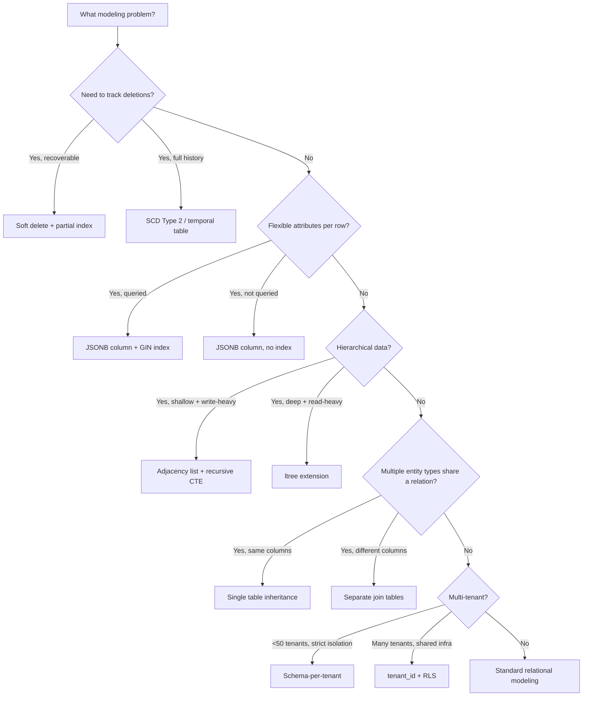

# Data Modeling Patterns for PostgreSQL

**Date:** 2026-04-19
**Tags:** `database` `data-modeling` `patterns` `postgresql` `schema-design`

---

## Table of Contents

- [Summary](#summary)
- [Soft Deletes](#soft-deletes)
- [Temporal Tables and Slowly Changing Dimensions](#temporal-tables-and-slowly-changing-dimensions)
- [Audit Trails](#audit-trails)
  - [Trigger-Based Audit](#trigger-based-audit)
  - [Application-Level Audit](#application-level-audit)
- [EAV and JSONB as Modern EAV](#eav-and-jsonb-as-modern-eav)
- [Polymorphic Associations](#polymorphic-associations)
  - [Shared FK Column (Anti-pattern)](#shared-fk-column-anti-pattern)
  - [Separate Join Tables](#separate-join-tables)
  - [Single Table Inheritance](#single-table-inheritance)
- [Tree Structures](#tree-structures)
  - [Adjacency List](#adjacency-list)
  - [Materialized Path](#materialized-path)
  - [Nested Sets](#nested-sets)
  - [ltree Extension](#ltree-extension)
- [Multi-Tenancy](#multi-tenancy)
- [UUID vs BIGSERIAL Primary Keys](#uuid-vs-bigserial-primary-keys)
- [ENUM Types vs Lookup Tables](#enum-types-vs-lookup-tables)
- [Composite Types and Domain Types](#composite-types-and-domain-types)
- [Pattern Selection Diagram](#pattern-selection-diagram)
- [Related](#related)
- [References](#references)

---

## Summary

This doc catalogs schema patterns you will encounter in production PostgreSQL systems: soft deletes, temporal data, audit logs, flexible attributes (EAV/JSONB), polymorphic associations, tree structures, multi-tenancy strategies, primary key types, and PostgreSQL's type system features. Each pattern includes trade-offs and guidance on when to apply it.

---

## Soft Deletes

Instead of `DELETE`, set a `deleted_at` timestamp. The row remains for recovery and audit.

```sql
CREATE TABLE users (
    id         BIGSERIAL PRIMARY KEY,
    email      TEXT NOT NULL,
    name       TEXT NOT NULL,
    deleted_at TIMESTAMPTZ DEFAULT NULL
);

-- Partial index: only active users (most queries)
CREATE UNIQUE INDEX idx_users_email_active ON users (email) WHERE deleted_at IS NULL;

-- Partial index: fast lookups for active rows
CREATE INDEX idx_users_active ON users (id) WHERE deleted_at IS NULL;
```

```sql
-- "Delete" a user
UPDATE users SET deleted_at = NOW() WHERE id = 42;

-- Query active users (the partial index covers this)
SELECT * FROM users WHERE deleted_at IS NULL AND email = 'jane@example.com';

-- Recovery
UPDATE users SET deleted_at = NULL WHERE id = 42;
```

**Trade-offs:**
- Every query must include `WHERE deleted_at IS NULL` (easy to forget -- use a view or RLS policy)
- Table grows without bound unless you periodically hard-delete old soft-deleted rows
- Unique constraints need to be partial (`WHERE deleted_at IS NULL`)
- JPA/Hibernate: use `@Where(clause = "deleted_at IS NULL")` or `@SQLRestriction`

```sql
-- Convenience view for application code
CREATE VIEW active_users AS
SELECT * FROM users WHERE deleted_at IS NULL;
```

---

## Temporal Tables and Slowly Changing Dimensions

SCD Type 2 tracks the full history of changes with validity periods.

```sql
CREATE TABLE products_history (
    id            BIGSERIAL PRIMARY KEY,
    product_id    BIGINT NOT NULL,
    name          TEXT NOT NULL,
    price         NUMERIC(10,2) NOT NULL,
    valid_from    TIMESTAMPTZ NOT NULL DEFAULT NOW(),
    valid_to      TIMESTAMPTZ DEFAULT NULL,  -- NULL = current version
    is_current    BOOLEAN GENERATED ALWAYS AS (valid_to IS NULL) STORED
);

-- Fast lookup for current version
CREATE UNIQUE INDEX idx_products_current
    ON products_history (product_id) WHERE valid_to IS NULL;

-- Range index for point-in-time queries
CREATE INDEX idx_products_temporal
    ON products_history (product_id, valid_from, valid_to);
```

```sql
-- Point-in-time query: what was the price on March 1st?
SELECT name, price
FROM products_history
WHERE product_id = 101
  AND valid_from <= '2026-03-01'
  AND (valid_to IS NULL OR valid_to > '2026-03-01');

-- Close current version and insert new one (in a transaction)
BEGIN;
UPDATE products_history
SET valid_to = NOW()
WHERE product_id = 101 AND valid_to IS NULL;

INSERT INTO products_history (product_id, name, price, valid_from)
VALUES (101, 'Widget Pro', 29.99, NOW());
COMMIT;
```

> PostgreSQL's `tstzrange` type and exclusion constraints can enforce non-overlapping validity periods:

```sql
CREATE EXTENSION btree_gist;

ALTER TABLE products_history
    ADD COLUMN valid_range TSTZRANGE
    GENERATED ALWAYS AS (tstzrange(valid_from, valid_to, '[)')) STORED;

ALTER TABLE products_history
    ADD CONSTRAINT no_overlap
    EXCLUDE USING GIST (product_id WITH =, valid_range WITH &&);
```

---

## Audit Trails

### Trigger-Based Audit

A generic audit table that captures all changes via triggers.

```sql
CREATE TABLE audit_log (
    id          BIGSERIAL PRIMARY KEY,
    table_name  TEXT NOT NULL,
    record_id   BIGINT NOT NULL,
    action      TEXT NOT NULL CHECK (action IN ('INSERT', 'UPDATE', 'DELETE')),
    old_data    JSONB,
    new_data    JSONB,
    changed_by  TEXT,       -- application user, not DB role
    changed_at  TIMESTAMPTZ NOT NULL DEFAULT NOW()
);

CREATE INDEX idx_audit_table_record ON audit_log (table_name, record_id);
CREATE INDEX idx_audit_changed_at ON audit_log (changed_at);
```

```sql
CREATE OR REPLACE FUNCTION audit_trigger_fn()
RETURNS TRIGGER AS $$
BEGIN
    IF TG_OP = 'DELETE' THEN
        INSERT INTO audit_log (table_name, record_id, action, old_data, changed_by)
        VALUES (TG_TABLE_NAME, OLD.id, 'DELETE', to_jsonb(OLD),
                current_setting('app.current_user', true));
        RETURN OLD;
    ELSIF TG_OP = 'UPDATE' THEN
        INSERT INTO audit_log (table_name, record_id, action, old_data, new_data, changed_by)
        VALUES (TG_TABLE_NAME, NEW.id, 'UPDATE', to_jsonb(OLD), to_jsonb(NEW),
                current_setting('app.current_user', true));
        RETURN NEW;
    ELSIF TG_OP = 'INSERT' THEN
        INSERT INTO audit_log (table_name, record_id, action, new_data, changed_by)
        VALUES (TG_TABLE_NAME, NEW.id, 'INSERT', to_jsonb(NEW),
                current_setting('app.current_user', true));
        RETURN NEW;
    END IF;
END;
$$ LANGUAGE plpgsql;

-- Attach to any table
CREATE TRIGGER audit_users
    AFTER INSERT OR UPDATE OR DELETE ON users
    FOR EACH ROW EXECUTE FUNCTION audit_trigger_fn();
```

Set the application user from your Spring service:

```sql
-- In your JDBC connection or @Transactional method
SET LOCAL app.current_user = 'jane.doe@company.com';
```

### Application-Level Audit

Instead of triggers, the application writes audit records in the same transaction. Advantages: full control over what gets logged, no trigger overhead, testable in unit tests. Disadvantage: every service must remember to write audit records.

---

## EAV and JSONB as Modern EAV

The Entity-Attribute-Value pattern stores dynamic attributes as rows:

```sql
-- Classical EAV (avoid unless legacy)
CREATE TABLE product_attributes (
    product_id     BIGINT REFERENCES products(id),
    attribute_name TEXT NOT NULL,
    attribute_value TEXT,
    PRIMARY KEY (product_id, attribute_name)
);
```

**EAV problems:** no type safety, every query requires pivoting, no foreign keys on values, poor index support.

**JSONB as modern EAV:** stores flexible attributes in a single column with indexing and operator support.

```sql
CREATE TABLE products (
    id         BIGSERIAL PRIMARY KEY,
    name       TEXT NOT NULL,
    category   TEXT NOT NULL,
    attributes JSONB NOT NULL DEFAULT '{}'
);

CREATE INDEX idx_products_attrs ON products USING GIN (attributes);
```

```sql
-- Type-safe extraction with validation
SELECT
    name,
    attributes->>'brand' AS brand,
    (attributes->>'weight_kg')::numeric AS weight
FROM products
WHERE attributes @> '{"category": "laptop"}'
  AND (attributes->>'weight_kg')::numeric < 1.5;
```

**When JSONB is justified:**
- Attributes vary across rows within the same table
- Schema changes for new attributes would be too frequent
- The attributes are queried but not joined to other tables
- You can enforce a JSON Schema at the application layer

**When JSONB is not justified:**
- The data is relational (join targets, foreign keys)
- Every row has the same attributes (just add columns)
- You need complex constraints across JSON fields

---

## Polymorphic Associations

When multiple tables need to relate to a single target (e.g., comments on articles, videos, and products).

### Shared FK Column (Anti-pattern)

```sql
-- AVOID: no referential integrity
CREATE TABLE comments (
    id              BIGSERIAL PRIMARY KEY,
    commentable_id   BIGINT NOT NULL,
    commentable_type TEXT NOT NULL,  -- 'article', 'video', 'product'
    body            TEXT NOT NULL
);
-- PostgreSQL cannot enforce FK on (commentable_type, commentable_id)
```

### Separate Join Tables

The relationally correct approach:

```sql
CREATE TABLE comments (
    id   BIGSERIAL PRIMARY KEY,
    body TEXT NOT NULL,
    created_at TIMESTAMPTZ NOT NULL DEFAULT NOW()
);

CREATE TABLE article_comments (
    article_id BIGINT REFERENCES articles(id),
    comment_id BIGINT REFERENCES comments(id) UNIQUE,
    PRIMARY KEY (article_id, comment_id)
);

CREATE TABLE video_comments (
    video_id   BIGINT REFERENCES videos(id),
    comment_id BIGINT REFERENCES comments(id) UNIQUE,
    PRIMARY KEY (video_id, comment_id)
);
```

Full referential integrity. Extra joins, but the database enforces correctness.

### Single Table Inheritance

All subtypes in one table with a discriminator column. Works well when subtypes share most columns.

```sql
CREATE TABLE notifications (
    id         BIGSERIAL PRIMARY KEY,
    type       TEXT NOT NULL CHECK (type IN ('email', 'sms', 'push')),
    recipient  TEXT NOT NULL,
    subject    TEXT,          -- email only
    body       TEXT NOT NULL,
    phone      TEXT,          -- sms only
    device_token TEXT,        -- push only
    sent_at    TIMESTAMPTZ
);

-- Partial indexes per type
CREATE INDEX idx_notifications_email ON notifications (recipient) WHERE type = 'email';
CREATE INDEX idx_notifications_sms ON notifications (phone) WHERE type = 'sms';
```

**JPA mapping:** use `@Inheritance(strategy = InheritanceType.SINGLE_TABLE)` with `@DiscriminatorColumn`.

---

## Tree Structures

### Adjacency List

Simplest model. Each row points to its parent.

```sql
CREATE TABLE categories (
    id        SERIAL PRIMARY KEY,
    name      TEXT NOT NULL,
    parent_id INT REFERENCES categories(id)
);

-- Recursive CTE to fetch a full subtree
WITH RECURSIVE tree AS (
    SELECT id, name, parent_id, 0 AS depth
    FROM categories WHERE id = 1

    UNION ALL

    SELECT c.id, c.name, c.parent_id, t.depth + 1
    FROM categories c
    JOIN tree t ON c.parent_id = t.id
)
SELECT * FROM tree ORDER BY depth, name;
```

**Trade-off:** easy writes, recursive reads. Fine for shallow trees (< 10 levels).

### Materialized Path

Store the full path as a string.

```sql
CREATE TABLE categories (
    id   SERIAL PRIMARY KEY,
    name TEXT NOT NULL,
    path TEXT NOT NULL  -- e.g., '1.4.17.42'
);

CREATE INDEX idx_categories_path ON categories USING BTREE (path text_pattern_ops);

-- All descendants of category 4
SELECT * FROM categories WHERE path LIKE '1.4.%';

-- All ancestors of category 42 (parse the path in application code)
```

**Trade-off:** fast subtree reads (prefix match), but moving a subtree requires updating all descendants' paths.

### Nested Sets

Each node stores `lft` and `rgt` values that define its subtree range.

```sql
CREATE TABLE categories (
    id   SERIAL PRIMARY KEY,
    name TEXT NOT NULL,
    lft  INT NOT NULL,
    rgt  INT NOT NULL
);

-- All descendants of node with lft=2, rgt=11
SELECT * FROM categories WHERE lft > 2 AND rgt < 11 ORDER BY lft;

-- All ancestors of node with lft=7, rgt=8
SELECT * FROM categories WHERE lft < 7 AND rgt > 8 ORDER BY lft;
```

**Trade-off:** lightning-fast reads for subtrees and ancestors. Inserts and moves require renumbering, making it expensive for write-heavy trees.

### ltree Extension

PostgreSQL's purpose-built extension for hierarchical label trees.

```sql
CREATE EXTENSION ltree;

CREATE TABLE categories (
    id   SERIAL PRIMARY KEY,
    name TEXT NOT NULL,
    path ltree NOT NULL
);

CREATE INDEX idx_categories_ltree ON categories USING GIST (path);

-- Insert
INSERT INTO categories (name, path) VALUES
    ('Electronics', 'electronics'),
    ('Laptops', 'electronics.laptops'),
    ('Gaming Laptops', 'electronics.laptops.gaming'),
    ('Phones', 'electronics.phones');

-- All descendants of 'electronics.laptops'
SELECT * FROM categories WHERE path <@ 'electronics.laptops';

-- All ancestors of 'electronics.laptops.gaming'
SELECT * FROM categories WHERE path @> 'electronics.laptops.gaming';

-- Direct children only
SELECT * FROM categories WHERE path ~ 'electronics.*{1}';
```

**Recommended for most tree use cases** in PostgreSQL. Combines the read performance of materialized paths with proper operator support and GiST indexing.

---

## Multi-Tenancy

### Schema-Per-Tenant

Each tenant gets an isolated PostgreSQL schema.

```sql
CREATE SCHEMA tenant_acme;
CREATE TABLE tenant_acme.users (...);
CREATE TABLE tenant_acme.orders (...);

-- Switch schema per request
SET search_path TO tenant_acme, public;
```

Pros: full isolation, easy per-tenant backup/restore, simple queries (no tenant_id filter).
Cons: schema proliferation (1000+ tenants = 1000+ schemas), migration complexity, connection pool management.

### Tenant ID Column with Row-Level Security

All tenants share tables. RLS enforces isolation at the database level.

```sql
CREATE TABLE orders (
    id        BIGSERIAL PRIMARY KEY,
    tenant_id INT NOT NULL,
    customer  TEXT NOT NULL,
    total     NUMERIC(10,2) NOT NULL
);

CREATE INDEX idx_orders_tenant ON orders (tenant_id);

-- Enable RLS
ALTER TABLE orders ENABLE ROW LEVEL SECURITY;

-- Policy: users can only see their tenant's rows
CREATE POLICY tenant_isolation ON orders
    USING (tenant_id = current_setting('app.tenant_id')::int);

-- Force RLS even for table owners
ALTER TABLE orders FORCE ROW LEVEL SECURITY;
```

```sql
-- Set tenant context per request (in Spring filter / interceptor)
SET LOCAL app.tenant_id = '42';

-- This query automatically filters to tenant 42
SELECT * FROM orders WHERE total > 100;
```

Pros: single schema, standard migrations, efficient resource usage.
Cons: one bad query can scan all tenants, noisy neighbor risk, must never forget to set context.

---

## UUID vs BIGSERIAL Primary Keys

| Aspect              | BIGSERIAL                          | UUID (v4)                          | UUIDv7                             |
|---------------------|------------------------------------|------------------------------------|------------------------------------|
| Size                | 8 bytes                            | 16 bytes                           | 16 bytes                           |
| Index performance   | Excellent (sequential)             | Poor (random inserts, page splits) | Good (time-sorted prefix)          |
| Guessability        | Sequential, guessable              | Random, unguessable                | Time-sorted, semi-guessable        |
| Distributed generation | Requires coordination           | No coordination                    | No coordination                    |
| JOIN performance    | Faster (smaller keys)              | Slower (wider keys)                | Slower than BIGSERIAL              |
| Human readability   | Easy (`42`)                        | Hard (`a1b2c3d4-...`)              | Hard                               |

```sql
-- BIGSERIAL (default choice for most OLTP)
CREATE TABLE orders (
    id BIGSERIAL PRIMARY KEY
);

-- UUIDv4 (when you need unguessable IDs or distributed generation)
CREATE TABLE orders (
    id UUID PRIMARY KEY DEFAULT gen_random_uuid()
);

-- UUIDv7 (sortable + distributed, requires application-level generation or the `pg_uuidv7` extension)
-- Generate in application code (Java: uuid-creator library, or custom)
CREATE TABLE events (
    id UUID PRIMARY KEY  -- application generates UUIDv7
);
```

**Recommendation:** use BIGSERIAL for internal tables. Use UUIDv7 when IDs are exposed in URLs/APIs or generated across multiple services. Avoid UUIDv4 as a primary key on tables with heavy writes due to random B-tree inserts.

---

## ENUM Types vs Lookup Tables

### PostgreSQL ENUM

```sql
CREATE TYPE order_status AS ENUM ('PENDING', 'CONFIRMED', 'SHIPPED', 'DELIVERED', 'CANCELLED');

CREATE TABLE orders (
    id     BIGSERIAL PRIMARY KEY,
    status order_status NOT NULL DEFAULT 'PENDING'
);

-- Adding a value (PG10+, can specify position)
ALTER TYPE order_status ADD VALUE 'RETURNED' AFTER 'DELIVERED';
```

**Limitations:** you cannot remove or rename values without recreating the type. Migration tooling (Flyway, Liquibase) handles this, but it is a schema change.

### Lookup Table

```sql
CREATE TABLE order_statuses (
    code        TEXT PRIMARY KEY,
    label       TEXT NOT NULL,
    sort_order  INT NOT NULL DEFAULT 0,
    is_terminal BOOLEAN NOT NULL DEFAULT FALSE
);

INSERT INTO order_statuses VALUES
    ('PENDING', 'Pending', 1, false),
    ('CONFIRMED', 'Confirmed', 2, false),
    ('SHIPPED', 'Shipped', 3, false),
    ('DELIVERED', 'Delivered', 4, true),
    ('CANCELLED', 'Cancelled', 5, true);

CREATE TABLE orders (
    id     BIGSERIAL PRIMARY KEY,
    status TEXT NOT NULL REFERENCES order_statuses(code) DEFAULT 'PENDING'
);
```

**Recommendation:** use ENUMs for truly stable, small sets (gender, direction, boolean-like). Use lookup tables when values change over time, carry metadata, or need to be managed by admins.

---

## Composite Types and Domain Types

### Domain Types

A domain is a named constraint over a base type. Useful for type safety across many tables.

```sql
CREATE DOMAIN email_address AS TEXT
    CHECK (VALUE ~ '^[a-zA-Z0-9._%+-]+@[a-zA-Z0-9.-]+\.[a-zA-Z]{2,}$');

CREATE DOMAIN positive_amount AS NUMERIC(12,2)
    CHECK (VALUE > 0);

CREATE TABLE invoices (
    id             BIGSERIAL PRIMARY KEY,
    billing_email  email_address NOT NULL,
    amount         positive_amount NOT NULL
);

-- Violations are caught at the database level
INSERT INTO invoices (billing_email, amount) VALUES ('not-an-email', 100);
-- ERROR: value for domain email_address violates check constraint
```

### Composite Types

Group related columns into a reusable type:

```sql
CREATE TYPE address AS (
    street  TEXT,
    city    TEXT,
    state   TEXT,
    zip     TEXT,
    country TEXT
);

CREATE TABLE customers (
    id              BIGSERIAL PRIMARY KEY,
    name            TEXT NOT NULL,
    billing_address  address,
    shipping_address address
);

-- Access fields
SELECT (billing_address).city FROM customers WHERE id = 1;

-- Insert
INSERT INTO customers (name, billing_address)
VALUES ('Acme Corp', ROW('123 Main St', 'Springfield', 'IL', '62704', 'US'));
```

> Composite types map well to JPA `@Embeddable` objects. Use Hibernate's custom `UserType` or `@JdbcTypeCode` for mapping.

---

## Pattern Selection Diagram



---

## Related

- [normalization-and-tradeoffs.md](normalization-and-tradeoffs.md) -- normalization decisions shape which patterns are viable
- [indexing-strategies.md](indexing-strategies.md) -- soft deletes, JSONB, and temporal tables all require specific index strategies
- [partitioning-and-sharding.md](partitioning-and-sharding.md) -- multi-tenancy patterns interact with partitioning and sharding choices

---

## References

- [PostgreSQL Documentation: Row Security Policies](https://www.postgresql.org/docs/current/ddl-rowsecurity.html)
- [PostgreSQL Documentation: ltree](https://www.postgresql.org/docs/current/ltree.html)
- [PostgreSQL Documentation: Range Types](https://www.postgresql.org/docs/current/rangetypes.html)
- [PostgreSQL Documentation: Enum Types](https://www.postgresql.org/docs/current/datatype-enum.html)
- [PostgreSQL Documentation: Domain Types](https://www.postgresql.org/docs/current/domains.html)
- [PostgreSQL Documentation: Composite Types](https://www.postgresql.org/docs/current/rowtypes.html)
- [UUID v7 RFC 9562](https://www.rfc-editor.org/rfc/rfc9562)
- [Hibernate User Guide: Inheritance](https://docs.hibernate.org/orm/current/userguide/html_single/Hibernate_User_Guide.html#entity-inheritance)
