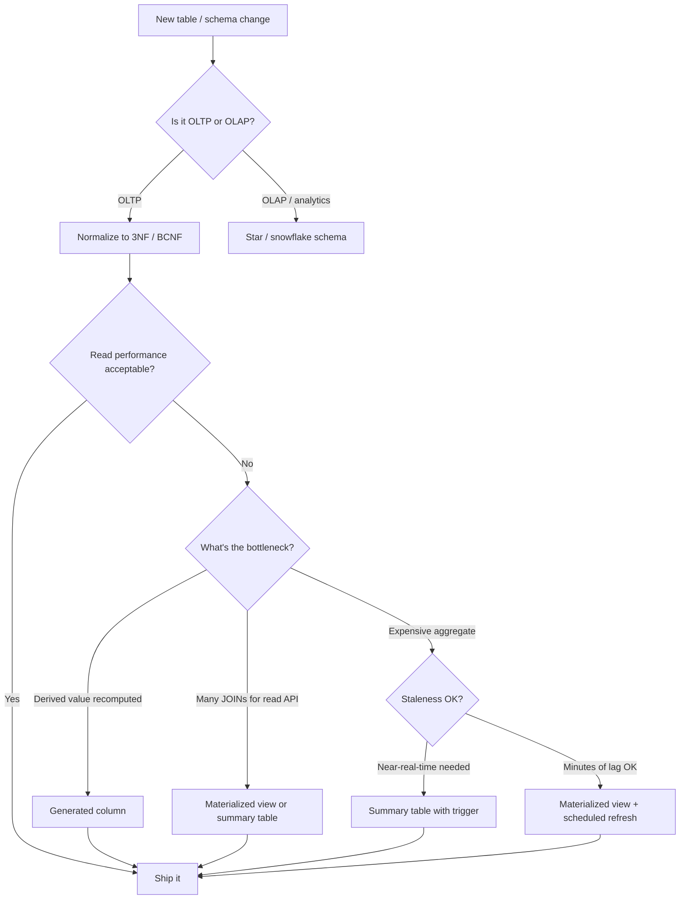

# Normalization and Denormalization Trade-offs

**Date:** 2026-04-19
**Tags:** `database` `normalization` `denormalization` `schema-design` `postgresql`

---

## Table of Contents

- [Summary](#summary)
- [Functional Dependencies and Anomalies](#functional-dependencies-and-anomalies)
  - [Functional Dependencies](#functional-dependencies)
  - [Anomalies from Poor Normalization](#anomalies-from-poor-normalization)
- [Normal Forms Walkthrough](#normal-forms-walkthrough)
  - [First Normal Form (1NF)](#first-normal-form-1nf)
  - [Second Normal Form (2NF)](#second-normal-form-2nf)
  - [Third Normal Form (3NF)](#third-normal-form-3nf)
  - [Boyce-Codd Normal Form (BCNF)](#boyce-codd-normal-form-bcnf)
- [When Normalization Hurts](#when-normalization-hurts)
- [Strategic Denormalization Patterns](#strategic-denormalization-patterns)
  - [Summary Tables](#summary-tables)
  - [Materialized Views](#materialized-views)
  - [JSONB Columns for Flexible Attributes](#jsonb-columns-for-flexible-attributes)
  - [Computed and Generated Columns](#computed-and-generated-columns)
- [Trade-off Framework](#trade-off-framework)
- [Decision Diagram](#decision-diagram)
- [Related](#related)
- [References](#references)

---

## Summary

Normalization eliminates redundancy and update anomalies by decomposing tables based on functional dependencies. In practice, read-heavy workloads often benefit from strategic denormalization -- summary tables, materialized views, JSONB columns, and generated columns -- that trades write amplification for query simplicity. The key is knowing which normal form your OLTP tables should target (usually 3NF/BCNF) and where to deliberately break the rules.

---

## Functional Dependencies and Anomalies

### Functional Dependencies

A functional dependency `X -> Y` means that the value of column set X uniquely determines the value of Y. Every design decision in normalization follows from identifying these dependencies correctly.

```text
order_id -> customer_id, order_date        -- an order determines its customer and date
(order_id, product_id) -> quantity, price  -- the composite key determines line-item details
customer_id -> customer_name, email        -- a customer id determines name and email
```

### Anomalies from Poor Normalization

Given a flat `order_details` table where customer info is repeated on every row:

| Anomaly   | Example                                                                 |
|-----------|-------------------------------------------------------------------------|
| Update    | Customer renames -- must update every row that references them          |
| Insert    | Cannot record a new customer without a corresponding order              |
| Delete    | Deleting the last order for a customer loses the customer record        |

---

## Normal Forms Walkthrough

### First Normal Form (1NF)

**Rule:** every column holds atomic values; no repeating groups or arrays used as a substitute for rows.

Violation -- a comma-separated list masquerading as a column:

```sql
-- BAD: tags stored as CSV
CREATE TABLE articles (
    id         BIGSERIAL PRIMARY KEY,
    title      TEXT NOT NULL,
    tag_list   TEXT  -- 'java,spring,jpa'
);
```

Fix -- separate table:

```sql
CREATE TABLE articles (
    id    BIGSERIAL PRIMARY KEY,
    title TEXT NOT NULL
);

CREATE TABLE article_tags (
    article_id BIGINT REFERENCES articles(id),
    tag        TEXT NOT NULL,
    PRIMARY KEY (article_id, tag)
);
```

> **PostgreSQL nuance:** An `array` or `jsonb` column is technically non-1NF but is acceptable when the values are opaque to relational operations (e.g., feature flags, UI preferences). If you query or join on individual elements, normalize.

### Second Normal Form (2NF)

**Rule:** every non-key column depends on the *entire* composite key, not just part of it.

Only relevant when the primary key is composite. Violation:

```sql
-- Composite PK: (order_id, product_id)
CREATE TABLE order_lines (
    order_id     BIGINT,
    product_id   BIGINT,
    quantity     INT,
    product_name TEXT,   -- depends only on product_id, NOT the full key
    unit_price   NUMERIC,
    PRIMARY KEY (order_id, product_id)
);
```

`product_name` depends on `product_id` alone -- a partial dependency. Fix: move it to a `products` table.

```sql
CREATE TABLE products (
    id   BIGINT PRIMARY KEY,
    name TEXT NOT NULL
);

CREATE TABLE order_lines (
    order_id   BIGINT,
    product_id BIGINT REFERENCES products(id),
    quantity   INT,
    unit_price NUMERIC,
    PRIMARY KEY (order_id, product_id)
);
```

### Third Normal Form (3NF)

**Rule:** no non-key column depends on another non-key column (no transitive dependencies).

```sql
-- employee_id -> department_id -> department_name
CREATE TABLE employees (
    id              BIGSERIAL PRIMARY KEY,
    name            TEXT NOT NULL,
    department_id   INT,
    department_name TEXT  -- transitively depends on id via department_id
);
```

Fix:

```sql
CREATE TABLE departments (
    id   SERIAL PRIMARY KEY,
    name TEXT NOT NULL
);

CREATE TABLE employees (
    id            BIGSERIAL PRIMARY KEY,
    name          TEXT NOT NULL,
    department_id INT REFERENCES departments(id)
);
```

### Boyce-Codd Normal Form (BCNF)

**Rule:** for every non-trivial functional dependency `X -> Y`, X must be a superkey.

3NF and BCNF diverge when a non-candidate-key determinant exists. Classic example -- a teaching schedule where each student has one advisor per subject, and each advisor teaches only one subject:

```text
FDs:
  (student, subject) -> advisor
  advisor -> subject
```

`advisor -> subject` violates BCNF because `advisor` is not a superkey. Decompose:

```sql
CREATE TABLE advisor_subjects (
    advisor TEXT PRIMARY KEY,
    subject TEXT NOT NULL
);

CREATE TABLE student_advisors (
    student TEXT,
    advisor TEXT REFERENCES advisor_subjects(advisor),
    PRIMARY KEY (student, advisor)
);
```

---

## When Normalization Hurts

Fully normalized schemas are optimized for write correctness but can punish read performance:

| Scenario                         | Problem with Full Normalization                          |
|----------------------------------|----------------------------------------------------------|
| Analytical dashboards            | Many-table JOINs on millions of rows are expensive       |
| Leaderboards / rankings          | Aggregates recomputed on every request                   |
| Search / listing pages           | Fetching 6+ tables for a single card                     |
| Event sourcing projections       | Projections need pre-joined, pre-aggregated shapes       |
| High-throughput read APIs        | JOIN latency exceeds SLA at p99                          |

The answer is *not* to abandon normalization. Keep the source-of-truth tables normalized and build denormalized read surfaces on top.

---

## Strategic Denormalization Patterns

### Summary Tables

Maintain a separate table that caches aggregated data, updated via triggers or batch jobs.

```sql
CREATE TABLE daily_order_summary (
    summary_date DATE PRIMARY KEY,
    total_orders INT NOT NULL DEFAULT 0,
    total_revenue NUMERIC(12,2) NOT NULL DEFAULT 0,
    avg_order_value NUMERIC(10,2) NOT NULL DEFAULT 0
);

-- Refresh nightly
INSERT INTO daily_order_summary (summary_date, total_orders, total_revenue, avg_order_value)
SELECT
    order_date,
    COUNT(*),
    SUM(total),
    AVG(total)
FROM orders
WHERE order_date = CURRENT_DATE - INTERVAL '1 day'
GROUP BY order_date
ON CONFLICT (summary_date) DO UPDATE SET
    total_orders = EXCLUDED.total_orders,
    total_revenue = EXCLUDED.total_revenue,
    avg_order_value = EXCLUDED.avg_order_value;
```

### Materialized Views

PostgreSQL's built-in mechanism for query-time denormalization:

```sql
CREATE MATERIALIZED VIEW mv_product_stats AS
SELECT
    p.id AS product_id,
    p.name,
    COUNT(ol.order_id) AS times_ordered,
    COALESCE(SUM(ol.quantity), 0) AS total_units_sold,
    COALESCE(SUM(ol.quantity * ol.unit_price), 0) AS total_revenue
FROM products p
LEFT JOIN order_lines ol ON ol.product_id = p.id
GROUP BY p.id, p.name;

CREATE UNIQUE INDEX ON mv_product_stats (product_id);

-- Refresh concurrently (requires unique index)
REFRESH MATERIALIZED VIEW CONCURRENTLY mv_product_stats;
```

**Trade-offs:**
- `REFRESH MATERIALIZED VIEW` (without `CONCURRENTLY`) takes an ACCESS EXCLUSIVE lock that blocks all reads. `CONCURRENTLY` allows reads during refresh but requires a unique index and is more resource-intensive.
- Staleness window depends on refresh frequency.
- No automatic invalidation -- you schedule it.

### JSONB Columns for Flexible Attributes

When a subset of attributes varies across rows (product specs, form metadata, feature flags):

```sql
CREATE TABLE products (
    id         BIGSERIAL PRIMARY KEY,
    name       TEXT NOT NULL,
    category   TEXT NOT NULL,
    attributes JSONB NOT NULL DEFAULT '{}'
);

-- GIN index for containment queries
CREATE INDEX idx_products_attributes ON products USING GIN (attributes);

-- Query: find products with screen_size > 13
SELECT name, attributes->>'screen_size' AS screen_size
FROM products
WHERE attributes @> '{"brand": "Apple"}'
  AND (attributes->>'screen_size')::numeric > 13;
```

This is modern EAV. Use it when the alternative is hundreds of nullable columns or a full EAV table.

### Computed and Generated Columns

PostgreSQL 12+ supports stored generated columns that auto-derive from other columns:

```sql
CREATE TABLE orders (
    id          BIGSERIAL PRIMARY KEY,
    subtotal    NUMERIC(10,2) NOT NULL,
    tax_rate    NUMERIC(4,4) NOT NULL DEFAULT 0.08,
    tax_amount  NUMERIC(10,2) GENERATED ALWAYS AS (subtotal * tax_rate) STORED,
    total       NUMERIC(10,2) GENERATED ALWAYS AS (subtotal * (1 + tax_rate)) STORED
);

-- You can index generated columns
CREATE INDEX idx_orders_total ON orders (total);
```

Benefits: no application-level computation, guaranteed consistency, indexable. Cost: slight write overhead.

---

## Trade-off Framework

```text
+-------------------+-------------------+-------------------+-------------------+
|                   | Write             | Read              | Consistency       |
|                   | Amplification     | Simplicity        | Guarantees        |
+-------------------+-------------------+-------------------+-------------------+
| Full 3NF/BCNF     | Low               | Low (many JOINs)  | High              |
| Summary tables     | Medium (triggers) | High              | Eventual          |
| Materialized views | Medium (refresh)  | High              | Eventual (stale)  |
| JSONB attributes   | Low               | Medium            | High (same row)   |
| Generated columns  | Low               | High              | High (derived)    |
| Full denormalize   | High              | Very high         | Low (drift risk)  |
+-------------------+-------------------+-------------------+-------------------+
```

**Decision heuristic:**
1. Start with 3NF/BCNF for all OLTP tables.
2. Identify hot read paths where JOINs are the bottleneck.
3. Add the lightest denormalization that fixes the bottleneck (generated column > materialized view > summary table > full denormalization).
4. Monitor staleness and write amplification after deploying.

---

## Decision Diagram



---

## Related

- [indexing-strategies.md](indexing-strategies.md) -- indexes are the other lever for read performance before denormalizing
- [data-modeling-patterns.md](data-modeling-patterns.md) -- patterns like EAV, soft deletes, and polymorphic associations that interact with normalization decisions
- [partitioning-and-sharding.md](partitioning-and-sharding.md) -- partitioning complements denormalization for large tables

---

## References

- [PostgreSQL Documentation: Generated Columns](https://www.postgresql.org/docs/current/ddl-generated-columns.html)
- [PostgreSQL Documentation: Materialized Views](https://www.postgresql.org/docs/current/rules-materializedviews.html)
- [PostgreSQL Documentation: JSON Types](https://www.postgresql.org/docs/current/datatype-json.html)
- [Database Normalization (Wikipedia)](https://en.wikipedia.org/wiki/Database_normalization)
- [Boyce-Codd Normal Form (Wikipedia)](https://en.wikipedia.org/wiki/Boyce%E2%80%93Codd_normal_form)
