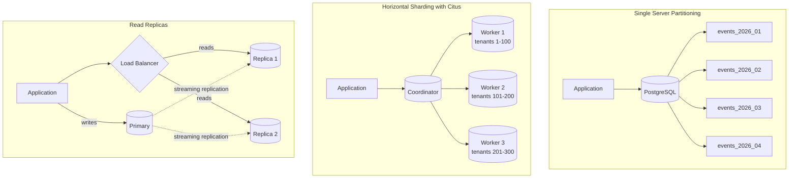

# Partitioning and Sharding in PostgreSQL

**Date:** 2026-04-19
**Tags:** `database` `partitioning` `sharding` `postgresql` `scalability`

---

## Table of Contents

- [Summary](#summary)
- [Declarative Partitioning](#declarative-partitioning)
  - [Range Partitioning](#range-partitioning)
  - [List Partitioning](#list-partitioning)
  - [Hash Partitioning](#hash-partitioning)
- [Partition Pruning](#partition-pruning)
- [Sub-Partitioning](#sub-partitioning)
- [Partition Maintenance](#partition-maintenance)
  - [Adding New Partitions](#adding-new-partitions)
  - [Dropping Old Partitions](#dropping-old-partitions)
  - [Detach and Attach](#detach-and-attach)
- [When Partitioning Helps vs Hurts](#when-partitioning-helps-vs-hurts)
- [Horizontal Sharding](#horizontal-sharding)
  - [Citus Extension](#citus-extension)
  - [Application-Level Sharding](#application-level-sharding)
- [Shard Key Selection](#shard-key-selection)
- [Foreign Data Wrappers](#foreign-data-wrappers)
- [Comparison: Partitioning vs Sharding vs Read Replicas](#comparison-partitioning-vs-sharding-vs-read-replicas)
- [Architecture Diagram](#architecture-diagram)
- [Related](#related)
- [References](#references)

---

## Summary

Partitioning splits a single logical table into physical sub-tables on the same server, improving query performance through partition pruning and simplifying data lifecycle management. Sharding distributes data across multiple servers for horizontal scalability. This doc covers PostgreSQL's declarative partitioning (range, list, hash), maintenance operations, the Citus extension for distributed tables, and when each scaling strategy is appropriate.

---

## Declarative Partitioning

PostgreSQL 10+ supports declarative partitioning. You define a parent table with `PARTITION BY` and attach child tables as partitions. The parent holds no data -- it is a routing layer.

### Range Partitioning

Best for time-series data, event logs, and anything with a natural chronological key.

```sql
CREATE TABLE events (
    id          BIGSERIAL,
    tenant_id   INT NOT NULL,
    event_type  TEXT NOT NULL,
    payload     JSONB,
    created_at  TIMESTAMPTZ NOT NULL DEFAULT NOW(),
    PRIMARY KEY (id, created_at)  -- partition key must be in PK
) PARTITION BY RANGE (created_at);

-- Monthly partitions
CREATE TABLE events_2026_01 PARTITION OF events
    FOR VALUES FROM ('2026-01-01') TO ('2026-02-01');

CREATE TABLE events_2026_02 PARTITION OF events
    FOR VALUES FROM ('2026-02-01') TO ('2026-03-01');

CREATE TABLE events_2026_03 PARTITION OF events
    FOR VALUES FROM ('2026-03-01') TO ('2026-04-01');

CREATE TABLE events_2026_04 PARTITION OF events
    FOR VALUES FROM ('2026-04-01') TO ('2026-05-01');
```

> The range is `[FROM, TO)` -- inclusive start, exclusive end.

### List Partitioning

Best when data naturally falls into discrete categories (region, status, tenant tier).

```sql
CREATE TABLE invoices (
    id        BIGSERIAL,
    region    TEXT NOT NULL,
    amount    NUMERIC(12,2) NOT NULL,
    issued_at DATE NOT NULL,
    PRIMARY KEY (id, region)
) PARTITION BY LIST (region);

CREATE TABLE invoices_na PARTITION OF invoices
    FOR VALUES IN ('US', 'CA', 'MX');

CREATE TABLE invoices_eu PARTITION OF invoices
    FOR VALUES IN ('DE', 'FR', 'GB', 'NL', 'ES');

CREATE TABLE invoices_apac PARTITION OF invoices
    FOR VALUES IN ('JP', 'KR', 'AU', 'SG');

-- Default partition catches everything else
CREATE TABLE invoices_other PARTITION OF invoices DEFAULT;
```

### Hash Partitioning

Distributes rows uniformly when no natural range or list key exists. Useful for spreading load.

```sql
CREATE TABLE sessions (
    id         UUID NOT NULL DEFAULT gen_random_uuid(),
    user_id    BIGINT NOT NULL,
    data       JSONB,
    expires_at TIMESTAMPTZ NOT NULL,
    PRIMARY KEY (id)
) PARTITION BY HASH (id);

-- 4 hash partitions
CREATE TABLE sessions_p0 PARTITION OF sessions FOR VALUES WITH (MODULUS 4, REMAINDER 0);
CREATE TABLE sessions_p1 PARTITION OF sessions FOR VALUES WITH (MODULUS 4, REMAINDER 1);
CREATE TABLE sessions_p2 PARTITION OF sessions FOR VALUES WITH (MODULUS 4, REMAINDER 2);
CREATE TABLE sessions_p3 PARTITION OF sessions FOR VALUES WITH (MODULUS 4, REMAINDER 3);
```

> Hash partitions cannot be dropped or detached as cleanly as range/list. Adding more partitions requires repartitioning.

---

## Partition Pruning

The query planner eliminates partitions that cannot contain matching rows. This is the main performance benefit.

```sql
-- Only scans events_2026_03, skips all other partitions
EXPLAIN ANALYZE
SELECT * FROM events
WHERE created_at >= '2026-03-15' AND created_at < '2026-04-01';
```

Expected plan output:

```text
Append
  ->  Index Scan using events_2026_03_created_at_idx on events_2026_03
        Filter: (created_at >= '2026-03-15' AND created_at < '2026-04-01')
```

**Pruning works at:**
- Plan time (static values and parameters)
- Execution time (PG11+, when values come from subqueries or joins)

**Pruning fails when:**
- The partition key is wrapped in a function: `WHERE DATE_TRUNC('month', created_at) = ...`
- The predicate uses a different column than the partition key
- `enable_partition_pruning` is off (it is on by default)

```sql
-- Verify pruning is enabled
SHOW enable_partition_pruning;
```

---

## Sub-Partitioning

Partitions can themselves be partitioned (multi-level). Common pattern: range by time, then list by region.

```sql
CREATE TABLE logs (
    id         BIGSERIAL,
    region     TEXT NOT NULL,
    level      TEXT NOT NULL,
    message    TEXT,
    created_at TIMESTAMPTZ NOT NULL,
    PRIMARY KEY (id, created_at, region)
) PARTITION BY RANGE (created_at);

-- First level: monthly
CREATE TABLE logs_2026_04 PARTITION OF logs
    FOR VALUES FROM ('2026-04-01') TO ('2026-05-01')
    PARTITION BY LIST (region);

-- Second level: region within the month
CREATE TABLE logs_2026_04_na PARTITION OF logs_2026_04
    FOR VALUES IN ('US', 'CA');

CREATE TABLE logs_2026_04_eu PARTITION OF logs_2026_04
    FOR VALUES IN ('DE', 'FR', 'GB');

CREATE TABLE logs_2026_04_other PARTITION OF logs_2026_04 DEFAULT;
```

> Sub-partitioning multiplies the number of physical tables. Keep the total partition count manageable -- hundreds is fine, tens of thousands causes planner overhead.

---

## Partition Maintenance

### Adding New Partitions

For time-based partitions, create future partitions ahead of time (cron job or pg_partman).

```sql
-- Add May partition
CREATE TABLE events_2026_05 PARTITION OF events
    FOR VALUES FROM ('2026-05-01') TO ('2026-06-01');

-- Create indexes on the new partition (inherited automatically in PG11+)
-- but explicitly if you need specific index options
```

### Dropping Old Partitions

Dropping a partition is an O(1) metadata operation -- far faster than `DELETE FROM events WHERE created_at < '2025-01-01'`.

```sql
-- Instant drop of all January 2025 data
DROP TABLE events_2025_01;
```

### Detach and Attach

Detach a partition to archive or transform data without blocking the parent.

```sql
-- Detach without blocking concurrent queries (PG14+)
ALTER TABLE events DETACH PARTITION events_2025_12 CONCURRENTLY;

-- Archive the detached table (dump, move to cold storage, etc.)
-- pg_dump -t events_2025_12 mydb > events_2025_12.sql

-- Reattach if needed
ALTER TABLE events ATTACH PARTITION events_2025_12
    FOR VALUES FROM ('2025-12-01') TO ('2026-01-01');
```

> `ATTACH PARTITION` validates that all rows match the partition constraint. For large tables, use a `CHECK` constraint on the child table first to skip validation:

```sql
ALTER TABLE events_2025_12
    ADD CONSTRAINT check_range
    CHECK (created_at >= '2025-12-01' AND created_at < '2026-01-01');

-- Now ATTACH skips validation
ALTER TABLE events ATTACH PARTITION events_2025_12
    FOR VALUES FROM ('2025-12-01') TO ('2026-01-01');
```

---

## When Partitioning Helps vs Hurts

| Helps                                        | Hurts                                         |
|----------------------------------------------|-----------------------------------------------|
| Time-range queries on large tables           | Small tables (< 10M rows)                     |
| Bulk data deletion (drop partition)          | Queries that always scan all partitions        |
| Partition-wise joins (PG11+)                 | Very high partition count (1000s+)             |
| Partition-wise aggregate pushdown (PG11+)    | Queries without the partition key in WHERE     |
| Parallel append scans across partitions      | Cross-partition unique constraints             |
| Tablespace tiering (hot/warm/cold)           | ORM tools that do not handle partitions well   |

**Partition-wise joins** (enabled via `enable_partitionwise_join`): when two tables are partitioned the same way, PostgreSQL can join matching partitions independently.

**Partition-wise aggregation** (`enable_partitionwise_aggregate`): aggregates can be pushed into each partition and then combined.

```sql
-- Enable both (off by default due to planner cost)
SET enable_partitionwise_join = on;
SET enable_partitionwise_aggregate = on;
```

---

## Horizontal Sharding

Partitioning stays on one server. Sharding distributes data across multiple servers.

### Citus Extension

Citus (now part of Microsoft/Azure) turns PostgreSQL into a distributed database.

```sql
-- On the coordinator node
CREATE EXTENSION citus;

-- Distribute a table by tenant_id
SELECT create_distributed_table('events', 'tenant_id');

-- Queries with tenant_id in WHERE are routed to the correct shard
SELECT * FROM events WHERE tenant_id = 42 AND created_at > '2026-04-01';

-- Reference tables (small, replicated to all nodes)
SELECT create_reference_table('countries');
```

**Citus distribution strategies:**
- **Hash distribution:** rows hashed by shard key, spread across workers
- **Reference tables:** small tables replicated to all workers for local joins
- **Append distribution:** for time-series append-only workloads

### Application-Level Sharding

When you manage shard routing in the application layer (e.g., Spring with multiple DataSources):

```text
Application
    |
    +--> Shard Router (tenant_id % N)
           |
           +--> DataSource 0 (pg-shard-0.internal)
           +--> DataSource 1 (pg-shard-1.internal)
           +--> DataSource 2 (pg-shard-2.internal)
```

This is the most flexible approach but requires you to handle:
- Shard routing logic
- Cross-shard queries (scatter-gather)
- Shard rebalancing when adding nodes
- Schema migrations across all shards
- Distributed transactions (avoid if possible)

---

## Shard Key Selection

The shard key determines data placement and query routing. A bad key causes hot spots and excessive cross-shard queries.

| Property               | Good Shard Key                   | Bad Shard Key                   |
|------------------------|----------------------------------|---------------------------------|
| Cardinality            | High (tenant_id, user_id)        | Low (status, country)           |
| Distribution           | Uniform across shards            | Skewed (one tenant = 80% data)  |
| Query affinity         | Most queries include the key     | Queries rarely filter on it     |
| Join locality          | Related tables share the key     | Joins require cross-shard hops  |

**Common shard key choices:**
- **SaaS multi-tenant:** `tenant_id` (most queries are tenant-scoped)
- **Social platform:** `user_id` (user's data co-located)
- **E-commerce:** `customer_id` or `merchant_id` depending on query patterns

**Hot spot mitigation:**
- Add a secondary hash: `hash(tenant_id) % shard_count`
- Split large tenants across multiple logical shards
- Use Citus's tenant isolation feature for whales

---

## Foreign Data Wrappers

FDW lets a PostgreSQL instance query tables on remote servers as if they were local.

```sql
CREATE EXTENSION postgres_fdw;

CREATE SERVER remote_analytics
    FOREIGN DATA WRAPPER postgres_fdw
    OPTIONS (host 'analytics-db.internal', port '5432', dbname 'analytics');

CREATE USER MAPPING FOR app_user
    SERVER remote_analytics
    OPTIONS (user 'readonly', password 'secret');

IMPORT FOREIGN SCHEMA public
    LIMIT TO (daily_metrics, user_cohorts)
    FROM SERVER remote_analytics
    INTO fdw_analytics;

-- Query as if local
SELECT * FROM fdw_analytics.daily_metrics
WHERE metric_date = CURRENT_DATE;
```

**Limitations:**
- No indexes on foreign tables (filtering happens after fetch)
- No transactional guarantees across servers
- Network latency on every query
- Best for low-frequency analytical queries, not OLTP hot paths

---

## Comparison: Partitioning vs Sharding vs Read Replicas

| Dimension              | Partitioning                  | Sharding                        | Read Replicas                 |
|------------------------|-------------------------------|---------------------------------|-------------------------------|
| Data location          | Single server                 | Multiple servers                | Multiple servers (full copy)  |
| Write scalability      | No improvement                | Linear (add shards)             | No improvement (single writer)|
| Read scalability       | Pruning reduces scan size     | Route to correct shard          | Distribute reads              |
| Complexity             | Low-medium                    | High                            | Low                           |
| Cross-partition queries| Transparent                   | Scatter-gather (expensive)      | Transparent (any replica)     |
| Data lifecycle         | Drop/detach partition          | Drop shard (if append-only)     | N/A                           |
| Best for               | Large tables, time-series      | Multi-tenant, write-heavy       | Read-heavy, reporting         |

**Decision path:**
1. Start with a single PostgreSQL instance + indexes.
2. Add read replicas when read load exceeds one server.
3. Add partitioning when individual tables grow beyond efficient scanning.
4. Add sharding when write volume or total data size exceeds a single server.

---

## Architecture Diagram



---

## Related

- [indexing-strategies.md](indexing-strategies.md) -- each partition maintains its own indexes; index strategy applies per-partition
- [normalization-and-tradeoffs.md](normalization-and-tradeoffs.md) -- denormalization patterns complement partitioning for analytics
- [data-modeling-patterns.md](data-modeling-patterns.md) -- multi-tenancy patterns interact directly with partitioning and sharding decisions

---

## References

- [PostgreSQL Documentation: Table Partitioning](https://www.postgresql.org/docs/current/ddl-partitioning.html)
- [PostgreSQL Documentation: postgres_fdw](https://www.postgresql.org/docs/current/postgres-fdw.html)
- [Citus Documentation](https://docs.citusdata.com/)
- [pg_partman Extension](https://github.com/pgpartman/pg_partman)
- [PostgreSQL Wiki: Table Partitioning](https://wiki.postgresql.org/wiki/Table_partitioning)
