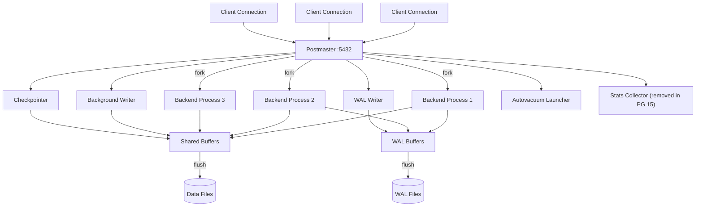
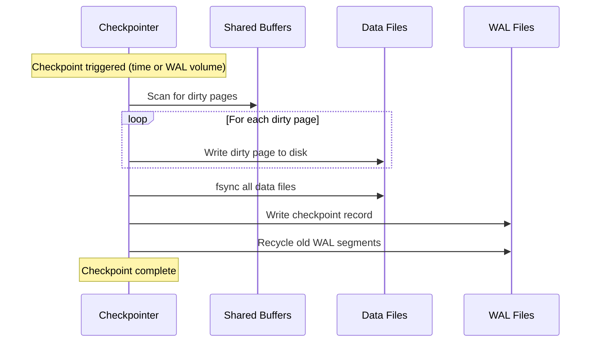

# PostgreSQL Architecture: Process Model, WAL, and VACUUM

**Date:** 2026-04-19
**Tags:** `postgresql` `architecture` `wal` `vacuum` `internals`

## Table of Contents

- [Summary](#summary)
- [Process Model](#process-model)
  - [Postmaster](#postmaster)
  - [Backend Processes](#backend-processes)
  - [Background Workers](#background-workers)
- [Shared Memory Architecture](#shared-memory-architecture)
  - [Shared Buffers](#shared-buffers)
  - [WAL Buffers](#wal-buffers)
  - [CLOG (Commit Log)](#clog-commit-log)
- [Write-Ahead Logging (WAL)](#write-ahead-logging-wal)
  - [How WAL Guarantees Durability](#how-wal-guarantees-durability)
  - [WAL Segment Files](#wal-segment-files)
  - [LSN (Log Sequence Number)](#lsn-log-sequence-number)
- [Checkpoints](#checkpoints)
  - [Checkpoint Process](#checkpoint-process)
  - [Tuning checkpoint_completion_target](#tuning-checkpoint_completion_target)
- [Background Writer vs Checkpointer](#background-writer-vs-checkpointer)
  - [Monitoring with pg_stat_bgwriter](#monitoring-with-pg_stat_bgwriter)
- [VACUUM and Autovacuum](#vacuum-and-autovacuum)
  - [Why VACUUM Exists](#why-vacuum-exists)
  - [Autovacuum Tuning](#autovacuum-tuning)
  - [Monitoring VACUUM Activity](#monitoring-vacuum-activity)
- [References](#references)

## Summary

PostgreSQL uses a multi-process architecture where a postmaster daemon forks a dedicated backend process for each client connection. All backends share memory structures (shared buffers, WAL buffers, CLOG) and rely on Write-Ahead Logging for crash recovery. VACUUM reclaims dead tuples left behind by MVCC, and autovacuum automates this to prevent table bloat.

## Process Model

### Postmaster

The `postmaster` is the supervisor process. It listens for incoming connections and forks a new backend process for each one. If any backend crashes, the postmaster terminates all other backends and initiates recovery.

```bash
# See all PostgreSQL processes
ps aux | grep postgres

# Typical output:
# postgres: checkpointer
# postgres: background writer
# postgres: walwriter
# postgres: autovacuum launcher
# postgres: stats collector          (removed in PG 15; stats now collected via shared memory)
# postgres: logical replication launcher
# postgres: walsender
# postgres: backend (one per connection)
```

### Backend Processes

Each connection gets its own OS process (not a thread). This provides fault isolation but means connection count directly maps to process count. This is why connection pooling (PgBouncer, HikariCP) matters.

For a Spring Boot app with HikariCP:

```text
Application (50 HikariCP connections)
  → PgBouncer (optional, transaction pooling)
    → PostgreSQL postmaster
      → 50 backend processes (one per connection)
```

### Background Workers

PostgreSQL runs several auxiliary processes:

| Process | Responsibility |
|---------|---------------|
| **Checkpointer** | Flushes dirty pages to disk at checkpoint intervals |
| **Background Writer** | Gradually writes dirty buffers to reduce checkpoint spikes |
| **WAL Writer** | Flushes WAL buffers to disk |
| **Autovacuum Launcher** | Spawns autovacuum workers when tables need cleanup |
| **Stats Collector** | Aggregates activity statistics (removed in PG 15; stats now collected via shared memory) |
| **WAL Sender** | Streams WAL to replicas |
| **WAL Receiver** | Receives WAL on standby servers |



## Shared Memory Architecture

### Shared Buffers

The shared buffer pool is PostgreSQL's page cache. All backends read and write 8 KB pages through this pool. A page must be in shared buffers before any backend can access it.

```sql
-- Check shared_buffers setting
SHOW shared_buffers;

-- Typical recommendation: 25% of available RAM
-- For a 64 GB server:
-- shared_buffers = '16GB'

-- See buffer cache hit ratio
SELECT
  sum(blks_hit) AS cache_hits,
  sum(blks_read) AS disk_reads,
  round(sum(blks_hit)::numeric / nullif(sum(blks_hit) + sum(blks_read), 0) * 100, 2) AS hit_ratio
FROM pg_stat_database;
```

A good hit ratio is above 99%. If it drops significantly, shared_buffers may be too small or the working set is larger than memory.

### WAL Buffers

WAL records are first written to WAL buffers in shared memory, then flushed to disk by the WAL writer or at commit time. The default `wal_buffers = -1` auto-tunes to 1/32 of `shared_buffers`, capped at 16 MB (one WAL segment).

### CLOG (Commit Log)

The CLOG (stored in `pg_xact/`) tracks the commit status of every transaction:

| Status | Meaning |
|--------|---------|
| IN_PROGRESS | Transaction still running |
| COMMITTED | Transaction committed |
| ABORTED | Transaction rolled back |
| SUB_COMMITTED | Subtransaction committed (final status depends on parent) |

Backends check the CLOG during visibility checks to determine if a tuple's creating or deleting transaction actually committed.

## Write-Ahead Logging (WAL)

### How WAL Guarantees Durability

The WAL rule: **no data page change is written to disk before the corresponding WAL record is flushed.** This means:

1. Backend modifies a page in shared buffers (marks it dirty)
2. Backend writes a WAL record describing the change into WAL buffers
3. At `COMMIT`, the WAL record is flushed to disk (`fsync`)
4. Only after WAL is on disk does the commit return success to the client
5. The dirty data page can be written to disk later (by background writer or checkpointer)

If the server crashes after step 3 but before step 5, PostgreSQL replays the WAL during recovery to reconstruct the data page.

```sql
-- Key WAL settings
SHOW wal_level;           -- minimal, replica, or logical
SHOW synchronous_commit;  -- on, off, remote_apply, etc.
SHOW wal_compression;     -- reduces WAL volume at CPU cost
```

Setting `synchronous_commit = off` lets commits return before WAL flush, trading up to `wal_writer_delay` (default 200ms) of data for lower latency. The database remains consistent; only the most recent transactions may be lost.

### WAL Segment Files

WAL is stored as a sequence of 16 MB segment files in `pg_wal/`:

```bash
ls -la pg_wal/
# 000000010000000000000001
# 000000010000000000000002
# ...
```

Each segment name encodes a timeline ID and position. Old segments are recycled or archived (for point-in-time recovery).

### LSN (Log Sequence Number)

Every WAL record has a unique LSN, a monotonically increasing 64-bit pointer into the WAL stream.

```sql
-- Current WAL insert position
SELECT pg_current_wal_lsn();

-- WAL generated since last check
SELECT pg_wal_lsn_diff(pg_current_wal_lsn(), '0/1000000') AS bytes_since;

-- Each page header stores the LSN of the last WAL record that modified it
-- This is how recovery knows which pages need replay
```

## Checkpoints

### Checkpoint Process

A checkpoint ensures all dirty pages up to a certain LSN are flushed to disk. After a checkpoint completes, WAL segments before that point are no longer needed for crash recovery.



Checkpoints are triggered by:
- `checkpoint_timeout` (default 5 min)
- WAL volume reaching `max_wal_size` (default 1 GB)
- Manual `CHECKPOINT` command
- `pg_backup_start()` calls (renamed from `pg_start_backup()` in PG 15)

### Tuning checkpoint_completion_target

This parameter spreads checkpoint writes over a fraction of the checkpoint interval to avoid I/O spikes:

```sql
-- Default in PG14+: 0.9 (spread writes over 90% of the interval)
SHOW checkpoint_completion_target;

-- With checkpoint_timeout = 5min and target = 0.9:
-- Writes are spread over 4.5 minutes, then 0.5 min quiet before next
```

Setting this too low (e.g., 0.5) concentrates writes into a shorter burst. Keep it at 0.9 unless you have a specific reason to change it.

## Background Writer vs Checkpointer

| | Background Writer | Checkpointer |
|---|---|---|
| **Goal** | Maintain a pool of clean buffers | Ensure crash recovery point advances |
| **Trigger** | Continuous (bgwriter_delay, default 200ms) | checkpoint_timeout or max_wal_size |
| **Scope** | Writes a few buffers each round | Writes ALL dirty buffers |
| **I/O pattern** | Low, steady trickle | Potential large burst (mitigated by completion_target) |

The background writer scans the buffer pool looking for dirty pages that are unlikely to be needed soon and writes them preemptively. This means when a backend needs a clean buffer, it finds one faster.

### Monitoring with pg_stat_bgwriter

```sql
-- PG 16 and earlier: all columns in pg_stat_bgwriter
SELECT
  checkpoints_timed,       -- scheduled checkpoints
  checkpoints_req,         -- requested (forced) checkpoints
  buffers_checkpoint,      -- pages written during checkpoints
  buffers_clean,           -- pages written by background writer
  buffers_backend,         -- pages written by backends (BAD if high)
  maxwritten_clean,        -- times bgwriter hit bgwriter_lru_maxpages limit
  buffers_alloc            -- new buffers allocated
FROM pg_stat_bgwriter;
```

> **PG 17+ note:** Checkpoint columns (`checkpoints_timed`, `checkpoints_req`, `buffers_checkpoint`, etc.) moved to `pg_stat_checkpointer`. Backend buffer write stats (`buffers_backend`, `buffers_alloc`) moved to `pg_stat_io`. The `pg_stat_bgwriter` view in PG 17+ retains only background-writer-specific columns (`buffers_clean`, `maxwritten_clean`).

**Key indicators:**
- High `buffers_backend` means backends are doing their own writes because the background writer and checkpointer cannot keep up.
- High `checkpoints_req` vs `checkpoints_timed` means `max_wal_size` is too small.
- High `maxwritten_clean` means `bgwriter_lru_maxpages` should be increased.

## VACUUM and Autovacuum

### Why VACUUM Exists

PostgreSQL MVCC never modifies a tuple in place. An `UPDATE` creates a new tuple version and marks the old one as dead (by setting `xmax`). A `DELETE` just marks the tuple dead. These dead tuples remain on disk until VACUUM removes them.

Without VACUUM:
- Tables grow unboundedly (bloat)
- Index entries still point to dead tuples (index bloat)
- Transaction ID wraparound can halt the database

```sql
-- See dead tuples per table
SELECT
  schemaname,
  relname,
  n_live_tup,
  n_dead_tup,
  round(n_dead_tup::numeric / nullif(n_live_tup + n_dead_tup, 0) * 100, 2) AS dead_pct,
  last_vacuum,
  last_autovacuum
FROM pg_stat_user_tables
ORDER BY n_dead_tup DESC
LIMIT 20;
```

### Autovacuum Tuning

Autovacuum triggers when dead tuples exceed a threshold:

```text
threshold = autovacuum_vacuum_threshold + autovacuum_vacuum_scale_factor * n_live_tup
```

Defaults: `threshold = 50`, `scale_factor = 0.2`. So a 1M-row table triggers at 200,050 dead tuples.

For large tables, the scale factor approach delays VACUUM too long. Override per-table:

```sql
-- Make autovacuum more aggressive on a hot table
ALTER TABLE orders SET (
  autovacuum_vacuum_scale_factor = 0.01,    -- 1% instead of 20%
  autovacuum_vacuum_threshold = 1000,
  autovacuum_analyze_scale_factor = 0.005
);

-- Key global settings
SHOW autovacuum_max_workers;         -- default 3, increase for many tables
SHOW autovacuum_vacuum_cost_delay;   -- default 2ms, throttles I/O
SHOW autovacuum_vacuum_cost_limit;   -- default -1 (uses vacuum_cost_limit = 200)
```

For write-heavy workloads, consider reducing `autovacuum_vacuum_cost_delay` to 0 or increasing `autovacuum_vacuum_cost_limit` to let VACUUM work faster.

### Monitoring VACUUM Activity

```sql
-- Currently running VACUUM operations
SELECT
  pid,
  datname,
  relid::regclass AS table_name,
  phase,
  heap_blks_total,
  heap_blks_scanned,
  heap_blks_vacuumed,
  index_vacuum_count,
  max_dead_tuples,
  num_dead_tuples
FROM pg_stat_progress_vacuum;

-- Transaction ID age (wraparound risk)
SELECT
  datname,
  age(datfrozenxid) AS xid_age,
  current_setting('autovacuum_freeze_max_age') AS freeze_max_age
FROM pg_database
ORDER BY age(datfrozenxid) DESC;
```

If `xid_age` approaches `autovacuum_freeze_max_age` (default 200M), anti-wraparound VACUUM will fire aggressively. If it reaches 2 billion, PostgreSQL shuts down to prevent data corruption.

## References

- [PostgreSQL Architecture Overview](https://www.postgresql.org/docs/current/tutorial-arch.html)
- [Database Page Layout](https://www.postgresql.org/docs/current/storage-page-layout.html)
- [WAL Configuration](https://www.postgresql.org/docs/current/wal-configuration.html)
- [WAL Internals](https://www.postgresql.org/docs/current/wal-internals.html)
- [Routine Vacuuming](https://www.postgresql.org/docs/current/routine-vacuuming.html)
- [Autovacuum](https://www.postgresql.org/docs/current/routine-vacuuming.html#AUTOVACUUM)
- [Background Writer](https://www.postgresql.org/docs/current/runtime-config-resource.html#RUNTIME-CONFIG-RESOURCE-BACKGROUND-WRITER)
- [pg_stat_bgwriter](https://www.postgresql.org/docs/current/monitoring-stats.html#MONITORING-PG-STAT-BGWRITER)
- [Checkpoints](https://www.postgresql.org/docs/current/wal-configuration.html)
