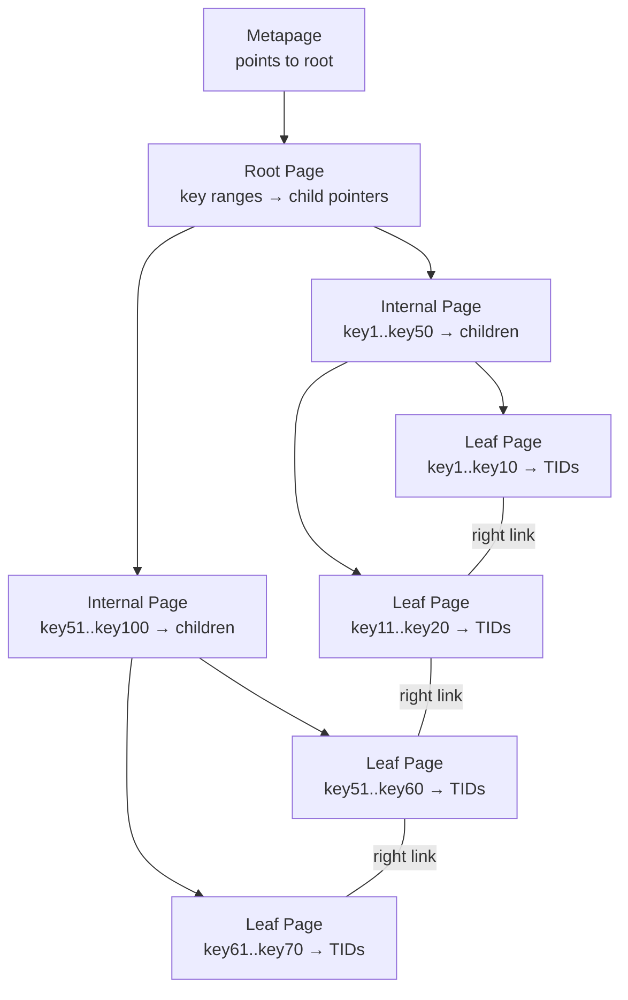
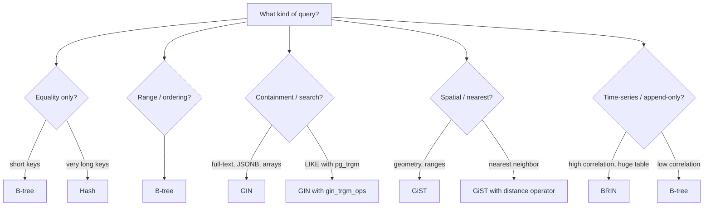

# PostgreSQL Indexing Internals: B-tree, GIN, GiST, BRIN, and Hash

**Date:** 2026-04-19
**Tags:** `postgresql` `indexing` `btree` `gin` `gist` `internals`

## Table of Contents

- [Summary](#summary)
- [B-tree Index](#b-tree-index)
  - [Internal Page Structure](#internal-page-structure)
  - [Page Splits](#page-splits)
  - [Deduplication (PG13+)](#deduplication-pg13)
  - [Range Scans and Ordering](#range-scans-and-ordering)
- [GIN (Generalized Inverted Index)](#gin-generalized-inverted-index)
  - [Structure and Use Cases](#structure-and-use-cases)
  - [Pending List and fastupdate](#pending-list-and-fastupdate)
- [GiST (Generalized Search Tree)](#gist-generalized-search-tree)
  - [Structure and Use Cases](#gist-structure-and-use-cases)
- [BRIN (Block Range Index)](#brin-block-range-index)
  - [How BRIN Works](#how-brin-works)
  - [When BRIN Shines](#when-brin-shines)
- [Hash Index](#hash-index)
- [Index-Only Scans and Covering Indexes](#index-only-scans-and-covering-indexes)
  - [INCLUDE Columns](#include-columns)
- [Partial and Expression Indexes](#partial-and-expression-indexes)
  - [Partial Indexes](#partial-indexes)
  - [Expression Indexes](#expression-indexes)
- [Index Monitoring](#index-monitoring)
- [Choosing the Right Index](#choosing-the-right-index)
- [References](#references)

## Summary

PostgreSQL supports multiple index types, each optimized for different query patterns. B-tree handles equality and range queries on scalar values. GIN serves full-text search, JSONB, and arrays. GiST covers geometric and range types. BRIN provides tiny indexes for naturally ordered data. Understanding the internal structure of each type is essential for choosing the right index and diagnosing query performance.

## B-tree Index

B-tree is the default index type and handles `=`, `<`, `>`, `<=`, `>=`, `BETWEEN`, `IN`, `IS NULL`, and pattern matching with a left-anchored `LIKE 'prefix%'`.

### Internal Page Structure

A B-tree index is a balanced tree of 8 KB pages:



- **Metapage** (page 0): Points to the current root
- **Internal pages**: Store keys and downlink pointers to child pages
- **Leaf pages**: Store keys and TIDs (tuple identifiers: page + offset into the heap)
- **Right links**: Leaf pages are chained left-to-right for efficient range scans

```sql
-- Inspect B-tree structure with pageinspect
CREATE EXTENSION IF NOT EXISTS pageinspect;

-- Metapage info
SELECT * FROM bt_metap('orders_pkey');

-- Page stats (page 1 = typically the root)
SELECT * FROM bt_page_stats('orders_pkey', 1);

-- Items on a leaf page
SELECT itemoffset, ctid, itemlen, data
FROM bt_page_items('orders_pkey', 1)
LIMIT 10;
```

### Page Splits

When a leaf page is full and a new key must be inserted:

1. A new page is allocated
2. Roughly half the entries move to the new page
3. The parent internal page gets a new downlink
4. If the parent is also full, it splits too (can cascade to the root)

Splits on monotonically increasing keys (auto-increment IDs, timestamps) always happen at the rightmost leaf, which PostgreSQL optimizes with a "fastpath" that avoids searching the tree.

### Deduplication (PG13+)

Before PG13, if 1000 rows had `status = 'active'`, the index stored 1000 separate entries with the same key. Deduplication compresses this into a single key with a "posting list" of TIDs:

```text
Before: ('active', TID1), ('active', TID2), ('active', TID3), ...
After:  ('active', [TID1, TID2, TID3, ...])
```

This can dramatically reduce index size for low-cardinality columns. Deduplication is enabled by default in PG13+ for B-tree indexes.

```sql
-- Check if deduplication is being used
SELECT
  indexrelid::regclass AS index_name,
  pg_size_pretty(pg_relation_size(indexrelid)) AS index_size
FROM pg_stat_user_indexes
WHERE indexrelname = 'idx_orders_status';
```

### Range Scans and Ordering

Because leaf pages are linked and sorted, a range scan like:

```sql
SELECT * FROM orders WHERE created_at BETWEEN '2026-01-01' AND '2026-01-31'
ORDER BY created_at;
```

traverses from root to the first matching leaf, then follows right links until the range is exhausted. The results arrive in order, so no sort is needed.

A B-tree created with `DESC` stores entries in reverse order, enabling efficient backward scans:

```sql
CREATE INDEX idx_orders_recent ON orders (created_at DESC);
```

## GIN (Generalized Inverted Index)

### Structure and Use Cases

GIN is an **inverted index**: it maps each element (word, array element, JSONB key) to the set of rows containing that element.

```text
Inverted index for tsvector column:

"postgresql" → [TID1, TID5, TID89, TID203]
"mvcc"       → [TID1, TID42]
"index"      → [TID5, TID42, TID89]
```

Use GIN for:
- **Full-text search** (`tsvector`, `tsquery`)
- **JSONB containment** (`@>`, `?`, `?|`, `?&`)
- **Array containment** (`@>`, `<@`, `&&`)
- **Trigram similarity** (`pg_trgm` extension)

```sql
-- Full-text search index
CREATE INDEX idx_articles_search ON articles USING gin(to_tsvector('english', body));

-- JSONB index (supports all JSONB operators)
CREATE INDEX idx_events_data ON events USING gin(data jsonb_path_ops);

-- Array index
CREATE INDEX idx_posts_tags ON posts USING gin(tags);

-- Trigram index for LIKE '%substring%' queries
CREATE EXTENSION IF NOT EXISTS pg_trgm;
CREATE INDEX idx_users_name_trgm ON users USING gin(name gin_trgm_ops);
```

### Pending List and fastupdate

GIN inserts are expensive because a single row can generate many index entries (one per word in a document). To amortize this cost, GIN uses a **pending list**:

1. New entries go into an unsorted pending list
2. When the list grows large enough (or VACUUM runs), entries are batch-merged into the main tree

```sql
-- Disable fastupdate if read latency matters more than write throughput
CREATE INDEX idx_articles_search ON articles USING gin(tsv)
  WITH (fastupdate = off);

-- Check pending list size
SELECT * FROM gin_clean_pending_list('idx_articles_search');
```

With `fastupdate = on` (default), queries must scan both the main tree and the pending list, which can slow reads when the pending list is large.

## GiST (Generalized Search Tree)

### GiST Structure and Use Cases

GiST is a balanced tree where each internal node stores a "bounding" predicate that covers all entries in its subtree. This makes it suitable for types where a bounding concept exists.

```text
GiST for geometric points:

Root: bounding box covers entire dataset
├── Node A: box(0,0 - 50,50)
│   ├── Leaf: point(10,20) → TID1
│   └── Leaf: point(30,40) → TID2
└── Node B: box(50,50 - 100,100)
    ├── Leaf: point(60,70) → TID3
    └── Leaf: point(90,80) → TID4
```

Use GiST for:
- **Geometric types** (`point`, `box`, `polygon`, `circle`)
- **Range types** (`int4range`, `tsrange`, `daterange`)
- **PostGIS** (spatial queries)
- **Nearest-neighbor searches** (`ORDER BY <-> distance_operator`)
- **Full-text search** (alternative to GIN, smaller but slower for many distinct terms)

```sql
-- Range overlap queries
CREATE INDEX idx_reservations_period ON reservations USING gist(during);

SELECT * FROM reservations
WHERE during && '[2026-04-01, 2026-04-30]'::daterange;

-- Nearest-neighbor with PostGIS
CREATE INDEX idx_stores_location ON stores USING gist(geom);

SELECT name, ST_Distance(geom, ST_MakePoint(-73.99, 40.75)::geography) AS dist
FROM stores
ORDER BY geom <-> ST_MakePoint(-73.99, 40.75)::geography
LIMIT 10;
```

GiST also supports **exclusion constraints** to enforce non-overlapping ranges:

```sql
CREATE TABLE meeting_rooms (
  id serial PRIMARY KEY,
  room_id int NOT NULL,
  during tsrange NOT NULL,
  EXCLUDE USING gist (room_id WITH =, during WITH &&)
);
```

## BRIN (Block Range Index)

### How BRIN Works

BRIN stores summary information (min/max values) for each contiguous range of heap pages. Instead of indexing individual tuples, it indexes **block ranges** (default 128 pages = 1 MB).

```text
BRIN for created_at column:

Block range [0-127]:    min=2026-01-01, max=2026-01-15
Block range [128-255]:  min=2026-01-15, max=2026-01-31
Block range [256-383]:  min=2026-02-01, max=2026-02-14
...
```

When a query asks for `WHERE created_at = '2026-01-20'`, BRIN eliminates all block ranges where the min/max do not include that value.

```sql
CREATE INDEX idx_events_created_brin ON events USING brin(created_at)
  WITH (pages_per_range = 64);

-- BRIN index is tiny compared to B-tree
SELECT
  indexrelname,
  pg_size_pretty(pg_relation_size(indexrelid)) AS size
FROM pg_stat_user_indexes
WHERE relname = 'events';
```

### When BRIN Shines

BRIN works well when the physical order of rows on disk correlates strongly with the indexed column. This happens naturally with:

- **Append-only tables** with timestamp columns (logs, events, audit trails)
- **Auto-increment primary keys** (though B-tree is usually fine here)
- Tables loaded in sorted order

```sql
-- Check physical correlation (1.0 = perfectly correlated)
SELECT attname, correlation
FROM pg_stats
WHERE tablename = 'events' AND attname = 'created_at';
```

If `correlation` is close to +1 or -1, BRIN will be effective. If it is close to 0, BRIN will scan most block ranges and perform worse than a sequential scan.

**BRIN vs B-tree trade-offs:**

| Factor | BRIN | B-tree |
|--------|------|--------|
| Index size | Tiny (KB-MB) | Large (MB-GB) |
| Point queries | Slow (scans block ranges) | Fast (tree traversal) |
| Range queries on correlated data | Excellent | Good |
| Write overhead | Minimal | Moderate |
| Works for uncorrelated data | No | Yes |

## Hash Index

Hash indexes use a hash function to map keys to buckets. They support **only equality** (`=`) comparisons.

```sql
CREATE INDEX idx_sessions_token ON sessions USING hash(session_token);
```

Since PG10, hash indexes are WAL-logged and crash-safe. They can be smaller than B-tree for high-cardinality equality lookups because they do not store the full key in leaf pages.

When to consider hash over B-tree:
- Only equality checks on the column
- Very long key values (hash stores a 4-byte hash, not the full key)
- Tight on disk space

In practice, B-tree handles equality efficiently enough that hash indexes are rarely necessary.

## Index-Only Scans and Covering Indexes

An **index-only scan** reads data directly from the index without touching the heap. This requires:

1. All columns needed by the query are in the index
2. The page is marked all-visible in the visibility map (otherwise a heap fetch is needed to check tuple visibility)

```sql
-- This query can use index-only scan if an index covers both columns
EXPLAIN ANALYZE
SELECT customer_id, order_date FROM orders
WHERE customer_id = 42;
```

### INCLUDE Columns

PG11 added `INCLUDE` for non-searchable payload columns in B-tree indexes:

```sql
-- B-tree on (customer_id) with order_date and total as payload
CREATE INDEX idx_orders_customer_covering
  ON orders (customer_id)
  INCLUDE (order_date, total_amount);
```

The `INCLUDE` columns are stored in leaf pages but are **not part of the sort order** and cannot be used for filtering or ordering. They exist solely to enable index-only scans.

```sql
-- This query is fully satisfied by the covering index
EXPLAIN ANALYZE
SELECT order_date, total_amount
FROM orders
WHERE customer_id = 42;
-- → Index Only Scan using idx_orders_customer_covering
```

## Partial and Expression Indexes

### Partial Indexes

A partial index covers only rows matching a `WHERE` predicate. This reduces index size and maintenance cost.

```sql
-- Only index unprocessed orders (90% of rows might be processed)
CREATE INDEX idx_orders_pending ON orders (created_at)
  WHERE status = 'pending';

-- The planner uses this index only when the query includes a compatible predicate
EXPLAIN ANALYZE
SELECT * FROM orders WHERE status = 'pending' AND created_at > now() - interval '1 day';
```

For JPA/Spring applications, partial indexes are invisible to the ORM. They work at the database level, but your repository queries must include the matching `WHERE` clause for the planner to use them.

### Expression Indexes

Index a computed expression rather than a raw column:

```sql
-- Case-insensitive email lookup
CREATE INDEX idx_users_email_lower ON users (lower(email));

-- Extract year from timestamp
CREATE INDEX idx_orders_year ON orders ((extract(year FROM created_at)));

-- JSONB field extraction
CREATE INDEX idx_events_type ON events ((data->>'type'));
```

The query must use the **exact same expression** for the planner to match:

```sql
-- Uses the index
SELECT * FROM users WHERE lower(email) = 'user@example.com';

-- Does NOT use the index (different expression)
SELECT * FROM users WHERE email = 'user@example.com';
```

## Index Monitoring

```sql
-- Index usage statistics
SELECT
  schemaname,
  relname AS table_name,
  indexrelname AS index_name,
  idx_scan AS times_used,
  idx_tup_read AS tuples_read,
  idx_tup_fetch AS tuples_fetched,
  pg_size_pretty(pg_relation_size(indexrelid)) AS index_size
FROM pg_stat_user_indexes
ORDER BY idx_scan ASC;

-- Find unused indexes (candidates for removal)
SELECT
  schemaname || '.' || relname AS table,
  indexrelname AS index,
  pg_size_pretty(pg_relation_size(indexrelid)) AS size,
  idx_scan AS scans
FROM pg_stat_user_indexes
WHERE idx_scan = 0
  AND indexrelname NOT LIKE '%_pkey'    -- keep primary keys
  AND schemaname NOT IN ('pg_catalog')
ORDER BY pg_relation_size(indexrelid) DESC;

-- Index bloat (ratio of actual vs minimum size)
-- High bloat = consider REINDEX CONCURRENTLY
SELECT
  indexrelname,
  pg_size_pretty(pg_relation_size(indexrelid)) AS current_size,
  idx_scan
FROM pg_stat_user_indexes
WHERE relname = 'orders';
```

## Choosing the Right Index



| Index Type | Best For | Operators | Size |
|-----------|----------|-----------|------|
| B-tree | Equality, range, sorting | `= < > <= >= BETWEEN IN` | Medium-Large |
| GIN | Multi-valued columns, text search | `@> <@ && ? ts_query` | Large |
| GiST | Spatial, ranges, exclusion | `&& <@ @> << >> <-> ~=` | Medium |
| BRIN | Naturally ordered large tables | `= < > <= >=` | Tiny |
| Hash | Equality on long values | `=` | Small-Medium |

## References

- [Index Types](https://www.postgresql.org/docs/current/indexes-types.html)
- [B-tree Indexes](https://www.postgresql.org/docs/current/btree.html)
- [GIN Indexes](https://www.postgresql.org/docs/current/gin.html)
- [GiST Indexes](https://www.postgresql.org/docs/current/gist.html)
- [BRIN Indexes](https://www.postgresql.org/docs/current/brin.html)
- [Index-Only Scans](https://www.postgresql.org/docs/current/indexes-index-only-scans.html)
- [Partial Indexes](https://www.postgresql.org/docs/current/indexes-partial.html)
- [Expression Indexes](https://www.postgresql.org/docs/current/indexes-expressional.html)
- [CREATE INDEX](https://www.postgresql.org/docs/current/sql-createindex.html)
- [pageinspect B-tree Functions](https://www.postgresql.org/docs/current/pageinspect.html#PAGEINSPECT-B-TREE-FUNCS)
- [Monitoring Statistics](https://www.postgresql.org/docs/current/monitoring-stats.html)
