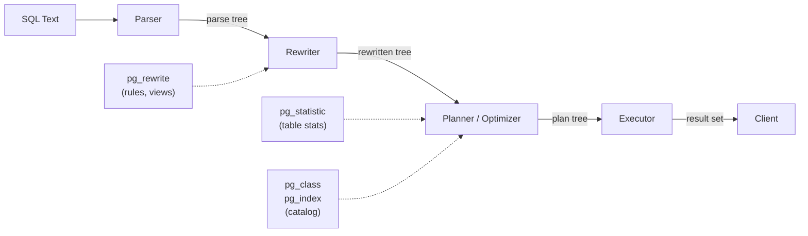
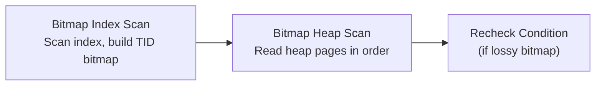

# PostgreSQL Query Planner and Executor

**Date:** 2026-04-19
**Tags:** `postgresql` `query-planner` `explain` `optimization` `internals`

## Table of Contents

- [Summary](#summary)
- [Query Processing Pipeline](#query-processing-pipeline)
  - [Parse](#parse)
  - [Rewrite](#rewrite)
  - [Plan](#plan)
  - [Execute](#execute)
- [Cost Model](#cost-model)
  - [Cost Parameters](#cost-parameters)
  - [How Costs Are Calculated](#how-costs-are-calculated)
- [Planner Statistics](#planner-statistics)
  - [pg_statistic and pg_stats](#pg_statistic-and-pg_stats)
  - [Most Common Values and Histograms](#most-common-values-and-histograms)
  - [n_distinct and Correlation](#n_distinct-and-correlation)
  - [ANALYZE and Auto-Analyze](#analyze-and-auto-analyze)
- [Scan Types](#scan-types)
  - [Sequential Scan](#sequential-scan)
  - [Index Scan](#index-scan)
  - [Index Only Scan](#index-only-scan)
  - [Bitmap Scan](#bitmap-scan)
- [Join Algorithms](#join-algorithms)
  - [Nested Loop Join](#nested-loop-join)
  - [Hash Join](#hash-join)
  - [Merge Join](#merge-join)
  - [When Each Is Chosen](#when-each-is-chosen)
- [Reading EXPLAIN ANALYZE Output](#reading-explain-analyze-output)
  - [Basic EXPLAIN](#basic-explain)
  - [EXPLAIN ANALYZE with BUFFERS](#explain-analyze-with-buffers)
  - [Key Fields to Watch](#key-fields-to-watch)
- [Common Planner Mistakes and Fixes](#common-planner-mistakes-and-fixes)
  - [Wrong Row Estimates](#wrong-row-estimates)
  - [Missing or Stale Statistics](#missing-or-stale-statistics)
  - [Correlated Columns](#correlated-columns)
  - [Parameter Sniffing with Prepared Statements](#parameter-sniffing-with-prepared-statements)
- [References](#references)

## Summary

PostgreSQL processes a SQL query through four stages: parse, rewrite, plan, and execute. The planner uses a cost model driven by table statistics to choose between scan types and join algorithms. Understanding how to read `EXPLAIN ANALYZE` output and knowing when the planner makes bad estimates is essential for diagnosing slow queries in any JPA/R2DBC application.

## Query Processing Pipeline



### Parse

The parser converts SQL text into a parse tree. This stage catches syntax errors but does not verify that tables or columns exist.

```sql
-- This passes parsing but fails later (semantic check)
-- SELECT * FORM users;  → syntax error caught here
-- SELECT * FROM nonexistent_table;  → caught in analysis phase
```

After parsing, the analyzer resolves names against the system catalog, checks types, and produces a **query tree**.

### Rewrite

The rewrite system applies rules stored in `pg_rewrite`. The most common use is **view expansion**: when you query a view, the rewriter inlines the view definition.

```sql
-- This view query:
SELECT * FROM active_users;

-- Gets rewritten to:
SELECT * FROM users WHERE status = 'active' AND deleted_at IS NULL;
```

Row-level security (RLS) policies are also applied during rewriting.

### Plan

The planner (optimizer) takes the rewritten query tree and produces an execution plan. PostgreSQL uses a **cost-based optimizer** that:

1. Enumerates possible access paths for each table (seq scan, index scan, bitmap scan)
2. Enumerates possible join orders and algorithms
3. Estimates the cost of each combination using statistics
4. Picks the plan with the lowest estimated total cost

For queries with many joined tables, exhaustive enumeration is too expensive. PostgreSQL switches to the **Genetic Query Optimizer (GEQO)** when the number of tables exceeds `geqo_threshold` (default 12).

### Execute

The executor walks the plan tree using an **iterator model** (Volcano/pull model). Each node implements:

- `Init()` — set up state
- `Next()` — return the next tuple (or NULL if done)
- `End()` — clean up

The top node calls `Next()` on its children, which call `Next()` on their children, forming a pipeline that processes tuples one at a time (or in batches for certain nodes).

## Cost Model

### Cost Parameters

The planner assigns abstract cost units to I/O and CPU operations:

| Parameter | Default | Represents |
|-----------|---------|-----------|
| `seq_page_cost` | 1.0 | Cost of reading one page sequentially |
| `random_page_cost` | 4.0 | Cost of reading one page randomly |
| `cpu_tuple_cost` | 0.01 | Cost of processing one tuple |
| `cpu_index_tuple_cost` | 0.005 | Cost of processing one index entry |
| `cpu_operator_cost` | 0.0025 | Cost of evaluating one operator |
| `effective_cache_size` | 4 GB | Planner's estimate of OS + PG cache size |

```sql
-- View current settings
SHOW seq_page_cost;
SHOW random_page_cost;
SHOW effective_cache_size;

-- For SSDs, reduce random_page_cost (random reads are nearly as fast as sequential)
SET random_page_cost = 1.1;
```

The ratio `random_page_cost / seq_page_cost` is more important than absolute values. A high ratio favors sequential scans; a low ratio favors index scans. For SSDs, setting `random_page_cost` between 1.1 and 1.5 better reflects reality.

### How Costs Are Calculated

A plan node's cost is expressed as `(startup_cost..total_cost)`:

- **Startup cost**: Cost before the first tuple can be returned (e.g., building a hash table)
- **Total cost**: Cost to return all tuples

```text
Example: Seq Scan on orders  (cost=0.00..18334.00 rows=1000000 width=48)
  startup = 0.00 (no setup needed for seq scan)
  total = 0.00 + (num_pages * seq_page_cost) + (num_tuples * cpu_tuple_cost)
        = 8334 * 1.0 + 1000000 * 0.01
        = 18334.00
```

For an index scan:

```text
Index Scan on orders_pkey  (cost=0.42..8.44 rows=1 width=48)
  startup = 0.42 (tree descent cost)
  total = startup + (pages_fetched * random_page_cost) + (tuples * cpu costs)
```

## Planner Statistics

### pg_statistic and pg_stats

The planner's quality depends entirely on the accuracy of table statistics. Raw stats are in `pg_statistic`; the human-readable view is `pg_stats`.

```sql
SELECT
  attname,
  null_frac,
  avg_width,
  n_distinct,
  most_common_vals,
  most_common_freqs,
  histogram_bounds,
  correlation
FROM pg_stats
WHERE tablename = 'orders' AND attname = 'status';
```

### Most Common Values and Histograms

| Statistic | Purpose |
|-----------|---------|
| `most_common_vals` | Array of the N most frequent values |
| `most_common_freqs` | Corresponding frequencies (fractions of total rows) |
| `histogram_bounds` | Equally-populated bucket boundaries for remaining values |

```text
Example for orders.status:
  most_common_vals:  {active, completed, pending, cancelled}
  most_common_freqs: {0.45, 0.30, 0.15, 0.10}

Example for orders.total_amount:
  histogram_bounds: {0.50, 15.99, 29.99, 49.99, 99.99, 249.99, 999.99}
  (6 buckets, each containing ~1/6 of non-MCV rows)
```

The planner uses MCV for common value lookups and the histogram for range queries. When you filter `WHERE status = 'active'`, the planner knows this returns ~45% of rows and chooses a seq scan. For `WHERE status = 'cancelled'`, only ~10%, so an index scan may win.

### n_distinct and Correlation

| Statistic | Meaning |
|-----------|---------|
| `n_distinct > 0` | Estimated number of distinct values |
| `n_distinct < 0` | Negative means fraction of rows (e.g., -1 = all unique) |
| `correlation` | Statistical correlation between physical row order and logical column order |

```sql
-- High correlation (close to 1 or -1) = BRIN-friendly, sequential patterns
-- Low correlation (close to 0) = random physical order
SELECT attname, correlation
FROM pg_stats
WHERE tablename = 'orders';
```

### ANALYZE and Auto-Analyze

`ANALYZE` collects statistics by sampling the table (default 300 * `default_statistics_target` rows).

```sql
-- Manual analyze
ANALYZE orders;

-- Increase sample size for a column with unusual distribution
ALTER TABLE orders ALTER COLUMN status SET STATISTICS 1000;
ANALYZE orders;

-- Check when auto-analyze last ran
SELECT
  relname,
  last_analyze,
  last_autoanalyze,
  n_mod_since_analyze
FROM pg_stat_user_tables
WHERE relname = 'orders';
```

Auto-analyze triggers when:

```text
modified_rows > autovacuum_analyze_threshold + autovacuum_analyze_scale_factor * n_live_tup
```

Default: 50 + 10% of live rows. For a 1M-row table, auto-analyze fires after ~100,050 modifications.

## Scan Types

### Sequential Scan

Reads every page of the table in order. Chosen when:
- No useful index exists
- The query returns a large fraction of the table
- The table is very small

```sql
EXPLAIN SELECT * FROM orders WHERE total_amount > 10;
-- Seq Scan on orders  (cost=0.00..20834.00 rows=900000 ...)
--   Filter: (total_amount > 10)
```

### Index Scan

Traverses the B-tree (or other index) to find matching TIDs, then fetches each tuple from the heap. Each heap fetch is a random read.

```sql
EXPLAIN SELECT * FROM orders WHERE id = 42;
-- Index Scan using orders_pkey on orders  (cost=0.42..8.44 rows=1 ...)
--   Index Cond: (id = 42)
```

### Index Only Scan

Same as index scan but skips the heap fetch when the visibility map confirms the page is all-visible. Requires a covering index.

```sql
EXPLAIN SELECT id FROM orders WHERE id BETWEEN 100 AND 200;
-- Index Only Scan using orders_pkey on orders  (cost=0.42..6.20 rows=101 ...)
--   Index Cond: ((id >= 100) AND (id <= 200))
--   Heap Fetches: 0   -- all pages were all-visible
```

### Bitmap Scan

A two-phase scan for medium selectivity queries:



1. **Bitmap Index Scan**: Walk the index and build an in-memory bitmap of pages containing matching tuples
2. **Bitmap Heap Scan**: Read those pages in physical order (converting random I/O to sequential)

```sql
EXPLAIN ANALYZE SELECT * FROM orders WHERE customer_id IN (42, 43, 44);
-- Bitmap Heap Scan on orders  (cost=12.85..1234.56 rows=300 ...)
--   Recheck Cond: (customer_id = ANY ('{42,43,44}'::integer[]))
--   Heap Blocks: exact=45
--   ->  Bitmap Index Scan on idx_orders_customer  (cost=0.00..12.78 rows=300 ...)
```

Multiple bitmap scans can be combined with BitmapAnd / BitmapOr to handle multi-column predicates without a composite index.

## Join Algorithms

### Nested Loop Join

For each row in the outer table, scan the inner table for matches. Best when:
- Outer side has few rows
- Inner side has an efficient index

```text
Nested Loop  (cost=0.42..845.00 rows=10 ...)
  ->  Index Scan on customers  (cost=0.42..8.44 rows=1 ...)  -- outer
        Index Cond: (id = 42)
  ->  Index Scan on orders  (cost=0.42..836.00 rows=10 ...)  -- inner (per outer row)
        Index Cond: (customer_id = customers.id)
```

Cost: `O(outer_rows * inner_index_lookup_cost)`

### Hash Join

Build a hash table on the smaller table, then probe it with rows from the larger table.

```text
Hash Join  (cost=350.00..5500.00 rows=10000 ...)
  Hash Cond: (orders.customer_id = customers.id)
  ->  Seq Scan on orders  (cost=0.00..4000.00 rows=100000 ...)  -- probe
  ->  Hash  (cost=200.00..200.00 rows=5000 ...)                 -- build
        ->  Seq Scan on customers  (cost=0.00..200.00 rows=5000 ...)
```

Cost: `O(build_rows + probe_rows)`, but requires `work_mem` to hold the hash table. If it spills to disk, performance degrades.

### Merge Join

Both inputs must be sorted on the join key. Walks both sorted lists in parallel.

```text
Merge Join  (cost=0.85..12345.00 rows=50000 ...)
  Merge Cond: (orders.customer_id = customers.id)
  ->  Index Scan on idx_orders_customer  (cost=0.42..9000.00 ...)  -- pre-sorted
  ->  Index Scan on customers_pkey  (cost=0.42..500.00 ...)        -- pre-sorted
```

Cost: `O(outer_rows + inner_rows)` when pre-sorted. If a sort is needed, add the sort cost.

### When Each Is Chosen

| Algorithm | Best When | Requires |
|-----------|----------|----------|
| Nested Loop | Small outer, indexed inner | Index on join key |
| Hash Join | Medium-to-large tables, no useful ordering | `work_mem` for hash table |
| Merge Join | Both sides sorted or can use sorted index | Sorted input |

```sql
-- Force a specific join method (for testing only, not production)
SET enable_hashjoin = off;
SET enable_mergejoin = off;
-- Then EXPLAIN ANALYZE to see the nested loop plan
-- Remember to reset:
RESET enable_hashjoin;
RESET enable_mergejoin;
```

## Reading EXPLAIN ANALYZE Output

### Basic EXPLAIN

```sql
-- Estimated plan only (does not run the query)
EXPLAIN SELECT * FROM orders WHERE customer_id = 42;
```

### EXPLAIN ANALYZE with BUFFERS

```sql
-- Actually runs the query and shows real timing and buffer stats
EXPLAIN (ANALYZE, BUFFERS, FORMAT TEXT)
SELECT o.id, o.total_amount, c.name
FROM orders o
JOIN customers c ON c.id = o.customer_id
WHERE o.status = 'pending'
  AND o.created_at > now() - interval '7 days';
```

Sample output:

```text
Hash Join  (cost=205.00..5678.90 rows=500 width=52) (actual time=2.1..45.3 rows=487 loops=1)
  Hash Cond: (o.customer_id = c.id)
  Buffers: shared hit=1234 read=56
  ->  Bitmap Heap Scan on orders o  (cost=12.50..5400.00 rows=500 width=20) (actual time=1.5..40.2 rows=487 loops=1)
        Recheck Cond: (status = 'pending')
        Filter: (created_at > (now() - '7 days'::interval))
        Rows Removed by Filter: 2013
        Heap Blocks: exact=450
        Buffers: shared hit=1200 read=50
        ->  Bitmap Index Scan on idx_orders_status  (cost=0.00..12.37 rows=2500 width=0) (actual time=0.8..0.8 rows=2500 loops=1)
              Index Cond: (status = 'pending')
              Buffers: shared hit=5
  ->  Hash  (cost=155.00..155.00 rows=4000 width=36) (actual time=0.5..0.5 rows=4000 loops=1)
        Buckets: 4096  Batches: 1  Memory Usage: 250kB
        Buffers: shared hit=34 read=6
        ->  Seq Scan on customers c  (cost=0.00..155.00 rows=4000 width=36) (actual time=0.01..0.3 rows=4000 loops=1)
              Buffers: shared hit=34 read=6
Planning Time: 0.2 ms
Execution Time: 45.8 ms
```

### Key Fields to Watch

| Field | What to Look For |
|-------|-----------------|
| `rows` (estimated vs actual) | Large mismatch = stale or missing statistics |
| `loops` | Multiply actual time and rows by loops for true totals |
| `Buffers: shared hit` | Pages found in shared buffers (good) |
| `Buffers: shared read` | Pages read from OS/disk (expensive) |
| `Rows Removed by Filter` | High values = index could be more selective |
| `Heap Blocks: exact vs lossy` | Lossy = bitmap exceeded `work_mem`, lost tuple-level precision |
| `Sort Method: external merge` | Sort spilled to disk; increase `work_mem` |
| `Hash Batches > 1` | Hash table spilled to disk; increase `work_mem` |

**The most important signal:** Compare `rows` estimated vs actual at every node. When they diverge by 10x or more, the planner is making bad decisions downstream.

## Common Planner Mistakes and Fixes

### Wrong Row Estimates

```sql
-- Planner estimated 10 rows, got 50000 → chose nested loop instead of hash join
EXPLAIN ANALYZE
SELECT * FROM orders o JOIN products p ON p.id = o.product_id
WHERE o.status = 'pending' AND p.category = 'electronics';
```

Fixes:
1. Run `ANALYZE` on both tables
2. Increase `default_statistics_target` for columns with unusual distributions
3. Create extended statistics for correlated columns (PG10+)

### Missing or Stale Statistics

```sql
-- Check when stats were last collected
SELECT
  relname,
  last_analyze,
  last_autoanalyze,
  n_mod_since_analyze
FROM pg_stat_user_tables
WHERE n_mod_since_analyze > 0
ORDER BY n_mod_since_analyze DESC;

-- Force fresh stats
ANALYZE orders;
ANALYZE products;
```

After bulk loads or large deletes, always run `ANALYZE` immediately. Do not wait for auto-analyze.

### Correlated Columns

The planner assumes column predicates are independent. If `city = 'Tokyo'` returns 5% and `country = 'Japan'` returns 10%, the planner estimates `city = 'Tokyo' AND country = 'Japan'` returns 0.5%. In reality, it returns 5%.

```sql
-- Create extended statistics to inform the planner about correlation
CREATE STATISTICS stat_orders_city_country (dependencies)
  ON city, country FROM customers;

ANALYZE customers;
```

PG12+ supports multi-column MCV lists:

```sql
CREATE STATISTICS stat_orders_city_country (mcv)
  ON city, country FROM customers;
```

### Parameter Sniffing with Prepared Statements

JPA/Hibernate and R2DBC use prepared statements by default. PostgreSQL plans the first 5 executions with specific parameter values (custom plans), then may switch to a generic plan.

```sql
-- The generic plan might be worse if parameter values have different selectivity
-- status = 'active' (45% of rows) → seq scan is optimal
-- status = 'cancelled' (0.1% of rows) → index scan is optimal
-- Generic plan picks one approach for all values

-- Check if you're getting custom or generic plans
PREPARE q AS SELECT * FROM orders WHERE status = $1;
EXPLAIN EXECUTE q('active');      -- custom plan (seq scan)
EXPLAIN EXECUTE q('cancelled');   -- custom plan (index scan)
-- After 5 executions, may switch to generic plan
```

For Spring/HikariCP, you can control this at the JDBC level:

```text
# application.properties
spring.datasource.hikari.data-source-properties.prepareThreshold=0
# Setting to 0 disables generic plans (always custom), at the cost of planning overhead
```

A more targeted approach is to increase statistics on the problematic column so the generic plan is more accurate:

```sql
ALTER TABLE orders ALTER COLUMN status SET STATISTICS 1000;
ANALYZE orders;
```

## References

- [Query Planning](https://www.postgresql.org/docs/current/planner-optimizer.html)
- [Using EXPLAIN](https://www.postgresql.org/docs/current/using-explain.html)
- [Planner Cost Constants](https://www.postgresql.org/docs/current/runtime-config-query.html#RUNTIME-CONFIG-QUERY-CONSTANTS)
- [Row Estimation Examples](https://www.postgresql.org/docs/current/row-estimation-examples.html)
- [Extended Statistics](https://www.postgresql.org/docs/current/planner-stats.html#PLANNER-STATS-EXTENDED)
- [ANALYZE](https://www.postgresql.org/docs/current/sql-analyze.html)
- [Join Strategies](https://www.postgresql.org/docs/current/planner-optimizer.html)
- [Genetic Query Optimizer](https://www.postgresql.org/docs/current/geqo.html)
- [pg_stat_user_tables](https://www.postgresql.org/docs/current/monitoring-stats.html#MONITORING-PG-STAT-ALL-TABLES-VIEW)
- [pg_stats View](https://www.postgresql.org/docs/current/view-pg-stats.html)
