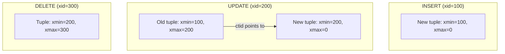
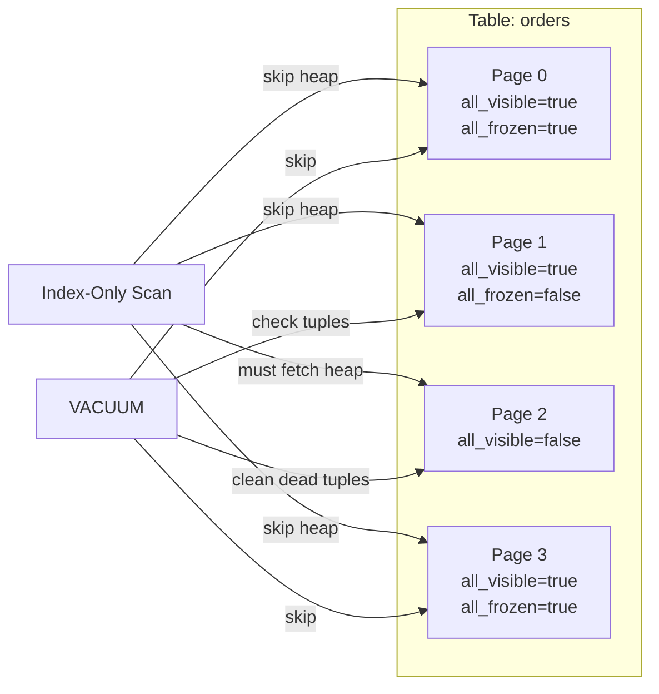

# PostgreSQL Storage and MVCC: Heap Tuples, Visibility, and Bloat

**Date:** 2026-04-19
**Tags:** `postgresql` `mvcc` `storage` `tuples` `internals`

## Table of Contents

- [Summary](#summary)
- [Page Layout](#page-layout)
  - [Page Header](#page-header)
  - [Item Pointers (Line Pointers)](#item-pointers-line-pointers)
  - [Tuples and Free Space](#tuples-and-free-space)
- [Tuple Header](#tuple-header)
  - [Key Header Fields](#key-header-fields)
  - [Infomask Bits](#infomask-bits)
- [MVCC: Multi-Version Concurrency Control](#mvcc-multi-version-concurrency-control)
  - [How INSERT, UPDATE, DELETE Work](#how-insert-update-delete-work)
  - [Visibility Rules](#visibility-rules)
  - [Snapshot Isolation](#snapshot-isolation)
- [Dead Tuples and Table Bloat](#dead-tuples-and-table-bloat)
  - [How Bloat Accumulates](#how-bloat-accumulates)
  - [Measuring Bloat](#measuring-bloat)
- [HOT (Heap-Only Tuples)](#hot-heap-only-tuples)
- [TOAST: The Oversized-Attribute Storage Technique](#toast-the-oversized-attribute-storage-technique)
- [Visibility Map and Free Space Map](#visibility-map-and-free-space-map)
  - [Visibility Map](#visibility-map)
  - [Free Space Map](#free-space-map)
- [References](#references)

## Summary

PostgreSQL stores table data as 8 KB pages containing heap tuples. Each tuple carries header fields (`xmin`, `xmax`, `ctid`, `infomask`) that drive MVCC visibility decisions. Concurrent transactions see different tuple versions based on snapshot isolation rules. Dead tuples left by updates and deletes cause table bloat until VACUUM reclaims the space.

## Page Layout

Every table and index in PostgreSQL is stored as an array of fixed-size 8 KB pages (blocks). The on-disk layout of a heap page:

```text
+---------------------------------------------------+
| Page Header (24 bytes)                            |
+---------------------------------------------------+
| Item Pointer 1 | Item Pointer 2 | ... | IP N     |
+---------------------------------------------------+
|                                                   |
|              Free Space                           |
|                                                   |
+---------------------------------------------------+
| Tuple N | ... | Tuple 2 | Tuple 1                |
+---------------------------------------------------+
| Special Space (0 bytes for heap pages)            |
+---------------------------------------------------+
```

Item pointers grow downward from the top. Tuples grow upward from the bottom. They meet in the middle.

### Page Header

The 24-byte page header contains:

| Field | Size | Purpose |
|-------|------|---------|
| `pd_lsn` | 8 bytes | LSN of last WAL record that modified this page |
| `pd_checksum` | 2 bytes | Page checksum (if enabled) |
| `pd_flags` | 2 bytes | Page-level flags |
| `pd_lower` | 2 bytes | Offset to start of free space |
| `pd_upper` | 2 bytes | Offset to end of free space |
| `pd_special` | 2 bytes | Offset to start of special space |
| `pd_pagesize_version` | 2 bytes | Page size and layout version |
| `pd_prune_xid` | 4 bytes | Oldest prunable XID on this page |

The `pd_lsn` is critical for WAL replay: during recovery, PostgreSQL skips pages whose LSN is already past the WAL record being replayed.

### Item Pointers (Line Pointers)

Each item pointer is a 4-byte entry that stores:
- **Offset** to the tuple within the page
- **Length** of the tuple
- **Flags** (normal, redirect, dead, unused)

Item pointers are never physically removed; they are marked dead or redirected. This is why `ctid` references (page, offset) remain stable within a page.

```sql
-- Inspect item pointers with pageinspect
CREATE EXTENSION IF NOT EXISTS pageinspect;

SELECT lp, lp_off, lp_flags, lp_len, t_xmin, t_xmax, t_ctid
FROM heap_page_items(get_raw_page('orders', 0));
```

### Tuples and Free Space

Tuples are stored from the end of the page backward. Each tuple consists of:
1. **Tuple header** (~23 bytes + padding)
2. **Null bitmap** (if any columns are nullable)
3. **User data** (actual column values)

The gap between item pointers and tuples is free space. When free space is exhausted, PostgreSQL must find another page or extend the file.

## Tuple Header

### Key Header Fields

```text
HeapTupleHeaderData:
  t_xmin      (4 bytes) - XID of the inserting transaction
  t_xmax      (4 bytes) - XID of the deleting/locking transaction
  t_cid       (4 bytes) - Command ID within the transaction
  t_ctid      (6 bytes) - Current tuple ID (page, offset)
  t_infomask2 (2 bytes) - Number of attributes + flags
  t_infomask  (2 bytes) - Visibility and status flags
  t_hoff      (1 byte)  - Offset to user data
```

| Field | What It Tells You |
|-------|------------------|
| `xmin` | Which transaction created this tuple version |
| `xmax` | Which transaction deleted or updated this version (0 if still live) |
| `ctid` | Points to itself if current, or to the newer version if updated |
| `cid` | Distinguishes multiple operations within the same transaction |

```sql
-- See xmin, xmax, ctid for actual rows
SELECT xmin, xmax, ctid, id, status FROM orders LIMIT 5;
```

```text
 xmin  | xmax  |  ctid  | id |  status
-------+-------+--------+----+---------
  1001 |     0 | (0,1)  |  1 | active
  1002 |  1050 | (0,2)  |  2 | active    -- xmax set = being deleted or updated
  1003 |     0 | (0,3)  |  3 | pending
```

### Infomask Bits

The `t_infomask` field contains bit flags that avoid repeated CLOG lookups:

| Flag | Meaning |
|------|---------|
| `HEAP_XMIN_COMMITTED` | Inserting transaction is known committed |
| `HEAP_XMIN_INVALID` | Inserting transaction is known aborted |
| `HEAP_XMAX_COMMITTED` | Deleting transaction is known committed |
| `HEAP_XMAX_INVALID` | Deleting transaction is known aborted (tuple is still live) |
| `HEAP_UPDATED` | Tuple was created by an UPDATE (not an INSERT) |
| `HEAP_HOT_UPDATED` | Tuple was HOT-updated (no index update needed) |

These "hint bits" are set lazily. The first transaction to check a tuple's visibility sets the hint bit so subsequent checks skip the CLOG lookup. This is why read-only queries can still dirty pages.

## MVCC: Multi-Version Concurrency Control

### How INSERT, UPDATE, DELETE Work



- **INSERT:** Creates a new tuple with `xmin = current_xid`, `xmax = 0`
- **UPDATE:** Sets `xmax = current_xid` on old tuple, creates new tuple with `xmin = current_xid`, old tuple's `ctid` points to new tuple
- **DELETE:** Sets `xmax = current_xid` on the tuple (no new tuple created)

No tuple is ever modified in place. This is the core MVCC principle.

### Visibility Rules

A tuple is visible to a transaction's snapshot if:

```text
Visible when ALL of:
  1. xmin is committed AND xmin < snapshot_xmax AND xmin NOT IN snapshot_xip
  2. EITHER:
     a. xmax is 0 (not deleted), OR
     b. xmax is aborted, OR
     c. xmax is committed BUT xmax >= snapshot_xmax OR xmax IN snapshot_xip
        (the deleter committed after our snapshot was taken)
```

Simplified:
- The inserting transaction must have committed before our snapshot
- The deleting transaction must either not exist, have aborted, or have committed after our snapshot

### Snapshot Isolation

When a transaction starts (or at each statement in READ COMMITTED), PostgreSQL takes a snapshot consisting of:

| Snapshot Field | Meaning |
|----------------|---------|
| `xmin` | Lowest still-active XID at snapshot time (all lower XIDs are definitely committed or aborted) |
| `xmax` | First unassigned XID at snapshot time (all >= this are invisible) |
| `xip[]` | List of in-progress XIDs at snapshot time (these are invisible even though < xmax) |

```sql
-- See current snapshot (in a transaction)
BEGIN TRANSACTION ISOLATION LEVEL REPEATABLE READ;
SELECT pg_current_snapshot();  -- renamed from txid_current_snapshot() in PG 13
-- Returns: xmin:xmax:xip_list
-- Example: 100:105:102,104
-- Meaning: XIDs < 100 are done, 105+ don't exist yet, 102 and 104 are in-progress
```

In **READ COMMITTED** (PostgreSQL default, and what JPA/Spring uses by default), a new snapshot is taken for each SQL statement. In **REPEATABLE READ**, the snapshot is taken at the first query and reused for the entire transaction.

## Dead Tuples and Table Bloat

### How Bloat Accumulates

Consider a table with 1 million rows that gets 10% of its rows updated daily:

```text
Day 0: 1,000,000 live tuples
Day 1: 1,000,000 live + 100,000 dead (from updates)
Day 2: 1,000,000 live + 200,000 dead (if VACUUM hasn't run)
...
```

Each dead tuple still occupies space on disk. Indexes still point to dead tuples. Sequential scans still read pages containing dead tuples.

Even after VACUUM reclaims dead tuples, the space is reusable within PostgreSQL but not returned to the OS (the file does not shrink). Only `VACUUM FULL` (which rewrites the entire table with an exclusive lock) or `pg_repack` (online) can shrink the physical file.

### Measuring Bloat

```sql
-- Quick estimate using pg_stat_user_tables
SELECT
  schemaname,
  relname,
  pg_size_pretty(pg_total_relation_size(relid)) AS total_size,
  n_live_tup,
  n_dead_tup,
  round(100.0 * n_dead_tup / nullif(n_live_tup + n_dead_tup, 0), 1) AS dead_pct
FROM pg_stat_user_tables
WHERE n_dead_tup > 10000
ORDER BY n_dead_tup DESC;

-- More accurate bloat estimate using pgstattuple
CREATE EXTENSION IF NOT EXISTS pgstattuple;

SELECT
  table_len,
  tuple_count,
  tuple_len,
  dead_tuple_count,
  dead_tuple_len,
  free_space,
  round(100.0 * free_space / table_len, 1) AS free_pct
FROM pgstattuple('orders');
```

## HOT (Heap-Only Tuples)

HOT is an optimization for updates that do not change any indexed column. When a HOT update occurs:

1. New tuple version is placed on the **same page** as the old version
2. No index entry is created for the new version
3. The old tuple's `ctid` chains to the new one
4. Index entries still point to the old tuple; following the ctid chain finds the current version

```text
Index entry → (page 5, item 3) → [old tuple, ctid=(5,7)] → [new tuple, ctid=(5,7)]
```

Benefits:
- No index maintenance for the update
- VACUUM can reclaim the old tuple and redirect the item pointer
- Dramatically reduces I/O for update-heavy workloads

HOT requires:
- New version fits on the same page (enough free space)
- No indexed column was modified

```sql
-- Monitor HOT update ratio
SELECT
  relname,
  n_tup_upd,
  n_tup_hot_upd,
  round(100.0 * n_tup_hot_upd / nullif(n_tup_upd, 0), 1) AS hot_pct
FROM pg_stat_user_tables
WHERE n_tup_upd > 0
ORDER BY n_tup_upd DESC;
```

A low HOT ratio on a frequently updated table suggests that either indexed columns are being modified, or `fillfactor` should be reduced to leave room for HOT updates:

```sql
-- Leave 20% free space for HOT updates
ALTER TABLE orders SET (fillfactor = 80);
-- Then VACUUM FULL or pg_repack to apply
```

## TOAST: The Oversized-Attribute Storage Technique

PostgreSQL pages are 8 KB. When a single row's data exceeds roughly 2 KB (the TOAST threshold), PostgreSQL automatically:

1. **Compresses** the value (using pglz or lz4)
2. If still too large, **slices** and stores it in a separate TOAST table
3. The main tuple stores only a small TOAST pointer

```sql
-- See TOAST table for a relation
SELECT relname, reltoastrelid::regclass
FROM pg_class
WHERE relname = 'documents';

-- TOAST strategies per column
SELECT attname, attstorage
FROM pg_attribute
WHERE attrelid = 'documents'::regclass AND attnum > 0;
```

| Strategy | Code | Behavior |
|----------|------|----------|
| PLAIN | `p` | No TOAST (fixed-length types like integer) |
| EXTENDED | `x` | Compress then out-of-line (default for varlena) |
| EXTERNAL | `e` | Out-of-line without compression |
| MAIN | `m` | Compress but try to keep inline |

For JPA entities with large `@Lob` fields, those values transparently go through TOAST. The application never sees the storage details.

## Visibility Map and Free Space Map

### Visibility Map

Each heap relation has a visibility map (VM) with 2 bits per page:

| Bit | Meaning |
|-----|---------|
| `all-visible` | All tuples on this page are visible to all current and future transactions |
| `all-frozen` | All tuples on this page are frozen (xmin replaced with FrozenTransactionId) |

The visibility map enables:
- **Index-only scans**: If a page is all-visible, the executor skips the heap fetch and trusts the index alone
- **VACUUM skip**: VACUUM can skip all-visible pages (no dead tuples to reclaim)
- **Freeze skip**: VACUUM can skip all-frozen pages (no tuples need freezing)

```sql
-- Check visibility map coverage
CREATE EXTENSION IF NOT EXISTS pg_visibility;

SELECT
  all_visible,
  all_frozen,
  count(*) AS pages
FROM pg_visibility('orders')
GROUP BY all_visible, all_frozen;
```



### Free Space Map

The free space map (FSM) tracks available space per page so INSERTs can quickly find a page with room. Without the FSM, PostgreSQL would have to scan pages sequentially.

```sql
-- See free space per page
CREATE EXTENSION IF NOT EXISTS pg_freespacemap;

SELECT
  blkno,
  avail AS free_bytes,
  round(100.0 * avail / 8192, 1) AS free_pct
FROM pg_freespace('orders')
ORDER BY blkno
LIMIT 20;
```

When `fillfactor` is set below 100, PostgreSQL intentionally leaves space in each page, reflected in the FSM, to accommodate HOT updates.

## References

- [Database Page Layout](https://www.postgresql.org/docs/current/storage-page-layout.html)
- [Heap Tuple Layout](https://www.postgresql.org/docs/current/storage-page-layout.html#STORAGE-TUPLE-LAYOUT)
- [MVCC Introduction](https://www.postgresql.org/docs/current/mvcc-intro.html)
- [Transaction Isolation](https://www.postgresql.org/docs/current/transaction-iso.html)
- [TOAST](https://www.postgresql.org/docs/current/storage-toast.html)
- [Visibility Map](https://www.postgresql.org/docs/current/storage-vm.html)
- [Free Space Map](https://www.postgresql.org/docs/current/storage-fsm.html)
- [pageinspect Extension](https://www.postgresql.org/docs/current/pageinspect.html)
- [pg_visibility Extension](https://www.postgresql.org/docs/current/pgvisibility.html)
