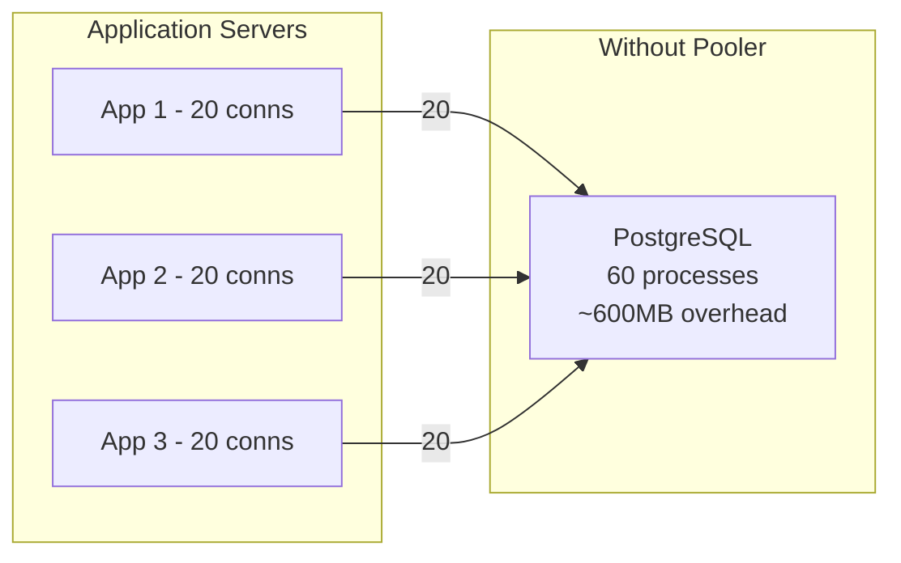
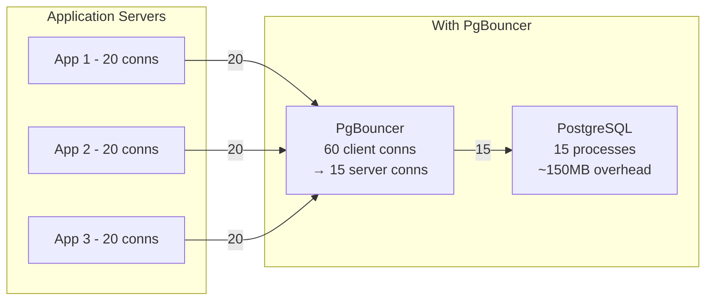

**Date:** 2026-04-19 | **Updated:** 2026-04-19
**Tags:** `postgresql` `connection-pooling` `pgbouncer` `hikaricp` `operations`

# PostgreSQL Connection Management

## Table of Contents

- [Summary](#summary)
- [PostgreSQL Connection Model](#postgresql-connection-model)
- [Why max_connections Should Stay Low](#why-max_connections-should-stay-low)
- [PgBouncer](#pgbouncer)
  - [Pooling Modes](#pooling-modes)
  - [Setup and Configuration](#setup-and-configuration)
  - [Authentication](#authentication)
  - [Monitoring PgBouncer](#monitoring-pgbouncer)
  - [Prepared Statements Gotcha](#prepared-statements-gotcha)
- [pgpool-II](#pgpool-ii)
- [Application-Side Pooling: HikariCP](#application-side-pooling-hikaricp)
  - [HikariCP + PgBouncer Together](#hikaricp--pgbouncer-together)
- [Connection Storms](#connection-storms)
- [Superuser Reserved Connections](#superuser-reserved-connections)
- [Cloud-Managed Pooling](#cloud-managed-pooling)
- [Related](#related)
- [References](#references)

## Summary

PostgreSQL forks a new OS process per connection, each consuming ~10MB of RAM. This architecture means you cannot scale to thousands of connections directly. Connection poolers like PgBouncer sit between your application and PostgreSQL, multiplexing many application connections onto a small pool of database connections. For Spring/Java apps, the interaction between HikariCP and PgBouncer requires deliberate tuning.

## PostgreSQL Connection Model





Each PostgreSQL backend process consumes:
- ~10MB base RSS (varies by `work_mem`, `temp_buffers`, etc.)
- Additional memory per active query (`work_mem` for sorts and hash joins)
- One slot in the process table and shared buffer structures
- CPU context-switching overhead as connection count grows

At 500 connections, you are spending 5GB just on process overhead before any queries run.

## Why max_connections Should Stay Low

The optimal number of active connections is roughly:

```text
optimal_connections = (CPU cores * 2) + effective_spindle_count
```

For a 16-core server with SSDs, that is ~33. In practice, 100-300 `max_connections` gives headroom while keeping overhead manageable.

**What happens above 300:**

| Connections | Effect |
|-------------|--------|
| 100-200 | Sweet spot for most workloads |
| 300-500 | Measurable context-switch overhead, higher lock contention |
| 500-1000 | Throughput actually decreases; snapshot overhead grows |
| 1000+ | PostgreSQL becomes unstable; out-of-memory risk |

```ini
# postgresql.conf
max_connections = 200          # Not 2000
superuser_reserved_connections = 3
```

The solution to "we need more connections" is almost always a connection pooler, not raising `max_connections`.

## PgBouncer

PgBouncer is a lightweight, single-threaded connection pooler that sits between applications and PostgreSQL. It handles thousands of client connections using just a few MB of memory.

### Pooling Modes

| Mode | Server connection lifetime | Use case | Limitations |
|------|---------------------------|----------|-------------|
| **Transaction** | Released after each transaction | Most production apps | No session-level state |
| **Session** | Held for entire client session | Apps that need SET, LISTEN, prepared stmts | Minimal multiplexing benefit |
| **Statement** | Released after each statement | Autocommit-only workloads | No multi-statement transactions |

**Transaction mode** is the standard choice. It provides the best multiplexing ratio (e.g., 500 client connections → 30 server connections).

### Setup and Configuration

```ini
# /etc/pgbouncer/pgbouncer.ini

[databases]
mydb = host=127.0.0.1 port=5432 dbname=mydb

[pgbouncer]
listen_addr = 0.0.0.0
listen_port = 6432
auth_type = scram-sha-256
auth_file = /etc/pgbouncer/userlist.txt

; Pool sizing
pool_mode = transaction
default_pool_size = 25          ; Server connections per user/database pair
min_pool_size = 5               ; Keep at least 5 warm connections
reserve_pool_size = 5           ; Extra connections for burst
reserve_pool_timeout = 3        ; Wait 3s before using reserve pool

; Limits
max_client_conn = 1000          ; Total client connections PgBouncer accepts
max_db_connections = 50         ; Hard cap on server connections per database

; Timeouts
server_idle_timeout = 600       ; Close idle server connections after 10 min
client_idle_timeout = 0         ; 0 = never disconnect idle clients
query_timeout = 0               ; 0 = no query timeout (handle at app level)
client_login_timeout = 60

; Logging
log_connections = 1
log_disconnections = 1
log_pooler_errors = 1
stats_period = 60
```

### Authentication

Create the userlist file:

```bash
# Generate scram-sha-256 hash
psql -c "SELECT concat('\"', usename, '\" \"', passwd, '\"') FROM pg_shadow WHERE usename = 'app_user';" \
  > /etc/pgbouncer/userlist.txt
```

Or use `auth_query` to authenticate dynamically against PostgreSQL:

```ini
auth_type = scram-sha-256
auth_query = SELECT usename, passwd FROM pg_shadow WHERE usename = $1
auth_user = pgbouncer_auth   ; A user with permission to read pg_shadow
```

### Monitoring PgBouncer

Connect to PgBouncer's admin console:

```bash
psql -h 127.0.0.1 -p 6432 -U pgbouncer pgbouncer
```

Essential commands:

```sql
-- Pool usage summary
SHOW POOLS;
-- Columns: database, user, cl_active, cl_waiting, sv_active, sv_idle, sv_used, pool_mode

-- Client connections
SHOW CLIENTS;

-- Server (PostgreSQL) connections
SHOW SERVERS;

-- Aggregate statistics
SHOW STATS;
-- Columns: total_xact_count, total_query_count, avg_xact_time, avg_query_time

-- Current settings
SHOW CONFIG;
```

**Key metrics to monitor:**

| Metric | Warning | Critical |
|--------|---------|----------|
| `cl_waiting` > 0 | Clients are waiting for a server connection | Pool is saturated |
| `sv_active` = `default_pool_size` | Pool is fully utilized | Need more server connections |
| `avg_xact_time` increasing | Transactions are getting slower | Application issue |
| `total_xact_count` dropping | Throughput declining | Investigate |

### Prepared Statements Gotcha

In **transaction mode**, PgBouncer reassigns server connections after each transaction. Prepared statements are server-side state that does not survive reassignment.

**The problem:** JDBC drivers (including HikariCP) use prepared statements by default. When PgBouncer assigns a different server connection, the prepared statement does not exist, causing errors.

**Solutions:**

1. **Disable server-side prepared statements in JDBC:**

```yaml
# application.yml
spring:
  datasource:
    url: jdbc:postgresql://pgbouncer:6432/mydb?prepareThreshold=0
```

2. **Use PgBouncer's `max_prepared_statements` (PgBouncer 1.21+):**

```ini
# pgbouncer.ini - PgBouncer tracks and re-prepares statements automatically
max_prepared_statements = 100
```

This is the modern solution. PgBouncer intercepts PARSE/BIND/EXECUTE messages and re-prepares statements on the new server connection transparently.

## pgpool-II

pgpool-II is a more feature-rich (and complex) middleware that provides:
- Connection pooling
- Load balancing of read queries to replicas
- Automated failover
- Query caching

**When to choose pgpool-II over PgBouncer:**

| Requirement | PgBouncer | pgpool-II |
|-------------|-----------|-----------|
| Pure connection pooling | Better (lighter, faster) | Heavier |
| Read/write splitting | No (use app-level routing) | Yes, built-in |
| Automated failover | No | Yes |
| Query caching | No | Yes |
| Resource overhead | ~5MB | ~50MB+ |

In practice, most teams use PgBouncer for pooling plus Patroni for HA, rather than pgpool-II for both.

## Application-Side Pooling: HikariCP

HikariCP is the default connection pool in Spring Boot. Even with PgBouncer, HikariCP manages application-side connection lifecycle.

```yaml
# application.yml
spring:
  datasource:
    hikari:
      maximum-pool-size: 20        # Per application instance
      minimum-idle: 5
      idle-timeout: 300000         # 5 min
      max-lifetime: 1800000        # 30 min — must be < PgBouncer server_idle_timeout
      connection-timeout: 10000    # 10s — how long to wait for a connection from the pool
      leak-detection-threshold: 30000  # Warn if connection held > 30s
      validation-timeout: 5000
```

### HikariCP + PgBouncer Together

The connection pipeline looks like:

```text
Application Thread
  → HikariCP pool (20 connections per app instance)
    → PgBouncer (500 client connections → 30 server connections)
      → PostgreSQL (30 actual backends)
```

**Tuning rules:**

1. `HikariCP maximum-pool-size` per instance x number of instances = total client connections to PgBouncer
2. PgBouncer `default_pool_size` < PostgreSQL `max_connections`
3. HikariCP `max-lifetime` < PgBouncer `server_idle_timeout`
4. Set `prepareThreshold=0` in the JDBC URL (or use PgBouncer 1.21+ `max_prepared_statements`)

**Example sizing for 10 app instances:**

```text
10 instances x 20 HikariCP connections = 200 PgBouncer client connections
PgBouncer default_pool_size = 30 (server connections to PostgreSQL)
PostgreSQL max_connections = 50 (30 pool + 15 reserve + 3 superuser + 2 monitoring)
```

## Connection Storms

A connection storm occurs when many connections are established simultaneously, often during:
- Application deployment (all instances restart at once)
- Database failover (all connections reconnect)
- Connection pool exhaustion followed by retry storms

**Prevention strategies:**

```yaml
# HikariCP: Initialize pool gradually
spring:
  datasource:
    hikari:
      initialization-fail-timeout: -1    # Don't fail startup if DB is slow
      minimum-idle: 2                     # Start with 2, grow to max
      maximum-pool-size: 20
```

```ini
# PgBouncer: Queue excess connections instead of rejecting
max_client_conn = 1000
default_pool_size = 25
reserve_pool_size = 5
reserve_pool_timeout = 3    ; Wait 3s before dipping into reserve
```

**Rolling deployments** prevent all instances from reconnecting simultaneously. Configure your deployment to restart instances one at a time with a delay between each.

## Superuser Reserved Connections

Always reserve connections for emergency access:

```ini
# postgresql.conf
max_connections = 200
superuser_reserved_connections = 3   # Default is 3
```

These 3 connections are only available to superusers, ensuring you can always connect to diagnose and fix connection exhaustion.

Additionally, PostgreSQL 16+ supports `reserved_connections` for non-superuser roles with the `pg_use_reserved_connections` privilege:

```sql
-- PG 16+
ALTER SYSTEM SET reserved_connections = 5;
GRANT pg_use_reserved_connections TO monitoring_user;
```

## Cloud-Managed Pooling

| Service | Pooler | Notes |
|---------|--------|-------|
| AWS RDS/Aurora | RDS Proxy | Supports IAM auth, auto failover-aware, pin-aware for prepared statements |
| Google Cloud SQL | Cloud SQL Auth Proxy | Primarily for auth/encryption, not true pooling. Use Alloy DB + built-in pooler |
| Supabase | Supavisor | Elixir-based pooler, supports transaction mode, tenant-aware |
| Azure | PgBouncer built-in | Azure Database for PostgreSQL Flexible Server includes PgBouncer |

**RDS Proxy with Spring Boot:**

```yaml
spring:
  datasource:
    url: jdbc:postgresql://my-proxy.proxy-xxx.us-east-1.rds.amazonaws.com:5432/mydb
    hikari:
      maximum-pool-size: 20
      # RDS Proxy handles server-side pooling; keep HikariCP pool modest
```

RDS Proxy supports session pinning awareness — it pins a connection when session state is detected (SET, prepared statements) and unpins when the session ends.

## Related

- [Monitoring](./monitoring.md) — monitoring connection counts and pool saturation
- [Replication](./replication.md) — routing read connections to replicas
- [Migrations at Scale](./migrations-at-scale.md) — DDL lock impact on connection queues

## References

- [PostgreSQL Docs: Connection and Authentication](https://www.postgresql.org/docs/current/runtime-config-connection.html)
- [PgBouncer Documentation](https://www.pgbouncer.org/)
- [HikariCP GitHub](https://github.com/brettwooldridge/HikariCP)
- [pgpool-II Documentation](https://www.pgpool.net/docs/latest/en/html/)
- [AWS RDS Proxy Documentation](https://docs.aws.amazon.com/AmazonRDS/latest/UserGuide/rds-proxy.html)
- [Crunchy Data: Connection Pooling Guide](https://www.crunchydata.com/developers/guides/connection-pooling)
