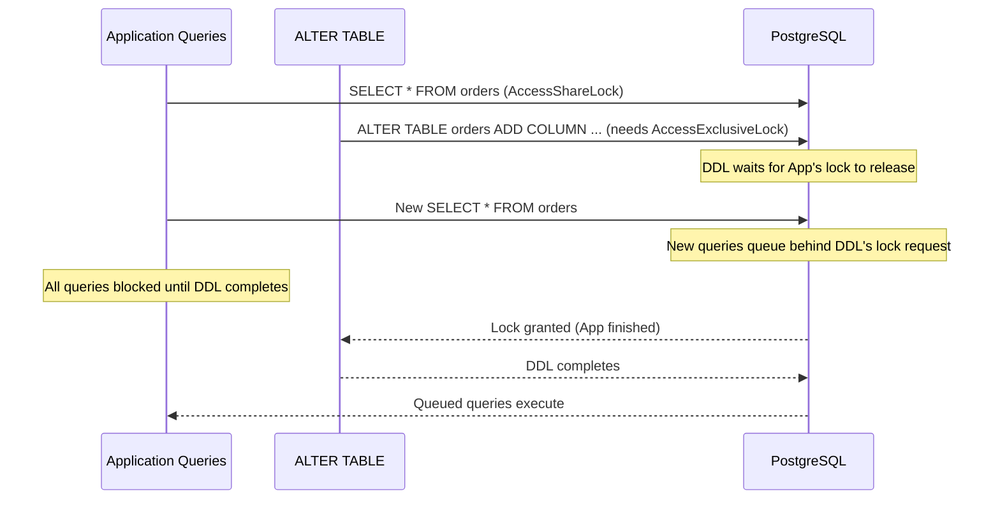
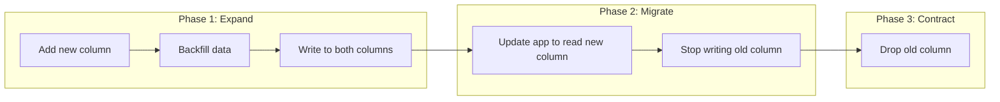

**Date:** 2026-04-19 | **Updated:** 2026-04-19
**Tags:** `postgresql` `migrations` `zero-downtime` `ddl` `schema-changes` `operations`

# Zero-Downtime PostgreSQL Migrations

## Table of Contents

- [Summary](#summary)
- [The Lock Problem](#the-lock-problem)
- [Safe vs Unsafe DDL Operations](#safe-vs-unsafe-ddl-operations)
- [Safety Nets: lock_timeout and statement_timeout](#safety-nets-lock_timeout-and-statement_timeout)
- [Adding Columns](#adding-columns)
- [Adding Indexes](#adding-indexes)
  - [CREATE INDEX CONCURRENTLY](#create-index-concurrently)
  - [Failure Modes and Recovery](#failure-modes-and-recovery)
- [Renaming and Dropping Columns](#renaming-and-dropping-columns)
  - [The Expand-Contract Pattern](#the-expand-contract-pattern)
- [Large Table Backfills](#large-table-backfills)
- [NOT NULL Constraints](#not-null-constraints)
- [Foreign Key Constraints](#foreign-key-constraints)
- [Ghost Tables Pattern](#ghost-tables-pattern)
- [Schema Migration Tools](#schema-migration-tools)
- [Testing Migrations](#testing-migrations)
- [Related](#related)
- [References](#references)

## Summary

Most `ALTER TABLE` operations acquire an `ACCESS EXCLUSIVE` lock, blocking all reads and writes for the duration. On a 500M-row table, this can mean minutes of downtime. Zero-downtime migrations decompose dangerous operations into lock-safe steps: add columns with defaults (instant in PG 11+), create indexes concurrently, validate constraints separately, and backfill data in batches.

## The Lock Problem



The critical insight: even if the DDL itself would be fast, it must wait for all existing locks to release. While it waits, **new queries also queue behind it**. A 100ms DDL can cause a 30-second outage if a long-running query holds a conflicting lock.

## Safe vs Unsafe DDL Operations

| Operation | Lock Level | Safe Online? | Notes |
|-----------|-----------|--------------|-------|
| `ADD COLUMN` (no default) | AccessExclusive | Fast (metadata only) | Sub-millisecond |
| `ADD COLUMN ... DEFAULT x` | AccessExclusive | Instant (PG 11+) | Default stored in catalog, not written to rows |
| `ADD COLUMN ... DEFAULT x NOT NULL` | AccessExclusive | Instant (PG 11+) | Same as above |
| `DROP COLUMN` | AccessExclusive | Fast (metadata only) | Does not rewrite table; marks column as dropped |
| `ALTER COLUMN SET NOT NULL` | AccessExclusive | Full table scan | Checks every row; use NOT VALID pattern instead |
| `ALTER COLUMN TYPE` | AccessExclusive | Table rewrite | Extremely slow on large tables |
| `CREATE INDEX` | ShareLock | Blocks writes | Use CONCURRENTLY instead |
| `CREATE INDEX CONCURRENTLY` | ShareUpdateExclusiveLock | Safe | Does not block reads or writes |
| `ADD CONSTRAINT ... CHECK` | AccessExclusive | Full table scan | Use NOT VALID + VALIDATE |
| `ADD CONSTRAINT ... FK` | ShareRowExclusiveLock | Full table scan | Use NOT VALID + VALIDATE |

## Safety Nets: lock_timeout and statement_timeout

Always set timeouts when running DDL in production:

```sql
-- Set lock_timeout to prevent blocking the entire application
SET lock_timeout = '3s';

-- Set statement_timeout as an overall safety net
SET statement_timeout = '30s';

-- Now run DDL — if the lock isn't acquired in 3s, it fails harmlessly
ALTER TABLE orders ADD COLUMN status text DEFAULT 'pending';
```

**In your migration tool, wrap every DDL statement:**

```sql
BEGIN;
SET LOCAL lock_timeout = '3s';
SET LOCAL statement_timeout = '30s';
ALTER TABLE orders ADD COLUMN tracking_number text;
COMMIT;
```

If the migration fails due to timeout, retry after the long-running query completes. This is far better than blocking the entire application.

## Adding Columns

**PG 11+ made `ADD COLUMN ... DEFAULT` instant.** The default value is stored in `pg_attribute` rather than written to every row. Reads of existing rows return the stored default transparently.

```sql
-- Instant, even on a billion-row table (PG 11+)
ALTER TABLE orders ADD COLUMN status text DEFAULT 'pending' NOT NULL;
```

**What is NOT instant:**

```sql
-- Truly volatile defaults require a table rewrite
ALTER TABLE orders ADD COLUMN created_at timestamptz DEFAULT clock_timestamp();
-- clock_timestamp() is VOLATILE — PG cannot store a single default value, so it rewrites every row

-- Note: now() is actually STABLE (returns the same value within a transaction),
-- so ADD COLUMN DEFAULT now() IS instant in PG 11+. PG stores the transaction
-- timestamp in the catalog and returns it for existing rows.

-- Workaround for volatile defaults: add column without default, then backfill
ALTER TABLE orders ADD COLUMN created_at timestamptz;
-- Then backfill in batches (see Large Table Backfills section)
```

## Adding Indexes

### CREATE INDEX CONCURRENTLY

Standard `CREATE INDEX` holds a `ShareLock` that blocks all writes. `CREATE INDEX CONCURRENTLY` performs two table scans without blocking reads or writes:

```sql
-- Always use CONCURRENTLY in production
CREATE INDEX CONCURRENTLY idx_orders_customer_id ON orders (customer_id);
```

**Rules:**
- Cannot run inside a transaction block (`BEGIN ... COMMIT`)
- Takes 2-3x longer than a regular `CREATE INDEX`
- Requires two full table scans
- Spring-based migration tools need special handling (see below)

### Failure Modes and Recovery

If `CREATE INDEX CONCURRENTLY` is interrupted (network drop, OOM, manual cancel), the index is left in an **INVALID** state:

```sql
-- Check for invalid indexes
SELECT indexrelid::regclass AS index_name, indisvalid
FROM pg_index
WHERE NOT indisvalid;
```

**Recovery:**

```sql
-- Drop the invalid index and retry
DROP INDEX CONCURRENTLY idx_orders_customer_id;
CREATE INDEX CONCURRENTLY idx_orders_customer_id ON orders (customer_id);
```

Alternatively, use `REINDEX CONCURRENTLY` (PG 12+):

```sql
REINDEX INDEX CONCURRENTLY idx_orders_customer_id;
```

## Renaming and Dropping Columns

**Never rename a column directly** on a live system. The application will fail instantly because it queries the old name.

### The Expand-Contract Pattern



**Step-by-step example:** Renaming `orders.email` to `orders.customer_email`.

**Migration 1 (expand):**

```sql
SET LOCAL lock_timeout = '3s';
ALTER TABLE orders ADD COLUMN customer_email text;
```

**Migration 2 (backfill):**

```sql
-- Batched backfill (see Large Table Backfills section)
UPDATE orders SET customer_email = email
WHERE ctid = ANY(ARRAY(
    SELECT ctid FROM orders WHERE customer_email IS NULL LIMIT 10000
));
```

**Application deploy:** Update code to write both columns and read from `customer_email`.

**Migration 3 (contract):** After confirming all reads use the new column:

```sql
SET LOCAL lock_timeout = '3s';
ALTER TABLE orders DROP COLUMN email;
```

**Views as a compatibility layer:**

```sql
-- Create a view that maps old names to new ones during transition
CREATE VIEW orders_compat AS
SELECT *, customer_email AS email FROM orders;
```

## Large Table Backfills

Updating millions of rows in a single transaction locks the table and generates massive WAL. Instead, backfill in batches using `ctid` ranges:

```sql
-- Batched UPDATE using ctid via a PROCEDURE (DO blocks cannot use COMMIT/ROLLBACK)
CREATE OR REPLACE PROCEDURE backfill_customer_email(batch_size int DEFAULT 10000)
LANGUAGE plpgsql AS $$
DECLARE
    updated int;
BEGIN
    LOOP
        UPDATE orders
        SET customer_email = email
        WHERE ctid = ANY(ARRAY(
            SELECT ctid FROM orders
            WHERE customer_email IS NULL
            LIMIT batch_size
        ));

        GET DIAGNOSTICS updated = ROW_COUNT;
        RAISE NOTICE 'Updated % rows', updated;

        EXIT WHEN updated = 0;

        -- Commit each batch separately (only procedures support this)
        COMMIT;

        -- Brief pause to let other queries breathe
        PERFORM pg_sleep(0.1);
    END LOOP;
END $$;

-- Execute the procedure
CALL backfill_customer_email(10000);
```

**Alternative using a range-based approach:**

```bash
#!/bin/bash
# Backfill script with progress tracking
BATCH=10000
TOTAL=$(psql -t -c "SELECT count(*) FROM orders WHERE customer_email IS NULL;")
DONE=0

while true; do
    UPDATED=$(psql -t -c "
        WITH batch AS (
            SELECT ctid FROM orders
            WHERE customer_email IS NULL
            LIMIT $BATCH
        )
        UPDATE orders SET customer_email = email
        WHERE ctid IN (SELECT ctid FROM batch);
        SELECT ROW_COUNT;
    ")

    DONE=$((DONE + UPDATED))
    echo "Progress: $DONE / $TOTAL"

    [ "$UPDATED" -eq 0 ] && break
    sleep 0.1
done
```

## NOT NULL Constraints

Adding `NOT NULL` directly scans the entire table while holding an `ACCESS EXCLUSIVE` lock:

```sql
-- DANGEROUS: Full table scan under exclusive lock
ALTER TABLE orders ALTER COLUMN status SET NOT NULL;
```

**Safe alternative (PG 12+): NOT VALID + VALIDATE CONSTRAINT:**

```sql
-- Step 1: Add a CHECK constraint as NOT VALID (instant, metadata only)
SET LOCAL lock_timeout = '3s';
ALTER TABLE orders ADD CONSTRAINT orders_status_not_null
    CHECK (status IS NOT NULL) NOT VALID;

-- Step 2: Validate the constraint (full scan, but only holds ShareUpdateExclusiveLock)
-- This does NOT block reads or writes
ALTER TABLE orders VALIDATE CONSTRAINT orders_status_not_null;

-- Step 3 (PG 12+): Now you can set NOT NULL using the existing constraint
-- PG recognizes the validated CHECK and skips the table scan
ALTER TABLE orders ALTER COLUMN status SET NOT NULL;

-- Step 4: Drop the now-redundant CHECK constraint
ALTER TABLE orders DROP CONSTRAINT orders_status_not_null;
```

The key insight: `VALIDATE CONSTRAINT` holds `ShareUpdateExclusiveLock`, which does **not** block reads or writes. The final `SET NOT NULL` is instant because PostgreSQL sees the validated CHECK constraint.

## Foreign Key Constraints

Foreign keys are validated on both the referencing and referenced tables. Adding one naively scans the entire referencing table under a `ShareRowExclusiveLock`.

```sql
-- DANGEROUS: Scans entire orders table, blocks writes on both tables
ALTER TABLE orders ADD CONSTRAINT fk_orders_customer
    FOREIGN KEY (customer_id) REFERENCES customers (id);
```

**Safe alternative:**

```sql
-- Step 1: Add FK as NOT VALID (instant, no table scan)
SET LOCAL lock_timeout = '3s';
ALTER TABLE orders ADD CONSTRAINT fk_orders_customer
    FOREIGN KEY (customer_id) REFERENCES customers (id)
    NOT VALID;

-- Step 2: Validate (scans orders table, but uses ShareUpdateExclusiveLock)
-- Does not block reads or writes
ALTER TABLE orders VALIDATE CONSTRAINT fk_orders_customer;
```

**Important:** Even with `NOT VALID`, new rows are checked against the FK immediately. Only the validation of existing rows is deferred.

## Ghost Tables Pattern

For extreme cases (changing a column type on a massive table), the ghost tables pattern avoids long locks entirely:

```sql
-- 1. Create new table with desired schema
CREATE TABLE orders_new (LIKE orders INCLUDING ALL);
ALTER TABLE orders_new ALTER COLUMN amount TYPE numeric(20,4);

-- 2. Create a trigger on the old table to replicate changes
CREATE OR REPLACE FUNCTION sync_orders_to_new() RETURNS trigger AS $$
BEGIN
    IF TG_OP = 'INSERT' THEN
        INSERT INTO orders_new VALUES (NEW.*);
    ELSIF TG_OP = 'UPDATE' THEN
        UPDATE orders_new SET ... WHERE id = NEW.id;
    ELSIF TG_OP = 'DELETE' THEN
        DELETE FROM orders_new WHERE id = OLD.id;
    END IF;
    RETURN NULL;
END;
$$ LANGUAGE plpgsql;

CREATE TRIGGER orders_sync AFTER INSERT OR UPDATE OR DELETE
ON orders FOR EACH ROW EXECUTE FUNCTION sync_orders_to_new();

-- 3. Backfill historical data in batches
-- 4. Verify row counts match
-- 5. Swap table names (brief exclusive lock)
BEGIN;
SET LOCAL lock_timeout = '3s';
ALTER TABLE orders RENAME TO orders_old;
ALTER TABLE orders_new RENAME TO orders;
COMMIT;

-- 6. Drop old table after verification period
```

Tools like `pg_repack` and `pgroll` automate this pattern.

## Schema Migration Tools

### Flyway vs Liquibase

| Feature | Flyway | Liquibase |
|---------|--------|-----------|
| Migration format | SQL files (V1__desc.sql) | XML, YAML, JSON, or SQL |
| Rollback | Pro feature (or manual) | Built-in |
| Repeatable migrations | Yes (R__desc.sql) | Yes |
| Diff generation | No | Yes (against live DB) |
| Spring Boot integration | Excellent (auto-configured) | Excellent (auto-configured) |
| Concurrent index support | Manual (separate migration) | Manual |

**Flyway with Spring Boot:**

```yaml
# application.yml
spring:
  flyway:
    enabled: true
    locations: classpath:db/migration
    baseline-on-migrate: true
    connect-retries: 3
```

**Handling CONCURRENTLY in Flyway:**

`CREATE INDEX CONCURRENTLY` cannot run inside a transaction. Flyway wraps migrations in transactions by default.

```sql
-- V5__add_customer_id_index.sql
-- flyway:executeInTransaction=false

SET lock_timeout = '3s';
CREATE INDEX CONCURRENTLY IF NOT EXISTS idx_orders_customer_id ON orders (customer_id);
```

**Liquibase equivalent:**

```yaml
databaseChangeLog:
  - changeSet:
      id: 5
      author: dev
      runInTransaction: false
      changes:
        - sql:
            sql: >
              SET lock_timeout = '3s';
              CREATE INDEX CONCURRENTLY IF NOT EXISTS idx_orders_customer_id
              ON orders (customer_id);
```

## Testing Migrations

**Schema diff with pg_dump:**

```bash
# Dump schema before and after migration
pg_dump --schema-only -d mydb_before > before.sql
pg_dump --schema-only -d mydb_after > after.sql
diff before.sql after.sql
```

**pgTAP for schema assertions:**

```sql
-- Test that the column exists and has the right type
SELECT has_column('orders', 'status', 'orders should have a status column');
SELECT col_type_is('orders', 'status', 'text');
SELECT col_not_null('orders', 'status');
SELECT col_default_is('orders', 'status', 'pending');

-- Test that the index exists
SELECT has_index('orders', 'idx_orders_customer_id');
```

**Migration testing checklist:**

- [ ] Run migration against a copy of production data (not just an empty schema)
- [ ] Measure lock duration and WAL generation
- [ ] Verify rollback procedure works
- [ ] Test with concurrent read/write load
- [ ] Check for invalid indexes after concurrent index creation
- [ ] Verify application compatibility with both old and new schema

## Related

- [Connection Management](./connection-management.md) — DDL lock impact on connection queues
- [Monitoring](./monitoring.md) — detecting long-running DDL and lock waits
- [Backup and Recovery](./backup-and-recovery.md) — creating restore points before migrations

## References

- [PostgreSQL Docs: ALTER TABLE](https://www.postgresql.org/docs/current/sql-altertable.html)
- [PostgreSQL Docs: CREATE INDEX](https://www.postgresql.org/docs/current/sql-createindex.html)
- [PostgreSQL Docs: Explicit Locking](https://www.postgresql.org/docs/current/explicit-locking.html)
- [PostgreSQL Docs: REINDEX](https://www.postgresql.org/docs/current/sql-reindex.html)
- [PostgreSQL Wiki: Lock Monitoring](https://wiki.postgresql.org/wiki/Lock_Monitoring)
- [Flyway Documentation](https://documentation.red-gate.com/fd)
- [Liquibase Documentation](https://docs.liquibase.com/)
- [pgTAP Documentation](https://pgtap.org/)
