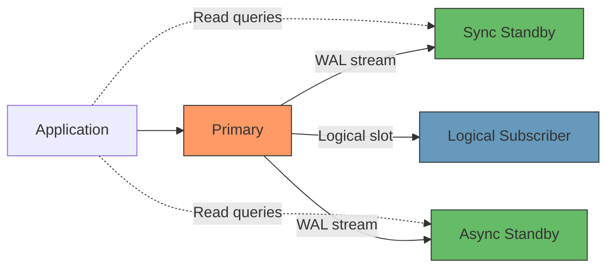
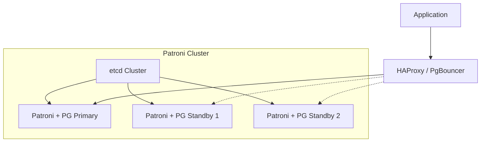

**Date:** 2026-04-19 | **Updated:** 2026-04-19
**Tags:** `postgresql` `replication` `high-availability` `failover` `operations`

# PostgreSQL Replication

## Table of Contents

- [Summary](#summary)
- [Replication Architecture Overview](#replication-architecture-overview)
- [Streaming Replication](#streaming-replication)
  - [Setup Walkthrough](#setup-walkthrough)
  - [Replication Slots](#replication-slots)
- [Synchronous Replication](#synchronous-replication)
  - [synchronous_commit Levels](#synchronous_commit-levels)
  - [Quorum Commit](#quorum-commit)
- [Logical Replication](#logical-replication)
  - [Publications and Subscriptions](#publications-and-subscriptions)
  - [Use Cases](#use-cases)
- [Failover](#failover)
  - [Manual Failover with pg_promote](#manual-failover-with-pg_promote)
  - [Automated HA with Patroni](#automated-ha-with-patroni)
  - [pg_auto_failover](#pg_auto_failover)
- [Read Replicas in Practice](#read-replicas-in-practice)
  - [Connection Routing](#connection-routing)
  - [Replication Lag Monitoring](#replication-lag-monitoring)
- [Monitoring Replication](#monitoring-replication)
- [Related](#related)
- [References](#references)

## Summary

PostgreSQL replication ships WAL (Write-Ahead Log) records from a primary to one or more standbys, enabling high availability and read scaling. Streaming replication provides byte-level copies; logical replication offers selective, table-level control. Automated failover tools like Patroni turn these primitives into production-grade HA clusters.

## Replication Architecture Overview



## Streaming Replication

Streaming replication continuously ships WAL records over a TCP connection from primary to standby. The standby replays WAL to maintain a near-identical copy of the primary.

**Key characteristics:**

- Physical replication: byte-for-byte copy of the entire cluster
- Standby is read-only (hot standby) or completely offline (warm standby)
- WAL sender process on primary, WAL receiver on standby
- Sub-second lag under normal conditions

### Setup Walkthrough

**Step 1: Configure the primary** (`postgresql.conf`):

```ini
wal_level = replica
max_wal_senders = 10
max_replication_slots = 10
hot_standby = on
```

**Step 2: Create a replication user:**

```sql
CREATE ROLE replicator WITH REPLICATION LOGIN PASSWORD 'strong_password_here';
```

**Step 3: Allow replication connections** (`pg_hba.conf`):

```text
host replication replicator 10.0.0.0/24 scram-sha-256
```

**Step 4: Take a base backup on the standby:**

```bash
pg_basebackup -h primary-host -U replicator -D /var/lib/postgresql/16/main \
  --checkpoint=fast --wal-method=stream -R
```

The `-R` flag creates `standby.signal` and populates `postgresql.auto.conf` with the connection string. This replaced `recovery.conf` in PostgreSQL 12+.

**Step 5: Start the standby:**

```bash
pg_ctl start -D /var/lib/postgresql/16/main
```

The standby connects to the primary and begins streaming WAL.

### Replication Slots

Without a replication slot, the primary may recycle WAL segments before the standby has consumed them. Slots prevent this.

```sql
-- On the primary
SELECT pg_create_physical_replication_slot('standby1_slot');
```

On the standby, add to `postgresql.auto.conf`:

```ini
primary_slot_name = 'standby1_slot'
```

**Warning:** An unused slot causes unbounded WAL accumulation. Monitor `pg_replication_slots` and drop orphaned slots:

```sql
SELECT slot_name, active, pg_size_pretty(pg_wal_lsn_diff(pg_current_wal_lsn(), restart_lsn)) AS retained_wal
FROM pg_replication_slots;
```

## Synchronous Replication

Synchronous replication makes the primary wait for standby confirmation before reporting a commit as successful. This guarantees zero data loss at the cost of latency.

### synchronous_commit Levels

| Level | Primary waits for | Data loss risk | Latency |
|-------|-------------------|----------------|---------|
| `off` | Nothing | Highest | Lowest |
| `local` | Local WAL flush | WAL on standby may lag | Low |
| `remote_write` | Standby OS write | Standby crash before flush | Medium |
| `on` | Standby WAL flush | None (sync standby up) | Higher |
| `remote_apply` | Standby replay | None, reads are consistent | Highest |

Configure on the primary:

```ini
synchronous_standby_names = 'standby1'
synchronous_commit = on
```

You can set `synchronous_commit` per-transaction for mixed workloads:

```sql
-- Critical financial write
SET LOCAL synchronous_commit = 'on';
INSERT INTO transactions (...) VALUES (...);

-- Analytics event, async is fine
SET LOCAL synchronous_commit = 'off';
INSERT INTO events (...) VALUES (...);
```

### Quorum Commit

PostgreSQL supports quorum-based synchronous replication. Wait for any 2 of 3 standbys:

```ini
synchronous_standby_names = 'ANY 2 (standby1, standby2, standby3)'
```

Or `FIRST 2` to enforce priority ordering:

```ini
synchronous_standby_names = 'FIRST 2 (standby1, standby2, standby3)'
```

## Logical Replication

Logical replication decodes WAL into logical change events and sends them to subscribers. It works at the table level rather than the whole cluster.

### Publications and Subscriptions

**On the publisher (source):**

```sql
-- Publish specific tables
CREATE PUBLICATION orders_pub FOR TABLE orders, order_items;

-- Or publish all tables
CREATE PUBLICATION all_tables_pub FOR ALL TABLES;
```

**On the subscriber (target):**

```sql
CREATE SUBSCRIPTION orders_sub
  CONNECTION 'host=publisher-host dbname=mydb user=replicator password=...'
  PUBLICATION orders_pub;
```

The subscriber performs an initial table sync, then streams changes continuously.

### Use Cases

| Use Case | Why Logical Replication |
|----------|----------------------|
| Selective replication | Replicate only specific tables to a reporting database |
| Cross-version upgrades | Replicate from PG 14 to PG 16 during migration |
| Change Data Capture (CDC) | Feed changes to Kafka, Debezium, or event pipelines |
| Multi-tenant isolation | Replicate tenant-specific tables to isolated databases |
| Platform migration | Replicate from self-hosted to managed (RDS, Cloud SQL) |

**Limitations to know:**

- DDL changes are not replicated; schema must be managed separately
- Sequences are not replicated
- Large objects are not supported
- `TRUNCATE` is replicated (PG 11+), but only on published tables

## Failover

### Manual Failover with pg_promote

When the primary fails and you need to promote a standby:

```sql
-- On the standby (PG 12+)
SELECT pg_promote(wait := true, wait_seconds := 60);
```

Or via command line:

```bash
pg_ctl promote -D /var/lib/postgresql/16/main
```

After promotion:
1. The standby stops recovery and becomes a read-write primary
2. Reconfigure application connection strings
3. Rebuild the old primary as a standby using `pg_rewind` or a fresh `pg_basebackup`

### Automated HA with Patroni

Patroni is the industry standard for automated PostgreSQL HA. It uses a distributed consensus store (etcd, ZooKeeper, or Consul) for leader election.



Key Patroni capabilities:
- Automatic failover with configurable timeouts
- Scheduled switchover (planned maintenance)
- REST API for health checks and management
- Integration with HAProxy or other load balancers via health endpoints

Minimal Patroni config (`patroni.yml`):

```yaml
scope: postgres-cluster
name: node1

etcd:
  hosts: etcd1:2379,etcd2:2379,etcd3:2379

bootstrap:
  dcs:
    ttl: 30
    loop_wait: 10
    retry_timeout: 10
    maximum_lag_on_failover: 1048576
    synchronous_mode: true
    postgresql:
      parameters:
        max_connections: 200
        wal_level: replica
        max_wal_senders: 10
        max_replication_slots: 10

postgresql:
  listen: 0.0.0.0:5432
  data_dir: /var/lib/postgresql/16/main
  authentication:
    replication:
      username: replicator
      password: "${REPLICATOR_PASSWORD}"
```

### pg_auto_failover

> **Note:** pg_auto_failover has been deprecated by Microsoft/Citus and is no longer actively maintained. The information below is retained for reference, but Patroni is the recommended alternative for new deployments.

A lighter alternative to Patroni from Citus/Microsoft. Uses a dedicated monitor node instead of an external consensus store:

```bash
# Initialize the monitor
pg_autoctl create monitor --pgdata /var/lib/postgresql/monitor --pgport 5000

# Initialize the primary
pg_autoctl create postgres --pgdata /var/lib/postgresql/16/main \
  --monitor postgres://autoctl_node@monitor-host:5000/pg_auto_failover

# Initialize the secondary
pg_autoctl create postgres --pgdata /var/lib/postgresql/16/main \
  --monitor postgres://autoctl_node@monitor-host:5000/pg_auto_failover
```

## Read Replicas in Practice

### Connection Routing

Spring Boot with read/write routing using `@Transactional(readOnly = true)`:

```yaml
# application.yml
spring:
  datasource:
    primary:
      url: jdbc:postgresql://primary-host:5432/mydb
    replica:
      url: jdbc:postgresql://replica-host:5432/mydb
```

Alternatively, use a connection proxy (HAProxy, PgBouncer, or cloud-native proxies) that routes based on query type.

Set `hot_standby_feedback` on replicas to prevent the primary from vacuuming rows still needed by long-running replica queries:

```ini
hot_standby_feedback = on
```

**Trade-off:** This can cause table bloat on the primary if replicas run very long queries.

### Replication Lag Monitoring

```sql
-- On the primary: check each standby's lag
SELECT
    client_addr,
    application_name,
    state,
    sent_lsn,
    write_lsn,
    flush_lsn,
    replay_lsn,
    pg_wal_lsn_diff(sent_lsn, replay_lsn) AS replay_lag_bytes,
    write_lag,
    flush_lag,
    replay_lag
FROM pg_stat_replication;
```

```sql
-- On the standby: check how far behind
SELECT
    now() - pg_last_xact_replay_timestamp() AS replication_delay,
    pg_is_in_recovery() AS is_standby,
    pg_last_wal_receive_lsn() AS received_lsn,
    pg_last_wal_replay_lsn() AS replayed_lsn;
```

**Alert thresholds:**
- Warning: replay lag > 100MB or > 10 seconds
- Critical: replay lag > 1GB or > 60 seconds
- Emergency: standby disconnected (state != 'streaming')

## Monitoring Replication

Two key system views:

**`pg_stat_replication`** (on primary) — shows all connected standbys, their state, and lag metrics.

**`pg_stat_wal_receiver`** (on standby) — shows the standby's connection to the primary:

```sql
SELECT
    status,
    sender_host,
    sender_port,
    slot_name,
    received_lsn,
    last_msg_send_time,
    last_msg_receipt_time,
    latest_end_lsn,
    latest_end_time
FROM pg_stat_wal_receiver;
```

Monitor these regularly and alert on:
- `status` != `streaming`
- Growing gap between `received_lsn` and `latest_end_lsn`
- `last_msg_receipt_time` older than your acceptable staleness window

## Related

- [Backup and Recovery](./backup-and-recovery.md) — WAL archiving enables both PITR and replication
- [Monitoring](./monitoring.md) — replication monitoring as part of overall observability
- [Connection Management](./connection-management.md) — routing reads to replicas via poolers

## References

- [PostgreSQL Docs: High Availability, Load Balancing, and Replication](https://www.postgresql.org/docs/current/high-availability.html)
- [PostgreSQL Docs: Streaming Replication](https://www.postgresql.org/docs/current/warm-standby.html#STREAMING-REPLICATION)
- [PostgreSQL Docs: Logical Replication](https://www.postgresql.org/docs/current/logical-replication.html)
- [PostgreSQL Docs: pg_stat_replication](https://www.postgresql.org/docs/current/monitoring-stats.html#MONITORING-PG-STAT-REPLICATION-VIEW)
- [PostgreSQL Docs: Replication Slots](https://www.postgresql.org/docs/current/warm-standby.html#STREAMING-REPLICATION-SLOTS)
- [Patroni Documentation](https://patroni.readthedocs.io/en/latest/)
- [pg_auto_failover Documentation](https://pg-auto-failover.readthedocs.io/)
