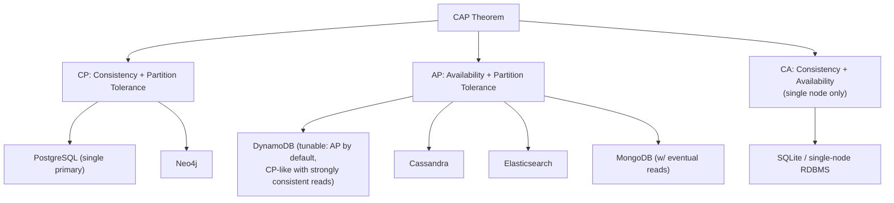
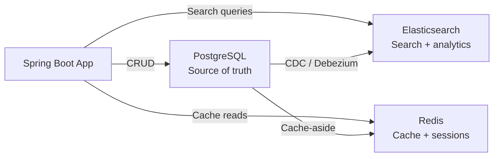
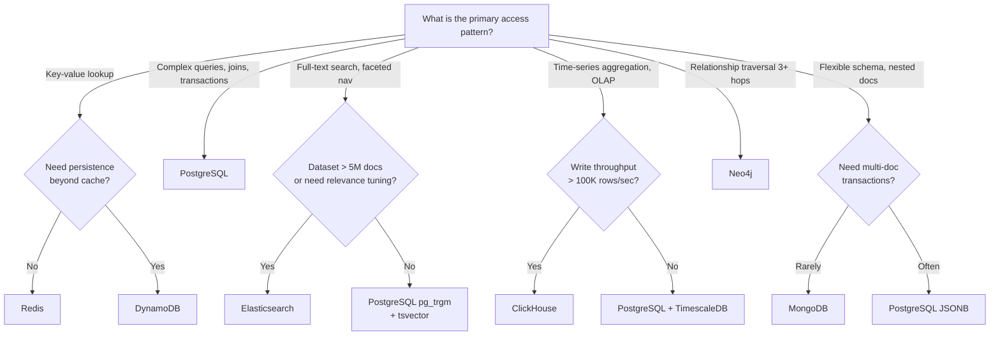

# Polyglot Persistence Decision Framework

**Date:** 2026-04-19 | **Updated:** 2026-04-19
**Tags:** `database` `polyglot` `architecture` `decision-framework` `comparison`

## Table of Contents

- [Summary](#summary)
- [Database Categories](#database-categories)
- [Decision Criteria](#decision-criteria)
- [Comparison Matrix](#comparison-matrix)
- [CAP Theorem Practical Implications](#cap-theorem-practical-implications)
- [Common Multi-Database Architectures](#common-multi-database-architectures)
- [Cost Comparison](#cost-comparison)
- [Migration Paths](#migration-paths)
- [Anti-Patterns](#anti-patterns)
- [Decision Tree](#decision-tree)
- [Related](#related)
- [References](#references)

## Summary

Polyglot persistence means using different database engines for different data access patterns within the same system. This document provides a structured framework for deciding when to introduce a new engine, which one to pick, and how to avoid the most common pitfalls.

## Database Categories

| Category | Primary Strength | Examples |
|---|---|---|
| Relational | ACID transactions, complex joins, structured schemas | PostgreSQL, MySQL |
| Document | Flexible schema, nested objects, rapid iteration | MongoDB, Couchbase |
| Key-Value | Sub-millisecond reads/writes, simple access patterns | Redis, DynamoDB |
| Wide-Column | High write throughput, time-series-like workloads | Cassandra, ScyllaDB |
| Search | Full-text search, relevance scoring, log analytics | Elasticsearch, OpenSearch |
| Time-Series | Append-heavy, time-windowed aggregations | ClickHouse, TimescaleDB |
| Graph | Relationship traversal, pattern matching | Neo4j, Amazon Neptune |

## Decision Criteria

### 1. Consistency Model

- **Strong consistency required** (financial, inventory): Relational or DynamoDB with strongly consistent reads.
- **Eventual consistency acceptable** (analytics, feeds, search): Document, search, wide-column.
- **Tunable consistency**: Cassandra (per-query CL), DynamoDB (consistent read flag).

### 2. Query Patterns

```text
Simple key lookup          -> Key-Value (Redis, DynamoDB)
Complex joins + aggregates -> Relational (PostgreSQL)
Full-text search           -> Search engine (Elasticsearch)
Time-windowed rollups      -> Columnar/OLAP (ClickHouse)
Graph traversal (3+ hops)  -> Graph (Neo4j)
Flexible nested documents  -> Document (MongoDB)
```

### 3. Scale Requirements

- **Read-heavy, cacheable**: Redis in front of any primary store.
- **Write-heavy, append-only**: ClickHouse, Cassandra, or Kafka + sink.
- **Unpredictable spikes**: DynamoDB on-demand or auto-scaling.
- **Single-digit ms p99**: Redis or DynamoDB with DAX.

### 4. Operational Complexity

Managed services reduce operational burden but increase cost and reduce control. Self-hosted engines demand dedicated expertise.

## Comparison Matrix

| Feature | PostgreSQL | MongoDB | Redis | Elasticsearch | ClickHouse | DynamoDB | Neo4j |
|---|---|---|---|---|---|---|---|
| Consistency | Strong (ACID) | Tunable | Eventual (replicas); atomic commands (single-node) | Eventual | Eventual | Tunable | ACID |
| Query Language | SQL | MQL / Aggregation | Commands | Query DSL | SQL-like | PartiQL | Cypher |
| Horizontal Scale | Read replicas, Citus | Sharding (native) | Cluster (hash slots) | Shards + replicas | Distributed tables | Automatic | Fabric (enterprise) |
| Schema Flexibility | Rigid + JSONB | Flexible | Schemaless | Mapping-based | Rigid | Schemaless | Property graph |
| Transactions | Full ACID | Multi-doc (4.0+) | MULTI/EXEC, Lua | None | Limited (experimental, single-node, since 22.6) | 100-item txn | Full ACID |
| Best For | OLTP, complex queries | Variable schema, CMS | Cache, sessions, queues | Search, logs | Analytics, OLAP | Serverless, scale | Relationships |

## CAP Theorem Practical Implications



**Practical takeaway**: During a network partition, CP systems reject writes to preserve consistency; AP systems accept writes but may return stale data. Most production systems operate in a spectrum, not a strict bucket.

## Common Multi-Database Architectures

### PostgreSQL + Redis + Elasticsearch

The most common polyglot stack for web applications:



- **PostgreSQL**: Transactional writes, complex queries, source of truth.
- **Redis**: Session store, hot-path caching, rate limiting, pub/sub.
- **Elasticsearch**: Full-text search, log aggregation, faceted navigation.

### PostgreSQL + ClickHouse (OLTP + OLAP)

```text
Transactional writes -> PostgreSQL
CDC pipeline         -> Debezium -> Kafka -> ClickHouse
Dashboard queries    -> ClickHouse
```

### DynamoDB + Elasticsearch (Serverless Search)

```text
Writes              -> DynamoDB
DynamoDB Streams    -> Lambda -> Elasticsearch
Search API          -> Elasticsearch
```

## Cost Comparison

### Operational Overhead (Self-Hosted)

| Engine | Cluster Complexity | DBA Expertise Needed | Backup Complexity |
|---|---|---|---|
| PostgreSQL | Low-Medium | Medium | pg_dump / WAL archival |
| MongoDB | Medium | Medium | mongodump / oplog |
| Redis | Low | Low | RDB/AOF snapshots |
| Elasticsearch | High | High | Snapshot/restore to S3 |
| ClickHouse | High | High | Backup tables + S3 |
| Neo4j | Medium | Medium | neo4j-admin dump |

### Managed Service Pricing Patterns

| Engine | Managed Service | Pricing Model |
|---|---|---|
| PostgreSQL | RDS, Aurora, Cloud SQL | Instance hours + storage |
| MongoDB | Atlas | Instance hours + storage + IOPS |
| Redis | ElastiCache, MemoryDB | Node hours (memory-priced) |
| Elasticsearch | Elastic Cloud, OpenSearch | Node hours + storage |
| ClickHouse | ClickHouse Cloud | Compute + storage (separated) |
| DynamoDB | (native AWS) | RCU/WCU or on-demand per request |

**Key insight**: DynamoDB on-demand pricing is cheap at low scale but expensive at sustained high throughput. Provisioned capacity with auto-scaling is usually more cost-effective past ~1000 WCU sustained.

## Migration Paths

### When to Add a Second Database

Add a specialized engine when:

1. **PostgreSQL full-text search is too slow**: Response times > 200ms on text queries with 10M+ rows; Elasticsearch is the natural next step.
2. **Cache hit rates demand sub-ms latency**: Hot-path reads need < 1ms; add Redis with cache-aside or read-through.
3. **Analytics queries block OLTP**: Long-running aggregations cause lock contention; offload to ClickHouse.
4. **Access patterns are purely key-value at massive scale**: Simple lookups at > 100K RPS; DynamoDB or Redis Cluster.
5. **Graph traversals hit 3+ joins**: Recursive CTEs in SQL become unreadable and slow; consider Neo4j.

### Migration Strategy

```java
// Phase 1: Dual-write (temporary)
@Transactional
public void createProduct(Product product) {
    productRepository.save(product);           // PostgreSQL
    elasticsearchIndexer.index(product);       // Elasticsearch
}

// Phase 2: CDC-based sync (target state)
// Debezium captures PostgreSQL WAL changes
// Kafka Connect sinks to Elasticsearch
// Application only writes to PostgreSQL
```

**Phase 1** is acceptable for initial migration but introduces consistency risks. **Phase 2** (CDC) is the durable architecture.

## Anti-Patterns

### 1. One Database for Everything

Using PostgreSQL for caching, search, messaging, and analytics. Each use case suffers from compromises:

- Full-text search is functional but lacks relevance tuning.
- Pub/sub via `LISTEN/NOTIFY` does not scale to high-throughput messaging.
- Analytics queries compete with OLTP for resources.

**However**: Starting with PostgreSQL for everything is not wrong. It becomes an anti-pattern only when you feel the pain and refuse to specialize.

### 2. Premature Polyglot

Introducing MongoDB, Redis, Elasticsearch, and Kafka on day one of a new project:

- Increases operational surface area before you understand your access patterns.
- Adds consistency challenges across stores.
- Multiplies infrastructure cost and monitoring burden.

**Rule of thumb**: Start with PostgreSQL. Add a second engine only when you have measured evidence that PostgreSQL cannot serve a specific access pattern within your latency or throughput budget.

### 3. Dual-Write Without Ordering Guarantees

Writing to PostgreSQL and Elasticsearch in the same application code without transactional outbox or CDC:

```java
// DANGEROUS: if ES write fails, data is inconsistent
productRepository.save(product);
elasticsearchClient.index(product); // network failure here = silent inconsistency
```

Use CDC (Debezium) or the transactional outbox pattern instead.

### 4. Treating Every Engine Like a Relational Database

Forcing normalized schemas onto MongoDB, or expecting joins in DynamoDB. Each engine has its own data modeling philosophy; fighting it leads to poor performance and complex workarounds.

## Decision Tree



## Related

- [./redis-beyond-caching.md](./redis-beyond-caching.md) -- Redis deep dive
- [./elasticsearch-deep-dive.md](./elasticsearch-deep-dive.md) -- Elasticsearch architecture and query DSL
- [./mongodb-when-and-how.md](./mongodb-when-and-how.md) -- MongoDB document modeling
- [./clickhouse-analytics.md](./clickhouse-analytics.md) -- ClickHouse for analytics
- [./dynamodb-patterns.md](./dynamodb-patterns.md) -- DynamoDB single-table design

## References

- [PostgreSQL Documentation](https://www.postgresql.org/docs/current/)
- [MongoDB Manual](https://www.mongodb.com/docs/manual/)
- [Redis Documentation](https://redis.io/docs/)
- [Elasticsearch Reference](https://www.elastic.co/guide/en/elasticsearch/reference/current/index.html)
- [ClickHouse Documentation](https://clickhouse.com/docs)
- [DynamoDB Developer Guide](https://docs.aws.amazon.com/amazondynamodb/latest/developerguide/)
- [Neo4j Documentation](https://neo4j.com/docs/)
- [Martin Kleppmann - Designing Data-Intensive Applications](https://dataintensive.net/)
- [CAP Theorem - Eric Brewer, *CAP Twelve Years Later*, IEEE Computer, 2012](https://www.infoq.com/articles/cap-twelve-years-later-how-the-rules-have-changed/)
