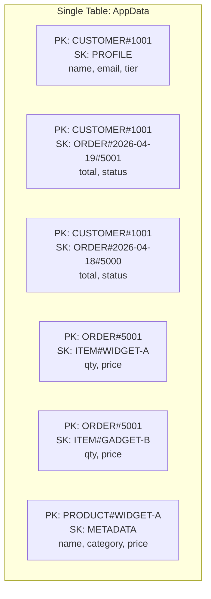
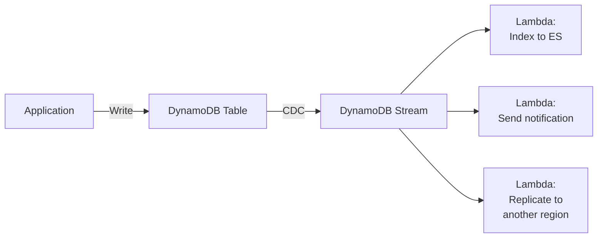

# DynamoDB Patterns

**Date:** 2026-04-19 | **Updated:** 2026-04-19
**Tags:** `dynamodb` `nosql` `single-table-design` `serverless` `aws` `polyglot`

## Table of Contents

- [Summary](#summary)
- [DynamoDB Fundamentals](#dynamodb-fundamentals)
  - [Keys and Consistency](#keys-and-consistency)
- [Single-Table Design](#single-table-design)
  - [PK/SK Overloading](#pksk-overloading)
  - [GSI Overloading](#gsi-overloading)
  - [Item Collections](#item-collections)
- [Access Pattern Driven Design](#access-pattern-driven-design)
- [GSI and LSI](#gsi-and-lsi)
- [Capacity Modes](#capacity-modes)
- [DynamoDB Streams](#dynamodb-streams)
- [Transactions](#transactions)
- [Batch Operations](#batch-operations)
- [TTL](#ttl)
- [Hot Partition Problem](#hot-partition-problem)
- [DynamoDB vs PostgreSQL](#dynamodb-vs-postgresql)
- [Cost Model](#cost-model)
- [Spring Integration](#spring-integration)
- [Related](#related)
- [References](#references)

## Summary

DynamoDB is a fully managed key-value and document database from AWS that delivers single-digit millisecond performance at any scale. Its single-table design pattern, access-pattern-first modeling, and serverless pricing model make it a natural fit for high-scale, simple-access-pattern workloads. This document covers how to design schemas, handle transactions, and avoid common pitfalls.

## DynamoDB Fundamentals

### Keys and Consistency

Every DynamoDB table has a **partition key** (PK) and an optional **sort key** (SK). Together they uniquely identify an item.

```text
Table: Orders
┌─────────────────────┬──────────────────┬──────────┬─────────┐
│ PK (partition key)  │ SK (sort key)    │ status   │ total   │
├─────────────────────┼──────────────────┼──────────┼─────────┤
│ CUSTOMER#1001       │ ORDER#2026-04-19 │ shipped  │ 109.97  │
│ CUSTOMER#1001       │ ORDER#2026-04-18 │ delivered│ 59.99   │
│ CUSTOMER#1002       │ ORDER#2026-04-19 │ pending  │ 249.50  │
└─────────────────────┴──────────────────┴──────────┴─────────┘
```

**Consistency**:
- **Eventually consistent reads** (default): Reads may return slightly stale data. 50% cheaper.
- **Strongly consistent reads**: Guaranteed to return the latest write. Higher latency, full RCU cost.

```java
GetItemRequest request = GetItemRequest.builder()
        .tableName("Orders")
        .key(Map.of(
                "PK", AttributeValue.fromS("CUSTOMER#1001"),
                "SK", AttributeValue.fromS("ORDER#2026-04-19")
        ))
        .consistentRead(true) // strongly consistent
        .build();
```

## Single-Table Design

The defining pattern of advanced DynamoDB usage. Instead of one table per entity (relational thinking), you store all entity types in one table and differentiate them by PK/SK prefixes.

### PK/SK Overloading



**Why this works**: DynamoDB is optimized for single-table access patterns. A `Query` on PK + SK prefix retrieves all related data in one request, avoiding multiple table lookups.

```java
// Get customer profile + recent orders in one query
QueryRequest request = QueryRequest.builder()
        .tableName("AppData")
        .keyConditionExpression("PK = :pk AND SK >= :skPrefix")
        .expressionAttributeValues(Map.of(
                ":pk", AttributeValue.fromS("CUSTOMER#1001"),
                ":skPrefix", AttributeValue.fromS("ORDER#2026-04")
        ))
        .build();
```

### GSI Overloading

Global Secondary Indexes can also be overloaded with composite key values:

```text
GSI1:
┌───────────────────┬──────────────────────────┬─────────┐
│ GSI1PK            │ GSI1SK                   │ ...     │
├───────────────────┼──────────────────────────┼─────────┤
│ STATUS#shipped    │ 2026-04-19#ORDER#5001    │ ...     │
│ STATUS#pending    │ 2026-04-19#ORDER#5002    │ ...     │
│ CATEGORY#elec     │ PRODUCT#WIDGET-A         │ ...     │
└───────────────────┴──────────────────────────┴─────────┘

Access patterns served:
- Get all shipped orders sorted by date
- Get all products in a category
```

### Item Collections

An item collection is all items sharing the same partition key value. DynamoDB guarantees that items in the same collection are stored together on the same partition, enabling efficient `Query` operations.

```text
Item Collection for PK = "CUSTOMER#1001":
  SK = "PROFILE"              -> customer profile
  SK = "ADDRESS#home"         -> home address
  SK = "ADDRESS#work"         -> work address
  SK = "ORDER#2026-04-19"     -> order
  SK = "ORDER#2026-04-18"     -> order
```

## Access Pattern Driven Design

DynamoDB schema design is backwards compared to relational design:

```text
Relational: Define entities -> Normalize -> Write queries
DynamoDB:   List access patterns -> Design keys to serve them -> Denormalize
```

### Step-by-Step Process

1. **List all access patterns**:

```text
AP1: Get customer profile by customer ID
AP2: Get all orders for a customer, sorted by date
AP3: Get order details with line items
AP4: Get all orders by status (across customers)
AP5: Get product by SKU
AP6: Get all products in a category
```

2. **Design the key schema**:

| Access Pattern | PK | SK | Index |
|---|---|---|---|
| AP1: Customer profile | `CUSTOMER#<id>` | `PROFILE` | Table |
| AP2: Customer orders | `CUSTOMER#<id>` | `ORDER#<date>#<id>` | Table |
| AP3: Order line items | `ORDER#<id>` | `ITEM#<sku>` | Table |
| AP4: Orders by status | `STATUS#<status>` | `<date>#ORDER#<id>` | GSI1 |
| AP5: Product by SKU | `PRODUCT#<sku>` | `METADATA` | Table |
| AP6: Products by category | `CATEGORY#<cat>` | `PRODUCT#<sku>` | GSI1 |

3. **Implement and test each access pattern** before moving to the next.

## GSI and LSI

### Global Secondary Index (GSI)

- Has its own partition key and sort key (can be different from the table).
- Eventually consistent only.
- Has its own provisioned throughput (separate RCU/WCU).
- Can be added or removed at any time.
- Max 20 GSIs per table.

### Local Secondary Index (LSI)

- Same partition key as the table, different sort key.
- Supports strongly consistent reads.
- Must be created at table creation time (cannot be added later).
- Shares throughput with the base table.
- Max 5 LSIs per table.
- Item collection size limit: 10GB per partition key value.

```text
Table:  PK = CUSTOMER#1001, SK = ORDER#2026-04-19
LSI:    PK = CUSTOMER#1001, LSI_SK = STATUS#shipped#2026-04-19

Use case: Get all orders for a customer filtered/sorted by status.
```

**Prefer GSIs** in most cases. LSIs are only useful when you need strongly consistent reads on an alternate sort order and can accept the 10GB limit.

### GSI Cost

Every item written to the base table is also written to each GSI that projects it. This means GSIs multiply your write costs:

```text
Base table write: 1 WCU per 1KB
3 GSIs projecting the item: 3 additional WCU per write
Total: 4 WCU per write
```

Only project attributes you actually need in the GSI (`KEYS_ONLY`, `INCLUDE`, or `ALL`).

## Capacity Modes

### On-Demand

- Pay per request (no capacity planning).
- Automatically scales to any traffic level.
- Best for: unpredictable workloads, new applications, development.
- Cost: ~5x more expensive per request than provisioned at sustained throughput.

### Provisioned with Auto-Scaling

```json
{
  "TableName": "AppData",
  "BillingMode": "PROVISIONED",
  "ProvisionedThroughput": {
    "ReadCapacityUnits": 100,
    "WriteCapacityUnits": 50
  }
}
```

- Set min/max capacity and target utilization (typically 70%).
- Auto-scaling adjusts within minutes.
- **Burst capacity**: DynamoDB reserves unused capacity for up to 5 minutes of burst.

**Migration tip**: Start with on-demand during development, switch to provisioned with auto-scaling once traffic patterns are stable.

## DynamoDB Streams



DynamoDB Streams captures item-level changes (INSERT, MODIFY, REMOVE) and retains them for 24 hours.

```java
// Lambda handler for DynamoDB Stream events
public class OrderStreamHandler implements RequestHandler<DynamodbEvent, Void> {

    @Override
    public Void handleRequest(DynamodbEvent event, Context context) {
        for (DynamodbEvent.DynamodbStreamRecord record : event.getRecords()) {
            String eventName = record.getEventName(); // INSERT, MODIFY, REMOVE

            Map<String, AttributeValue> newImage = record.getDynamodb().getNewImage();
            Map<String, AttributeValue> oldImage = record.getDynamodb().getOldImage();

            if ("MODIFY".equals(eventName)) {
                String oldStatus = oldImage.get("status").getS();
                String newStatus = newImage.get("status").getS();
                if (!"shipped".equals(oldStatus) && "shipped".equals(newStatus)) {
                    sendShipmentNotification(newImage);
                }
            }
        }
        return null;
    }
}
```

**Stream view types**: `KEYS_ONLY`, `NEW_IMAGE`, `OLD_IMAGE`, `NEW_AND_OLD_IMAGES`.

## Transactions

DynamoDB supports ACID transactions across up to 100 items (or 4MB total).

```java
// Transfer funds between two accounts atomically
TransactWriteItemsRequest txRequest = TransactWriteItemsRequest.builder()
        .transactItems(
                TransactWriteItem.builder()
                        .update(Update.builder()
                                .tableName("AppData")
                                .key(Map.of(
                                        "PK", AttributeValue.fromS("ACCOUNT#1001"),
                                        "SK", AttributeValue.fromS("BALANCE")
                                ))
                                .updateExpression("SET balance = balance - :amount")
                                .conditionExpression("balance >= :amount")
                                .expressionAttributeValues(Map.of(
                                        ":amount", AttributeValue.fromN("100")
                                ))
                                .build())
                        .build(),
                TransactWriteItem.builder()
                        .update(Update.builder()
                                .tableName("AppData")
                                .key(Map.of(
                                        "PK", AttributeValue.fromS("ACCOUNT#1002"),
                                        "SK", AttributeValue.fromS("BALANCE")
                                ))
                                .updateExpression("SET balance = balance + :amount")
                                .expressionAttributeValues(Map.of(
                                        ":amount", AttributeValue.fromN("100")
                                ))
                                .build())
                        .build()
        )
        .build();

dynamoDbClient.transactWriteItems(txRequest);
```

**Limitations**:
- Max 100 items per transaction.
- Max 4MB total size.
- 2x the WCU cost of non-transactional writes.
- Items in a transaction cannot share the same primary key.
- TransactWriteItems/TransactGetItems support items across multiple tables.

## Batch Operations

### BatchWriteItem

Write up to 25 items in a single request. Items can span multiple tables.

```java
BatchWriteItemRequest batchRequest = BatchWriteItemRequest.builder()
        .requestItems(Map.of(
                "AppData", List.of(
                        WriteRequest.builder()
                                .putRequest(PutRequest.builder()
                                        .item(Map.of(
                                                "PK", AttributeValue.fromS("PRODUCT#W001"),
                                                "SK", AttributeValue.fromS("METADATA"),
                                                "name", AttributeValue.fromS("Widget A")
                                        )).build())
                                .build(),
                        WriteRequest.builder()
                                .putRequest(PutRequest.builder()
                                        .item(Map.of(
                                                "PK", AttributeValue.fromS("PRODUCT#W002"),
                                                "SK", AttributeValue.fromS("METADATA"),
                                                "name", AttributeValue.fromS("Widget B")
                                        )).build())
                                .build()
                )
        )).build();

BatchWriteItemResponse response = dynamoDbClient.batchWriteItem(batchRequest);

// CRITICAL: Retry unprocessed items
Map<String, List<WriteRequest>> unprocessed = response.unprocessedItems();
if (!unprocessed.isEmpty()) {
    // Exponential backoff retry
    retryUnprocessedItems(unprocessed);
}
```

### BatchGetItem

Read up to 100 items (16MB max) in a single request.

```java
BatchGetItemRequest batchGet = BatchGetItemRequest.builder()
        .requestItems(Map.of(
                "AppData", KeysAndAttributes.builder()
                        .keys(List.of(
                                Map.of("PK", AttributeValue.fromS("PRODUCT#W001"),
                                       "SK", AttributeValue.fromS("METADATA")),
                                Map.of("PK", AttributeValue.fromS("PRODUCT#W002"),
                                       "SK", AttributeValue.fromS("METADATA"))
                        ))
                        .projectionExpression("PK, SK, #n, price")
                        .expressionAttributeNames(Map.of("#n", "name"))
                        .build()
        )).build();
```

**Always handle `unprocessedKeys`** in the response with exponential backoff.

## TTL

Automatic, free deletion of expired items. Useful for sessions, temporary tokens, and time-limited data.

```java
// Enable TTL on the table (one-time setup)
UpdateTimeToLiveRequest ttlRequest = UpdateTimeToLiveRequest.builder()
        .tableName("AppData")
        .timeToLiveSpecification(TimeToLiveSpecification.builder()
                .attributeName("expires_at")
                .enabled(true)
                .build())
        .build();

// Write an item with TTL (epoch seconds)
Map<String, AttributeValue> sessionItem = Map.of(
        "PK", AttributeValue.fromS("SESSION#abc123"),
        "SK", AttributeValue.fromS("DATA"),
        "user_id", AttributeValue.fromS("1001"),
        "expires_at", AttributeValue.fromN(
                String.valueOf(Instant.now().plus(Duration.ofHours(24)).getEpochSecond()))
);
```

**Note**: TTL deletions happen within 48 hours of expiration (not instant). Do not rely on TTL for hard real-time expiration. Filter expired items in your application logic:

```java
.filterExpression("expires_at > :now")
.expressionAttributeValues(Map.of(":now",
        AttributeValue.fromN(String.valueOf(Instant.now().getEpochSecond()))))
```

## Hot Partition Problem

A hot partition occurs when a disproportionate amount of traffic hits a single partition key. DynamoDB distributes throughput evenly across partitions, so a hot partition gets throttled.

### Write Sharding

Spread writes across multiple partition key values:

```java
// Instead of PK = "COUNTER#page_views"
// Use PK = "COUNTER#page_views#<shard>"
int shardCount = 10;
int shard = ThreadLocalRandom.current().nextInt(shardCount);
String pk = "COUNTER#page_views#" + shard;

// To read the total, query all shards and sum:
long total = 0;
for (int i = 0; i < shardCount; i++) {
    // Query COUNTER#page_views#<i> and sum values
}
```

### Partition Key Design Strategies

| Pattern | Example PK | Risk |
|---|---|---|
| User-scoped | `USER#<user_id>` | Low (unless one user dominates) |
| Time-scoped | `DATE#2026-04-19` | High (all writes to today's partition) |
| Sharded time | `DATE#2026-04-19#<shard>` | Low |
| Composite | `TENANT#<id>#ORDER#<id>` | Depends on tenant distribution |

## DynamoDB vs PostgreSQL

| Aspect | DynamoDB | PostgreSQL |
|---|---|---|
| Scaling | Automatic, infinite horizontal | Vertical + read replicas |
| Query flexibility | PK/SK lookups, scans | Full SQL, joins, subqueries |
| Transactions | 100-item limit, 2x cost | Unlimited, native ACID |
| Schema | Schemaless | Schema-enforced |
| Pricing | Per-request or provisioned | Instance-based |
| Ops burden | Zero (fully managed) | Moderate (even on RDS) |
| Latency | Single-digit ms, consistent | Single-digit ms for indexed queries |
| Joins | None (denormalize) | Full relational joins |

**When DynamoDB wins**:
- Serverless architecture (Lambda + API Gateway + DynamoDB).
- Massive scale with simple access patterns (> 100K RPS).
- Zero-ops requirement (no patching, no capacity planning with on-demand).
- Predictable latency at any scale.

**When PostgreSQL wins**:
- Complex queries, ad-hoc analytics, reporting.
- Multiple access patterns that are hard to predict upfront.
- Strong consistency requirements across many entities.
- Budget-sensitive workloads at moderate scale.

## Cost Model

### Read/Write Pricing (us-east-1, on-demand)

| Operation | Cost |
|---|---|
| Write Request Unit (WRU) | ~$0.625 per million (us-east-1, post-Nov 2023) |
| Read Request Unit (RRU) | ~$0.125 per million (us-east-1, post-Nov 2023) |
| Storage | $0.25 per GB/month |
| DynamoDB Streams read | $0.02 per 100K reads |
| Data transfer out | $0.09 per GB (after 1GB free) |

**Note**: Prices vary by AWS region and may change. Always check the [DynamoDB pricing page](https://aws.amazon.com/dynamodb/pricing/) for current rates.

### RCU/WCU Calculation

```text
1 WCU = 1 write of up to 1KB per second
1 RCU = 1 strongly consistent read of up to 4KB per second
      = 2 eventually consistent reads of up to 4KB per second

Example: Write 500 items/sec, each 2KB
  WCU = 500 * ceil(2/1) = 1000 WCU

Example: Read 1000 items/sec, each 8KB, eventually consistent
  RCU = 1000 * ceil(8/4) / 2 = 1000 RCU
```

### GSI Cost Impact

GSIs have their own throughput. Each projected item write costs WCU on the GSI as well:

```text
3 GSIs, each projecting the full item:
Base write cost: 1 WCU
GSI write cost: 3 WCU
Total: 4 WCU per item write

Minimize GSI costs by:
- Using KEYS_ONLY or INCLUDE projections
- Only creating GSIs for access patterns that need them
```

## Spring Integration

### AWS SDK v2 Enhanced Client

```java
@DynamoDbBean
public class OrderItem {

    private String pk;
    private String sk;
    private String status;
    private BigDecimal total;
    private Instant createdAt;

    @DynamoDbPartitionKey
    @DynamoDbAttribute("PK")
    public String getPk() { return pk; }

    @DynamoDbSortKey
    @DynamoDbAttribute("SK")
    public String getSk() { return sk; }

    @DynamoDbAttribute("status")
    public String getStatus() { return status; }

    @DynamoDbAttribute("total")
    public BigDecimal getTotal() { return total; }

    @DynamoDbAttribute("created_at")
    public Instant getCreatedAt() { return createdAt; }

    // setters omitted for brevity
}
```

```java
@Repository
public class OrderDynamoDbRepository {

    private final DynamoDbTable<OrderItem> table;

    public OrderDynamoDbRepository(DynamoDbEnhancedClient enhancedClient) {
        this.table = enhancedClient.table("AppData", TableSchema.fromBean(OrderItem.class));
    }

    public void save(OrderItem order) {
        table.putItem(order);
    }

    public OrderItem findByKey(String pk, String sk) {
        Key key = Key.builder().partitionValue(pk).sortValue(sk).build();
        return table.getItem(key);
    }

    public List<OrderItem> findOrdersByCustomer(String customerId) {
        QueryConditional queryConditional = QueryConditional.sortBeginsWith(
                Key.builder()
                        .partitionValue("CUSTOMER#" + customerId)
                        .sortValue("ORDER#")
                        .build()
        );

        return table.query(queryConditional)
                .items()
                .stream()
                .toList();
    }
}
```

### Configuration

```java
@Configuration
public class DynamoDbConfig {

    @Bean
    public DynamoDbClient dynamoDbClient() {
        return DynamoDbClient.builder()
                .region(Region.US_EAST_1)
                .credentialsProvider(DefaultCredentialsProvider.create())
                .build();
    }

    @Bean
    public DynamoDbEnhancedClient enhancedClient(DynamoDbClient dynamoDbClient) {
        return DynamoDbEnhancedClient.builder()
                .dynamoDbClient(dynamoDbClient)
                .build();
    }
}
```

## Related

- [./decision-framework.md](./decision-framework.md) -- When to choose DynamoDB vs other engines
- [./redis-beyond-caching.md](./redis-beyond-caching.md) -- Redis as a complementary caching layer
- [./mongodb-when-and-how.md](./mongodb-when-and-how.md) -- MongoDB as an alternative document store

## References

- [DynamoDB Developer Guide](https://docs.aws.amazon.com/amazondynamodb/latest/developerguide/)
- [Alex DeBrie - The DynamoDB Book](https://www.dynamodbbook.com/)
- [AWS re:Invent - Advanced Design Patterns for DynamoDB (Rick Houlihan)](https://www.youtube.com/watch?v=HaEPXoXVf2k)
- [DynamoDB Single-Table Design](https://www.alexdebrie.com/posts/dynamodb-single-table/)
- [AWS SDK for Java v2 - DynamoDB Enhanced Client](https://docs.aws.amazon.com/sdk-for-java/latest/developer-guide/dynamodb-enhanced-client.html)
- [DynamoDB Pricing](https://aws.amazon.com/dynamodb/pricing/)
- [DynamoDB Streams](https://docs.aws.amazon.com/amazondynamodb/latest/developerguide/Streams.html)
