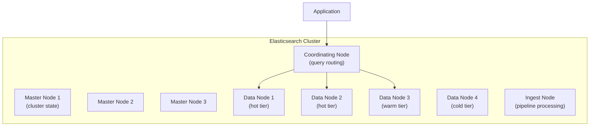
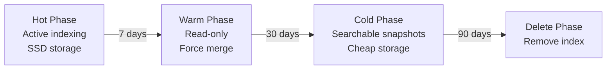

# Elasticsearch Deep Dive

**Date:** 2026-04-19 | **Updated:** 2026-04-19
**Tags:** `elasticsearch` `search` `inverted-index` `analytics` `polyglot`

## Table of Contents

- [Summary](#summary)
- [Architecture](#architecture)
  - [Nodes and Roles](#nodes-and-roles)
  - [Shards and Replicas](#shards-and-replicas)
- [Inverted Index](#inverted-index)
- [Mappings](#mappings)
- [Analyzers](#analyzers)
- [Query DSL](#query-dsl)
  - [Full-Text Queries](#full-text-queries)
  - [Term-Level Queries](#term-level-queries)
  - [Compound Queries](#compound-queries)
  - [Function Score](#function-score)
- [Relevance Scoring](#relevance-scoring)
- [Aggregations](#aggregations)
- [Index Lifecycle Management](#index-lifecycle-management)
- [Elasticsearch vs PostgreSQL Full-Text Search](#elasticsearch-vs-postgresql-full-text-search)
- [Spring Data Elasticsearch](#spring-data-elasticsearch)
- [Operational Concerns](#operational-concerns)
- [Related](#related)
- [References](#references)

## Summary

Elasticsearch is a distributed search and analytics engine built on Apache Lucene. It excels at full-text search with relevance scoring, log aggregation, and near-real-time analytics over semi-structured data. Understanding its inverted index, shard architecture, and query DSL is essential for effective use.

## Architecture

### Nodes and Roles



| Role | Purpose | Sizing |
|---|---|---|
| Master-eligible | Cluster state management, shard allocation | 3 dedicated nodes, low CPU/memory |
| Data (hot) | Active indexing and search | High CPU, SSD, generous RAM |
| Data (warm) | Less-frequent searches, recent data | Moderate CPU, large HDD |
| Data (cold) | Archival, rare searches | Low CPU, cheapest storage |
| Coordinating | Query routing, scatter-gather | Moderate CPU, no local data |
| Ingest | Pipeline processing (enrichment, parsing) | CPU-focused |

### Shards and Replicas

- **Primary shard**: A partition of the index. Set at index creation, cannot be changed (without reindexing).
- **Replica shard**: Copy of a primary, serves reads and provides failover.
- Each shard is a self-contained Lucene index.

```json
{
  "settings": {
    "number_of_shards": 3,
    "number_of_replicas": 1
  }
}
```

**Shard sizing rule of thumb**: 20-50GB per shard. Too many small shards waste overhead; too few large shards slow search and recovery.

## Inverted Index

The core data structure that makes text search fast. Instead of scanning every document, Elasticsearch maps each term to the list of documents containing it.

```text
Document 1: "Redis is an in-memory data structure store"
Document 2: "Elasticsearch stores data in an inverted index"
Document 3: "Redis and Elasticsearch complement each other"

Inverted Index:
  Term            -> Document IDs
  ─────────────────────────────
  redis           -> [1, 3]
  memory          -> [1]
  data            -> [1, 2]
  structure       -> [1]
  store           -> [1]
  elasticsearch   -> [2, 3]
  stores          -> [2]
  inverted        -> [2]
  index           -> [2]
  complement      -> [3]
```

Each entry also stores **term frequency** (how often the term appears in the document) and **positions** (for phrase queries). This is how Elasticsearch achieves near-constant-time lookup per term (via FST) instead of O(N) full-scan.

## Mappings

Mappings define how fields are indexed and stored.

### Key Field Types

| Type | Use Case | Searchable | Aggregatable |
|---|---|---|---|
| `text` | Full-text search (analyzed) | Yes (full-text) | No (use `.keyword`) |
| `keyword` | Exact match, sorting, aggregations | Yes (exact) | Yes |
| `integer/long/float` | Numeric range queries | Yes | Yes |
| `date` | Timestamps | Yes (range) | Yes |
| `nested` | Arrays of objects with independent fields | Yes (nested query) | Yes (nested agg) |
| `object` | Flat JSON objects | Yes (dot notation) | Partial |

### Dynamic vs Explicit Mapping

```json
{
  "mappings": {
    "dynamic": "strict",
    "properties": {
      "title": {
        "type": "text",
        "analyzer": "english",
        "fields": {
          "keyword": { "type": "keyword" },
          "autocomplete": {
            "type": "text",
            "analyzer": "autocomplete_analyzer"
          }
        }
      },
      "price": { "type": "scaled_float", "scaling_factor": 100 },
      "tags": { "type": "keyword" },
      "created_at": { "type": "date", "format": "yyyy-MM-dd'T'HH:mm:ss.SSSZ" },
      "metadata": {
        "type": "nested",
        "properties": {
          "key": { "type": "keyword" },
          "value": { "type": "keyword" }
        }
      }
    }
  }
}
```

**Best practice**: Always use `"dynamic": "strict"` in production to prevent accidental field creation from malformed documents.

## Analyzers

An analyzer processes text through three stages:

```text
Input Text: "The Quick Brown Fox's 2 Jumps"
                    |
            [Character Filters]    e.g., html_strip, pattern_replace
                    |
            [Tokenizer]            e.g., standard, whitespace, pattern
                    |
            [Token Filters]        e.g., lowercase, stop, stemmer, synonym
                    |
Output Tokens: ["quick", "brown", "fox", "2", "jump"]
```

### Custom Analyzer Example

```json
{
  "settings": {
    "analysis": {
      "char_filter": {
        "ampersand_to_and": {
          "type": "pattern_replace",
          "pattern": "&",
          "replacement": " and "
        }
      },
      "tokenizer": {
        "product_tokenizer": {
          "type": "pattern",
          "pattern": "[\\s\\-_]+"
        }
      },
      "filter": {
        "english_stemmer": { "type": "stemmer", "language": "english" },
        "english_stop": { "type": "stop", "stopwords": "_english_" },
        "product_synonyms": {
          "type": "synonym",
          "synonyms": ["laptop,notebook", "phone,mobile,cell"]
        }
      },
      "analyzer": {
        "product_analyzer": {
          "type": "custom",
          "char_filter": ["ampersand_to_and"],
          "tokenizer": "product_tokenizer",
          "filter": ["lowercase", "english_stop", "english_stemmer", "product_synonyms"]
        }
      }
    }
  }
}
```

### Testing Analyzers

```bash
POST /_analyze
{
  "analyzer": "product_analyzer",
  "text": "MacBook Pro & Air laptops"
}
```

## Query DSL

### Full-Text Queries

```json
{
  "query": {
    "match": {
      "title": {
        "query": "redis caching patterns",
        "operator": "and",
        "fuzziness": "AUTO"
      }
    }
  }
}
```

```json
{
  "query": {
    "multi_match": {
      "query": "distributed database",
      "fields": ["title^3", "description^2", "tags"],
      "type": "best_fields"
    }
  }
}
```

### Term-Level Queries

```json
{
  "query": {
    "bool": {
      "filter": [
        { "term": { "status": "published" } },
        { "range": { "price": { "gte": 10, "lte": 100 } } },
        { "terms": { "category": ["electronics", "software"] } }
      ]
    }
  }
}
```

### Compound Queries

The `bool` query is the workhorse of Elasticsearch:

```json
{
  "query": {
    "bool": {
      "must": [
        { "match": { "title": "elasticsearch" } }
      ],
      "should": [
        { "match": { "title": "tutorial" } },
        { "match": { "tags": "beginner" } }
      ],
      "must_not": [
        { "term": { "status": "draft" } }
      ],
      "filter": [
        { "range": { "created_at": { "gte": "2025-01-01" } } }
      ],
      "minimum_should_match": 1
    }
  }
}
```

- **must**: Contributes to score, required.
- **should**: Contributes to score, optional (unless `minimum_should_match`).
- **filter**: Required but does NOT contribute to score (cacheable).
- **must_not**: Excludes, no scoring.

### Function Score

Customize relevance with decay functions, field-based boosting, or scripting:

```json
{
  "query": {
    "function_score": {
      "query": { "match": { "title": "database" } },
      "functions": [
        {
          "gauss": {
            "created_at": {
              "origin": "now",
              "scale": "30d",
              "decay": 0.5
            }
          },
          "weight": 2
        },
        {
          "field_value_factor": {
            "field": "popularity",
            "factor": 1.2,
            "modifier": "log1p",
            "missing": 1
          }
        }
      ],
      "score_mode": "sum",
      "boost_mode": "multiply"
    }
  }
}
```

## Relevance Scoring

### BM25 (Default since ES 5.x)

BM25 replaced TF-IDF as the default scoring algorithm. Key parameters:

- **k1** (default 1.2): Controls term frequency saturation. Higher values give more weight to term frequency.
- **b** (default 0.75): Controls document length normalization. 0 = no normalization, 1 = full normalization.

```text
BM25 Score = IDF * (tf * (k1 + 1)) / (tf + k1 * (1 - b + b * (dl / avgdl)))

Where:
  IDF   = inverse document frequency (rare terms score higher)
  tf    = term frequency in the document
  dl    = document length
  avgdl = average document length
```

**Practical tuning**: Use the `_explain` API to understand why a document scores the way it does:

```bash
GET /products/_explain/doc-id-123
{
  "query": { "match": { "title": "redis caching" } }
}
```

## Aggregations

### Terms Aggregation

```json
{
  "size": 0,
  "aggs": {
    "categories": {
      "terms": { "field": "category", "size": 20 },
      "aggs": {
        "avg_price": { "avg": { "field": "price" } }
      }
    }
  }
}
```

### Date Histogram

```json
{
  "size": 0,
  "aggs": {
    "orders_over_time": {
      "date_histogram": {
        "field": "created_at",
        "calendar_interval": "month"
      },
      "aggs": {
        "total_revenue": { "sum": { "field": "amount" } }
      }
    }
  }
}
```

### Pipeline Aggregations

```json
{
  "size": 0,
  "aggs": {
    "monthly_sales": {
      "date_histogram": {
        "field": "created_at",
        "calendar_interval": "month"
      },
      "aggs": {
        "revenue": { "sum": { "field": "amount" } }
      }
    },
    "moving_avg_revenue": {
      "moving_fn": {
        "buckets_path": "monthly_sales>revenue",
        "window": 3,
        "script": "MovingFunctions.unweightedAvg(values)"
      }
    }
  }
}
```

## Index Lifecycle Management



```json
{
  "policy": {
    "phases": {
      "hot": {
        "actions": {
          "rollover": {
            "max_size": "50gb",
            "max_age": "7d"
          },
          "set_priority": { "priority": 100 }
        }
      },
      "warm": {
        "min_age": "7d",
        "actions": {
          "shrink": { "number_of_shards": 1 },
          "forcemerge": { "max_num_segments": 1 },
          "set_priority": { "priority": 50 }
        }
      },
      "cold": {
        "min_age": "30d",
        "actions": {
          "set_priority": { "priority": 0 },
          "allocate": {
            "require": { "data": "cold" }
          }
        }
      },
      "delete": {
        "min_age": "90d",
        "actions": { "delete": {} }
      }
    }
  }
}
```

## Elasticsearch vs PostgreSQL Full-Text Search

| Feature | Elasticsearch | PostgreSQL (tsvector + GIN) |
|---|---|---|
| Relevance tuning | BM25, function_score, boosting | ts_rank, ts_rank_cd (limited) |
| Custom analyzers | Extensive (char filters, tokenizers, token filters) | Dictionaries, basic stemming |
| Fuzzy search | Built-in (`fuzziness: "AUTO"`) | pg_trgm extension |
| Faceted search | Aggregations (terms, range, nested) | Requires manual GROUP BY |
| Autocomplete | edge_ngram, completion suggester | pg_trgm with LIKE |
| Scalability | Distributed across nodes | Single-node (unless Citus) |
| Operational complexity | High (cluster management) | Low (part of existing DB) |
| Consistency | Eventual (near-real-time) | Strong (transactional) |

**When PostgreSQL full-text is enough**:
- < 5 million documents
- Simple search (no custom analyzers or complex relevance tuning)
- Consistency matters more than search sophistication
- You want to avoid the operational burden of another system

**When to move to Elasticsearch**:
- > 5M documents with sub-100ms search latency requirements
- Need for faceted navigation, autocomplete, typo tolerance
- Log aggregation or time-series analytics
- Custom relevance scoring (e-commerce product search)

## Spring Data Elasticsearch

### Repository Abstraction

```java
@Document(indexName = "products")
public class ProductDocument {

    @Id
    private String id;

    @Field(type = FieldType.Text, analyzer = "english")
    private String title;

    @Field(type = FieldType.Keyword)
    private String category;

    @Field(type = FieldType.Scaled_Float, scalingFactor = 100)
    private BigDecimal price;

    @Field(type = FieldType.Date, format = DateFormat.date_hour_minute_second)
    private Instant createdAt;
}

public interface ProductSearchRepository extends ElasticsearchRepository<ProductDocument, String> {

    List<ProductDocument> findByCategory(String category);

    @Query("{\"bool\": {\"must\": [{\"match\": {\"title\": \"?0\"}}], \"filter\": [{\"range\": {\"price\": {\"lte\": ?1}}}]}}")
    Page<ProductDocument> searchByTitleAndMaxPrice(String title, double maxPrice, Pageable pageable);
}
```

### ElasticsearchRestTemplate for Complex Queries

```java
@Service
public class ProductSearchService {

    private final ElasticsearchOperations elasticsearchOperations;

    public SearchHits<ProductDocument> search(String query, String category, double minPrice) {
        NativeQuery searchQuery = NativeQuery.builder()
                .withQuery(q -> q.bool(b -> b
                        .must(m -> m.match(mt -> mt.field("title").query(query)))
                        .filter(f -> f.term(t -> t.field("category").value(category)))
                        .filter(f -> f.range(r -> r.field("price").gte(JsonData.of(minPrice))))
                ))
                .withAggregation("price_ranges", Aggregation.of(a -> a
                        .range(r -> r.field("price")
                                .ranges(
                                        AggregationRange.of(ar -> ar.to("50")),
                                        AggregationRange.of(ar -> ar.from("50").to("200")),
                                        AggregationRange.of(ar -> ar.from("200"))
                                )
                        )
                ))
                .withPageable(PageRequest.of(0, 20))
                .build();

        return elasticsearchOperations.search(searchQuery, ProductDocument.class);
    }
}
```

## Operational Concerns

### Cluster Sizing Guidelines

- **Minimum production cluster**: 3 master-eligible nodes + 2 data nodes.
- **Heap**: Set to 50% of available RAM, max 31GB (compressed oops threshold).
- **Disk**: Leave 15% free disk space per node. Set watermark thresholds.

### Shard Strategy

- Target **20-50GB per shard** for optimal performance.
- Fewer, larger shards are better than many small shards.
- Over-sharding causes excessive overhead on cluster state and query fan-out.
- For time-series indices: use rollover + ILM rather than daily indices.

### Split-Brain Prevention

With dedicated master nodes, set:

```yaml
# elasticsearch.yml
# NOTE: discovery.zen.minimum_master_nodes was removed in ES 7.0.
# In ES 7+, split-brain prevention is handled automatically via the voting configuration.
# Only set cluster.initial_master_nodes for initial cluster bootstrapping:
cluster.initial_master_nodes: ["master-1", "master-2", "master-3"]
```

### Monitoring Essentials

```bash
# Cluster health
GET /_cluster/health

# Node stats (JVM heap, indexing rate, search latency)
GET /_nodes/stats

# Index stats
GET /products/_stats

# Slow query log
PUT /products/_settings
{
  "index.search.slowlog.threshold.query.warn": "2s",
  "index.search.slowlog.threshold.query.info": "500ms"
}
```

## Related

- [./decision-framework.md](./decision-framework.md) -- When to choose Elasticsearch vs other engines
- [./redis-beyond-caching.md](./redis-beyond-caching.md) -- Redis for complementary caching layer
- [./clickhouse-analytics.md](./clickhouse-analytics.md) -- ClickHouse as an analytics alternative

## References

- [Elasticsearch Reference](https://www.elastic.co/guide/en/elasticsearch/reference/current/index.html)
- [Elasticsearch: The Definitive Guide](https://www.elastic.co/guide/en/elasticsearch/guide/current/index.html)
- [Spring Data Elasticsearch Reference](https://docs.spring.io/spring-data/elasticsearch/reference/)
- [Lucene in Action (Manning)](https://www.manning.com/books/lucene-in-action-second-edition)
- [BM25 Scoring Explained](https://www.elastic.co/blog/practical-bm25-part-2-the-bm25-algorithm-and-its-variables)
- [Index Lifecycle Management](https://www.elastic.co/guide/en/elasticsearch/reference/current/index-lifecycle-management.html)
