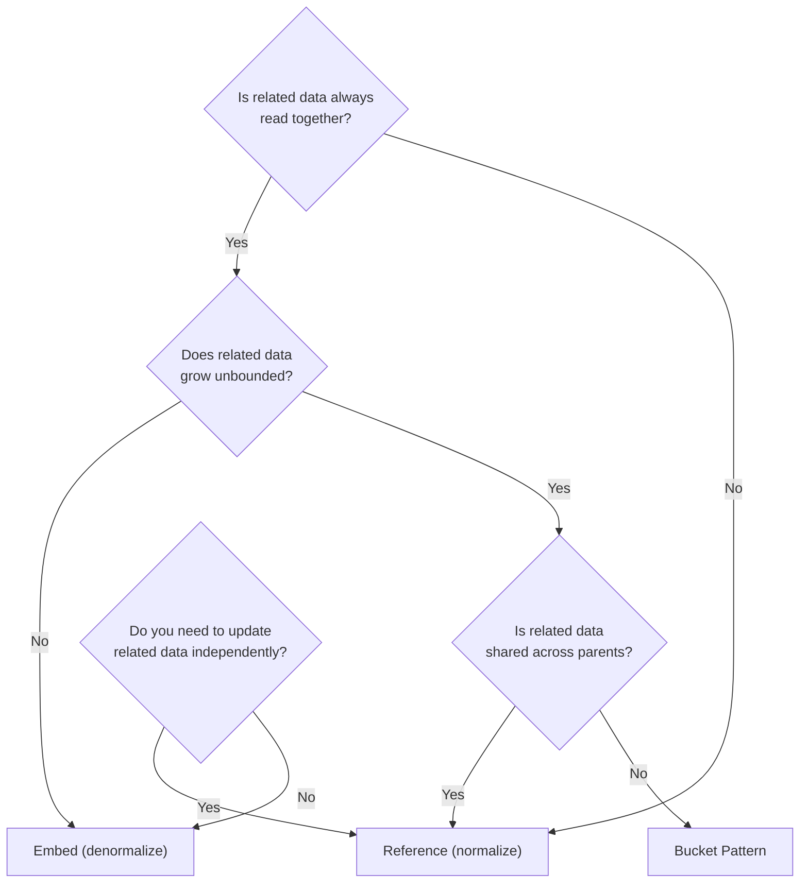
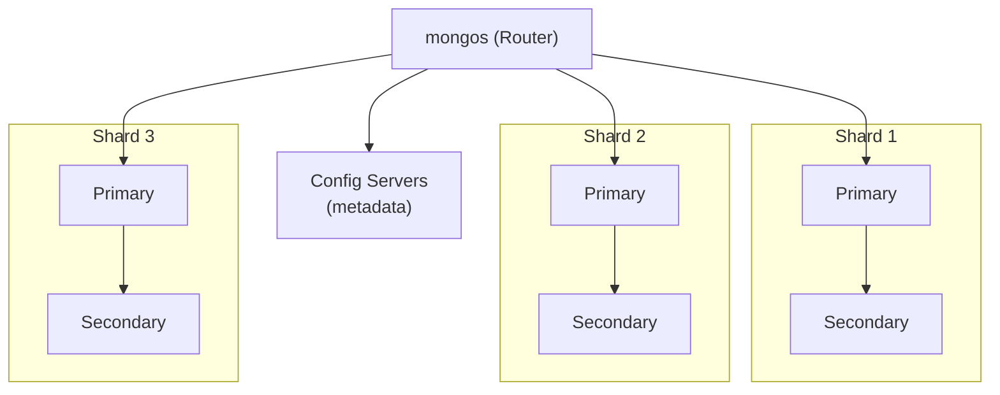

# MongoDB: When and How

**Date:** 2026-04-19 | **Updated:** 2026-04-19
**Tags:** `mongodb` `document-database` `schema-design` `aggregation` `polyglot`

## Table of Contents

- [Summary](#summary)
- [Document Model](#document-model)
  - [Embedding vs Referencing](#embedding-vs-referencing)
- [Schema Design Patterns](#schema-design-patterns)
- [Aggregation Pipeline](#aggregation-pipeline)
- [Transactions](#transactions)
- [Indexes](#indexes)
- [Sharding](#sharding)
- [Change Streams](#change-streams)
- [Replication](#replication)
- [MongoDB vs PostgreSQL JSONB](#mongodb-vs-postgresql-jsonb)
- [Spring Data MongoDB](#spring-data-mongodb)
- [When MongoDB Fits](#when-mongodb-fits)
- [When It Does Not](#when-it-does-not)
- [Related](#related)
- [References](#references)

## Summary

MongoDB is a document database that stores data as flexible BSON documents. It shines when data is naturally nested, schemas evolve rapidly, or access patterns align with document-level reads. This guide covers when MongoDB is the right choice, how to model data correctly, and when PostgreSQL JSONB is enough instead.

## Document Model

### Embedding vs Referencing

The fundamental modeling decision in MongoDB: do you embed related data inside one document or store it separately with references?



#### Embedded Document

```json
{
  "_id": "order:5001",
  "customer": {
    "name": "Alice",
    "email": "alice@example.com"
  },
  "items": [
    { "sku": "WIDGET-A", "qty": 2, "price": 29.99 },
    { "sku": "GADGET-B", "qty": 1, "price": 49.99 }
  ],
  "total": 109.97,
  "status": "shipped",
  "created_at": "2026-04-19T10:30:00Z"
}
```

#### Referenced Document

```json
// orders collection
{
  "_id": "order:5001",
  "customer_id": "cust:1001",
  "item_ids": ["item:9001", "item:9002"],
  "total": 109.97
}

// customers collection
{
  "_id": "cust:1001",
  "name": "Alice",
  "email": "alice@example.com"
}
```

**Rule of thumb**: Embed when data is read together and bounded in size. Reference when data is shared, unbounded, or independently updated.

## Schema Design Patterns

### Subset Pattern

Store frequently accessed fields in the main document; move rarely accessed details to a secondary collection.

```json
// products (hot collection, small documents)
{
  "_id": "prod:1001",
  "name": "Wireless Keyboard",
  "price": 79.99,
  "thumbnail_url": "/images/kb-thumb.jpg",
  "rating": 4.5,
  "review_count": 342
}

// product_details (cold collection, large documents)
{
  "_id": "prod:1001",
  "full_description": "...(2000 words)...",
  "specifications": { ... },
  "all_images": [ ... ]
}
```

### Computed Pattern

Pre-compute expensive calculations and store the result.

```json
{
  "_id": "product:1001",
  "name": "Wireless Keyboard",
  "daily_stats": {
    "total_views": 15234,
    "total_purchases": 342,
    "conversion_rate": 0.0224
  },
  "stats_updated_at": "2026-04-19T00:00:00Z"
}
```

### Bucket Pattern

Group time-series or high-volume data into fixed-size buckets instead of one document per event.

```json
{
  "_id": "sensor:temp:2026-04-19:14",
  "sensor_id": "temp-001",
  "date": "2026-04-19",
  "hour": 14,
  "readings": [
    { "minute": 0, "value": 22.3 },
    { "minute": 1, "value": 22.4 },
    { "minute": 2, "value": 22.1 }
  ],
  "count": 3,
  "sum": 66.8,
  "min": 22.1,
  "max": 22.4
}
```

### Outlier Pattern

Handle documents with abnormally large arrays by splitting them when a threshold is reached.

```json
// Normal document
{
  "_id": "book:1001",
  "title": "MongoDB Patterns",
  "reviews": [ ... ],   // < 100 reviews inline
  "has_overflow": false
}

// Overflow document
{
  "_id": "book:1001:reviews:2",
  "parent_id": "book:1001",
  "reviews": [ ... ]    // Additional reviews
}
```

### Attribute Pattern

When fields vary widely across documents, store them as key-value pairs to enable indexing.

```json
{
  "_id": "product:2001",
  "name": "Running Shoe",
  "attributes": [
    { "key": "color", "value": "blue" },
    { "key": "size", "value": "10" },
    { "key": "weight_grams", "value": 280 }
  ]
}
```

Index on `{ "attributes.key": 1, "attributes.value": 1 }` to query any attribute efficiently.

## Aggregation Pipeline

The aggregation pipeline processes documents through a sequence of stages. Think of it as Unix pipes for data.

```json
// Find top 5 categories by revenue for orders in 2026
db.orders.aggregate([
  { "$match": {
    "created_at": { "$gte": ISODate("2026-01-01"), "$lt": ISODate("2027-01-01") },
    "status": "completed"
  }},
  { "$unwind": "$items" },
  { "$group": {
    "_id": "$items.category",
    "total_revenue": { "$sum": { "$multiply": ["$items.price", "$items.qty"] } },
    "order_count": { "$sum": 1 }
  }},
  { "$sort": { "total_revenue": -1 } },
  { "$limit": 5 },
  { "$project": {
    "category": "$_id",
    "total_revenue": { "$round": ["$total_revenue", 2] },
    "order_count": 1,
    "_id": 0
  }}
])
```

### $lookup (Left Outer Join)

```json
db.orders.aggregate([
  { "$lookup": {
    "from": "customers",
    "localField": "customer_id",
    "foreignField": "_id",
    "as": "customer"
  }},
  { "$unwind": "$customer" },
  { "$project": {
    "order_id": "$_id",
    "customer_name": "$customer.name",
    "total": 1
  }}
])
```

### SQL Comparison

| SQL | MongoDB Aggregation |
|---|---|
| `WHERE` | `$match` |
| `GROUP BY` | `$group` |
| `JOIN` | `$lookup` |
| `SELECT / AS` | `$project` |
| `ORDER BY` | `$sort` |
| `LIMIT` | `$limit` |
| `HAVING` | `$match` (after `$group`) |
| `UNNEST` | `$unwind` |

## Transactions

Since MongoDB 4.0, multi-document ACID transactions are supported across replica set members. Since 4.2, they work across sharded clusters.

```java
try (ClientSession session = mongoClient.startSession()) {
    session.startTransaction(TransactionOptions.builder()
            .readConcern(ReadConcern.SNAPSHOT)
            .writeConcern(WriteConcern.MAJORITY)
            .build());

    try {
        ordersCollection.insertOne(session, newOrder);
        inventoryCollection.updateOne(session,
                eq("sku", "WIDGET-A"),
                inc("quantity", -2));

        session.commitTransaction();
    } catch (Exception e) {
        session.abortTransaction();
        throw e;
    }
}
```

**Limitations**:
- 60-second default timeout for transactions.
- Performance overhead: transactions acquire locks and coordinate across nodes.
- If you need transactions frequently, your data model may need restructuring (embed instead of reference) or you may be better served by a relational database.

## Indexes

| Index Type | Use Case | Example |
|---|---|---|
| Single field | Equality and range queries | `{ "email": 1 }` |
| Compound | Multi-field queries, sort | `{ "status": 1, "created_at": -1 }` |
| Multikey | Array fields | `{ "tags": 1 }` (auto-detected) |
| Text | Full-text search | `{ "title": "text", "description": "text" }` |
| 2dsphere | Geospatial queries | `{ "location": "2dsphere" }` |
| TTL | Auto-expire documents | `{ "expires_at": 1 }, { expireAfterSeconds: 0 }` |
| Wildcard | Dynamic/unknown field names | `{ "metadata.$**": 1 }` |

### Compound Index Field Order (ESR Rule)

Order fields in compound indexes by:
1. **E**quality predicates first
2. **S**ort fields next
3. **R**ange predicates last

```javascript
// Query: status = "active" AND created_at > 2026-01-01 ORDER BY priority DESC
db.tasks.createIndex({ "status": 1, "priority": -1, "created_at": 1 })
//                      Equality       Sort             Range
```

## Sharding



### Shard Key Selection

The shard key determines how data is distributed. A poor shard key causes hot spots.

| Shard Key Strategy | Pros | Cons |
|---|---|---|
| Hashed `_id` | Even distribution | No range queries on `_id` |
| `{ tenant_id: 1, _id: 1 }` | Tenant isolation, range within tenant | Uneven if tenant sizes vary |
| `{ created_at: 1 }` | Time-range queries | Monotonic = hot shard |

**Good shard key properties**: High cardinality, even distribution, supports common query patterns.

### Zone Sharding

Assign data ranges to specific shards for data locality (e.g., EU data stays on EU shards):

```javascript
sh.addShardTag("shard-eu-1", "EU")
sh.addTagRange("orders", { "region": "EU" }, { "region": "EU\uffff" }, "EU")
```

## Change Streams

Real-time notifications for data changes, built on the oplog.

```java
MongoCollection<Document> collection = database.getCollection("orders");

ChangeStreamIterable<Document> changeStream = collection.watch(
    List.of(Aggregates.match(Filters.in("operationType", "insert", "update")))
);

changeStream.forEach(event -> {
    String operationType = event.getOperationType().getValue();
    BsonDocument documentKey = event.getDocumentKey();
    Document fullDocument = event.getFullDocument();

    log.info("Change: {} on {}", operationType, documentKey);
    // Push to Elasticsearch, send notification, etc.
});
```

**Resume tokens** allow restarting from the last processed event after a crash:

```java
BsonDocument resumeToken = event.getResumeToken();
// Persist resumeToken to durable storage
// On restart:
collection.watch().resumeAfter(resumeToken);
```

## Replication

### Replica Sets

A replica set is a group of `mongod` processes that maintain the same dataset. One primary, multiple secondaries.

- **Write concern**: `w: "majority"` ensures writes are acknowledged by most members.
- **Read preference**: `primary` (default), `primaryPreferred`, `secondary`, `secondaryPreferred`, `nearest`.
- **Elections**: If the primary goes down, secondaries elect a new primary (requires majority).

```javascript
// Read from secondary for analytics queries (eventual consistency)
db.orders.find({ status: "completed" }).readPref("secondary")
```

## MongoDB vs PostgreSQL JSONB

| Feature | MongoDB | PostgreSQL JSONB |
|---|---|---|
| Query language | MQL (native document queries) | SQL with `->`, `->>`, `@>` operators |
| Schema validation | Optional JSON Schema | CHECK constraints, `IS JSON` predicate (PG 16+) for type validation; schema validation requires extensions like `pg_jsonschema` |
| Indexing | Wildcard, multikey, compound | GIN, GiST, expression indexes |
| Aggregation | Pipeline (native, optimized) | SQL GROUP BY, window functions |
| Joins | `$lookup` (limited) | Full SQL JOINs |
| Transactions | Multi-doc ACID (4.0+) | Full ACID (native) |
| Horizontal scaling | Native sharding | Citus extension, read replicas |
| Partial updates | `$set`, `$push`, `$pull` (atomic) | `jsonb_set()`, `||` (replace subtree) |
| Full-text search | Text indexes (basic) | tsvector + GIN (decent) |

### When JSONB Is Enough

- You already run PostgreSQL and the document data is < 50% of your schema.
- You need relational JOINs across structured and semi-structured data.
- The document schema is moderately stable (not changing weekly).
- Data volume is < 100M documents.
- You want a single database to maintain.

```sql
-- PostgreSQL JSONB query is quite capable
SELECT id, data->>'name' AS name, data->>'price' AS price
FROM products
WHERE data @> '{"category": "electronics"}'
  AND (data->>'price')::numeric BETWEEN 50 AND 200
ORDER BY (data->>'rating')::numeric DESC
LIMIT 20;

-- GIN index for containment queries
CREATE INDEX idx_products_data ON products USING GIN (data jsonb_path_ops);
```

### When MongoDB Wins

- Schema changes frequently (rapid prototyping, CMS, IoT with variable payloads).
- Access patterns are document-centric (read/write entire documents).
- Need native horizontal sharding beyond Citus.
- Deep nesting with multikey indexes on arrays.

## Spring Data MongoDB

### MongoTemplate

```java
@Service
public class OrderService {

    private final MongoTemplate mongoTemplate;

    public List<Order> findRecentByCustomer(String customerId, int limit) {
        Query query = new Query()
                .addCriteria(Criteria.where("customerId").is(customerId))
                .with(Sort.by(Sort.Direction.DESC, "createdAt"))
                .limit(limit);

        return mongoTemplate.find(query, Order.class);
    }

    public UpdateResult markAsShipped(String orderId) {
        Query query = Query.query(Criteria.where("id").is(orderId));
        Update update = new Update()
                .set("status", "shipped")
                .set("shippedAt", Instant.now());

        return mongoTemplate.updateFirst(query, update, Order.class);
    }
}
```

### ReactiveMongoTemplate

```java
@Service
public class ReactiveOrderService {

    private final ReactiveMongoTemplate reactiveMongoTemplate;

    public Flux<Order> streamActiveOrders() {
        Query query = Query.query(Criteria.where("status").is("processing"));
        return reactiveMongoTemplate.find(query, Order.class);
    }
}
```

### Repository Abstraction

```java
public interface OrderRepository extends MongoRepository<Order, String> {

    List<Order> findByStatusOrderByCreatedAtDesc(String status);

    @Query("{ 'customerId': ?0, 'total': { '$gte': ?1 } }")
    List<Order> findHighValueOrders(String customerId, double minTotal);

    @Aggregation(pipeline = {
        "{ '$match': { 'status': 'completed' } }",
        "{ '$group': { '_id': '$customerId', 'totalSpent': { '$sum': '$total' } } }",
        "{ '$sort': { 'totalSpent': -1 } }",
        "{ '$limit': 10 }"
    })
    List<Document> findTopCustomers();
}
```

## When MongoDB Fits

- **Content management**: Blog posts, product catalogs with variable attributes.
- **IoT and sensor data**: Variable payloads, high write throughput with bucket pattern.
- **Real-time analytics**: Aggregation pipeline for ad-hoc analytics.
- **Rapid prototyping**: Schema evolves weekly without migrations.
- **User profiles and personalization**: Nested preferences, flexible structure.
- **Mobile backends**: Offline sync (MongoDB Realm), flexible schema for evolving mobile apps.

## When It Does Not

- **Complex joins across many collections**: `$lookup` is limited compared to SQL JOINs.
- **Strict referential integrity**: No foreign key constraints.
- **Financial transactions**: While multi-doc transactions exist, relational databases are more mature here.
- **Highly relational data**: If your ER diagram has more than 10 entities with complex relationships, PostgreSQL is more natural.
- **Small dataset with stable schema**: The flexibility overhead is not justified.

## Related

- [./decision-framework.md](./decision-framework.md) -- When to choose MongoDB vs other engines
- [./elasticsearch-deep-dive.md](./elasticsearch-deep-dive.md) -- Elasticsearch for search (complementary to MongoDB)
- [./dynamodb-patterns.md](./dynamodb-patterns.md) -- Alternative document/key-value store

## References

- [MongoDB Manual](https://www.mongodb.com/docs/manual/)
- [MongoDB Schema Design Patterns](https://www.mongodb.com/blog/post/building-with-patterns-a-summary)
- [MongoDB Aggregation Pipeline](https://www.mongodb.com/docs/manual/core/aggregation-pipeline/)
- [Spring Data MongoDB Reference](https://docs.spring.io/spring-data/mongodb/reference/)
- [MongoDB University](https://learn.mongodb.com/)
- [PostgreSQL JSONB Documentation](https://www.postgresql.org/docs/current/datatype-json.html)
