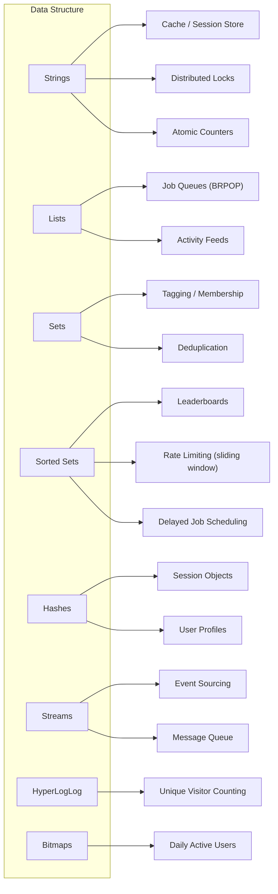
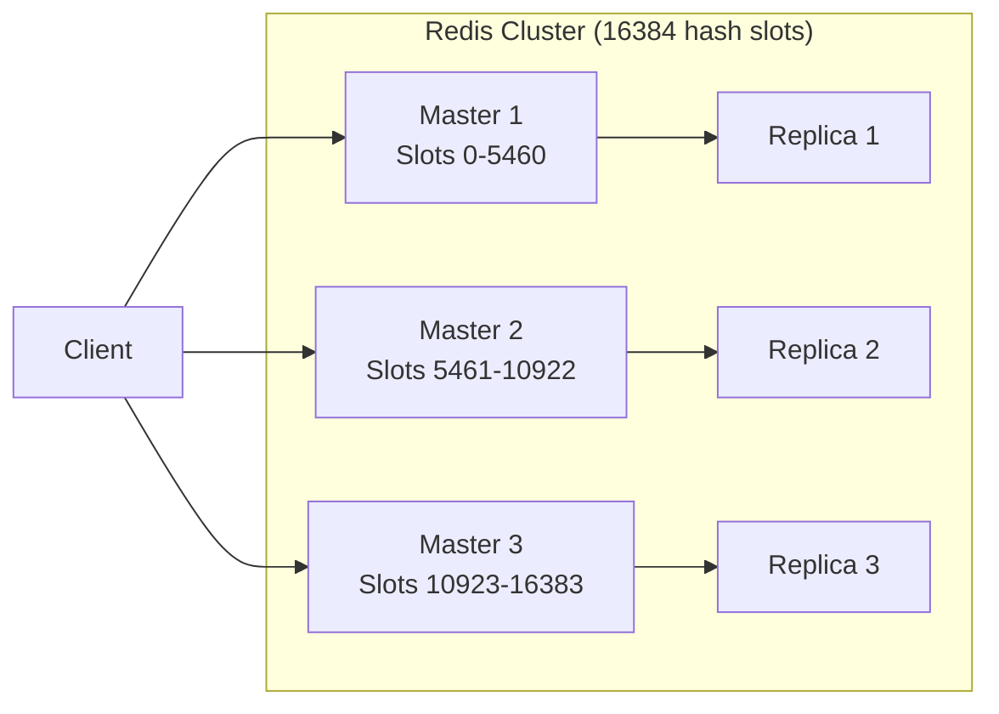

# Redis Beyond Caching

**Date:** 2026-04-19 | **Updated:** 2026-04-19
**Tags:** `redis` `data-structures` `streams` `caching` `pub-sub` `polyglot`

## Table of Contents

- [Summary](#summary)
- [Data Structures Deep Dive](#data-structures-deep-dive)
  - [Strings](#strings)
  - [Lists](#lists)
  - [Sets](#sets)
  - [Sorted Sets](#sorted-sets)
  - [Hashes](#hashes)
  - [Streams](#streams)
  - [HyperLogLog](#hyperloglog)
  - [Bitmaps](#bitmaps)
- [Use Cases by Data Structure](#use-cases-by-data-structure)
- [Redis Streams In Depth](#redis-streams-in-depth)
- [Pub/Sub](#pubsub)
- [Lua Scripting](#lua-scripting)
- [Persistence](#persistence)
- [Redis Cluster](#redis-cluster)
- [Redis Sentinel](#redis-sentinel)
- [Spring Data Redis Integration](#spring-data-redis-integration)
- [Memory Management](#memory-management)
- [When NOT to Use Redis](#when-not-to-use-redis)
- [Related](#related)
- [References](#references)

## Summary

Redis is an in-memory data structure server that goes far beyond simple key-value caching. Its rich data structures enable rate limiting, leaderboards, job queues, real-time messaging, and session management -- all with sub-millisecond latency.

## Data Structures Deep Dive

### Strings

The simplest type -- binary-safe strings up to 512MB. Supports atomic increment/decrement.

```bash
SET user:1001:session "abc123" EX 3600    # Set with 1-hour TTL
INCR api:rate:user:1001                    # Atomic counter
SETNX lock:order:5001 "worker-3"          # Distributed lock primitive
```

### Lists

Doubly-linked lists. O(1) push/pop at head or tail. O(N) for index access.

```bash
LPUSH queue:emails '{"to":"a@b.com","subject":"Welcome"}'
RPOP queue:emails                          # FIFO when LPUSH + RPOP
BRPOP queue:emails 30                      # Blocking pop (30s timeout)
LRANGE queue:emails 0 9                    # Peek at first 10 items
```

### Sets

Unordered collection of unique strings. O(1) membership check.

```bash
SADD product:1001:tags "electronics" "sale" "featured"
SISMEMBER product:1001:tags "sale"         # O(1) membership test
SINTER product:1001:tags product:1002:tags # Intersection
SRANDMEMBER product:1001:tags 2            # Random sampling
```

### Sorted Sets

Sets where each member has a floating-point score. Ordered by score. O(log N) insert and rank lookup.

```bash
ZADD leaderboard 1500 "player:alice" 1200 "player:bob" 1800 "player:charlie"
ZREVRANGE leaderboard 0 9 WITHSCORES      # Top 10
ZRANK leaderboard "player:bob"             # Rank of a specific player
ZRANGEBYSCORE leaderboard 1000 1500        # Players in score range
```

### Hashes

Field-value maps attached to a key. Efficient for representing objects.

```bash
HSET user:1001 name "Alice" email "alice@example.com" role "admin"
HGET user:1001 email
HINCRBY user:1001 login_count 1
HGETALL user:1001
```

### Streams

Append-only log with consumer groups. Redis's answer to Kafka-like messaging.

```bash
XADD events:orders * action "created" order_id "5001" amount "99.50"
XLEN events:orders
XRANGE events:orders - + COUNT 10
```

### HyperLogLog

Probabilistic cardinality estimation. Fixed 12KB per key regardless of element count. ~0.81% standard error.

```bash
PFADD unique:visitors:2026-04-19 "user:1001" "user:1002" "user:1001"
PFCOUNT unique:visitors:2026-04-19         # Approximate unique count
PFMERGE unique:visitors:week unique:visitors:2026-04-13 unique:visitors:2026-04-14
```

### Bitmaps

Bit-level operations on strings. Extremely space-efficient for boolean state over large populations.

```bash
SETBIT user:active:2026-04-19 1001 1       # User 1001 was active today
GETBIT user:active:2026-04-19 1001         # Check if active
BITCOUNT user:active:2026-04-19            # Total active users today
BITOP AND active:both day1 day2            # Users active on both days
```

## Use Cases by Data Structure



### Rate Limiting with Sorted Sets (Sliding Window)

```java
public boolean isAllowed(String userId, int maxRequests, Duration window) {
    String key = "ratelimit:" + userId;
    long now = Instant.now().toEpochMilli();
    long windowStart = now - window.toMillis();

    redisTemplate.executePipelined((RedisCallback<Object>) connection -> {
        // Remove entries outside the window
        connection.zRemRangeByScore(key.getBytes(), 0, windowStart);
        // Add current request
        connection.zAdd(key.getBytes(), now, String.valueOf(now).getBytes());
        // Set TTL on the key
        connection.expire(key.getBytes(), window.getSeconds());
        return null;
    });

    Long count = redisTemplate.opsForZSet().size(key);
    return count != null && count <= maxRequests;
}
```

## Redis Streams In Depth

### Consumer Groups

Consumer groups allow multiple consumers to cooperatively process a stream, with at-least-once delivery semantics within the group (messages are delivered to one consumer but can be redelivered via XCLAIM/XAUTOCLAIM if not acknowledged).

```bash
# Create consumer group starting from the beginning
XGROUP CREATE events:orders order-processors 0

# Consumer reads pending messages
XREADGROUP GROUP order-processors worker-1 COUNT 10 BLOCK 5000 STREAMS events:orders >

# Acknowledge processing
XACK events:orders order-processors 1681234567890-0

# Check pending (unacknowledged) entries
XPENDING events:orders order-processors - + 10
```

### Streams vs Kafka

| Feature | Redis Streams | Kafka |
|---|---|---|
| Persistence | Memory + optional disk | Disk-first |
| Throughput | ~100K msg/s per node | Millions msg/s per partition |
| Consumer groups | Yes | Yes |
| Message retention | Memory-bounded (MAXLEN/MINID) | Time/size-based, unlimited |
| Ordering | Per-stream (single node) | Per-partition |
| Best for | Lightweight event bus, < 100K msg/s | High-throughput, durable event backbone |

**Use Redis Streams when**: You already have Redis, throughput is moderate, and you want simpler operations.
**Use Kafka when**: You need durable, high-throughput event streaming across multiple services.

## Pub/Sub

Fire-and-forget messaging. Messages are not persisted -- if no subscriber is listening, the message is lost.

```bash
# Subscriber
SUBSCRIBE notifications:user:1001
PSUBSCRIBE notifications:user:*           # Pattern subscription

# Publisher
PUBLISH notifications:user:1001 '{"type":"order_shipped","order_id":"5001"}'
```

**Key limitation**: No message durability. If the subscriber disconnects, messages published during the gap are lost. For durable messaging, use Streams instead.

## Lua Scripting

Lua scripts execute atomically on the Redis server. Essential for multi-step operations that must not be interleaved.

```bash
# Rate limiter as atomic Lua script
EVAL "
  local key = KEYS[1]
  local limit = tonumber(ARGV[1])
  local window = tonumber(ARGV[2])
  local current = redis.call('INCR', key)
  if current == 1 then
    redis.call('EXPIRE', key, window)
  end
  if current > limit then
    return 0
  end
  return 1
" 1 "ratelimit:user:1001" 100 60
```

Cache the script with `EVALSHA` to avoid resending the script body on every call:

```bash
SCRIPT LOAD "local key = KEYS[1] ..."     # Returns SHA1
EVALSHA <sha1> 1 "ratelimit:user:1001" 100 60
```

## Persistence

### RDB Snapshots

Point-in-time snapshots written to disk at configured intervals. Fast recovery but data loss between snapshots.

```text
save 900 1      # Snapshot if >= 1 key changed in 900 seconds
save 300 10     # Snapshot if >= 10 keys changed in 300 seconds
save 60 10000   # Snapshot if >= 10000 keys changed in 60 seconds
```

### AOF (Append-Only File)

Logs every write operation. More durable but larger files and slower recovery.

```text
appendonly yes
appendfsync everysec    # Flush AOF to disk every second (recommended)
# appendfsync always    # Every write -- safest, slowest
# appendfsync no        # OS decides -- fastest, least safe
```

### Hybrid Mode (RDB + AOF)

```text
aof-use-rdb-preamble yes
```

AOF file starts with an RDB snapshot followed by incremental AOF commands. Combines fast recovery (RDB) with minimal data loss (AOF).

**Recommendation**: Use hybrid mode for production. Pure RDB is acceptable for cache-only deployments.

## Redis Cluster



- **16384 hash slots** distributed across master nodes.
- Client computes `CRC16(key) % 16384` to determine the target node.
- **MOVED redirect**: Client receives a redirect if it hits the wrong node; smart clients cache the slot map.
- **Multi-key operations** only work when all keys hash to the same slot. Use hash tags (`{user:1001}.profile`, `{user:1001}.session`) to co-locate keys.

### Resharding

```bash
redis-cli --cluster reshard <node-ip>:6379
```

Resharding moves hash slots between nodes. During migration, the source node returns `ASK` redirects for keys that have already moved.

## Redis Sentinel

High availability without the complexity of Cluster. Sentinel monitors master/replica sets and performs automatic failover.

```text
sentinel monitor mymaster 10.0.1.1 6379 2   # Quorum of 2 sentinels
sentinel down-after-milliseconds mymaster 5000
sentinel failover-timeout mymaster 60000
```

**Use Sentinel when**: You need HA but your dataset fits on a single node (< 25GB typical).
**Use Cluster when**: You need to shard data across multiple nodes for capacity or throughput.

## Spring Data Redis Integration

### RedisTemplate Configuration

```java
@Configuration
public class RedisConfig {

    @Bean
    public LettuceConnectionFactory redisConnectionFactory() {
        RedisStandaloneConfiguration config = new RedisStandaloneConfiguration("localhost", 6379);
        return new LettuceConnectionFactory(config);
    }

    @Bean
    public RedisTemplate<String, Object> redisTemplate(LettuceConnectionFactory connectionFactory) {
        RedisTemplate<String, Object> template = new RedisTemplate<>();
        template.setConnectionFactory(connectionFactory);
        template.setKeySerializer(new StringRedisSerializer());
        template.setValueSerializer(new GenericJackson2JsonRedisSerializer());
        return template;
    }
}
```

### @Cacheable Integration

```java
@Service
public class ProductService {

    @Cacheable(value = "products", key = "#id", unless = "#result == null")
    public Product findById(Long id) {
        return productRepository.findById(id).orElse(null);
    }

    @CacheEvict(value = "products", key = "#product.id")
    public Product update(Product product) {
        return productRepository.save(product);
    }

    @CachePut(value = "products", key = "#product.id")
    public Product create(Product product) {
        return productRepository.save(product);
    }
}
```

### ReactiveRedisTemplate

```java
@Service
public class ReactiveSessionService {

    private final ReactiveRedisTemplate<String, String> reactiveRedisTemplate;

    public Mono<Boolean> saveSession(String sessionId, String data, Duration ttl) {
        return reactiveRedisTemplate.opsForValue()
                .set("session:" + sessionId, data, ttl);
    }

    public Mono<String> getSession(String sessionId) {
        return reactiveRedisTemplate.opsForValue()
                .get("session:" + sessionId);
    }
}
```

## Memory Management

### Maxmemory Policies

When Redis reaches `maxmemory`, the eviction policy determines which keys to remove:

| Policy | Behavior |
|---|---|
| `noeviction` | Return errors on write (default) |
| `allkeys-lru` | Evict least recently used keys -- **best for cache** |
| `allkeys-lfu` | Evict least frequently used keys |
| `volatile-lru` | Evict LRU keys with TTL set |
| `volatile-ttl` | Evict keys with shortest TTL remaining |
| `allkeys-random` | Evict random keys |

```text
maxmemory 4gb
maxmemory-policy allkeys-lfu
```

**Recommendation**: Use `allkeys-lfu` for general caching. Use `volatile-ttl` when mixing persistent and cache data in the same instance (not ideal but common).

### Memory Optimization Tips

- Use hashes for small objects (ziplist encoding under `hash-max-ziplist-entries`).
- Set TTLs aggressively on cache keys.
- Monitor with `INFO memory` and `MEMORY USAGE <key>`.
- Use `OBJECT ENCODING <key>` to verify compact encodings.

## When NOT to Use Redis

| Scenario | Why Not | Better Alternative |
|---|---|---|
| Dataset > available RAM | Redis is memory-bound | PostgreSQL, MongoDB, DynamoDB |
| Complex queries (joins, aggregations) | No query engine | PostgreSQL, ClickHouse |
| Durability-critical data (financial) | Memory-first design | PostgreSQL with WAL |
| Full-text search | No inverted index | Elasticsearch |
| Large binary objects (images, files) | Wastes expensive memory | S3, filesystem |
| Primary source of truth | Risk of data loss on failure | Relational database |

## Related

- [./decision-framework.md](./decision-framework.md) -- When to choose Redis vs other engines
- [./elasticsearch-deep-dive.md](./elasticsearch-deep-dive.md) -- Search engine for complementary use cases
- [./dynamodb-patterns.md](./dynamodb-patterns.md) -- Alternative key-value store at scale

## References

- [Redis Documentation](https://redis.io/docs/)
- [Redis Streams Introduction](https://redis.io/docs/latest/develop/data-types/streams/)
- [Redis Cluster Specification](https://redis.io/docs/latest/operate/oss_and_stack/reference/cluster-spec/)
- [Spring Data Redis Reference](https://docs.spring.io/spring-data/redis/reference/)
- [Redis Persistence Deep Dive](https://redis.io/docs/latest/operate/oss_and_stack/management/persistence/)
- [Redis University](https://redis.io/university/)
