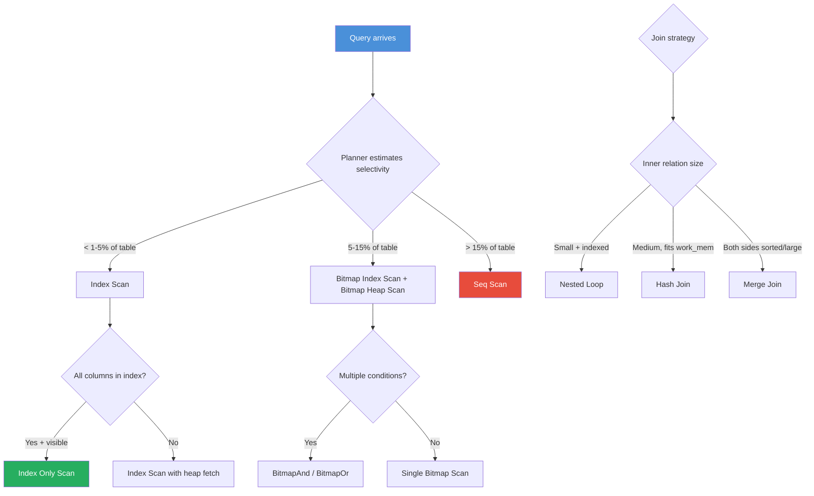

# Practical Guide to EXPLAIN ANALYZE in PostgreSQL

**Date:** 2026-04-19
**Tags:** postgresql, explain, query-plan, performance, optimization

## Table of Contents

- [Summary](#summary)
- [EXPLAIN Variants](#explain-variants)
  - [EXPLAIN (Plan Only)](#explain-plan-only)
  - [EXPLAIN ANALYZE (Actual Execution)](#explain-analyze-actual-execution)
  - [EXPLAIN with BUFFERS and FORMAT](#explain-with-buffers-and-format)
- [Reading the Output](#reading-the-output)
  - [Cost Model](#cost-model)
  - [Actual Time, Rows, and Loops](#actual-time-rows-and-loops)
  - [Buffers Breakdown](#buffers-breakdown)
- [Scan Node Types](#scan-node-types)
  - [Seq Scan](#seq-scan)
  - [Index Scan](#index-scan)
  - [Index Only Scan](#index-only-scan)
  - [Bitmap Index Scan + Bitmap Heap Scan](#bitmap-index-scan--bitmap-heap-scan)
- [Join Node Types](#join-node-types)
  - [Nested Loop](#nested-loop)
  - [Hash Join](#hash-join)
  - [Merge Join](#merge-join)
- [Aggregate and Sort Nodes](#aggregate-and-sort-nodes)
  - [HashAggregate](#hashaggregate)
  - [GroupAggregate](#groupaggregate)
  - [Sort](#sort)
- [Walkthrough: Diagnosing a Slow Query](#walkthrough-diagnosing-a-slow-query)
  - [The Slow Query](#the-slow-query)
  - [Reading the Plan](#reading-the-plan)
  - [Identifying the Problem](#identifying-the-problem)
  - [Applying the Fix](#applying-the-fix)
- [Common Red Flags](#common-red-flags)
- [Tools and Extensions](#tools-and-extensions)
- [Query Plan Decision Flow](#query-plan-decision-flow)
- [References](#references)

## Summary

`EXPLAIN ANALYZE` is the single most important tool for understanding why a PostgreSQL query is slow. This guide covers every variant of the command, how to read each node type in the output tree, and a complete walkthrough of diagnosing and fixing a real performance problem.

## EXPLAIN Variants

### EXPLAIN (Plan Only)

Shows the planner's estimated execution plan without running the query.

```sql
EXPLAIN
SELECT o.id, o.total, c.name
FROM orders o
JOIN customers c ON c.id = o.customer_id
WHERE o.status = 'shipped'
  AND o.created_at > '2026-01-01';
```

```text
Hash Join  (cost=12.50..245.80 rows=120 width=52)
  Hash Cond: (o.customer_id = c.id)
  ->  Seq Scan on orders o  (cost=0.00..230.00 rows=120 width=24)
        Filter: ((status = 'shipped') AND (created_at > '2026-01-01'))
  ->  Hash  (cost=10.00..10.00 rows=200 width=36)
        ->  Seq Scan on customers c  (cost=0.00..10.00 rows=200 width=36)
```

Use this for quick plan checks during development. Safe to run on production since it never executes the query.

### EXPLAIN ANALYZE (Actual Execution)

Runs the query and reports actual times and row counts alongside the estimates.

```sql
EXPLAIN ANALYZE
SELECT o.id, o.total, c.name
FROM orders o
JOIN customers c ON c.id = o.customer_id
WHERE o.status = 'shipped'
  AND o.created_at > '2026-01-01';
```

```text
Hash Join  (cost=12.50..245.80 rows=120 width=52)
           (actual time=0.35..4.82 rows=98 loops=1)
  Hash Cond: (o.customer_id = c.id)
  ->  Seq Scan on orders o  (cost=0.00..230.00 rows=120 width=24)
                             (actual time=0.02..4.10 rows=98 loops=1)
        Filter: ((status = 'shipped') AND (created_at > '2026-01-01'))
        Rows Removed by Filter: 49902
  ->  Hash  (cost=10.00..10.00 rows=200 width=36)
            (actual time=0.25..0.25 rows=200 loops=1)
        Buckets: 256  Batches: 1  Memory Usage: 15kB
        ->  Seq Scan on customers c  (cost=0.00..10.00 rows=200 width=36)
                                      (actual time=0.01..0.12 rows=200 loops=1)
Planning Time: 0.18 ms
Execution Time: 5.01 ms
```

**Warning:** `EXPLAIN ANALYZE` actually executes the statement. Wrap DML in a transaction and roll back:

```sql
BEGIN;
EXPLAIN ANALYZE DELETE FROM orders WHERE status = 'cancelled';
ROLLBACK;
```

### EXPLAIN with BUFFERS and FORMAT

The most informative variant for I/O analysis:

```sql
EXPLAIN (ANALYZE, BUFFERS, FORMAT TEXT)
SELECT ...;
```

For programmatic consumption or dalibo.com visualization:

```sql
EXPLAIN (ANALYZE, BUFFERS, FORMAT JSON)
SELECT ...;
```

Other useful options:

```sql
-- Show WAL generation stats (PG 13+)
EXPLAIN (ANALYZE, BUFFERS, WAL)
INSERT INTO orders ...;

-- Timing off for lower overhead when you only need row counts
EXPLAIN (ANALYZE, BUFFERS, TIMING OFF)
SELECT ...;

-- Settings that differ from defaults
EXPLAIN (ANALYZE, SETTINGS)
SELECT ...;
```

## Reading the Output

### Cost Model

```text
Seq Scan on orders  (cost=0.00..230.00 rows=120 width=24)
                      ^^^^^    ^^^^^^  ^^^^^^^^ ^^^^^^^^
                      |        |       |        bytes per row
                      |        |       estimated rows
                      |        total cost (all rows)
                      startup cost (first row)
```

- **Startup cost** -- work before the first row can be returned (e.g., sorting, hashing).
- **Total cost** -- estimated cost to return all rows. Measured in arbitrary "cost units" anchored to `seq_page_cost = 1.0`.
- **Rows** -- planner's estimate. Compare this to `actual rows` to spot stale statistics.
- **Width** -- average row size in bytes.

### Actual Time, Rows, and Loops

```text
->  Index Scan using idx_orders_status on orders
      (cost=0.42..85.30 rows=120 width=24)
      (actual time=0.03..1.20 rows=98 loops=1)
```

- **actual time** -- `startup..total` in milliseconds for one loop iteration.
- **rows** -- actual rows returned per loop.
- **loops** -- number of times this node executed (common in nested loops).

**Total time for a node = actual total time x loops.**

If you see `actual time=0.01..0.05 rows=1 loops=5000`, the real cost is `0.05 * 5000 = 250ms`, not 0.05ms.

### Buffers Breakdown

```text
Buffers: shared hit=450 read=12 dirtied=0 written=0
         temp read=0 written=0
```

| Counter | Meaning |
|---------|---------|
| shared hit | Pages found in shared_buffers (fast) |
| shared read | Pages fetched from OS / disk (slow) |
| shared dirtied | Pages modified in shared_buffers |
| shared written | Pages written back to disk during query |
| temp read/written | Pages in temporary files (sorts/hashes that spill to disk) |

High `shared read` = cold cache or working set larger than `shared_buffers`.
Any `temp written` = the operation exceeded `work_mem` and spilled to disk.

## Scan Node Types

### Seq Scan

Reads every row in the table, applying the filter as it goes.

```text
Seq Scan on orders  (cost=0.00..1250.00 rows=50000 width=48)
  Filter: (status = 'shipped')
  Rows Removed by Filter: 450000
```

Acceptable for small tables or when selecting a large percentage of rows. A red flag on tables with millions of rows when the filter is selective.

### Index Scan

Traverses a B-tree index to find matching rows, then fetches the heap tuple for each one.

```text
Index Scan using idx_orders_status on orders
  (cost=0.42..85.30 rows=120 width=48)
  Index Cond: (status = 'shipped')
```

Best when selectivity is high (returning a small fraction of rows). Each row requires a heap fetch, so it becomes less efficient as selectivity drops.

### Index Only Scan

Like Index Scan, but all required columns are in the index, so the heap fetch is skipped (if the visibility map confirms all-visible).

```text
Index Only Scan using idx_orders_status_total on orders
  (cost=0.42..35.10 rows=120 width=12)
  Index Cond: (status = 'shipped')
  Heap Fetches: 3
```

`Heap Fetches` close to 0 means the visibility map is up to date (frequent `VACUUM` helps).

### Bitmap Index Scan + Bitmap Heap Scan

A two-phase approach: build a bitmap of matching pages from the index, then fetch those pages in physical order.

```text
Bitmap Heap Scan on orders  (cost=5.20..210.50 rows=500 width=48)
  Recheck Cond: (status = 'shipped')
  ->  Bitmap Index Scan on idx_orders_status
        (cost=0.00..5.10 rows=500 width=0)
        Index Cond: (status = 'shipped')
```

PostgreSQL picks this when selectivity is moderate -- too many rows for a plain index scan, but few enough that a full seq scan is wasteful. Multiple bitmap scans can be combined with BitmapAnd / BitmapOr for multi-column filtering.

## Join Node Types

### Nested Loop

For each row in the outer relation, scan the inner relation.

```text
Nested Loop  (cost=0.42..450.80 rows=120 width=60)
  ->  Seq Scan on customers c  (cost=0.00..10.00 rows=200 width=36)
  ->  Index Scan using idx_orders_customer on orders o
        (cost=0.42..2.15 rows=1 width=24)
        Index Cond: (customer_id = c.id)
```

Best for small outer relations or highly selective inner lookups. Watch out for `loops=50000` on the inner side -- that signals O(N*M) behavior.

### Hash Join

Builds a hash table from the smaller relation, then probes it with each row from the larger relation.

```text
Hash Join  (cost=12.50..245.80 rows=120 width=52)
  Hash Cond: (o.customer_id = c.id)
  ->  Seq Scan on orders o  ...
  ->  Hash  (cost=10.00..10.00 rows=200 width=36)
        Buckets: 256  Batches: 1  Memory Usage: 15kB
        ->  Seq Scan on customers c  ...
```

`Batches > 1` means the hash table exceeded `work_mem` and spilled to disk. Increase `work_mem` (per session) or reduce the hash input.

### Merge Join

Both inputs must be sorted on the join key. Walks through both in tandem.

```text
Merge Join  (cost=850.00..1100.00 rows=5000 width=60)
  Merge Cond: (o.customer_id = c.id)
  ->  Sort  (cost=550.00..560.00 rows=50000 width=24)
        Sort Key: o.customer_id
        ->  Seq Scan on orders o  ...
  ->  Sort  (cost=300.00..305.00 rows=200 width=36)
        Sort Key: c.id
        ->  Seq Scan on customers c  ...
```

Efficient for large relations that are already sorted (or have matching indexes). If you see explicit Sort nodes feeding a Merge Join, consider whether a Hash Join would be cheaper.

## Aggregate and Sort Nodes

### HashAggregate

Builds a hash table keyed by the GROUP BY columns, accumulating aggregates.

```text
HashAggregate  (cost=350.00..352.00 rows=200 width=12)
  Group Key: customer_id
  Batches: 1  Memory Usage: 40kB
  ->  Seq Scan on orders  ...
```

Fast for moderate group counts. If `Batches > 1`, the hash table spilled.

### GroupAggregate

Requires sorted input. Scans through groups sequentially.

```text
GroupAggregate  (cost=0.42..290.00 rows=200 width=12)
  Group Key: customer_id
  ->  Index Scan using idx_orders_customer on orders  ...
```

Preferred when the input is already sorted (from an index or prior sort), avoiding a separate hash table.

### Sort

```text
Sort  (cost=1200.00..1250.00 rows=50000 width=48)
  Sort Key: created_at DESC
  Sort Method: external merge  Disk: 4096kB
  ->  Seq Scan on orders  ...
```

`Sort Method: quicksort Memory: 3500kB` -- fits in `work_mem`, good.
`Sort Method: external merge Disk: 4096kB` -- spilled to disk, slow. Increase `work_mem` or add an index that provides the sort order.

## Walkthrough: Diagnosing a Slow Query

### The Slow Query

An API endpoint that lists recent high-value orders with customer info takes 2.3 seconds:

```sql
SELECT o.id, o.total, o.created_at, c.name, c.email
FROM orders o
JOIN customers c ON c.id = o.customer_id
WHERE o.status = 'shipped'
  AND o.total > 500
  AND o.created_at > NOW() - INTERVAL '30 days'
ORDER BY o.created_at DESC
LIMIT 50;
```

### Reading the Plan

```sql
EXPLAIN (ANALYZE, BUFFERS)
SELECT o.id, o.total, o.created_at, c.name, c.email
FROM orders o
JOIN customers c ON c.id = o.customer_id
WHERE o.status = 'shipped'
  AND o.total > 500
  AND o.created_at > NOW() - INTERVAL '30 days'
ORDER BY o.created_at DESC
LIMIT 50;
```

```text
Limit  (cost=12500.00..12500.12 rows=50 width=72)
       (actual time=2280.50..2280.55 rows=50 loops=1)
  Buffers: shared hit=1200 read=48500
  ->  Sort  (cost=12500.00..12530.00 rows=12000 width=72)
            (actual time=2280.48..2280.50 rows=50 loops=1)
        Sort Key: o.created_at DESC
        Sort Method: top-N heapsort  Memory: 30kB
        Buffers: shared hit=1200 read=48500
        ->  Hash Join  (cost=12.50..11800.00 rows=12000 width=72)
                        (actual time=5.20..2250.00 rows=11856 loops=1)
              Hash Cond: (o.customer_id = c.id)
              Buffers: shared hit=1200 read=48500
              ->  Seq Scan on orders o  (cost=0.00..11500.00 rows=12000 width=36)
                                         (actual time=0.05..2200.00 rows=11856 loops=1)
                    Filter: ((status = 'shipped') AND (total > 500)
                             AND (created_at > ...))
                    Rows Removed by Filter: 1988144
                    Buffers: shared hit=1000 read=48500
              ->  Hash  (cost=10.00..10.00 rows=200 width=36)
                        (actual time=0.30..0.30 rows=200 loops=1)
                    Buckets: 256  Batches: 1  Memory Usage: 15kB
                    Buffers: shared hit=200
                    ->  Seq Scan on customers c  (cost=0.00..10.00 rows=200 width=36)
                                                  (actual time=0.01..0.15 rows=200 loops=1)
                          Buffers: shared hit=200
Planning Time: 0.45 ms
Execution Time: 2281.10 ms
```

### Identifying the Problem

Three problems stand out:

1. **Seq Scan on orders (2M rows):** Reads the entire `orders` table (48,500 pages from disk). The filter removes 1,988,144 rows to keep only 11,856. This is extremely wasteful.
2. **High `shared read`:** 48,500 pages read from disk on the orders scan -- the table is not cached and is being fully scanned.
3. **Sort after scan:** Although the Sort itself is fast (top-N heapsort), it only runs after the expensive Seq Scan completes.

### Applying the Fix

Create a composite index that covers all three WHERE predicates and the sort order:

```sql
CREATE INDEX idx_orders_status_created_total
ON orders (status, created_at DESC, total)
WHERE status = 'shipped';
```

This is a partial index (only `shipped` rows), sorted by `created_at DESC` so the `ORDER BY ... LIMIT` can ride the index directly.

After creating the index and running `ANALYZE orders;`:

```text
Limit  (cost=0.56..52.30 rows=50 width=72)
       (actual time=0.08..0.95 rows=50 loops=1)
  Buffers: shared hit=180
  ->  Nested Loop  (cost=0.56..12400.00 rows=12000 width=72)
                    (actual time=0.07..0.92 rows=50 loops=1)
        Buffers: shared hit=180
        ->  Index Scan using idx_orders_status_created_total on orders o
              (cost=0.42..8500.00 rows=12000 width=36)
              (actual time=0.04..0.55 rows=50 loops=1)
              Index Cond: ((status = 'shipped') AND (total > 500)
                           AND (created_at > ...))
              Buffers: shared hit=30
        ->  Index Scan using customers_pkey on customers c
              (cost=0.14..0.32 rows=1 width=36)
              (actual time=0.005..0.006 rows=1 loops=50)
              Index Cond: (id = o.customer_id)
              Buffers: shared hit=150
Planning Time: 0.35 ms
Execution Time: 1.10 ms
```

**Result:** 2281ms down to 1.1ms. The Seq Scan is replaced by an Index Scan that stops after 50 rows (thanks to `LIMIT` + matching sort order). Shared reads dropped from 48,500 to 0.

## Common Red Flags

| Red Flag | What It Means | Fix |
|----------|---------------|-----|
| `Rows Removed by Filter: 1000000+` | Seq Scan filtering out vast majority of rows | Add an index matching the WHERE clause |
| `actual rows=50000` vs `rows=100` | Row estimate wildly off | Run `ANALYZE`, increase `default_statistics_target`, or create extended statistics |
| `Sort Method: external merge Disk: NNkB` | Sort spilled to disk | Increase `work_mem` or add an index providing the sort order |
| `Batches: 4` on Hash node | Hash join spilled to disk | Increase `work_mem` for the session |
| `loops=50000` on inner side of Nested Loop | 50k index lookups | Consider restructuring to Hash Join, or batch the operation |
| `Heap Fetches: 45000` on Index Only Scan | Visibility map stale | Run `VACUUM` on the table |
| `temp read=NNN written=NNN` | Work spilled to temp files | Increase `work_mem` |
| `Buffers: shared read=50000` | Large I/O, cold cache | Check `shared_buffers` sizing; add indexes to reduce pages touched |

## Tools and Extensions

**pgAdmin Visual Explain** -- Graphical plan viewer built into pgAdmin 4. Highlights slow nodes and shows row flow widths.

**explain.dalibo.com** -- Paste `EXPLAIN (ANALYZE, BUFFERS, FORMAT JSON)` output for an interactive visual plan with timing annotations. No installation required.

**auto_explain extension** -- Logs plans for slow queries automatically:

```sql
-- postgresql.conf or ALTER SYSTEM
LOAD 'auto_explain';
SET auto_explain.log_min_duration = '500ms';
SET auto_explain.log_analyze = true;
SET auto_explain.log_buffers = true;
SET auto_explain.log_format = 'json';
```

**pg_stat_statements** -- Tracks aggregate statistics for all normalized queries. Identify the most time-consuming query patterns:

```sql
SELECT query,
       calls,
       mean_exec_time::numeric(10,2) AS avg_ms,
       total_exec_time::numeric(10,2) AS total_ms,
       rows
FROM pg_stat_statements
ORDER BY total_exec_time DESC
LIMIT 20;
```

## Query Plan Decision Flow



## References

- [PostgreSQL EXPLAIN Documentation](https://www.postgresql.org/docs/current/sql-explain.html)
- [Using EXPLAIN](https://www.postgresql.org/docs/current/using-explain.html)
- [Planner Cost Constants](https://www.postgresql.org/docs/current/runtime-config-query.html#RUNTIME-CONFIG-QUERY-CONSTANTS)
- [auto_explain Module](https://www.postgresql.org/docs/current/auto-explain.html)
- [pg_stat_statements](https://www.postgresql.org/docs/current/pgstatstatements.html)
- [explain.dalibo.com](https://explain.dalibo.com/)
