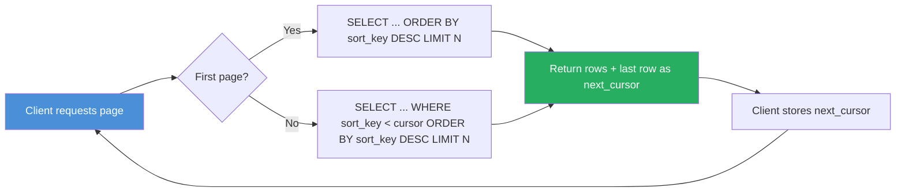
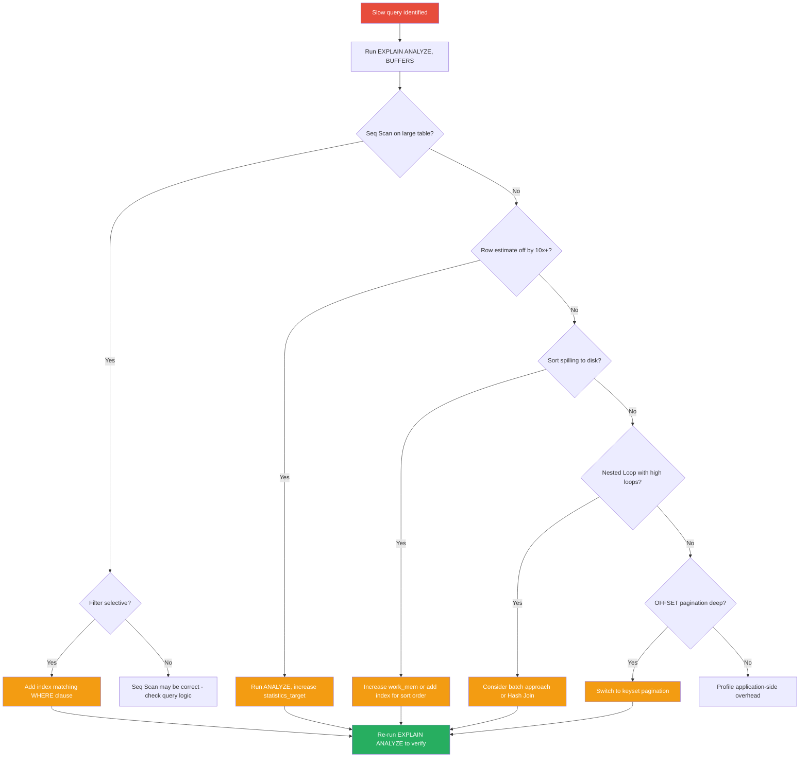

# PostgreSQL Query Optimization Patterns

**Date:** 2026-04-19
**Tags:** postgresql, optimization, queries, performance, patterns

## Table of Contents

- [Summary](#summary)
- [N+1 at the Database Level](#n1-at-the-database-level)
- [JOIN Optimization](#join-optimization)
  - [Choosing Join Types](#choosing-join-types)
  - [Join Order and Hints](#join-order-and-hints)
- [Subquery vs JOIN vs CTE](#subquery-vs-join-vs-cte)
  - [Correlated Subqueries](#correlated-subqueries)
  - [CTEs: Optimization Fence vs Inline](#ctes-optimization-fence-vs-inline)
  - [When CTEs Win](#when-ctes-win)
- [Window Functions](#window-functions)
  - [ROW_NUMBER for Top-N per Group](#row_number-for-top-n-per-group)
  - [LAG/LEAD for Row Comparisons](#laglead-for-row-comparisons)
  - [Running Totals with SUM OVER](#running-totals-with-sum-over)
- [Materialized Views](#materialized-views)
- [Partial Indexes](#partial-indexes)
- [Expression Indexes](#expression-indexes)
- [UNION ALL vs UNION](#union-all-vs-union)
- [EXISTS vs IN vs JOIN for Semi-Joins](#exists-vs-in-vs-join-for-semi-joins)
- [Pagination Patterns](#pagination-patterns)
  - [OFFSET/LIMIT Problems](#offsetlimit-problems)
  - [Keyset Pagination](#keyset-pagination)
- [Batch Operations](#batch-operations)
  - [INSERT ON CONFLICT (Upsert)](#insert-on-conflict-upsert)
  - [COPY for Bulk Loading](#copy-for-bulk-loading)
  - [unnest() for Batch Lookups](#unnest-for-batch-lookups)
- [Statistics Tuning](#statistics-tuning)
  - [Column Statistics Target](#column-statistics-target)
  - [Multi-Column Statistics](#multi-column-statistics)
- [Optimization Decision Flow](#optimization-decision-flow)
- [References](#references)

## Summary

This document catalogs systematic, reusable patterns for optimizing PostgreSQL queries. Each pattern includes the problem scenario, the solution with SQL examples, and guidance on when the pattern applies. These patterns operate at the database level and complement (rather than duplicate) JPA/Hibernate-level tuning you already know.

## N+1 at the Database Level

You know the JPA N+1 problem: lazy-loading a collection fires N extra SELECTs. The database-level equivalent occurs in PL/pgSQL functions, triggers, or poorly structured views.

**Problem:** A function iterates over rows and runs a query per row.

```sql
-- Pseudocode inside a PL/pgSQL function
FOR rec IN SELECT id FROM orders WHERE status = 'pending' LOOP
    SELECT name INTO v_name FROM customers WHERE id = rec.customer_id;
    -- ... process ...
END LOOP;
```

**Fix:** Replace the loop with a single JOIN.

```sql
SELECT o.id, c.name
FROM orders o
JOIN customers c ON c.id = o.customer_id
WHERE o.status = 'pending';
```

**Database-level N+1 also appears in:**
- Recursive CTEs that query a table per recursion level instead of batching
- Triggers that run a SELECT inside an `AFTER INSERT FOR EACH ROW` trigger (consider `FOR EACH STATEMENT` with transition tables instead)
- Views calling `set-returning functions` per row

## JOIN Optimization

### Choosing Join Types

PostgreSQL picks the join algorithm, but understanding them helps you shape queries so the planner makes better choices.

| Algorithm | Best When | Watch Out |
|-----------|-----------|-----------|
| Nested Loop | Small outer, indexed inner lookup | `loops` count multiplies actual time |
| Hash Join | Medium-to-large relations, equality joins only | `Batches > 1` means spill to disk |
| Merge Join | Both sides pre-sorted or very large | Requires sorted input or explicit Sort nodes |

**Help the planner pick Hash Join over Nested Loop** for medium result sets by ensuring join columns have accurate statistics and `work_mem` is sufficient.

### Join Order and Hints

PostgreSQL considers all join orderings up to `join_collapse_limit` tables (default 8). Beyond that, it uses a genetic query optimizer (GEQO).

```sql
-- For queries joining many tables, you can force order:
SET LOCAL join_collapse_limit = 1;  -- Use the FROM clause order exactly

SELECT ...
FROM small_table s
JOIN medium_table m ON m.id = s.medium_id
JOIN large_table l ON l.id = m.large_id;

RESET join_collapse_limit;
```

Use this sparingly -- it overrides the planner's cost-based decisions. Prefer providing good statistics and indexes instead.

## Subquery vs JOIN vs CTE

### Correlated Subqueries

A correlated subquery re-executes for every row in the outer query.

```sql
-- Slow: correlated subquery
SELECT c.name,
       (SELECT MAX(o.total) FROM orders o WHERE o.customer_id = c.id) AS max_order
FROM customers c;
```

```sql
-- Faster: lateral join or plain aggregate + join
SELECT c.name, agg.max_order
FROM customers c
LEFT JOIN LATERAL (
    SELECT MAX(total) AS max_order
    FROM orders
    WHERE customer_id = c.id
) agg ON true;

-- Or even simpler:
SELECT c.name, MAX(o.total) AS max_order
FROM customers c
LEFT JOIN orders o ON o.customer_id = c.id
GROUP BY c.id, c.name;
```

PostgreSQL can sometimes flatten correlated subqueries automatically, but `LATERAL` gives you explicit control.

### CTEs: Optimization Fence vs Inline

**PostgreSQL 12+** inlines non-recursive CTEs by default when they are referenced once and are not marked `MATERIALIZED`.

```sql
-- Inlined (PG 12+): planner pushes predicates into the CTE
WITH recent_orders AS (
    SELECT * FROM orders WHERE created_at > NOW() - INTERVAL '7 days'
)
SELECT * FROM recent_orders WHERE status = 'shipped';
-- Planner combines both WHERE clauses efficiently

-- Force materialization when the CTE is referenced multiple times
-- or when you want to prevent re-execution of an expensive subquery
WITH expensive_calc AS MATERIALIZED (
    SELECT customer_id, SUM(total) AS lifetime_value
    FROM orders
    GROUP BY customer_id
)
SELECT * FROM expensive_calc WHERE lifetime_value > 10000
UNION ALL
SELECT * FROM expensive_calc WHERE lifetime_value < 100;
```

### When CTEs Win

- **Readability:** Complex multi-step transformations.
- **Multiple references:** `MATERIALIZED` CTEs compute once, used many times.
- **Recursive queries:** Only CTEs support recursion in PostgreSQL.
- **DML CTEs:** `WITH ... INSERT/UPDATE/DELETE ... RETURNING` for multi-step mutations in one statement.

## Window Functions

Window functions often replace self-joins, correlated subqueries, or application-level processing with a single efficient pass.

### ROW_NUMBER for Top-N per Group

**Problem:** Get the 3 most recent orders per customer.

```sql
-- Self-join / subquery approach (slower)
SELECT o.*
FROM orders o
WHERE o.id IN (
    SELECT o2.id FROM orders o2
    WHERE o2.customer_id = o.customer_id
    ORDER BY o2.created_at DESC LIMIT 3
);

-- Window function approach (faster, single pass)
SELECT *
FROM (
    SELECT o.*,
           ROW_NUMBER() OVER (
               PARTITION BY customer_id
               ORDER BY created_at DESC
           ) AS rn
    FROM orders o
) sub
WHERE rn <= 3;
```

An index on `(customer_id, created_at DESC)` lets PostgreSQL do an incremental sort or index scan per partition.

### LAG/LEAD for Row Comparisons

Calculate day-over-day change without a self-join:

```sql
SELECT date,
       revenue,
       revenue - LAG(revenue) OVER (ORDER BY date) AS daily_change,
       ROUND(
           (revenue - LAG(revenue) OVER (ORDER BY date))::numeric
           / NULLIF(LAG(revenue) OVER (ORDER BY date), 0) * 100,
           2
       ) AS pct_change
FROM daily_revenue
ORDER BY date;
```

### Running Totals with SUM OVER

```sql
SELECT id, created_at, total,
       SUM(total) OVER (
           ORDER BY created_at
           ROWS BETWEEN UNBOUNDED PRECEDING AND CURRENT ROW
       ) AS running_total
FROM orders
WHERE customer_id = 42
ORDER BY created_at;
```

Specify the frame clause explicitly (`ROWS BETWEEN ...`). The default `RANGE BETWEEN UNBOUNDED PRECEDING AND CURRENT ROW` can produce different results with duplicate sort keys.

## Materialized Views

Cache expensive aggregations that do not need real-time freshness:

```sql
CREATE MATERIALIZED VIEW mv_customer_stats AS
SELECT c.id AS customer_id,
       c.name,
       COUNT(o.id) AS order_count,
       SUM(o.total) AS lifetime_value,
       MAX(o.created_at) AS last_order_at
FROM customers c
LEFT JOIN orders o ON o.customer_id = c.id
GROUP BY c.id, c.name;

CREATE UNIQUE INDEX ON mv_customer_stats (customer_id);

-- Refresh without locking readers (requires the unique index)
REFRESH MATERIALIZED VIEW CONCURRENTLY mv_customer_stats;
```

Schedule refresh via `pg_cron` or application-level scheduler. `CONCURRENTLY` avoids blocking reads but requires a unique index.

## Partial Indexes

Index only the rows you actually query. Smaller index = faster scans, less storage, less maintenance.

```sql
-- Only 2% of orders are 'pending', but you query them constantly
CREATE INDEX idx_orders_pending
ON orders (created_at DESC)
WHERE status = 'pending';
```

```sql
-- Query must include the partial index predicate
SELECT * FROM orders
WHERE status = 'pending'
  AND created_at > NOW() - INTERVAL '24 hours'
ORDER BY created_at DESC;
```

Partial indexes also work for soft-delete patterns:

```sql
CREATE INDEX idx_users_active ON users (email) WHERE deleted_at IS NULL;
```

## Expression Indexes

When your WHERE clause uses a function or computation, a plain column index will not match.

```sql
-- This query cannot use a regular index on email
SELECT * FROM users WHERE LOWER(email) = 'john@example.com';

-- Create an expression index
CREATE INDEX idx_users_email_lower ON users (LOWER(email));

-- Now the planner uses the index
EXPLAIN ANALYZE
SELECT * FROM users WHERE LOWER(email) = 'john@example.com';
```

```text
Index Scan using idx_users_email_lower on users
  Index Cond: (lower(email) = 'john@example.com')
```

Other common expression indexes:

```sql
-- JSONB field extraction
CREATE INDEX idx_orders_metadata_priority
ON orders ((metadata->>'priority'))
WHERE metadata->>'priority' IS NOT NULL;

-- Date truncation for time-series grouping
CREATE INDEX idx_events_day ON events (DATE_TRUNC('day', created_at));
```

## UNION ALL vs UNION

`UNION` deduplicates results (sort + distinct). `UNION ALL` does not.

```sql
-- UNION: implicit Sort + Unique node in the plan
SELECT id, name FROM customers_us
UNION
SELECT id, name FROM customers_eu;

-- UNION ALL: just append, no sort
SELECT id, name FROM customers_us
UNION ALL
SELECT id, name FROM customers_eu;
```

**Use `UNION ALL` when:**
- The result sets are inherently disjoint (partitioned tables, different entity types)
- You handle deduplication elsewhere
- Performance matters and duplicates are acceptable

The cost difference is significant for large result sets: `UNION` forces a full sort or hash aggregate over the combined output.

## EXISTS vs IN vs JOIN for Semi-Joins

All three express "give me rows from A that have at least one match in B." Performance differs.

```sql
-- EXISTS: stops at first match per outer row (usually fastest)
SELECT c.*
FROM customers c
WHERE EXISTS (
    SELECT 1 FROM orders o
    WHERE o.customer_id = c.id AND o.total > 1000
);

-- IN: builds a set, then probes (fine for small subquery results)
SELECT c.*
FROM customers c
WHERE c.id IN (
    SELECT customer_id FROM orders WHERE total > 1000
);

-- JOIN: can return duplicates if the join is not 1:1
SELECT DISTINCT c.*
FROM customers c
JOIN orders o ON o.customer_id = c.id
WHERE o.total > 1000;
```

| Pattern | Handles NULLs | Duplicates | Planner can transform |
|---------|--------------|------------|----------------------|
| EXISTS | Correctly ignores NULLs | Never duplicates | Yes, to semi-join |
| IN | Three-valued logic with NULL | Never duplicates | Yes, to semi-join |
| JOIN + DISTINCT | N/A | Needs DISTINCT | May produce Hash Join + Unique |

Modern PostgreSQL often transforms `IN` into a semi-join internally, making it equivalent to `EXISTS`. Prefer `EXISTS` for clarity and to avoid NULL gotchas in `NOT IN`.

## Pagination Patterns

### OFFSET/LIMIT Problems

```sql
-- Page 1 is fast
SELECT * FROM orders ORDER BY created_at DESC LIMIT 20 OFFSET 0;

-- Page 5000 is slow: PostgreSQL must scan and discard 99,980 rows
SELECT * FROM orders ORDER BY created_at DESC LIMIT 20 OFFSET 99980;
```

`OFFSET N` does not skip to row N -- it reads and discards N rows. Cost grows linearly with page depth.

### Keyset Pagination

Use the last row's sort key as the cursor for the next page:

```sql
-- First page
SELECT id, created_at, total
FROM orders
WHERE status = 'shipped'
ORDER BY created_at DESC, id DESC
LIMIT 20;

-- Next page: pass last row's (created_at, id) as cursor
SELECT id, created_at, total
FROM orders
WHERE status = 'shipped'
  AND (created_at, id) < ('2026-04-15 10:30:00', 98765)
ORDER BY created_at DESC, id DESC
LIMIT 20;
```

```sql
-- Index that supports this pattern
CREATE INDEX idx_orders_keyset
ON orders (status, created_at DESC, id DESC);
```

Keyset pagination has constant cost regardless of page depth. The tradeoff: you cannot jump to arbitrary page numbers (no "go to page 500").



## Batch Operations

### INSERT ON CONFLICT (Upsert)

Avoid SELECT-then-INSERT patterns. Handle conflicts atomically:

```sql
INSERT INTO product_inventory (sku, warehouse_id, quantity, updated_at)
VALUES
    ('SKU-001', 1, 50, NOW()),
    ('SKU-002', 1, 30, NOW()),
    ('SKU-003', 1, 75, NOW())
ON CONFLICT (sku, warehouse_id)
DO UPDATE SET
    quantity = EXCLUDED.quantity,
    updated_at = EXCLUDED.updated_at
WHERE product_inventory.quantity != EXCLUDED.quantity;
```

The `WHERE` clause on the `DO UPDATE` prevents unnecessary row updates (and WAL writes) when the value has not changed.

### COPY for Bulk Loading

`COPY` is 5-10x faster than batched `INSERT` for large data loads:

```sql
-- From a file
COPY orders (id, customer_id, total, status, created_at)
FROM '/tmp/orders.csv'
WITH (FORMAT csv, HEADER true);

-- From STDIN (used by JDBC CopyManager)
COPY orders (id, customer_id, total, status, created_at)
FROM STDIN WITH (FORMAT csv);
```

For Spring applications, use `org.postgresql.copy.CopyManager`:

```java
CopyManager copyManager = new CopyManager((BaseConnection) connection);
copyManager.copyIn(
    "COPY orders FROM STDIN WITH (FORMAT csv)",
    new FileReader("/tmp/orders.csv")
);
```

### unnest() for Batch Lookups

Replace `WHERE id IN (1, 2, 3, ... 10000)` with `unnest`:

```sql
-- Instead of a massive IN list
SELECT * FROM products WHERE id = ANY(ARRAY[1, 2, 3, ..., 10000]);

-- unnest with JOIN for very large sets (pass as a parameter)
SELECT p.*
FROM products p
JOIN unnest(ARRAY[1, 2, 3, ..., 10000]) AS ids(id) ON p.id = ids.id;
```

`unnest` generates a virtual table that the planner can join efficiently. With JDBC, pass the array as a parameter:

```java
Array idArray = connection.createArrayOf("bigint", ids.toArray());
PreparedStatement ps = connection.prepareStatement(
    "SELECT p.* FROM products p JOIN unnest(?) AS ids(id) ON p.id = ids.id"
);
ps.setArray(1, idArray);
```

## Statistics Tuning

### Column Statistics Target

PostgreSQL stores up to 100 most-common-values and 100 histogram bins per column by default (`default_statistics_target = 100`). ANALYZE samples `300 × statistics_target` rows (30,000 by default). For columns with skewed distributions, increase it:

```sql
-- Increase statistics granularity for a high-cardinality column
ALTER TABLE orders ALTER COLUMN status SET STATISTICS 1000;
ANALYZE orders;
```

Check current estimates vs actuals:

```sql
-- See what the planner thinks
EXPLAIN ANALYZE SELECT * FROM orders WHERE status = 'pending';
-- If estimated rows = 5000 but actual rows = 50, statistics are stale or too coarse
```

### Multi-Column Statistics

When the planner underestimates rows because it treats correlated columns as independent:

```sql
-- city and zip_code are highly correlated
-- Planner assumes: P(city='NYC') * P(zip='10001') = very small
-- Reality: P(city='NYC' AND zip='10001') = much larger

CREATE STATISTICS stat_address_correlation (dependencies)
ON city, zip_code FROM addresses;

ANALYZE addresses;
```

Types of extended statistics:
- `dependencies` -- functional dependency between columns
- `ndistinct` -- number of distinct combinations
- `mcv` -- most common value lists for column combinations (PG 12+)

```sql
CREATE STATISTICS stat_orders_multi (dependencies, ndistinct, mcv)
ON status, payment_method, shipping_region FROM orders;

ANALYZE orders;
```

Verify the planner's estimates improved:

```sql
EXPLAIN ANALYZE
SELECT * FROM orders
WHERE status = 'shipped'
  AND payment_method = 'credit_card'
  AND shipping_region = 'US-WEST';
```

## Optimization Decision Flow



## References

- [PostgreSQL Query Planning](https://www.postgresql.org/docs/current/planner-optimizer.html)
- [PostgreSQL Indexes](https://www.postgresql.org/docs/current/indexes.html)
- [Partial Indexes](https://www.postgresql.org/docs/current/indexes-partial.html)
- [Expression Indexes](https://www.postgresql.org/docs/current/indexes-expressional.html)
- [Window Functions](https://www.postgresql.org/docs/current/tutorial-window.html)
- [Materialized Views](https://www.postgresql.org/docs/current/sql-creatematerializedview.html)
- [CREATE STATISTICS](https://www.postgresql.org/docs/current/sql-createstatistics.html)
- [COPY Command](https://www.postgresql.org/docs/current/sql-copy.html)
- [Keyset Pagination (use-the-index-luke.com)](https://use-the-index-luke.com/no-offset)
