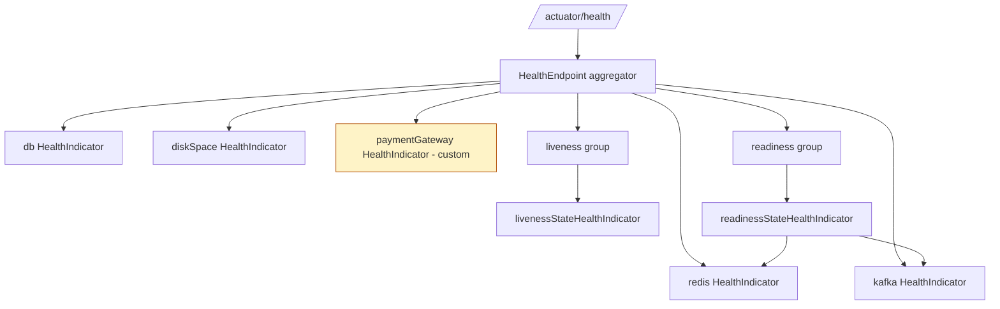

# Spring Boot Actuator Deep Dive

**Date:** 2026-04-17
**Tags:** actuator, spring-boot, observability, health, metrics

## Table of Contents

- [Summary](#summary)
- [Setup](#setup)
- [Endpoint Catalog](#endpoint-catalog)
- [Enabling and Exposing](#enabling-and-exposing)
- [Health Endpoints](#health-endpoints)
- [Custom HealthIndicator](#custom-healthindicator)
- [Reactive Health](#reactive-health)
- [Kubernetes Probes](#kubernetes-probes)
- [Metrics with Micrometer](#metrics-with-micrometer)
- [Built-in Metrics](#built-in-metrics)
- [Custom Metrics](#custom-metrics)
- [Annotations: @Timed, @Counted, @Observed](#annotations-timed-counted-observed)
- [MeterBinder Pattern](#meterbinder-pattern)
- [Info Endpoint](#info-endpoint)
- [Loggers Endpoint](#loggers-endpoint)
- [Custom @Endpoint](#custom-endpoint)
- [Securing Endpoints](#securing-endpoints)
- [Management Port](#management-port)
- [Tracing Integration](#tracing-integration)
- [Common Pitfalls](#common-pitfalls)
- [Related](#related)
- [References](#references)

---

## Summary

Spring Boot Actuator exposes a set of built-in **operational HTTP (or JMX)
endpoints** that make a running Spring Boot application observable and
manageable in production. Out of the box you get:

- `/actuator/health` — aggregate health of the app and its dependencies
- `/actuator/info` — build/Git/app metadata
- `/actuator/metrics` — catalog of Micrometer meters
- `/actuator/prometheus` — Prometheus scrape format
- `/actuator/env`, `/beans`, `/mappings`, `/loggers`, `/threaddump`,
  `/heapdump`, `/conditions`, `/scheduledtasks`, …

Actuator provides **ready-made observability with minimal config**, yet is
fully pluggable. The three extension points you will reach for are:

1. `HealthIndicator` / `ReactiveHealthIndicator` for health contributions.
2. `@Endpoint` (+ `@ReadOperation`, `@WriteOperation`) for custom endpoints.
3. `MeterBinder` for cross-cutting metrics registration.

This doc walks through setup, the endpoint catalog, health composition
(including Kubernetes probes), Micrometer metrics, custom endpoints, security,
and the operational pitfalls that bite teams in production.

---

## Setup

Add the starter:

```xml
<dependency>
  <groupId>org.springframework.boot</groupId>
  <artifactId>spring-boot-starter-actuator</artifactId>
</dependency>
```

Or Gradle:

```kotlin
implementation("org.springframework.boot:spring-boot-starter-actuator")
```

**Defaults after adding the starter:**

- All endpoints are *enabled* (can run) but only `/actuator/health` is
  *exposed* over HTTP. Everything else is hidden until you opt in.
- JMX exposure default is broader than web exposure — still, the web surface
  is what matters for most production deployments.
- Endpoints live under the base path `/actuator` (configurable via
  `management.endpoints.web.base-path`).

For Prometheus scraping add:

```xml
<dependency>
  <groupId>io.micrometer</groupId>
  <artifactId>micrometer-registry-prometheus</artifactId>
</dependency>
```

This makes `/actuator/prometheus` available once exposed.

---

## Endpoint Catalog

| Endpoint             | Purpose                                               | Default exposed |
|----------------------|-------------------------------------------------------|-----------------|
| `health`             | App + dependency health aggregation                   | Yes             |
| `info`               | Arbitrary app info (build, git, custom)               | No              |
| `metrics`            | Micrometer meter catalog + values                     | No              |
| `prometheus`         | Prometheus scrape format                              | No              |
| `env`                | Environment properties (profiles, sources)            | No              |
| `configprops`        | Bound `@ConfigurationProperties` beans                | No              |
| `beans`              | All Spring beans in the context                       | No              |
| `mappings`           | All request mappings                                  | No              |
| `scheduledtasks`     | `@Scheduled` tasks and cron triggers                  | No              |
| `caches`             | Cache names and stats                                 | No              |
| `threaddump`         | JVM thread dump                                       | No              |
| `heapdump`           | Downloadable heap dump (hprof)                        | No              |
| `loggers`            | View/change log levels at runtime                     | No              |
| `conditions`         | Autoconfig report — matched/unmatched                 | No              |
| `shutdown`           | Gracefully shut the app down (disabled by default)    | No              |
| `sessions`           | Spring Session data (if enabled)                      | No              |
| `auditevents`        | Audit events (if `AuditEventRepository` configured)   | No              |
| `integrationgraph`   | Spring Integration flow graph                         | No              |
| `startup`            | Application startup steps (buffered)                  | No              |
| `sbom`               | Software Bill of Materials (Boot 3.3+)                | No              |

---

## Enabling and Exposing

Two independent switches control an endpoint:

- `management.endpoint.<id>.enabled` — does the endpoint run at all?
- `management.endpoints.web.exposure.include/exclude` — is it reachable
  over HTTP?

Typical production config:

```yaml
management:
  endpoints:
    web:
      exposure:
        include: health,info,metrics,prometheus,loggers
        exclude: env,beans
      base-path: /actuator
  endpoint:
    health:
      show-details: when-authorized
      show-components: always
      probes:
        enabled: true      # /health/liveness, /health/readiness
    shutdown:
      enabled: false
```

Notes:

- `include: "*"` exposes everything — convenient for dev, **dangerous** in
  prod. Prefer an explicit allow list.
- `exclude` wins over `include`.
- `show-details` values: `never`, `when-authorized`, `always`.

---

## Health Endpoints

`/actuator/health` aggregates all `HealthIndicator` beans in the context.
The overall status is derived via a `StatusAggregator` (default precedence:
`DOWN > OUT_OF_SERVICE > UP > UNKNOWN`).

Built-in indicators (auto-registered when the dependency is present):

- `db` (DataSource ping)
- `diskSpace`
- `mongo`, `redis`, `cassandra`, `elasticsearch`, `neo4j`, `couchbase`
- `kafka`, `rabbit`
- `mail`, `ldap`
- `ping` (always `UP`, useful smoke test)
- `reactiveDiscoveryComposite` for Cloud discovery clients

### Composition



Sample response (`show-details: always`):

```json
{
  "status": "UP",
  "components": {
    "db": { "status": "UP", "details": { "database": "PostgreSQL", "validationQuery": "SELECT 1" } },
    "diskSpace": { "status": "UP", "details": { "total": 5.0e11, "free": 2.0e11, "threshold": 1.0e10 } },
    "paymentGateway": { "status": "UP", "details": { "latency_ms": 42 } }
  }
}
```

### Status values

- `UP` — healthy
- `DOWN` — failed; usually surfaces as HTTP 503
- `OUT_OF_SERVICE` — intentionally taken out (e.g. draining)
- `UNKNOWN` — indicator couldn't determine

HTTP status mapping is configurable via
`management.endpoint.health.status.http-mapping`.

---

## Custom HealthIndicator

```java
@Component
public class PaymentGatewayHealthIndicator implements HealthIndicator {

    private final PaymentClient client;

    public PaymentGatewayHealthIndicator(PaymentClient client) {
        this.client = client;
    }

    @Override
    public Health health() {
        try {
            long latency = client.ping();
            if (latency > 500) {
                return Health.status("DEGRADED")
                    .withDetail("latency_ms", latency)
                    .build();
            }
            return Health.up()
                .withDetail("latency_ms", latency)
                .build();
        } catch (Exception e) {
            return Health.down(e).build();
        }
    }
}
```

Guidelines:

- Keep it **cheap** — this is hit on every probe.
- Return a bounded amount of detail; never include secrets.
- If your dependency is optional, consider `UNKNOWN` or a custom status
  mapped to `200` so you don't fail the pod for a soft dep.
- Register custom statuses with `management.endpoint.health.status.order`
  and `http-mapping`.

---

## Reactive Health

For WebFlux or when you want non-blocking checks:

```java
@Component
public class PricingServiceHealthIndicator implements ReactiveHealthIndicator {

    private final WebClient webClient;

    @Override
    public Mono<Health> health() {
        return webClient.get().uri("/ping")
            .retrieve()
            .toBodilessEntity()
            .timeout(Duration.ofMillis(500))
            .map(r -> Health.up().withDetail("status", r.getStatusCode().value()).build())
            .onErrorResume(e -> Mono.just(Health.down(e).build()));
    }
}
```

Reactive health indicators participate in the same aggregator as blocking
ones; Actuator adapts them automatically.

---

## Kubernetes Probes

Set:

```yaml
management:
  endpoint:
    health:
      probes:
        enabled: true
      group:
        readiness:
          include: readinessState,db,redis
        liveness:
          include: livenessState
```

This exposes:

- `/actuator/health/liveness` — is the process alive? Restart pod on failure.
- `/actuator/health/readiness` — is it ready to receive traffic? Remove from
  service endpoints on failure.

Kubernetes manifest:

```yaml
livenessProbe:
  httpGet:
    path: /actuator/health/liveness
    port: 8080
  initialDelaySeconds: 10
  periodSeconds: 10
  failureThreshold: 3
readinessProbe:
  httpGet:
    path: /actuator/health/readiness
    port: 8080
  initialDelaySeconds: 5
  periodSeconds: 5
  failureThreshold: 2
```

**Graceful shutdown** pairs nicely so in-flight requests complete when the
pod is terminated:

```yaml
server:
  shutdown: graceful
spring:
  lifecycle:
    timeout-per-shutdown-phase: 30s
```

Spring Boot flips readiness to `REFUSING_TRAFFIC` before accepting `SIGTERM`
so load balancers drain before the app stops. See
[`configurations/docker-and-deployment.md`](configurations/docker-and-deployment.md)
for the full deployment picture.

---

## Metrics with Micrometer

Actuator wires **Micrometer** automatically. Think of Micrometer as "SLF4J
for metrics" — your code talks to a vendor-neutral `MeterRegistry`, and the
registry forwards to a backend (Prometheus, Datadog, New Relic, CloudWatch,
OTLP, etc.) based on the registry implementation on the classpath.

- `/actuator/metrics` — list meter names; drill down with
  `/actuator/metrics/http.server.requests?tag=uri:/api/orders`
- `/actuator/prometheus` — scrape format for Prometheus

Pick a registry by adding one dependency:

```xml
<dependency>
  <groupId>io.micrometer</groupId>
  <artifactId>micrometer-registry-prometheus</artifactId>
</dependency>
```

---

## Built-in Metrics

Without writing a line of code you get:

- **JVM** — `jvm.memory.used`, `jvm.memory.max`, `jvm.gc.pause`,
  `jvm.threads.live`, `jvm.classes.loaded`
- **System/Process** — `system.cpu.usage`, `process.cpu.usage`,
  `process.uptime`, `process.files.open`
- **HTTP server** — `http.server.requests` timer with tags `method`, `uri`,
  `status`, `outcome`, `exception` (both MVC and WebFlux)
- **HTTP client** — `http.client.requests` (RestTemplate / WebClient)
- **DataSource / HikariCP** — `hikaricp.connections.active`,
  `hikaricp.connections.pending`, `hikaricp.connections.usage`
- **Tomcat / Jetty / Netty** — thread pool and session metrics
- **Logback** — `logback.events` tagged by level
- **Kafka** — consumer lag, producer throughput when kafka starter is used
- **Caches** — hit/miss per `Cache` bean
- **Task execution / scheduling** — executor queue metrics

---

## Custom Metrics

Inject `MeterRegistry` and create meters on demand:

```java
@Service
@RequiredArgsConstructor
public class OrderService {

    private final MeterRegistry meterRegistry;

    public Order place(OrderRequest req) {
        Timer.Sample sample = Timer.start(meterRegistry);
        try {
            Order order = doPlace(req);
            meterRegistry.counter("orders.placed",
                    "status", "ok",
                    "channel", req.channel()).increment();
            return order;
        } catch (RuntimeException e) {
            meterRegistry.counter("orders.placed",
                    "status", "error",
                    "reason", e.getClass().getSimpleName()).increment();
            throw e;
        } finally {
            sample.stop(meterRegistry.timer("orders.place.duration",
                    "channel", req.channel()));
        }
    }
}
```

Meter types at a glance:

| Type        | Use case                                         |
|-------------|--------------------------------------------------|
| `Counter`   | Monotonic counts (requests, errors, retries)     |
| `Gauge`     | Current value (queue size, cache size, in-flight)|
| `Timer`     | Latency distribution + count                     |
| `DistributionSummary` | Size distribution (payload bytes)      |
| `LongTaskTimer` | In-progress long-running operations          |

---

## Annotations: @Timed, @Counted, @Observed

With `micrometer-aop` on the classpath (and `@EnableAspectJAutoProxy` if
needed), you can annotate methods:

```java
@Service
public class SearchService {

    @Timed(value = "search.query", histogram = true, percentiles = {0.5, 0.95, 0.99})
    @Counted(value = "search.invocations", recordFailuresOnly = false)
    public List<Result> query(String q) { ... }
}
```

For OpenTelemetry-aligned instrumentation prefer `@Observed`:

```java
@Observed(name = "orders.place",
          contextualName = "order-placement",
          lowCardinalityKeyValues = {"channel", "web"})
public Order place(OrderRequest req) { ... }
```

`@Observed` emits both a metric and a trace span through the
`ObservationRegistry`, which is wired automatically when
`spring-boot-starter-actuator` + `micrometer-observation` are present.

---

## MeterBinder Pattern

For metrics that are orthogonal to a single method — e.g. you want a gauge
backed by an object's state — implement `MeterBinder`. The registry calls
`bindTo` when ready:

```java
@Configuration
public class QueueMetrics implements MeterBinder {

    private final MyQueue queue;

    public QueueMetrics(MyQueue queue) { this.queue = queue; }

    @Override
    public void bindTo(MeterRegistry registry) {
        Gauge.builder("queue.size", queue, MyQueue::size)
             .description("Current in-memory queue depth")
             .baseUnit("items")
             .tag("queue", "orders")
             .register(registry);

        Gauge.builder("queue.capacity", queue, MyQueue::capacity)
             .register(registry);
    }
}
```

Why `MeterBinder` over registering eagerly in a `@PostConstruct`? Because
Spring Boot wires all registered binders into every `MeterRegistry` bean
(including composite registries) at the right lifecycle phase.

---

## Info Endpoint

`/actuator/info` is empty by default. Populate via configuration or
contributors.

```yaml
management:
  info:
    env:
      enabled: true
    git:
      mode: full
    build:
      enabled: true
    java:
      enabled: true
    os:
      enabled: true

info:
  app:
    name: '@project.name@'
    version: '@project.version@'
    region: ${DEPLOY_REGION:unknown}
```

To populate Git info add the `io.spring.boot:git-commit-id-maven-plugin`
(or the Gradle equivalent) so `git.properties` is generated at build time.
Build info comes from `spring-boot-maven-plugin`'s `build-info` goal.

Custom contributor:

```java
@Component
public class FeatureFlagsInfoContributor implements InfoContributor {
    @Override
    public void contribute(Info.Builder builder) {
        builder.withDetail("featureFlags", Map.of("checkoutV2", true));
    }
}
```

---

## Loggers Endpoint

Arguably the single most useful endpoint in production. View and change log
levels without restarting:

```bash
# List
curl http://localhost:8080/actuator/loggers

# View a specific logger
curl http://localhost:8080/actuator/loggers/com.example.orders

# Change at runtime
curl -X POST -H "Content-Type: application/json" \
     -d '{"configuredLevel":"DEBUG"}' \
     http://localhost:8080/actuator/loggers/com.example

# Reset to inherited
curl -X POST -H "Content-Type: application/json" \
     -d '{"configuredLevel":null}' \
     http://localhost:8080/actuator/loggers/com.example
```

Gate this behind admin auth — runtime loggers are a DoS and info leak vector
if exposed.

---

## Custom @Endpoint

When the built-in surface isn't enough, write a first-class endpoint:

```java
@Component
@Endpoint(id = "featureflags")
public class FeatureFlagsEndpoint {

    private final FeatureFlagStore store;

    public FeatureFlagsEndpoint(FeatureFlagStore store) { this.store = store; }

    @ReadOperation
    public Map<String, Boolean> all() {
        return store.snapshot();
    }

    @ReadOperation
    public Boolean one(@Selector String flag) {
        return store.get(flag);
    }

    @WriteOperation
    public void set(@Selector String flag, boolean value) {
        store.set(flag, value);
    }

    @DeleteOperation
    public void delete(@Selector String flag) {
        store.remove(flag);
    }
}
```

Variants:

- `@WebEndpoint` — HTTP-only
- `@JmxEndpoint` — JMX-only
- `@ServletEndpoint` / `@ControllerEndpoint` — escape hatch for Servlet API
  (deprecated in Boot 3.3+ in favor of `@Endpoint` + web framework
  integration)

Expose under the same `management.endpoints.web.exposure.include` list
using the `id` you set.

---

## Securing Endpoints

With `spring-boot-starter-security` on the classpath, Actuator endpoints are
automatically covered by Spring Security. Use `EndpointRequest` to write
matchers that survive base-path changes:

```java
@Bean
SecurityFilterChain actuatorSecurity(HttpSecurity http) throws Exception {
    http
        .securityMatcher(EndpointRequest.toAnyEndpoint())
        .authorizeHttpRequests(auth -> auth
            .requestMatchers(EndpointRequest.to("health", "info")).permitAll()
            .requestMatchers(EndpointRequest.to("prometheus"))
                .hasAuthority("SCOPE_metrics:read")
            .requestMatchers(EndpointRequest.toAnyEndpoint()).hasRole("ADMIN"))
        .httpBasic(Customizer.withDefaults())
        .csrf(csrf -> csrf.disable());
    return http.build();
}
```

Principles:

- `health` and `info` generally public (or behind the cluster network).
- `prometheus` restricted to the scraper (IP allow-list or bearer token).
- Everything else admin-only.
- Disable CSRF on the management chain — Actuator writes are not
  browser-initiated.

See [`security/security-filter-chain.md`](security/security-filter-chain.md)
for multi-chain setup and how `securityMatcher` composes.

---

## Management Port

Isolate operator traffic from application traffic — useful when the main
port is public but ops endpoints should stay on the cluster network:

```yaml
server:
  port: 8080
management:
  server:
    port: 9090
    address: 127.0.0.1   # or internal interface only
  endpoints:
    web:
      exposure:
        include: health,info,metrics,prometheus,loggers
```

Consequences:

- Separate Netty/Tomcat connector, separate thread pool.
- Security configuration must cover both chains; `EndpointRequest` already
  does this.
- Kubernetes: expose `containerPort: 9090` but don't put it in the public
  Service; probes use the pod IP so they still work.

---

## Tracing Integration

Modern Spring Boot replaces the old `/actuator/httptrace` (which was removed
in 3.x) with **Micrometer Tracing**. Add:

```xml
<dependency>
  <groupId>io.micrometer</groupId>
  <artifactId>micrometer-tracing-bridge-otel</artifactId>
</dependency>
<dependency>
  <groupId>io.opentelemetry</groupId>
  <artifactId>opentelemetry-exporter-otlp</artifactId>
</dependency>
```

Then `@Observed` methods and HTTP server/client instrumentation emit spans
to your OTLP collector. Configure via:

```yaml
management:
  tracing:
    sampling:
      probability: 0.1
  otlp:
    tracing:
      endpoint: http://otel-collector:4318/v1/traces
```

Trace context (`traceId`, `spanId`) is automatically propagated to MDC for
log correlation. Cross-ref [`reactive-observability.md`](reactive-observability.md).

---

## Common Pitfalls

- **Exposing `/env` or `/beans` in prod.** `/env` leaks secrets pulled from
  config sources; `/beans` is a map of your entire architecture. Keep them
  off the public exposure list.
- **`show-details: always` without auth.** A failing `db` indicator will
  happily render your JDBC URL, username, and the exception chain to
  anonymous callers. Use `when-authorized`.
- **No Kubernetes probes configured.** Without liveness/readiness, pod
  lifecycle is dictated by TCP open — zero-downtime deploys become luck.
- **`/actuator/shutdown` left enabled.** It's disabled by default; keep it
  that way unless you have a very specific reason (and then gate it
  aggressively).
- **Heavy health checks.** Running `SELECT COUNT(*) FROM orders` on every
  readiness probe melts your DB and flaps the pod under load. A simple
  `isValid()` ping is enough; push deep checks to a scheduled self-test
  that updates an in-memory status.
- **Cardinality explosion.** Don't put unbounded values (`userId`,
  `requestId`, full URIs) in meter tags. Use the URI template, not the
  concrete path. Prefer `method`, `status`, `outcome`.
- **Metric name sprawl.** Pick a naming convention early
  (`domain.object.action` with Micrometer's dot style) and stick to it.
  Micrometer will translate dots to underscores for Prometheus.
- **Forgetting graceful shutdown.** The probe flips early, but if
  `server.shutdown=graceful` is not set Spring still tears down the
  connector immediately.
- **Exposing Actuator on the same port as the app behind a shared
  WAF/ingress.** Rules meant for `/api/**` leak around `/actuator/**`. Split
  the port or explicitly secure the path in the ingress.

---

## Related

- [Reactive Observability](reactive-observability.md) — tracing and MDC in reactive pipelines.
- [Distributed Tracing and Metrics Beyond Logs](observability/distributed-tracing.md) — OpenTelemetry, Prometheus, RED/USE.
- [Logging in Java and Spring Boot](logging.md) — SLF4J, MDC, structured JSON logs.
- [Security Filter Chain](security/security-filter-chain.md) — securing actuator endpoints.
- [Docker and Deployment](configurations/docker-and-deployment.md) — container health probes.
- [Kubernetes for Spring Boot](configurations/kubernetes-spring-boot.md) — liveness/readiness/startup probes from actuator.
- [Performance Testing](testing/performance-testing.md) — Micrometer metrics during load tests.

## References

- Spring Boot Actuator reference: https://docs.spring.io/spring-boot/reference/actuator/index.html
- Production-ready health: https://docs.spring.io/spring-boot/reference/actuator/endpoints.html#actuator.endpoints.health
- Kubernetes probes: https://docs.spring.io/spring-boot/reference/actuator/endpoints.html#actuator.endpoints.kubernetes-probes
- Micrometer docs: https://micrometer.io/docs
- Micrometer Observation API: https://micrometer.io/docs/observation
- Micrometer Tracing: https://micrometer.io/docs/tracing
- Prometheus exposition format: https://prometheus.io/docs/instrumenting/exposition_formats/
- Spring Boot health indicators reference: https://docs.spring.io/spring-boot/reference/actuator/endpoints.html#actuator.endpoints.health.auto-configured-health-indicators
