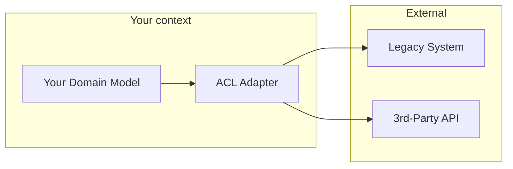

# DDD Tactical Patterns in Java — Aggregates, Value Objects, Bounded Contexts

**Date:** 2026-04-19 | **Updated:** 2026-04-19
**Tags:** `ddd` `architecture` `aggregates` `value-objects` `java` `spring-boot`

## Table of Contents

- [Summary](#summary)
- [Strategic vs Tactical DDD](#strategic-vs-tactical-ddd)
- [Bounded Contexts](#bounded-contexts)
- [Value Objects](#value-objects)
- [Entities](#entities)
- [Aggregates and Aggregate Roots](#aggregates-and-aggregate-roots)
- [Domain Events](#domain-events)
- [Repositories and Factories](#repositories-and-factories)
- [Domain Services](#domain-services)
- [Anti-Corruption Layer](#anti-corruption-layer)
- [Wiring DDD to Federation and Modulith](#wiring-ddd-to-federation-and-modulith)
- [Related](#related)
- [References](#references)

---

## Summary

[Domain-Driven Design (DDD)](https://www.domainlanguage.com/ddd/) was published by Eric Evans in 2003 and has become the lingua franca of microservice design. Two halves: **strategic** DDD (bounded contexts, ubiquitous language, context mapping) shapes what services exist; **tactical** DDD (aggregates, value objects, entities, domain events, repositories) shapes the code inside each service. Java 21 made tactical DDD vastly easier — [records](../java-fundamentals/modern-java-features.md) are value objects, [sealed types](../java-fundamentals/modern-java-features.md) are variant hierarchies, [pattern matching](../java-fundamentals/modern-java-features.md) replaces Visitor. This doc focuses on tactical patterns with Java-native code and ties them to [Spring Modulith](archunit-and-modulith.md) modules and [GraphQL federation subgraphs](../graphql/federation-concepts.md) — both of which map cleanly to DDD bounded contexts.

---

## Strategic vs Tactical DDD

| Layer | Question | Artifacts |
|-------|----------|-----------|
| Strategic | What services should exist? | Bounded contexts, subdomains, context maps, ubiquitous language |
| Tactical | What's inside a service? | Aggregates, entities, VOs, events, repositories, services |

Strategic decisions drive org structure (see [Conway's Law](../graphql/multi-database-patterns.md#when-to-merge-or-split-subgraphs)); tactical decisions drive code layout. You need both, but start strategic — otherwise you have perfectly modeled objects in the wrong services.

---

## Bounded Contexts

A **bounded context** is the scope within which a term has one meaning. "Customer" in the billing context is a Stripe ID and a payment method; "Customer" in the shipping context is an address book and delivery preferences. Same word, different model, different code.

Bounded contexts:

- Have their own ubiquitous language (team-agreed vocabulary).
- Have their own models — no sharing classes across contexts.
- Communicate via published events or APIs, never shared DB schemas.
- Usually map 1:1 to a microservice, a Modulith module, or a federation subgraph.

Anti-pattern: the "Customer" entity shared across six services via a common JAR. Ends with every team afraid to change it. Each service should have its own `Customer` shaped to its needs.

---

## Value Objects

A value object (VO) has no identity; two VOs with the same fields are interchangeable. Examples: `Money`, `Address`, `EmailAddress`, `DateRange`, `Quantity`.

Java records are value objects:

```java
public record Money(BigDecimal amount, Currency currency) {
    public Money {
        Objects.requireNonNull(amount);
        Objects.requireNonNull(currency);
        if (amount.scale() > currency.getDefaultFractionDigits())
            throw new IllegalArgumentException("too much precision");
    }

    public Money plus(Money other) {
        if (!currency.equals(other.currency))
            throw new IllegalStateException("currency mismatch");
        return new Money(amount.add(other.amount), currency);
    }
}
```

Properties:

- **Immutable** — no setters.
- **Validated at construction** — bad state can't exist.
- **Behavior lives on the VO** — `.plus()`, `.times()`, `.isZero()` — not on a `MoneyUtils` class.
- **Composed** — `Order` has `Money total`, not `BigDecimal totalAmount + String currency`.

VOs replace primitive obsession. Don't pass `String email` — pass `EmailAddress`. Validation happens once, at construction.

---

## Entities

An **entity** has identity — two entities with the same fields but different IDs are different. `User`, `Order`, `Invoice`. Identity is stable across state changes.

```java
public class Order {
    private final OrderId id;           // identity
    private OrderStatus status;         // mutable
    private Money total;                // mutable (value object)
    private final Instant createdAt;    // immutable attribute

    public Order(OrderId id, Money total) {
        this.id = Objects.requireNonNull(id);
        this.total = Objects.requireNonNull(total);
        this.status = OrderStatus.PLACED;
        this.createdAt = Instant.now();
    }

    public void cancel() {
        if (status != OrderStatus.PLACED)
            throw new IllegalStateException("cannot cancel in state " + status);
        this.status = OrderStatus.CANCELLED;
    }

    public OrderId id() { return id; }
    // no setters
}
```

Entities are mutable internally, but mutation goes through methods that enforce invariants. `order.setStatus(CANCELLED)` is wrong; `order.cancel()` is right — the method name encodes business intent.

---

## Aggregates and Aggregate Roots

An **aggregate** is a cluster of entities + VOs treated as one consistency unit. The **aggregate root** is the single entity outside code touches; internal entities are only reachable through the root.

Rules:

1. One aggregate = one transactional boundary. Never modify two aggregates in one transaction.
2. Cross-aggregate references are by ID only — `Order` holds `CustomerId`, not `Customer`.
3. Invariants inside the aggregate are enforced in the root's methods.
4. Aggregates are loaded and saved as a unit via repositories.

```java
public class Order {
    private final OrderId id;
    private final CustomerId customerId;
    private final List<OrderLine> lines = new ArrayList<>();
    private OrderStatus status;

    public void addLine(ProductId productId, int qty, Money unitPrice) {
        if (status != OrderStatus.DRAFT)
            throw new IllegalStateException();
        lines.add(new OrderLine(productId, qty, unitPrice));
    }

    public Money total() {
        return lines.stream()
            .map(OrderLine::subtotal)
            .reduce(Money.ZERO, Money::plus);
    }

    public void checkout() {
        if (lines.isEmpty()) throw new IllegalStateException();
        this.status = OrderStatus.PLACED;
    }
}
```

`OrderLine` is accessible only through `Order`. Outside code never sees a bare `OrderLine`.

**Aggregate sizing**: keep them small. A mega-aggregate (Customer with all Orders with all LineItems with all...) makes every save a full-tree update, blocks concurrent users, and grows unbounded. Prefer many small aggregates with ID references.

---

## Domain Events

When an aggregate's state changes in a way the outside world cares about, emit a **domain event**:

```java
public sealed interface OrderEvent {
    record OrderPlaced(OrderId id, CustomerId customerId, Money total, Instant at) implements OrderEvent {}
    record OrderCancelled(OrderId id, String reason, Instant at) implements OrderEvent {}
    record OrderShipped(OrderId id, TrackingNumber tracking, Instant at) implements OrderEvent {}
}
```

Sealed + record: exhaustive pattern matching, type-safe handlers, no reflection.

Publishing inside the aggregate:

```java
public void cancel(String reason) {
    if (status != OrderStatus.PLACED) throw new IllegalStateException();
    this.status = OrderStatus.CANCELLED;
    DomainEvents.publish(new OrderCancelled(id, reason, Instant.now()));
}
```

`DomainEvents.publish` is typically a static facade over Spring's `ApplicationEventPublisher`, or Modulith's event bus. See [event-sourcing-cqrs.md](event-sourcing-cqrs.md) for the event-sourced variant where events *are* the state.

---

## Repositories and Factories

A **repository** abstracts aggregate loading and saving — one repo per aggregate root:

```java
public interface OrderRepository {
    Optional<Order> findById(OrderId id);
    void save(Order order);
    List<Order> findByCustomerId(CustomerId customerId);
}
```

Implementation lives in infrastructure, not in domain. Domain depends on the interface; Spring wires the JPA / R2DBC / Mongo implementation.

A **factory** creates complex aggregates:

```java
public class OrderFactory {
    public Order create(CustomerId customer, List<CartItem> items) {
        Order o = new Order(OrderId.generate(), customer);
        items.forEach(i -> o.addLine(i.productId(), i.qty(), i.unitPrice()));
        return o;
    }
}
```

Factories are justified when the constructor gets complicated (many validation steps, external lookups). Otherwise a constructor is fine.

---

## Domain Services

When behavior doesn't naturally fit on an aggregate — because it involves multiple aggregates or a policy — make it a **domain service**:

```java
public class TransferService {
    public void transfer(AccountId from, AccountId to, Money amount) {
        Account source = repo.findById(from).orElseThrow();
        Account target = repo.findById(to).orElseThrow();
        source.withdraw(amount);
        target.deposit(amount);
        // each in its own transaction — use saga/outbox (see event-driven-patterns.md)
    }
}
```

Domain services are stateless, named after business operations ("TransferFunds", "CalculatePricing"). Keep them free of Spring annotations if possible — they should depend only on domain types and interfaces.

---

## Anti-Corruption Layer

When your bounded context has to talk to an external system with a different model, wrap it in an **anti-corruption layer** (ACL) — a translation boundary:



The ACL translates "their Customer" into "our Customer" on every call. Your domain never imports their types, never references their concepts. If they rename a field or split a service, only the ACL changes.

Typical ACL implementation: an interface defined in the domain, an implementation in `infrastructure.acl` that calls the external API. Map one way in, one way out — never leak external types upward.

---

## Wiring DDD to Federation and Modulith

Strategic DDD aligns with infrastructure choices:

| DDD concept | Modulith | Federation |
|-------------|----------|------------|
| Bounded context | Module | Subgraph |
| Aggregate | Package inside a module | Entity with `@key` |
| Domain event | Module event | Published to Kafka + subscribed in other subgraphs |
| Anti-corruption layer | Adapter package | Gateway-level schema remapping |
| Shared kernel | Anti-pattern — avoid | Anti-pattern — avoid |

Start in a Modulith. As modules prove stable and need independent deploy cadence, extract to separate services and wire them together with federation. The DDD model stays the same; only the transport changes. See [graphql/multi-database-patterns.md](../graphql/multi-database-patterns.md).

---

## Related

- [Project Structure and Architecture](project-structure.md) — where layered/hexagonal/clean architecture fit.
- [ArchUnit and Spring Modulith](archunit-and-modulith.md) — enforce bounded-context boundaries in code.
- [Event Sourcing and CQRS](event-sourcing-cqrs.md) — event-sourced aggregates.
- [GraphQL Federation Concepts](../graphql/federation-concepts.md) — subgraph = bounded context.
- [Modern Java Features](../java-fundamentals/modern-java-features.md) — records and sealed types as VO / variant idioms.
- [JPA Relationships](../data-repositories/jpa-relationships.md) — persisting aggregates correctly.
- [Distributed Systems Primer](distributed-systems-primer.md) — why aggregates ≠ transactions across services.

---

## References

- [Eric Evans — Domain-Driven Design (2003)](https://www.domainlanguage.com/ddd/)
- [Vaughn Vernon — Implementing Domain-Driven Design](https://www.informit.com/store/implementing-domain-driven-design-9780321834577)
- [Vaughn Vernon — Effective Aggregate Design](https://dddcommunity.org/library/vernon_2011/)
- [Martin Fowler — Domain-Driven Design](https://martinfowler.com/tags/domain%20driven%20design.html)
- [Oliver Drotbohm — Modulith + DDD blog posts](https://odrotbohm.de/)
- [Nick Tune — Strategic DDD / Context Maps](https://medium.com/nick-tune-tech-strategy-blog)
- [Domain-Driven Design Europe — conference talks](https://dddeurope.com/)
