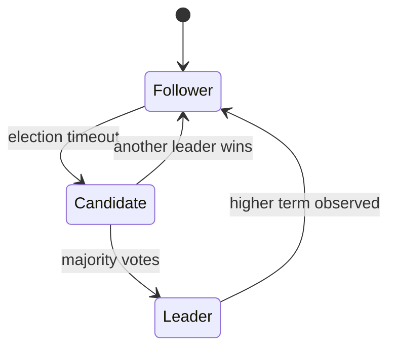

# Distributed Systems Primer — CAP, Consistency, Consensus, Idempotency

**Date:** 2026-04-19 | **Updated:** 2026-04-19
**Tags:** `distributed-systems` `architecture` `consistency` `consensus` `cap`

## Table of Contents

- [Summary](#summary)
- [Why Distributed Systems Are Different](#why-distributed-systems-are-different)
- [CAP and PACELC](#cap-and-pacelc)
- [Consistency Models](#consistency-models)
- [Idempotency](#idempotency)
- [Clock Skew and Ordering](#clock-skew-and-ordering)
- [Consensus — Raft and Paxos Intuition](#consensus--raft-and-paxos-intuition)
- [The Exactly-Once Myth](#the-exactly-once-myth)
- [Failure Modes to Design For](#failure-modes-to-design-for)
- [Related](#related)
- [References](#references)

---

## Summary

Running one service is engineering; running ten services is a distributed system — the rules change. Networks are unreliable, clocks lie, failures are partial, and your mental model of "the database is either up or down" stops working. This doc covers the handful of theorems and patterns every distributed-systems practitioner needs: [CAP](https://en.wikipedia.org/wiki/CAP_theorem) and [PACELC](https://en.wikipedia.org/wiki/PACELC_theorem), the spectrum from eventual to strong consistency, why idempotency is load-bearing for every retry, why you can't trust wall-clock time, a working intuition for [Raft](https://raft.github.io/) without the proofs, and why "exactly-once" is usually a lie dressed as a guarantee. These are the foundations under everything in [messaging/event-driven-patterns.md](../messaging/event-driven-patterns.md), [graphql/multi-database-patterns.md](../graphql/multi-database-patterns.md), and [jpa-transactions.md](../jpa-transactions.md).

---

## Why Distributed Systems Are Different

[Leslie Lamport](https://lamport.azurewebsites.net/pubs/distributed-system.txt): *"A distributed system is one in which the failure of a computer you didn't even know existed can render your own computer unusable."*

Eight [fallacies of distributed computing](https://en.wikipedia.org/wiki/Fallacies_of_distributed_computing) ([Peter Deutsch](https://www.rgoarchitects.com/Files/fallacies.pdf)):

1. The network is reliable.
2. Latency is zero.
3. Bandwidth is infinite.
4. The network is secure.
5. Topology doesn't change.
6. There is one administrator.
7. Transport cost is zero.
8. The network is homogeneous.

Every distributed bug you ever see can be traced to assuming one of these.

**Partial failure** is the load-bearing concept. In a single-process app, either everything works or the whole thing crashed — atomic. In a distributed system, service A succeeded, B timed out (did it commit?), C returned 500 with the work maybe done. Your code must tolerate every cell of that truth table.

---

## CAP and PACELC

[CAP theorem](https://en.wikipedia.org/wiki/CAP_theorem) (Brewer, 2000; formalized by Gilbert & Lynch, 2002): in the presence of a **P**artition, a distributed system must choose between **C**onsistency and **A**vailability.

Misreadings are rampant. CAP does **not** say "pick 2 of 3 forever". It says: when a network partition occurs (rare but real), you pick CP (refuse writes during partition to keep data consistent) or AP (accept writes and reconcile later).

| System | CAP mode | Example |
|--------|----------|---------|
| PostgreSQL primary-replica with sync replication | CP | Banking ledger |
| Cassandra with `QUORUM` | Tunable | Feed storage |
| DynamoDB | AP | Shopping cart |
| ZooKeeper / etcd | CP | Service discovery |
| DNS | AP | Everything |

[PACELC](https://en.wikipedia.org/wiki/PACELC_theorem) refines it: when there is **no** partition, you still trade off **L**atency and **C**onsistency. A strongly consistent read from a quorum is slower than a stale read from one replica. Operationally, PACELC is the day-to-day trade-off; CAP is the edge case.

---

## Consistency Models

A spectrum, weakest to strongest:

| Model | Guarantee | Example |
|-------|-----------|---------|
| **Eventual** | All replicas converge eventually | DNS, S3 (historical), Cassandra default |
| **Read-your-writes** | You see your own writes | Most session-sticky web apps |
| **Monotonic reads** | Subsequent reads never go back in time | Many NoSQL with session affinity |
| **Causal** | If A → B, everyone sees A before B | TiDB, CockroachDB |
| **Sequential** | Global order consistent with program order | Older distributed DBs |
| **Linearizable** | Reads see the latest write immediately | Spanner, FoundationDB, single-node Postgres |
| **Strict serializable** | Linearizable + transactions serial | Spanner |

Lower consistency → higher availability, higher throughput, lower latency. Higher consistency → simpler code but slower and more fragile.

Rule of thumb: start at the strongest consistency you can afford. Relax only where measurement proves you need the performance. Many "we need eventual consistency" arguments are premature optimization; a correctly-sized Postgres handles an enormous amount of load linearizably.

---

## Idempotency

A request is **idempotent** if applying it N times has the same effect as applying it once. Crucial for retries — and every distributed interaction eventually retries.

How:

1. **Natural idempotency** — `PUT /users/42` with a full body; re-sending sets the same state.
2. **Idempotency keys** — client sends `Idempotency-Key: abc123`; server stores `(key, result)` and returns the cached result for duplicates. [Stripe's model](https://stripe.com/docs/idempotency).
3. **Conditional operations** — `UPDATE x SET y=2 WHERE y=1` runs once even if repeated.
4. **Event-sourcing dedup** — consumer tracks processed event IDs (see [multi-database-patterns.md § Idempotency keys](../graphql/multi-database-patterns.md#idempotency-keys)).

Without idempotency, retries double-charge customers, duplicate orders, and corrupt balances. Every POST to a financial or inventory endpoint needs an idempotency key. Every event-driven consumer needs a dedup table.

---

## Clock Skew and Ordering

Wall-clock time is a lie across machines. Two servers' clocks can differ by seconds (NTP) or milliseconds (PTP). This breaks:

- "Last write wins" reconciliation — the "newer" write may have a slower clock.
- Distributed locks with timestamp-based expiration.
- Rate limiters keyed on wall-clock windows without tolerance.

Fixes:

- **Logical clocks** ([Lamport timestamps](https://en.wikipedia.org/wiki/Lamport_timestamp), [vector clocks](https://en.wikipedia.org/wiki/Vector_clock)) capture causality, not absolute time.
- **Hybrid logical clocks (HLC)** combine wall time + counter (CockroachDB, YugabyteDB).
- **[Google TrueTime](https://research.google/pubs/pub39966/)** with GPS + atomic clocks; bounded uncertainty interval. Basis of Spanner's external consistency.

Advice: never trust `System.currentTimeMillis()` for ordering across services. Use monotonic counters, event sequence numbers, or accept that reality is eventually consistent.

---

## Consensus — Raft and Paxos Intuition

Multiple replicas need to agree on a value (next log entry, leader identity). Consensus protocols solve this despite node failures.

**Raft** ([paper](https://raft.github.io/raft.pdf)) is the modern teaching protocol. Three states:

Flow:

1. One leader at a time. All writes go through the leader.
2. Leader replicates log entries to followers.
3. Entry is **committed** once a majority of replicas have it.
4. Committed entries are applied to the state machine in order.
5. If the leader dies, followers time out and start an election. Highest-log candidate wins.

Key properties:

- **Election safety**: at most one leader per term.
- **Log matching**: if two logs have the same index and term, they're identical up to that point.
- **Leader completeness**: a committed entry is in every future leader's log.

Used in etcd, Consul, CockroachDB, TiKV, NATS JetStream. When you hear "distributed consensus," assume Raft unless told otherwise.

Paxos is the older, harder-to-understand cousin. Raft is Paxos explained well.

---

## The Exactly-Once Myth

"Exactly-once delivery" is marketing. At the transport layer, you get either:

- **At-most-once** — fire and forget; messages may be lost.
- **At-least-once** — retry until ack; messages may duplicate.

Exactly-once **processing** is achievable — but only if consumers are idempotent. The end-to-end guarantee is:

> at-least-once delivery + idempotent processing = effectively-once

Kafka's "exactly-once semantics" (EOS) achieves this for Kafka-to-Kafka pipelines via transactional producers and read-committed consumers. It does *not* extend to "send to Kafka and to Postgres atomically" — that requires the outbox pattern. See [messaging/event-driven-patterns.md](../messaging/event-driven-patterns.md) and [multi-database-patterns.md § Outbox](../graphql/multi-database-patterns.md#outbox-pattern).

---

## Failure Modes to Design For

A partial catalog that every senior engineer has been bitten by:

- **Timeouts with ambiguity** — request timed out; did the work complete? Caller must assume yes and verify, or make the call idempotent and retry.
- **Split brain** — two nodes both think they're leader after a partition. Consensus prevents; quorum reads detect.
- **Thundering herd** — cache expires, 10k clients hit the origin at once. Fix: stampede-safe caching (see [caching-deep-dive.md](../data-repositories/caching-deep-dive.md)).
- **Retry storms** — all clients retry at once, amplifying load. Fix: exponential backoff + jitter.
- **Head-of-line blocking** — one slow request holds up others. Fix: bounded queues, timeouts, bulkheads.
- **Slow-failure cascades** — service A waits on slow B, exhausts thread pool, A's callers see timeouts, whole system degrades. Fix: circuit breakers + timeouts at every hop.
- **Cache inconsistency** — DB updated, cache stale. Fix: write-through, invalidation events, or short TTLs.
- **Clock drift** — see above.
- **Leader re-election gaps** — 5–10s without a leader during failover. Design consumers to tolerate.
- **Deployment race conditions** — new service version + old consumer version = schema mismatch. Fix: additive schema changes only, see [graphql/multi-database-patterns.md § Version skew](../graphql/multi-database-patterns.md#version-skew-and-rollouts).

Every one of these has been a multi-hour outage at some company you've heard of. Design for them.

---

## Related

- [Event-Driven Patterns](../messaging/event-driven-patterns.md) — saga, outbox, CQRS — applied patterns built on these foundations.
- [Federated GraphQL with Polyglot Persistence](../graphql/multi-database-patterns.md) — cross-service writes, idempotency in practice.
- [JPA Transactions](../jpa-transactions.md) — the single-DB consistency model that distributed systems have to replace.
- [Reactive Kafka](../messaging/reactive-kafka.md) — at-least-once delivery and EOS mode.
- [Multithreading Deep Dive](../java-fundamentals/concurrency/multithreading-deep-dive.md) — the single-process analogue of distributed consensus problems.
- [Event Sourcing and CQRS](event-sourcing-cqrs.md) — one pattern-stack for distributed state.

---

## References

- [Leslie Lamport — Time, Clocks, and the Ordering of Events in a Distributed System](https://lamport.azurewebsites.net/pubs/time-clocks.pdf)
- [Gilbert and Lynch — Brewer's conjecture and the feasibility of CAP](https://groups.csail.mit.edu/tds/papers/Gilbert/Brewer2.pdf)
- [Raft — In Search of an Understandable Consensus Algorithm](https://raft.github.io/raft.pdf)
- [The Raft Visualizer](https://raft.github.io/) — interactive.
- [Jepsen analyses](https://jepsen.io/analyses) — real-world distributed-database consistency audits.
- [Martin Kleppmann — Designing Data-Intensive Applications](https://dataintensive.net/) — the book.
- [Google — Spanner: Google's Globally-Distributed Database](https://research.google/pubs/pub39966/)
- [Stripe — Idempotency Keys](https://stripe.com/docs/idempotency)
- [Peter Deutsch — Fallacies of Distributed Computing Explained](https://www.rgoarchitects.com/Files/fallacies.pdf)
- [Aphyr — Call Me Maybe](https://aphyr.com/tags/jepsen) — partition tolerance in real databases.
