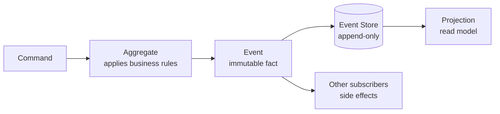
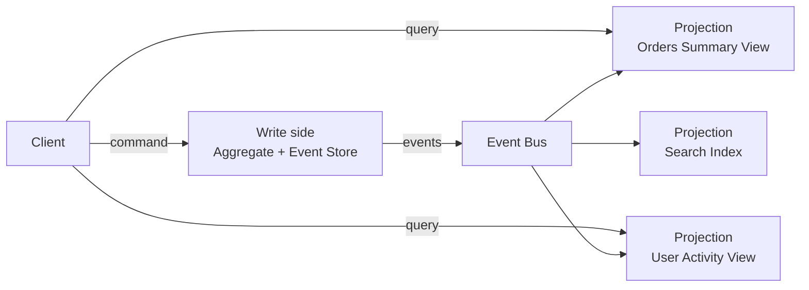

# Event Sourcing and CQRS — Event Store, Aggregates, Projections, Snapshots

**Date:** 2026-04-19 | **Updated:** 2026-04-19
**Tags:** `event-sourcing` `cqrs` `architecture` `axon` `ddd`

## Table of Contents

- [Summary](#summary)
- [Event Sourcing vs Event-Driven](#event-sourcing-vs-event-driven)
- [Core Model — Aggregate, Event, Command](#core-model--aggregate-event-command)
- [The Event Store](#the-event-store)
- [CQRS — Separate Read and Write Models](#cqrs--separate-read-and-write-models)
- [Projections](#projections)
- [Snapshots](#snapshots)
- [When Event Sourcing Is Right](#when-event-sourcing-is-right)
- [When It's Wrong](#when-its-wrong)
- [Java Frameworks — Axon, EventStoreDB, Spring Modulith](#java-frameworks--axon-eventstoredb-spring-modulith)
- [Related](#related)
- [References](#references)

---

## Summary

**Event Sourcing (ES)** stores an entity's state as an append-only sequence of events, not as a row in a table. The current state is derived by replaying events. **CQRS** (Command Query Responsibility Segregation) separates the write model (commands produce events) from one or more read models (optimized views over the events). Together they give you an audit log for free, time travel, multiple read models per write model, and natural fit for event-driven microservices. Cost: dramatic complexity. Eventual consistency between write and read models, schema evolution of events, replay performance, snapshots, and the "what if we got the event model wrong" question at every stage. ES is right for auditable domains (banking, trading, inventory, claims) and wrong for CRUD dashboards. This doc covers the model, the patterns, and when to reach for [Axon](https://www.axoniq.io/) or [EventStoreDB](https://www.eventstore.com/) vs building on [Spring Modulith](https://spring.io/projects/spring-modulith).

---

## Event Sourcing vs Event-Driven

They often get confused:

- **Event-driven** — services publish events when state changes; other services react. State itself is a row-in-table. See [messaging/event-driven-patterns.md](../messaging/event-driven-patterns.md).
- **Event-sourced** — the event log *is* the state. No "current value" is stored anywhere primary; it's always derived.

Event sourcing implies event-driven, but event-driven doesn't require event sourcing. You can do event-driven with a normal Postgres row plus outbox.

---

## Core Model — Aggregate, Event, Command



- **Command** (intent): "PlaceOrder", "ReserveStock", "TransferMoney". Can be rejected.
- **Event** (fact): "OrderPlaced", "StockReserved", "MoneyTransferred". Past tense. Never rejected — already happened.
- **Aggregate** (consistency boundary): the entity that enforces invariants when a command arrives and emits events. In Axon, `@Aggregate` class. In DDD, your bounded context root. See [ddd-tactical-patterns.md](ddd-tactical-patterns.md).

```java
@Aggregate
public class Order {
    @AggregateIdentifier private String id;
    private OrderStatus status;
    private BigDecimal total;

    @CommandHandler
    public Order(PlaceOrderCommand cmd) {
        if (cmd.items().isEmpty()) throw new IllegalArgumentException("empty cart");
        AggregateLifecycle.apply(new OrderPlaced(cmd.id(), cmd.userId(), cmd.items(), cmd.total()));
    }

    @EventSourcingHandler
    public void on(OrderPlaced e) {
        this.id = e.id();
        this.status = OrderStatus.PLACED;
        this.total = e.total();
    }

    @CommandHandler
    public void handle(CancelOrderCommand cmd) {
        if (status != OrderStatus.PLACED) throw new IllegalStateException();
        AggregateLifecycle.apply(new OrderCancelled(id));
    }

    @EventSourcingHandler
    public void on(OrderCancelled e) {
        this.status = OrderStatus.CANCELLED;
    }
}
```

**Rule**: command handlers produce events via `apply`; event handlers mutate aggregate state. Separation means replaying events rebuilds state deterministically.

---

## The Event Store

Storage shape:

```text
stream_id (aggregate id) | sequence | event_type     | payload (JSON) | metadata | timestamp
order-123                | 0        | OrderPlaced    | {...}          | {...}    | ...
order-123                | 1        | StockReserved  | {...}          | {...}    | ...
order-123                | 2        | OrderPaid      | {...}          | {...}    | ...
order-123                | 3        | OrderShipped   | {...}          | {...}    | ...
```

Append-only, ordered by sequence within a stream. Every aggregate has its own stream. Writes are optimistic-concurrency-controlled on `(stream_id, expected_sequence)` — conflict if someone else appended first.

Three options for the event store:

1. **Postgres** — a simple `events` table with BRIN index on `timestamp`, unique `(stream_id, sequence)`. Good enough for most cases. See [Oskar Dudycz's `Emmett`](https://event-driven-io.github.io/emmett/) for patterns.
2. **[EventStoreDB](https://www.eventstore.com/)** — purpose-built. Native streaming, projections engine, subscriptions.
3. **Kafka** — possible but awkward. Kafka is a log, not a database; deleting/rewinding streams is painful. Use only if you're already Kafka-heavy and okay with constraints.

---

## CQRS — Separate Read and Write Models



The write side ensures invariants (one aggregate, one event stream, strong consistency inside the aggregate). The read side is optimized for queries — can be SQL views, Elasticsearch, Redis, anything.

Read and write are eventually consistent. After a command, the caller may not see their own change in the read model for milliseconds. Two fixes: pass the expected event sequence number and wait until the read model catches up, or return the derived state directly from the write side.

---

## Projections

A projection is a function from events to a read model:

```java
@Component
public class OrderSummaryProjection {

    private final OrderSummaryRepository repo;

    @EventHandler
    public void on(OrderPlaced e) {
        repo.save(new OrderSummary(e.id(), e.userId(), e.total(), "PLACED", e.placedAt()));
    }

    @EventHandler
    public void on(OrderCancelled e) {
        repo.updateStatus(e.id(), "CANCELLED");
    }
}
```

Projections can be rebuilt from scratch at any time — replay the entire event store against the handler. This is the superpower of ES: **you can add a new read model tomorrow by adding a new projection and replaying**, without changing the write side.

Projection replay performance scales with event count. A billion-event store takes hours to replay — hence snapshots.

---

## Snapshots

Replaying a million events to rebuild one aggregate's state is slow. Periodically write a **snapshot**: the aggregate's state at sequence N. Future loads read the snapshot + events since N.

```java
@Aggregate(snapshotTriggerDefinition = "orderSnapshotTrigger")
public class Order { ... }

@Bean
public SnapshotTriggerDefinition orderSnapshotTrigger(Snapshotter snapshotter) {
    return new EventCountSnapshotTriggerDefinition(snapshotter, 50);
}
```

Snapshot every 50 events. Loading an aggregate reads the latest snapshot + remaining events.

Snapshots for projections work differently — usually just periodic backups or incremental materialization via change data capture.

---

## When Event Sourcing Is Right

Domains where ES is load-bearing:

- **Audit-critical** — banking, healthcare (see [healthcare-phi-compliance](https://openai.com)), legal. "Show me every change to this record for the last 7 years" is a free feature.
- **Multiple read shapes** — the same events feed a user-facing view, a tax report, a ML feature pipeline, and an ops dashboard.
- **Complex business rules** — events capture *why* things changed, not just current state. Crucial for domains where state transitions must be explainable.
- **Temporal queries** — "what did the customer see at 14:23 last Tuesday?" is a natural replay.

---

## When It's Wrong

- **CRUD apps** — user profiles, settings, admin dashboards. Events add ceremony without value.
- **Simple domains** — if the business model is "row in a table", leave it there.
- **Small teams** — ES is more tools, more patterns, more things to debug. Don't impose it on a 3-person team.
- **Unstable domain** — if you expect to redesign the model every quarter, event schema evolution will bury you.

Rule: start with a row-in-table + outbox. Migrate to ES when a specific business need pushes you there, not for theoretical purity.

---

## Java Frameworks — Axon, EventStoreDB, Spring Modulith

**[Axon Framework](https://docs.axoniq.io/reference-guide/)** — the mature JVM option. Annotations, aggregates, command bus, event bus, saga, query handlers. Works with Axon Server (proprietary) or a JPA-based event store. Heavy learning curve but most complete.

**[EventStoreDB Java client](https://github.com/EventStore/EventStoreDB-Client-Java)** — thin client over the database. You write your own aggregate/projection framework on top. More control, more code.

**[Spring Modulith](archunit-and-modulith.md)** — has `ApplicationEventPublisher` persistence for in-process events. Not full ES, but gets you 60% of the benefits for 10% of the complexity. Good starting point.

**Roll your own** — a Postgres table + Spring `ApplicationEventPublisher` + periodic snapshot + projection handler covers a lot. Reach for Axon when the ad-hoc thing starts reinventing Axon.

---

## Related

- [Event-Driven Patterns](../messaging/event-driven-patterns.md) — events as integration, not as state.
- [DDD Tactical Patterns](ddd-tactical-patterns.md) — aggregates and bounded contexts.
- [Distributed Systems Primer](distributed-systems-primer.md) — eventual consistency, idempotency.
- [Federated GraphQL with Polyglot Persistence](../graphql/multi-database-patterns.md) — outbox, saga in practice.
- [ArchUnit and Spring Modulith](archunit-and-modulith.md) — module boundaries align with aggregate boundaries.
- [Caching Deep Dive](../data-repositories/caching-deep-dive.md) — projections often cached aggressively.

---

## References

- [Martin Fowler — Event Sourcing](https://martinfowler.com/eaaDev/EventSourcing.html)
- [Greg Young — CQRS documents](https://cqrs.files.wordpress.com/2010/11/cqrs_documents.pdf)
- [Axon Framework reference](https://docs.axoniq.io/reference-guide/)
- [EventStoreDB documentation](https://developers.eventstore.com/)
- [Oskar Dudycz — Self-Host Event Sourcing](https://event-driven.io/en/)
- [Vaughn Vernon — Implementing Domain-Driven Design](https://www.informit.com/store/implementing-domain-driven-design-9780321834577)
- [Spring Modulith Events](https://docs.spring.io/spring-modulith/reference/events.html)
- [CloudEvents specification](https://cloudevents.io/) — standard event envelope.
