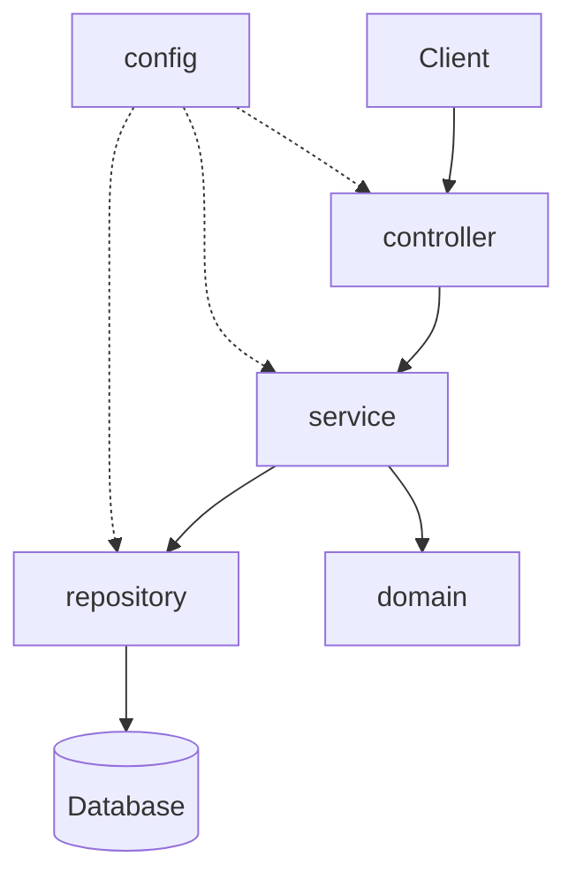
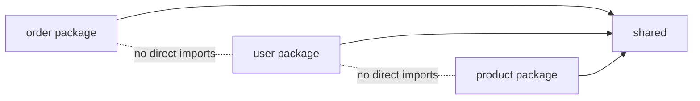
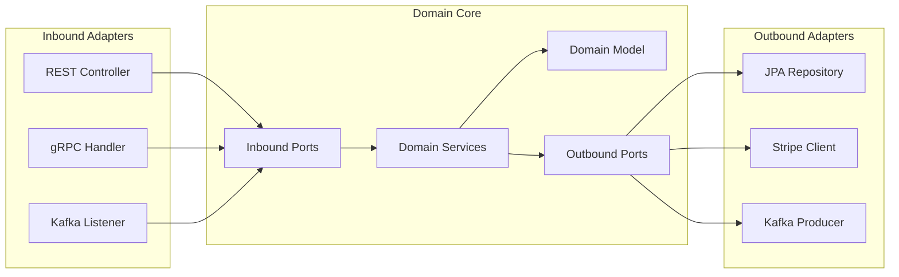
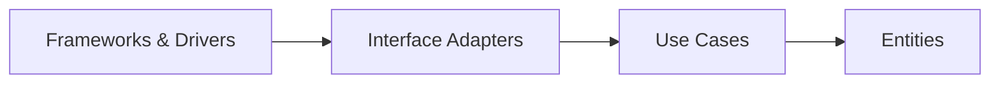

# Spring Boot Project Structure

*Date: 2026-04-17*
*Tags: architecture, project-structure, clean-architecture, hexagonal, package-organization*

## Table of Contents

- [Summary](#summary)
- [Layered Architecture (Traditional)](#layered-architecture-traditional)
- [Package-by-Feature (Recommended for Most Apps)](#package-by-feature-recommended-for-most-apps)
- [Hexagonal / Ports and Adapters](#hexagonal--ports-and-adapters)
- [Clean Architecture](#clean-architecture)
- [DDD Tactical Patterns](#ddd-tactical-patterns)
- [Common Folders Every App Needs](#common-folders-every-app-needs)
- [DTO vs Domain Model](#dto-vs-domain-model)
- [Decision Matrix](#decision-matrix)
- [Anti-Patterns](#anti-patterns)
- [Module Boundaries at Runtime](#module-boundaries-at-runtime)
- [Migration Path](#migration-path)
- [Testing Structure](#testing-structure)
- [Maven/Gradle Multi-Module](#mavengradle-multi-module)
- [A Concrete Recommended Template](#a-concrete-recommended-template)
- [Readings](#readings)
- [Related](#related)
- [References](#references)

---

## Summary

There is no single "correct" way to organize a Spring Boot service. Three
styles dominate production codebases:

1. **Layered architecture** — group by technical role (controller, service,
   repository). Easy to learn, struggles at scale.
2. **Package-by-feature** — group by business capability (order, user,
   payment). Scales well and is the recommended default for most apps.
3. **Hexagonal / Clean / Ports-and-Adapters** — isolate a framework-free
   domain core behind explicit ports. Best for long-lived systems, strict
   testability, or eventual microservice extraction.

Each has trade-offs. Package-by-feature scales best for medium-large services
and is the strongest default. Hexagonal is worth the ceremony when you have
long-term maintenance pressure or strict testability requirements.

---

## Layered Architecture (Traditional)

The first structure most tutorials teach. You group code by its **technical
role** in the request pipeline.



```
com.example.app/
├── controller/
│   ├── OrderController.java
│   ├── UserController.java
│   └── ProductController.java
├── service/
│   ├── OrderService.java
│   ├── UserService.java
│   └── ProductService.java
├── repository/
│   ├── OrderRepository.java
│   ├── UserRepository.java
│   └── ProductRepository.java
├── domain/
│   ├── Order.java
│   ├── User.java
│   └── Product.java
└── config/
    ├── WebConfig.java
    └── SecurityConfig.java
```

### Pros

- Simple to teach and understand; matches the classic "MVC" mental model.
- Every tutorial, blog post, and Baeldung article uses this shape.
- Works perfectly well for small CRUD apps under roughly 5k lines.

### Cons

- **High-churn features scatter across layers.** Adding a field to `Order`
  means touching four separate packages.
- **Cross-cutting code is hard to find.** "Where does the order cancellation
  rule live?" — it could be anywhere in `service/`.
- **`service` becomes a dumping ground.** Everything the controller cannot
  do and the repository should not do ends up there.
- Encourages an **anemic domain model** — entities devolve into getter/setter
  bags, with all behavior in `*Service` classes.

---

## Package-by-Feature (Recommended for Most Apps)

Group by **business capability**, not technical role. All code related to
orders lives in one package; all user code lives in another.



```
com.example.app/
├── order/
│   ├── OrderController.java
│   ├── OrderService.java
│   ├── OrderRepository.java
│   ├── Order.java
│   └── OrderDTO.java
├── user/
│   ├── UserController.java
│   ├── UserService.java
│   ├── UserRepository.java
│   └── User.java
└── shared/
    ├── config/
    └── exception/
```

### Pros

- **Change locality.** A feature request touches one package.
- **Independent evolution.** Teams can own a package without stepping on
  each other.
- **Easier microservice extraction later.** A well-bounded package becomes
  a natural service boundary.
- Discourages the anemic model — behavior lives alongside the data it
  operates on.

### Cons

- Duplication can hide (two features may re-implement the same helper).
- Less obvious where truly cross-feature code goes — teams must agree on
  what belongs in `shared/` and enforce discipline.
- Slightly higher bar for beginners who expect the "controller folder".

### Package Visibility

Use `package-private` (no modifier) for classes that are implementation
detail of a feature. Only the controller and domain-level interfaces need
to be `public`. This is the Java language's built-in module boundary and
it is under-used.

---

## Hexagonal / Ports and Adapters

Isolate the domain at the center. Everything else — the web framework,
database, Kafka, Stripe — is an adapter that plugs into a port.



```
com.example.order/
├── domain/                           (pure Java, no framework deps)
│   ├── model/
│   │   └── Order.java
│   ├── port/
│   │   ├── OrderRepository.java       (interface)
│   │   └── PaymentGateway.java        (interface)
│   └── service/
│       └── OrderService.java
└── adapter/
    ├── in/
    │   └── web/
    │       └── OrderController.java
    └── out/
        ├── persistence/
        │   └── OrderJpaRepository.java    (implements OrderRepository)
        └── payment/
            └── StripePaymentGateway.java  (implements PaymentGateway)
```

### The Rule

**Adapters depend on domain. Domain never depends on adapters.** Run a
dependency check: `domain/` must not import anything from `adapter/`,
Spring, JPA, Jackson, or any infrastructure package.

### Pros

- **Framework-independent core.** You could swap Spring WebFlux for gRPC
  without touching `domain/`.
- **Extreme testability.** Unit-test the domain with plain JUnit — no
  Spring context, no Testcontainers.
- **Clean dependency direction.** The compiler enforces the arrows.
- **Port interfaces are natural integration points** — easy to mock.

### Cons

- Heavier ceremony — more interfaces, more indirection.
- Small apps feel over-engineered ("why do I need a `PaymentGateway`
  interface if I only have one implementation?").
- Newer team members often do not see the value until the second
  refactor saves them a week.

---

## Clean Architecture

Robert Martin's formulation. Same philosophy as hexagonal, different
vocabulary. Concentric layers:



- **Entities** — enterprise-wide business rules (Order, Customer).
- **Use Cases** — application-specific rules (PlaceOrder, CancelOrder).
- **Interface Adapters** — controllers, presenters, gateways.
- **Frameworks & Drivers** — Spring, JPA, Kafka, web.

**Same core principle:** dependency inversion inward. Outer layers may
depend on inner layers; inner layers never know the outer ones exist.

In practice, "hexagonal" and "Clean Architecture" are used
interchangeably in Spring shops. Pick one vocabulary and stick with it.

---

## DDD Tactical Patterns

You do not have to adopt full Domain-Driven Design to benefit from its
tactical vocabulary. Useful terms:

- **Entity** — has identity that persists across state changes (`Order`
  with an `orderId`).
- **Value Object** — identity-free, compared by value (`Money`, `Address`,
  `EmailAddress`). Use Java `record` types.
- **Aggregate** — a cluster of entities treated as a consistency boundary.
  `Order` + its `OrderLine`s are one aggregate; you load and save them
  together.
- **Aggregate Root** — the single entry point into an aggregate. External
  code talks to `Order`, never directly to an `OrderLine`.
- **Domain Event** — "something meaningful happened" (`OrderPlaced`,
  `PaymentFailed`). Enables loose coupling between bounded contexts.
- **Repository** — collection-like abstraction for retrieving aggregate
  roots. One repository per aggregate root, not per table.

Even in a layered or package-by-feature app, adopting this vocabulary
helps teams reason about consistency and transactions.

---

## Common Folders Every App Needs

Regardless of style, most Spring Boot apps have:

- **`config/`** or **`infrastructure/config/`** — `@Configuration`
  classes, property binding (`@ConfigurationProperties`), Spring Boot
  customizers.
- **`security/`** — `SecurityFilterChain` beans, JWT decoders,
  authentication providers. If security rules are feature-specific, keep
  them inside the feature package instead.
- **`exception/`** — `@ControllerAdvice` / `@RestControllerAdvice`,
  custom domain exceptions (`OrderNotFoundException`), the canonical
  error response format.
- **`util/`** — **be careful.** Utility classes are a common
  anti-pattern: they attract unrelated static helpers and become a
  dependency magnet. Prefer putting helpers inside the feature package
  that uses them. A `util/` package should contain at most a handful of
  genuinely cross-cutting primitives (e.g., `StringUtils` for
  project-specific casing rules).

---

## DTO vs Domain Model

A **DTO** (Data Transfer Object) is the shape of data crossing the
system boundary — HTTP request/response bodies, Kafka message payloads,
external API contracts. A **domain model** is the internal
representation that encodes business rules.

### Why separate them?

- **External stability.** You can refactor `Order` internally without
  breaking API consumers.
- **Security.** DTOs let you exclude sensitive fields (password hashes,
  internal IDs) explicitly.
- **Validation location.** Bean Validation (`@NotBlank`, `@Email`) lives
  on the DTO; business invariants live on the domain entity.
- **Versioning.** `OrderV1Response` and `OrderV2Response` can coexist.

### When is separation over-engineered?

- Internal-only apps where the API and domain change together.
- Prototypes and spikes.
- CRUD apps where the DTO would be a byte-for-byte copy of the entity
  with no divergence in sight.

**Rule of thumb:** start without DTOs for simple CRUD. Introduce them the
moment you need to hide a field, rename something for external
consumers, or support more than one API version.

---

## Decision Matrix

| Size / Context                              | Recommended Style                   |
|---------------------------------------------|-------------------------------------|
| <5k LoC, one team, short-lived              | Layered or Package-by-Feature       |
| 5-50k LoC, steady team                      | Package-by-Feature (strong default) |
| 50k+ LoC, or microservice extraction planned| Hexagonal                           |
| Strong compliance / audit, high rotation    | Clean / Hexagonal                   |
| Library / SDK with no web layer             | Package-by-Feature + strict API package |
| Event-heavy system (Kafka, async)           | Hexagonal with explicit ports       |

---

## Anti-Patterns

Catalog of smells that repeatedly appear in Spring Boot codebases.

- **The `util` dumping ground.** A `util/` package with 50+ static
  helpers, each used by one caller. Most of them belong inside a feature
  package.
- **The `common` magnet.** A `common/` package that every other package
  imports. Over time it becomes a god-package and couples the whole app.
- **Passthrough service layer.** `OrderService.findById(id)` that only
  does `return repository.findById(id).orElseThrow()`. If the service
  adds nothing, delete it or move the behavior in.
- **Reverse dependency.** `@Service` classes that import `@Controller`
  classes. The arrow is backwards — services must not know how they are
  invoked.
- **Anemic domain model.** Entities are getter/setter bags; all logic
  lives in services. The data and the rules that govern it have been
  divorced. This is the single most common Spring anti-pattern.
- **God controller.** One 2000-line `ApiController` that handles every
  endpoint in the app.
- **Cyclic package dependencies.** Package `a` imports from `b`, and `b`
  imports from `a`. Enforce acyclicity with ArchUnit or Spring Modulith.
- **Leaking JPA types through the API.** Returning `@Entity` objects
  directly from controllers — now every JSON field is coupled to your
  database schema.

---

## Module Boundaries at Runtime

Packages in Java are a weak boundary: `public` classes are visible
everywhere. Tools that harden the boundary:

- **[Spring Modulith](https://spring.io/projects/spring-modulith)** —
  declares application modules, verifies module dependencies at build
  time, publishes events across module boundaries. Best fit for
  package-by-feature codebases wanting to enforce hexagonal-style
  boundaries without fully splitting into microservices.
- **[ArchUnit](https://www.archunit.org/)** — unit-test-style assertions
  about architecture. Example rules: "no class in `domain` may import
  `org.springframework.*`", "no cycles between packages", "controllers
  may only be called from the web layer".
- **JPMS (Java Platform Module System)** — the built-in `module-info.java`
  mechanism. Rarely used in Spring Boot apps; Spring Boot's fat JAR
  packaging fights it. Skip unless you have a specific reason.

An ArchUnit rule is worth a thousand code review comments.

---

## Migration Path

Most codebases start layered and drift. You will eventually want to move
toward package-by-feature or hexagonal. **Do not big-bang refactor.**

1. **Pick the highest-churn feature first.** That is where the pain is
   worst and the payoff highest.
2. **Create a new feature package** (e.g., `order/`).
3. **Move files one at a time**, keeping the build green after each move.
   Use your IDE's move refactor so imports update automatically.
4. **Change visibility as you go** — flip `public` to package-private for
   classes that no longer need cross-package access.
5. **Add an ArchUnit rule** that locks the new structure in: "no class
   outside `order` may import `order.internal.*`".
6. Repeat for the next feature. Accept that the old `service/` package
   will shrink over weeks or months, not days.

---

## Testing Structure

Mirror the production structure under `src/test/java`. Same package
names. Tests live next to the code they test.

```
src/
├── main/java/com/example/app/
│   ├── order/
│   │   ├── OrderController.java
│   │   ├── OrderService.java
│   │   └── Order.java
│   └── user/
│       └── UserService.java
└── test/java/com/example/app/
    ├── order/
    │   ├── OrderServiceTest.java       (unit)
    │   ├── OrderControllerTest.java    (slice test with MockMvc)
    │   └── OrderIntegrationTest.java   (full app context)
    └── user/
        └── UserServiceTest.java
```

- **Unit tests** live at feature-package level and use plain JUnit +
  Mockito. No Spring context. Fast.
- **Slice tests** (`@WebMvcTest`, `@DataJpaTest`) load a minimal
  Spring context for one layer.
- **Integration tests** live in a dedicated package or at the app level,
  use `@SpringBootTest` and Testcontainers.

Test packages match production packages so that package-private classes
remain testable without opening their visibility.

---

## Maven/Gradle Multi-Module

The question: should your Spring Boot app be one module or many?

```
myapp/
├── myapp-api/          (DTOs, port interfaces — shared contract)
├── myapp-core/         (domain + use cases)
├── myapp-infrastructure/ (JPA, Kafka, Stripe adapters)
└── myapp-application/  (Spring Boot main class, wires everything)
```

### When multi-module pays off

- A published library consumed by other teams.
- You want the compiler to enforce the dependency direction
  (`infrastructure` module depends on `core`, never reverse — the build
  breaks if violated).
- Separate release cycles for API contract vs implementation.

### When it is overkill

- Single team, single deployment, under 50k LoC.
- Early-stage product still finding its shape — multi-module freezes
  boundaries you do not yet understand.

**Default:** one Maven/Gradle module with good package discipline is
almost always enough. Multi-module is a tool for specific problems, not
a default.

---

## A Concrete Recommended Template

For a Spring Boot app under roughly 20k LoC, single team, one
deployment: this is the structure to start with.

```
src/main/java/com/example/app/
├── AppApplication.java           (@SpringBootApplication main class)
├── order/                        (feature)
│   ├── OrderController.java
│   ├── OrderService.java
│   ├── OrderRepository.java
│   ├── Order.java
│   └── dto/
│       ├── CreateOrderRequest.java
│       └── OrderResponse.java
├── user/                         (feature)
│   ├── UserController.java
│   ├── UserService.java
│   ├── UserRepository.java
│   └── User.java
└── shared/
    ├── config/
    │   ├── WebConfig.java
    │   └── JacksonConfig.java
    ├── exception/
    │   ├── GlobalExceptionHandler.java
    │   └── NotFoundException.java
    └── security/
        └── SecurityConfig.java

src/main/resources/
├── application.yml
├── application-dev.yml
├── application-prod.yml
└── db/migration/                 (Flyway)
    └── V1__init.sql
```

### Rules

- Every feature package owns its controller, service, repository, entity,
  and DTOs.
- `shared/` holds genuinely cross-cutting code only. If you keep adding
  to it, stop and ask whether it belongs in a feature.
- Add an ArchUnit test on day one: "no cycles between feature packages".
- When a feature grows past ~800 lines in one file or ~15 classes in one
  package, split internally (`order/domain/`, `order/web/`).

This structure scales smoothly: if one feature grows large enough to
need hexagonal treatment, you can introduce `order/domain/` and
`order/adapter/` inside that package without touching anything else.

---

## Readings

- **"Implementing Domain-Driven Design"** — Vaughn Vernon. The
  practical DDD book.
- **"Clean Architecture"** — Robert C. Martin. Concentric layers and
  the Dependency Rule.
- **"Hexagonal Architecture"** — Alistair Cockburn's original 2005
  post. Short, worth reading first.
- **"Get Your Hands Dirty on Clean Architecture"** — Tom Hombergs.
  Directly applies Clean Architecture to Spring Boot with complete
  code examples.
- **"Patterns of Enterprise Application Architecture"** — Martin
  Fowler. Older, still the standard reference for Service Layer,
  Repository, Unit of Work, etc.

---

## Related

- [../spring-fundamentals.md](../spring-fundamentals.md)
- [../configurations/java-bean-config.md](../configurations/java-bean-config.md)
- [../java-fundamentals/common-design-patterns.md](../java-fundamentals/common-design-patterns.md)

---

## References

- Alistair Cockburn, *Hexagonal Architecture* — <https://alistair.cockburn.us/hexagonal-architecture/>
- Martin Fowler, architecture articles — <https://martinfowler.com/architecture/>
- Spring Modulith — <https://github.com/spring-projects/spring-modulith>
- ArchUnit — <https://www.archunit.org/>
- Robert C. Martin, *The Clean Architecture* — <https://blog.cleancoder.com/uncle-bob/2012/08/13/the-clean-architecture.html>
- Vaughn Vernon, *Implementing Domain-Driven Design* (book)
- Tom Hombergs, *Get Your Hands Dirty on Clean Architecture* (book)
