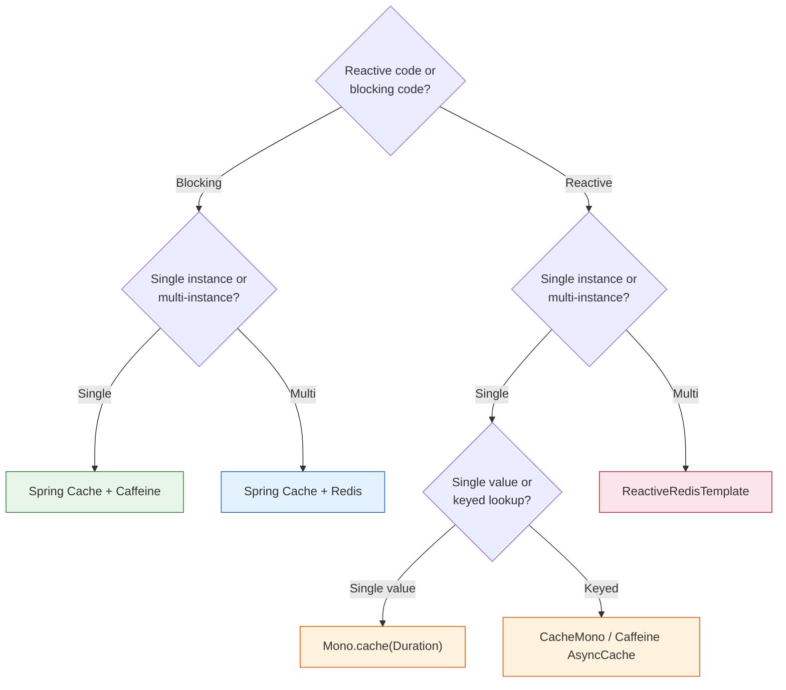

# Cache Configuration in Spring Boot — Caffeine, Redis, and Reactive Caching

**Date:** 2026-04-15 | **Updated:** 2026-04-15
**Tags:** `cache` `caffeine` `redis` `spring-cache` `reactive` `configuration`

## Table of Contents

- [Summary](#summary)
- [The Big Caveat: Spring Cache and Reactive](#the-big-caveat-spring-cache-and-reactive)
- [Spring Cache Abstraction](#spring-cache-abstraction)
  - [@EnableCaching and Annotations](#enablecaching-and-annotations)
  - [Cache Manager](#cache-manager)
  - [SpEL in Cache Annotations](#spel-in-cache-annotations)
- [Caffeine — In-Memory Cache](#caffeine--in-memory-cache)
  - [Setup](#setup)
  - [Basic Configuration](#basic-configuration)
  - [Per-Cache Configuration](#per-cache-configuration)
  - [Async Loading](#async-loading)
- [Redis — Distributed Cache](#redis--distributed-cache)
  - [Reactive Redis Setup](#reactive-redis-setup)
  - [ReactiveRedisTemplate](#reactiveredistemplate)
  - [Custom Serialization](#custom-serialization)
  - [Spring Cache + Redis](#spring-cache--redis)
- [Reactive-Native Caching](#reactive-native-caching)
  - [Mono.cache()](#monocache)
  - [CacheMono from reactor-extra](#cachemono-from-reactor-extra)
  - [Manual Caching with ConcurrentHashMap](#manual-caching-with-concurrenthashmap)
- [Choosing the Right Approach](#choosing-the-right-approach)
- [Complete Example: Hybrid Caffeine + Redis](#complete-example-hybrid-caffeine--redis)
- [Related](#related)
- [References](#references)

---

## Summary

Spring Boot supports the [Spring Cache abstraction](https://docs.spring.io/spring-framework/reference/integration/cache.html) (`@Cacheable`, `@CacheEvict`) backed by [Caffeine](https://github.com/ben-manes/caffeine/wiki) for in-memory caching or [Redis](https://docs.spring.io/spring-data/redis/reference/redis.html) for distributed caching, but the annotation-based abstraction has limitations with reactive types — for fully reactive code prefer reactor-native operators like [`Mono.cache()`](https://projectreactor.io/docs/core/release/api/reactor/core/publisher/Mono.html) and [`CacheMono`](https://projectreactor.io/docs/extra/release/api/reactor/cache/CacheMono.html) from reactor-extra, or use `ReactiveRedisTemplate` directly.

---

## The Big Caveat: Spring Cache and Reactive

`@Cacheable` was designed for blocking code. It caches the **return value** of a method. With reactive code, the return value is the `Mono`/`Flux` itself — not the eventual emission.

**Wrong assumption (Spring Cache):**

```java
@Cacheable("movies")
public Mono<Movie> getMovie(String id) {
    return movieRepository.findById(id);
}
// Caches the Mono publisher, NOT the Movie object
// Subscribers re-execute findById each time!
```

This subtly breaks: the cache stores the `Mono` reference, but each subscription re-runs the underlying query.

**As of Spring Framework 6.1 / Spring Boot 3.2+**, the annotation-based cache abstraction has [improved support for reactive return types via the `CacheManager`'s `retrieve` method](https://docs.spring.io/spring-framework/reference/integration/cache.html), but it requires opt-in and works only with specific cache providers.

**Recommendation hierarchy for reactive caching:**

1. **`Mono.cache(Duration)`** — for caching a single Mono with TTL
2. **`CacheMono` / `CacheFlux`** from reactor-extra — for keyed caching with custom storage
3. **`ReactiveRedisTemplate`** — for distributed caching with full reactive integration
4. **Spring Cache + Caffeine** — for non-reactive code OR with `CacheManager.retrieve` opt-in

---

## Spring Cache Abstraction

### @EnableCaching and Annotations

```java
@SpringBootApplication
@EnableCaching
public class Application { }
```

```java
@Service
public class CategoryService {

    @Cacheable("categories")
    public List<Category> getAllCategories() {
        return categoryRepository.findAll();   // Blocking — fine for @Cacheable
    }

    @Cacheable(value = "categories", key = "#id")
    public Category getCategory(Long id) {
        return categoryRepository.findById(id).orElseThrow();
    }

    @CachePut(value = "categories", key = "#category.id")
    public Category updateCategory(Category category) {
        return categoryRepository.save(category);  // Cache the new value
    }

    @CacheEvict(value = "categories", key = "#id")
    public void deleteCategory(Long id) {
        categoryRepository.deleteById(id);
    }

    @CacheEvict(value = "categories", allEntries = true)
    public void clearAll() { }
}
```

### Cache Manager

The [`CacheManager`](https://docs.spring.io/spring-framework/reference/integration/cache/store-configuration.html) is the abstraction over the storage backend. Spring Boot auto-configures one based on what's on the classpath.

| Backend | Spring Boot Starter | Use Case |
|---------|--------------------|----------|
| ConcurrentMap | (default, no starter) | Tests, demos — never production |
| Caffeine | `caffeine` on classpath | Single-instance apps, fastest |
| Redis | `spring-boot-starter-data-redis` | Multi-instance / distributed |
| Hazelcast | `spring-boot-starter-data-hazelcast` | In-memory grid |
| EhCache 3 | `org.ehcache:ehcache` | JSR-107, on-disk persistence |

### SpEL in Cache Annotations

```java
// Compose key from multiple parameters
@Cacheable(value = "movies", key = "#userId + ':' + #movieId")
public Movie getMovieForUser(String userId, String movieId) { ... }

// Skip caching based on result
@Cacheable(value = "movies", key = "#id", unless = "#result == null")
public Movie getMovie(String id) { ... }

// Skip caching based on input
@Cacheable(value = "movies", key = "#id", condition = "#id.length() > 3")
public Movie getMovie(String id) { ... }
```

---

## Caffeine — In-Memory Cache

[Caffeine](https://github.com/ben-manes/caffeine/wiki) is a high-performance, near-optimal Java cache library. It's the de facto choice for in-process caching.

### Setup

```xml
<dependency>
    <groupId>org.springframework.boot</groupId>
    <artifactId>spring-boot-starter-cache</artifactId>
</dependency>
<dependency>
    <groupId>com.github.ben-manes.caffeine</groupId>
    <artifactId>caffeine</artifactId>
</dependency>
```

### Basic Configuration

The simplest setup uses `spring.cache.*` properties:

```yaml
spring:
  cache:
    type: caffeine
    cache-names: movies, categories, users
    caffeine:
      spec: maximumSize=1000,expireAfterWrite=10m,recordStats
```

This creates 3 caches, each with the same configuration.

### Per-Cache Configuration

For different settings per cache, configure programmatically:

```java
@Configuration
@EnableCaching
public class CacheConfig {

    @Bean
    public CacheManager cacheManager() {
        CaffeineCacheManager manager = new CaffeineCacheManager();

        // Default for caches not explicitly registered
        manager.setCaffeine(Caffeine.newBuilder()
            .maximumSize(500)
            .expireAfterWrite(Duration.ofMinutes(5))
            .recordStats());

        // Per-cache builders via custom bean
        return manager;
    }

    @Bean
    public CacheManager customCacheManager() {
        SimpleCacheManager manager = new SimpleCacheManager();
        manager.setCaches(List.of(
            buildCache("movies", 10_000, Duration.ofHours(1)),
            buildCache("categories", 100, Duration.ofDays(1)),
            buildCache("users", 1_000, Duration.ofMinutes(15))
        ));
        return manager;
    }

    private CaffeineCache buildCache(String name, long maxSize, Duration ttl) {
        return new CaffeineCache(name,
            Caffeine.newBuilder()
                .maximumSize(maxSize)
                .expireAfterWrite(ttl)
                .recordStats()
                .build());
    }
}
```

### Async Loading

For loading values asynchronously (avoids cache stampede):

```java
LoadingCache<String, Movie> cache = Caffeine.newBuilder()
    .maximumSize(10_000)
    .expireAfterWrite(Duration.ofMinutes(10))
    .build(key -> movieRepository.findById(key).block());  // Sync loader

AsyncLoadingCache<String, Movie> asyncCache = Caffeine.newBuilder()
    .maximumSize(10_000)
    .buildAsync(key -> movieRepository.findById(key).toFuture());  // Async loader
```

For reactive code, use `AsyncCache` and adapt with `Mono.fromFuture`:

```java
@Service
public class MovieCacheService {
    private final AsyncCache<String, Movie> cache = Caffeine.newBuilder()
        .maximumSize(10_000)
        .expireAfterWrite(Duration.ofMinutes(10))
        .buildAsync();

    private final MovieRepository repository;

    public Mono<Movie> getMovie(String id) {
        return Mono.fromFuture(cache.get(id, k ->
            repository.findById(k).toFuture()));
    }

    public void invalidate(String id) {
        cache.synchronous().invalidate(id);
    }
}
```

---

## Redis — Distributed Cache

For multi-instance deployments where caches must be shared, use Redis.

### Reactive Redis Setup

```xml
<dependency>
    <groupId>org.springframework.boot</groupId>
    <artifactId>spring-boot-starter-data-redis-reactive</artifactId>
</dependency>
```

```yaml
spring:
  data:
    redis:
      host: localhost
      port: 6379
      password: ${REDIS_PASSWORD:}
      timeout: 2s
      lettuce:
        pool:
          enabled: true
          max-active: 16
          max-idle: 8
          min-idle: 0
          max-wait: 1s
```

### ReactiveRedisTemplate

The reactive equivalent of `RedisTemplate`. Spring Boot auto-configures one for `String` keys/values:

```java
@Service
public class CacheService {
    private final ReactiveRedisTemplate<String, String> redis;

    public Mono<String> get(String key) {
        return redis.opsForValue().get(key);
    }

    public Mono<Boolean> set(String key, String value, Duration ttl) {
        return redis.opsForValue().set(key, value, ttl);
    }

    public Mono<Long> delete(String key) {
        return redis.delete(key);
    }
}
```

### Custom Serialization

For typed objects, configure a custom template:

```java
@Configuration
public class RedisConfig {

    @Bean
    public ReactiveRedisTemplate<String, Movie> movieRedisTemplate(
            ReactiveRedisConnectionFactory factory,
            ObjectMapper objectMapper) {

        Jackson2JsonRedisSerializer<Movie> serializer =
            new Jackson2JsonRedisSerializer<>(objectMapper, Movie.class);

        RedisSerializationContext<String, Movie> context =
            RedisSerializationContext.<String, Movie>newSerializationContext(
                    new StringRedisSerializer())
                .value(serializer)
                .build();

        return new ReactiveRedisTemplate<>(factory, context);
    }
}
```

Cache wrapper using the typed template:

```java
@Service
public class MovieCacheService {
    private final ReactiveRedisTemplate<String, Movie> redis;
    private final MovieRepository repository;
    private static final Duration TTL = Duration.ofHours(1);

    public Mono<Movie> getMovie(String id) {
        String key = "movie:" + id;
        return redis.opsForValue().get(key)
            .switchIfEmpty(repository.findById(id)
                .flatMap(movie -> redis.opsForValue()
                    .set(key, movie, TTL)
                    .thenReturn(movie)));
    }

    public Mono<Boolean> evict(String id) {
        return redis.delete("movie:" + id).map(count -> count > 0);
    }
}
```

### Spring Cache + Redis

For non-reactive code, use Redis as a `CacheManager`:

```yaml
spring:
  cache:
    type: redis
    redis:
      time-to-live: 1h
      cache-null-values: false
      use-key-prefix: true
      key-prefix: "movies:"
```

```java
@Cacheable("movies")
public Movie getMovie(Long id) {  // Blocking method
    return repository.findById(id).orElseThrow();
}
```

---

## Reactive-Native Caching

For reactive code, prefer these patterns over Spring Cache annotations.

### Mono.cache()

Caches a single `Mono`'s emission for the lifetime of the publisher (or until TTL):

```java
// Cache the result for 5 minutes from first subscription
Mono<Config> configMono = loadConfigFromDb()
    .cache(Duration.ofMinutes(5));

// First subscriber triggers loadConfigFromDb()
configMono.subscribe(c -> use(c));
// Subsequent subscribers within 5 minutes get the cached value (no re-fetch)
configMono.subscribe(c -> use(c));
```

**Key behaviors:**
- The first subscription triggers the source and caches the result
- Subsequent subscriptions get the cached value
- After TTL expires, the next subscription re-fetches
- Errors are NOT cached by default (next subscription retries)

To cache errors too:

```java
mono.cache(value -> Duration.ofMinutes(5),
           error -> Duration.ofSeconds(30),
           () -> Duration.ofMinutes(5));
```

### CacheMono from reactor-extra

For keyed caching with a custom storage backend:

```xml
<dependency>
    <groupId>io.projectreactor.addons</groupId>
    <artifactId>reactor-extra</artifactId>
</dependency>
```

```java
ConcurrentMap<String, Movie> store = new ConcurrentHashMap<>();

public Mono<Movie> getMovie(String id) {
    return CacheMono
        .lookup(store, id)
        .onCacheMissResume(() -> repository.findById(id));
}
```

For more complex storage:

```java
public Mono<Movie> getMovie(String id) {
    return CacheMono
        .lookup(key -> Mono.justOrEmpty(localCache.getIfPresent(key))
            .map(value -> Signal.next(value)),
            id)
        .onCacheMissResume(() -> repository.findById(id))
        .andWriteWith((key, signal) -> Mono.fromRunnable(() -> {
            if (signal.isOnNext()) {
                localCache.put(key, signal.get());
            }
        }));
}
```

### Manual Caching with ConcurrentHashMap

For simple cases, just use a map:

```java
@Service
public class MovieService {
    private final Map<String, Mono<Movie>> cache = new ConcurrentHashMap<>();
    private final MovieRepository repository;

    public Mono<Movie> getMovie(String id) {
        return cache.computeIfAbsent(id, key ->
            repository.findById(key)
                .cache(Duration.ofMinutes(10)));  // Cache each Mono with TTL
    }

    public void invalidate(String id) {
        cache.remove(id);
    }
}
```

**Caveat:** This map grows unbounded. Use Caffeine for bounded caches with eviction policies.

---

## Choosing the Right Approach



| Use Case | Recommended Approach |
|----------|---------------------|
| Cache a config Mono once at startup | `Mono.cache(Duration)` |
| Cache reactive lookups by key, single instance | Caffeine `AsyncCache` adapted to `Mono` |
| Cache reactive lookups by key, multi-instance | `ReactiveRedisTemplate` directly |
| Cache blocking lookups, single instance | `@Cacheable` + Caffeine |
| Cache blocking lookups, multi-instance | `@Cacheable` + Redis |
| Two-layer cache (local + distributed) | Caffeine local + Redis distributed (custom service) |

---

## Complete Example: Hybrid Caffeine + Redis

A production pattern: small local Caffeine cache for hot data, Redis as the source of truth across instances.

```java
@Service
public class HybridMovieCache {

    private final AsyncCache<String, Movie> local;
    private final ReactiveRedisTemplate<String, Movie> redis;
    private final MovieRepository repository;

    public HybridMovieCache(ReactiveRedisTemplate<String, Movie> redis,
                            MovieRepository repository) {
        this.local = Caffeine.newBuilder()
            .maximumSize(1_000)
            .expireAfterWrite(Duration.ofMinutes(2))
            .recordStats()
            .buildAsync();
        this.redis = redis;
        this.repository = repository;
    }

    public Mono<Movie> getMovie(String id) {
        // 1. Check local Caffeine cache
        CompletableFuture<Movie> localValue = local.getIfPresent(id);
        if (localValue != null) {
            return Mono.fromFuture(localValue);
        }

        // 2. Check Redis
        return redis.opsForValue().get("movie:" + id)
            .doOnNext(movie -> local.put(id,
                CompletableFuture.completedFuture(movie)))
            .switchIfEmpty(loadAndCache(id));
    }

    private Mono<Movie> loadAndCache(String id) {
        // 3. Load from DB, populate both caches
        return repository.findById(id)
            .flatMap(movie -> redis.opsForValue()
                .set("movie:" + id, movie, Duration.ofHours(1))
                .doOnSuccess(b -> local.put(id,
                    CompletableFuture.completedFuture(movie)))
                .thenReturn(movie));
    }

    public Mono<Void> invalidate(String id) {
        local.synchronous().invalidate(id);
        return redis.delete("movie:" + id).then();
    }
}
```

```yaml
spring:
  data:
    redis:
      host: ${REDIS_HOST:localhost}
      port: ${REDIS_PORT:6379}
      timeout: 2s
      lettuce:
        pool:
          max-active: 16
          max-idle: 8
```

---

## Related

- [Caching Deep Dive](../data-repositories/caching-deep-dive.md) — invalidation strategies, stampede prevention, Redis patterns, CDN, Caffeine tuning.
- [Database Configuration](database-config.md) — pairs naturally with caching for reducing DB load.
- [WebClient Configuration](webclient-config.md) — caching expensive HTTP responses.
- [Reactive Observability](../reactive-observability.md) — exposing cache hit/miss metrics via Micrometer.
- [Scaling MVC Before Virtual Threads](../web-layer/mvc-high-throughput.md) — caching as the first throughput lever.

## References

- [Cache Abstraction — Spring Framework](https://docs.spring.io/spring-framework/reference/integration/cache.html) — @Cacheable, @CacheEvict, @CachePut, CacheManager
- [Configuring the Cache Storage — Spring Framework](https://docs.spring.io/spring-framework/reference/integration/cache/store-configuration.html) — backend setup for ConcurrentMap, Caffeine, EhCache, JSR-107
- [Caching — Spring Boot Reference](https://docs.spring.io/spring-boot/reference/io/caching.html) — auto-configuration for cache providers and `spring.cache.*` properties
- [Caffeine Wiki — GitHub](https://github.com/ben-manes/caffeine/wiki) — eviction policies, async loading, statistics
- [Spring Data Redis Reference](https://docs.spring.io/spring-data/redis/reference/redis.html) — ReactiveRedisTemplate, Lettuce driver, reactive operations
- [CacheMono API — reactor-extra](https://projectreactor.io/docs/extra/release/api/reactor/cache/CacheMono.html) — keyed caching helper with pluggable storage
- [Mono.cache() API — reactor-core](https://projectreactor.io/docs/core/release/api/reactor/core/publisher/Mono.html) — Mono.cache() and Mono.cache(Duration) for hot-source replay caching
