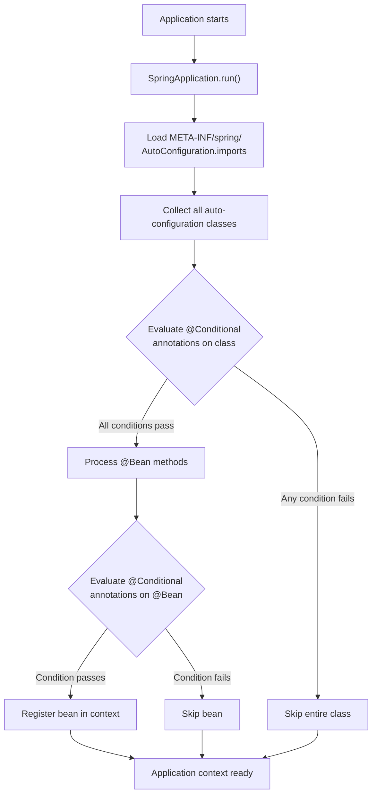
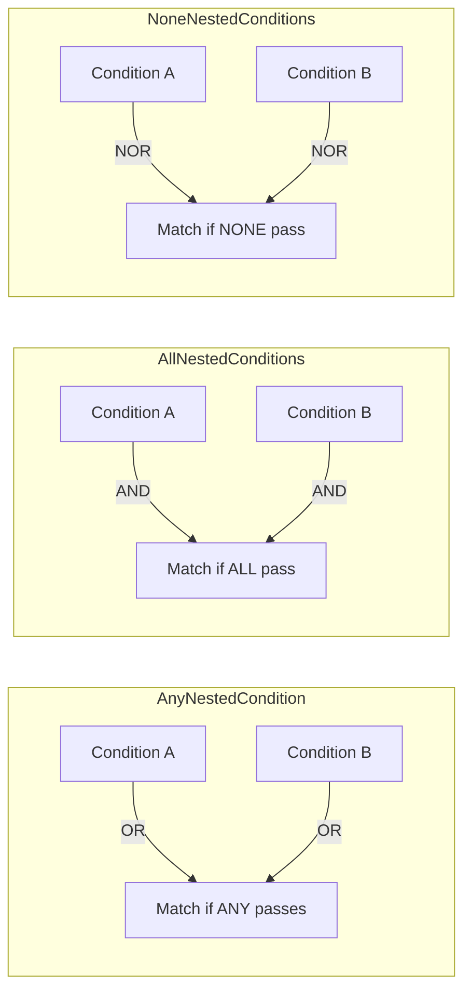

# Conditional Beans and Custom Auto-Configuration in Spring Boot

**Date:** 2026-04-17 | **Updated:** 2026-04-17
**Tags:** `spring-boot` `auto-configuration` `conditional` `starter` `beans`

## Table of Contents

- [Summary](#summary)
- [How Auto-Configuration Works](#how-auto-configuration-works)
  - [The Discovery Pipeline](#the-discovery-pipeline)
  - [The Opt-Out Design](#the-opt-out-design)
- [All Conditional Annotations](#all-conditional-annotations)
  - [@ConditionalOnClass / @ConditionalOnMissingClass](#conditionalonclass--conditionalonmissingclass)
  - [@ConditionalOnBean / @ConditionalOnMissingBean](#conditionalonbean--conditionalonmissingbean)
  - [@ConditionalOnProperty](#conditionalonproperty)
  - [@ConditionalOnResource](#conditionalonresource)
  - [@ConditionalOnWebApplication / @ConditionalOnNotWebApplication](#conditionalonwebapplication--conditionalonnotwebapplication)
- [@ConditionalOnProperty Deep Dive](#conditionalonproperty-deep-dive)
  - [Attribute Breakdown](#attribute-breakdown)
  - [Feature Toggles Pattern](#feature-toggles-pattern)
- [Writing a Custom @AutoConfiguration](#writing-a-custom-autoconfiguration)
  - [The Auto-Configuration Class](#the-auto-configuration-class)
  - [Registering the Auto-Configuration](#registering-the-auto-configuration)
- [@ConfigurationProperties for Auto-Config](#configurationproperties-for-auto-config)
  - [Immutable Binding with Records](#immutable-binding-with-records)
  - [Nested Properties](#nested-properties)
- [Ordering Auto-Configuration](#ordering-auto-configuration)
- [Writing a Custom Condition](#writing-a-custom-condition)
  - [Implementing the Condition Interface](#implementing-the-condition-interface)
  - [Creating a Reusable Conditional Annotation](#creating-a-reusable-conditional-annotation)
- [Composed Conditions](#composed-conditions)
- [Building a Reusable Starter](#building-a-reusable-starter)
  - [Module Structure](#module-structure)
  - [Starter pom.xml](#starter-pomxml)
  - [Autoconfigure Module](#autoconfigure-module)
- [Debugging Auto-Configuration](#debugging-auto-configuration)
  - [ConditionEvaluationReport via --debug](#conditionevaluationreport-via---debug)
  - [Actuator Conditions Endpoint](#actuator-conditions-endpoint)
  - [Programmatic Inspection](#programmatic-inspection)
- [Related](#related)
- [References](#references)

---

## Summary

Auto-configuration is Spring Boot's mechanism for registering beans conditionally based on classpath contents, existing beans, and property values. Understanding it demystifies the "magic" behind starter dependencies and lets you write your own auto-configurations for shared libraries.

This doc deepens the conditional coverage introduced in [Java Bean Configuration](java-bean-config.md), which covers `@ConditionalOnProperty`, `@ConditionalOnMissingBean`, and basic auto-configuration creation. Here we explore every conditional annotation in detail, show how to compose conditions, build a reusable starter module, and debug auto-configuration decisions.

---

## How Auto-Configuration Works

### The Discovery Pipeline

Spring Boot discovers and evaluates auto-configuration classes through a well-defined pipeline at application startup.



Key points:

1. Spring Boot reads the file `META-INF/spring/org.springframework.boot.autoconfigure.AutoConfiguration.imports` from every jar on the classpath
2. Each fully-qualified class name listed in that file is a candidate auto-configuration
3. Class-level `@Conditional` annotations are evaluated first -- if any fail, the entire class is skipped
4. Method-level `@Conditional` annotations on individual `@Bean` methods are evaluated next
5. Beans that pass all conditions are registered in the application context

### The Opt-Out Design

Auto-configuration follows an **opt-out** philosophy: it provides sensible defaults that you override by defining your own beans. This is why `@ConditionalOnMissingBean` appears on nearly every auto-configured bean -- your explicit bean definition always wins.

```java
// Spring Boot's DataSourceAutoConfiguration (simplified)
@AutoConfiguration
@ConditionalOnClass(DataSource.class)
public class DataSourceAutoConfiguration {

    @Bean
    @ConditionalOnMissingBean(DataSource.class)  // Your bean takes priority
    public DataSource dataSource(DataSourceProperties properties) {
        return properties.initializeDataSourceBuilder().build();
    }
}
```

If you define your own `DataSource` bean in a `@Configuration` class, the auto-configured one backs off.

---

## All Conditional Annotations

The table below lists every built-in conditional annotation in Spring Boot. The [Java Bean Configuration](java-bean-config.md#conditional-configuration) doc covers the top three briefly; this section provides complete coverage.

| Annotation | Condition |
|-----------|-----------|
| `@ConditionalOnClass` | Specified class is on the classpath |
| `@ConditionalOnMissingClass` | Specified class is NOT on the classpath |
| `@ConditionalOnBean` | Bean of specified type exists in the context |
| `@ConditionalOnMissingBean` | Bean of specified type does NOT exist in the context |
| `@ConditionalOnProperty` | Property has a specific value (or exists) |
| `@ConditionalOnResource` | Resource exists on the classpath |
| `@ConditionalOnWebApplication` | Application is a web application (servlet or reactive) |
| `@ConditionalOnNotWebApplication` | Application is NOT a web application |
| `@ConditionalOnExpression` | SpEL expression evaluates to `true` |
| `@ConditionalOnJava` | Running on a specific Java version (or range) |
| `@ConditionalOnSingleCandidate` | Exactly one bean of the specified type exists (or one is `@Primary`) |

### @ConditionalOnClass / @ConditionalOnMissingClass

Guard configuration based on whether a library is available at runtime.

```java
@AutoConfiguration
@ConditionalOnClass(name = "io.lettuce.core.RedisClient")
public class LettuceAutoConfiguration {

    @Bean
    @ConditionalOnMissingBean
    public RedisConnectionFactory lettuceConnectionFactory() {
        return new LettuceConnectionFactory();
    }
}
```

Use the `name` attribute (String) instead of `value` (Class) when the class may not be on the classpath at compile time. The String form avoids `ClassNotFoundException` during annotation processing.

### @ConditionalOnBean / @ConditionalOnMissingBean

Control bean registration order based on what already exists in the context.

```java
@Configuration
public class MetricsConfig {

    @Bean
    @ConditionalOnBean(MeterRegistry.class)  // Only if Micrometer is wired up
    public CustomMetricsExporter metricsExporter(MeterRegistry registry) {
        return new CustomMetricsExporter(registry);
    }

    @Bean
    @ConditionalOnMissingBean(HealthIndicator.class)
    public HealthIndicator defaultHealthIndicator() {
        return new SimpleHealthIndicator();
    }
}
```

Ordering matters: `@ConditionalOnBean` evaluates against beans already registered. Auto-configurations that depend on user beans are loaded after user `@Configuration` classes by design.

### @ConditionalOnProperty

The most commonly used conditional. See the [deep dive](#conditionalonproperty-deep-dive) section below.

### @ConditionalOnResource

Activate when a specific file is available on the classpath.

```java
@Configuration
@ConditionalOnResource(resources = "classpath:custom-queries.xml")
public class CustomQueryConfig {

    @Bean
    public QueryLoader queryLoader() {
        return new XmlQueryLoader("classpath:custom-queries.xml");
    }
}
```

### @ConditionalOnWebApplication / @ConditionalOnNotWebApplication

Distinguish between web and non-web contexts. In Spring Boot, web application detection checks for `SERVLET` or `REACTIVE` types.

```java
@Configuration
@ConditionalOnWebApplication(type = ConditionalOnWebApplication.Type.REACTIVE)
public class ReactiveSecurityConfig {
    // Beans specific to WebFlux applications
}

@Configuration
@ConditionalOnNotWebApplication
public class BatchJobConfig {
    // Beans for CLI or batch apps with no web layer
}
```

---

## @ConditionalOnProperty Deep Dive

`@ConditionalOnProperty` is the workhorse annotation for feature flags, environment-specific wiring, and opt-in/opt-out behavior. The [Java Bean Configuration](java-bean-config.md#conditionalonproperty) doc introduces it; here we cover every attribute.

### Attribute Breakdown

```java
@ConditionalOnProperty(
    prefix = "feature.email",     // Property prefix
    name = "enabled",             // Property name (combined: feature.email.enabled)
    havingValue = "true",         // Expected value
    matchIfMissing = false        // Behavior when property is absent
)
```

| Attribute | Purpose | Default |
|-----------|---------|---------|
| `prefix` | Common prefix for property names | `""` |
| `name` / `value` | Property name(s) to check (appended to prefix) | required |
| `havingValue` | The value the property must have | `""` (any non-false value) |
| `matchIfMissing` | Match when the property is not set at all | `false` |

When `havingValue` is unset, the condition passes if the property exists and is not `"false"`. This is a common source of confusion -- an empty string or any truthy value will match.

### Feature Toggles Pattern

Use `@ConditionalOnProperty` as lightweight feature toggles without a feature flag library.

```java
@Configuration
public class NotificationConfig {

    @Bean
    @ConditionalOnProperty(name = "feature.email.enabled", havingValue = "true",
                           matchIfMissing = false)
    public NotificationSender emailSender(JavaMailSender mailer) {
        return new EmailNotificationSender(mailer);
    }

    @Bean
    @ConditionalOnProperty(name = "feature.sms.enabled", havingValue = "true",
                           matchIfMissing = false)
    public NotificationSender smsSender(SmsGateway gateway) {
        return new SmsNotificationSender(gateway);
    }

    @Bean
    @ConditionalOnProperty(name = "feature.email.enabled", havingValue = "false",
                           matchIfMissing = true)
    public NotificationSender noopSender() {
        return new NoopNotificationSender();  // Default fallback
    }
}
```

```yaml
feature:
  email:
    enabled: true
  sms:
    enabled: false
```

---

## Writing a Custom @AutoConfiguration

Spring Boot 3.x introduced `@AutoConfiguration` as the dedicated annotation for auto-configuration classes, replacing the previous pattern of `@Configuration` plus registration in `spring.factories`.

### The Auto-Configuration Class

```java
@AutoConfiguration
@ConditionalOnClass(MyLibraryClient.class)
@EnableConfigurationProperties(MyLibraryProperties.class)
public class MyLibraryAutoConfiguration {

    @Bean
    @ConditionalOnMissingBean
    public MyLibraryClient myLibraryClient(MyLibraryProperties props) {
        return new MyLibraryClient(props.getApiKey(), props.getBaseUrl());
    }

    @Bean
    @ConditionalOnMissingBean
    @ConditionalOnProperty(name = "mylib.metrics.enabled", havingValue = "true",
                           matchIfMissing = true)
    public MyLibraryMetrics myLibraryMetrics(MyLibraryClient client,
                                              MeterRegistry registry) {
        return new MyLibraryMetrics(client, registry);
    }
}
```

Key conventions:

- Use `@AutoConfiguration`, not `@Configuration`, for auto-config classes
- Always use `@ConditionalOnMissingBean` on `@Bean` methods so users can override
- Guard the class with `@ConditionalOnClass` for the main library type
- Bind properties via `@EnableConfigurationProperties`

### Registering the Auto-Configuration

Create the file `META-INF/spring/org.springframework.boot.autoconfigure.AutoConfiguration.imports` in `src/main/resources`:

```text
com.example.mylib.autoconfigure.MyLibraryAutoConfiguration
```

One fully-qualified class name per line. No commas, no other delimiters.

> **Note:** The legacy `spring.factories` registration under `EnableAutoConfiguration` still works in Spring Boot 3.x but is deprecated. New auto-configurations should use the `.imports` file exclusively.

---

## @ConfigurationProperties for Auto-Config

Type-safe configuration binding is the standard approach for auto-configuration properties. This pairs with the externalized configuration concepts in [Externalized Configuration](externalized-config.md).

```java
@ConfigurationProperties(prefix = "mylib")
public class MyLibraryProperties {

    private String apiKey;
    private String baseUrl = "https://api.mylib.com";
    private Duration connectTimeout = Duration.ofSeconds(5);
    private int maxRetries = 3;

    // Getters and setters
    public String getApiKey() { return apiKey; }
    public void setApiKey(String apiKey) { this.apiKey = apiKey; }

    public String getBaseUrl() { return baseUrl; }
    public void setBaseUrl(String baseUrl) { this.baseUrl = baseUrl; }

    public Duration getConnectTimeout() { return connectTimeout; }
    public void setConnectTimeout(Duration connectTimeout) {
        this.connectTimeout = connectTimeout;
    }

    public int getMaxRetries() { return maxRetries; }
    public void setMaxRetries(int maxRetries) { this.maxRetries = maxRetries; }
}
```

### Immutable Binding with Records

Spring Boot 3.x supports constructor binding, which pairs well with Java records:

```java
@ConfigurationProperties(prefix = "mylib")
public record MyLibraryProperties(
    String apiKey,
    @DefaultValue("https://api.mylib.com") String baseUrl,
    @DefaultValue("5s") Duration connectTimeout,
    @DefaultValue("3") int maxRetries
) {}
```

Records are immutable by nature -- the bound properties object cannot be mutated after construction.

### Nested Properties

Complex configurations can nest naturally:

```java
@ConfigurationProperties(prefix = "mylib")
public class MyLibraryProperties {

    private String apiKey;
    private final Retry retry = new Retry();

    public static class Retry {
        private int maxAttempts = 3;
        private Duration backoff = Duration.ofMillis(500);
        // getters/setters
    }

    // getters/setters
}
```

```yaml
mylib:
  api-key: ${MYLIB_API_KEY}
  retry:
    max-attempts: 5
    backoff: 1s
```

---

## Ordering Auto-Configuration

When your auto-configuration depends on beans from another auto-configuration, use ordering annotations.

```java
@AutoConfiguration(
    after = DataSourceAutoConfiguration.class,
    before = FlywayAutoConfiguration.class
)
@ConditionalOnBean(DataSource.class)
public class CustomMigrationAutoConfiguration {
    // Runs after DataSource is configured but before Flyway
}
```

| Annotation / Attribute | Purpose |
|------------------------|---------|
| `@AutoConfiguration(after = ...)` | Run after the specified auto-configuration |
| `@AutoConfiguration(before = ...)` | Run before the specified auto-configuration |
| `@AutoConfigureOrder(value)` | Numeric ordering (lower = earlier, default `0`) |

Ordering controls the **evaluation sequence**, not dependency injection. It determines which auto-configuration classes are processed first, which affects which beans are already registered when `@ConditionalOnBean` / `@ConditionalOnMissingBean` is evaluated.

> User-defined `@Configuration` classes always run before auto-configurations. This is why your explicit beans override auto-configured defaults.

---

## Writing a Custom Condition

When the built-in `@ConditionalOn...` annotations are insufficient, implement the `Condition` interface.

### Implementing the Condition Interface

```java
public class OnLinuxCondition implements Condition {

    @Override
    public boolean matches(ConditionContext context, AnnotatedTypeMetadata metadata) {
        String osName = context.getEnvironment()
            .getProperty("os.name", "unknown");
        return osName.toLowerCase().contains("linux");
    }
}
```

Use it directly with `@Conditional`:

```java
@Bean
@Conditional(OnLinuxCondition.class)
public LinuxSpecificService linuxService() {
    return new LinuxSpecificService();
}
```

The `ConditionContext` provides access to:

- `getEnvironment()` -- read properties and profiles
- `getBeanFactory()` -- inspect existing bean definitions
- `getClassLoader()` -- check classpath presence
- `getResourceLoader()` -- check resource availability
- `getRegistry()` -- read bean definition metadata

### Creating a Reusable Conditional Annotation

Wrap the condition in a meta-annotation for clean reuse:

```java
@Target({ElementType.TYPE, ElementType.METHOD})
@Retention(RetentionPolicy.RUNTIME)
@Conditional(OnLinuxCondition.class)
public @interface ConditionalOnLinux {
}
```

Now use it like the built-in conditionals:

```java
@Bean
@ConditionalOnLinux
public LinuxSpecificService linuxService() {
    return new LinuxSpecificService();
}
```

For more sophisticated conditions, extend `SpringBootCondition` instead of implementing `Condition` directly. It adds structured logging to the condition evaluation report:

```java
public class OnFeatureFlagCondition extends SpringBootCondition {

    @Override
    public ConditionOutcome getMatchOutcome(ConditionContext context,
                                             AnnotatedTypeMetadata metadata) {
        String flag = attribute(metadata, "value");
        boolean enabled = context.getEnvironment()
            .getProperty("flags." + flag, Boolean.class, false);

        if (enabled) {
            return ConditionOutcome.match("Feature flag '" + flag + "' is enabled");
        }
        return ConditionOutcome.noMatch("Feature flag '" + flag + "' is disabled");
    }
}
```

---

## Composed Conditions

Spring Boot provides three abstract classes for combining multiple conditions with logical operators.



**Example:** A bean that activates when Redis OR Hazelcast is on the classpath:

```java
public class OnAnyCacheProviderCondition extends AnyNestedCondition {

    public OnAnyCacheProviderCondition() {
        super(ConfigurationPhase.REGISTER_BEAN);
    }

    @ConditionalOnClass(name = "io.lettuce.core.RedisClient")
    static class RedisCondition {}

    @ConditionalOnClass(name = "com.hazelcast.core.HazelcastInstance")
    static class HazelcastCondition {}
}

@Configuration
@Conditional(OnAnyCacheProviderCondition.class)
public class CacheExporterConfig {
    // Activates if Redis OR Hazelcast is available
}
```

`ConfigurationPhase` controls when the condition is evaluated:

| Phase | Evaluates when... |
|-------|-------------------|
| `PARSE_CONFIGURATION` | Deciding whether to parse the `@Configuration` class at all |
| `REGISTER_BEAN` | Deciding whether to register an individual `@Bean` |

---

## Building a Reusable Starter

A Spring Boot starter is a dependency that brings in auto-configuration and all required libraries with zero manual setup. The standard pattern uses two modules.

### Module Structure

```text
mylib-spring-boot/
├── mylib-spring-boot-autoconfigure/
│   ├── src/main/java/
│   │   └── com/example/mylib/autoconfigure/
│   │       ├── MyLibraryAutoConfiguration.java
│   │       └── MyLibraryProperties.java
│   ├── src/main/resources/
│   │   └── META-INF/spring/
│   │       └── org.springframework.boot.autoconfigure.AutoConfiguration.imports
│   └── pom.xml
├── mylib-spring-boot-starter/
│   └── pom.xml  (dependency-only, no source code)
└── pom.xml (parent)
```

**Why two modules?**

- `autoconfigure` contains all the logic: auto-configuration classes, properties, conditions
- `starter` is an empty aggregator that depends on `autoconfigure` plus the core library
- Users add a single `starter` dependency and get everything wired up
- This separation lets advanced users depend on `autoconfigure` alone and pick their own transitive dependency versions

### Starter pom.xml

The starter has no source code -- only dependency declarations:

```xml
<project>
    <artifactId>mylib-spring-boot-starter</artifactId>

    <dependencies>
        <dependency>
            <groupId>com.example</groupId>
            <artifactId>mylib-spring-boot-autoconfigure</artifactId>
            <version>${project.version}</version>
        </dependency>
        <dependency>
            <groupId>com.example</groupId>
            <artifactId>mylib-core</artifactId>
            <version>${mylib.version}</version>
        </dependency>
    </dependencies>
</project>
```

### Autoconfigure Module

The autoconfigure module uses `optional` dependencies so they don't leak to consumers:

```xml
<dependencies>
    <dependency>
        <groupId>org.springframework.boot</groupId>
        <artifactId>spring-boot-autoconfigure</artifactId>
    </dependency>
    <dependency>
        <groupId>com.example</groupId>
        <artifactId>mylib-core</artifactId>
        <version>${mylib.version}</version>
        <optional>true</optional>  <!-- Doesn't transitively pull in for consumers -->
    </dependency>
</dependencies>
```

Marking the core library as `optional` in the autoconfigure module is critical. Without it, adding the autoconfigure module would force the library on every consumer regardless of whether they use the starter.

---

## Debugging Auto-Configuration

When auto-configuration doesn't behave as expected, Spring Boot provides three diagnostic approaches.

### ConditionEvaluationReport via --debug

Run the application with the `--debug` flag or set `debug=true` in `application.properties`:

```bash
java -jar myapp.jar --debug
```

This prints the **ConditionEvaluationReport** at startup, showing every auto-configuration class and why it matched or was excluded:

```text
============================
CONDITIONS EVALUATION REPORT
============================

Positive matches:
-----------------
   DataSourceAutoConfiguration matched:
      - @ConditionalOnClass found required classes 'javax.sql.DataSource',
        'org.springframework.jdbc.datasource.embedded.EmbeddedDatabaseType'

Negative matches:
-----------------
   ActiveMQAutoConfiguration:
      Did not match:
         - @ConditionalOnClass did not find required class
           'jakarta.jms.ConnectionFactory'
```

### Actuator Conditions Endpoint

If Spring Boot Actuator is on the classpath, expose the `/actuator/conditions` endpoint:

```yaml
management:
  endpoints:
    web:
      exposure:
        include: conditions
```

This returns the same condition evaluation data as JSON, queryable at runtime without restarting.

### Programmatic Inspection

Inject the `ConditionEvaluationReport` bean to inspect conditions in code or tests:

```java
@SpringBootTest
class AutoConfigurationTest {

    @Autowired
    private ApplicationContext context;

    @Test
    void verifyMyLibraryAutoConfigurationLoaded() {
        ConditionEvaluationReport report = ConditionEvaluationReport
            .get((ConfigurableListableBeanFactory) context.getAutowireCapableBeanFactory());

        ConditionEvaluationReport.ConditionAndOutcomes outcomes =
            report.getConditionAndOutcomesBySource()
                .get("com.example.mylib.autoconfigure.MyLibraryAutoConfiguration");

        assertThat(outcomes).isNotNull();
        outcomes.forEach(conditionAndOutcome ->
            assertThat(conditionAndOutcome.getOutcome().isMatch()).isTrue()
        );
    }
}
```

This is especially useful in integration tests to verify that your auto-configuration activates (or backs off) under the correct conditions.

---

## Related

- [Java Bean Configuration](java-bean-config.md) -- @Configuration basics, @Bean, @Profile, and introductory conditional coverage
- [Externalized Configuration](externalized-config.md) -- property sources, profiles, and @ConfigurationProperties binding
- [Spring Fundamentals](../spring-fundamentals.md) -- application context lifecycle and auto-configuration overview

---

## References

- [Creating Your Own Auto-configuration -- Spring Boot](https://docs.spring.io/spring-boot/reference/features/developing-auto-configuration.html) -- official guide for @AutoConfiguration, conditions, and starters
- [Condition Annotations -- Spring Boot](https://docs.spring.io/spring-boot/reference/features/developing-auto-configuration.html#features.developing-auto-configuration.condition-annotations) -- complete list of built-in condition annotations
- [@ConditionalOnProperty Javadoc](https://docs.spring.io/spring-boot/api/java/org/springframework/boot/autoconfigure/condition/ConditionalOnProperty.html) -- havingValue, matchIfMissing semantics
- [@Conditional Javadoc -- Spring Framework](https://docs.spring.io/spring-framework/docs/current/javadoc-api/org/springframework/context/annotation/Conditional.html) -- the foundation annotation
- [Creating a Custom Starter -- Spring Boot](https://docs.spring.io/spring-boot/reference/features/developing-auto-configuration.html#features.developing-auto-configuration.custom-starter) -- module naming and structure conventions
