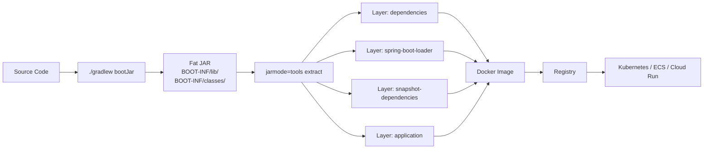

# Docker and Deployment for Spring Boot

**Date:** 2026-04-17
**Tags:** `spring-boot` `docker` `deployment` `containers` `graalvm`

## Table of Contents

1. [Summary](#summary)
2. [Why Docker for Spring Boot](#why-docker-for-spring-boot)
3. [The Fat JAR](#the-fat-jar)
4. [Naive Dockerfile (Anti-Pattern)](#naive-dockerfile-anti-pattern)
5. [Layered JARs](#layered-jars)
6. [Multi-Stage Dockerfile with Layered JAR](#multi-stage-dockerfile-with-layered-jar)
7. [Cloud Native Buildpacks](#cloud-native-buildpacks)
8. [Base Image Choice](#base-image-choice)
9. [Image Size Optimization](#image-size-optimization)
10. [JVM Flags for Containers](#jvm-flags-for-containers)
11. [Health Checks and Graceful Shutdown](#health-checks-and-graceful-shutdown)
12. [GraalVM Native Image](#graalvm-native-image)
13. [Configuration in Containers](#configuration-in-containers)
14. [Logging in Containers](#logging-in-containers)
15. [Common Pitfalls](#common-pitfalls)
16. [Related](#related)
17. [References](#references)

---

## Summary

Packaging a Spring Boot app for production means turning your code + dependencies
into a reproducible, isolated artifact that a cluster scheduler (Kubernetes,
ECS, Cloud Run, Nomad) can pull and run anywhere. This doc walks through:

- The **fat JAR** — what `bootJar` produces and why it's the right starting
  point.
- **Layered JARs** — Spring Boot's built-in support for splitting the JAR into
  cache-friendly layers.
- **Dockerfiles done right** — naive vs. multi-stage, why the first is slow and
  wasteful.
- **Cloud Native Buildpacks** — letting `bootBuildImage` build the image for
  you, no Dockerfile required.
- **JVM tuning for containers** — making the JVM respect cgroup memory limits
  and fail fast.
- **GraalVM native images** — an AOT alternative with sub-second startup and
  minimal memory, at the cost of build complexity.
- **Operational concerns** — health checks, graceful shutdown, config, and
  logging once the container lands in production.

---

## Why Docker for Spring Boot

Before Docker, Spring apps were deployed as a **WAR** dropped into a Tomcat
install on a hand-provisioned VM. "Works on my machine" was the baseline
failure mode. Containers changed three things:

1. **Reproducible environments.** The image bundles the JDK, the app, and any
   native libs. What you tested in CI is bit-for-bit what runs in prod.
2. **Smaller deploy surface.** No Tomcat, no shared servlet container, no
   "deploy WAR to running server" dance. The image is the unit of deployment.
3. **Portable across orchestrators.** The same image runs on Kubernetes, ECS,
   Cloud Run, Fly.io, or your laptop with `docker run`. Orchestration becomes
   a concern of YAML, not of packaging.

Spring Boot's embedded Tomcat/Netty means the app is a **self-contained
process** — exactly what a container expects. The fit is natural.



---

## The Fat JAR

Running `./gradlew bootJar` (or `./mvnw package`) produces a single executable
JAR under `build/libs/app-0.0.1-SNAPSHOT.jar`. Its structure:

```
app-0.0.1-SNAPSHOT.jar
├── META-INF/
├── org/springframework/boot/loader/   # Spring Boot loader classes
├── BOOT-INF/
│   ├── classes/                       # your compiled code + resources
│   └── lib/                           # every dependency JAR, nested
```

You run it with:

```bash
java -jar build/libs/app-0.0.1-SNAPSHOT.jar
```

The **Spring Boot Loader** is a custom classloader that knows how to load
classes from nested JARs under `BOOT-INF/lib/`. This is why a Spring Boot JAR
"just works" without unpacking.

For local dev this is perfect. For Docker, it's the worst possible unit of
caching: the entire JAR is one blob that changes whenever anything inside
changes.

---

## Naive Dockerfile (Anti-Pattern)

Here's the Dockerfile you'll find in a hundred blog posts:

```dockerfile
FROM eclipse-temurin:21-jre-alpine
COPY build/libs/app.jar /app.jar
ENTRYPOINT ["java", "-jar", "/app.jar"]
```

It works. But it's bad. Every time you edit a single source file and rebuild:

1. `./gradlew bootJar` produces a new JAR (new content hash).
2. `COPY build/libs/app.jar /app.jar` sees a changed file → cache busted.
3. The entire ~80 MB JAR, including unchanged third-party dependencies, is
   re-copied into a new layer and pushed to the registry.

For a typical Spring app, **95%+ of that JAR is unchanged dependencies**. You
are paying storage, bandwidth, and pull time for nothing.

---

## Layered JARs

Spring Boot 2.3+ ships a **layered JAR** format. It splits the JAR contents
into categories ordered by change frequency:

| Layer                   | Frequency        | Examples                        |
|-------------------------|------------------|---------------------------------|
| `dependencies`          | Rarely change    | `spring-core.jar`, `jackson.jar`|
| `spring-boot-loader`    | Rarely change    | Loader classes                  |
| `snapshot-dependencies` | Sometimes change | Internal `-SNAPSHOT` libs       |
| `application`           | Every build      | Your code + resources           |

Enable in `build.gradle`:

```groovy
bootJar {
    layered {
        enabled = true
    }
}
```

(Layered is the default in recent versions — this is just explicit.)

Verify the layers:

```bash
java -Djarmode=tools -jar build/libs/app-0.0.1-SNAPSHOT.jar list-layers
```

Expected output:

```
dependencies
spring-boot-loader
snapshot-dependencies
application
```

Now the JAR can be *extracted* into those four directories and each placed in
its own Docker layer.

---

## Multi-Stage Dockerfile with Layered JAR

```dockerfile
# Stage 1: extract layers from the layered JAR
FROM eclipse-temurin:21-jre AS builder
WORKDIR /build
COPY build/libs/*.jar app.jar
RUN java -Djarmode=tools -jar app.jar extract --layers --destination extracted

# Stage 2: slim runtime image
FROM eclipse-temurin:21-jre
WORKDIR /application

# Copy each layer as its own image layer — order matters (least → most churn)
COPY --from=builder /build/extracted/dependencies/ ./
COPY --from=builder /build/extracted/spring-boot-loader/ ./
COPY --from=builder /build/extracted/snapshot-dependencies/ ./
COPY --from=builder /build/extracted/application/ ./

EXPOSE 8080
ENTRYPOINT ["java", "org.springframework.boot.loader.launch.JarLauncher"]
```

What changed:

- **Multi-stage**: the `builder` stage is thrown away; only the extracted
  directories end up in the final image.
- **Four `COPY` statements** instead of one. Docker caches layers by content
  hash. If your `pom.xml`/`build.gradle` didn't change, the `dependencies`
  layer hash doesn't change, and Docker reuses the cached layer from the
  previous build.
- **Code-only changes** invalidate only the last `application` COPY, typically
  a few hundred KB. Push time drops from tens of seconds to sub-second.

`JarLauncher` is Spring Boot's loader entry point — it knows how to wire the
extracted layers into one running classpath.

---

## Cloud Native Buildpacks

If writing Dockerfiles isn't your thing, Spring Boot ships direct buildpack
integration via [Paketo](https://paketo.io/):

```bash
./gradlew bootBuildImage
# or
./mvnw spring-boot:build-image
```

This produces an OCI image (default: `docker.io/library/<project>:<version>`)
with:

- Automatic layered JAR extraction.
- A well-tuned base image (by default `paketobuildpacks/run-jammy-tiny`).
- A memory calculator that sets sensible JVM flags based on container limits.
- Automatic inclusion of helpful buildpacks (CA certs, Spring Boot patches,
  etc.).

Configure in `build.gradle`:

```groovy
bootBuildImage {
    imageName = "registry.example.com/myapp:${version}"
    environment = ["BP_JVM_VERSION": "21"]
    publish = false  // set true + registry creds to push
}
```

Trade-offs vs. a handwritten Dockerfile:

- **Pro**: no Dockerfile to maintain, sane defaults, security patches from
  Paketo.
- **Con**: less control, larger image than a tuned distroless build, slower
  first build (pulls buildpack layers).

For most teams, buildpacks are the right default until you have a concrete
reason to hand-roll.

---

## Base Image Choice

Choose your JDK distribution deliberately:

| Image                        | Vendor    | Notes                                       |
|------------------------------|-----------|---------------------------------------------|
| `eclipse-temurin`            | Adoptium  | OpenJDK; most common default                |
| `amazoncorretto`             | AWS       | Good if deploying on AWS; long-term support |
| `bellsoft/liberica`          | BellSoft  | Used by Paketo buildpacks                   |
| `ibm-semeru-runtimes`        | IBM       | OpenJ9 JVM — lower memory, different GC     |

Tag variants:

- **`-jre`** — Java runtime only, smaller (~200 MB vs. ~400 MB for JDK).
  Use this for production unless you need `javac`.
- **`-jdk`** — full JDK with compiler. Use for builder stages and dev.
- **`-alpine`** — musl libc, smaller again (~80 MB). Watch out: some native
  libs (e.g., JNI code built against glibc) won't work.
- **`-jammy` / `-noble`** — Ubuntu LTS base; bigger but glibc-compatible.

For production, a reasonable default is `eclipse-temurin:21-jre` on Ubuntu —
compatible, well-maintained, boring.

---

## Image Size Optimization

In order of effort-to-payoff:

1. **Use `-jre`, not `-jdk`.** Biggest single win. Saves ~150 MB.
2. **Multi-stage build.** Throws away build tools and intermediates.
3. **Distroless.** `gcr.io/distroless/java21-debian12` ships only the JRE —
   no shell, no package manager, no attack surface for ambient tooling. Great
   for hardened prod. Debugging is harder (no `sh` to exec into).
4. **jlink custom runtime.** Using the Java Module System, produce a JRE
   containing only the modules your app uses. Can get a runtime under 50 MB.
   Requires your dependencies to be modular-friendly and more build plumbing.
   Usually not worth it unless image size is a hard constraint.

```dockerfile
FROM gcr.io/distroless/java21-debian12
COPY --from=builder /build/extracted/dependencies/ /application/
COPY --from=builder /build/extracted/spring-boot-loader/ /application/
COPY --from=builder /build/extracted/snapshot-dependencies/ /application/
COPY --from=builder /build/extracted/application/ /application/
WORKDIR /application
EXPOSE 8080
ENTRYPOINT ["java", "org.springframework.boot.loader.launch.JarLauncher"]
```

---

## JVM Flags for Containers

The JVM has historically been bad at understanding cgroup limits. Modern JDKs
(11+) respect container memory, but defaults are conservative. Set these
explicitly:

```dockerfile
ENV JAVA_TOOL_OPTIONS="-XX:MaxRAMPercentage=75 \
                       -XX:+UseG1GC \
                       -XX:+ExitOnOutOfMemoryError \
                       -XX:+HeapDumpOnOutOfMemoryError \
                       -XX:HeapDumpPath=/tmp/heapdump.hprof"
```

What each one does:

- **`-XX:MaxRAMPercentage=75`** — use up to 75% of the container's memory
  limit for the heap. Leaves headroom for metaspace, thread stacks, direct
  buffers, and native code. Default is often too low (~25%).
- **`-XX:+UseG1GC`** — the default on modern JDKs, but explicit is safer.
  G1 is the right choice for service workloads. Consider ZGC
  (`-XX:+UseZGC`) for very large heaps or latency-sensitive apps.
- **`-XX:+ExitOnOutOfMemoryError`** — on OOM, kill the JVM. Let Kubernetes
  restart the pod. Better than limping along in a broken state.
- **`-XX:+HeapDumpOnOutOfMemoryError`** + **`-XX:HeapDumpPath=...`** — dump
  heap on OOM for post-mortem analysis. Mount `/tmp` to a PVC if you want to
  keep dumps.

**`JAVA_TOOL_OPTIONS`** is picked up by any `java` invocation, so it works
regardless of how the container is entrypointed.

For memory-sensitive deployments also consider:

- `-Xss512k` — smaller thread stacks (reactive apps can have many threads).
- `-XX:ActiveProcessorCount=N` — override CPU count (useful when cgroup CPU
  limits confuse the JVM).

---

## Health Checks and Graceful Shutdown

Add `spring-boot-starter-actuator`:

```groovy
implementation 'org.springframework.boot:spring-boot-starter-actuator'
```

Expose health endpoints:

```yaml
management:
  endpoints:
    web:
      exposure:
        include: health, info, metrics, prometheus
  endpoint:
    health:
      probes:
        enabled: true
      show-details: when-authorized
```

Spring Boot exposes two separate probes:

- **`/actuator/health/liveness`** — is the app alive? Fail → pod restart.
- **`/actuator/health/readiness`** — is the app ready to take traffic?
  Fail → pod removed from service endpoints (but not restarted).

Kubernetes config:

```yaml
livenessProbe:
  httpGet:
    path: /actuator/health/liveness
    port: 8080
  initialDelaySeconds: 30
  periodSeconds: 10
readinessProbe:
  httpGet:
    path: /actuator/health/readiness
    port: 8080
  initialDelaySeconds: 10
  periodSeconds: 5
```

### Graceful shutdown

When Kubernetes sends `SIGTERM`, you want in-flight requests to finish before
the process dies:

```yaml
server:
  shutdown: graceful

spring:
  lifecycle:
    timeout-per-shutdown-phase: 30s
```

What happens on SIGTERM:

1. The readiness probe is flipped to `OUT_OF_SERVICE` — new traffic stops.
2. In-flight requests continue up to `timeout-per-shutdown-phase`.
3. Then the JVM exits.

Align `terminationGracePeriodSeconds` in the pod spec with the shutdown
timeout — otherwise Kubernetes SIGKILLs you before drain finishes.

See the sibling doc **`actuator-deep-dive.md`** (to be written) for the full
actuator surface.

---

## GraalVM Native Image

**GraalVM native image** compiles your app ahead-of-time into a standalone
native binary. No JVM at runtime.

```bash
./gradlew bootBuildImage -Pnative
```

Requires:

- Spring Boot 3+ (strong native support).
- `org.graalvm.buildtools.native` Gradle/Maven plugin.
- Spring AOT processing (automatic in Spring Boot 3+ with the native profile).

### Pros

- **Sub-second startup.** 50-200 ms instead of 3-10 s. Huge for scale-to-zero
  workloads (Cloud Run, Lambda, Knative).
- **Low memory.** 50-100 MB RSS vs. 300-500 MB for a JVM app. More pods per
  node.
- **Smaller image.** No JRE needed in the final image. Can hit 80-150 MB
  distroless.

### Cons

- **No dynamic class loading.** The world is closed at compile time. Anything
  reflective (JSON mappers, AOP, proxies) needs **reachability metadata
  hints**. Spring Boot provides most of these automatically; your own code may
  need `@RegisterReflectionForBinding`.
- **Long build times.** 2-10 minutes for a full native build vs. 10 seconds
  for a JAR. Painful for iterative dev — keep JVM builds for local, native
  for CI/prod.
- **Debugging is harder.** No hot reload, no JVM tooling attached to the
  running process.
- **Library compatibility.** Some libraries (notably older ORMs or
  codegen-heavy ones) struggle. Check the
  [Spring Native compatibility list](https://docs.spring.io/spring-boot/reference/packaging/native-image/introducing-graalvm-native-images.html).

### When to use it

- Serverless / scale-to-zero (cold start matters).
- High-density deployments (many small services per node).
- CLI tools bundled with your service.

**Not** worth it for typical long-running services where a 5-second startup
doesn't matter.

---

## Configuration in Containers

Rule: **don't bake config into the image.** The same image should run in dev,
staging, and prod, driven by environment variables.

Spring Boot's relaxed binding maps env vars to properties automatically:

| Env var                    | Property                  |
|----------------------------|---------------------------|
| `SPRING_DATASOURCE_URL`    | `spring.datasource.url`   |
| `SERVER_PORT`              | `server.port`             |
| `MYAPP_FEATURE_ENABLED`    | `myapp.feature.enabled`   |

Kubernetes example:

```yaml
env:
  - name: SPRING_PROFILES_ACTIVE
    value: prod
  - name: SPRING_DATASOURCE_URL
    valueFrom:
      secretKeyRef:
        name: db-creds
        key: url
  - name: SPRING_DATASOURCE_PASSWORD
    valueFrom:
      secretKeyRef:
        name: db-creds
        key: password
```

This follows **12-factor** config: config lives in the environment, secrets
live in a secret manager (Kubernetes Secrets, AWS Secrets Manager, Vault).
See the sibling doc **`externalized-config.md`** for the full story on
profiles, property sources, and precedence.

---

## Logging in Containers

In a container, you don't own the filesystem. Logs must go to **STDOUT** (and
STDERR for errors). The orchestrator's log driver collects them and ships
them to your aggregator (Loki, CloudWatch, Elastic, Datadog).

Key rules:

1. **One line per event.** No multi-line stack traces broken into separate
   log entries. Use a logback encoder that flattens stack traces or emits
   JSON.
2. **Structured logging.** Prefer JSON output for production — aggregators
   can index fields.
3. **No file appenders.** If you rotate logs inside the container, you're
   writing to ephemeral storage and doubling work.

Minimal `logback-spring.xml` JSON appender:

```xml
<configuration>
  <springProfile name="prod">
    <appender name="STDOUT" class="ch.qos.logback.core.ConsoleAppender">
      <encoder class="net.logstash.logback.encoder.LogstashEncoder"/>
    </appender>
    <root level="INFO">
      <appender-ref ref="STDOUT"/>
    </root>
  </springProfile>
</configuration>
```

See `../logging.md` for the full logging guide (correlation IDs, MDC, log
levels per package).

---

## Common Pitfalls

### Secrets in the image

```dockerfile
ENV DB_PASSWORD=hunter2          # BAD — visible in `docker history`
COPY application-prod.yml /app/  # BAD if it contains secrets
```

Anyone with pull access to the image has your secrets. Use runtime env vars
from a secret manager instead. Scan images with `trivy` or `grype` in CI.

### Running as root

Container processes default to UID 0. If the container escapes, the attacker
has root. Add a non-root user:

```dockerfile
RUN addgroup --system app && adduser --system --ingroup app --uid 1000 app
USER 1000:1000
```

Many policies (Pod Security Standards `restricted`) require non-root. Bake
it in.

### Unpinned base image

```dockerfile
FROM eclipse-temurin:21-jre    # floats; can change overnight
```

For reproducibility:

```dockerfile
FROM eclipse-temurin:21-jre@sha256:abc123...    # pinned by digest
```

Digest-pinning guarantees bit-for-bit identical base across builds. Tag-based
pinning is fine for dev; digest is the standard for prod.

### No HEALTHCHECK (non-Kubernetes)

If you're deploying to Docker Swarm, ECS, or plain `docker run`, add a
Dockerfile HEALTHCHECK:

```dockerfile
HEALTHCHECK --interval=30s --timeout=3s --start-period=30s \
  CMD curl -f http://localhost:8080/actuator/health || exit 1
```

Kubernetes ignores `HEALTHCHECK` in favor of probes, so for K8s-only deploys
skip it.

### Missing EXPOSE

```dockerfile
EXPOSE 8080
```

Purely informational — doesn't actually publish the port — but it documents
intent for operators and some tools (including Docker Compose) key off it.

### Using `java -jar` with extracted layers

If you use the extract-and-copy pattern, you must launch with `JarLauncher`,
not `java -jar`:

```dockerfile
ENTRYPOINT ["java", "org.springframework.boot.loader.launch.JarLauncher"]
```

Using `java -jar` expects a self-contained JAR; extracted layers are a
directory structure that only `JarLauncher` knows how to load.

---

## Related

- [`externalized-config.md`](./externalized-config.md) — profiles, property
  sources, precedence, secret injection.
- [`../spring-fundamentals.md`](../spring-fundamentals.md) — IoC, beans,
  autoconfiguration.
- [`../java-fundamentals/build-tools-and-jvm.md`](../java-fundamentals/build-tools-and-jvm.md)
  — Gradle/Maven, JVM internals, classpath.
- [`../logging.md`](../logging.md) — structured logging, MDC, aggregation.
- `actuator-deep-dive.md` *(to be written)* — full Actuator endpoint surface,
  custom health indicators, metrics.

---

## References

- **Spring Boot Gradle Plugin — Packaging Executable Archives**
  https://docs.spring.io/spring-boot/gradle-plugin/packaging.html
- **Spring Boot Reference — Container Images**
  https://docs.spring.io/spring-boot/reference/packaging/container-images/
- **Spring Boot Reference — Efficient Container Images (layered JARs)**
  https://docs.spring.io/spring-boot/reference/packaging/container-images/efficient-images.html
- **Paketo Buildpacks — Java**
  https://paketo.io/docs/howto/java/
- **Docker — Best Practices for Writing Dockerfiles**
  https://docs.docker.com/develop/develop-images/dockerfile_best-practices/
- **GraalVM Native Image — Spring Boot Reference**
  https://docs.spring.io/spring-boot/reference/packaging/native-image/introducing-graalvm-native-images.html
- **Spring Boot Reference — Graceful Shutdown**
  https://docs.spring.io/spring-boot/reference/web/graceful-shutdown.html
- **Kubernetes — Configure Liveness, Readiness and Startup Probes**
  https://kubernetes.io/docs/tasks/configure-pod-container/configure-liveness-readiness-startup-probes/
- **Distroless Images**
  https://github.com/GoogleContainerTools/distroless
- **The Twelve-Factor App**
  https://12factor.net/
