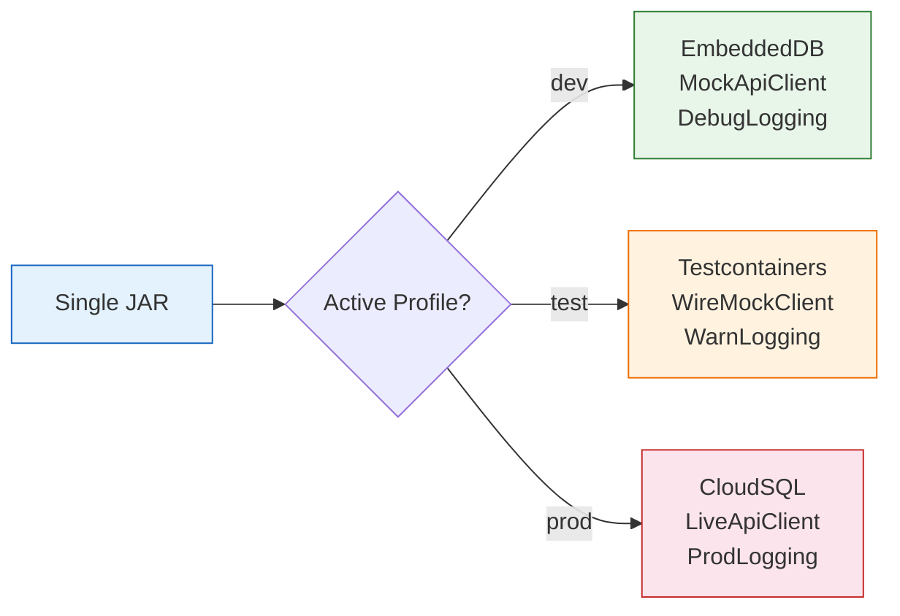
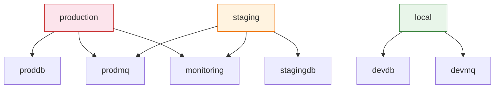
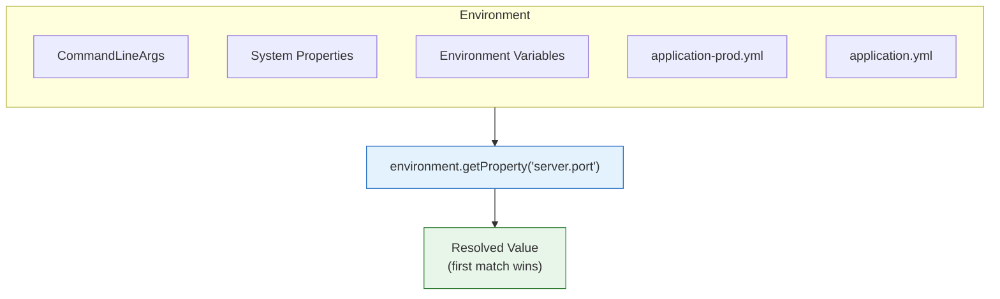

# Spring Profiles and the Environment Abstraction

**Date:** 2026-04-17 | **Updated:** 2026-04-17
**Tags:** `spring-boot` `profiles` `environment` `conditional-beans` `testing`

## Table of Contents

- [Summary](#summary)
- [What Profiles Solve](#what-profiles-solve)
- [Activating Profiles](#activating-profiles)
  - [Priority Order](#priority-order)
  - [Multiple Profiles](#multiple-profiles)
  - [Default Profiles](#default-profiles)
- [@Profile on Beans](#profile-on-beans)
  - [@Profile on @Configuration Classes](#profile-on-configuration-classes)
  - [@Profile on @Bean Methods](#profile-on-bean-methods)
  - [@Profile on @Component Classes](#profile-on-component-classes)
  - [Profile Negation and Expressions](#profile-negation-and-expressions)
- [Profile Groups](#profile-groups)
- [The Environment Interface](#the-environment-interface)
  - [Checking Active Profiles](#checking-active-profiles)
  - [The Profiles Utility Class](#the-profiles-utility-class)
  - [Reading Properties Programmatically](#reading-properties-programmatically)
- [EnvironmentPostProcessor](#environmentpostprocessor)
  - [Implementation](#implementation)
  - [Registration](#registration)
  - [Use Cases](#use-cases)
- [Testing with Profiles](#testing-with-profiles)
  - [@ActiveProfiles](#activeprofiles)
  - [@TestPropertySource](#testpropertysource)
  - [Profile-Specific Test Configuration](#profile-specific-test-configuration)
- [Profile Patterns and Anti-Patterns](#profile-patterns-and-anti-patterns)
  - [Recommended Profile Categories](#recommended-profile-categories)
  - [Anti-Patterns](#anti-patterns)
- [Related](#related)
- [References](#references)

---

## Summary

Spring Profiles let you register different beans for different runtime environments (dev, test, staging, prod) without changing code. The `Environment` abstraction provides programmatic access to active profiles and resolved properties. Together they form the mechanism that makes a single deployable artifact behave differently across environments.

This doc deepens the profile coverage introduced in [Externalized Configuration](externalized-config.md). That doc covers property sources, YAML files, profile-specific property files, and `@ConfigurationProperties` binding. This doc focuses on conditional bean registration with `@Profile`, the `Environment` API, `EnvironmentPostProcessor`, testing strategies, and practical profile patterns.

---

## What Profiles Solve

The core problem: a single application needs different behavior across environments.

| Concern | Dev | Test | Staging | Prod |
|---------|-----|------|---------|------|
| Database | Embedded H2 | Testcontainers | Shared staging DB | Managed RDS/CloudSQL |
| External APIs | Mock/stub | WireMock | Sandbox endpoints | Live endpoints |
| Caching | Disabled | Disabled | Redis | Redis cluster |
| Feature flags | All enabled | Selective | Selective | Controlled rollout |
| Logging | DEBUG | WARN | INFO | WARN |

Without profiles, you would litter the code with `if (env == "prod")` checks or maintain separate builds. Profiles solve this by letting Spring itself decide which beans and configuration to activate based on the active profile(s).



---

## Activating Profiles

### Priority Order

Profiles can be activated in multiple ways. Higher-precedence sources override lower ones:

| Priority | Method | Example |
|----------|--------|---------|
| 1 (highest) | Command-line argument | `--spring.profiles.active=prod` |
| 2 | JVM system property | `-Dspring.profiles.active=prod` |
| 3 | Environment variable | `SPRING_PROFILES_ACTIVE=prod` |
| 4 | `application.yml` | `spring.profiles.active: dev` |
| 5 | Programmatic (SpringApplication) | `app.setAdditionalProfiles("dev")` |
| 6 (lowest) | `@ActiveProfiles` (tests only) | `@ActiveProfiles("test")` |

```bash
# Command-line argument (highest precedence in non-test code)
java -jar app.jar --spring.profiles.active=prod

# JVM system property
java -Dspring.profiles.active=prod -jar app.jar

# Environment variable (typical for containers)
export SPRING_PROFILES_ACTIVE=prod
java -jar app.jar
```

In `application.yml` (lowest precedence for non-programmatic activation):

```yaml
spring:
  profiles:
    active: local  # Default when nothing else overrides
```

Programmatically before the application starts:

```java
public static void main(String[] args) {
    SpringApplication app = new SpringApplication(MyApplication.class);
    app.setAdditionalProfiles("monitoring");  // Added on top of any active profiles
    app.run(args);
}
```

### Multiple Profiles

Multiple profiles can be active simultaneously. Comma-separate them:

```bash
export SPRING_PROFILES_ACTIVE=prod,monitoring,eu-west
```

All three profiles are active. Beans annotated with any of these profiles will be registered.

### Default Profiles

If no profile is explicitly active, Spring activates the `default` profile. You can use this as a safety net:

```java
@Configuration
@Profile("default")
public class FallbackConfig {
    @Bean
    public DataSource dataSource() {
        return new EmbeddedDatabaseBuilder()
            .setType(EmbeddedDatabaseType.H2)
            .build();
    }
}
```

This bean registers only when no profile has been explicitly activated.

---

## @Profile on Beans

`@Profile` conditionally registers beans based on which profiles are active. It can be placed on `@Configuration` classes, individual `@Bean` methods, or `@Component` classes.

### @Profile on @Configuration Classes

The entire configuration class (and all its beans) activates only for the specified profile:

```java
@Configuration
@Profile("dev")
public class DevConfig {

    @Bean
    public DataSource dataSource() {
        return new EmbeddedDatabaseBuilder()
            .setType(EmbeddedDatabaseType.H2)
            .addScript("schema.sql")
            .build();
    }

    @Bean
    public ApiClient apiClient() {
        return new StubApiClient();
    }
}

@Configuration
@Profile("prod")
public class ProdConfig {

    @Bean
    public DataSource dataSource() {
        return DataSourceBuilder.create()
            .url("jdbc:postgresql://prod-db:5432/myapp")
            .username("${DB_USER}")
            .password("${DB_PASS}")
            .build();
    }

    @Bean
    public ApiClient apiClient() {
        return new LiveApiClient("https://api.example.com");
    }
}
```

### @Profile on @Bean Methods

More granular control when only some beans differ:

```java
@Configuration
public class DataSourceConfig {

    @Bean
    @Profile("dev")
    public DataSource embeddedDataSource() {
        return new EmbeddedDatabaseBuilder()
            .setType(EmbeddedDatabaseType.H2)
            .build();
    }

    @Bean
    @Profile("prod")
    public DataSource productionDataSource() {
        return DataSourceBuilder.create()
            .url("jdbc:postgresql://prod-db:5432/myapp")
            .build();
    }

    @Bean  // No @Profile — registered regardless of active profile
    public JdbcTemplate jdbcTemplate(DataSource dataSource) {
        return new JdbcTemplate(dataSource);
    }
}
```

### @Profile on @Component Classes

Works on any stereotype annotation:

```java
@Service
@Profile("dev")
public class MockNotificationService implements NotificationService {
    @Override
    public Mono<Void> send(Notification n) {
        log.info("DEV — would send: {}", n);
        return Mono.empty();
    }
}

@Service
@Profile("prod")
public class SmtpNotificationService implements NotificationService {
    @Override
    public Mono<Void> send(Notification n) {
        return mailClient.send(n.toEmail());
    }
}
```

### Profile Negation and Expressions

Negate with `!` to activate for every profile except the specified one:

```java
@Configuration
@Profile("!prod")  // Active for dev, test, staging — anything except prod
public class NonProdConfig {
    @Bean
    public DataSource dataSource() {
        return new EmbeddedDatabaseBuilder().build();
    }
}
```

Combine profiles with `|` (OR) and `&` (AND) in Spring 5.1+:

```java
@Profile({"dev", "test"})  // OR — active if dev OR test
public class DevOrTestConfig { }

@Profile("cloud & !eu-west")  // AND + negation — cloud but not eu-west
public class NonEuCloudConfig { }
```

The `&` and `!` operators work within a single string. Multiple array entries are ORed together.

---

## Profile Groups

Spring Boot 2.4+ introduced profile groups, letting you activate a set of sub-profiles with a single name. See [Externalized Configuration](externalized-config.md#profile-groups) for the basics; this section covers deeper patterns.

```yaml
spring:
  profiles:
    group:
      production:
        - proddb
        - prodmq
        - monitoring
      local:
        - devdb
        - devmq
      staging:
        - stagingdb
        - prodmq
        - monitoring
```

Activating `production` now activates `proddb`, `prodmq`, and `monitoring` as additional profiles:

```bash
# Activates: production + proddb + prodmq + monitoring
java -jar app.jar --spring.profiles.active=production
```

This lets you compose environments from reusable profile building blocks. The `prodmq` profile can be shared between `production` and `staging` without duplication.



---

## The Environment Interface

The [`Environment`](https://docs.spring.io/spring-framework/docs/current/javadoc-api/org/springframework/core/env/Environment.html) interface provides programmatic access to profiles and properties. It merges all property sources (system properties, environment variables, YAML files) into a single queryable abstraction.

### Checking Active Profiles

```java
@Service
public class FeatureService {
    private final Environment environment;

    public FeatureService(Environment environment) {
        this.environment = environment;
    }

    public boolean isProductionMode() {
        return environment.acceptsProfiles(Profiles.of("prod"));
    }

    public String[] getActiveProfiles() {
        return environment.getActiveProfiles();
    }

    public String[] getDefaultProfiles() {
        return environment.getDefaultProfiles();  // Returns ["default"] if none set
    }
}
```

### The Profiles Utility Class

`Profiles` (Spring 5.1+) supports complex profile expressions with `&` (AND), `|` (OR), and `!` (NOT):

```java
// Simple check
boolean isProd = environment.acceptsProfiles(Profiles.of("prod"));

// OR — true if staging OR qa is active
boolean isPreProd = environment.acceptsProfiles(Profiles.of("staging | qa"));

// AND — true if prod AND eu-west are both active
boolean isProdEu = environment.acceptsProfiles(Profiles.of("prod & eu-west"));

// AND + NOT — true if prod is active but NOT eu-west
boolean isProdNonEu = environment.acceptsProfiles(Profiles.of("prod & !eu-west"));

// Complex — true if (prod AND monitoring) OR staging
boolean needsAlerts = environment.acceptsProfiles(
    Profiles.of("prod & monitoring", "staging")  // Multiple args are ORed
);
```

Prefer `Profiles.of(...)` over the deprecated `acceptsProfiles(String...)` method.

### Reading Properties Programmatically

While `@ConfigurationProperties` is preferred for structured access (see [Externalized Configuration](externalized-config.md#configurationproperties-recommended)), the `Environment` is useful for dynamic or conditional property reads:

```java
// Simple string property
String dbUrl = environment.getProperty("spring.datasource.url");

// Typed with default
int port = environment.getProperty("server.port", Integer.class, 8080);

// Required — throws IllegalStateException if missing
String apiKey = environment.getRequiredProperty("api.key");

// Check existence
boolean hasCustomDb = environment.containsProperty("custom.datasource.url");
```



---

## EnvironmentPostProcessor

`EnvironmentPostProcessor` lets you modify the `Environment` before any beans are created. This is the extension point for adding custom property sources, decrypting values, or transforming properties at startup.

### Implementation

```java
public class VaultPropertyPostProcessor implements EnvironmentPostProcessor {

    @Override
    public void postProcessEnvironment(
            ConfigurableEnvironment environment,
            SpringApplication application) {

        if (environment.acceptsProfiles(Profiles.of("prod"))) {
            Map<String, Object> vaultProperties = fetchFromVault();
            MapPropertySource vaultSource =
                new MapPropertySource("vault", vaultProperties);

            // Add with high precedence (first in the list)
            environment.getPropertySources().addFirst(vaultSource);
        }
    }

    private Map<String, Object> fetchFromVault() {
        // Fetch secrets from Vault, AWS Secrets Manager, etc.
        return Map.of(
            "spring.datasource.password", "fetched-secret",
            "api.key", "fetched-api-key"
        );
    }
}
```

### Registration

Register the post-processor so Spring Boot discovers it at startup.

**Spring Boot 2.7+ / 3.x (preferred):** Create the file `META-INF/spring/org.springframework.boot.env.EnvironmentPostProcessor.imports`:

```text
com.example.config.VaultPropertyPostProcessor
```

**Legacy (Spring Boot 2.6 and earlier):** Use `META-INF/spring.factories`:

```properties
org.springframework.boot.env.EnvironmentPostProcessor=\
  com.example.config.VaultPropertyPostProcessor
```

### Use Cases

| Use Case | What the PostProcessor Does |
|----------|-----------------------------|
| Secret injection | Fetches secrets from Vault/AWS/GCP and adds them as a high-precedence property source |
| Property decryption | Decrypts `ENC(...)` property values before beans read them |
| Dynamic defaults | Computes defaults based on the active profile or cloud platform |
| Config server fallback | Loads remote config, falls back to local if unreachable |

**Caution:** `EnvironmentPostProcessor` runs very early. You cannot inject beans. You cannot use `@Autowired`. Keep the logic minimal and stateless.

---

## Testing with Profiles

### @ActiveProfiles

Set the active profile for a test class:

```java
@SpringBootTest
@ActiveProfiles("test")
class MoviesServiceIntegrationTest {

    @Autowired
    private MoviesService moviesService;

    @Test
    void shouldFetchMovies() {
        // Runs with application-test.yml and @Profile("test") beans
    }
}
```

Multiple profiles:

```java
@SpringBootTest
@ActiveProfiles({"test", "mockapi"})
class MoviesServiceWithMockApiTest { }
```

### @TestPropertySource

Override specific properties without a separate profile file:

```java
@SpringBootTest
@ActiveProfiles("test")
@TestPropertySource(properties = {
    "movies.api.url=http://localhost:9999",
    "movies.api.timeout=1s"
})
class MoviesServiceTimeoutTest { }
```

`@TestPropertySource` has higher precedence than profile-specific files, so it overrides `application-test.yml` values.

### Profile-Specific Test Configuration

A common project pattern:

```text
src/
├── main/resources/
│   ├── application.yml              # Base config
│   ├── application-local.yml        # Local dev
│   └── application-prod.yml         # Production
└── test/resources/
    └── application-test.yml         # Test overrides
```

```yaml
# application-test.yml
spring:
  data:
    mongodb:
      uri: mongodb://localhost:27017/test-movies
  main:
    allow-bean-definition-overriding: true

logging:
  level:
    com.reactivespring: DEBUG
```

Test-specific beans:

```java
@TestConfiguration
@Profile("test")
public class TestConfig {

    @Bean
    public ApiClient mockApiClient() {
        return new MockApiClient();
    }
}
```

Import in tests:

```java
@SpringBootTest
@ActiveProfiles("test")
@Import(TestConfig.class)
class MoviesServiceTest { }
```

---

## Profile Patterns and Anti-Patterns

### Recommended Profile Categories

Organize profiles by purpose. Each category addresses a different axis of variation:

| Category | Examples | Purpose |
|----------|----------|---------|
| Environment | `dev`, `test`, `staging`, `prod` | Deployment target |
| Infrastructure | `local-mongo`, `cloud-mongo`, `embedded-db` | Backend technology swap |
| Feature flags | `feature-new-ui`, `feature-beta-api` | Gradual rollout |
| Region | `us-east`, `eu-west`, `ap-south` | Region-specific config |
| Observability | `monitoring`, `tracing`, `debug-logging` | Cross-cutting concerns |

Combine them freely:

```bash
# Production in EU with monitoring
SPRING_PROFILES_ACTIVE=prod,cloud-mongo,eu-west,monitoring
```

### Anti-Patterns

**Over-profiling:** Using profiles for every configuration difference.

```yaml
# BAD — profiles for what should be externalized properties
# application-timeout-5s.yml, application-timeout-10s.yml, etc.
```

Profiles are for **bean swapping** (different implementations). Use externalized properties (see [Externalized Configuration](externalized-config.md)) for **value differences** like timeouts, URLs, and thresholds.

**Profile-specific logic in business code:**

```java
// BAD — business code should not know about profiles
@Service
public class PricingService {
    @Autowired
    private Environment environment;

    public BigDecimal calculate(Order order) {
        if (environment.acceptsProfiles(Profiles.of("prod"))) {
            return calculateReal(order);
        }
        return BigDecimal.ZERO;  // Free in dev?
    }
}
```

Instead, define separate `PricingService` implementations behind `@Profile` and let Spring inject the right one.

**Too many profiles active at once:** If you need 8+ profiles to describe a deployment, consolidate with profile groups or move configuration to externalized properties.

**Forgetting the `default` profile:** When no profile is active, beans without `@Profile` still register, but `@Profile("dev")` beans do not. Use `@Profile("default")` or `spring.profiles.default` to set a fallback.

---

## Related

- [Externalized Configuration](externalized-config.md) -- property sources, YAML files, profile-specific files, `@ConfigurationProperties`, secrets management
- [Java @Configuration Classes](java-bean-config.md) -- `@Profile` on `@Configuration`, conditional bean registration with `@ConditionalOnProperty`
- [Spring Fundamentals](../spring-fundamentals.md) -- IoC container, dependency injection, and the application context that profiles operate within

## References

- [Profiles -- Spring Boot Reference](https://docs.spring.io/spring-boot/reference/features/profiles.html) -- profile activation, groups, profile-specific files
- [Environment Abstraction -- Spring Framework](https://docs.spring.io/spring-framework/reference/core/beans/environment.html) -- Environment interface, PropertySource, profiles
- [Environment Javadoc](https://docs.spring.io/spring-framework/docs/current/javadoc-api/org/springframework/core/env/Environment.html) -- full API reference for `getActiveProfiles()`, `acceptsProfiles()`, `getProperty()`
- [Profiles Javadoc](https://docs.spring.io/spring-framework/docs/current/javadoc-api/org/springframework/core/env/Profiles.html) -- the `Profiles.of()` utility for complex profile expressions
- [EnvironmentPostProcessor Javadoc](https://docs.spring.io/spring-boot/docs/current/api/org/springframework/boot/env/EnvironmentPostProcessor.html) -- lifecycle and registration
- [@ActiveProfiles Javadoc](https://docs.spring.io/spring-framework/docs/current/javadoc-api/org/springframework/test/context/ActiveProfiles.html) -- test profile activation
- [Externalized Configuration -- Spring Boot Reference](https://docs.spring.io/spring-boot/reference/features/external-config.html) -- property source precedence, relaxed binding
