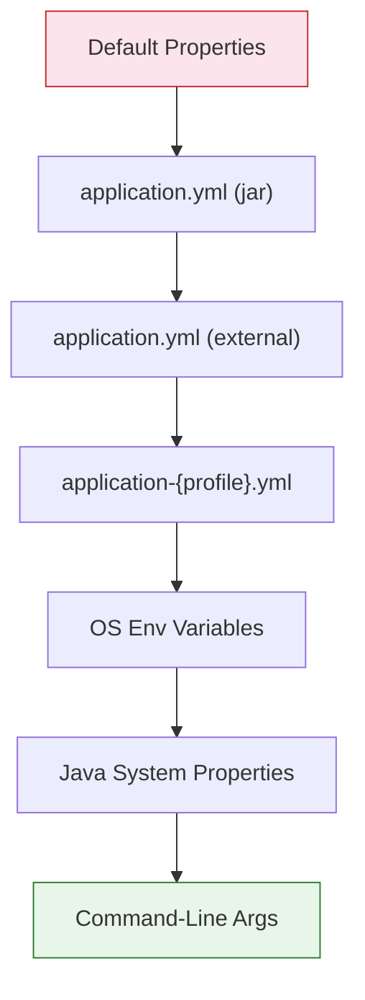

# Externalized Configuration in Spring Boot 3.x/4.x

**Date:** 2026-04-15 | **Updated:** 2026-04-15
**Tags:** `spring-boot` `configuration` `profiles` `properties` `secrets`

## Table of Contents

- [Summary](#summary)
- [Property Sources and Override Order](#property-sources-and-override-order)
- [application.yml vs application.properties](#applicationyml-vs-applicationproperties)
- [Profiles](#profiles)
  - [Profile-Specific Files](#profile-specific-files)
  - [Multi-Document YAML](#multi-document-yaml)
  - [Activating Profiles](#activating-profiles)
  - [Profile Groups](#profile-groups)
- [Reading Properties: @Value vs @ConfigurationProperties](#reading-properties-value-vs-configurationproperties)
  - [@Value (Quick and Targeted)](#value-quick-and-targeted)
  - [@ConfigurationProperties (Recommended)](#configurationproperties-recommended)
  - [Validation](#validation)
  - [Relaxed Binding Rules](#relaxed-binding-rules)
- [Environment Variables](#environment-variables)
- [Command-Line Arguments](#command-line-arguments)
- [Secrets and Sensitive Configuration](#secrets-and-sensitive-configuration)
  - [Local Development](#local-development)
  - [Kubernetes Secrets](#kubernetes-secrets)
  - [HashiCorp Vault](#hashicorp-vault)
  - [Cloud Secret Managers](#cloud-secret-managers)
- [Configuration Patterns](#configuration-patterns)
  - [Conditional Properties](#conditional-properties)
  - [Property Placeholders](#property-placeholders)
  - [Nested Properties](#nested-properties)
- [Related](#related)
- [References](#references)

---

## Summary

Spring Boot's [externalized configuration](https://docs.spring.io/spring-boot/reference/features/external-config.html) lets you separate application code from environment-specific settings, supporting properties files, YAML, environment variables, command-line args, and external secret stores. The recommended pattern for Spring Boot 3.x/4.x is YAML files with `@ConfigurationProperties` classes for type-safe binding, profile-specific overrides for environments, and environment variables or secret stores for sensitive values.

---

## Property Sources and Override Order

Spring Boot loads properties from many sources, with later sources overriding earlier ones. The complete order (highest precedence wins):

1. Devtools global settings (`~/.config/spring-boot/`)
2. `@TestPropertySource` annotations
3. Properties from `@SpringBootTest` annotation
4. **Command-line arguments** (`--server.port=9090`)
5. `SPRING_APPLICATION_JSON` environment variable
6. `ServletConfig` / `ServletContext` init params
7. JNDI (`java:comp/env`)
8. **Java System properties** (`-Dserver.port=9090`)
9. **OS environment variables** (`SERVER_PORT=9090`)
10. `RandomValuePropertySource` (`${random.uuid}`)
11. **Profile-specific** application properties outside the JAR
12. **Profile-specific** application properties packaged inside the JAR
13. **application properties** outside the JAR
14. **application properties** packaged inside the JAR
15. `@PropertySource` annotations on `@Configuration` classes
16. Default properties (`SpringApplication.setDefaultProperties`)



**Practical use:** package safe defaults in your JAR, override with profile-specific files for environments, override with env vars for secrets, override with command-line args for one-off testing.

---

## application.yml vs application.properties

Both work — pick one and stick with it. YAML is preferred for hierarchical config:

```yaml
# application.yml — hierarchical, less repetition
spring:
  application:
    name: movies-service
  data:
    mongodb:
      uri: mongodb://localhost:27017/movies
      auto-index-creation: true
server:
  port: 8082
  netty:
    connection-timeout: 30s
```

```properties
# application.properties — flat, more repetition
spring.application.name=movies-service
spring.data.mongodb.uri=mongodb://localhost:27017/movies
spring.data.mongodb.auto-index-creation=true
server.port=8082
server.netty.connection-timeout=30s
```

YAML wins for any non-trivial config. Properties wins for a handful of values or when tooling lacks YAML support.

---

## Profiles

[Profiles](https://docs.spring.io/spring-boot/reference/features/profiles.html) let you swap configuration based on environment (local, dev, staging, prod).

### Profile-Specific Files

Create one file per profile, named `application-{profile}.yml`:

```text
src/main/resources/
├── application.yml              # Base config (always loaded)
├── application-local.yml        # Local dev overrides
├── application-staging.yml      # Staging overrides
└── application-prod.yml         # Production overrides
```

Profile-specific values override the base:

```yaml
# application.yml
server:
  port: 8080
spring:
  data:
    mongodb:
      uri: mongodb://localhost:27017/movies
```

```yaml
# application-prod.yml — overrides for prod
server:
  port: 8443
spring:
  data:
    mongodb:
      uri: ${MONGODB_URI}  # Resolved from env var
```

### Multi-Document YAML

Spring Boot 2.4+ supports multiple "documents" in one YAML file separated by `---`:

```yaml
# application.yml — all profiles in one file
spring:
  application:
    name: movies-service
server:
  port: 8080

---
spring:
  config:
    activate:
      on-profile: local
logging:
  level:
    com.reactivespring: DEBUG

---
spring:
  config:
    activate:
      on-profile: prod
server:
  port: 8443
logging:
  level:
    root: WARN
```

**Activation conditions** beyond profiles:

```yaml
spring:
  config:
    activate:
      on-profile: prod
      on-cloud-platform: kubernetes  # Only when running in K8s
```

### Activating Profiles

Multiple ways to activate a profile:

```bash
# Command-line argument
java -jar app.jar --spring.profiles.active=prod

# JVM system property
java -Dspring.profiles.active=prod -jar app.jar

# Environment variable
export SPRING_PROFILES_ACTIVE=prod

# Multiple profiles (comma-separated)
export SPRING_PROFILES_ACTIVE=prod,monitoring,eu-west
```

In `application.yml`:

```yaml
spring:
  profiles:
    active: local  # Default for local dev
    # Production overrides via env var SPRING_PROFILES_ACTIVE
```

### Profile Groups

Group related profiles to activate them together:

```yaml
spring:
  profiles:
    group:
      production: ["prod", "monitoring", "eu-west"]
      staging: ["staging", "monitoring"]
```

Now `--spring.profiles.active=production` activates all three.

---

## Reading Properties: @Value vs @ConfigurationProperties

### @Value (Quick and Targeted)

Use `@Value` for one-off property injection:

```java
@Service
public class MoviesService {
    @Value("${movies.api.timeout:5000}")
    private int timeoutMs;  // Default 5000 if not set

    @Value("${movies.api.url}")
    private String apiUrl;

    @Value("${movies.allowed-categories:action,drama,comedy}")
    private List<String> allowedCategories;
}
```

**Pros:** Quick, no extra class. **Cons:** No validation, scattered, hard to refactor, no IDE autocompletion in YAML.

### @ConfigurationProperties (Recommended)

Group related properties into a type-safe class:

```java
@ConfigurationProperties(prefix = "movies.api")
public record MoviesApiProperties(
    String url,
    Duration timeout,
    int retryAttempts,
    List<String> allowedCategories,
    Auth auth
) {
    public record Auth(String username, String password) {}
}
```

```yaml
movies:
  api:
    url: https://api.movies.example.com
    timeout: 5s              # Parsed as Duration
    retry-attempts: 3
    allowed-categories: [action, drama, comedy]
    auth:
      username: ${MOVIES_API_USER}
      password: ${MOVIES_API_PASS}
```

Enable scanning:

```java
@SpringBootApplication
@ConfigurationPropertiesScan  // Scans @ConfigurationProperties classes
public class MoviesServiceApplication {
    public static void main(String[] args) {
        SpringApplication.run(MoviesServiceApplication.class, args);
    }
}
```

Inject like any bean:

```java
@Service
public class MoviesService {
    private final MoviesApiProperties props;

    public MoviesService(MoviesApiProperties props) {
        this.props = props;
    }

    public Mono<Movie> fetch(String id) {
        return webClient.get()
            .uri(props.url() + "/movies/{id}", id)
            .retrieve().bodyToMono(Movie.class)
            .timeout(props.timeout());
    }
}
```

**Pros:** Type-safe, validated, refactorable, IDE autocompletion via the configuration metadata processor. **Cons:** Requires an extra class.

### Validation

Add JSR-303 constraints:

```java
@ConfigurationProperties(prefix = "movies.api")
@Validated
public record MoviesApiProperties(
    @NotBlank String url,
    @NotNull @DurationMin(seconds = 1) Duration timeout,
    @Min(0) @Max(10) int retryAttempts,
    @NotEmpty List<String> allowedCategories
) {}
```

If properties fail validation, the application **fails to start** — fast feedback at boot time.

### Relaxed Binding Rules

Spring Boot uses [relaxed binding](https://docs.spring.io/spring-boot/reference/features/external-config.html#features.external-config.typesafe-configuration-properties.relaxed-binding) — these all bind to the same property:

| Format | Use Case |
|--------|----------|
| `movies.api.retry-attempts` | YAML/properties (kebab-case, recommended) |
| `movies.api.retryAttempts` | YAML/properties (camelCase) |
| `movies.api.retry_attempts` | YAML/properties (snake_case) |
| `MOVIES_API_RETRYATTEMPTS` | Environment variable (UPPER_SNAKE) |
| `MOVIES_API_RETRY_ATTEMPTS` | Environment variable |

Use kebab-case in YAML, UPPER_SNAKE for env vars. Both bind to `retryAttempts` in your Java class.

---

## Environment Variables

Override any property with an environment variable using the conversion rule:

```text
spring.data.mongodb.uri  →  SPRING_DATA_MONGODB_URI
server.port              →  SERVER_PORT
movies.api.url           →  MOVIES_API_URL
```

Reference env vars from YAML with placeholders:

```yaml
spring:
  data:
    mongodb:
      uri: ${MONGODB_URI:mongodb://localhost:27017/movies}
      # If MONGODB_URI is unset, falls back to the default
```

For complex values, use `SPRING_APPLICATION_JSON`:

```bash
export SPRING_APPLICATION_JSON='{"server":{"port":9090},"movies":{"api":{"url":"http://prod.example.com"}}}'
```

---

## Command-Line Arguments

Override anything at runtime:

```bash
java -jar movies-service.jar \
  --server.port=9090 \
  --spring.profiles.active=prod \
  --movies.api.url=http://override.example.com
```

To disable command-line args (security):

```java
SpringApplication app = new SpringApplication(MoviesServiceApplication.class);
app.setAddCommandLineProperties(false);
app.run(args);
```

---

## Secrets and Sensitive Configuration

**Never commit secrets to source control.** Use one of these strategies based on environment:

### Local Development

Use a `.env`-style override file, gitignored:

```text
src/main/resources/
├── application.yml           # Committed
├── application-local.yml     # Committed (no secrets)
└── application-secrets.yml   # GITIGNORED
```

```yaml
# application-secrets.yml (gitignored)
movies:
  api:
    auth:
      username: real-username
      password: real-password
```

```yaml
# application-local.yml
spring:
  profiles:
    include: secrets  # Pull in application-secrets.yml
```

Or use `EnvFile` plugin in IntelliJ to load `.env` into the run config.

### Kubernetes Secrets

Mount secrets as environment variables:

```yaml
# k8s deployment
apiVersion: apps/v1
kind: Deployment
spec:
  template:
    spec:
      containers:
        - name: movies-service
          env:
            - name: MOVIES_API_AUTH_USERNAME
              valueFrom:
                secretKeyRef:
                  name: movies-api-credentials
                  key: username
            - name: MOVIES_API_AUTH_PASSWORD
              valueFrom:
                secretKeyRef:
                  name: movies-api-credentials
                  key: password
```

Spring Boot's relaxed binding picks these up automatically.

Or mount secrets as files and load with `spring.config.import`:

```yaml
spring:
  config:
    import: configtree:/etc/secrets/
```

### HashiCorp Vault

Use Spring Cloud Vault for first-class integration:

```xml
<dependency>
    <groupId>org.springframework.cloud</groupId>
    <artifactId>spring-cloud-starter-vault-config</artifactId>
</dependency>
```

```yaml
spring:
  config:
    import: vault://
  cloud:
    vault:
      uri: https://vault.example.com:8200
      authentication: KUBERNETES
      kubernetes:
        role: movies-service
      kv:
        enabled: true
        backend: secret
        default-context: movies-service
```

Vault secrets at `secret/movies-service` are loaded as Spring properties.

### Cloud Secret Managers

| Cloud | Spring Integration |
|-------|-------------------|
| AWS Secrets Manager | `spring-cloud-starter-aws-secrets-manager-config` |
| GCP Secret Manager | `spring-cloud-gcp-starter-secretmanager` |
| Azure Key Vault | `spring-cloud-azure-starter-keyvault-secrets` |

All follow the same pattern: configure the integration, reference secrets with `${secret-name}` placeholders.

---

## Configuration Patterns

### Conditional Properties

Activate config based on property values:

```java
@Configuration
@ConditionalOnProperty(prefix = "feature", name = "new-pricing", havingValue = "true")
public class NewPricingConfig {
    @Bean
    public PricingService pricingService() {
        return new V2PricingService();
    }
}
```

```yaml
feature:
  new-pricing: true
```

### Property Placeholders

Reference other properties:

```yaml
movies:
  base-url: https://${ENVIRONMENT:local}.movies.example.com
  api:
    url: ${movies.base-url}/api/v1
    health-url: ${movies.base-url}/health
```

Use SpEL for computed values:

```yaml
app:
  cache:
    ttl-seconds: #{ ${app.cache.ttl-minutes:5} * 60 }
```

### Nested Properties

Nested `@ConfigurationProperties` classes for complex structures:

```java
@ConfigurationProperties(prefix = "movies")
public record MoviesProperties(
    Api api,
    Cache cache,
    Map<String, Endpoint> endpoints
) {
    public record Api(String url, Duration timeout) {}
    public record Cache(Duration ttl, int maxSize) {}
    public record Endpoint(String url, Map<String, String> headers) {}
}
```

```yaml
movies:
  api:
    url: https://api.example.com
    timeout: 5s
  cache:
    ttl: 10m
    max-size: 1000
  endpoints:
    primary:
      url: https://primary.example.com
      headers:
        x-region: us-east-1
    backup:
      url: https://backup.example.com
      headers:
        x-region: us-west-2
```

---

## Related

- [Java @Configuration Classes in Spring Boot](java-bean-config.md) — using @Configuration to expose properties as beans, conditional configuration patterns
- [WebClient Configuration](webclient-config.md) — typical example of injecting @ConfigurationProperties into WebClient setup
- [Database Configuration](database-config.md) — externalizing connection strings, credentials, and pool settings
- [Reactive Observability](../reactive-observability.md) — externalizing tracing endpoints and sampling rates

## References

- [Externalized Configuration — Spring Boot](https://docs.spring.io/spring-boot/reference/features/external-config.html) — complete reference for property sources, override order, and binding rules
- [Profiles — Spring Boot](https://docs.spring.io/spring-boot/reference/features/profiles.html) — profile activation, profile groups, profile-specific files
- [Properties and Configuration How-To — Spring Boot](https://docs.spring.io/spring-boot/how-to/properties-and-configuration.html) — multi-document files, custom property sources
- [@ConfigurationProperties Javadoc](https://docs.spring.io/spring-boot/docs/current/api/org/springframework/boot/context/properties/ConfigurationProperties.html) — full annotation reference with relaxed binding and validation
- [Property Binding in Spring Boot 2.0 — Spring Blog](https://spring.io/blog/2018/03/28/property-binding-in-spring-boot-2-0/) — detailed explanation of relaxed binding rules (still applies to Boot 3+)
- [Common Application Properties — Spring Boot](https://docs.spring.io/spring-boot/appendix/application-properties/index.html) — appendix listing every built-in Spring Boot property
