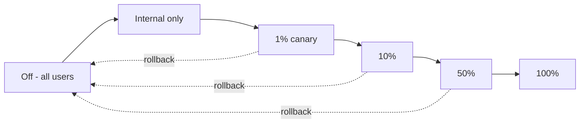

# Feature Flags — LaunchDarkly, Unleash, Togglz, Progressive Rollout

**Date:** 2026-04-19 | **Updated:** 2026-04-19
**Tags:** `feature-flags` `continuous-delivery` `experimentation` `spring-boot`

## Table of Contents

- [Summary](#summary)
- [Why Decouple Deploy From Release](#why-decouple-deploy-from-release)
- [Flag Taxonomy](#flag-taxonomy)
- [LaunchDarkly, Unleash, Togglz — Compared](#launchdarkly-unleash-togglz--compared)
- [Spring Boot Integration](#spring-boot-integration)
- [Progressive Rollout](#progressive-rollout)
- [Experiment as Code](#experiment-as-code)
- [Flag Debt and Cleanup](#flag-debt-and-cleanup)
- [Related](#related)
- [References](#references)

---

## Summary

Feature flags let you **deploy code once and release to users separately** — ship a feature dark, turn it on for 1% of traffic, watch metrics, ramp to 100% (or kill it). Without flags, "deploy" and "release" are the same event, so risky features force risky deploys, and risky deploys force big-bang QA. Modern teams ship dozens of times a day precisely because deploys are boring — flags absorb the risk. Three tools dominate Java: [LaunchDarkly](https://launchdarkly.com/) (SaaS, polished, expensive), [Unleash](https://www.getunleash.io/) (OSS, self-hostable, good middle ground), and [Togglz](https://www.togglz.org/) (Java-native, simplest, limited UI). Pick by team size and budget, not tech; they do the same core thing. The interesting engineering is in the patterns: kill switches, canaries, experiments, and the discipline of cleaning up flags before they become technical debt.

---

## Why Decouple Deploy From Release

Three things feature flags unlock:

1. **Continuous delivery** — every merge to main goes to production immediately, hidden behind a flag. No release branches, no staging holds.
2. **Trunk-based development** — no long-lived feature branches. Half-finished features ship behind `newCheckout=false`.
3. **Instant rollback without redeploy** — flip the flag off. Faster than any deployment pipeline, including Argo CD rollback.

The cost: flag plumbing in code, a control plane to maintain, and discipline to clean up dead flags.

---

## Flag Taxonomy

Four categories, each with different lifetime and governance:

| Type | Purpose | Lifetime | Example |
|------|---------|----------|---------|
| **Release** | Hide in-progress features | Days to weeks | `new_checkout_enabled` |
| **Experiment** | A/B test, measure impact | Weeks | `recommend_algo_v2` |
| **Ops / kill switch** | Emergency shut-off | Forever (but rarely toggled) | `expensive_report_disabled` |
| **Permission** | Per-user / per-tenant features | Forever | `enterprise_sso_enabled` |

Release flags should be deleted after the rollout. Experiment flags should be deleted after the experiment concludes. Ops and permission flags are long-lived — treat them as config, not as debt.

---

## LaunchDarkly, Unleash, Togglz — Compared

| Feature | LaunchDarkly | Unleash | Togglz |
|---------|--------------|---------|--------|
| Hosting | SaaS (or Relay Proxy) | Self-host / SaaS | Self-host |
| SDKs | 25+ languages | 20+ languages | Java only |
| Admin UI | Polished, full RBAC | Good | Minimal |
| Targeting rules | Rich (segments, %, attributes) | Rich | Simple |
| Experimentation | Built-in, first-class | Via extensions | No |
| OSS | Client SDKs yes, server no | Yes (Apache 2) | Yes (Apache 2) |
| Cost | $$$ | Free (self-host) to $$ | Free |
| Offline-first client cache | Yes | Yes | Limited |

Rule of thumb: LaunchDarkly if budget isn't a constraint and you want experimentation built-in. Unleash for self-host + open-source. Togglz for a small Java-only service where Unleash is overkill.

---

## Spring Boot Integration

**Unleash** example:

```gradle
implementation 'io.getunleash:unleash-client-java:9.2.2'
```

```java
@Configuration
public class UnleashConfig {

    @Bean
    public Unleash unleash(@Value("${unleash.url}") String url,
                           @Value("${unleash.api-token}") String token) {
        UnleashConfig cfg = UnleashConfig.builder()
            .appName("orders-service")
            .instanceId(System.getenv("HOSTNAME"))
            .unleashAPI(url)
            .apiKey(token)
            .synchronousFetchOnInitialisation(true)
            .build();
        return new DefaultUnleash(cfg);
    }
}
```

Use:

```java
@RestController
@RequiredArgsConstructor
public class CheckoutController {
    private final Unleash unleash;

    @PostMapping("/checkout")
    public ResponseEntity<?> checkout(@RequestBody Cmd cmd, @AuthenticationPrincipal User user) {
        UnleashContext ctx = UnleashContext.builder()
            .userId(user.getId())
            .addProperty("tier", user.getTier())
            .build();

        if (unleash.isEnabled("new_checkout_flow", ctx)) {
            return newCheckout(cmd);
        }
        return legacyCheckout(cmd);
    }
}
```

Flag state is fetched at startup, polled every 10–30s, cached in-memory. A flag check is a map lookup — submicrosecond, no network.

**LaunchDarkly**:

```java
LDClient client = new LDClient(System.getenv("LD_SDK_KEY"));
LDContext ctx = LDContext.builder(user.getId()).set("tier", user.getTier()).build();
boolean on = client.boolVariation("new_checkout_flow", ctx, false);
```

**Togglz**: `@FeatureManagerConfig`, enum of features. No central server — state in filesystem or JDBC. Good for small/internal projects.

---

## Progressive Rollout

Rollout a flag in stages:



At each stage, wait for the observability window to confirm no regression:

- Error rate doesn't spike.
- p99 latency doesn't drift.
- Business KPIs (conversion, revenue) don't dip.

Automate via rollout rules: "ramp to next stage if error rate stays < 0.5% for 1h". [Flagsmith](https://www.flagsmith.com/) and LaunchDarkly support this; Unleash via custom strategy.

**Percentage targeting gotcha**: use a **stable hash** of user ID, not random, or the same user flips state on every request — which breaks any feature that assumes consistency.

---

## Experiment as Code

Flags also drive A/B experiments:

```java
String variant = unleash.getVariant("recommend_algo", ctx).getName();
switch (variant) {
    case "v2" -> runV2();
    case "v1" -> runV1();
    default   -> runControl();
}
```

Log the variant to your analytics pipeline (`event_variant=v2`) so you can compute lift, significance, and confidence intervals later. For rigorous A/B: use [GrowthBook](https://www.growthbook.io/) or [Statsig](https://www.statsig.com/) which integrate variant assignment with a statistics engine.

Anti-pattern: running experiments without pre-registration. Decide the metric, effect size, and duration *before* you launch, not after the data comes in — otherwise you're p-hacking.

---

## Flag Debt and Cleanup

Every flag is code duplication (the old path + the new). After rollout, one path should die.

Cleanup discipline:

1. **Owner**: every flag has a named owner and a purpose in its description.
2. **Expiry**: every release flag has a target removal date when created.
3. **Monitoring**: a weekly report of flags > 90 days old gets posted to #eng.
4. **PR hook**: linter warns when `isEnabled("foo")` references a flag marked "archived".
5. **Dead-code removal**: tool ([LaunchDarkly code references](https://docs.launchdarkly.com/home/code/code-references)) scans for flag usage; cleanup PRs are opened automatically.

Teams that skip cleanup end up with 200+ flags, no one knows which are live, and flipping the wrong one breaks prod. This is the technical debt story of feature flags.

---

## Related

- [API Gateway Patterns](../web-layer/api-gateway-patterns.md) — gateway can enforce flag-based routing.
- [Kubernetes for Spring Boot](kubernetes-spring-boot.md) — flags enable deploy ≠ release cadence.
- [Performance Testing](../testing/performance-testing.md) — measure before, during, after rollout.
- [Distributed Tracing](../observability/distributed-tracing.md) — tag spans with variant for A/B analysis.
- [Secrets Management](../security/secrets-management.md) — flag SDK keys are secrets.
- [Distributed Systems Primer](../architecture/distributed-systems-primer.md) — flag state is eventually consistent across pods.

---

## References

- [LaunchDarkly documentation](https://docs.launchdarkly.com/)
- [Unleash documentation](https://docs.getunleash.io/)
- [Togglz documentation](https://www.togglz.org/)
- [Martin Fowler — Feature Toggles](https://martinfowler.com/articles/feature-toggles.html)
- [Pete Hodgson — The Unicorn Project (feature flag examples)](https://blog.thepete.net/)
- [Flagsmith — Open-source feature flag service](https://www.flagsmith.com/)
- [GrowthBook — Open-source A/B testing platform](https://www.growthbook.io/)
- [Statsig](https://www.statsig.com/)
- [OpenFeature — CNCF standard API for feature flags](https://openfeature.dev/)
