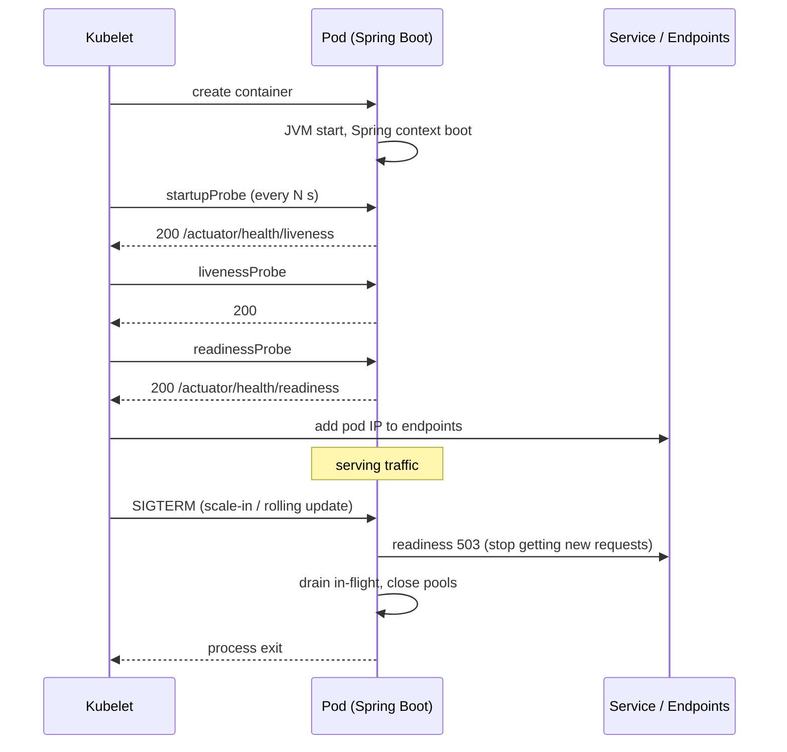

# Kubernetes for Spring Boot — Probes, Config, Scaling, Graceful Shutdown

**Date:** 2026-04-19 | **Updated:** 2026-04-24
**Tags:** `kubernetes` `spring-boot` `deployment` `devops` `cloud-native`

## Table of Contents

- [Summary](#summary)
- [Pod Lifecycle and What Spring Must Do](#pod-lifecycle-and-what-spring-must-do)
- [Health Probes — Liveness, Readiness, Startup](#health-probes--liveness-readiness-startup)
- [Resource Requests and Limits](#resource-requests-and-limits)
- [ConfigMaps and Secrets](#configmaps-and-secrets)
- [Horizontal Pod Autoscaler](#horizontal-pod-autoscaler)
- [Graceful Shutdown](#graceful-shutdown)
- [Pod Disruption Budgets and Topology](#pod-disruption-budgets-and-topology)
- [Related](#related)
- [References](#references)

---

## Summary

Running Spring Boot on [Kubernetes](https://kubernetes.io/docs/home/) means mapping four JVM behaviors onto k8s primitives: startup → startupProbe, readiness → readinessProbe, liveness → livenessProbe, shutdown → preStop + graceful termination. Get those four wrong and a pod either never takes traffic, takes traffic too early, gets killed mid-request, or lies about being healthy while deadlocked. This doc covers the minimum-viable-production Kubernetes setup for a Spring Boot 3.x service: probe wiring via Actuator, [JVM-aware resource limits](https://docs.oracle.com/en/java/javase/21/troubleshoot/troubleshooting-java-hotspot-vm.html#GUID-C6A5E0C6-8E20-4A5F-A2A6-60DE1FE3C6F8), ConfigMap/Secret mounting, HPA on CPU or custom Prometheus metrics, `spring.lifecycle.timeout-per-shutdown-phase` coordinated with `terminationGracePeriodSeconds`, and PDBs for node drains. For the Node side of the same operational concerns, see [Node.js in Kubernetes](../../typescript/production/nodejs-in-kubernetes.md).

---

## Pod Lifecycle and What Spring Must Do



Key: **readiness → 503 before process exit**, so the service removes the pod from the endpoints list and no new requests arrive. Spring Boot 2.3+ does this automatically if you wire up graceful shutdown correctly.

---

## Health Probes — Liveness, Readiness, Startup

[Spring Boot Actuator](https://docs.spring.io/spring-boot/docs/current/reference/html/actuator.html) provides three endpoints:

- `/actuator/health/liveness` — "is this process alive?" Used by `livenessProbe`. Fail → pod restart.
- `/actuator/health/readiness` — "is this ready to serve traffic?" Used by `readinessProbe`. Fail → remove from service endpoints.
- `/actuator/health` — composite. Don't use for probes (too expensive, wrong semantics).

Enable in `application.yaml`:

```yaml
management:
  endpoint:
    health:
      probes:
        enabled: true
      show-details: when-authorized
  health:
    livenessstate:
      enabled: true
    readinessstate:
      enabled: true
  server:
    port: 8081          # separate port so probes don't compete with app
```

Deployment:

```yaml
spec:
  containers:
  - name: app
    ports:
      - { name: http, containerPort: 8080 }
      - { name: mgmt, containerPort: 8081 }
    startupProbe:
      httpGet: { path: /actuator/health/liveness, port: mgmt }
      failureThreshold: 30
      periodSeconds: 10         # 300s to start (JVM + Spring)
    livenessProbe:
      httpGet: { path: /actuator/health/liveness, port: mgmt }
      periodSeconds: 20
      failureThreshold: 3
    readinessProbe:
      httpGet: { path: /actuator/health/readiness, port: mgmt }
      periodSeconds: 5
      failureThreshold: 3
```

**Rules:**

- Startup probe tolerates slow cold starts — disables liveness until first success. Without it, a slow Spring boot gets killed mid-startup.
- Liveness is *only* a deadlock detector. A failing downstream DB should NOT fail liveness (would restart pods in a stampede). That's a readiness concern.
- Readiness can fail on transient downstream issues — pod stops taking traffic without restarting.

Custom readiness contribution:

```java
@Component
@RequiredArgsConstructor
public class KafkaReadinessIndicator implements HealthIndicator {
    private final KafkaAdmin admin;

    @Override
    public Health health() {
        try { admin.describeCluster().clusterId().get(2, SECONDS); return Health.up().build(); }
        catch (Exception e) { return Health.down(e).build(); }
    }
}
```

---

## Resource Requests and Limits

JVM defaults are not container-aware for everything. The JVM respects cgroup memory limits since JDK 10, but operators still trip up.

```yaml
resources:
  requests:
    cpu: 500m
    memory: 1Gi
  limits:
    cpu: 2000m
    memory: 2Gi
```

With JVM args:

```bash
-XX:MaxRAMPercentage=75.0     # 75% of container memory -> heap max
-XX:InitialRAMPercentage=50.0
-XX:ActiveProcessorCount=2    # override CPU detection if limits != requests
```

Leave ~25% of memory for non-heap (metaspace, direct buffers, Netty, thread stacks). See [JVM Collectors — containers](../jvm-gc/collectors.md#rest-api-server-on-kubernetes).

**CPU limits controversy:** CPU throttling under k8s CFS quotas can hurt Java apps with many GC threads. Common practice: set `requests` but no `limits`, or `limits: "0"`. Only do this if you understand noisy-neighbor risk.

---

## ConfigMaps and Secrets

ConfigMap mounted as env vars:

```yaml
envFrom:
  - configMapRef: { name: orders-config }
```

ConfigMap mounted as files (for large property files or SSL certs):

```yaml
volumeMounts:
  - name: config
    mountPath: /workspace/config
volumes:
  - name: config
    configMap:
      name: orders-config
```

Spring Boot with `spring.config.import=configtree:/workspace/config/`.

Secrets: same patterns but via `Secret` objects. Never bake secrets into images. For rotation and external sources, see [secrets-management.md](../security/secrets-management.md).

**Avoid `envFrom` for secrets** — env vars are visible in `kubectl describe pod`. Prefer file mounts with restrictive RBAC.

---

## Horizontal Pod Autoscaler

Scale on CPU:

```yaml
apiVersion: autoscaling/v2
kind: HorizontalPodAutoscaler
spec:
  scaleTargetRef: { apiVersion: apps/v1, kind: Deployment, name: orders }
  minReplicas: 3
  maxReplicas: 20
  metrics:
    - type: Resource
      resource: { name: cpu, target: { type: Utilization, averageUtilization: 70 } }
```

Or on custom Prometheus metrics (Keda or `prometheus-adapter`):

```yaml
    - type: Pods
      pods:
        metric: { name: http_server_requests_seconds_count_rate5m }
        target: { type: AverageValue, averageValue: "500" }
```

For Kafka consumers, use [KEDA](https://keda.sh/) with the Kafka scaler on consumer lag — that's the lag-driven autoscaling Spring Kafka and Reactor Kafka services want. See [reactive-kafka.md](../messaging/reactive-kafka.md).

---

## Graceful Shutdown

Goal: when a pod receives SIGTERM, it stops accepting new requests, drains in-flight, then exits.

`application.yaml`:

```yaml
server:
  shutdown: graceful
spring:
  lifecycle:
    timeout-per-shutdown-phase: 30s
```

Deployment:

```yaml
spec:
  terminationGracePeriodSeconds: 45      # MUST > timeout-per-shutdown-phase
  containers:
    - name: app
      lifecycle:
        preStop:
          exec:
            command: ["sleep", "10"]     # wait for iptables to propagate
```

The `preStop` sleep is the least-obvious part: when a pod is deleted, kubelet sends SIGTERM while service endpoints are updated in parallel. For ~5–10s, traffic may still be routed to the dying pod. The sleep gives iptables time to catch up before Spring starts rejecting requests.

Sequence:

1. `kubectl delete pod` → SIGTERM sent.
2. `preStop` sleep runs; readiness stays up.
3. Endpoints controller removes pod; iptables updates.
4. Sleep ends; SIGTERM hits Spring.
5. Spring stops accepting new HTTP/Kafka, drains in-flight (up to `timeout-per-shutdown-phase`).
6. Process exits.

---

## Pod Disruption Budgets and Topology

Without a PDB, a node drain can evict all your pods at once. Always set:

```yaml
apiVersion: policy/v1
kind: PodDisruptionBudget
spec:
  minAvailable: 2
  selector:
    matchLabels: { app: orders }
```

Spread pods across AZs:

```yaml
topologySpreadConstraints:
  - maxSkew: 1
    topologyKey: topology.kubernetes.io/zone
    whenUnsatisfiable: ScheduleAnyway
    labelSelector:
      matchLabels: { app: orders }
```

Anti-affinity so two replicas don't sit on the same node:

```yaml
affinity:
  podAntiAffinity:
    preferredDuringSchedulingIgnoredDuringExecution:
      - weight: 100
        podAffinityTerm:
          topologyKey: kubernetes.io/hostname
          labelSelector:
            matchLabels: { app: orders }
```

---

## Related

- [Docker and Deployment](docker-and-deployment.md) — image building, layered JARs, multi-stage Dockerfile.
- [Actuator Deep Dive](../actuator-deep-dive.md) — health indicators, custom endpoints.
- [Distributed Tracing and Metrics Beyond Logs](../observability/distributed-tracing.md) — OTel collector as DaemonSet, ServiceMonitor.
- [Secrets Management](../security/secrets-management.md) — Vault, external-secrets.
- [JVM Collectors — Kubernetes recipe](../jvm-gc/collectors.md#rest-api-server-on-kubernetes)
- [Feature Flags](feature-flags.md) — for release vs deploy decoupling.
- [Node.js in Kubernetes](../../typescript/production/nodejs-in-kubernetes.md) — the Node/V8 side of probes, memory limits, and graceful shutdown.

---

## References

- [Kubernetes documentation](https://kubernetes.io/docs/)
- [Spring Boot Actuator — Probes](https://docs.spring.io/spring-boot/docs/current/reference/html/actuator.html#actuator.endpoints.kubernetes-probes)
- [Spring Boot — Graceful Shutdown](https://docs.spring.io/spring-boot/docs/current/reference/html/web.html#web.graceful-shutdown)
- [Kubernetes — Configure Liveness, Readiness and Startup Probes](https://kubernetes.io/docs/tasks/configure-pod-container/configure-liveness-readiness-startup-probes/)
- [Kubernetes — Horizontal Pod Autoscaler](https://kubernetes.io/docs/tasks/run-application/horizontal-pod-autoscale/)
- [Kubernetes — Pod Disruption Budgets](https://kubernetes.io/docs/tasks/run-application/configure-pdb/)
- [KEDA — Kubernetes Event-Driven Autoscaling](https://keda.sh/docs/)
- [JVM — Container-aware configuration (JEP 189 and later)](https://openjdk.org/jeps/189)
