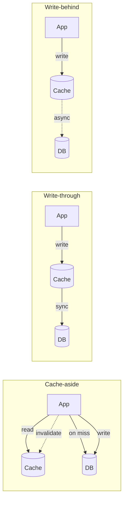
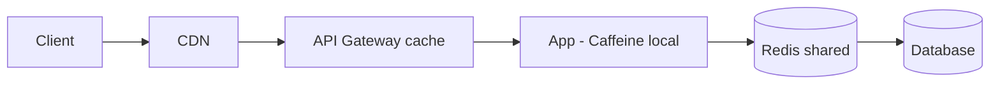

# Caching Deep Dive — Invalidation, Stampede, Redis Patterns, CDN

**Date:** 2026-04-19 | **Updated:** 2026-04-19
**Tags:** `caching` `redis` `caffeine` `cdn` `performance` `spring-boot`

## Table of Contents

- [Summary](#summary)
- [The Two Hard Problems](#the-two-hard-problems)
- [Cache Strategies — Cache-Aside, Write-Through, Write-Behind](#cache-strategies--cache-aside-write-through-write-behind)
- [Invalidation Patterns](#invalidation-patterns)
- [Cache Stampede](#cache-stampede)
- [Redis Patterns](#redis-patterns)
- [Caffeine Tuning](#caffeine-tuning)
- [CDN and HTTP Caching](#cdn-and-http-caching)
- [Per-Tenant and Multi-Level Caches](#per-tenant-and-multi-level-caches)
- [Related](#related)
- [References](#references)

---

## Summary

Phil Karlton's old joke — *"there are only two hard things in computer science: cache invalidation and naming things"* — is still right. Getting caches wrong makes your service faster *and* wrong. This doc goes beyond `@Cacheable` config into the patterns that keep a cached system correct under concurrency and failure: cache-aside vs write-through vs write-behind, invalidation by event/TTL/tag, stampede prevention (lock, probabilistic expiration, request coalescing), [Caffeine](https://github.com/ben-manes/caffeine) tuning (W-TinyLFU eviction, async refresh), [Redis](https://redis.io/) patterns (pipelining, clustering, Lua scripts, streams for invalidation), and HTTP/CDN caching for the edge. The goal is not "add more cache" — it's "cache correctly".

---

## The Two Hard Problems

Every cache system has two failure modes:

1. **Stale data** — the cache returns a value the source of truth no longer agrees with.
2. **Stampede** — a hot key expires; all callers miss at once; the origin gets slammed.

Every invalidation strategy trades off one against the other. There's no solution that's fast, correct, and simple at the same time — only trade-offs to pick.

---

## Cache Strategies — Cache-Aside, Write-Through, Write-Behind



- **Cache-aside**: app is explicitly in charge. Simplest and most common. Risk: race between write and invalidation window.
- **Write-through**: cache + DB updated atomically (logically). Simpler consistency, slower writes, harder failure modes on distributed cache.
- **Write-behind**: fastest writes, risk of data loss if cache dies before flushing. Rarely used outside of specific queues.

`@Cacheable` + `@CacheEvict` is cache-aside. 90% of services should use cache-aside with short TTLs and be done.

---

## Invalidation Patterns

Three techniques, usable alone or combined:

1. **TTL-only** — entry expires after N seconds. Simple, always eventually consistent, no cross-service coordination. TTL is the time window of staleness you tolerate. Default to short TTLs (seconds to minutes) over clever invalidation.
2. **Event-based invalidation** — publishing service emits an event on write; consumers evict. Tight consistency, requires a broker. Classic outbox pattern — see [graphql/multi-database-patterns.md § outbox](../graphql/multi-database-patterns.md#outbox-pattern).
3. **Versioned keys** — cache key includes a version (`user:42:v7`). Update the version and the old key is orphaned (and GC'd by eviction). No explicit invalidation needed.

Tag-based invalidation (invalidate all keys for user 42 regardless of kind) is an advanced case — Redis supports it via secondary structures, Caffeine via `removeAll` with a `Predicate`.

---

## Cache Stampede

A hot key with TTL 300s expires. The next 1000 concurrent requests all miss and hit the origin at once. The origin dies or returns errors; cache stays empty; more requests miss; death spiral.

Three fixes:

**1. Lock (mutex):** only one request computes; others wait.

```java
@Cacheable(value = "products", key = "#id", sync = true)
public Product find(String id) { return repo.findById(id).orElseThrow(); }
```

Spring's `sync = true` uses a per-key lock inside Caffeine. Simple, but serializes everyone behind the first request. OK for hot keys; problematic if computation is slow.

**2. Probabilistic early expiration:** each request has a small probability of recomputing before the TTL, increasing as expiration approaches. Implemented via XFetch algorithm:

```java
boolean shouldRecompute(long deltaMs, long ttlMs, double beta) {
    double u = -Math.log(ThreadLocalRandom.current().nextDouble());
    return System.currentTimeMillis() + deltaMs * beta * u > expirationEpochMs;
}
```

Smooths the thundering herd across time. Used by CDNs and some cache libraries natively.

**3. Request coalescing:** in-flight de-dup. All requests for the same missing key share one upstream call. Caffeine's `AsyncLoadingCache` does this out of the box.

```java
AsyncLoadingCache<String, Product> cache = Caffeine.newBuilder()
    .expireAfterWrite(5, MINUTES)
    .buildAsync((key, executor) -> CompletableFuture.supplyAsync(() -> loadFromDb(key), executor));
```

One query per missing key, regardless of concurrent reader count.

---

## Redis Patterns

**Pipelining** — batch many commands in one round-trip:

```java
redisTemplate.executePipelined((RedisCallback<Object>) conn -> {
    ids.forEach(id -> conn.get(("product:" + id).getBytes()));
    return null;
});
```

Turns 100 sequential round-trips into one. Critical for bulk fetch patterns.

**Lua scripts** — atomic read-modify-write:

```lua
-- Token bucket rate limiter
local tokens = tonumber(redis.call('GET', KEYS[1]) or ARGV[1])
if tokens > 0 then
  redis.call('SET', KEYS[1], tokens - 1, 'EX', ARGV[2])
  return 1
end
return 0
```

One server round-trip, race-free. Use for rate limiting, bucket counters, versioned updates.

**Redis Streams** — durable log for cache-invalidation events (alternative to Kafka if you're already running Redis):

```java
redisTemplate.opsForStream().add("cache-invalidate", Map.of("key", "product:42"));
```

Subscribers `XREADGROUP` and evict locally. Fits within the Redis you already have.

**Clustering caveats** — keys for a pipeline or Lua script must share a hash slot. Use hash tags: `{user:42}:orders` and `{user:42}:profile` land on the same shard.

**Eviction policies** — pick explicitly: `allkeys-lru`, `allkeys-lfu`, `volatile-lru`. Default depends on Redis version; don't assume.

---

## Caffeine Tuning

Caffeine is the best-in-class JVM cache. Beats Guava Cache on every axis.

```java
Caffeine.newBuilder()
    .maximumSize(10_000)
    .expireAfterWrite(Duration.ofMinutes(10))
    .refreshAfterWrite(Duration.ofMinutes(5))
    .recordStats()
    .build(key -> loadFromDb(key));
```

Key settings:

- **`maximumSize`** — LRU + W-TinyLFU admission. W-TinyLFU keeps frequently-accessed keys even under one-shot scan patterns, dramatically reducing miss rate vs pure LRU.
- **`maximumWeight`** — size in bytes rather than entries.
- **`expireAfterWrite` vs `expireAfterAccess`** — former is absolute TTL; latter resets on every read (sliding expiration).
- **`refreshAfterWrite`** — background refresh of stale-but-not-expired entries. Hides origin latency.
- **`recordStats()`** — exposes hit rate, miss count, load time. Pipe into Micrometer.

Hit rate < 80% → either cache is too small, TTL too short, or access pattern isn't cacheable. Above 95% is easy to achieve for read-heavy workloads.

---

## CDN and HTTP Caching

The fastest cache is the one closest to the user — a CDN edge:

```http
Cache-Control: public, max-age=300, s-maxage=3600, stale-while-revalidate=60
ETag: "abc123"
Vary: Accept-Encoding, Authorization
```

- `public` — CDN may cache.
- `max-age=300` — browser cache: 5 min.
- `s-maxage=3600` — shared cache (CDN): 1 hour.
- `stale-while-revalidate=60` — serve stale while fetching fresh, up to 60s. CDN revalidates in background.
- `ETag` — conditional GET support; 304 Not Modified if unchanged.
- `Vary` — caches must key on these headers (important for gzip and auth).

Spring MVC:

```java
@GetMapping("/products/{id}")
public ResponseEntity<Product> get(@PathVariable String id) {
    Product p = productService.find(id);
    return ResponseEntity.ok()
        .cacheControl(CacheControl.maxAge(5, MINUTES).cachePublic().staleWhileRevalidate(60, SECONDS))
        .eTag(p.getVersion().toString())
        .body(p);
}
```

Never set `Cache-Control: public` on authenticated responses unless you're sure and you've set `Vary: Authorization`. Mixing user-specific data into a public cache is a classic data leak.

---

## Per-Tenant and Multi-Level Caches

Real production stacks often use multiple cache layers:



Each layer has decreasing hit rate but increasing capacity. Multi-level caching amplifies: if each layer has 90% hit rate, origin sees 0.1^N of traffic. Don't add layers reflexively — each is a source of staleness and a maintenance burden. Two layers (local + shared) is the sweet spot for most services.

---

## Related

- [Cache Configuration in Spring Boot](../configurations/cache-config.md) — basic `@Cacheable` setup (this doc is the deep dive).
- [Distributed Systems Primer](../architecture/distributed-systems-primer.md) — cache coherence is a consistency problem.
- [GraphQL Federation with Polyglot Persistence](../graphql/multi-database-patterns.md) — gateway and subgraph cache layers.
- [Scaling Spring MVC Before Virtual Threads](../web-layer/mvc-high-throughput.md) — where Caffeine slots in the throughput stack.
- [Performance Testing](../testing/performance-testing.md) — measure hit rate and origin impact.
- [Event-Driven Patterns](../messaging/event-driven-patterns.md) — outbox for cache invalidation.

---

## References

- [Caffeine documentation](https://github.com/ben-manes/caffeine/wiki)
- [Caffeine — W-TinyLFU paper](https://arxiv.org/abs/1512.00727)
- [Redis documentation](https://redis.io/docs/)
- [Redis Streams](https://redis.io/docs/data-types/streams/)
- [Redis — Eviction policies](https://redis.io/docs/reference/eviction/)
- [RFC 9111 — HTTP Caching](https://datatracker.ietf.org/doc/html/rfc9111)
- [MDN — HTTP caching](https://developer.mozilla.org/en-US/docs/Web/HTTP/Caching)
- [Vasiliy Vlasov — Cache stampede and XFetch](https://cseweb.ucsd.edu/~avattani/papers/cache_stampede.pdf)
- [Spring — Cache Abstraction](https://docs.spring.io/spring-framework/reference/integration/cache.html)
