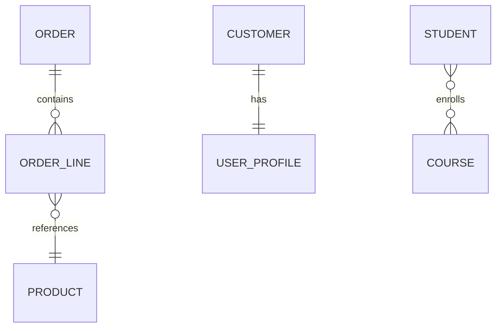
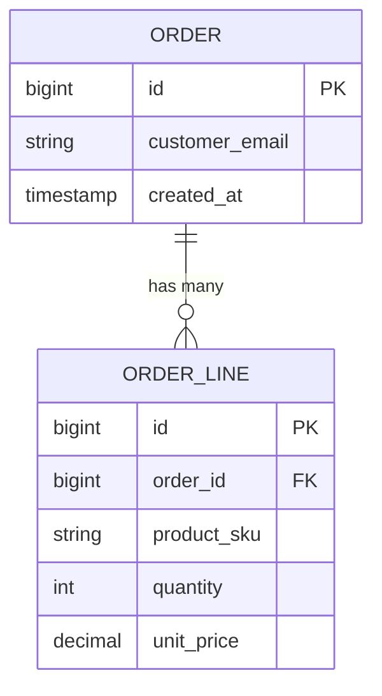
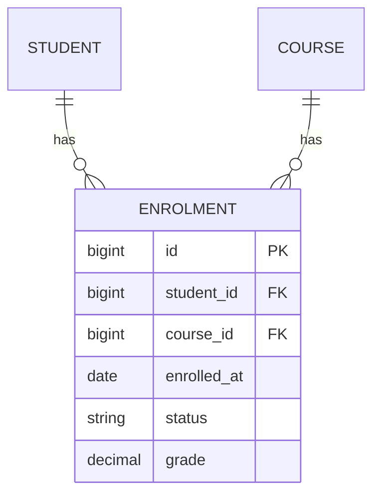
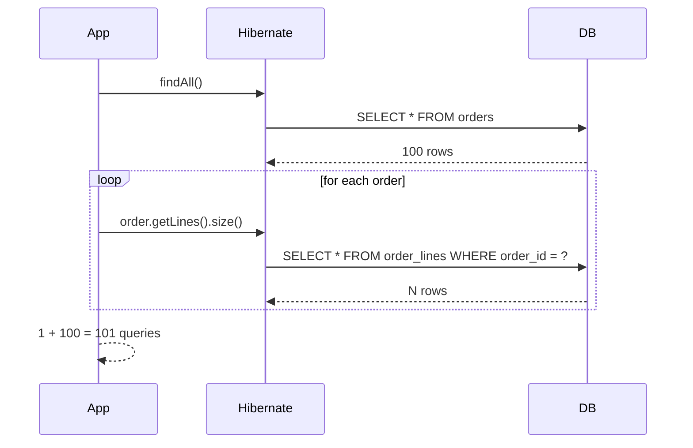

# JPA Relationships — Mapping Object Graphs to SQL

**Date:** 2026-04-17 · **Tags:** jpa, spring-data, relationships, hibernate, orm

## Table of Contents

- [Summary](#summary)
- [The Four Cardinalities](#the-four-cardinalities)
- [Owning Side vs Inverse Side](#owning-side-vs-inverse-side)
- [@OneToMany + @ManyToOne — The Canonical Pair](#onetomany--manytoone--the-canonical-pair)
- [Bidirectional vs Unidirectional](#bidirectional-vs-unidirectional)
- [@JoinColumn — Customizing the Foreign Key](#joincolumn--customizing-the-foreign-key)
- [@ManyToMany and Why a Join Entity Is Usually Better](#manytomany-and-why-a-join-entity-is-usually-better)
- [Fetch Strategies: LAZY vs EAGER](#fetch-strategies-lazy-vs-eager)
- [The N+1 Problem](#the-n1-problem)
- [LazyInitializationException](#lazyinitializationexception)
- [Cascade Types](#cascade-types)
- [@OneToOne Variants](#onetoone-variants)
- [Embedded Types](#embedded-types)
- [Inheritance Strategies](#inheritance-strategies)
- [Equals and hashCode on Entities](#equals-and-hashcode-on-entities)
- [Testing Tips](#testing-tips)
- [Related](#related)
- [References](#references)

---

## Summary

Past single-entity CRUD, most JPA complexity is **mapping object-graph
relationships to foreign keys**. The four annotations (`@OneToOne`,
`@OneToMany`, `@ManyToOne`, `@ManyToMany`) describe **cardinality**,
**ownership**, and **fetching**. Used carelessly they produce N+1 query
storms, `LazyInitializationException` at serialization, cascade deletes
that wipe rows you wanted to keep, and EAGER fetches that load half the
database. Used well, they give you a clean model with predictable,
tunable SQL. This doc covers the mapping rules, the traps, and the
patterns that keep relationships working as the schema grows.

---

## The Four Cardinalities

| Annotation     | Meaning                            | Example                           |
|----------------|------------------------------------|-----------------------------------|
| `@OneToOne`    | One A has exactly one B            | `User` → `UserProfile`            |
| `@OneToMany`   | One A has many Bs                  | `Order` → `OrderLine`             |
| `@ManyToOne`   | Many As belong to one B            | `OrderLine` → `Order`             |
| `@ManyToMany`  | Many As relate to many Bs          | `Student` ↔ `Course`              |

`@OneToMany` and `@ManyToOne` are two sides of the same relationship. In a
bidirectional mapping you declare **both**.



---

## Owning Side vs Inverse Side

Every relationship has **one foreign key column in the database**. The entity
that maps to the table holding that FK is the **owning side**. The other entity
is the **inverse side**.

Rules of thumb:

- The owning side is what JPA writes to the database when the relationship
  changes.
- The inverse side uses `mappedBy` to point to the field on the owning side.
- For `@ManyToOne` + `@OneToMany`, the `@ManyToOne` side always owns (it has
  the FK column).
- Updates to the inverse side alone are silently ignored at flush time — this
  is the single most common "why isn't my change persisting?" bug.

```java
// Owning side (FK lives here)
@Entity
class OrderLine {
    @ManyToOne
    @JoinColumn(name = "order_id")
    private Order order;
}

// Inverse side (mappedBy points to the field above)
@Entity
class Order {
    @OneToMany(mappedBy = "order")
    private List<OrderLine> lines = new ArrayList<>();
}
```

---

## @OneToMany + @ManyToOne — The Canonical Pair

This is the 80% case. A parent owns a collection of children; each child has a
reference to its parent.



Full example:

```java
@Entity
@Table(name = "orders")
public class Order {

    @Id @GeneratedValue(strategy = GenerationType.IDENTITY)
    private Long id;

    @Column(nullable = false) private String customerEmail;
    @Column(nullable = false) private Instant createdAt;

    @OneToMany(mappedBy = "order",
               cascade = CascadeType.ALL,
               orphanRemoval = true)
    private List<OrderLine> lines = new ArrayList<>();

    // Helper method — keeps both sides in sync
    public void addLine(OrderLine line) {
        lines.add(line);
        line.setOrder(this);
    }

    public void removeLine(OrderLine line) {
        lines.remove(line);
        line.setOrder(null);
    }
}

@Entity
@Table(name = "order_lines")
public class OrderLine {

    @Id @GeneratedValue(strategy = GenerationType.IDENTITY)
    private Long id;

    @ManyToOne(fetch = FetchType.LAZY)
    @JoinColumn(name = "order_id", nullable = false)
    private Order order;

    @Column(nullable = false) private String productSku;
    @Column(nullable = false) private int quantity;
    @Column(nullable = false) private BigDecimal unitPrice;
}
```

Key choices above:

- `@ManyToOne(fetch = LAZY)` — override the EAGER default (see below).
- `cascade = CascadeType.ALL` + `orphanRemoval = true` — persist/delete lines
  with the order, and remove lines that are detached from the list.
- `addLine()` / `removeLine()` helpers — keep both sides consistent in memory.

---

## Bidirectional vs Unidirectional

You do not always need both sides. Use the table below to decide.

| Situation                                           | Direction        |
|-----------------------------------------------------|------------------|
| You navigate parent → children often                | Bidirectional    |
| You only ever look up children by parent ID via a repo query | Unidirectional `@ManyToOne` only |
| You want a pure parent-owns-children lifecycle      | Bidirectional with cascade + orphanRemoval |
| The "child" table is huge and loading the list is never a good idea | Unidirectional `@ManyToOne` only |

Unidirectional `@OneToMany` (parent has the list, no `@ManyToOne` on the child)
is a **trap**. Hibernate implements it with a join table by default, which is
almost never what you want for parent/child. Add `@JoinColumn` on the
`@OneToMany` to force FK-based mapping if you must, but the conventional and
clean approach is a bidirectional mapping with the `@ManyToOne` owning.

### The Sync Helper Pattern

Whenever a relationship is bidirectional, mutating one side without updating
the other leaves the in-memory graph inconsistent. Expose only a helper
method that touches both sides, and return the collection as
`Collections.unmodifiableList(lines)` if you expose a getter at all.

---

## @JoinColumn — Customizing the Foreign Key

`@JoinColumn` controls the FK column that lives on the owning side.

```java
@ManyToOne(fetch = FetchType.LAZY)
@JoinColumn(
    name = "order_id",
    nullable = false,
    foreignKey = @ForeignKey(name = "fk_order_line_order")
)
private Order order;
```

Useful attributes:

- `name` — column name in the owning table
- `nullable` — enforce NOT NULL at the column level
- `unique` — effectively converts a `@ManyToOne` into a one-to-one
- `referencedColumnName` — target a non-PK column on the other side (rare)
- `foreignKey` — name the FK constraint for clean migrations

If you omit `@JoinColumn`, Hibernate generates a name like
`order_id` (owning field + `_id`). That is fine for greenfield schemas but
risky when your DB already exists — always name explicitly.

---

## @ManyToMany and Why a Join Entity Is Usually Better

The textbook many-to-many uses `@ManyToMany` with `@JoinTable`:

```java
@Entity
class Student {
    @ManyToMany
    @JoinTable(
        name = "student_course",
        joinColumns = @JoinColumn(name = "student_id"),
        inverseJoinColumns = @JoinColumn(name = "course_id")
    )
    private Set<Course> courses = new HashSet<>();
}

@Entity
class Course {
    @ManyToMany(mappedBy = "courses")
    private Set<Student> students = new HashSet<>();
}
```

**Why this is usually wrong.** The join row has no identity of its own — no
enrolment date, no grade, no status. The day you need any of that you have to
migrate. Most real-world joins want columns.

**Recommended approach: model the join table as its own entity.**



```java
@Entity
class Enrolment {
    @Id @GeneratedValue private Long id;

    @ManyToOne(fetch = FetchType.LAZY)
    @JoinColumn(name = "student_id", nullable = false)
    private Student student;

    @ManyToOne(fetch = FetchType.LAZY)
    @JoinColumn(name = "course_id", nullable = false)
    private Course course;

    private LocalDate enrolledAt;
    private EnrolmentStatus status;
    private BigDecimal grade;
}
```

`Student.enrolments` and `Course.enrolments` become `@OneToMany` — the
canonical pair — and you can evolve the join with new columns any time.
Reserve `@ManyToMany` for truly attribute-free associations (tags, roles
without metadata).

---

## Fetch Strategies: LAZY vs EAGER

Every relationship has a fetch type. The defaults are:

| Annotation     | Default fetch |
|----------------|---------------|
| `@OneToOne`    | EAGER         |
| `@ManyToOne`   | EAGER         |
| `@OneToMany`   | LAZY          |
| `@ManyToMany`  | LAZY          |

**EAGER on ToOne is a trap.** It means every time you load an entity with an
EAGER `@ManyToOne`, Hibernate also joins (or separately queries) the parent.
With three EAGER associations you easily triple your query size and make it
impossible to fetch the entity cheaply.

**Rule: make every association LAZY.**

```java
@ManyToOne(fetch = FetchType.LAZY)
@OneToOne(fetch = FetchType.LAZY)
```

When a caller needs the association, pull it in **at the query level**, not
at the mapping level. Tools:

- `JOIN FETCH` in JPQL
- `@EntityGraph(attributePaths = {...})` on the repository method
- Explicit DTO projection

```java
public interface OrderRepository extends JpaRepository<Order, Long> {

    @EntityGraph(attributePaths = {"lines"})
    Optional<Order> findWithLinesById(Long id);

    @Query("select o from Order o join fetch o.lines where o.id = :id")
    Optional<Order> findWithLinesJpql(@Param("id") Long id);
}
```

---

## The N+1 Problem

The single most important JPA performance bug. Given:

```java
List<Order> orders = orderRepo.findAll();
for (Order o : orders) {
    log.info("order {} has {} lines", o.getId(), o.getLines().size());
}
```

With LAZY loading, you get:



One query for the parents, N more for the children. On 10,000 orders that is
10,001 round-trips.

### Fix 1 — JOIN FETCH in JPQL

```java
@Query("""
    select distinct o
    from Order o
    left join fetch o.lines
""")
List<Order> findAllWithLines();
```

`distinct` is required — otherwise the row-multiplication from the join
duplicates parent rows.

### Fix 2 — `@EntityGraph`

```java
@EntityGraph(attributePaths = {"lines"})
List<Order> findAll();
```

Cleaner than JPQL; Hibernate picks the join strategy. Supports nested paths
like `"lines.product"`.

### Fix 3 — Batch fetching

Annotate the collection or the entity:

```java
@OneToMany(mappedBy = "order")
@BatchSize(size = 50)
private List<OrderLine> lines = new ArrayList<>();
```

Hibernate now loads child collections in batches of 50 instead of one at a
time. 10,000 orders become 1 + 200 = 201 queries instead of 10,001. Not as
tight as a single JOIN FETCH, but a cheap safety net to set globally.

Global default: `spring.jpa.properties.hibernate.default_batch_fetch_size=32`.

---

## LazyInitializationException

You closed the persistence context (transaction ended), then called a getter
on a LAZY association. Hibernate has nothing to query with, so it throws.

Common triggers:

- Serializing a detached entity to JSON in a controller
- Accessing `order.getLines()` from a template after the transaction closed
- Returning an entity from a `@Transactional` service, then touching it later

### Remedies

**1. DTO projection (recommended).** Never return entities across layer
boundaries. Map to a DTO inside the transactional service method:

```java
@Transactional(readOnly = true)
public OrderSummary summarize(Long id) {
    Order o = repo.findWithLinesById(id).orElseThrow();
    return new OrderSummary(o.getId(), o.getCustomerEmail(),
        o.getLines().stream().map(LineDto::from).toList());
}
```

Eliminates lazy issues and decouples API from schema.

**2. Initialize in the service.** Call `Hibernate.initialize(o.getLines())`
while the session is open. Works, but brittle — any traversal path you
forgot to initialize still throws.

**3. Open Session In View (OSIV).** Spring Boot enables this by default
(`spring.jpa.open-in-view=true`); the session stays open for the whole
request. Controversial: queries happen outside transactional scope, lazy
loads get hidden inside templates (N+1 storms), and the connection is held
for the request duration. Most production teams disable it
(`spring.jpa.open-in-view=false`) and rely on DTO projection.

---

## Cascade Types

Cascades propagate entity-manager operations from parent to children.

| Cascade type | Effect                                          |
|--------------|-------------------------------------------------|
| `PERSIST`    | Saving parent saves unsaved children            |
| `MERGE`      | Merging parent merges children                  |
| `REMOVE`     | Deleting parent deletes children                |
| `REFRESH`    | Refreshing parent refreshes children            |
| `DETACH`     | Detaching parent detaches children              |
| `ALL`        | Everything above                                |

And the separate lifecycle flag:

- `orphanRemoval = true` — removing a child from the collection deletes it

### When cascades bite back

**Cascade REMOVE on a shared child.** Deleting a `Publisher` with
`CascadeType.REMOVE` on `Publisher.books` cascades to every book — if any
are referenced from another aggregate you corrupt the database or hit FK
violations. **Rule: cascade is for composition, not association.** If the
child cannot exist without the parent and is never shared, cascade is fine;
otherwise manage its lifecycle explicitly.

**orphanRemoval surprise.** Replacing the collection reference
(`order.setLines(newList)`) does not reliably orphan the old entries —
Hibernate wants you to mutate the existing collection. Do
`order.getLines().clear(); order.getLines().addAll(newList);` or use helpers.

---

## @OneToOne Variants

Three common shapes:

### 1. Foreign-key `@OneToOne`

A FK column lives on the owning side with a UNIQUE constraint.

```java
@Entity
class User {
    @OneToOne(fetch = FetchType.LAZY, mappedBy = "user",
              cascade = CascadeType.ALL)
    private UserProfile profile;
}

@Entity
class UserProfile {
    @OneToOne(fetch = FetchType.LAZY)
    @JoinColumn(name = "user_id", unique = true, nullable = false)
    private User user;
}
```

Use when: the profile exists in a separate table that you may want to query
independently.

### 2. Shared primary key with `@MapsId`

Both tables share a PK — the profile row's PK is also its FK to the user.

```java
@Entity
class UserProfile {
    @Id private Long id;

    @MapsId
    @OneToOne(fetch = FetchType.LAZY)
    @JoinColumn(name = "id")
    private User user;
}
```

Use when: the child is always created with the parent and the one-to-one is
strict. Simpler schema (no separate FK column) and guarantees cardinality at
the DB level.

### 3. Embeddable (not a relationship, see next section)

If the "profile" is really just value fields (not its own aggregate), use
`@Embedded` — no join, no separate table.

### Why LAZY on `@OneToOne` is tricky

The optional inverse side of a FK-based `@OneToOne` cannot be proxied without
bytecode enhancement — Hibernate has to know whether to return null or an
object. Workarounds: enable Hibernate bytecode enhancement, mark the
association `optional = false`, or use shared-PK `@MapsId` where LAZY
works naturally.

---

## Embedded Types

Some things look like relationships but are really **value objects** — no
identity of their own, shared lifecycle with the owner.

```java
@Embeddable
public class Address {
    private String street;
    private String city;
    private String postalCode;
    private String country;
}

@Entity
public class Customer {
    @Id @GeneratedValue private Long id;

    private String name;

    @Embedded
    private Address shippingAddress;

    @Embedded
    @AttributeOverrides({
        @AttributeOverride(name = "street",
            column = @Column(name = "billing_street")),
        @AttributeOverride(name = "city",
            column = @Column(name = "billing_city"))
        // ...
    })
    private Address billingAddress;
}
```

The fields live in the same table as `Customer`. No join. No FK. Useful for:

- Address
- Money (amount + currency)
- DateRange (start + end)
- Coordinates
- Audit timestamps (created/updated)

Rule of thumb: if the concept has no identity and you would never query for
it independently, it is a value object — embed it.

---

## Inheritance Strategies

Three strategies, each with sharp trade-offs.

| Strategy         | Schema shape                                  | Pros                              | Cons                                   |
|------------------|-----------------------------------------------|-----------------------------------|----------------------------------------|
| `SINGLE_TABLE`   | One table with a discriminator column + nullable fields for all subclasses | Fast reads, simple joins | Wide sparse tables, cannot enforce NOT NULL on subclass fields |
| `JOINED`         | One table per class, children JOIN to parent  | Normalized, per-subclass NOT NULL | Every query joins; worse for polymorphic reads |
| `TABLE_PER_CLASS`| One concrete table per class, no parent table | No joins for concrete fetches     | Polymorphic queries use UNION ALL; PKs must be globally unique |

```java
@Entity
@Inheritance(strategy = InheritanceType.JOINED)
@DiscriminatorColumn(name = "type")
public abstract class Payment {
    @Id @GeneratedValue private Long id;
    private BigDecimal amount;
}

@Entity
@DiscriminatorValue("CARD")
public class CardPayment extends Payment {
    private String maskedPan;
}

@Entity
@DiscriminatorValue("BANK")
public class BankTransfer extends Payment {
    private String iban;
}
```

Start with `SINGLE_TABLE` for small hierarchies. Switch to `JOINED` when
subclass NOT NULL constraints matter or the table gets sparse. Avoid
`TABLE_PER_CLASS` unless you specifically need it. For many "inheritance"
cases, composition (flag column + optional fields, or a separate entity per
type) is cleaner than JPA inheritance.

---

## Equals and hashCode on Entities

Entities are mutable, long-lived, and often proxied. `equals`/`hashCode` on
entities is subtly wrong if you do it naively.

### The ID-based equals trap

```java
@Override
public boolean equals(Object o) {
    if (!(o instanceof Order other)) return false;
    return Objects.equals(id, other.id);   // BROKEN
}

@Override
public int hashCode() {
    return Objects.hash(id);               // BROKEN
}
```

Before `save()`, `id` is null. After save, Hibernate assigns it. So the same
object's `hashCode` **changes**. If you added it to a `HashSet` before saving
and look for it after, it is gone.

### Safer options

**1. Business key.** If you have a natural unique attribute (email, SKU,
ISBN), use that:

```java
@Override
public boolean equals(Object o) {
    if (!(o instanceof Book other)) return false;
    return Objects.equals(isbn, other.isbn);
}

@Override
public int hashCode() {
    return Objects.hash(isbn);
}
```

**2. Null-safe ID-based.** Accept that a pre-persist instance is only equal
to itself:

```java
@Override
public boolean equals(Object o) {
    if (this == o) return true;
    if (!(o instanceof Order other)) return false;
    return id != null && Objects.equals(id, other.id);
}

@Override
public int hashCode() {
    // Constant — guarantees identity-before-persist survives rehashing
    return getClass().hashCode();
}
```

This keeps `HashSet` membership stable across save. It is the conventional
JPA pattern.

**3. Skip it.** If you never put entities in hash-based collections, do not
override at all. `Object.equals` (identity) is fine. Also beware Hibernate
proxies when using `instanceof` — use `Hibernate.unproxy(o)` or compare via
the actual class if you support subclassing.

---

## Testing Tips

### `@DataJpaTest`

Spring slice test for the JPA layer. H2 by default, or Testcontainers with a
few lines of config. Rolls back every test.

```java
@DataJpaTest
@AutoConfigureTestDatabase(replace = Replace.NONE)  // use real DB
class OrderRepositoryTest {
    @Autowired OrderRepository repo;

    @Test
    void saves_and_loads_with_lines() {
        Order o = new Order();
        o.setCustomerEmail("a@b.com");
        o.addLine(new OrderLine("SKU-1", 2, BigDecimal.TEN));
        Order saved = repo.save(o);

        Order found = repo.findWithLinesById(saved.getId()).orElseThrow();
        assertThat(found.getLines()).hasSize(1);
    }
}
```

### Observe SQL

Two knobs that pay for themselves constantly:

```properties
spring.jpa.show-sql=true
spring.jpa.properties.hibernate.format_sql=true
logging.level.org.hibernate.SQL=DEBUG
logging.level.org.hibernate.orm.jdbc.bind=TRACE
```

Run your tests and **read the SQL**. You will find:

- N+1 query storms you forgot about
- EAGER fetches pulling far more than expected
- Your `mappedBy` being ignored because you updated the wrong side

### Count queries with Hibernate statistics

Enable `spring.jpa.properties.hibernate.generate_statistics=true` and assert
on query count in tests using a stats listener — catches N+1 in CI instead
of production.

### Test the real DB

H2 hides dialect-specific bugs. Use Testcontainers with the real engine for
anything involving JSON columns, advisory locks, or fancy constraints.

---

## Related

- [`repository-interfaces.md`](./repository-interfaces.md) — how Spring Data
  derives queries from method names on top of these mappings
- [`queries-and-pagination.md`](./queries-and-pagination.md) — JPQL, native
  queries, `@EntityGraph`, and paging the results
- [`../jpa-transactions.md`](../jpa-transactions.md) — the persistence
  context, flush modes, and transaction boundaries that make lazy loading
  and cascades work
- [`../configurations/database-config.md`](../configurations/database-config.md) —
  datasource, connection pool, and schema management around your JPA layer

---

## References

- [Hibernate ORM 6 User Guide](https://docs.jboss.org/hibernate/orm/current/userguide/html_single/Hibernate_User_Guide.html) — canonical reference for associations, fetching, and caching
- [Vlad Mihalcea's blog](https://vladmihalcea.com/) — the highest-signal
  JPA/Hibernate writing on the web. Specific posts worth bookmarking:
  - *The best way to map a @OneToMany relationship with JPA and Hibernate*
  - *N+1 query problem*
  - *How does Hibernate Open-Session-in-View anti-pattern work*
  - *The best way to implement equals, hashCode, and toString with JPA and Hibernate*
- [Spring Data JPA Reference](https://docs.spring.io/spring-data/jpa/reference/) — repository interfaces, `@EntityGraph`, projections, auditing
- [Jakarta Persistence (JPA) specification](https://jakarta.ee/specifications/persistence/) — the authoritative annotation semantics
- [Thorben Janssen's *Hibernate Tips*](https://thorben-janssen.com/) —
  practical recipes that complement Mihalcea's deeper dives
