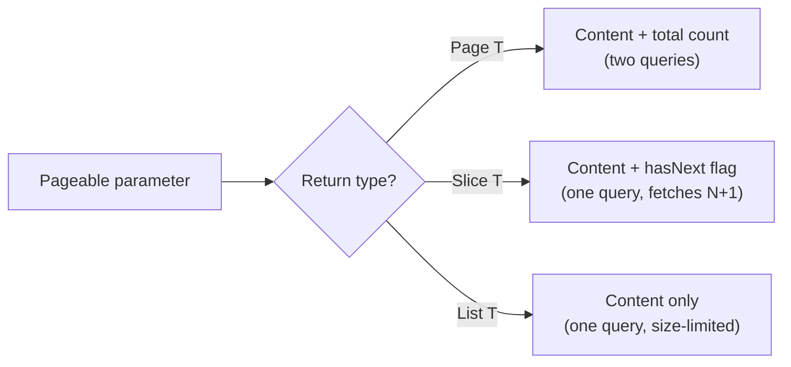
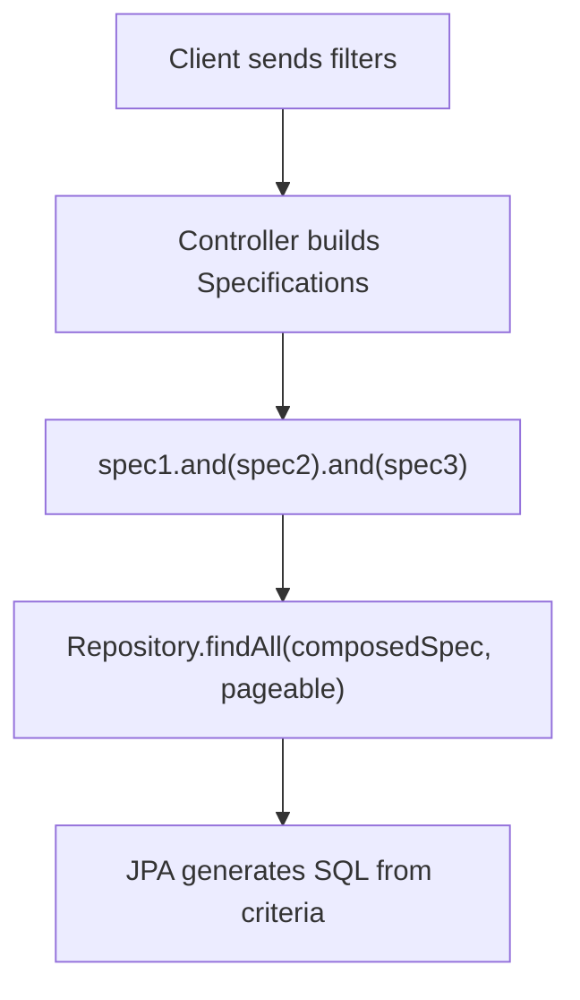

# Queries, Pagination, and Advanced Spring Data Features

**Date:** 2026-04-17 | **Updated:** 2026-04-17
**Tags:** `spring-data` `query` `pagination` `sorting` `specifications` `auditing` `entity-graph` `reactive`

## Table of Contents

- [Summary](#summary)
- [@Query Annotation](#query-annotation)
  - [JPQL Queries](#jpql-queries)
  - [Native SQL Queries](#native-sql-queries)
  - [MongoDB JSON Queries](#mongodb-json-queries)
  - [Named vs Positional Parameters](#named-vs-positional-parameters)
  - [SpEL Expressions in Queries](#spel-expressions-in-queries)
- [@Modifying Queries](#modifying-queries)
- [Pagination](#pagination)
  - [PageRequest and Pageable](#pagerequest-and-pageable)
  - [Page vs Slice vs List](#page-vs-slice-vs-list)
  - [Controller Integration](#controller-integration)
  - [JSON Response Shape](#json-response-shape)
- [Sorting](#sorting)
  - [Programmatic Sort Construction](#programmatic-sort-construction)
  - [Controller Integration with @SortDefault](#controller-integration-with-sortdefault)
- [Reactive Pagination Patterns](#reactive-pagination-patterns)
- [Specifications (JPA)](#specifications-jpa)
- [Query by Example](#query-by-example)
- [@EntityGraph (JPA)](#entitygraph-jpa)
- [Auditing](#auditing)
  - [JPA Auditing](#jpa-auditing)
  - [MongoDB Auditing](#mongodb-auditing)
- [Related](#related)
- [References](#references)

---

## Summary

Beyond derived query methods, Spring Data provides `@Query` for writing custom JPQL, native SQL, or MongoDB JSON queries directly on repository methods. Pagination and sorting are first-class abstractions through `Pageable`, `Page<T>`, `Slice<T>`, and `Sort`. For dynamic query construction, JPA offers Specifications (type-safe criteria) and Query by Example (probe-based matching). `@EntityGraph` solves the N+1 problem by declaring eager fetch paths at the repository level. Auditing annotations (`@CreatedDate`, `@LastModifiedDate`, `@CreatedBy`, `@LastModifiedBy`) track entity lifecycle metadata automatically. In the reactive stack, `Page<T>` is not supported natively, so pagination requires manual skip/limit patterns or cursor-based approaches.

---

## @Query Annotation

When derived query method names become too long or cannot express the query you need, `@Query` lets you write the query yourself and bind it to a repository method.

### JPQL Queries

JPQL operates on entity objects, not database tables. You reference entity class names and field names, not table or column names:

```java
public interface MovieRepository extends JpaRepository<Movie, Long> {

    @Query("SELECT m FROM Movie m WHERE m.year > :year")
    List<Movie> findMoviesAfterYear(@Param("year") Integer year);

    @Query("SELECT m FROM Movie m WHERE m.name LIKE %:keyword%")
    List<Movie> searchByName(@Param("keyword") String keyword);

    @Query("SELECT m FROM Movie m WHERE m.year BETWEEN :start AND :end ORDER BY m.name")
    List<Movie> findByYearRange(@Param("start") Integer start, @Param("end") Integer end);
}
```

JPQL is database-agnostic. The same query works against PostgreSQL, MySQL, H2, or any JPA-supported store. The trade-off is that you cannot use database-specific SQL features like window functions or CTEs.

### Native SQL Queries

When you need database-specific features or hand-optimized SQL, set `nativeQuery = true`. Now you write real SQL against tables and columns:

```java
@Query(value = "SELECT * FROM movies WHERE year > ?1", nativeQuery = true)
List<Movie> findMoviesAfterYearNative(Integer year);

@Query(
    value = "SELECT * FROM movies WHERE year > ?1 ORDER BY name LIMIT ?2",
    nativeQuery = true
)
List<Movie> findTopMoviesAfterYear(Integer year, int limit);
```

Native queries bypass JPQL parsing, so Spring cannot validate them at startup. Errors surface at runtime when the query executes. Use native queries only when JPQL is genuinely insufficient.

For pagination with native queries, you must also provide a count query:

```java
@Query(
    value = "SELECT * FROM movies WHERE year > ?1",
    countQuery = "SELECT count(*) FROM movies WHERE year > ?1",
    nativeQuery = true
)
Page<Movie> findMoviesAfterYear(Integer year, Pageable pageable);
```

### MongoDB JSON Queries

Spring Data MongoDB uses JSON-based query syntax in `@Query`. The placeholders `?0`, `?1`, etc. map to method parameter positions:

```java
public interface MovieInfoRepository
        extends ReactiveMongoRepository<MovieInfo, String> {

    @Query("{ 'year': { '$gt': ?0 } }")
    Flux<MovieInfo> findMoviesAfterYear(Integer year);

    @Query("{ 'name': { '$regex': ?0, '$options': 'i' } }")
    Flux<MovieInfo> searchByNameRegex(String pattern);

    @Query(value = "{ 'year': ?0 }", fields = "{ 'name': 1, 'year': 1 }")
    Flux<MovieInfo> findSummaryByYear(Integer year);
}
```

The `fields` attribute controls projection — which fields to include or exclude from the result. This is MongoDB's native field projection, not Spring Data's interface-based projections.

### Named vs Positional Parameters

**Positional parameters** use `?0`, `?1`, `?2` and bind by argument order:

```java
@Query("SELECT m FROM Movie m WHERE m.year > ?1 AND m.name LIKE %?2%")
List<Movie> search(Integer year, String name);
```

**Named parameters** use `:paramName` and bind by `@Param` annotations:

```java
@Query("SELECT m FROM Movie m WHERE m.year > :year AND m.name LIKE %:name%")
List<Movie> search(@Param("year") Integer year, @Param("name") String name);
```

Named parameters are more readable and resilient to parameter reordering. They are the preferred approach in JPA. MongoDB `@Query` supports only positional parameters (`?0`, `?1`).

### SpEL Expressions in Queries

Spring Expression Language (SpEL) can be embedded in `@Query` strings. The most common use is `#{#entityName}`, which resolves to the entity name at runtime:

```java
@Query("SELECT e FROM #{#entityName} e WHERE e.active = true")
List<Movie> findAllActive();
```

This is useful in base repository interfaces where the entity type varies. Spring replaces `#{#entityName}` with the concrete entity name (e.g., `Movie`) when creating the proxy.

---

## @Modifying Queries

By default, `@Query` methods execute SELECT queries. For UPDATE or DELETE operations, you must add `@Modifying` and wrap the call in a transaction:

```java
@Modifying
@Query("UPDATE Movie m SET m.name = :name WHERE m.id = :id")
int updateName(@Param("id") Long id, @Param("name") String name);

@Modifying
@Query("DELETE FROM Movie m WHERE m.year < :year")
int deleteOlderThan(@Param("year") Integer year);
```

The return type `int` is the number of affected rows.

Two important flags on `@Modifying`:

| Flag | Default | Purpose |
|---|---|---|
| `clearAutomatically` | `false` | Clears the persistence context after the query executes, so subsequent reads see the updated state. |
| `flushAutomatically` | `false` | Flushes pending changes before the query executes, so the modifying query sees all prior in-memory changes. |

```java
@Modifying(clearAutomatically = true, flushAutomatically = true)
@Query("UPDATE Movie m SET m.name = :name WHERE m.id = :id")
int updateName(@Param("id") Long id, @Param("name") String name);
```

Without `clearAutomatically = true`, the persistence context may hold stale entity state after the UPDATE. Any subsequent `findById` in the same transaction could return the old value from the first-level cache rather than the updated database value. This is one of the most common JPA debugging traps.

`@Modifying` queries **must** be called within a `@Transactional` context. Without a transaction, Spring will throw an `InvalidDataAccessApiUsageException`.

---

## Pagination

### PageRequest and Pageable

`Pageable` is the abstraction that carries page number, page size, and optional sort information. `PageRequest` is its standard implementation:

```java
// Page 0 (first page), 10 items per page
Pageable pageable = PageRequest.of(0, 10);

// Page 2, 20 items per page, sorted by name ascending
Pageable sorted = PageRequest.of(2, 20, Sort.by("name"));

// With direction
Pageable desc = PageRequest.of(0, 10, Sort.by(Sort.Direction.DESC, "year"));
```

Pages are zero-indexed. Page 0 is the first page.

### Page vs Slice vs List



| Return Type | Count Query | What You Get | Best For |
|---|---|---|---|
| `Page<T>` | Yes (automatic) | Content, total elements, total pages, page metadata | UI with page numbers |
| `Slice<T>` | No | Content, hasNext, hasPrevious | "Load more" / infinite scroll |
| `List<T>` | No | Just the items, limited by Pageable size | Internal use where metadata is unnecessary |

```java
// Page<T> — triggers a COUNT query
Page<Movie> findByYear(Integer year, Pageable pageable);

// Slice<T> — no COUNT, checks hasNext by fetching size+1 rows
Slice<Movie> findByYear(Integer year, Pageable pageable);

// List<T> — just the content, still respects Pageable limits
List<Movie> findByYear(Integer year, Pageable pageable);
```

`Page<T>` fires two queries: one for the data and one for `SELECT COUNT(*)`. On large tables, the count query can be expensive. If you do not need total page counts, use `Slice<T>`.

### Controller Integration

Spring MVC and WebFlux can resolve `Pageable` directly from request parameters:

```java
@GetMapping("/movies")
public Page<Movie> getMovies(
        @PageableDefault(size = 20, sort = "year", direction = Sort.Direction.DESC)
        Pageable pageable) {
    return movieRepository.findAll(pageable);
}
```

The client controls pagination via query parameters:

```
GET /movies?page=0&size=20&sort=year,desc&sort=name,asc
```

`@PageableDefault` sets fallback values when the client omits pagination parameters. Without it, the default is page 0, size 20, unsorted.

### JSON Response Shape

When a controller returns `Page<T>`, Spring serializes it as:

```json
{
  "content": [
    { "id": 1, "name": "Inception", "year": 2010 },
    { "id": 2, "name": "Interstellar", "year": 2014 }
  ],
  "pageable": {
    "pageNumber": 0,
    "pageSize": 20,
    "sort": { "sorted": true, "unsorted": false, "empty": false },
    "offset": 0,
    "paged": true,
    "unpaged": false
  },
  "totalElements": 142,
  "totalPages": 8,
  "last": false,
  "size": 20,
  "number": 0,
  "sort": { "sorted": true, "unsorted": false, "empty": false },
  "numberOfElements": 20,
  "first": true,
  "empty": false
}
```

The `content` array holds the actual data. Metadata fields like `totalElements`, `totalPages`, `first`, `last` help the client render pagination controls.

---

## Sorting

### Programmatic Sort Construction

`Sort` can be built fluently:

```java
// Single field ascending
Sort byName = Sort.by("name");

// Single field descending
Sort byYearDesc = Sort.by(Sort.Direction.DESC, "year");

// Multiple fields — year descending, then name ascending
Sort combined = Sort.by("year").descending()
        .and(Sort.by("name").ascending());

// Unsorted (explicit no-op)
Sort none = Sort.unsorted();
```

Use `Sort` in repository methods:

```java
List<Movie> findByYear(Integer year, Sort sort);
```

Or combine with pagination:

```java
Pageable pageable = PageRequest.of(0, 10, Sort.by("year").descending());
```

For JPA, type-safe sorting can use the JPA metamodel. If you enable annotation processing, JPA generates a `Movie_` metamodel class with static fields for each entity attribute:

```java
Sort typeSafe = Sort.by(Sort.Order.desc(Movie_.YEAR), Sort.Order.asc(Movie_.NAME));
```

This catches property name typos at compile time rather than runtime.

### Controller Integration with @SortDefault

```java
@GetMapping("/movies")
public List<Movie> getMovies(
        @SortDefault(sort = "year", direction = Sort.Direction.DESC)
        Sort sort) {
    return movieRepository.findAll(sort);
}
```

The client passes sort via query parameters: `GET /movies?sort=year,desc&sort=name,asc`. Multiple `sort` parameters create a compound sort.

---

## Reactive Pagination Patterns

Reactive repositories (`ReactiveCrudRepository`, `ReactiveMongoRepository`) do not support `Page<T>` because the total count requires a separate blocking query that contradicts the non-blocking model. Three alternatives exist:

**1. Manual skip/limit with Flux operators:**

```java
public Flux<MovieInfo> getMovieInfosPaginated(int page, int size) {
    return movieInfoRepository.findAll()
            .skip((long) page * size)
            .take(size);
}
```

This is simple but inefficient — it fetches all documents from the database and discards the skipped ones in memory. Acceptable only for small collections.

**2. Custom PageImpl from Flux + count query:**

```java
public Mono<Page<MovieInfo>> getMovieInfosPage(int page, int size) {
    Pageable pageable = PageRequest.of(page, size);
    return movieInfoRepository.findAll()
            .skip(pageable.getOffset())
            .take(pageable.getPageSize())
            .collectList()
            .zipWith(movieInfoRepository.count())
            .map(tuple -> new PageImpl<>(tuple.getT1(), pageable, tuple.getT2()));
}
```

This gives you a `Page` shape but fires two reactive queries. The count query runs in parallel thanks to `zipWith`.

**3. Pageable in @Query for MongoDB reactive repos:**

Spring Data MongoDB supports `Pageable` in reactive `@Query` methods — it translates to MongoDB's `skip` and `limit` at the database level:

```java
@Query("{ 'year': { '$gt': ?0 } }")
Flux<MovieInfo> findByYearGreaterThan(Integer year, Pageable pageable);
```

This is the most efficient option because the database handles skip/limit rather than the application.

**4. Cursor-based / keyset pagination:**

```java
Flux<MovieInfo> findTop20ByIdGreaterThanOrderByIdAsc(String lastSeenId);
```

The client passes the last seen ID from the previous page. This avoids the performance degradation of large offsets and is the recommended pattern for high-volume reactive APIs.

---

## Specifications (JPA)

Specifications let you build dynamic, composable queries using the JPA Criteria API. They are ideal when search filters vary at runtime — the caller might filter by year, by name, by both, or by neither.



**Step 1 — Repository extends JpaSpecificationExecutor:**

```java
public interface MovieRepository
        extends JpaRepository<Movie, Long>,
                JpaSpecificationExecutor<Movie> {
}
```

**Step 2 — Define specifications as static methods:**

```java
public final class MovieSpecs {

    private MovieSpecs() {}

    public static Specification<Movie> yearGreaterThan(Integer year) {
        return (root, query, cb) -> cb.greaterThan(root.get("year"), year);
    }

    public static Specification<Movie> nameContains(String keyword) {
        return (root, query, cb) -> cb.like(
                cb.lower(root.get("name")),
                "%" + keyword.toLowerCase() + "%"
        );
    }

    public static Specification<Movie> isActive() {
        return (root, query, cb) -> cb.isTrue(root.get("active"));
    }
}
```

Each `Specification` is a functional interface with one method: `toPredicate(Root<T>, CriteriaQuery<?>, CriteriaBuilder)`.

**Step 3 — Compose and execute:**

```java
Specification<Movie> spec = Specification.where(MovieSpecs.isActive());

if (yearFilter != null) {
    spec = spec.and(MovieSpecs.yearGreaterThan(yearFilter));
}
if (keyword != null) {
    spec = spec.and(MovieSpecs.nameContains(keyword));
}

Page<Movie> results = movieRepository.findAll(spec, pageable);
```

Specifications compose with `.and()`, `.or()`, and `.not()`. Use them when the number of filter combinations would make derived query methods explode into dozens of method signatures.

---

## Query by Example

Query by Example (QBE) is a simpler alternative to Specifications for straightforward dynamic queries. You create a "probe" entity with the fields you want to match, and Spring generates the query:

```java
public interface MovieRepository
        extends JpaRepository<Movie, Long>,
                QueryByExampleExecutor<Movie> {
}
```

```java
Movie probe = new Movie();
probe.setYear(2023);
probe.setGenre("Sci-Fi");

ExampleMatcher matcher = ExampleMatcher.matching()
        .withIgnoreNullValues()
        .withStringMatcher(ExampleMatcher.StringMatcher.CONTAINING)
        .withIgnoreCase("genre");

Example<Movie> example = Example.of(probe, matcher);
List<Movie> results = movieRepository.findAll(example);
```

`ExampleMatcher` controls matching behavior:

| Setting | Effect |
|---|---|
| `withIgnoreNullValues()` | Null fields on the probe are excluded from the query |
| `withStringMatcher(CONTAINING)` | String fields use LIKE `%value%` instead of exact match |
| `withIgnoreCase("field")` | Case-insensitive comparison for specified fields |
| `withMatcher("name", match -> match.startsWith())` | Per-field customization |

**Limitations of QBE:**

- No range queries (`year > 2020` is not expressible)
- No nested property matching with OR logic
- No grouping or negation of individual property constraints
- Only equality, LIKE, and case-insensitivity

For anything beyond simple property matching, use Specifications instead.

---

## @EntityGraph (JPA)

JPA entities with `@OneToMany` or `@ManyToMany` relationships default to lazy loading. Each access to a lazy collection triggers a separate SELECT — the N+1 problem. `@EntityGraph` tells JPA to fetch specified associations eagerly in a single query:

```java
public interface MovieRepository extends JpaRepository<Movie, Long> {

    @EntityGraph(attributePaths = {"reviews", "cast"})
    @Query("SELECT m FROM Movie m WHERE m.year > :year")
    List<Movie> findMoviesWithDetailsAfterYear(@Param("year") Integer year);

    @EntityGraph(attributePaths = {"reviews"})
    Optional<Movie> findById(Long id);
}
```

**Named entity graphs** are defined on the entity class and referenced by name:

```java
@Entity
@NamedEntityGraph(
    name = "Movie.withReviewsAndCast",
    attributeNodes = {
        @NamedAttributeNode("reviews"),
        @NamedAttributeNode("cast")
    }
)
public class Movie { /* ... */ }
```

```java
@EntityGraph(value = "Movie.withReviewsAndCast")
List<Movie> findByYear(Integer year);
```

**FETCH vs LOAD types:**

| Type | Behavior |
|---|---|
| `EntityGraphType.FETCH` | Attributes in the graph are fetched eagerly; all others use their default fetch type (usually lazy). |
| `EntityGraphType.LOAD` | Attributes in the graph are fetched eagerly; all others use the fetch type declared on the mapping annotation. |

`FETCH` is the default and the safer choice — it ensures only the explicitly listed associations are eagerly loaded.

Use `@EntityGraph` selectively. Eagerly fetching large collections on every query negates the benefits of lazy loading. Define different entity graphs for different use cases: a list view might only need the entity itself, while a detail view needs associations.

---

## Auditing

Auditing automatically populates timestamp and author fields on entity creation and modification.

### JPA Auditing

**Step 1 — Enable auditing:**

```java
@Configuration
@EnableJpaAuditing
public class JpaAuditingConfig {

    @Bean
    public AuditorAware<String> auditorProvider() {
        return () -> Optional.ofNullable(
                SecurityContextHolder.getContext().getAuthentication()
        ).map(Authentication::getName);
    }
}
```

`AuditorAware<T>` supplies the current user identity for `@CreatedBy` and `@LastModifiedBy`. The generic type matches the type of your author fields.

**Step 2 — Annotate the entity:**

```java
@Entity
@EntityListeners(AuditingEntityListener.class)
public class Movie {

    @Id
    @GeneratedValue(strategy = GenerationType.IDENTITY)
    private Long id;

    private String name;
    private Integer year;

    @CreatedDate
    @Column(nullable = false, updatable = false)
    private LocalDateTime createdAt;

    @LastModifiedDate
    @Column(nullable = false)
    private LocalDateTime updatedAt;

    @CreatedBy
    @Column(nullable = false, updatable = false)
    private String createdBy;

    @LastModifiedBy
    @Column(nullable = false)
    private String updatedBy;
}
```

`@EntityListeners(AuditingEntityListener.class)` registers the JPA listener that intercepts persist and update events and populates the annotated fields. Without this listener, the annotations have no effect.

For a shared base class:

```java
@MappedSuperclass
@EntityListeners(AuditingEntityListener.class)
public abstract class Auditable {

    @CreatedDate
    @Column(nullable = false, updatable = false)
    private LocalDateTime createdAt;

    @LastModifiedDate
    @Column(nullable = false)
    private LocalDateTime updatedAt;

    @CreatedBy
    @Column(updatable = false)
    private String createdBy;

    @LastModifiedBy
    private String updatedBy;

    // getters
}
```

All entities extending `Auditable` inherit the auditing fields.

### MongoDB Auditing

MongoDB auditing is simpler — no `@EntityListeners` needed:

```java
@Configuration
@EnableMongoAuditing
public class MongoAuditingConfig {

    @Bean
    public AuditorAware<String> auditorProvider() {
        return () -> Optional.of("system"); // or from SecurityContext
    }
}
```

```java
@Document
public class MovieInfo {

    @Id
    private String id;

    private String name;
    private Integer year;

    @CreatedDate
    private LocalDateTime createdAt;

    @LastModifiedDate
    private LocalDateTime updatedAt;

    @CreatedBy
    private String createdBy;

    @LastModifiedBy
    private String updatedBy;
}
```

For reactive MongoDB, use `ReactiveAuditorAware<String>` instead:

```java
@Bean
public ReactiveAuditorAware<String> reactiveAuditorProvider() {
    return () -> ReactiveSecurityContextHolder.getContext()
            .map(ctx -> ctx.getAuthentication().getName())
            .defaultIfEmpty("system");
}
```

Spring Data MongoDB uses an event listener internally — annotating the fields is sufficient. The `@EnableMongoAuditing` annotation registers the listener.

---

## Related

- [Repository Interfaces](repository-interfaces.md)
- [JPA Transactions](../jpa-transactions.md)
- [Database Configuration](../configurations/database-config.md)
- [Spring Fundamentals](../spring-fundamentals.md)

---

## References

- [Spring Data JPA — @Query](https://docs.spring.io/spring-data/jpa/reference/jpa/query-methods.html#jpa.query-methods.at-query)
- [Spring Data Commons — Paging and Sorting](https://docs.spring.io/spring-data/commons/reference/repositories/query-methods-details.html#repositories.paging-and-sorting)
- [Spring Data JPA — Specifications](https://docs.spring.io/spring-data/jpa/reference/jpa/specifications.html)
- [Spring Data Commons — Query by Example](https://docs.spring.io/spring-data/commons/reference/repositories/query-by-example.html)
- [Spring Data JPA — Entity Graphs](https://docs.spring.io/spring-data/jpa/reference/jpa/entity-graph.html)
- [Spring Data JPA — Auditing](https://docs.spring.io/spring-data/jpa/reference/auditing.html)
- [Spring Data MongoDB — @Query](https://docs.spring.io/spring-data/mongodb/reference/mongodb/repositories/query-methods.html)
- [Spring Data MongoDB — Auditing](https://docs.spring.io/spring-data/mongodb/reference/mongodb/auditing.html)
