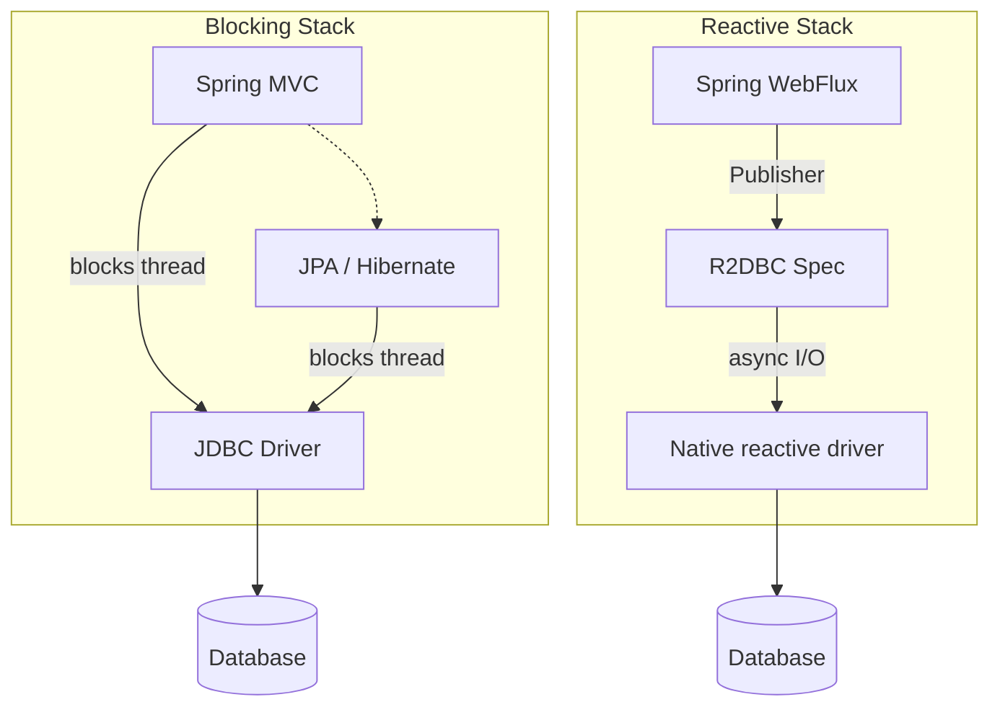
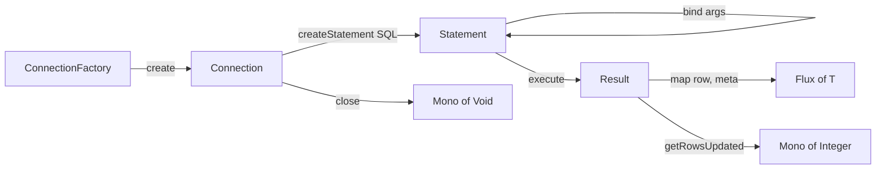
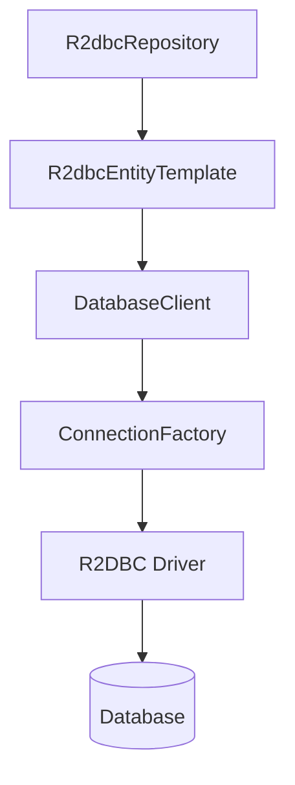
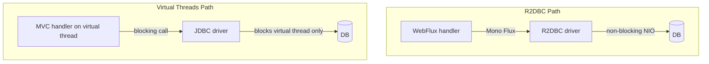

# R2DBC Deep Dive — Reactive SQL in Spring WebFlux

**Date:** 2026-04-18
**Tags:** r2dbc, reactive, spring-data, sql, webflux

## Table of Contents

1. [Summary](#summary)
2. [R2DBC vs JDBC vs JPA](#r2dbc-vs-jdbc-vs-jpa)
3. [Driver Landscape](#driver-landscape)
4. [Core Spec Types](#core-spec-types)
5. [Raw R2DBC Example](#raw-r2dbc-example)
6. [Spring Data R2DBC Abstractions](#spring-data-r2dbc-abstractions)
7. [DatabaseClient Example](#databaseclient-example)
8. [Entity Mapping](#entity-mapping)
9. [Reactive Repositories](#reactive-repositories)
10. [What's Missing vs JPA](#whats-missing-vs-jpa)
11. [Handling Relationships](#handling-relationships)
12. [Connection Pooling](#connection-pooling)
13. [Spring Boot Auto-Config](#spring-boot-auto-config)
14. [Transactions](#transactions)
15. [Pagination](#pagination)
16. [Projections](#projections)
17. [Auditing](#auditing)
18. [Migrations](#migrations)
19. [Testing](#testing)
20. [R2DBC vs Virtual-Threads + JDBC](#r2dbc-vs-virtual-threads--jdbc)
21. [Common Bugs](#common-bugs)
22. [Related](#related)
23. [References](#references)

---

## Summary

**R2DBC** (Reactive Relational Database Connectivity) is a specification for
reactive, non-blocking SQL drivers. It is **not** JDBC, nor is it built on top
of JDBC — it is an independent API designed from the ground up around
`Publisher<T>` from Reactive Streams.

Spring Data R2DBC is Spring's layer on top of the R2DBC spec. It provides
`DatabaseClient`, `R2dbcEntityTemplate`, and `R2dbcRepository<T, ID>` in the
same spirit as `JdbcTemplate` / `JpaRepository` but returning `Mono` and
`Flux`.

Compared to JPA it is deliberately minimal:

- No lazy loading
- No dirty checking / automatic flush
- No persistence context / first-level cache
- No automatic cascade
- No relationship proxies (`@OneToMany` auto-mapping)

You write SQL (or derived queries), you map rows to objects, and you **call
`save()` explicitly** when you want a write to happen. Think of it as a
reactive, slightly ORM-flavored `JdbcTemplate` — not a reactive Hibernate.

---

## R2DBC vs JDBC vs JPA

| Aspect           | JDBC            | JPA / Hibernate                                  | R2DBC                                                 |
| ---------------- | --------------- | ------------------------------------------------ | ----------------------------------------------------- |
| Blocking         | Yes             | Yes                                              | No                                                    |
| ORM features     | No              | Yes (relationships, caching, dirty check)        | No (minimal mapping)                                  |
| Driver model     | Synchronous     | Synchronous (uses JDBC under the hood)           | Reactive (native async driver)                        |
| Suitable stack   | MVC             | MVC                                              | WebFlux                                               |
| Vendor support   | All major DBs   | All major DBs                                    | Postgres, MySQL, MSSQL, H2, Oracle, MariaDB           |
| Session / cache  | None            | First-level cache, optional second-level         | None                                                  |
| Lazy loading     | N/A             | Yes                                              | No                                                    |
| Change tracking  | Manual          | Automatic (dirty check on flush)                 | Manual (explicit `save`)                              |
| Streaming rows   | `ResultSet`     | Indirect                                         | Native `Flux<T>` with backpressure                    |



---

## Driver Landscape

R2DBC is a spec; you must pick a driver that implements it for your database.
Current state as of 2026:

- **PostgreSQL** — `io.r2dbc:r2dbc-postgresql` (originated at Pivotal/VMware,
  now maintained under the R2DBC org). The most mature driver and the
  canonical choice for reactive SQL work.
- **MySQL** — `io.asyncer:r2dbc-mysql` (community fork that took over from the
  original `dev.miku` driver), or MariaDB's `org.mariadb:r2dbc-mariadb`.
- **SQL Server** — `io.r2dbc:r2dbc-mssql`.
- **H2** — `io.r2dbc:r2dbc-h2`. Dev/test only; not for production.
- **Oracle** — `com.oracle.database.r2dbc:oracle-r2dbc`, maintained by Oracle.

Driver quality still varies. The Postgres driver is the reference
implementation and has the best feature coverage (arrays, JSONB, enums,
`LISTEN`/`NOTIFY`). Other drivers lag on edge features like vendor-specific
types, server cursors, or multi-statement batches — check the driver's
changelog before relying on a specific feature.

---

## Core Spec Types

These are **R2DBC spec types**, not Spring types. Understanding them is useful
for debugging and for the rare cases where you drop below Spring Data.

- **`ConnectionFactory`** — creates `Connection`s. Configured from a URL or
  `ConnectionFactoryOptions`. This is the analogue of a JDBC `DataSource`.
- **`Connection`** — a single reactive connection. Offers `createStatement`,
  `beginTransaction`, `commitTransaction`, `rollbackTransaction`, `close`.
- **`Statement`** — a parameterized SQL statement. Parameter binding is
  positional or named; syntax varies per driver (Postgres uses `$1`, `$2`,
  others use `?` or `:name`).
- **`Result`** — the reactive result of executing a statement. It exposes
  `map((row, meta) -> ...)` to convert rows to values, and
  `getRowsUpdated()` for DML.

All of these expose `Publisher<T>` returns, typically consumed via
`Mono.from(...)` / `Flux.from(...)`.



---

## Raw R2DBC Example

Spring Data hides this plumbing, but it helps to see the spec underneath at
least once:

```java
ConnectionFactory factory = ConnectionFactories.get(
    "r2dbc:postgresql://user:pw@localhost:5432/mydb");

Mono.from(factory.create())
    .flatMapMany(conn ->
        Mono.from(conn.createStatement(
                "SELECT id, name FROM users WHERE age > $1")
            .bind("$1", 18)
            .execute())
        .flatMapMany(result -> result.map((row, meta) ->
            new User(
                row.get("id", Long.class),
                row.get("name", String.class))))
        .doFinally(s -> Mono.from(conn.close()).subscribe())
    )
    .subscribe(System.out::println);
```

Observations:

- `ConnectionFactories.get(url)` parses the URL and selects a driver via the
  service loader.
- Every step is a `Publisher<T>` — nothing happens until you subscribe.
- **You must close the connection yourself** when using the raw API. Spring
  Data does this for you.
- `row.get("id", Long.class)` is type-safe but not null-safe; you handle nulls
  explicitly.

---

## Spring Data R2DBC Abstractions

Spring Data R2DBC sits above the spec and offers three tiers of API:

1. **`DatabaseClient`** — fluent, SQL-first, similar in spirit to
   `JdbcTemplate` / `NamedParameterJdbcTemplate`. You write SQL, bind
   parameters, and map rows. No entity metadata required.
2. **`R2dbcEntityTemplate`** — adds entity mapping and CRUD helpers
   (`insert`, `update`, `select`, `delete`) with a fluent criteria builder.
3. **`R2dbcRepository<T, ID>`** — the repository interface, with derived
   queries (`findByEmail`), `@Query` methods, and Pageable support.



Pick the highest level that fits the query. Use `DatabaseClient` when you want
hand-written SQL or complex joins; use the repository for standard CRUD and
derived finders.

---

## DatabaseClient Example

```java
@Service
@RequiredArgsConstructor
public class UserDao {

    private final DatabaseClient client;

    public Flux<User> findActiveAdults() {
        return client.sql("""
                SELECT id, name
                FROM users
                WHERE age > :age
                  AND active = true
                """)
            .bind("age", 18)
            .map((row, meta) -> new User(
                row.get("id", Long.class),
                row.get("name", String.class)))
            .all();
    }

    public Mono<Long> countActive() {
        return client.sql("SELECT count(*) FROM users WHERE active = true")
            .map((row, meta) -> row.get(0, Long.class))
            .one();
    }

    public Mono<Integer> deactivate(Long id) {
        return client.sql("UPDATE users SET active = false WHERE id = :id")
            .bind("id", id)
            .fetch()
            .rowsUpdated()
            .map(Long::intValue);
    }
}
```

The terminal operators are `one()`, `first()`, `all()`, and `rowsUpdated()`.
Named parameters (`:age`) are driver-agnostic — Spring rewrites them into the
dialect the driver expects.

---

## Entity Mapping

Spring Data R2DBC uses its own annotations from
`org.springframework.data.relational.core.mapping` and
`org.springframework.data.annotation`. **Do not use JPA annotations here** —
`@Entity`, `@OneToMany`, `@ManyToOne`, `@JoinColumn`, `@GeneratedValue` are
all ignored by R2DBC and will mislead readers.

```java
@Table("users")
public record User(
    @Id Long id,
    String name,
    Integer age,
    @Column("is_active") Boolean active,
    @CreatedDate Instant createdAt,
    @LastModifiedDate Instant updatedAt,
    @Version Integer version
) {}
```

- **`@Table("users")`** — optional; defaults to the class name with
  configurable naming strategy (usually snake_case).
- **`@Id`** — marks the primary key. R2DBC detects generated IDs by a null/zero
  value on insert.
- **`@Column("is_active")`** — override the column name.
- **`@Version`** — enables optimistic locking. Increments on each save; a stale
  version causes `OptimisticLockingFailureException`.
- **`@CreatedDate`, `@LastModifiedDate`, `@CreatedBy`, `@LastModifiedBy`** —
  require `@EnableR2dbcAuditing` on a config class.

**Records work well** with R2DBC because the mapping is constructor-based and
the entities are immutable. If you mutate a record "in place" you actually
produce a new instance — which you then pass back into `save()`. This is a
more honest model than JPA dirty checking.

---

## Reactive Repositories

```java
public interface UserRepository extends R2dbcRepository<User, Long> {

    Flux<User> findByAgeGreaterThan(int age);

    Mono<User> findByEmail(String email);

    @Query("""
        SELECT * FROM users
        WHERE status = :status
          AND created_at > :since
        """)
    Flux<User> findRecentByStatus(String status, Instant since);

    @Modifying
    @Query("UPDATE users SET active = false WHERE last_login < :cutoff")
    Mono<Integer> deactivateInactive(Instant cutoff);
}
```

- Derived queries (`findByAgeGreaterThan`) are parsed from the method name,
  exactly like Spring Data JPA.
- `@Query` holds hand-written SQL. Named parameters are bound from method
  arguments by position (or by `@Param`).
- `@Modifying` is **required** for DML inside `@Query`. Without it, Spring
  tries to map rows.
- Return `Mono<Integer>` for row-count results, `Mono<Void>` to ignore them.

Built-ins from `R2dbcRepository<T, ID>`:

```java
Mono<T>        findById(ID id);
Flux<T>        findAll();
Flux<T>        findAllById(Iterable<ID> ids);
Mono<T>        save(T entity);
Flux<T>        saveAll(Iterable<T> entities);
Mono<Void>     deleteById(ID id);
Mono<Long>     count();
Mono<Boolean>  existsById(ID id);
```

---

## What's Missing vs JPA

R2DBC intentionally leaves out the "magic" parts of JPA. This is a feature,
not a bug, but it requires a mindset shift.

- **No lazy loading.** There are no proxies. If a row has a foreign key, the
  entity holds the raw `Long` (or whatever type). You join explicitly in SQL,
  or issue a second query and `zip` results.
- **No dirty checking.** Changing a field on an entity does nothing until you
  call `repo.save(entity)`. There is no autoflush on transaction commit.
- **No cascading.** Saving an `Order` does not save its `Item`s. You save each
  aggregate root yourself, typically in a transaction.
- **No persistence context / first-level cache.** Two calls to `findById(1)`
  in the same request hit the database twice. This is usually fine — caching
  is an explicit decision, not a silent default.
- **Limited relationship mapping.** No `@OneToMany`, `@ManyToOne`,
  `@ManyToMany`. Embedded value types are supported (`@Embedded`), and
  `@MappedCollection` exists for simple 1-to-many aggregate references, but
  anything graph-shaped is your problem.
- **No lazy proxies.** Everything fetched is materialized immediately; there
  is no `LazyInitializationException`, because there is no lazy.

This map of absences is the single most important thing to internalize if you
are coming from JPA.

---

## Handling Relationships

The idiomatic pattern is "one query per aggregate edge, zipped together":

```java
public Mono<OrderWithItems> loadOrder(Long id) {
    Mono<Order> orderMono = orderRepo.findById(id);
    Mono<List<Item>> itemsMono = itemRepo.findByOrderId(id).collectList();
    return Mono.zip(orderMono, itemsMono, OrderWithItems::new);
}
```

For list endpoints, prefer a single join-and-group query via `DatabaseClient`
to avoid N+1:

```java
public Flux<OrderWithItems> loadRecent(int limit) {
    return client.sql("""
            SELECT o.id, o.customer_id, o.created_at,
                   i.id AS item_id, i.sku, i.qty
            FROM orders o
            LEFT JOIN items i ON i.order_id = o.id
            WHERE o.created_at > now() - interval '7 days'
            ORDER BY o.id
            LIMIT :limit
            """)
        .bind("limit", limit)
        .map((row, meta) -> new OrderItemRow(row))
        .all()
        .bufferUntilChanged(OrderItemRow::orderId)
        .map(OrderWithItems::fromRows);
}
```

`bufferUntilChanged` groups adjacent rows sharing the same `orderId`; this is
the reactive equivalent of SQL's grouping-by-order-key trick. Works because
we order by `o.id`.

---

## Connection Pooling

R2DBC itself does not pool. You wrap the base `ConnectionFactory` in
`r2dbc-pool` (`io.r2dbc:r2dbc-pool`).

```java
@Configuration
public class R2dbcConfig {

    @Bean
    public ConnectionFactory connectionFactory() {
        ConnectionFactory base = ConnectionFactories.get(
            ConnectionFactoryOptions.parse("r2dbc:postgresql://localhost/mydb")
                .mutate()
                .option(ConnectionFactoryOptions.USER, "user")
                .option(ConnectionFactoryOptions.PASSWORD, "pw")
                .build());

        ConnectionPoolConfiguration poolCfg =
            ConnectionPoolConfiguration.builder(base)
                .initialSize(5)
                .maxSize(20)
                .maxIdleTime(Duration.ofMinutes(10))
                .maxAcquireTime(Duration.ofSeconds(5))
                .validationQuery("SELECT 1")
                .build();

        return new ConnectionPool(poolCfg);
    }
}
```

Sizing rule of thumb: start with `maxSize = 2 * CPU cores`, measure, adjust.
Unlike blocking pools, reactive apps rarely block on a connection — a
backpressure-aware client will not oversubscribe — so you usually need far
fewer connections than an MVC app.

Spring Boot auto-configures pooling when `r2dbc-pool` is on the classpath.
You only write the bean above if you need non-default behavior.

---

## Spring Boot Auto-Config

```yaml
spring:
  r2dbc:
    url: r2dbc:postgresql://localhost:5432/mydb
    username: user
    password: pw
    pool:
      enabled: true
      initial-size: 5
      max-size: 20
      max-idle-time: 10m
      max-acquire-time: 5s
      validation-query: SELECT 1
```

With `spring-boot-starter-data-r2dbc` and a driver on the classpath, Boot
auto-configures:

- `ConnectionFactory` (pooled if `r2dbc-pool` is present)
- `DatabaseClient`
- `R2dbcEntityTemplate`
- `R2dbcTransactionManager`
- Repository scanning via `@EnableR2dbcRepositories` (implicit under
  Boot)

---

## Transactions

Covered in depth in [`reactive-transactions.md`](reactive-transactions.md).
Short version:

- `R2dbcTransactionManager` is the reactive transaction manager.
- `@Transactional` **does** work on methods that return `Mono<T>` or `Flux<T>`
  — Spring 5.2+ supports reactive transactions when a reactive tx manager is
  present. The transactional boundary is tied to the **subscription**, not the
  method call.
- For programmatic control use `TransactionalOperator`:

  ```java
  private final TransactionalOperator tx;

  public Mono<Order> placeOrder(OrderRequest req) {
      return tx.transactional(
          orderRepo.save(toOrder(req))
              .flatMap(saved -> itemRepo.saveAll(toItems(saved, req)).then(Mono.just(saved)))
      );
  }
  ```

- You cannot use `@Transactional` on a method that returns `void` with the
  reactive tx manager — it silently becomes a no-op. Return `Mono<Void>`.

---

## Pagination

**There is no reactive `Page<T>`.** The blocking `Page` contract requires a
`count` and `data` query to both complete before constructing the page, which
defeats streaming and makes error composition awkward.

What you get instead:

1. **`Pageable` support on repositories** returns `Flux<T>` — the offset/limit
   slice. No total count.

   ```java
   Flux<User> findByStatus(String status, Pageable pageable);
   ```

   Combine with an explicit `count` query when you really need a total:

   ```java
   public Mono<PagedResult<User>> page(String status, Pageable p) {
       return Mono.zip(
           userRepo.findByStatus(status, p).collectList(),
           userRepo.countByStatus(status),
           (content, total) -> new PagedResult<>(content, p, total));
   }
   ```

2. **Cursor-based pagination** — preferred for large or infinite feeds:

   ```sql
   SELECT * FROM users
   WHERE id > :lastSeen
   ORDER BY id
   LIMIT :size
   ```

   Stable under inserts, no `OFFSET` scan cost, composes cleanly with `Flux`.

Full treatment in [`queries-and-pagination.md`](queries-and-pagination.md).

---

## Projections

Same mechanisms as Spring Data JPA:

```java
// Interface projection
public interface UserSummary {
    String getName();
    Integer getAge();
}

Flux<UserSummary> findByActiveTrue();
```

```java
// Class / record projection (constructor projection)
public record UserSummary(String name, Integer age) {}

@Query("SELECT name, age FROM users WHERE active = true")
Flux<UserSummary> findSummaries();
```

```java
// DTO mapping via DatabaseClient
client.sql("SELECT name, age FROM users WHERE active = true")
    .map((row, meta) -> new UserSummary(
        row.get("name", String.class),
        row.get("age", Integer.class)))
    .all();
```

Interface projections are convenient but allocate a proxy per row; for hot
paths, records with constructor projection are leaner.

---

## Auditing

```java
@Configuration
@EnableR2dbcAuditing
public class AuditConfig {

    @Bean
    public ReactiveAuditorAware<String> auditorAware() {
        return () -> ReactiveSecurityContextHolder.getContext()
            .map(ctx -> ctx.getAuthentication().getName())
            .defaultIfEmpty("system");
    }
}
```

`@CreatedDate` / `@LastModifiedDate` work out of the box with a `Clock`.
`@CreatedBy` / `@LastModifiedBy` need a `ReactiveAuditorAware<T>` — note the
**reactive** variant; using the blocking `AuditorAware` here does nothing.

---

## Migrations

**Flyway is JDBC-only.** It does not speak R2DBC. The standard pattern is:

1. Keep migrations in `db/migration/` as usual.
2. At startup, run Flyway against a short-lived **JDBC** datasource pointed at
   the same database.
3. Use R2DBC for runtime queries.

```java
@Configuration
public class MigrationConfig {

    @Bean(initMethod = "migrate")
    public Flyway flyway(
            @Value("${db.jdbc-url}") String url,
            @Value("${spring.r2dbc.username}") String user,
            @Value("${spring.r2dbc.password}") String pw) {
        return Flyway.configure()
            .dataSource(url, user, pw)
            .locations("classpath:db/migration")
            .load();
    }
}
```

Keep the JDBC URL and R2DBC URL in sync (same host/db, different scheme).
The JDBC datasource is only alive during startup migration; at runtime only
the R2DBC pool is used.

**Liquibase** does have R2DBC support
(`liquibase-core` + `liquibase-r2dbc`), but coverage of changeset features
still lags behind JDBC. Most teams stick with Flyway + JDBC at startup for
simplicity.

---

## Testing

Use Testcontainers with real PostgreSQL and `@DataR2dbcTest` for slice
testing:

```java
@DataR2dbcTest
@Testcontainers
class UserRepoTest {

    @Container
    static PostgreSQLContainer<?> pg = new PostgreSQLContainer<>("postgres:16");

    @DynamicPropertySource
    static void setup(DynamicPropertyRegistry reg) {
        reg.add("spring.r2dbc.url", () ->
            "r2dbc:postgresql://" + pg.getHost() + ":"
                + pg.getFirstMappedPort() + "/" + pg.getDatabaseName());
        reg.add("spring.r2dbc.username", pg::getUsername);
        reg.add("spring.r2dbc.password", pg::getPassword);
    }

    @Autowired UserRepository repo;

    @Test
    void savesAndFindsUser() {
        User u = new User(null, "Ada", 36, true, null, null, null);

        StepVerifier.create(repo.save(u).flatMap(saved -> repo.findById(saved.id())))
            .assertNext(found -> {
                assertThat(found.name()).isEqualTo("Ada");
                assertThat(found.version()).isEqualTo(0);
            })
            .verifyComplete();
    }
}
```

- `@DataR2dbcTest` wires `DatabaseClient`, `R2dbcEntityTemplate`, and the
  repository layer without the full context.
- `StepVerifier` is the standard tool for asserting on reactive streams.
- Never test against H2 R2DBC if production runs on Postgres — dialect
  differences (arrays, JSONB, window functions) will bite. Cross-ref
  [`../testing/testcontainers.md`](../testing/testcontainers.md).

---

## R2DBC vs Virtual-Threads + JDBC

Java 21's virtual threads change the calculus. A blocking JDBC call on a
virtual thread no longer pins a platform thread — you get cheap concurrency
without a reactive API. For many apps this is a simpler alternative to R2DBC.



Pick **R2DBC** when:

- The whole stack is already reactive (WebFlux, WebClient, reactive Kafka).
- You need database-level backpressure flowing all the way to the HTTP
  response (streaming large result sets to SSE, for example).
- You value uniform `Mono`/`Flux` composition across IO boundaries.

Pick **virtual threads + JDBC** when:

- You prefer imperative code and straightforward debugging / stack traces.
- You need driver features that only exist in JDBC (specific vendor types,
  stored procedure ergonomics, mature tooling).
- You want to use JPA/Hibernate for complex domain models.
- The team is not comfortable with Reactor operators.

Cross-refs: [`../spring-virtual-threads.md`](../spring-virtual-threads.md),
[`../reactive-blocking-jpa-pattern.md`](../reactive-blocking-jpa-pattern.md).

---

## Common Bugs

1. **Mixing JDBC and R2DBC without separating pools.** Running Flyway
   migrations against the R2DBC-backed datasource (which does not exist as
   JDBC) will fail; running runtime queries through a JDBC `DataSource` you
   forgot to tear down wastes connections. Keep the two pools explicitly
   separate and scoped.

2. **Expecting dirty-check behavior.** Fetching an entity, mutating a field,
   and committing the transaction does **not** persist the change. You must
   call `repo.save(updated)`. This is the single most common regression from
   JPA developers.

3. **Not closing connections in raw R2DBC.** Spring Data handles this for you,
   but hand-rolled code using `ConnectionFactory.create()` must call
   `conn.close()` in a `doFinally` / `usingWhen`. Prefer
   `Mono.usingWhen(factory.create(), work, Connection::close)` — it closes on
   cancel, complete, and error.

4. **`@Transactional` on `void` reactive methods.** If the method returns
   `void` (not `Mono<Void>`), the reactive transaction manager has nothing to
   subscribe to and the annotation is a silent no-op. Always return a
   reactive type.

5. **Long-lived cursors without paging.** Returning `Flux<T>` from a query
   that reads a huge table keeps a cursor open for the lifetime of the
   subscription. Combine with `.take(n)`, cursor pagination, or server-side
   `LIMIT` so cursors do not outlive a request.

6. **Using JPA annotations on R2DBC entities.** `@Entity`, `@GeneratedValue`,
   `@OneToMany` — all ignored. Worse, they give a false sense of mapping
   coverage. Stick to `@Table`, `@Id`, `@Column`, `@Version`.

7. **Blocking calls inside reactive pipelines.** Calling a JDBC repo from
   inside a `flatMap` blocks the event loop thread. If you must bridge,
   `subscribeOn(Schedulers.boundedElastic())` isolates the blocking call.
   Better: see the blocking-JPA pattern doc.

---

## Related

- [`repository-interfaces.md`](repository-interfaces.md) — shape and
  conventions of `R2dbcRepository` interfaces.
- [`queries-and-pagination.md`](queries-and-pagination.md) — derived queries,
  `@Query`, cursor pagination patterns.
- [`reactive-data-layer.md`](reactive-data-layer.md) — designing the data
  layer holistically in a WebFlux app.
- [`reactive-transactions.md`](reactive-transactions.md) — `@Transactional`
  semantics on reactive types, `TransactionalOperator`.
- [`../configurations/database-config.md`](../configurations/database-config.md)
  — full config examples, profiles, secret handling.
- [`../reactive-blocking-jpa-pattern.md`](../reactive-blocking-jpa-pattern.md)
  — when you must bridge to blocking JPA from WebFlux.
- [`../spring-virtual-threads.md`](../spring-virtual-threads.md) — the
  non-reactive alternative enabled by Java 21.

---

## References

- [R2DBC Specification](https://r2dbc.io/spec/) — the reactive relational connectivity spec
- [Spring Data R2DBC Reference](https://docs.spring.io/spring-data/relational/reference/r2dbc.html) — `DatabaseClient`, `R2dbcEntityTemplate`, repositories
- [r2dbc-pool on GitHub](https://github.com/r2dbc/r2dbc-pool) — connection pool implementation
- [r2dbc-postgresql driver](https://github.com/pgjdbc/r2dbc-postgresql) — Postgres driver
- [Spring Boot R2DBC auto-config](https://docs.spring.io/spring-boot/reference/data/sql.html#data.sql.r2dbc) — `spring.r2dbc.*` properties
- [Reactive Transactions (Spring)](https://docs.spring.io/spring-framework/reference/data-access/transaction/reactive.html) — `ReactiveTransactionManager`, propagation
- [Testcontainers R2DBC module](https://java.testcontainers.org/modules/databases/r2dbc/) — integration testing
