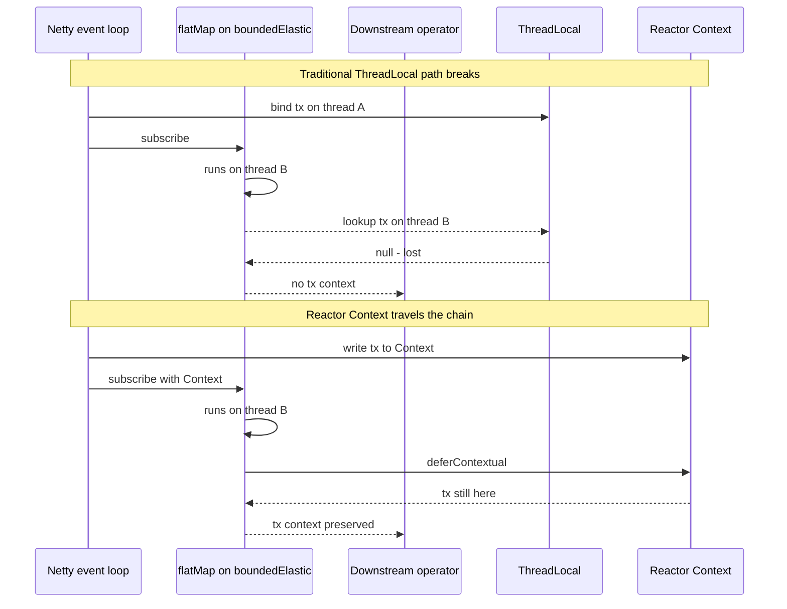
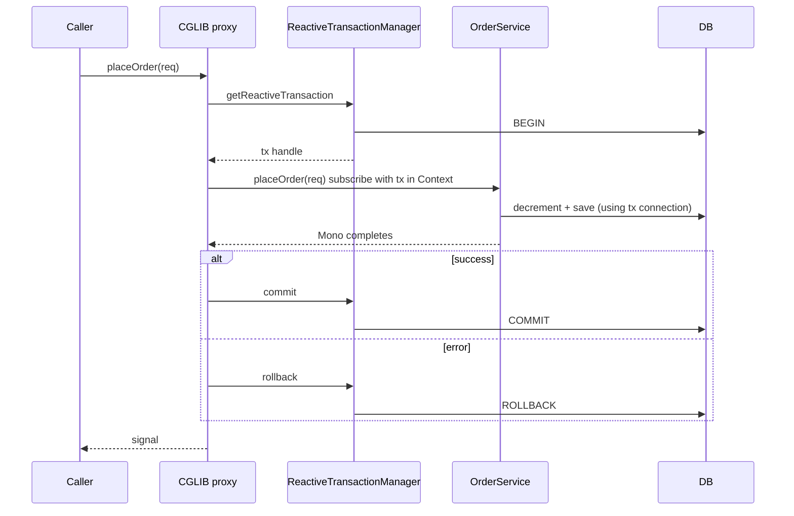
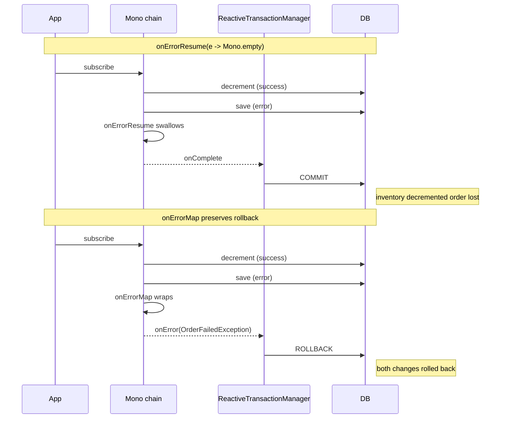

# Reactive Transactions — TransactionalOperator and @Transactional on Mono/Flux

Date: 2026-04-18 | Tags: reactive, transactions, webflux, r2dbc, mongo, transactional-operator

## Table of Contents

- [Summary](#summary)
- [Why reactive transactions are different](#why-reactive-transactions-are-different)
- [ReactiveTransactionManager](#reactivetransactionmanager)
- [@Transactional on reactive methods](#transactional-on-reactive-methods)
- [TransactionalOperator — programmatic](#transactionaloperator--programmatic)
- [When to use @Transactional vs TransactionalOperator](#when-to-use-transactional-vs-transactionaloperator)
- [The self-invocation trap](#the-self-invocation-trap)
- [Rollback semantics in reactive chains](#rollback-semantics-in-reactive-chains)
- [Read-only transactions](#read-only-transactions)
- [Propagation](#propagation)
- [Isolation levels](#isolation-levels)
- [Transaction timeout](#transaction-timeout)
- [Cross-store transactions — NOT transactional](#cross-store-transactions--not-transactional)
- [Mongo replica set requirement](#mongo-replica-set-requirement)
- [Auditing and transactions](#auditing-and-transactions)
- [Testing reactive transactions](#testing-reactive-transactions)
- [Common bugs](#common-bugs)
- [Reactor Context and the tx context](#reactor-context-and-the-tx-context)
- [Related](#related)
- [References](#references)

---

## Summary

Traditional `@Transactional` (see `../jpa-transactions.md`) relies on **ThreadLocal** storage for the transaction context. The tx manager binds the `Connection`/`EntityManager` to the current thread and unwinds it on commit or rollback. That works because servlet processing is single-threaded per request.

Reactive chains break this model. A single `Mono` pipeline can hop between threads — a `flatMap` might schedule work on `boundedElastic`, a downstream operator might switch back to `parallel`, and Netty's event loop handles the final write. ThreadLocal storage does not survive these hops.

Spring's solution (Spring 5.2+):

- **`ReactiveTransactionManager`** — the reactive equivalent of `PlatformTransactionManager`.
- **`TransactionalOperator`** — programmatic API that wraps a `Mono`/`Flux` in a transaction.
- **Reactive `@Transactional`** — works on methods returning `Mono<T>` or `Flux<T>` when a `ReactiveTransactionManager` bean is present.

The tx context is propagated via Reactor's **`Context`** — an immutable map threaded through the reactive chain — not ThreadLocal.

---

## Why reactive transactions are different



Key point: **a reactive tx cannot be a ThreadLocal**. Spring stores it in the Reactor `Context` that Spring injects into the subscription. Every operator automatically forwards `Context` downstream.

---

## ReactiveTransactionManager

The reactive counterpart of `PlatformTransactionManager`. Common implementations:

| Manager | Module | Notes |
|---------|--------|-------|
| `R2dbcTransactionManager` | `spring-data-r2dbc` | Auto-configured when R2DBC starter is on classpath |
| `ReactiveMongoTransactionManager` | `spring-data-mongodb` | Requires Mongo replica set (even single-node) |

Spring Boot auto-configures **one** when the reactive data starter is on the classpath. If both R2DBC and reactive Mongo are present, you will have two beans and must qualify:

```java
@Transactional("r2dbcTransactionManager")
public Mono<Order> saveOrder(...) { ... }
```

Manual bean (rarely needed):

```java
@Bean
public ReactiveTransactionManager r2dbcTransactionManager(ConnectionFactory cf) {
    return new R2dbcTransactionManager(cf);
}
```

---

## @Transactional on reactive methods

### The modern way

```java
@Service
@RequiredArgsConstructor
public class OrderService {
    private final OrderRepository orderRepo;
    private final InventoryRepository invRepo;

    @Transactional
    public Mono<Order> placeOrder(OrderRequest req) {
        return invRepo.decrement(req.productId(), req.quantity())
            .then(orderRepo.save(new Order(req)))
            .onErrorMap(e -> new OrderFailedException("failed", e));
    }
}
```

### Requirements

1. **Method returns `Mono<T>` or `Flux<T>`.** Do **not** put `@Transactional` on a method returning `void`, `CompletableFuture`, or a blocking type in a reactive service — Spring cannot wrap the subscription.
2. **A `ReactiveTransactionManager` bean is registered.** Otherwise Spring falls back to `PlatformTransactionManager` if available (a subtle bug — see [Common bugs](#common-bugs)).
3. **Method is on a Spring-managed bean** and invoked through the proxy. See `../spring-aop-deep-dive.md` for proxy mechanics and `../spring-fundamentals.md#aop-and-proxies--the-magic-explained`.

### What Spring does under the hood



---

## TransactionalOperator — programmatic

```java
@Service
@RequiredArgsConstructor
public class OrderService {
    private final TransactionalOperator tx;
    private final OrderRepository orderRepo;
    private final InventoryRepository invRepo;

    public Mono<Order> placeOrder(OrderRequest req) {
        Mono<Order> pipeline = invRepo.decrement(req.productId(), req.quantity())
            .then(orderRepo.save(new Order(req)));
        return tx.transactional(pipeline);
    }
}
```

### Configuration

```java
@Bean
public TransactionalOperator transactionalOperator(ReactiveTransactionManager rtm) {
    return TransactionalOperator.create(rtm);
}
```

With a custom `TransactionDefinition`:

```java
TransactionalOperator readOnly = TransactionalOperator.create(
    rtm,
    new DefaultTransactionDefinition() {{
        setReadOnly(true);
        setIsolationLevel(TransactionDefinition.ISOLATION_REPEATABLE_READ);
    }}
);
```

### Flux usage

```java
Flux<Item> items = tx.transactional(
    itemRepo.findAllByOrderId(id)
);
```

`transactional()` works on both `Mono` and `Flux`. The tx commits when the publisher completes and rolls back on error.

---

## When to use @Transactional vs TransactionalOperator

| Need | Use |
|------|-----|
| Simple method-scoped tx | `@Transactional` |
| Multiple tx blocks in one method | `TransactionalOperator` |
| Conditional tx based on input | `TransactionalOperator` |
| Nested with different propagation | `TransactionalOperator` (more explicit) |
| Cannot rely on proxy (static, self-invocation, Kotlin private method, etc.) | `TransactionalOperator` |
| Reuse in a utility/helper class | `TransactionalOperator` |
| Dynamic timeout/isolation per call | `TransactionalOperator` |

In practice, **prefer `@Transactional` for the default case** and drop to `TransactionalOperator` when the annotation does not fit.

---

## The self-invocation trap

Same gotcha as the servlet world. Because `@Transactional` is applied by a proxy, a call like `this.method()` bypasses the proxy entirely:

```java
@Service
public class OrderService {

    public Mono<Void> outer(OrderRequest req) {
        return this.inner(req); // bypasses proxy — no tx
    }

    @Transactional
    public Mono<Order> inner(OrderRequest req) { ... }
}
```

Fixes:

- Move `inner` to another bean.
- Inject `OrderService self` into itself (self-inject pattern).
- Use `TransactionalOperator` in `outer`.

Cross-ref: `../spring-fundamentals.md#aop-and-proxies--the-magic-explained`, `../spring-aop-deep-dive.md`.

---

## Rollback semantics in reactive chains

### Default behavior

The tx manager observes the signal the wrapped `Mono`/`Flux` emits to its subscriber:

- `onComplete` (success) → **commit**
- `onError(Throwable)` → **rollback**
- Subscription cancelled → **rollback** (cancel is treated as abort)

### The `onErrorResume` trap

If you recover from an error mid-chain, the tx manager never sees the error:

```java
@Transactional
public Mono<Order> placeOrder(OrderRequest req) {
    return invRepo.decrement(req.productId(), req.quantity())
        .then(orderRepo.save(new Order(req)))
        .onErrorResume(e -> Mono.empty()); // BUG — swallows error, tx commits
}
```

From the tx manager's view, the chain completed successfully → **commit**. Any partial writes (e.g., the inventory decrement) are persisted.

### Use `onErrorMap` to transform while preserving rollback

```java
@Transactional
public Mono<Order> placeOrder(OrderRequest req) {
    return invRepo.decrement(req.productId(), req.quantity())
        .then(orderRepo.save(new Order(req)))
        .onErrorMap(IllegalStateException.class,
                    e -> new OrderFailedException("inv", e));
}
```

### `doOnError` is fine

```java
.doOnError(e -> log.error("order failed", e)) // side effect only, error still propagates
```

### Visualized



### `rollbackFor` / `noRollbackFor`

Still work on reactive `@Transactional`:

```java
@Transactional(rollbackFor = Exception.class, noRollbackFor = NotFoundException.class)
public Mono<Order> placeOrder(...) { ... }
```

By default, reactive `@Transactional` rolls back on **any** `Throwable` emitted (unlike servlet default which excludes checked exceptions — Reactor errors are all unchecked anyway).

---

## Read-only transactions

```java
@Transactional(readOnly = true)
public Flux<Order> listByCustomer(Long customerId) {
    return orderRepo.findAllByCustomerId(customerId);
}
```

Effect depends on driver:

- **R2DBC Postgres** — sets the connection's read-only flag; the DB may optimize (no snapshot tracking for writes).
- **R2DBC MySQL** — issues `SET TRANSACTION READ ONLY`.
- **Mongo** — no-op beyond signaling intent.

Some driver/infra combos route read-only tx to **read replicas** (see also `../jpa-transaction-propagation.md#readonly-true-for-read-heavy`).

---

## Propagation

Reactive transactions support a **subset** of the propagation modes. The fully supported set:

| Propagation | R2DBC | Mongo |
|-------------|-------|-------|
| `REQUIRED` (default) | yes | yes |
| `REQUIRES_NEW` | yes | depends on driver version |
| `SUPPORTS` | yes | yes |
| `NOT_SUPPORTED` | yes | yes |
| `MANDATORY` | yes | yes |
| `NEVER` | yes | yes |
| `NESTED` | limited / not supported | not supported |

For the full propagation matrix in the blocking world, see `../jpa-transaction-propagation.md`.

### REQUIRES_NEW example

```java
@Transactional(propagation = Propagation.REQUIRES_NEW)
public Mono<Void> logAudit(AuditEvent e) {
    return auditRepo.save(e).then();
}
```

The outer tx is suspended; the inner one commits or rolls back independently. Useful for audit logs that must persist even if the caller rolls back.

---

## Isolation levels

```java
@Transactional(isolation = Isolation.SERIALIZABLE)
public Mono<Transfer> transfer(TransferRequest r) { ... }
```

Driver support varies. R2DBC Postgres/MySQL support the standard four levels (`READ_UNCOMMITTED`, `READ_COMMITTED`, `REPEATABLE_READ`, `SERIALIZABLE`). Mongo's isolation model is different (snapshot-based); the attribute is largely ignored beyond the default.

---

## Transaction timeout

```java
@Transactional(timeout = 5) // seconds
public Mono<Order> placeOrder(OrderRequest req) { ... }
```

Enforced by the tx manager. After the timeout, the outer subscription is cancelled and the tx rolls back. Downstream operators must be cancellation-safe — this usually just means not blocking.

Cancellation propagates through Reactor automatically; user code rarely needs to handle it explicitly.

---

## Cross-store transactions — NOT transactional

```java
@Transactional
public Mono<Order> placeOrder(OrderRequest req) {
    return mongoInvRepo.decrement(...)     // Mongo
        .then(r2dbcOrderRepo.save(...));   // Postgres
    // NO — not a single tx
}
```

Only **one** tx manager participates in an `@Transactional` boundary. The other store operates with auto-commit semantics. There is no XA equivalent for reactive drivers.

Patterns to reach for:

- **Saga** — orchestrate compensating actions across services/stores.
- **Transactional Outbox** — write domain change + outbox event in one local tx; a separate worker publishes.
- **Change Data Capture** — tail the local tx log (Debezium, etc.).

See `../messaging/event-driven-patterns.md`.

---

## Mongo replica set requirement

Mongo transactions **require a replica set** — even a single-node one. A standalone `mongod` throws:

```
MongoCommandException: Command failed with error 20 (IllegalOperation):
'Transaction numbers are only allowed on a replica set member or mongos.'
```

### Development setup

Testcontainers:

```java
@Container
static MongoDBContainer mongo = new MongoDBContainer("mongo:7")
    .withReplicaSet("rs0"); // enables rs mode
```

Local:

```bash
mongod --replSet rs0 --dbpath /data/db
mongosh --eval 'rs.initiate()'
```

Docker Compose: use the `mongo` image with `--replSet rs0` and run `rs.initiate()` once.

---

## Auditing and transactions

`@CreatedDate`, `@LastModifiedDate`, `@CreatedBy`, `@LastModifiedBy` populated by Spring Data reactive auditing work inside a transaction; the auditor lookup runs in the same reactive chain.

Ensure:

```java
@Configuration
@EnableReactiveMongoAuditing           // or @EnableR2dbcAuditing
public class AuditConfig {

    @Bean
    public ReactiveAuditorAware<String> auditorAware() {
        return () -> ReactiveSecurityContextHolder.getContext()
            .map(SecurityContext::getAuthentication)
            .map(Authentication::getName);
    }
}
```

The auditor provider must be a `ReactiveAuditorAware`, **not** the blocking `AuditorAware`, or audit fields stay null.

---

## Testing reactive transactions

```java
@DataR2dbcTest
@Testcontainers
class OrderServiceTest {
    @Autowired TransactionalOperator tx;
    @Autowired OrderRepository orderRepo;

    @Test
    void rollsBackOnError() {
        Order bad = new Order("bad");
        var failing = orderRepo.save(bad)
            .then(Mono.error(new RuntimeException("boom")));

        StepVerifier.create(tx.transactional(failing))
            .expectError(RuntimeException.class)
            .verify();

        StepVerifier.create(orderRepo.count())
            .expectNext(0L)
            .verifyComplete();
    }

    @Test
    void commitsOnSuccess() {
        Order good = new Order("good");

        StepVerifier.create(tx.transactional(orderRepo.save(good)))
            .expectNextCount(1)
            .verifyComplete();

        StepVerifier.create(orderRepo.count())
            .expectNext(1L)
            .verifyComplete();
    }
}
```

### Tips

- Use `@DataR2dbcTest` or `@DataMongoTest` (reactive variant) to slice the context.
- Testcontainers for real DB semantics. H2 has limited R2DBC support; Postgres container is the safest default.
- `@Transactional` on the **test method itself** does not automatically roll back reactive tests the way it does blocking ones. Prefer clean-between-tests, not rely-on-rollback.

---

## Common bugs

1. **`@Transactional` on a blocking return type in a WebFlux service.** If the method returns `Order` (not `Mono<Order>`) and both JPA and R2DBC are on the classpath, Spring may pick the JPA `PlatformTransactionManager` and silently use a blocking tx. Blocking inside WebFlux is a performance catastrophe.
2. **`onErrorResume` + transactional → unexpected commit.** Covered above. Use `onErrorMap` to transform while preserving rollback.
3. **Mongo tx on a standalone node.** `MongoCommandException: Transaction numbers are only allowed on a replica set member`. Fix: replica set.
4. **Mixing managers in one `@Transactional`.** If you have both `R2dbcTransactionManager` and `ReactiveMongoTransactionManager`, only one participates. Qualify explicitly: `@Transactional("r2dbcTransactionManager")`.
5. **Calling `.block()` inside a transactional reactive method.** Hangs or deadlocks — blocks the Netty event loop. Never call `.block()` in WebFlux request threads.
6. **Self-invocation.** `this.transactionalMethod()` skips the proxy → no tx. Inject self or use `TransactionalOperator`.
7. **Forgetting the `ReactiveTransactionManager` bean.** `@Transactional` on a reactive method falls back to the blocking manager (if any), which cannot bind to the reactive chain → the tx is opened and immediately closed, annotations effectively no-op.
8. **Returning `Flux<T>` from `REQUIRES_NEW`.** The inner tx spans the entire emitted sequence. If the Flux is long-lived (streaming), the tx is too. Prefer `REQUIRED` for streaming reads.
9. **Using `@Transactional` on `Kotlin suspend fun` without the right kotlinx-reactor bridge.** Spring supports `suspend` since 5.2, but needs `kotlinx-coroutines-reactor` to bridge. Missing dep → no tx.
10. **Auditing not firing.** Wrong annotation (`@EnableMongoAuditing` vs `@EnableReactiveMongoAuditing`) or blocking `AuditorAware` instead of `ReactiveAuditorAware`.

---

## Reactor Context and the tx context

Spring stores the active transaction in the Reactor `Context` under a well-known key. Every operator forwards the context downstream, so:

```java
return someMono
    .flatMap(x -> otherRepo.save(x)) // picks up tx from Context
    .subscribeOn(Schedulers.boundedElastic()); // thread hop — Context still travels
```

You rarely touch this directly. When you do need to, use `deferContextual`:

```java
Mono.deferContextual(ctx -> {
    // inspect ctx if needed
    return someMono;
});
```

Or `contextWrite` to add your own keys:

```java
someMono.contextWrite(Context.of("userId", id));
```

**Do not** manually write the tx context key yourself — Spring owns that. Only attach your own application-scoped values.

### Mental model

| Blocking world | Reactive world |
|----------------|----------------|
| ThreadLocal binds tx | Reactor `Context` carries tx |
| `TransactionSynchronizationManager` | `TransactionContextManager` |
| `PlatformTransactionManager` | `ReactiveTransactionManager` |
| `TransactionTemplate` | `TransactionalOperator` |
| `@Transactional` (method on proxy) | `@Transactional` (same, but returning `Mono`/`Flux`) |

---

## Related

- [r2dbc-deep-dive.md](./r2dbc-deep-dive.md)
- [reactive-data-layer.md](./reactive-data-layer.md)
- [../jpa-transactions.md](../jpa-transactions.md)
- [../jpa-transaction-propagation.md](../jpa-transaction-propagation.md)
- [../spring-fundamentals.md](../spring-fundamentals.md)
- [../spring-aop-deep-dive.md](../spring-aop-deep-dive.md)
- [../reactive-advanced-topics.md](../reactive-advanced-topics.md)
- [../messaging/event-driven-patterns.md](../messaging/event-driven-patterns.md)

---

## References

- Spring Framework Reference — Reactive Transaction Management: https://docs.spring.io/spring-framework/reference/data-access/transaction/reactive.html
- `TransactionalOperator` javadoc: https://docs.spring.io/spring-framework/docs/current/javadoc-api/org/springframework/transaction/reactive/TransactionalOperator.html
- `ReactiveTransactionManager` javadoc: https://docs.spring.io/spring-framework/docs/current/javadoc-api/org/springframework/transaction/ReactiveTransactionManager.html
- Spring Data R2DBC — Transactions: https://docs.spring.io/spring-data/relational/reference/r2dbc/transactions.html
- Spring Data MongoDB — Reactive Transactions: https://docs.spring.io/spring-data/mongodb/reference/mongodb/transactions.html
- MongoDB Manual — Transactions: https://www.mongodb.com/docs/manual/core/transactions/
- Project Reactor — Context: https://projectreactor.io/docs/core/release/reference/#context
