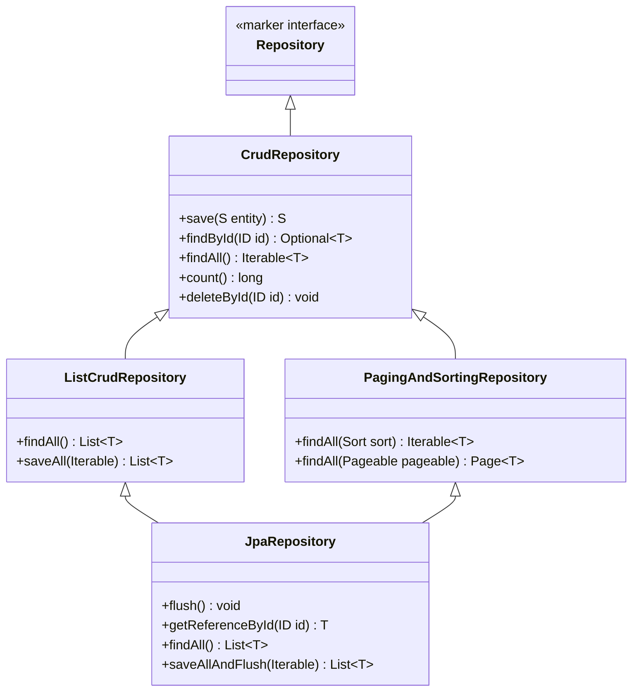
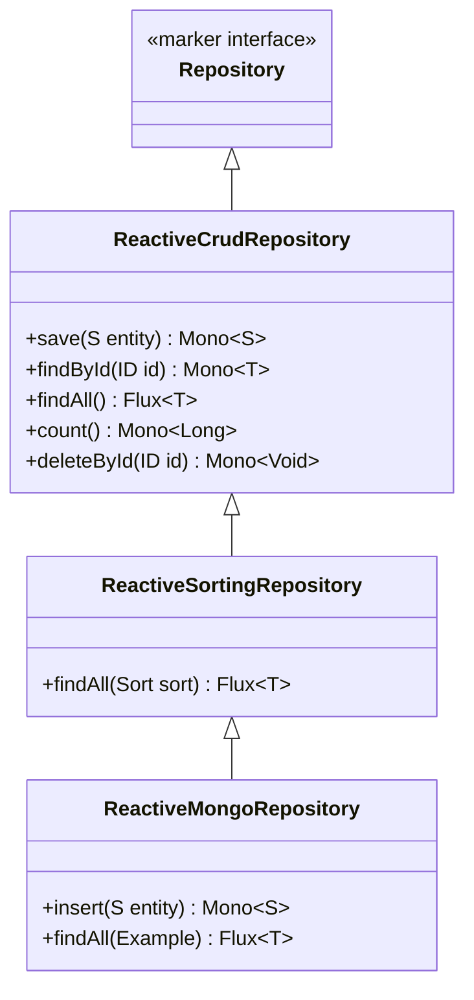

# Spring Data Repository Interfaces — The Data Access Abstraction

**Date:** 2026-04-17 | **Updated:** 2026-04-17
**Tags:** `spring-data` `repository` `reactive` `mongo` `jpa` `crud` `query-methods` `projections`

## Table of Contents

- [Summary](#summary)
- [The Repository Hierarchy](#the-repository-hierarchy)
  - [Imperative Side](#imperative-side)
  - [Reactive Side](#reactive-side)
- [Imperative vs Reactive Repositories](#imperative-vs-reactive-repositories)
- [Declaring a Repository](#declaring-a-repository)
- [Inherited CRUD Methods](#inherited-crud-methods)
- [Derived Query Methods](#derived-query-methods)
  - [How Derived Queries Work](#how-derived-queries-work)
  - [Combining Conditions](#combining-conditions)
  - [Ordering and Limiting](#ordering-and-limiting)
  - [Existence, Count, and Delete](#existence-count-and-delete)
  - [Keyword Operator Reference](#keyword-operator-reference)
- [Return Types](#return-types)
- [Projections](#projections)
  - [Interface-Based Projections](#interface-based-projections)
  - [Class-Based Projections (DTO)](#class-based-projections-dto)
  - [Dynamic Projections](#dynamic-projections)
- [Custom Repository Implementations](#custom-repository-implementations)
- [@NoRepositoryBean](#norepositorybean)
- [Repository Configuration](#repository-configuration)
- [Related](#related)
- [References](#references)

---

## Summary

Spring Data provides a **repository abstraction** that generates data access implementations from interface definitions. You declare a Java interface extending one of Spring Data's base repository types, parameterize it with your entity class and its ID type, and optionally add method signatures that follow a naming convention. At application startup Spring scans for these interfaces, parses the method names, and creates proxy implementations backed by the appropriate data store. You never write the implementation class yourself — Spring builds it, registers it as a bean, and injects it wherever needed.

---

## The Repository Hierarchy

Spring Data defines two parallel hierarchies: one for imperative (blocking) access and one for reactive (non-blocking) access. Each level in the hierarchy adds methods on top of the previous one.

### Imperative Side



| Level | What It Adds |
|---|---|
| `Repository` | Marker interface — no methods. Enables Spring to detect your repository. |
| `CrudRepository` | Basic CRUD: `save`, `saveAll`, `findById`, `existsById`, `findAll`, `count`, `deleteById`, `deleteAll`. |
| `ListCrudRepository` | Changes `Iterable<T>` returns to `List<T>` for convenience. |
| `PagingAndSortingRepository` | `findAll(Sort)` and `findAll(Pageable)` for sorting and pagination. |
| `JpaRepository` | JPA-specific: `flush()`, `getReferenceById()`, `saveAllAndFlush()`, batch deletes. |

### Reactive Side



| Level | What It Adds |
|---|---|
| `ReactiveCrudRepository` | Same CRUD operations as imperative, but returns `Mono<T>` and `Flux<T>`. |
| `ReactiveSortingRepository` | `findAll(Sort)` returning `Flux<T>`. |
| `ReactiveMongoRepository` | MongoDB-specific: `insert()`, query-by-example support. |

---

## Imperative vs Reactive Repositories

The two hierarchies mirror each other conceptually. The difference is the return type wrapper.

| Operation | `CrudRepository` (imperative) | `ReactiveCrudRepository` (reactive) |
|---|---|---|
| Save one | `S save(S entity)` | `Mono<S> save(S entity)` |
| Find by ID | `Optional<T> findById(ID id)` | `Mono<T> findById(ID id)` |
| Find all | `Iterable<T> findAll()` | `Flux<T> findAll()` |
| Exists | `boolean existsById(ID id)` | `Mono<Boolean> existsById(ID id)` |
| Count | `long count()` | `Mono<Long> count()` |
| Delete by ID | `void deleteById(ID id)` | `Mono<Void> deleteById(ID id)` |
| Delete all | `void deleteAll()` | `Mono<Void> deleteAll()` |
| Save batch | `Iterable<S> saveAll(Iterable<S>)` | `Flux<S> saveAll(Iterable<S>)` |

The imperative side blocks the calling thread until the database responds. The reactive side returns a publisher that emits results when they arrive, keeping the thread free for other work.

---

## Declaring a Repository

This is the actual pattern used in this project:

```java
public interface MovieInfoRepository
        extends ReactiveMongoRepository<MovieInfo, String> {

    Flux<MovieInfo> findByYear(Integer year);

    Mono<MovieInfo> findByName(String name);
}
```

```java
public interface ReviewReactiveRepository
        extends ReactiveMongoRepository<Review, String> {

    Flux<Review> findReviewsByMovieInfoId(Long movieInfoId);
}
```

The recipe:

1. **Extend** the appropriate base interface (`ReactiveMongoRepository`, `JpaRepository`, `ReactiveCrudRepository`, etc.).
2. **Parameterize** with two type arguments: the entity class and the ID type (`<MovieInfo, String>`).
3. **Add query methods** by declaring method signatures that follow the naming convention.
4. **No `@Repository` annotation needed.** Spring Data auto-detects repository interfaces through `@EnableMongoRepositories`, `@EnableJpaRepositories`, or Spring Boot auto-configuration. The `@Repository` annotation is a Spring stereotype for component scanning — Spring Data has its own detection mechanism that makes it unnecessary.

Spring creates a proxy implementation at startup and registers it as a bean. You inject it via constructor injection like any other dependency:

```java
@Service
public class MovieInfoService {

    private final MovieInfoRepository movieInfoRepository;

    public MovieInfoService(MovieInfoRepository movieInfoRepository) {
        this.movieInfoRepository = movieInfoRepository;
    }

    public Mono<MovieInfo> addMovieInfo(MovieInfo movieInfo) {
        return movieInfoRepository.save(movieInfo);
    }

    public Flux<MovieInfo> getAllMovieInfos() {
        return movieInfoRepository.findAll();
    }

    public Flux<MovieInfo> getMovieInfoByYear(Integer year) {
        return movieInfoRepository.findByYear(year);
    }
}
```

Notice that the service has no idea whether the repository is backed by MongoDB, PostgreSQL, or an in-memory store. That is the power of the abstraction — the service depends on the interface, and Spring wires in the appropriate implementation.

---

## Inherited CRUD Methods

When you extend `ReactiveCrudRepository` (or `CrudRepository`), you get these methods without writing a single line of implementation:

| Method | Imperative Return | Reactive Return |
|---|---|---|
| `save(S entity)` | `S` | `Mono<S>` |
| `saveAll(Iterable<S> entities)` | `Iterable<S>` | `Flux<S>` |
| `findById(ID id)` | `Optional<T>` | `Mono<T>` |
| `findAll()` | `Iterable<T>` | `Flux<T>` |
| `findAllById(Iterable<ID> ids)` | `Iterable<T>` | `Flux<T>` |
| `existsById(ID id)` | `boolean` | `Mono<Boolean>` |
| `count()` | `long` | `Mono<Long>` |
| `deleteById(ID id)` | `void` | `Mono<Void>` |
| `deleteAll()` | `void` | `Mono<Void>` |
| `deleteAllById(Iterable<ID> ids)` | `void` | `Mono<Void>` |
| `delete(T entity)` | `void` | `Mono<Void>` |

These cover the standard CRUD lifecycle. For anything beyond simple ID-based lookups, you add derived query methods.

A key behavior to understand: `save()` handles both inserts and updates. If the entity has a null or unset ID (or an ID not yet in the store), it inserts. If the entity has an existing ID, it updates. The distinction is driven by `isNew()` on the entity metadata — for MongoDB, an entity is new if its `@Id` field is null; for JPA, it checks the `@Version` field or `@Id` presence.

---

## Derived Query Methods

### How Derived Queries Work

Spring Data parses your method name at startup and generates a store-specific query. The method name follows a pattern:

```
<action><optional-limit>By<Property><Operator><And|Or><Property><Operator><OrderBy...>
```

For example, `findByYear(Integer year)` becomes "find documents where `year` equals the given argument." Spring matches `Year` to the `year` field on the `MovieInfo` entity and generates the appropriate MongoDB (or JPA, or R2DBC) query.

If Spring cannot parse the method name — say you have a typo like `findByYaer` and no `yaer` property exists — the application will fail at startup with a clear error message. This is an intentional design choice: fail fast rather than silently generating a wrong query at runtime.

```java
// Exact match on a single property
Flux<MovieInfo> findByYear(Integer year);

// Exact match on a different property
Mono<MovieInfo> findByName(String name);
```

### Combining Conditions

```java
// AND — both conditions must match
Flux<MovieInfo> findByYearAndName(Integer year, String name);

// OR — either condition matches
Flux<MovieInfo> findByYearOrName(Integer year, String name);
```

### Ordering and Limiting

```java
// Order results
Flux<MovieInfo> findByYearOrderByNameAsc(Integer year);

// Limit to first N results
Flux<MovieInfo> findTop5ByYear(Integer year);

// First result only
Mono<MovieInfo> findFirstByOrderByYearDesc();
```

### Existence, Count, and Delete

```java
// Exists — returns boolean / Mono<Boolean>
Mono<Boolean> existsByName(String name);

// Count — returns long / Mono<Long>
Mono<Long> countByYear(Integer year);

// Delete — returns void / Mono<Void>
Mono<Void> deleteByName(String name);
```

### Keyword Operator Reference

Spring Data recognizes these keywords in method names:

| Keyword | Example | Generated Condition |
|---|---|---|
| `And` | `findByYearAndName` | `year = ? AND name = ?` |
| `Or` | `findByYearOrName` | `year = ? OR name = ?` |
| `Is`, `Equals` | `findByNameIs` | `name = ?` |
| `Between` | `findByYearBetween` | `year BETWEEN ? AND ?` |
| `LessThan` | `findByYearLessThan` | `year < ?` |
| `LessThanEqual` | `findByYearLessThanEqual` | `year <= ?` |
| `GreaterThan` | `findByYearGreaterThan` | `year > ?` |
| `GreaterThanEqual` | `findByYearGreaterThanEqual` | `year >= ?` |
| `After` | `findByCreatedAfter` | `created > ?` |
| `Before` | `findByCreatedBefore` | `created < ?` |
| `IsNull` | `findByNameIsNull` | `name IS NULL` |
| `IsNotNull` | `findByNameIsNotNull` | `name IS NOT NULL` |
| `Like` | `findByNameLike` | `name LIKE ?` |
| `NotLike` | `findByNameNotLike` | `name NOT LIKE ?` |
| `StartingWith` | `findByNameStartingWith` | `name LIKE 'value%'` |
| `EndingWith` | `findByNameEndingWith` | `name LIKE '%value'` |
| `Containing` | `findByNameContaining` | `name LIKE '%value%'` |
| `OrderBy` | `findByYearOrderByNameAsc` | `ORDER BY name ASC` |
| `Not` | `findByNameNot` | `name <> ?` |
| `In` | `findByYearIn(Collection)` | `year IN (?, ?, ?)` |
| `NotIn` | `findByYearNotIn(Collection)` | `year NOT IN (?, ?, ?)` |
| `True` | `findByActiveTrue` | `active = true` |
| `False` | `findByActiveFalse` | `active = false` |
| `IgnoreCase` | `findByNameIgnoreCase` | case-insensitive equals |
| `Top` / `First` | `findTop5ByYear` | limits results to 5 |

---

## Return Types

Spring Data supports a wide range of return types from query methods. Use the type that best fits your caller.

| Category | Types | Notes |
|---|---|---|
| Single (imperative) | `T`, `Optional<T>` | `Optional` is preferred — avoids null |
| Single (reactive) | `Mono<T>` | Emits 0 or 1 element |
| Multiple (imperative) | `List<T>`, `Iterable<T>`, `Stream<T>` | `Stream` must be closed after use |
| Multiple (reactive) | `Flux<T>` | Emits 0 to N elements |
| Paged (imperative) | `Page<T>`, `Slice<T>` | Requires `Pageable` parameter |
| Async (imperative) | `CompletableFuture<T>` | Runs query on a separate thread |
| Void | `void`, `Mono<Void>` | Typically for delete operations |

`Page<T>` includes total element count (triggers a count query). `Slice<T>` only knows if there is a next slice, avoiding the count overhead. Neither `Page` nor `Slice` is available in the reactive stack because a total count query would require a separate blocking operation that undermines the non-blocking model.

For reactive pagination, the typical pattern is cursor-based or keyset pagination, where the client passes the last seen ID and the repository returns the next N items via a derived query method like `findTop20ByIdGreaterThan(String lastId)`.

---

## Projections

When you only need a subset of entity fields, projections avoid fetching and mapping the full object. This matters for performance — reading 3 fields instead of 20 reduces network transfer, deserialization cost, and memory footprint. Projections are especially valuable in read-heavy APIs where clients only need summary data.

### Interface-Based Projections

Define an interface with getter methods matching the entity properties you want:

```java
public interface MovieInfoSummary {
    String getName();
    Integer getYear();
}
```

Then declare a query method returning it:

```java
List<MovieInfoSummary> findByYear(Integer year);
```

Spring creates a proxy that only populates the declared getters. The underlying query fetches only those fields (store-dependent — MongoDB and JPA both support this optimization).

### Class-Based Projections (DTO)

Use a class (or record) with a constructor whose parameter names match entity properties:

```java
public record MovieInfoSummary(String name, Integer year) {}
```

```java
List<MovieInfoSummary> findByYear(Integer year);
```

Spring passes the matching columns into the constructor. Records work well here because they are immutable and concise.

### Dynamic Projections

Let the caller decide which projection to use at runtime:

```java
<T> List<T> findByYear(Integer year, Class<T> type);
```

Usage:

```java
// Full entity
List<MovieInfo> full = repository.findByYear(2023, MovieInfo.class);

// Summary projection
List<MovieInfoSummary> summaries = repository.findByYear(2023, MovieInfoSummary.class);
```

The second type parameter tells Spring which projection to apply.

---

## Custom Repository Implementations

When derived query names become unwieldy or you need logic that cannot be expressed by method naming, create a custom implementation fragment.

**Step 1 — Define a fragment interface:**

```java
public interface MovieInfoRepositoryCustom {
    Flux<MovieInfo> findByComplexCriteria(SearchCriteria criteria);
}
```

**Step 2 — Implement the fragment:**

```java
public class MovieInfoRepositoryCustomImpl implements MovieInfoRepositoryCustom {

    private final ReactiveMongoTemplate mongoTemplate;

    public MovieInfoRepositoryCustomImpl(ReactiveMongoTemplate mongoTemplate) {
        this.mongoTemplate = mongoTemplate;
    }

    @Override
    public Flux<MovieInfo> findByComplexCriteria(SearchCriteria criteria) {
        var query = new Query();
        if (criteria.year() != null) {
            query.addCriteria(Criteria.where("year").is(criteria.year()));
        }
        if (criteria.name() != null) {
            query.addCriteria(Criteria.where("name").regex(criteria.name(), "i"));
        }
        return mongoTemplate.find(query, MovieInfo.class);
    }
}
```

The implementation class name must be the fragment interface name plus `Impl` — this is the default suffix Spring Data looks for.

**Step 3 — Extend the fragment in your repository:**

```java
public interface MovieInfoRepository
        extends ReactiveMongoRepository<MovieInfo, String>,
                MovieInfoRepositoryCustom {

    Flux<MovieInfo> findByYear(Integer year);
    Mono<MovieInfo> findByName(String name);
}
```

Spring composes the auto-generated CRUD proxy with your custom implementation. Callers see a single repository interface with both derived methods and custom methods.

This composition model means you can have multiple fragment interfaces on a single repository. Spring merges all implementations together, with custom fragments taking precedence over auto-generated methods if there is a naming collision.

The `Impl` suffix is configurable via `@EnableMongoRepositories(repositoryImplementationPostfix = "CustomImpl")`, but changing it from the default is rarely worth the confusion.

---

## @NoRepositoryBean

Use `@NoRepositoryBean` on intermediate repository interfaces that define shared methods but should not be instantiated as standalone beans:

```java
@NoRepositoryBean
public interface BaseEntityRepository<T, ID> extends ReactiveCrudRepository<T, ID> {

    Flux<T> findByCreatedAtAfter(LocalDateTime date);
}
```

```java
public interface MovieInfoRepository
        extends BaseEntityRepository<MovieInfo, String> {

    Flux<MovieInfo> findByYear(Integer year);
}
```

Without `@NoRepositoryBean`, Spring would try to create a proxy for `BaseEntityRepository` itself and fail because it does not know which entity type to bind.

---

## Repository Configuration

Spring Boot auto-configures repository scanning based on the dependencies on your classpath:

| Dependency | Auto-Config Annotation | Scans For |
|---|---|---|
| `spring-boot-starter-data-mongodb-reactive` | `@EnableReactiveMongoRepositories` | `ReactiveMongoRepository` subtypes |
| `spring-boot-starter-data-jpa` | `@EnableJpaRepositories` | `JpaRepository` subtypes |
| `spring-boot-starter-data-r2dbc` | `@EnableR2dbcRepositories` | `R2dbcRepository` subtypes |
| `spring-boot-starter-data-mongodb` | `@EnableMongoRepositories` | `MongoRepository` subtypes |

By default, Spring Boot scans from the package of your `@SpringBootApplication` class downward. If your repositories are in a package outside that tree, you need to declare the annotation explicitly:

```java
@SpringBootApplication
@EnableReactiveMongoRepositories(basePackages = "com.example.external.repo")
public class Application {
    public static void main(String[] args) {
        SpringApplication.run(Application.class, args);
    }
}
```

Understanding this matters when debugging "Could not find a bean of type XRepository" errors — usually the repository interface is in a package that the auto-scan does not reach.

### Multiple Store Detection

If your project has both JPA and MongoDB on the classpath, Spring Data needs to know which repository belongs to which store. It uses these heuristics in order:

1. **Store-specific base interface** — extending `JpaRepository` is unambiguous (JPA). Extending `ReactiveMongoRepository` is unambiguous (MongoDB).
2. **Entity annotation** — entities annotated with `@Entity` are JPA; entities annotated with `@Document` are MongoDB.
3. **Package scanning scope** — `@EnableJpaRepositories(basePackages = "...")` and `@EnableMongoRepositories(basePackages = "...")` limit each store to its own package tree.

If a repository extends the generic `CrudRepository` and the entity has both `@Entity` and `@Document` annotations, Spring will throw an ambiguity error at startup. The fix is to use store-specific base interfaces or to separate packages and configure explicit base packages.

### Repository Bootstrap Mode

Spring Data 3.x supports lazy initialization of repositories via `spring.data.jpa.repositories.bootstrap-mode`:

| Mode | Behavior |
|---|---|
| `DEFAULT` | Repositories are created eagerly at startup. Startup is slower but errors surface immediately. |
| `LAZY` | Repositories are created on first access. Faster startup, but errors appear later at runtime. |
| `DEFERRED` | Repositories are created in a background thread after the context refreshes. A middle ground. |

For development, `DEFAULT` is safest. For production apps with many repositories and slow startup, `DEFERRED` or `LAZY` can reduce boot time.

---

## Related

- [Queries and Pagination](queries-and-pagination.md)
- [Database Configuration](../configurations/database-config.md)
- [JPA Transactions](../jpa-transactions.md)
- [Spring Fundamentals](../spring-fundamentals.md)

---

## References

- [Spring Data Commons — Repository Abstraction](https://docs.spring.io/spring-data/commons/reference/repositories.html)
- [Spring Data MongoDB — Reactive Repositories](https://docs.spring.io/spring-data/mongodb/reference/mongodb/repositories.html)
- [Spring Data JPA — Query Methods](https://docs.spring.io/spring-data/jpa/reference/jpa/query-methods.html)
- [Spring Data — Projections](https://docs.spring.io/spring-data/commons/reference/repositories/projections.html)
- [Spring Data — Custom Repository Implementations](https://docs.spring.io/spring-data/commons/reference/repositories/custom-implementations.html)
