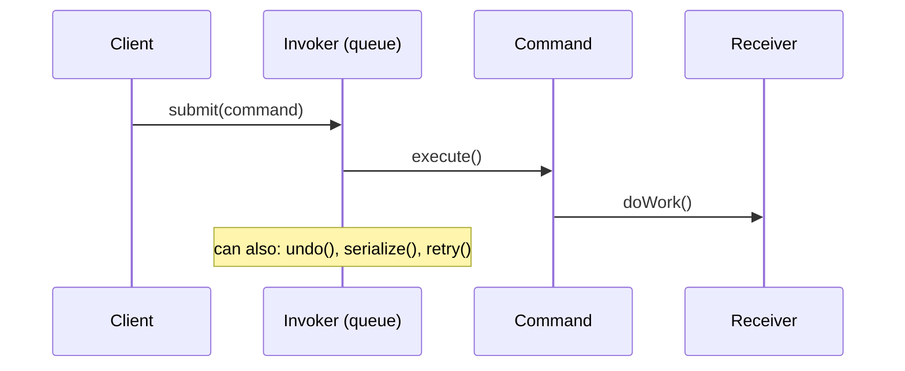
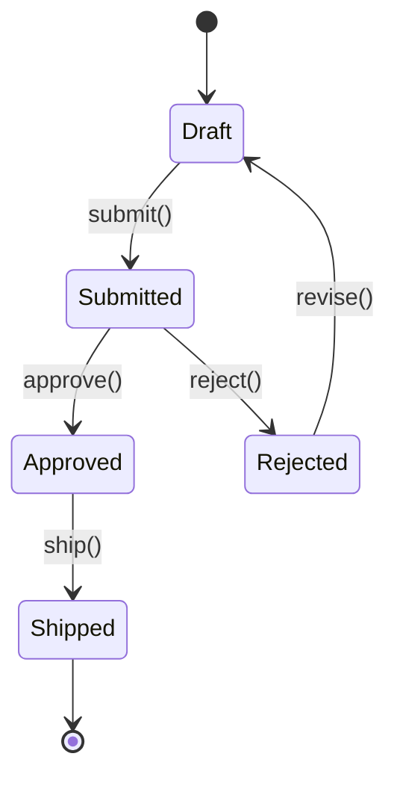
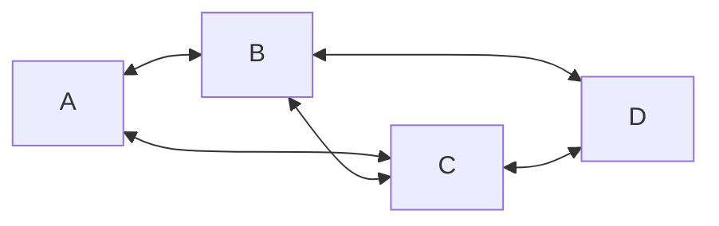
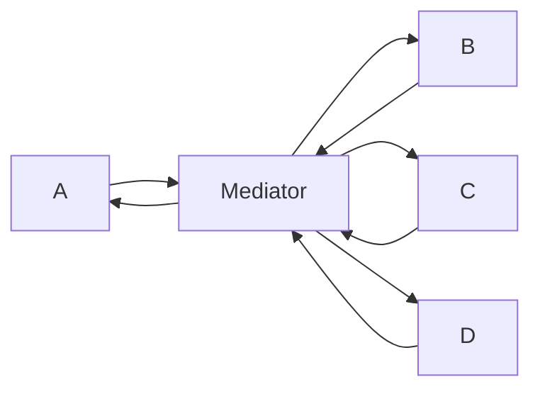

# Behavioral Patterns Deep Dive — Command, State, Visitor, Mediator, Iterator

**Date:** 2026-04-19 | **Updated:** 2026-04-19
**Tags:** `design-patterns` `java` `behavioral` `command` `state` `visitor` `sealed-types`

## Table of Contents

- [Summary](#summary)
- [Command — Encapsulate Actions as Objects](#command--encapsulate-actions-as-objects)
- [State Machine — Objects That Change Behavior](#state-machine--objects-that-change-behavior)
- [Visitor — Modern Java Replaces the Pattern](#visitor--modern-java-replaces-the-pattern)
- [Mediator — Decouple Many-to-Many](#mediator--decouple-many-to-many)
- [Iterator — The Pattern Behind for-each](#iterator--the-pattern-behind-for-each)
- [Memento — Undo/Snapshot](#memento--undosnapshot)
- [Related](#related)
- [References](#references)

---

## Summary

The [overview doc](../java-fundamentals/common-design-patterns.md) covered Strategy, Template Method, Chain of Responsibility, and Observer — the four behavioral patterns Spring uses most visibly. This deep dive covers the remaining patterns that show up in application code: [Command](https://refactoring.guru/design-patterns/command) for undo/redo and task queuing (also the basis of CQRS), [State](https://refactoring.guru/design-patterns/state) for entities that change behavior based on internal state (order workflows, payment flows), [Visitor](https://refactoring.guru/design-patterns/visitor) and how modern Java's sealed types + pattern matching make it obsolete, [Mediator](https://refactoring.guru/design-patterns/mediator) for decoupling many-to-many dependencies (Spring's `ApplicationEventPublisher` is one), [Iterator](https://refactoring.guru/design-patterns/iterator) as the pattern behind Java's for-each loop, and [Memento](https://refactoring.guru/design-patterns/memento) for undo snapshots. Each gets Java 21+ code and a real-world mapping.

---

## Command — Encapsulate Actions as Objects

A **command** wraps an action (method call, mutation, side effect) as an object that can be passed, queued, serialized, logged, or undone.



```java
public sealed interface Command permits CreateOrder, CancelOrder, RefundOrder {
    void execute();
    void undo();
}

public record CreateOrder(OrderRepository repo, OrderData data) implements Command {
    private static final ThreadLocal<Order> created = new ThreadLocal<>();

    public void execute() {
        var order = Order.from(data);
        repo.save(order);
        created.set(order);
    }

    public void undo() {
        repo.delete(created.get());
        created.remove();
    }
}
```

Real-world uses:

- **CQRS** — commands are literally Command objects. See [event-sourcing-cqrs.md](../architecture/event-sourcing-cqrs.md).
- **Task queues** — a `Runnable` or `Callable` is a command object. `ThreadPoolExecutor.submit(command)` is the invoker.
- **Undo/redo** — each command stores the inverse operation. Editor apps, migration runners.
- **Audit logging** — serialized commands form a replayable log (event sourcing's basis).
- **Spring Integration** — `Message<T>` is a command carrying payload + headers through a channel.

The Command pattern is so fundamental to Java that `Runnable` (no return), `Callable<T>` (with return), and `Supplier<T>` are all degenerate commands with no explicit undo.

---

## State Machine — Objects That Change Behavior

An entity whose behavior changes based on its internal state. Instead of `if/else` chains on a status field, delegate behavior to state objects:



Classic GoF approach — state objects:

```java
public sealed interface OrderState permits Draft, Submitted, Approved, Rejected, Shipped {
    OrderState submit(Order ctx);
    OrderState approve(Order ctx);
    OrderState reject(Order ctx, String reason);
    OrderState ship(Order ctx);
}

public record Draft() implements OrderState {
    public OrderState submit(Order ctx) {
        ctx.setSubmittedAt(Instant.now());
        return new Submitted();
    }
    public OrderState approve(Order ctx) { throw new IllegalStateException("Cannot approve a draft"); }
    public OrderState reject(Order ctx, String r) { throw new IllegalStateException("Cannot reject a draft"); }
    public OrderState ship(Order ctx) { throw new IllegalStateException("Cannot ship a draft"); }
}

public record Submitted() implements OrderState {
    public OrderState submit(Order ctx) { throw new IllegalStateException("Already submitted"); }
    public OrderState approve(Order ctx) { return new Approved(); }
    public OrderState reject(Order ctx, String reason) {
        ctx.setRejectionReason(reason);
        return new Rejected();
    }
    public OrderState ship(Order ctx) { throw new IllegalStateException("Must approve first"); }
}
// ... Approved, Rejected, Shipped follow the same shape
```

The `Order` entity delegates:

```java
public class Order {
    private OrderState state = new Draft();

    public void submit() { this.state = state.submit(this); }
    public void approve() { this.state = state.approve(this); }
}
```

**Modern alternative** — for simple state machines, sealed types + switch are cleaner than full state objects:

```java
public sealed interface OrderStatus permits Draft, Submitted, Approved, Rejected, Shipped {}

public void transition(Order order, OrderAction action) {
    order.setStatus(switch (order.getStatus()) {
        case Draft d -> switch (action) {
            case SUBMIT -> new Submitted();
            default -> throw new IllegalStateException();
        };
        case Submitted s -> switch (action) {
            case APPROVE -> new Approved();
            case REJECT -> new Rejected();
            default -> throw new IllegalStateException();
        };
        // ...
    });
}
```

Libraries: [Spring Statemachine](https://spring.io/projects/spring-statemachine) for complex workflows with persistence, guards, and actions. [Stateless4j](https://github.com/stateless4j/stateless4j) for lightweight in-memory machines.

---

## Visitor — Modern Java Replaces the Pattern

The classical [Visitor](https://refactoring.guru/design-patterns/visitor) pattern solves "add operations to a type hierarchy without modifying it" via double dispatch:

```java
// Classical visitor — lots of boilerplate
interface ShapeVisitor<R> {
    R visit(Circle c);
    R visit(Square s);
    R visit(Triangle t);
}

interface Shape {
    <R> R accept(ShapeVisitor<R> visitor);
}

record Circle(double radius) implements Shape {
    public <R> R accept(ShapeVisitor<R> v) { return v.visit(this); }
}
```

**Java 21 made this pattern obsolete.** Sealed types + pattern matching do the same thing with zero boilerplate:

```java
public sealed interface Shape permits Circle, Square, Triangle {}
public record Circle(double radius) implements Shape {}
public record Square(double side) implements Shape {}
public record Triangle(double base, double height) implements Shape {}

// "Visitor" is just a switch expression — no interface, no accept()
double area(Shape s) {
    return switch (s) {
        case Circle(var r)      -> Math.PI * r * r;
        case Square(var side)   -> side * side;
        case Triangle(var b, var h) -> 0.5 * b * h;
    };
}

String describe(Shape s) {
    return switch (s) {
        case Circle c when c.radius() > 100 -> "big circle";
        case Circle c   -> "circle (r=" + c.radius() + ")";
        case Square s2  -> "square";
        case Triangle t -> "triangle";
    };
}
```

The compiler enforces exhaustiveness — add a new `Shape` variant and every switch that doesn't handle it fails to compile. This is the same safety the Visitor pattern provided, without the ceremony.

**Rule**: if you're on Java 21+, use sealed types + switch instead of the classical Visitor. Reserve the Visitor pattern for pre-17 codebases or libraries that need to support open hierarchies.

See [modern-java-features.md](../java-fundamentals/modern-java-features.md#sealed-types) and [modern-java-features.md](../java-fundamentals/modern-java-features.md#pattern-matching).

---

## Mediator — Decouple Many-to-Many

A [Mediator](https://refactoring.guru/design-patterns/mediator) centralizes communication so components don't reference each other directly.

Without mediator — every component knows every other:



With mediator — all communication goes through one hub:



Spring's `ApplicationEventPublisher` is a mediator — `OrderService` publishes `OrderPlaced`, `InventoryService` and `EmailService` react, but none of them know the others exist. The event bus is the mediator.

Explicit mediator example — a chat room:

```java
public class ChatRoom {
    private final List<User> members = new ArrayList<>();

    public void join(User user) { members.add(user); }

    public void send(User sender, String message) {
        members.stream()
            .filter(m -> !m.equals(sender))
            .forEach(m -> m.receive(sender.name(), message));
    }
}
```

Users never call each other directly — they call `room.send()`. Adding a new member or changing delivery logic only touches the mediator.

**CQRS command bus** is another mediator: commands are dispatched to a bus, the bus routes to the right handler. See [event-sourcing-cqrs.md](../architecture/event-sourcing-cqrs.md).

---

## Iterator — The Pattern Behind for-each

Java's `Iterable<T>` + `Iterator<T>` is the Iterator pattern baked into the language:

```java
public class NumberRange implements Iterable<Integer> {
    private final int from, to;

    public NumberRange(int from, int to) { this.from = from; this.to = to; }

    @Override
    public Iterator<Integer> iterator() {
        return new Iterator<>() {
            int current = from;
            public boolean hasNext() { return current <= to; }
            public Integer next() { return current++; }
        };
    }
}

for (int n : new NumberRange(1, 10)) {
    System.out.println(n);  // 1..10
}
```

The for-each loop calls `iterator()`, then `hasNext()` / `next()` until exhausted. Any class implementing `Iterable<T>` works in for-each — custom collections, database cursors, paginated API results.

**Streams** are the modern evolution — `Spliterator` generalizes `Iterator` for parallel decomposition. But `Iterable` remains the simplest contract for "I can be looped over".

---

## Memento — Undo/Snapshot

[Memento](https://refactoring.guru/design-patterns/memento) captures an object's internal state so it can be restored later — without exposing internals.

```java
public record EditorMemento(String content, int cursorPos) {}

public class TextEditor {
    private String content = "";
    private int cursorPos = 0;

    public void type(String text) {
        content = content.substring(0, cursorPos) + text + content.substring(cursorPos);
        cursorPos += text.length();
    }

    public EditorMemento save() {
        return new EditorMemento(content, cursorPos);
    }

    public void restore(EditorMemento m) {
        this.content = m.content();
        this.cursorPos = m.cursorPos();
    }
}
```

Usage with an undo stack:

```java
Deque<EditorMemento> history = new ArrayDeque<>();
history.push(editor.save());
editor.type("hello");
history.push(editor.save());
editor.type(" world");
editor.restore(history.pop());  // undo "world"
```

Memento + Command = undo system. Each command saves a memento before executing; undo restores the memento.

In enterprise systems, **event sourcing** is Memento at scale — the event log is the history of mementos, and replaying events restores state to any point. See [event-sourcing-cqrs.md](../architecture/event-sourcing-cqrs.md).

---

## Related

- [Common Design Patterns in Java and Spring](../java-fundamentals/common-design-patterns.md) — Strategy, Template, Chain, Observer.
- [Creational Patterns Deep Dive](creational-patterns.md) — Builder, Factory, Prototype.
- [Structural Patterns Deep Dive](structural-patterns.md) — Decorator, Composite, Facade, Flyweight.
- [Enterprise Patterns Deep Dive](enterprise-patterns.md) — Service Layer, Specification.
- [Modern Java Features](../java-fundamentals/modern-java-features.md) — sealed types and pattern matching replace Visitor.
- [Event Sourcing and CQRS](../architecture/event-sourcing-cqrs.md) — Command pattern at scale.
- [Application Events](../events-async/application-events.md) — Mediator pattern in Spring.
- [Multithreading Deep Dive](../java-fundamentals/concurrency/multithreading-deep-dive.md) — Runnable/Callable as Command.

---

## References

- [refactoring.guru — Behavioral Patterns](https://refactoring.guru/design-patterns/behavioral-patterns)
- [Spring Statemachine](https://spring.io/projects/spring-statemachine) — declarative state machines.
- [stateless4j](https://github.com/stateless4j/stateless4j) — lightweight state machine library.
- Joshua Bloch — *Effective Java* (3rd ed.) Item 42 (lambdas as strategy/command objects).
- [GoF — Design Patterns: Elements of Reusable Object-Oriented Software](https://en.wikipedia.org/wiki/Design_Patterns)
- [JEP 409: Sealed Classes](https://openjdk.org/jeps/409) — the language feature that replaces Visitor.
- [JEP 441: Pattern Matching for switch](https://openjdk.org/jeps/441) — exhaustive switch over sealed types.
