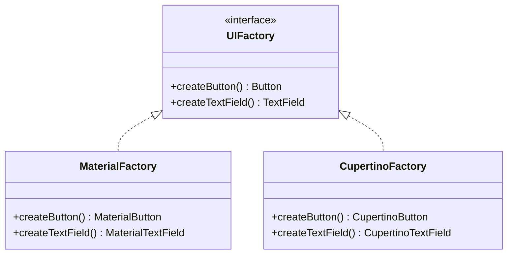
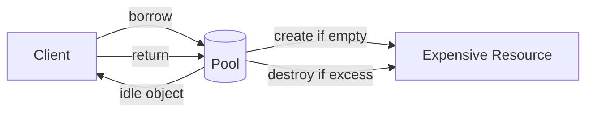

# Creational Patterns Deep Dive — Builder Variants, Abstract Factory, Prototype, Object Pool

**Date:** 2026-04-19 | **Updated:** 2026-04-19
**Tags:** `design-patterns` `java` `creational` `builder` `factory` `spring-boot`

## Table of Contents

- [Summary](#summary)
- [Builder Variants](#builder-variants)
  - [Lombok Builder Recap](#lombok-builder-recap)
  - [Step Builder — Enforced Construction Order](#step-builder--enforced-construction-order)
  - [Recursive Generics Builder — Inheritance-Safe](#recursive-generics-builder--inheritance-safe)
- [Abstract Factory](#abstract-factory)
- [Prototype — Cloning Objects](#prototype--cloning-objects)
- [Object Pool](#object-pool)
- [Spring Bean Scopes as Creational Patterns](#spring-bean-scopes-as-creational-patterns)
- [Related](#related)
- [References](#references)

---

## Summary

The [overview doc](../java-fundamentals/common-design-patterns.md) introduced Builder, Factory Method, and Singleton with Spring annotations. This deep dive covers the builder variants you see in real libraries (Step Builder for compile-time enforcement, recursive-generic builder for inheritance), [Abstract Factory](https://refactoring.guru/design-patterns/abstract-factory) for families of related objects, [Prototype](https://refactoring.guru/design-patterns/prototype) for cloning, and [Object Pool](https://en.wikipedia.org/wiki/Object_pool_pattern) (HikariCP, Netty's `PooledByteBufAllocator`). Each section shows idiomatic Java 21+ code and maps to the Spring/library usage you'll encounter in production.

---

## Builder Variants

### Lombok Builder Recap

```java
@Builder(toBuilder = true)
public record HttpRequest(String url, HttpMethod method, @Builder.Default Map<String, String> headers) {
    // toBuilder = true gives .toBuilder() for immutable copy-with
}
```

This covers 80% of cases. The next two variants cover the rest.

### Step Builder — Enforced Construction Order

A regular builder lets you call `.build()` with missing required fields — runtime error. A **step builder** makes each step return the *next* step's interface, so the compiler enforces order:

```java
public record DatabaseConfig(String host, int port, String database, String user, String password) {

    public static HostStep builder() { return new Steps(); }

    public interface HostStep { PortStep host(String host); }
    public interface PortStep { DatabaseStep port(int port); }
    public interface DatabaseStep { UserStep database(String db); }
    public interface UserStep { PasswordStep user(String user); }
    public interface PasswordStep { BuildStep password(String pw); }
    public interface BuildStep { DatabaseConfig build(); }

    private static class Steps implements HostStep, PortStep, DatabaseStep, UserStep, PasswordStep, BuildStep {
        private String host, database, user, password;
        private int port;

        public PortStep host(String h) { this.host = h; return this; }
        public DatabaseStep port(int p) { this.port = p; return this; }
        public UserStep database(String d) { this.database = d; return this; }
        public PasswordStep user(String u) { this.user = u; return this; }
        public BuildStep password(String p) { this.password = p; return this; }
        public DatabaseConfig build() { return new DatabaseConfig(host, port, database, user, password); }
    }
}
```

Usage — IDE autocomplete guides you through each step:

```java
var cfg = DatabaseConfig.builder()
    .host("localhost")      // returns PortStep — only .port() is available
    .port(5432)             // returns DatabaseStep
    .database("orders")     // returns UserStep
    .user("app")            // returns PasswordStep
    .password("secret")     // returns BuildStep
    .build();               // compiles only when all steps are complete
```

You can't call `.build()` without providing `.host()` first — compile error, not runtime. [jOOQ](https://www.jooq.org/)'s SQL DSL uses this pattern extensively — `select().from().where().orderBy()` enforces SQL syntax order at compile time.

### Recursive Generics Builder — Inheritance-Safe

When base and subclass both need builders:

```java
public abstract class BaseRequest<T extends BaseRequest<T, B>, B extends BaseRequest.Builder<T, B>> {
    private final String traceId;
    private final Instant timestamp;

    protected BaseRequest(Builder<T, B> b) {
        this.traceId = b.traceId;
        this.timestamp = b.timestamp;
    }

    @SuppressWarnings("unchecked")
    public abstract static class Builder<T extends BaseRequest<T, B>, B extends Builder<T, B>> {
        private String traceId;
        private Instant timestamp = Instant.now();

        public B traceId(String id) { this.traceId = id; return (B) this; }
        public B timestamp(Instant ts) { this.timestamp = ts; return (B) this; }
        public abstract T build();
    }
}

public class OrderRequest extends BaseRequest<OrderRequest, OrderRequest.Builder> {
    private final String productId;

    private OrderRequest(Builder b) { super(b); this.productId = b.productId; }

    public static class Builder extends BaseRequest.Builder<OrderRequest, Builder> {
        private String productId;
        public Builder productId(String id) { this.productId = id; return this; }
        public OrderRequest build() { return new OrderRequest(this); }
    }

    public static Builder builder() { return new Builder(); }
}
```

```java
var req = OrderRequest.builder()
    .traceId("abc")         // from BaseRequest — returns OrderRequest.Builder, not base
    .productId("p1")        // from OrderRequest
    .build();               // returns OrderRequest
```

Lombok's `@SuperBuilder` generates exactly this pattern. Use it in library code where you can't depend on Lombok.

---

## Abstract Factory

[Abstract Factory](https://refactoring.guru/design-patterns/abstract-factory) creates **families of related objects** without specifying concrete classes. The difference from Factory Method: Factory Method produces one product; Abstract Factory produces a family.



Java example — a messaging factory that produces compatible sender + serializer:

```java
public sealed interface MessagingFactory permits KafkaFactory, SqsFactory {
    MessageSender createSender();
    MessageSerializer createSerializer();
}

public record KafkaFactory(String bootstrapServers) implements MessagingFactory {
    public MessageSender createSender() { return new KafkaSender(bootstrapServers); }
    public MessageSerializer createSerializer() { return new AvroSerializer(); }
}

public record SqsFactory(String region) implements MessagingFactory {
    public MessageSender createSender() { return new SqsSender(region); }
    public MessageSerializer createSerializer() { return new JsonSerializer(); }
}
```

Spring wiring — select the factory by profile or config:

```java
@Configuration
public class MessagingConfig {
    @Bean
    @ConditionalOnProperty(name = "messaging.type", havingValue = "kafka")
    MessagingFactory kafkaFactory(@Value("${kafka.bootstrap}") String bs) {
        return new KafkaFactory(bs);
    }

    @Bean
    @ConditionalOnProperty(name = "messaging.type", havingValue = "sqs")
    MessagingFactory sqsFactory(@Value("${aws.region}") String region) {
        return new SqsFactory(region);
    }
}
```

Consumers inject `MessagingFactory` and get a coherent pair — they never mix a Kafka sender with an SQS serializer.

---

## Prototype — Cloning Objects

[Prototype](https://refactoring.guru/design-patterns/prototype) creates new objects by copying existing ones. In Java, `Cloneable` / `Object.clone()` is the classical mechanism — and almost universally hated for being broken by design (shallow copy, checked exception, no constructor call).

Modern approach: **copy constructors** or **`toBuilder()`** on records/builders:

```java
public record Template(String subject, String body, Map<String, String> vars) {
    public Template withVars(Map<String, String> newVars) {
        return new Template(subject, body, Map.copyOf(newVars));
    }
}

// Clone from a prototype, customize
var base = new Template("Welcome", "Hi {{name}}", Map.of());
var personalized = base.withVars(Map.of("name", "Alice"));
```

With Lombok `@Builder(toBuilder = true)`:

```java
var copy = original.toBuilder().body("Updated body").build();
```

**Spring's prototype scope** is this pattern at the container level:

```java
@Component
@Scope("prototype")
public class RequestContext {
    private String traceId;
    // new instance for every injection point
}
```

Every `getBean(RequestContext.class)` returns a fresh copy. Use for stateful per-request objects in a singleton-dominated container.

---

## Object Pool

Reuse expensive-to-create objects instead of allocating new ones. Not a GoF pattern but pervasive in Java infrastructure:

- **[HikariCP](https://github.com/brettwooldridge/HikariCP)** — JDBC connection pool. Creating a DB connection takes ~5 ms; borrowing from the pool takes ~1 μs.
- **Netty's `PooledByteBufAllocator`** — direct memory buffers are expensive to allocate; the pool recycles them. See [reactive-impact.md](../jvm-gc/reactive-impact.md#netty-direct-memory).
- **`ThreadPoolExecutor`** — reuses platform threads. See [multithreading-deep-dive.md](../java-fundamentals/concurrency/multithreading-deep-dive.md#threadpoolexecutor-internals).



Pool contract:

1. **Borrow** — get an object from the pool (create if empty, block if at max).
2. **Use** — caller uses the object.
3. **Return** — give it back. **Must** return, or the pool leaks. `try-with-resources` or `finally` blocks.
4. **Evict** — pool periodically validates idle objects, discards broken ones.

Common bug: forgetting to return. HikariCP's `leakDetectionThreshold` logs a stack trace when a connection is held too long — enable it. See [mvc-high-throughput.md](../web-layer/mvc-high-throughput.md#connection-pool-sizing-hikaricp).

---

## Spring Bean Scopes as Creational Patterns

Spring's bean scopes are creational patterns in disguise:

| Scope | Pattern | Lifecycle |
|-------|---------|-----------|
| `singleton` (default) | Singleton | One instance for the entire container |
| `prototype` | Prototype / Factory | New instance per injection |
| `request` | Object Pool (per-request) | One per HTTP request |
| `session` | Object Pool (per-session) | One per HTTP session |
| `application` | Singleton (servlet context) | One per `ServletContext` |

The container is the factory, the pool manager, and the singleton registry — all in one. Understanding this mapping makes scoping decisions intuitive rather than memorized.

---

## Related

- [Common Design Patterns in Java and Spring](../java-fundamentals/common-design-patterns.md) — the overview this doc extends.
- [Structural Patterns Deep Dive](structural-patterns.md) — Decorator, Composite, Facade, Flyweight.
- [Behavioral Patterns Deep Dive](behavioral-patterns.md) — Command, State, Visitor, Mediator.
- [Enterprise Patterns Deep Dive](enterprise-patterns.md) — Service Layer, Specification, DTO Assembler.
- [Lombok and Boilerplate](../java-fundamentals/lombok-and-boilerplate.md) — `@Builder`, `@SuperBuilder`.
- [Multithreading Deep Dive](../java-fundamentals/concurrency/multithreading-deep-dive.md) — ThreadPoolExecutor as object pool.
- [Scaling MVC Before Virtual Threads](../web-layer/mvc-high-throughput.md) — HikariCP pool sizing.

---

## References

- [refactoring.guru — Creational Patterns](https://refactoring.guru/design-patterns/creational-patterns)
- Joshua Bloch — *Effective Java* (3rd ed.) Items 1–2 (static factories, builders).
- [jOOQ — Step Builder pattern](https://blog.jooq.org/the-step-builder-pattern/)
- [HikariCP documentation](https://github.com/brettwooldridge/HikariCP)
- [Spring Framework — Bean Scopes](https://docs.spring.io/spring-framework/reference/core/beans/factory-scopes.html)
- [Lombok @SuperBuilder](https://projectlombok.org/features/experimental/SuperBuilder)
