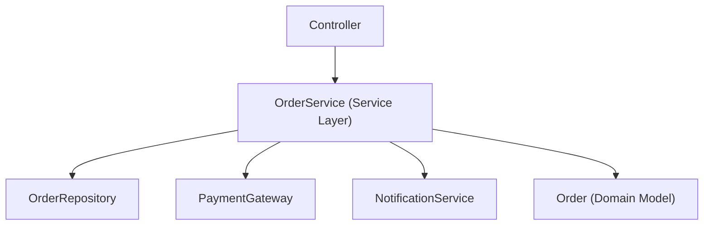
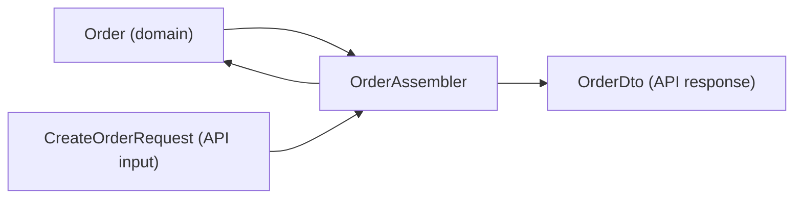

# Enterprise Patterns Deep Dive — Service Layer, Specification, DTO Assembler, Gateway

**Date:** 2026-04-19 | **Updated:** 2026-04-19
**Tags:** `design-patterns` `java` `enterprise` `service-layer` `specification` `spring-boot`

## Table of Contents

- [Summary](#summary)
- [Service Layer — Where Business Logic Lives](#service-layer--where-business-logic-lives)
- [Specification Pattern — Composable Query Predicates](#specification-pattern--composable-query-predicates)
- [DTO Assembler / Mapper — Separating API from Domain](#dto-assembler--mapper--separating-api-from-domain)
- [Gateway Pattern — Abstracting External Services](#gateway-pattern--abstracting-external-services)
- [Unit of Work — Transaction as a Pattern](#unit-of-work--transaction-as-a-pattern)
- [Domain Model vs Anemic Domain Model](#domain-model-vs-anemic-domain-model)
- [Related](#related)
- [References](#references)

---

## Summary

GoF patterns operate at the object level; **enterprise patterns** ([Martin Fowler's PoEAA](https://www.martinfowler.com/eaaCatalog/)) operate at the application-architecture level — they shape how layers talk to each other, how queries compose, how external systems are abstracted, and where business logic lives. This doc deep-dives into the six enterprise patterns most relevant to Spring Boot services: [Service Layer](https://www.martinfowler.com/eaaCatalog/serviceLayer.html) (the `@Service` class everyone writes), [Specification](https://www.martinfowler.com/apsupp/spec.pdf) (type-safe composable query predicates via Spring Data's `Specification<T>`), DTO Assembler (mapping between API and domain without coupling them), [Gateway](https://www.martinfowler.com/eaaCatalog/gateway.html) (wrapping external APIs), [Unit of Work](https://www.martinfowler.com/eaaCatalog/unitOfWork.html) (what `@Transactional` actually implements), and the rich-vs-anemic domain model debate.

---

## Service Layer — Where Business Logic Lives

A [Service Layer](https://www.martinfowler.com/eaaCatalog/serviceLayer.html) defines the application's boundary — it coordinates use cases, enforces business rules, and orchestrates repositories, domain objects, and infrastructure services.



```java
@Service
@RequiredArgsConstructor
@Transactional
public class OrderService {
    private final OrderRepository repo;
    private final PaymentGateway payments;
    private final ApplicationEventPublisher events;

    public OrderDto placeOrder(PlaceOrderCmd cmd) {
        var order = Order.create(cmd.customerId(), cmd.items());   // domain logic
        order.validate();                                          // domain logic
        var charge = payments.charge(order.total(), cmd.paymentMethod());  // infra
        order.markPaid(charge.id());                               // domain logic
        repo.save(order);                                          // persistence
        events.publishEvent(new OrderPlaced(order.id()));          // side effect
        return OrderDto.from(order);                               // mapping
    }
}
```

**Rules for a healthy service layer:**

1. **One service method = one use case.** `placeOrder`, `cancelOrder`, `refundOrder` — not `processOrder(action)`.
2. **Transaction boundary.** `@Transactional` goes on the service method, not on the repository or controller.
3. **No HTTP concerns.** The service doesn't know about `HttpServletRequest`, status codes, or JSON. It takes domain commands and returns domain results (or DTOs).
4. **Thin orchestration, rich domain.** The service *coordinates*; the domain model *decides*. If the service has `if (order.status == PAID && order.total > 100)`, that logic belongs on `Order`.
5. **Testable without Spring.** Inject dependencies via constructor; mock repos and gateways.

---

## Specification Pattern — Composable Query Predicates

The [Specification pattern](https://www.martinfowler.com/apsupp/spec.pdf) encapsulates a query predicate as a first-class object. You can combine specifications with `and`, `or`, `not` — building complex dynamic queries from reusable pieces.

Spring Data JPA's `Specification<T>` interface:

```java
public interface Specification<T> extends Serializable {
    Predicate toPredicate(Root<T> root, CriteriaQuery<?> query, CriteriaBuilder cb);
}
```

Define atomic specs:

```java
public class OrderSpecs {

    public static Specification<Order> hasCustomer(Long customerId) {
        return (root, query, cb) -> cb.equal(root.get("customerId"), customerId);
    }

    public static Specification<Order> hasStatus(OrderStatus status) {
        return (root, query, cb) -> cb.equal(root.get("status"), status);
    }

    public static Specification<Order> totalGreaterThan(BigDecimal amount) {
        return (root, query, cb) -> cb.greaterThan(root.get("total"), amount);
    }

    public static Specification<Order> createdAfter(LocalDate date) {
        return (root, query, cb) -> cb.greaterThan(root.get("createdAt"), date.atStartOfDay());
    }
}
```

Compose them:

```java
var spec = OrderSpecs.hasCustomer(42L)
    .and(OrderSpecs.hasStatus(OrderStatus.PAID))
    .and(OrderSpecs.totalGreaterThan(new BigDecimal("100")))
    .and(OrderSpecs.createdAfter(LocalDate.now().minusDays(30)));

List<Order> orders = orderRepo.findAll(spec, PageRequest.of(0, 20));
```

The repository extends `JpaSpecificationExecutor<Order>`:

```java
public interface OrderRepository extends JpaRepository<Order, Long>, JpaSpecificationExecutor<Order> {}
```

**Why not just write JPQL?** Because JPQL is a string — you can't compose it at runtime. Specifications are type-safe, composable, reusable, and testable. A filter-heavy search page with 10 optional criteria becomes 10 small specs composed dynamically, not a 200-line `@Query` with conditional fragments.

See [queries-and-pagination.md](../data-repositories/queries-and-pagination.md) for the broader Spring Data query story.

---

## DTO Assembler / Mapper — Separating API from Domain

The domain model (`Order`, `User`, `Product`) should not leak to the API boundary. DTOs (Data Transfer Objects) decouple the wire format from the domain:



Three approaches ranked by complexity:

**1. Manual mapping (recommended for most cases):**

```java
public record OrderDto(String id, String status, BigDecimal total, Instant createdAt) {
    public static OrderDto from(Order o) {
        return new OrderDto(o.id().value(), o.status().name(), o.total().amount(), o.createdAt());
    }
}
```

Explicit, no magic, easy to debug, easy to find usages. Record factories are concise enough that a mapper library is rarely needed.

**2. MapStruct (code generation):**

```java
@Mapper(componentModel = "spring")
public interface OrderMapper {
    OrderDto toDto(Order order);
    Order toDomain(CreateOrderRequest request);
}
```

MapStruct generates the mapping code at compile time — zero reflection, type-safe, IDE-navigable. Useful when you have 50+ DTOs and the manual mapping becomes maintenance burden.

**3. ModelMapper / Dozer (reflection-based):**

Avoid. Reflection-based mappers are slow, hard to debug, and hide bugs until runtime. They map fields by name convention, which breaks silently when a field is renamed.

**Rules:**

- Never expose JPA `@Entity` directly as a REST response — lazy associations, serialization cycles, schema coupling.
- Map at the service layer boundary, not in the controller.
- If input validation is needed, validate the DTO (via `@Valid` Bean Validation), then map to domain.
- Keep DTOs as records — immutable, concise, no Lombok needed.

---

## Gateway Pattern — Abstracting External Services

A [Gateway](https://www.martinfowler.com/eaaCatalog/gateway.html) wraps an external API (Stripe, Twilio, partner service) behind an interface so your domain code doesn't couple to HTTP clients, JSON parsing, or vendor SDKs.

```java
// Domain interface — no HTTP, no vendor types
public interface PaymentGateway {
    ChargeResult charge(Money amount, PaymentMethod method);
    RefundResult refund(String chargeId, Money amount);
}

// Infrastructure implementation — knows Stripe SDK
@Component
@RequiredArgsConstructor
public class StripePaymentGateway implements PaymentGateway {
    private final StripeClient stripe;

    public ChargeResult charge(Money amount, PaymentMethod method) {
        var params = PaymentIntentCreateParams.builder()
            .setAmount(amount.cents())
            .setCurrency(amount.currency().code())
            .setPaymentMethod(method.stripeId())
            .build();
        var intent = stripe.paymentIntents().create(params);
        return new ChargeResult(intent.getId(), intent.getStatus());
    }

    public RefundResult refund(String chargeId, Money amount) { /* ... */ }
}
```

Benefits:

- **Testable.** Mock `PaymentGateway` in service tests — no Stripe sandbox needed.
- **Swappable.** Switch from Stripe to Adyen by implementing a new gateway; service layer unchanged.
- **Retryable.** Wrap the gateway implementation with retry/[circuit-breaker (Resilience4j)](../web-layer/mvc-high-throughput.md#circuit-breaker) without touching domain code.
- **Translatable.** Vendor exceptions become domain exceptions. `StripeCardDeclinedException` → `PaymentDeclinedException`.

This is also the **Anti-Corruption Layer** from DDD — see [ddd-tactical-patterns.md](../architecture/ddd-tactical-patterns.md#anti-corruption-layer).

---

## Unit of Work — Transaction as a Pattern

[Unit of Work](https://www.martinfowler.com/eaaCatalog/unitOfWork.html) tracks changes to domain objects during a business operation and commits them as a single atomic unit. In Spring, `@Transactional` + JPA's persistence context is the Unit of Work:

```java
@Transactional
public void transferFunds(AccountId from, AccountId to, Money amount) {
    var source = accountRepo.findById(from).orElseThrow();
    var target = accountRepo.findById(to).orElseThrow();
    source.withdraw(amount);   // dirty — tracked by persistence context
    target.deposit(amount);    // dirty — tracked by persistence context
    // no explicit save() — JPA flushes dirty entities at commit
}
```

JPA's `EntityManager` is the Unit of Work implementation:

1. It tracks which entities were loaded.
2. It detects which were modified (dirty checking).
3. At transaction commit, it flushes all changes in one batch.
4. If anything fails, the whole transaction rolls back.

**You rarely implement Unit of Work yourself** — JPA does it. But understanding the pattern helps you reason about:

- Why detached entities don't auto-save.
- Why `@Transactional(readOnly = true)` skips dirty checking (performance).
- Why merging (`entityManager.merge`) re-attaches a detached entity to the current unit of work.

See [jpa-transactions.md](../jpa-transactions.md) and [jpa-transaction-propagation.md](../jpa-transaction-propagation.md).

---

## Domain Model vs Anemic Domain Model

Two schools of thought on where business logic lives:

**Rich Domain Model (DDD-style):**

```java
public class Order {
    private OrderStatus status;
    private Money total;

    public void cancel(String reason) {
        if (status == SHIPPED) throw new IllegalStateException("Cannot cancel shipped order");
        this.status = CANCELLED;
        DomainEvents.publish(new OrderCancelled(this.id, reason));
    }
}
```

Business rules live *on the entity*. The service layer is thin — just orchestration.

**Anemic Domain Model (common in Spring CRUD):**

```java
@Data
public class Order {
    private OrderStatus status;
    private Money total;
    // only data — no behavior
}

@Service
public class OrderService {
    public void cancel(Long orderId, String reason) {
        var order = repo.findById(orderId).orElseThrow();
        if (order.getStatus() == SHIPPED) throw new IllegalStateException();
        order.setStatus(CANCELLED);
        repo.save(order);
        events.publish(new OrderCancelled(orderId, reason));
    }
}
```

Business rules live in the service. The entity is a data bag.

**The debate:** Martin Fowler [called anemic domain models an anti-pattern](https://www.martinfowler.com/bliki/AnemicDomainModel.html). DDD practitioners agree. But in practice, simple CRUD apps with straightforward validation don't benefit from rich domains — the ceremony of putting `cancel()` on the entity instead of the service adds a layer of indirection without reducing complexity.

**Pragmatic rule:**

- **CRUD-heavy, simple validation**: anemic is fine. `@Data` + service logic. Don't over-engineer.
- **Complex domain rules, invariants, state machines**: rich domain model. Put the rules where the data is — entities and value objects. See [ddd-tactical-patterns.md](../architecture/ddd-tactical-patterns.md).
- **Most real apps**: a mix. Some aggregates are rich (Order with state machine), some are anemic (AuditLog that's just a row).

---

## Related

- [Common Design Patterns in Java and Spring](../java-fundamentals/common-design-patterns.md) — the overview.
- [Creational Patterns Deep Dive](creational-patterns.md) — Builder variants, Factory, Object Pool.
- [Structural Patterns Deep Dive](structural-patterns.md) — Decorator, Composite, Facade.
- [Behavioral Patterns Deep Dive](behavioral-patterns.md) — Command, State, Visitor, Mediator.
- [DDD Tactical Patterns in Java](../architecture/ddd-tactical-patterns.md) — aggregates, value objects, bounded contexts.
- [Event Sourcing and CQRS](../architecture/event-sourcing-cqrs.md) — Command pattern at architecture scale.
- [JPA Transactions](../jpa-transactions.md) — Unit of Work in practice.
- [Queries and Pagination](../data-repositories/queries-and-pagination.md) — Specification with Spring Data.
- [Project Structure and Architecture](../architecture/project-structure.md) — layered vs hexagonal.

---

## References

- [Martin Fowler — Patterns of Enterprise Application Architecture (PoEAA)](https://www.martinfowler.com/eaaCatalog/)
- [Martin Fowler — Service Layer](https://www.martinfowler.com/eaaCatalog/serviceLayer.html)
- [Martin Fowler — Specification](https://www.martinfowler.com/apsupp/spec.pdf)
- [Martin Fowler — Gateway](https://www.martinfowler.com/eaaCatalog/gateway.html)
- [Martin Fowler — Unit of Work](https://www.martinfowler.com/eaaCatalog/unitOfWork.html)
- [Martin Fowler — Anemic Domain Model](https://www.martinfowler.com/bliki/AnemicDomainModel.html)
- [Spring Data JPA — Specifications](https://docs.spring.io/spring-data/jpa/reference/jpa/specifications.html)
- [MapStruct documentation](https://mapstruct.org/)
- Joshua Bloch — *Effective Java* (3rd ed.)
