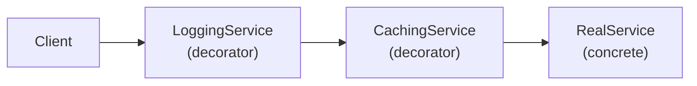
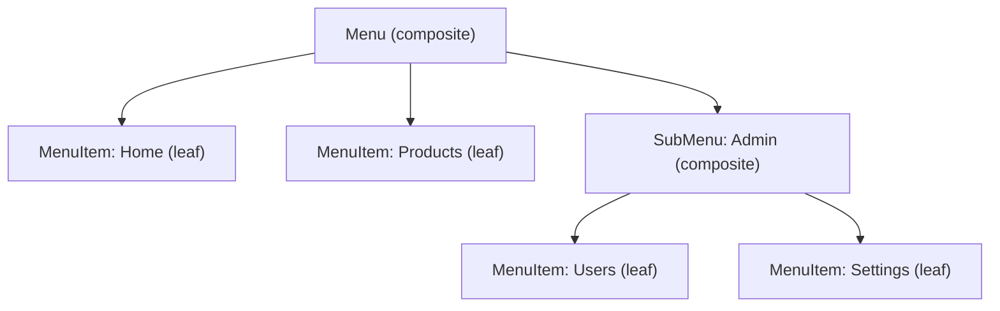
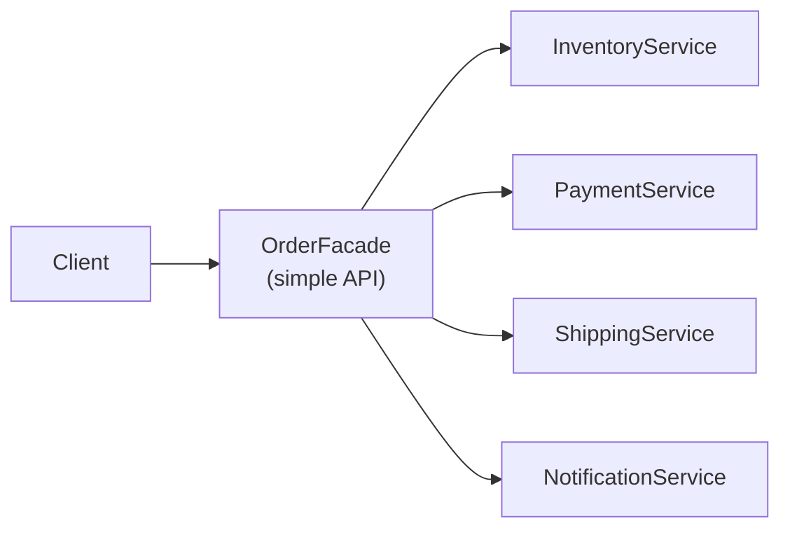

# Structural Patterns Deep Dive — Decorator, Composite, Facade, Flyweight

**Date:** 2026-04-19 | **Updated:** 2026-04-19
**Tags:** `design-patterns` `java` `structural` `decorator` `composite` `facade` `spring-boot`

## Table of Contents

- [Summary](#summary)
- [Decorator — Composable Wrappers](#decorator--composable-wrappers)
  - [Java IO as Decorator](#java-io-as-decorator)
  - [Writing Your Own Decorator](#writing-your-own-decorator)
  - [Decorators in Spring](#decorators-in-spring)
- [Composite — Treating Trees as Leaves](#composite--treating-trees-as-leaves)
- [Facade — Simplifying Subsystems](#facade--simplifying-subsystems)
- [Flyweight — Shared Immutable State](#flyweight--shared-immutable-state)
- [Proxy vs Decorator vs Adapter — When People Confuse Them](#proxy-vs-decorator-vs-adapter--when-people-confuse-them)
- [Related](#related)
- [References](#references)

---

## Summary

Structural patterns compose objects into larger structures while keeping them flexible and decoupled. The [overview doc](../java-fundamentals/common-design-patterns.md) covered Proxy, Decorator, and Adapter briefly. This deep dive focuses on four patterns with complete code: [Decorator](https://refactoring.guru/design-patterns/decorator) for stacking behavior (filters, middleware, Spring's `DataSource` wrappers), [Composite](https://refactoring.guru/design-patterns/composite) for tree structures treated uniformly (menus, org charts, validation rule groups), [Facade](https://refactoring.guru/design-patterns/facade) for simplifying complex subsystems (Spring's `JdbcTemplate`, your service layer), and [Flyweight](https://refactoring.guru/design-patterns/flyweight) for memory-efficient sharing of immutable state (`Integer.valueOf`, `String.intern`, Netty's `PooledByteBufAllocator`). Each includes a Mermaid diagram, Java 21+ code, and the Spring usage you'll encounter.

---

## Decorator — Composable Wrappers

A decorator wraps an object of the **same interface** and adds behavior. Multiple decorators stack:



Each layer adds one concern (logging, caching) without modifying the real service.

### Java IO as Decorator

```java
try (var reader = new BufferedReader(          // decorator: adds buffering
        new InputStreamReader(                 // decorator: bytes → chars
            new GZIPInputStream(               // decorator: adds decompression
                new FileInputStream("data.gz") // concrete source
            ), StandardCharsets.UTF_8))) {
    reader.lines().forEach(System.out::println);
}
```

Four objects, one interface family (`InputStream` → `Reader`), each adding exactly one capability. Remove `GZIPInputStream` and nothing else changes — that's the power.

### Writing Your Own Decorator

```java
public interface NotificationSender {
    void send(Notification n);
}

public class EmailSender implements NotificationSender {
    public void send(Notification n) { /* send email */ }
}

// Decorator base (optional — useful for default delegation)
public abstract class NotificationDecorator implements NotificationSender {
    protected final NotificationSender delegate;
    protected NotificationDecorator(NotificationSender delegate) { this.delegate = delegate; }
}

public class LoggingNotification extends NotificationDecorator {
    public LoggingNotification(NotificationSender delegate) { super(delegate); }
    public void send(Notification n) {
        log.info("Sending notification to {}", n.recipient());
        delegate.send(n);
        log.info("Sent successfully");
    }
}

public class RetryNotification extends NotificationDecorator {
    private final int maxRetries;
    public RetryNotification(NotificationSender delegate, int maxRetries) {
        super(delegate);
        this.maxRetries = maxRetries;
    }
    public void send(Notification n) {
        for (int attempt = 1; attempt <= maxRetries; attempt++) {
            try { delegate.send(n); return; }
            catch (Exception e) { if (attempt == maxRetries) throw e; }
        }
    }
}
```

Stack them:

```java
NotificationSender sender = new LoggingNotification(
    new RetryNotification(
        new EmailSender(), 3));
sender.send(notification);
```

### Decorators in Spring

Spring uses decorators extensively:

- `TransactionAwareDataSourceProxy` wraps a `DataSource` to participate in Spring-managed transactions.
- `HandlerInterceptor` chains decorate controller execution with pre/post logic.
- `WebClient.filter(ExchangeFilterFunction)` decorates each HTTP call with auth, logging, metrics.
- `ServerHttpRequestDecorator` in WebFlux wraps the request to modify headers/body.

When you call `WebClient.builder().filter(logFilter).filter(authFilter).build()`, each filter is a decorator layer around the HTTP call.

---

## Composite — Treating Trees as Leaves

[Composite](https://refactoring.guru/design-patterns/composite) lets you treat individual objects and groups of objects uniformly through the same interface. Classic tree-structure pattern.



```java
public sealed interface MenuComponent permits MenuItem, Menu {
    String render();
}

public record MenuItem(String label, String url) implements MenuComponent {
    public String render() { return "<a href=\"%s\">%s</a>".formatted(url, label); }
}

public record Menu(String title, List<MenuComponent> children) implements MenuComponent {
    public String render() {
        var items = children.stream().map(MenuComponent::render).collect(joining("\n"));
        return "<nav><h3>%s</h3>\n%s\n</nav>".formatted(title, items);
    }
}
```

```java
var menu = new Menu("Main", List.of(
    new MenuItem("Home", "/"),
    new MenuItem("Products", "/products"),
    new Menu("Admin", List.of(
        new MenuItem("Users", "/admin/users"),
        new MenuItem("Settings", "/admin/settings")
    ))
));
System.out.println(menu.render());  // recursively renders the whole tree
```

Real-world uses:

- **Validation rule groups**: a `ValidationRule` can be a single check or a `CompositeRule` containing many checks. `rule.validate(input)` works the same whether it's one check or fifty.
- **Spring Security's `AuthorizationManager`**: composite authorities combine multiple checks.
- **File system**: `java.nio.file.Path` operations work on both files and directories.
- **Expression trees**: Spring SpEL parses expressions into a composite AST.

---

## Facade — Simplifying Subsystems

A [Facade](https://refactoring.guru/design-patterns/facade) provides a simple interface over a complex subsystem. It doesn't add behavior — it hides complexity.



```java
@Service
@RequiredArgsConstructor
public class OrderFacade {
    private final InventoryService inventory;
    private final PaymentService payments;
    private final ShippingService shipping;
    private final NotificationService notifications;

    public OrderResult placeOrder(OrderRequest req) {
        inventory.reserve(req.items());
        var charge = payments.charge(req.paymentMethod(), req.total());
        var tracking = shipping.schedule(req.address(), req.items());
        notifications.sendConfirmation(req.email(), tracking);
        return new OrderResult(charge.id(), tracking.number());
    }
}
```

The client calls one method; the facade orchestrates four services. If the shipping API changes, only the facade changes — clients don't know or care.

**Spring's `*Template` classes are facades:**

- `JdbcTemplate` facades over `Connection` + `Statement` + `ResultSet` + exception handling + resource cleanup.
- `RestTemplate` facades over `HttpURLConnection` + serialization + error mapping.
- `KafkaTemplate` facades over `KafkaProducer` + serialization + callback handling.

Your **service layer** in a Spring app is usually a facade — controllers call `OrderService.placeOrder()`, which orchestrates repositories, other services, and events.

---

## Flyweight — Shared Immutable State

[Flyweight](https://refactoring.guru/design-patterns/flyweight) minimizes memory by sharing immutable instances. Instead of creating a new object for every occurrence, return a cached shared instance.

JDK examples:

```java
Integer a = Integer.valueOf(42);   // cached for -128 to 127
Integer b = Integer.valueOf(42);
System.out.println(a == b);        // true — same object

String s1 = "hello";              // string pool
String s2 = "hello";
System.out.println(s1 == s2);     // true — interned

Boolean t = Boolean.valueOf(true); // always Boolean.TRUE
```

`Integer.valueOf` maintains a cache of small integers (default -128 to 127). `String` has the intern pool. `Boolean` has exactly two instances. All are flyweights — immutable, shared, identity-safe.

Custom flyweight:

```java
public class CurrencyRegistry {
    private static final Map<String, Currency> CACHE = new ConcurrentHashMap<>();

    public static Currency of(String code) {
        return CACHE.computeIfAbsent(code, c -> {
            // validate, fetch metadata, etc.
            return new Currency(c, lookupSymbol(c), lookupDecimals(c));
        });
    }
}
```

Every call to `CurrencyRegistry.of("USD")` returns the same `Currency` instance. No duplication, no wasted heap for millions of `"USD"` currency objects in a transaction-heavy system.

**Flyweight + compact object headers** ([JEP 519](https://openjdk.org/jeps/519)): Java 25's 4-byte-per-object savings amplifies flyweight benefits — fewer objects means the savings compound.

See [jvm-gc/concepts.md](../jvm-gc/concepts.md#allocation-fast-paths) for how the JVM allocates and the [caching-deep-dive.md](../data-repositories/caching-deep-dive.md) for broader caching strategies.

---

## Proxy vs Decorator vs Adapter — When People Confuse Them

All three wrap another object. The difference is **intent**:

| Pattern | Interface | Intent |
|---------|-----------|--------|
| **Proxy** | Same as target | Controls access — security, lazy-init, remote, caching |
| **Decorator** | Same as target | Adds behavior — logging, retry, compression |
| **Adapter** | Different from target | Translates interfaces — makes A look like B |

Spring's `@Transactional` proxy controls access to the transaction lifecycle (Proxy). A `WebClient.filter()` adds logging behavior (Decorator). `HandlerAdapter` translates different controller types to a common interface (Adapter).

If someone says "my decorator checks auth" — it's probably a proxy. If they say "my proxy adapts the old API" — it's probably an adapter. The wrapper looks similar; the name communicates intent.

---

## Related

- [Common Design Patterns in Java and Spring](../java-fundamentals/common-design-patterns.md) — the overview.
- [Creational Patterns Deep Dive](creational-patterns.md) — Builder variants, Abstract Factory, Object Pool.
- [Behavioral Patterns Deep Dive](behavioral-patterns.md) — Command, State, Visitor.
- [Enterprise Patterns Deep Dive](enterprise-patterns.md) — Service Layer, Specification.
- [Spring AOP Deep Dive](../spring-aop-deep-dive.md) — Proxy pattern in depth.
- [Filters and Interceptors](../web-layer/filters-and-interceptors.md) — Decorator/Chain of Responsibility in Spring web.
- [Caching Deep Dive](../data-repositories/caching-deep-dive.md) — Flyweight-adjacent memory patterns.

---

## References

- [refactoring.guru — Structural Patterns](https://refactoring.guru/design-patterns/structural-patterns)
- Joshua Bloch — *Effective Java* (3rd ed.) Item 18 (favor composition over inheritance — the Decorator principle).
- [Spring Framework — DataSource Decorating](https://docs.spring.io/spring-framework/reference/data-access/jdbc/datasource.html)
- [GoF — Design Patterns: Elements of Reusable Object-Oriented Software](https://en.wikipedia.org/wiki/Design_Patterns)
