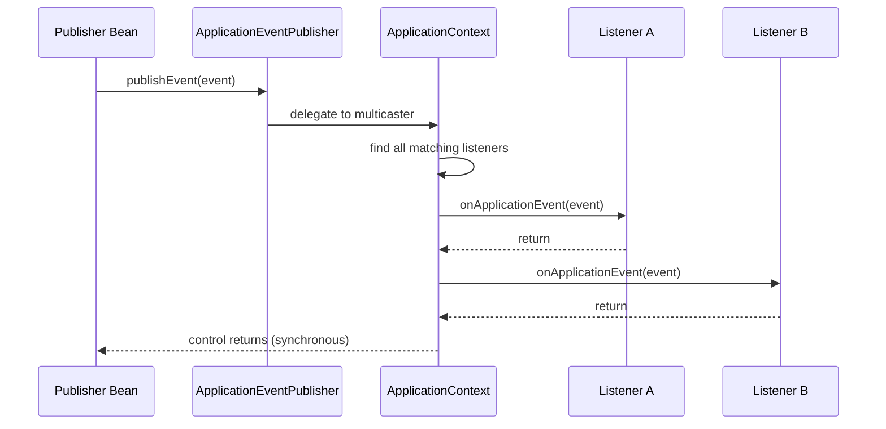
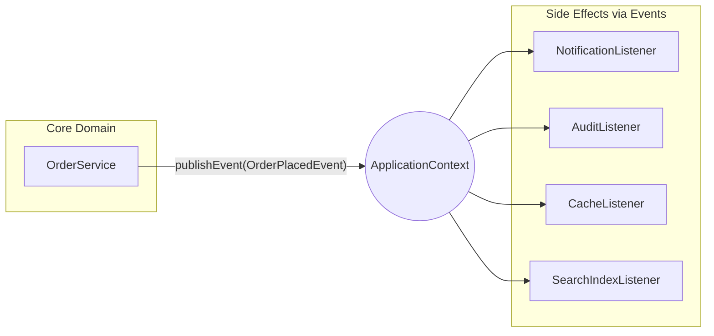

# Spring Application Events

**Date:** 2026-04-17 | **Updated:** 2026-04-17
**Tags:** `spring` `events` `event-driven` `application-context` `observer-pattern` `async` `transactions`

## Table of Contents

- [Summary](#summary)
- [How Events Work](#how-events-work)
- [Publishing Events](#publishing-events)
- [Custom Event Classes](#custom-event-classes)
- [Listening with @EventListener](#listening-with-eventlistener)
- [ApplicationListener Interface](#applicationlistener-interface)
- [Event Ordering](#event-ordering)
- [@TransactionalEventListener](#transactionaleventlistener)
- [Async Events](#async-events)
- [Built-in Spring Events](#built-in-spring-events)
- [Generic Events](#generic-events)
- [Event-Driven Patterns](#event-driven-patterns)
- [Related](#related)
- [References](#references)

---

## Summary

Spring's event system lets beans publish and listen to events within the `ApplicationContext`,
enabling loose coupling between components without direct dependencies. A service can broadcast
that something happened (an order was placed, a user registered, a cache was invalidated) and
any number of listeners can react -- without the publisher knowing who is listening or what they
will do. This is the **observer pattern** baked into the Spring container.

---

## How Events Work



Key points:

- **Synchronous by default.** The publisher's thread invokes each listener sequentially and
  blocks until all listeners complete. This means the publisher's method does not return until
  every listener has finished.
- **Observer pattern.** Publishers and listeners are decoupled through the `ApplicationContext`.
  The publisher never references a listener directly.
- **ApplicationEventMulticaster** is the internal component that resolves which listeners match
  a given event type and invokes them.

---

## Publishing Events

Inject `ApplicationEventPublisher` (which `ApplicationContext` extends) and call `publishEvent()`:

```java
@Service
@RequiredArgsConstructor
public class OrderService {

    private final ApplicationEventPublisher eventPublisher;

    public void placeOrder(Order order) {
        // core business logic: validate, persist, etc.
        orderRepository.save(order);

        // publish the event after the business operation succeeds
        eventPublisher.publishEvent(new OrderPlacedEvent(order));
    }
}
```

- The event object can be any `Object` (Spring 4.2+). It does not need to extend a framework class.
- Publish **after** the meaningful state change, not before.
- The publisher has zero knowledge of who listens or how many listeners exist.

---

## Custom Event Classes

### Traditional: Extending ApplicationEvent

```java
public class OrderPlacedEvent extends ApplicationEvent {

    private final Order order;

    public OrderPlacedEvent(Object source, Order order) {
        super(source);
        this.order = order;
    }

    public Order getOrder() {
        return order;
    }
}
```

This style couples the event to `org.springframework.context.ApplicationEvent`. Use it only if
you need the `source` reference or `timestamp` from the base class.

### Modern: Plain POJO (Spring 4.2+)

```java
public record OrderPlacedEvent(Order order, Instant timestamp) {

    public OrderPlacedEvent(Order order) {
        this(order, Instant.now());
    }
}
```

**Prefer the POJO approach.** It is simpler, testable without a Spring dependency, and works
identically with `@EventListener`. The event class stays in the domain layer with no framework
import.

---

## Listening with @EventListener

The annotation-based approach is the modern standard for reacting to events.

### Basic listener

```java
@Component
public class NotificationListener {

    @EventListener
    public void handleOrderPlaced(OrderPlacedEvent event) {
        // send confirmation email, push notification, etc.
        notificationService.sendOrderConfirmation(event.order());
    }
}
```

Spring resolves the event type from the method parameter. No registration boilerplate required.

### Conditional listening

Execute the listener only when a SpEL condition is met:

```java
@EventListener(condition = "#event.order.total > 100")
public void handleHighValueOrder(OrderPlacedEvent event) {
    // flag for manual review
}
```

The `#event` variable refers to the method parameter.

### Return value as a new event

Returning an object from a listener publishes it as a new event:

```java
@EventListener
public AuditLogCreatedEvent handleOrderPlaced(OrderPlacedEvent event) {
    AuditLog log = auditService.record(event);
    return new AuditLogCreatedEvent(log); // published automatically
}
```

Return `void` or `null` when you do not want to chain events.

### Multiple event types

A single method can listen to several event types:

```java
@EventListener({OrderPlacedEvent.class, OrderCancelledEvent.class})
public void handleOrderChange(Object event) {
    // react to either event type
}
```

---

## ApplicationListener Interface

The older, pre-annotation alternative:

```java
@Component
public class NotificationListener implements ApplicationListener<OrderPlacedEvent> {

    @Override
    public void onApplicationEvent(OrderPlacedEvent event) {
        notificationService.sendOrderConfirmation(event.order());
    }
}
```

This works but is more verbose and limits each class to one event type (without additional
generics gymnastics). **Prefer `@EventListener` for new code** -- it supports conditions,
chaining, and multiple event types on a single class.

---

## Event Ordering

Control listener execution sequence with `@Order`:

```java
@Component
public class OrderEventListeners {

    @EventListener
    @Order(1)
    public void validateInventory(OrderPlacedEvent event) {
        // runs first -- lower value = higher priority
    }

    @EventListener
    @Order(2)
    public void sendConfirmation(OrderPlacedEvent event) {
        // runs second
    }

    @EventListener
    @Order(3)
    public void updateAnalytics(OrderPlacedEvent event) {
        // runs third
    }
}
```

- Lower `@Order` values execute first.
- Unordered listeners have no guaranteed sequence relative to each other.
- Ordering only applies to synchronous execution. Async listeners run independently.

---

## @TransactionalEventListener

Execute a listener only after the surrounding transaction reaches a specific phase:

```java
@Component
public class OrderPostCommitListener {

    @TransactionalEventListener(phase = TransactionPhase.AFTER_COMMIT)
    public void handleOrderPlaced(OrderPlacedEvent event) {
        // runs ONLY if the transaction committed successfully
        emailService.sendOrderConfirmation(event.order());
        messageQueue.publish("order.placed", event.order().id());
    }
}
```

### Transaction phases

| Phase | When it fires |
|-------|---------------|
| `BEFORE_COMMIT` | Just before the transaction commits |
| `AFTER_COMMIT` | After the transaction commits successfully (default) |
| `AFTER_ROLLBACK` | After the transaction rolls back |
| `AFTER_COMPLETION` | After the transaction completes, regardless of outcome |

### Fallback execution

By default, if there is no active transaction, the listener is silently skipped. Set
`fallbackExecution = true` to run anyway:

```java
@TransactionalEventListener(
    phase = TransactionPhase.AFTER_COMMIT,
    fallbackExecution = true
)
public void handle(OrderPlacedEvent event) {
    // runs after commit, or immediately if no transaction is active
}
```

### When to use

`@TransactionalEventListener` is critical for side effects that must not happen if the
transaction rolls back:

- Sending emails or SMS
- Publishing messages to an external broker
- Calling third-party APIs
- Writing to a separate data store or cache

If you use a plain `@EventListener` inside a `@Transactional` method, the listener fires
before the commit. A subsequent rollback leaves you with a sent email that refers to data
that was never persisted.

---

## Async Events

By default, all events are synchronous. The publisher blocks until every listener completes.
Two approaches make listeners asynchronous.

### Option 1: @Async on the listener

```java
@Configuration
@EnableAsync
public class AsyncConfig {
    // enables @Async processing across the application
}

@Component
public class AnalyticsListener {

    @Async
    @EventListener
    public void handleOrderPlaced(OrderPlacedEvent event) {
        // runs on a separate thread from the task executor
        analyticsService.track("order_placed", event.order().id());
    }
}
```

### Option 2: Custom ApplicationEventMulticaster

```java
@Configuration
public class EventConfig {

    @Bean(name = "applicationEventMulticaster")
    public ApplicationEventMulticaster simpleApplicationEventMulticaster() {
        SimpleApplicationEventMulticaster multicaster =
            new SimpleApplicationEventMulticaster();
        multicaster.setTaskExecutor(new SimpleAsyncTaskExecutor());
        return multicaster;
    }
}
```

This makes **all** events async globally. Option 1 gives per-listener control and is usually
preferred.

### Tradeoffs of async events

| Concern | Synchronous | Asynchronous |
|---------|-------------|--------------|
| Thread | Same as publisher | Separate thread |
| Transaction context | Available | Lost |
| Error propagation | Exception reaches publisher | Exception is isolated |
| Ordering guarantees | Deterministic with `@Order` | No ordering |
| Debugging | Straightforward stack trace | Requires correlation IDs |

**Async listeners lose the transaction context.** If you combine `@Async` with
`@TransactionalEventListener`, the transactional phase binding still works (the listener
waits for the commit), but the listener itself runs outside the original transaction.

---

## Built-in Spring Events

Spring publishes these lifecycle events automatically:

| Event | When fired |
|-------|-----------|
| `ContextRefreshedEvent` | `ApplicationContext` initialized or refreshed |
| `ContextStartedEvent` | `ApplicationContext` started via `start()` |
| `ContextStoppedEvent` | `ApplicationContext` stopped via `stop()` |
| `ContextClosedEvent` | `ApplicationContext` closed via `close()` |
| `ApplicationStartedEvent` | After context refresh, before runners execute |
| `ApplicationReadyEvent` | After all runners complete -- the app is fully ready |
| `ApplicationFailedEvent` | Startup failed with an exception |

### Example: warm a cache on startup

```java
@Component
public class CacheWarmer {

    @EventListener
    public void onApplicationReady(ApplicationReadyEvent event) {
        // safe to load data -- all beans are initialized, runners have completed
        cacheService.warmAll();
    }
}
```

Use `ApplicationReadyEvent` rather than `@PostConstruct` when the initialization depends on
the full application being ready (database connections pooled, external services connected, etc.).

---

## Generic Events

Type-safe events using generics allow a single event structure for multiple entity types:

```java
public class EntityCreatedEvent<T> {

    private final T entity;
    private final Instant timestamp;

    public EntityCreatedEvent(T entity) {
        this.entity = entity;
        this.timestamp = Instant.now();
    }

    public T getEntity() {
        return entity;
    }

    public Instant getTimestamp() {
        return timestamp;
    }
}
```

### Listener resolves the generic type

```java
@Component
public class UserCreatedListener {

    @EventListener
    public void handleUserCreated(EntityCreatedEvent<User> event) {
        // only invoked for EntityCreatedEvent<User>, not EntityCreatedEvent<Product>
        welcomeService.sendWelcomeEmail(event.getEntity());
    }
}
```

Spring uses `ResolvableType` to match the generic parameter at runtime. This works because
the listener method signature retains the concrete type through reflection.

### Publishing generic events

When the generic type cannot be resolved from the event instance alone (due to erasure),
wrap it in a `ResolvableTypeProvider`:

```java
public class EntityCreatedEvent<T> implements ResolvableTypeProvider {

    private final T entity;

    @Override
    public ResolvableType getResolvableType() {
        return ResolvableType.forClassWithGenerics(
            getClass(),
            ResolvableType.forInstance(this.entity)
        );
    }
}
```

---

## Event-Driven Patterns

### When to use events

Events are a strong fit for cross-cutting reactions where the core operation should not know
about or depend on the side effects:

| Use case | Why events work well |
|----------|---------------------|
| Notifications (email, SMS, push) | Publisher does not care how or whether notification is sent |
| Audit logging | Logging concern is orthogonal to business logic |
| Cache invalidation | Cache layer reacts to data changes without coupling |
| Cross-module communication | Module A publishes; Module B reacts without a direct dependency |
| Analytics and metrics | Tracking is a side effect, not core logic |
| Search index updates | Indexing follows data changes asynchronously |

### When to avoid events

| Situation | Why direct calls are better |
|-----------|-----------------------------|
| Core business logic that must succeed | You need the return value and exception propagation |
| Operations requiring a single transaction | Events (especially async) break transactional atomicity |
| Simple two-component interaction | Events add indirection with no decoupling benefit |
| Debugging-sensitive flows | Event chains are harder to trace than direct call stacks |

### Architecture diagram



The `OrderService` has zero compile-time dependencies on any listener. Listeners can be added,
removed, or replaced without touching the publisher.

### Guidelines

1. **Keep events immutable.** Once published, the event object should not change.
2. **Name events in past tense.** `OrderPlacedEvent`, not `PlaceOrderEvent`. The event
   represents something that already happened.
3. **Do not use events for request-response flows.** Events are fire-and-forget by nature.
4. **Use `@TransactionalEventListener` for external side effects.** Emails, API calls, and
   message queue publishes should wait for the transaction to commit.
5. **Prefer `@Async` on individual listeners** over a global async multicaster to keep
   control granular.

---

## Related

- [Async Processing](async-processing.md) -- `@Async`, `CompletableFuture`, thread pools
- [Scheduling](scheduling.md) -- `@Scheduled`, cron expressions, fixed-rate tasks
- [Spring Fundamentals](../spring-fundamentals.md) -- IoC container, bean lifecycle
- [JPA Transactions](../jpa-transactions.md) -- `@Transactional`, propagation, isolation

---

## References

- [Spring Framework Reference: Application Events](https://docs.spring.io/spring-framework/reference/core/beans/context-introduction.html#context-functionality-events)
- [ApplicationEventPublisher Javadoc](https://docs.spring.io/spring-framework/docs/current/javadoc-api/org/springframework/context/ApplicationEventPublisher.html)
- [TransactionalEventListener Javadoc](https://docs.spring.io/spring-framework/docs/current/javadoc-api/org/springframework/transaction/event/TransactionalEventListener.html)
- [ResolvableTypeProvider Javadoc](https://docs.spring.io/spring-framework/docs/current/javadoc-api/org/springframework/core/ResolvableTypeProvider.html)
- [Spring Boot Application Events and Listeners](https://docs.spring.io/spring-boot/reference/features/spring-application.html#features.spring-application.application-events-and-listeners)
