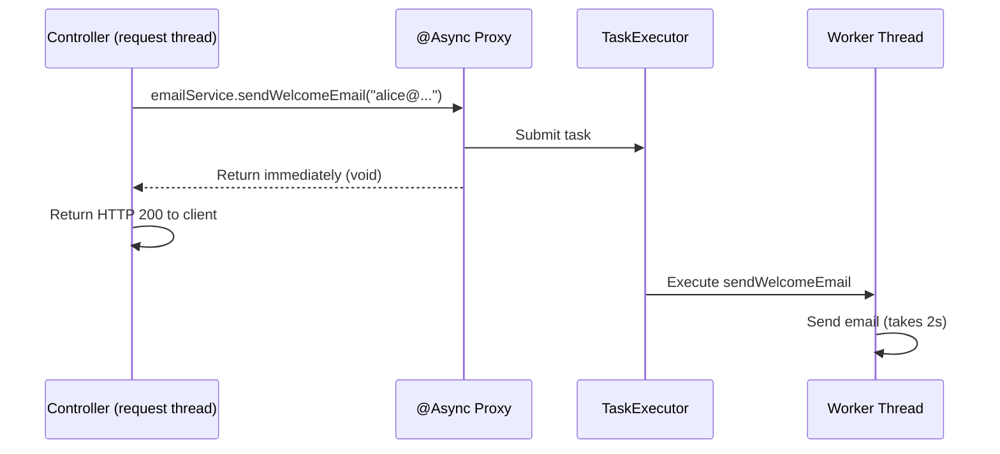
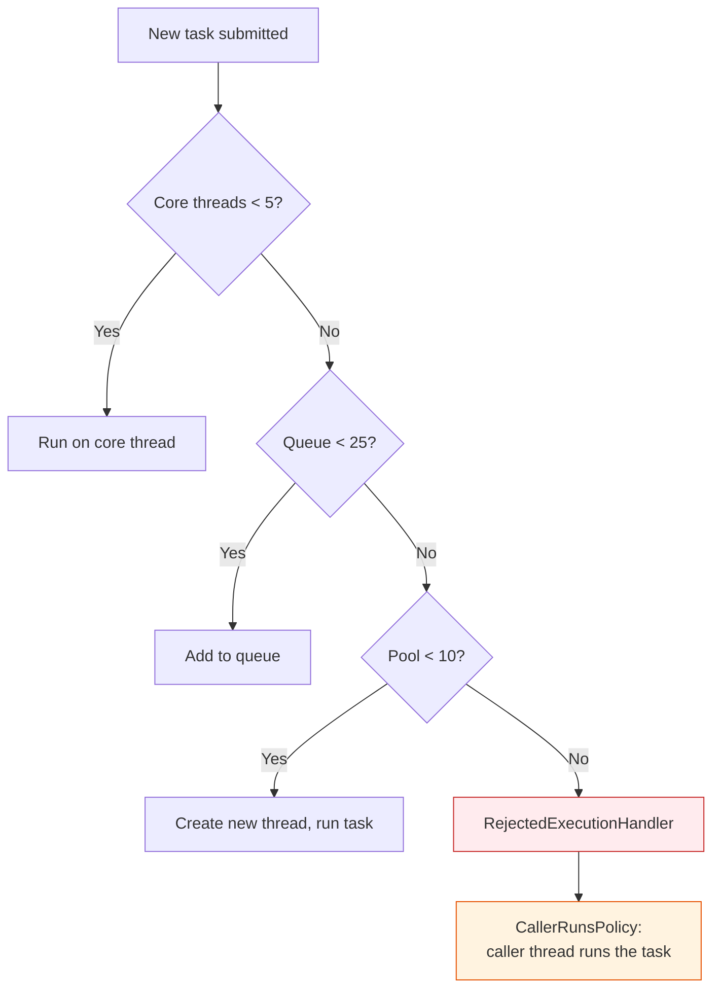
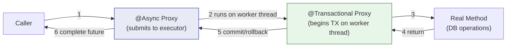

# Async Processing in Spring — @Async, Executors, and Background Tasks

**Date:** 2026-04-17 | **Updated:** 2026-04-17
**Tags:** `spring` `async` `executor` `completablefuture` `virtual-threads` `background-tasks`

## Table of Contents

- [Summary](#summary)
- [Enabling Async](#enabling-async)
- [@Async Basics](#async-basics)
- [Return Types](#return-types)
  - [void — Fire and Forget](#void--fire-and-forget)
  - [Future and CompletableFuture](#future-and-completablefuture)
  - [ListenableFuture (Deprecated)](#listenablefuture-deprecated)
- [Custom Executor Configuration](#custom-executor-configuration)
  - [ThreadPoolTaskExecutor Bean](#threadpooltaskexecutor-bean)
  - [Naming a Specific Executor](#naming-a-specific-executor)
  - [Application Properties Alternative](#application-properties-alternative)
- [Error Handling](#error-handling)
  - [void Methods — AsyncUncaughtExceptionHandler](#void-methods--asyncuncaughtexceptionhandler)
  - [CompletableFuture Methods — Caller Handles](#completablefuture-methods--caller-handles)
- [The Self-Invocation Trap](#the-self-invocation-trap)
- [@Async + @Transactional Interaction](#async--transactional-interaction)
- [Virtual Threads (Java 21+)](#virtual-threads-java-21)
- [@Async vs Project Reactor](#async-vs-project-reactor)
- [Common Patterns](#common-patterns)
  - [Fire-and-Forget Notifications](#fire-and-forget-notifications)
  - [Parallel Service Calls](#parallel-service-calls)
  - [Async with Retry](#async-with-retry)
- [Related](#related)
- [References](#references)

---

## Summary

`@Async` lets you run methods in background threads. The caller gets control back immediately, and the annotated method executes on a separate thread managed by a `TaskExecutor`. It is proxy-based — the same AOP mechanism behind `@Transactional` and `@Cacheable` — so all the same rules apply: no self-invocation, must be `public`, must live on a Spring-managed bean. Without a custom executor, Spring creates a new thread per invocation (bad for production). This doc covers how to configure it properly, handle errors, compose results with `CompletableFuture`, avoid the proxy traps, and decide when `@Async` is the right tool versus Project Reactor.

---

## Enabling Async

Add `@EnableAsync` to any `@Configuration` class (or your `@SpringBootApplication` class):

```java
@Configuration
@EnableAsync
public class AsyncConfig {
    // Executor beans go here (see Custom Executor Configuration)
}
```

**Without `@EnableAsync`, every `@Async` annotation in your application is silently ignored.** The methods run synchronously on the caller's thread. There is no warning, no error — just wrong behavior. This is the single most common "why isn't @Async working?" answer.

Spring Boot does NOT auto-enable `@Async`. You must opt in explicitly.

---

## @Async Basics

Annotate a Spring bean method with `@Async`, and Spring's proxy intercepts the call, submits the method body to a `TaskExecutor`, and returns immediately to the caller:

```java
@Service
public class EmailService {

    @Async
    public void sendWelcomeEmail(String to) {
        // Runs on a different thread — caller does NOT wait
        emailClient.send(to, "Welcome!", buildWelcomeBody());
    }
}
```

The caller sees this:

```java
@RestController
public class UserController {
    private final EmailService emailService;

    @PostMapping("/users")
    public ResponseEntity<User> createUser(@RequestBody User user) {
        User saved = userService.save(user);
        emailService.sendWelcomeEmail(saved.getEmail());  // Returns immediately
        return ResponseEntity.ok(saved);  // Response sent before email finishes
    }
}
```



**Requirements for @Async to work:**

| Requirement | Why |
|-------------|-----|
| `@EnableAsync` on a config class | Activates the async proxy post-processor |
| Method must be `public` | Spring AOP proxies only intercept public methods |
| Method must be on a Spring bean | Only beans get proxied |
| Caller must go through the proxy | Self-invocation (`this.method()`) bypasses it |

---

## Return Types

### void — Fire and Forget

```java
@Async
public void sendNotification(String userId, String message) {
    notificationClient.push(userId, message);
}
```

The caller cannot know if this succeeded or failed. Errors are logged (by default) and lost. Use only when failure is acceptable — audit logs, analytics events, non-critical notifications.

### Future and CompletableFuture

**`Future<T>`** — legacy interface, limited API:

```java
@Async
public Future<Report> generateReport(Long id) {
    Report report = heavyComputation(id);
    return new AsyncResult<>(report);  // Spring's Future wrapper
}

// Caller:
Future<Report> future = reportService.generateReport(42L);
// ... do other work ...
Report report = future.get();  // Blocks until done
```

**`CompletableFuture<T>`** — modern, composable, preferred:

```java
@Async
public CompletableFuture<Report> generateReport(Long id) {
    Report report = heavyComputation(id);
    return CompletableFuture.completedFuture(report);
}

// Caller — non-blocking composition:
reportService.generateReport(42L)
    .thenApply(report -> report.getSummary())
    .thenAccept(summary -> log.info("Report ready: {}", summary))
    .exceptionally(ex -> { log.error("Failed", ex); return null; });
```

Spring intercepts the method, runs it on the executor, and wires the result into the `CompletableFuture`. You return `CompletableFuture.completedFuture(result)` from within the method — Spring handles the async wrapping.

### ListenableFuture (Deprecated)

`ListenableFuture<T>` was Spring's own extension before `CompletableFuture` existed. It added callback support (`addCallback(onSuccess, onFailure)`). **Deprecated since Spring 6.0.** Use `CompletableFuture` instead.

---

## Custom Executor Configuration

### ThreadPoolTaskExecutor Bean

In plain Spring, `@Async` commonly falls back to `SimpleAsyncTaskExecutor`, which creates a **new thread per invocation** — no pooling, no queue, no upper bound. In modern Spring Boot, the auto-configured default is typically a `ThreadPoolTaskExecutor` unless virtual threads are enabled. Either way, you should understand and configure the executor explicitly for production:

```java
@Configuration
@EnableAsync
public class AsyncConfig {

    @Bean(name = "taskExecutor")
    public Executor taskExecutor() {
        ThreadPoolTaskExecutor executor = new ThreadPoolTaskExecutor();
        executor.setCorePoolSize(5);
        executor.setMaxPoolSize(10);
        executor.setQueueCapacity(25);
        executor.setThreadNamePrefix("async-");
        executor.setRejectedExecutionHandler(new ThreadPoolExecutor.CallerRunsPolicy());
        executor.initialize();
        return executor;
    }
}
```

How the pool behaves:



| Parameter | Meaning | Guidance |
|-----------|---------|----------|
| `corePoolSize` | Threads kept alive even when idle | Match expected concurrent async load |
| `maxPoolSize` | Hard ceiling on thread count | Core + burst headroom |
| `queueCapacity` | Tasks waiting before pool grows beyond core | Higher = more latency tolerance; 0 = grow immediately |
| `threadNamePrefix` | Thread name in logs and dumps | Use something identifiable: `async-email-`, `async-report-` |
| `rejectedExecutionHandler` | What happens when pool AND queue are full | `CallerRunsPolicy` provides backpressure (caller runs the task itself) |

### Naming a Specific Executor

If you have multiple executors for different workloads, qualify by name:

```java
@Bean(name = "emailExecutor")
public Executor emailExecutor() {
    ThreadPoolTaskExecutor executor = new ThreadPoolTaskExecutor();
    executor.setCorePoolSize(2);
    executor.setMaxPoolSize(5);
    executor.setQueueCapacity(50);
    executor.setThreadNamePrefix("email-");
    executor.initialize();
    return executor;
}

@Bean(name = "reportExecutor")
public Executor reportExecutor() {
    ThreadPoolTaskExecutor executor = new ThreadPoolTaskExecutor();
    executor.setCorePoolSize(3);
    executor.setMaxPoolSize(8);
    executor.setQueueCapacity(10);
    executor.setThreadNamePrefix("report-");
    executor.initialize();
    return executor;
}
```

```java
@Async("emailExecutor")
public void sendEmail(String to) { ... }

@Async("reportExecutor")
public CompletableFuture<Report> generateReport(Long id) { ... }
```

If `@Async` has no value, Spring looks for a bean named `taskExecutor`, then falls back to `SimpleAsyncTaskExecutor`.

### Application Properties Alternative

Spring Boot 2.1+ auto-configures a `ThreadPoolTaskExecutor` from properties:

```yaml
spring:
  task:
    execution:
      pool:
        core-size: 5
        max-size: 10
        queue-capacity: 25
      thread-name-prefix: async-
```

This creates the default `taskExecutor` bean without writing a `@Configuration` class. For simple setups, this is sufficient. For multiple named executors or custom rejection policies, use the bean approach.

---

## Error Handling

### void Methods — AsyncUncaughtExceptionHandler

When a `void` async method throws, the exception has nowhere to go. By default, Spring logs it and discards it. To customize, implement `AsyncConfigurer`:

```java
@Configuration
@EnableAsync
public class AsyncConfig implements AsyncConfigurer {

    @Override
    public Executor getAsyncExecutor() {
        ThreadPoolTaskExecutor executor = new ThreadPoolTaskExecutor();
        executor.setCorePoolSize(5);
        executor.setMaxPoolSize(10);
        executor.setQueueCapacity(25);
        executor.setThreadNamePrefix("async-");
        executor.initialize();
        return executor;
    }

    @Override
    public AsyncUncaughtExceptionHandler getAsyncUncaughtExceptionHandler() {
        return (ex, method, params) -> {
            log.error("Async error in {}: {}", method.getName(), ex.getMessage(), ex);
            // Alert, metric, dead-letter queue — your choice
        };
    }
}
```

This handler is **only invoked for void methods**. If the method returns `Future` or `CompletableFuture`, the exception is captured in the future — the handler is never called.

### CompletableFuture Methods — Caller Handles

The caller is responsible for handling the exception:

```java
reportService.generateReport(42L)
    .thenAccept(report -> process(report))
    .exceptionally(ex -> {
        log.error("Report generation failed", ex);
        return null;
    });

// Or with handle() for both success and failure:
reportService.generateReport(42L)
    .handle((report, ex) -> {
        if (ex != null) {
            log.error("Failed", ex);
            return fallbackReport();
        }
        return report;
    });
```

---

## The Self-Invocation Trap

This is the same AOP proxy issue documented in [Spring Fundamentals](../spring-fundamentals.md#the-self-invocation-trap) and [JPA Transactions](../jpa-transactions.md#self-invocation-pitfall). Calling an `@Async` method from within the same class uses `this`, bypassing the proxy entirely. The method runs synchronously on the caller's thread:

```java
@Service
public class NotificationService {

    public void onUserRegistered(User user) {
        // BUG: this.sendWelcomeEmail() — runs synchronously, not async!
        sendWelcomeEmail(user.getEmail());
    }

    @Async
    public void sendWelcomeEmail(String to) {
        // This runs on the CALLER'S thread when invoked via this.
        emailClient.send(to, "Welcome!", buildBody());
    }
}
```

**Fix: extract to a separate bean.**

```java
@Service
public class UserRegistrationService {
    private final EmailService emailService;  // Separate bean

    public void onUserRegistered(User user) {
        emailService.sendWelcomeEmail(user.getEmail());  // Goes through proxy
    }
}

@Service
public class EmailService {
    @Async
    public void sendWelcomeEmail(String to) {
        emailClient.send(to, "Welcome!", buildBody());
    }
}
```

---

## @Async + @Transactional Interaction

Both `@Async` and `@Transactional` are proxy-based. When both appear on the same method, proxy ordering determines behavior.



**Key behavior:**

| Scenario | What Happens |
|----------|--------------|
| `@Async` + `@Transactional` on same method | `@Async` proxy wraps `@Transactional` proxy. Transaction runs on the **async worker thread**, not the caller's thread. This is a **new** transaction — it does NOT join the caller's transaction. |
| Caller has `@Transactional`, calls `@Async` method | The async method starts its own independent transaction on the worker thread. The caller's transaction is unaffected. |
| You need work inside the caller's transaction | Do NOT use `@Async` on that method. Use an application event with `@TransactionalEventListener` instead. |

**The transaction always belongs to the thread that runs the method.** Since `@Async` moves execution to a different thread, any `@Transactional` on that method gets its own transaction context — `ThreadLocal`-bound state (the transaction) does not cross thread boundaries.

---

## Virtual Threads (Java 21+)

Spring Boot 3.2+ supports [virtual threads](../java-fundamentals/virtual-threads.md) with a single property (see also [Virtual Threads and Spring Boot](../spring-virtual-threads.md) for full migration guide):

```yaml
spring:
  threads:
    virtual:
      enabled: true
```

This configures `SimpleAsyncTaskExecutor` to create virtual threads instead of platform threads. Each `@Async` invocation gets its own virtual thread — but virtual threads are cheap (sub-kilobyte stack, no OS thread), so pooling is unnecessary.

**When to use virtual threads:**

| Workload | Virtual Threads? | Why |
|----------|-----------------|-----|
| I/O-bound (HTTP calls, DB queries, file reads) | Yes | Virtual thread parks during I/O, freeing the carrier thread |
| CPU-bound (computation, hashing, compression) | No | Virtual threads offer no benefit — they still need a carrier thread for CPU work |
| Mixed | Yes, with care | I/O portions benefit; CPU portions should be offloaded to a fixed pool |

**Virtual threads with `@Async`:**

```java
@Configuration
@EnableAsync
public class AsyncConfig {

    @Bean(name = "taskExecutor")
    public Executor taskExecutor() {
        SimpleAsyncTaskExecutor executor = new SimpleAsyncTaskExecutor();
        executor.setVirtualThreads(true);
        executor.setThreadNamePrefix("vt-async-");
        return executor;
    }
}
```

No pool size configuration needed — the JVM manages virtual thread scheduling on a small set of carrier threads (typically `ForkJoinPool.commonPool`).

**Caveat:** Virtual threads do not mix well with `synchronized` blocks or native methods that pin the carrier thread. Prefer `ReentrantLock` when running on virtual threads.

---

## @Async vs Project Reactor

| Aspect | @Async | Reactor (Mono/Flux) |
|--------|--------|---------------------|
| **Threading model** | Thread-per-task (platform or virtual) | Event loop (small fixed thread pool) |
| **Backpressure** | No built-in mechanism | Yes — subscriber controls demand |
| **Composition** | `CompletableFuture` chains | Operator chains (`.map`, `.flatMap`, `.zip`) |
| **Error handling** | `AsyncUncaughtExceptionHandler` or `.exceptionally()` | `.onErrorResume()`, `.onErrorMap()`, `.retry()` |
| **Best for** | Simple background tasks, fire-and-forget | Complex async pipelines, streaming data |
| **Stack** | Spring MVC (servlet) | Spring WebFlux (reactive) |
| **Learning curve** | Low | Steep |
| **Debugging** | Normal stack traces | Reactive stack traces (harder to read) |
| **Cancellation** | `Future.cancel()` (limited) | `Disposable.dispose()` (propagates upstream) |

**Use `@Async` when:**
- You have a Spring MVC (servlet) application
- The async work is "do this thing in the background" — send email, generate PDF, call external API
- You don't need backpressure or complex composition

**Use Reactor when:**
- You have a Spring WebFlux application
- You need to compose multiple async data sources
- You need backpressure (streaming large result sets)
- You need fine-grained cancellation and timeout control

They are not mutually exclusive. A WebFlux application can still use `@Async` for simple background tasks that don't participate in the reactive pipeline.

---

## Common Patterns

### Fire-and-Forget Notifications

```java
@Service
public class NotificationService {
    private final PushClient pushClient;
    private final EmailClient emailClient;

    @Async
    public void notifyUserSignup(User user) {
        pushClient.send(user.getId(), "Welcome aboard!");
        emailClient.send(user.getEmail(), "Welcome", buildWelcomeBody(user));
    }
}
```

Caller does not wait. Failures are caught by `AsyncUncaughtExceptionHandler`. Suitable when notification failure should not affect the main flow.

### Parallel Service Calls

Fetch data from multiple sources concurrently using `CompletableFuture.allOf()`:

```java
@Service
public class DashboardService {
    private final UserService userService;
    private final OrderService orderService;
    private final AnalyticsService analyticsService;

    public DashboardData buildDashboard(Long userId) {
        CompletableFuture<UserProfile> profileFuture = userService.getProfile(userId);
        CompletableFuture<List<Order>> ordersFuture = orderService.getRecent(userId);
        CompletableFuture<Stats> statsFuture = analyticsService.getStats(userId);

        CompletableFuture.allOf(profileFuture, ordersFuture, statsFuture).join();

        return new DashboardData(
            profileFuture.join(),
            ordersFuture.join(),
            statsFuture.join()
        );
    }
}

// Each of these is @Async, running on the thread pool:
@Service
public class UserService {
    @Async
    public CompletableFuture<UserProfile> getProfile(Long userId) {
        UserProfile profile = userApiClient.fetchProfile(userId);
        return CompletableFuture.completedFuture(profile);
    }
}
```

Three calls that each take 500ms now complete in ~500ms total instead of ~1500ms sequential.

### Async with Retry

Combine `@Async` with Spring Retry for resilient background tasks:

```java
@Service
public class WebhookService {

    @Async
    @Retryable(
        retryFor = WebhookDeliveryException.class,
        maxAttempts = 3,
        backoff = @Backoff(delay = 1000, multiplier = 2)
    )
    public void deliverWebhook(String url, String payload) {
        int status = httpClient.post(url, payload).statusCode();
        if (status >= 500) {
            throw new WebhookDeliveryException("Server error: " + status);
        }
    }

    @Recover
    public void recoverWebhook(WebhookDeliveryException ex, String url, String payload) {
        log.error("Webhook delivery failed after retries: url={}", url, ex);
        deadLetterQueue.enqueue(new FailedWebhook(url, payload, ex.getMessage()));
    }
}
```

The `@Async` proxy submits the task to the executor. The `@Retryable` proxy (on the same bean, or better on a delegate) retries within that worker thread. After all retries fail, `@Recover` provides a fallback.

**Note:** `@Retryable` and `@Async` on the same method works because `@Retryable` retries within the same thread context. But if you add `@Transactional` too, ensure each retry gets a fresh transaction — put `@Transactional` on a separate delegate bean called from within the retryable method.

---

## Related

- [Application Events](application-events.md) — `@EventListener`, `@TransactionalEventListener`, async event publishing as an alternative to `@Async` for decoupled background work
- [Spring Fundamentals — AOP and Proxies](../spring-fundamentals.md#aop-and-proxies--the-magic-explained) — proxy mechanics that power `@Async`, `@Transactional`, and `@Cacheable`
- [JPA Transactions — Self-Invocation](../jpa-transactions.md#self-invocation-pitfall) — the same proxy trap applied to transactions

## References

- [@Async — Spring Framework Reference](https://docs.spring.io/spring-framework/reference/integration/scheduling.html#scheduling-annotation-support-async) — annotation semantics, return types, exception handling
- [TaskExecutor — Spring Framework Reference](https://docs.spring.io/spring-framework/reference/integration/scheduling.html#scheduling-task-executor) — executor abstractions, `ThreadPoolTaskExecutor`, `SimpleAsyncTaskExecutor`
- [AsyncConfigurer Javadoc](https://docs.spring.io/spring-framework/docs/current/javadoc-api/org/springframework/scheduling/annotation/AsyncConfigurer.html) — customizing executor and exception handler
- [Task Execution Properties — Spring Boot](https://docs.spring.io/spring-boot/appendix/application-properties/index.html#application-properties.core.spring.task.execution) — `spring.task.execution.pool.*` auto-configuration
- [Virtual Threads — JDK 21](https://docs.oracle.com/en/java/javase/21/core/virtual-threads.html) — platform vs virtual threads, carrier threads, pinning
- [Spring Boot 3.2 Virtual Thread Support](https://spring.io/blog/2023/09/09/all-together-now-spring-boot-3-2-graalvm-native-images-java-21-and-virtual) — `spring.threads.virtual.enabled` and auto-configured executors
- [Spring Retry](https://github.com/spring-projects/spring-retry) — `@Retryable`, `@Recover`, backoff policies
- [CompletableFuture Javadoc](https://docs.oracle.com/en/java/javase/21/docs/api/java.base/java/util/concurrent/CompletableFuture.html) — composition, error handling, combining futures
