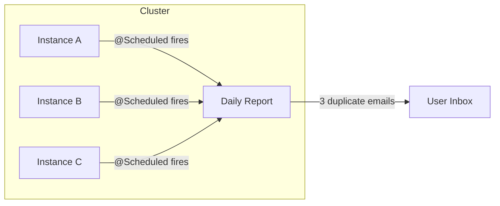
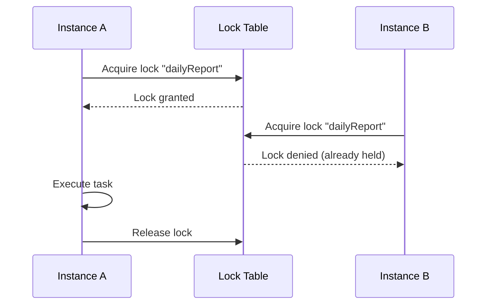
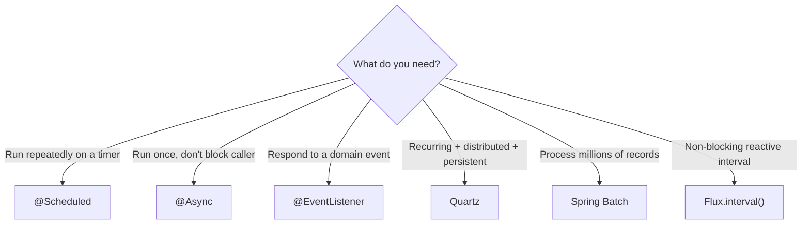

# Task Scheduling in Spring — @Scheduled, Cron Expressions, and Distributed Scheduling

**Date:** 2026-04-17 | **Updated:** 2026-04-17
**Tags:** `spring` `scheduling` `cron` `scheduled` `task-scheduler` `shedlock` `quartz` `spring-batch` `async`

## Table of Contents

- [Summary](#summary)
- [Enabling Scheduling](#enabling-scheduling)
- [@Scheduled — Three Timing Strategies](#scheduled--three-timing-strategies)
  - [fixedRate](#fixedrate)
  - [fixedDelay](#fixeddelay)
  - [cron](#cron)
  - [fixedRate vs fixedDelay Timeline](#fixedrate-vs-fixeddelay-timeline)
- [Cron Expression Syntax](#cron-expression-syntax)
  - [The Six Fields](#the-six-fields)
  - [Special Characters](#special-characters)
  - [Common Patterns](#common-patterns)
- [Properties-Based Scheduling](#properties-based-scheduling)
  - [Externalizing Values](#externalizing-values)
  - [Disabling a Schedule](#disabling-a-schedule)
- [Custom TaskScheduler](#custom-taskscheduler)
  - [Bean Configuration](#bean-configuration)
  - [Properties Configuration](#properties-configuration)
- [Error Handling](#error-handling)
- [Programmatic Scheduling](#programmatic-scheduling)
- [Distributed Scheduling](#distributed-scheduling)
  - [The Problem](#the-problem)
  - [ShedLock](#shedlock)
  - [Quartz Scheduler](#quartz-scheduler)
  - [Spring Batch](#spring-batch)
  - [Comparison](#comparison)
- [Scheduling vs @Async vs Events](#scheduling-vs-async-vs-events)
- [Related](#related)
- [References](#references)

---

## Summary

`@Scheduled` runs methods on a timer. Combined with `@EnableScheduling`, Spring manages recurring
tasks without external tools like cron jobs or Quartz. The annotation supports three timing
strategies — fixed rate, fixed delay, and cron expressions — covering everything from
"every 30 seconds" to "weekdays at 9 AM."

For single-instance applications, `@Scheduled` is usually all you need. For clustered deployments,
a distributed lock (ShedLock) or a full job framework (Quartz, Spring Batch) prevents duplicate
execution across instances.

---

## Enabling Scheduling

Add `@EnableScheduling` to any `@Configuration` class. Without this, `@Scheduled` annotations
are silently ignored.

```java
@Configuration
@EnableScheduling
public class SchedulingConfig {
    // No additional beans needed for basic scheduling
}
```

In Spring Boot, a common pattern is placing it on the main application class:

```java
@SpringBootApplication
@EnableScheduling
public class MyApplication {
    public static void main(String[] args) {
        SpringApplication.run(MyApplication.class, args);
    }
}
```

Spring scans all `@Component` beans for `@Scheduled` methods and registers them with the
internal `TaskScheduler`.

---

## @Scheduled — Three Timing Strategies

### fixedRate

Runs every N milliseconds **regardless** of how long the previous execution took. If execution
takes longer than the interval, the next invocation starts immediately after the current one
finishes (no overlapping by default since the scheduler uses a single thread).

```java
@Component
public class CleanupTask {

    @Scheduled(fixedRate = 60000) // every 60 seconds
    public void cleanExpiredTokens() {
        tokenRepository.deleteExpired();
    }
}
```

### fixedDelay

Waits N milliseconds **after** the previous execution completes before starting the next one.
Use `initialDelay` to postpone the first run after application startup.

```java
@Component
public class SyncTask {

    @Scheduled(fixedDelay = 30000, initialDelay = 5000)
    public void syncData() {
        externalService.pullLatestChanges();
    }
}
```

### cron

Full cron expression for calendar-based scheduling. Supports time zones via the `zone` attribute.

```java
@Component
public class ReportTask {

    @Scheduled(cron = "0 0 2 * * *") // daily at 2 AM
    public void generateDailyReport() {
        reportService.buildAndSend();
    }

    @Scheduled(cron = "0 0 9 * * MON-FRI", zone = "Asia/Tokyo")
    public void weekdayMorningDigest() {
        digestService.send();
    }
}
```

### fixedRate vs fixedDelay Timeline

```mermaid
gantt
    title fixedRate (interval = 5s, execution = 3s)
    dateFormat ss
    axisFormat %S

    section fixedRate
    Run 1 (3s)       :a1, 00, 3s
    Idle              :done, 03, 2s
    Run 2 (3s)       :a2, 05, 3s
    Idle              :done, 08, 2s
    Run 3 (3s)       :a3, 10, 3s
```

```mermaid
gantt
    title fixedDelay (delay = 5s, execution = 3s)
    dateFormat ss
    axisFormat %S

    section fixedDelay
    Run 1 (3s)       :a1, 00, 3s
    Delay (5s)       :done, 03, 5s
    Run 2 (3s)       :a2, 08, 3s
    Delay (5s)       :done, 11, 5s
    Run 3 (3s)       :a3, 16, 3s
```





**Key difference:** `fixedRate` measures from start-to-start. `fixedDelay` measures from
end-to-start. Use `fixedRate` for consistent throughput; use `fixedDelay` when you need a
guaranteed pause between runs (e.g., to avoid hammering an external API).

---

## Cron Expression Syntax

### The Six Fields

Spring cron expressions use **six fields** (not five like Unix cron):

```
┌───────────── second (0-59)
│ ┌───────────── minute (0-59)
│ │ ┌───────────── hour (0-23)
│ │ │ ┌───────────── day of month (1-31)
│ │ │ │ ┌───────────── month (1-12 or JAN-DEC)
│ │ │ │ │ ┌───────────── day of week (0-7 or MON-SUN, 0 and 7 = Sunday)
│ │ │ │ │ │
* * * * * *
```

### Special Characters

| Character | Meaning | Example |
|-----------|---------|---------|
| `*` | Every value | `* * * * * *` = every second |
| `,` | List of values | `0,15,30,45 * * * * *` = at :00, :15, :30, :45 |
| `-` | Range | `0 0 9-17 * * *` = every hour from 9 AM to 5 PM |
| `/` | Increment | `0/15 * * * * *` = every 15 seconds |
| `?` | No specific value (day fields only) | `0 0 0 ? * MON` = every Monday at midnight |
| `L` | Last (day fields only) | `0 0 0 L * *` = last day of month |
| `W` | Nearest weekday | `0 0 0 15W * *` = nearest weekday to the 15th |
| `#` | Nth weekday of month | `0 0 0 ? * FRI#3` = third Friday |

### Common Patterns

| Pattern | Cron Expression |
|---------|----------------|
| Every 5 minutes | `0 0/5 * * * *` |
| Every hour at :00 | `0 0 * * * *` |
| Daily at midnight | `0 0 0 * * *` |
| Daily at 2 AM | `0 0 2 * * *` |
| Weekdays at 9 AM | `0 0 9 * * MON-FRI` |
| First day of month at midnight | `0 0 0 1 * *` |
| Every 30 seconds | `0/30 * * * * *` |
| Last day of every month at 6 PM | `0 0 18 L * *` |
| Every Monday and Friday at noon | `0 0 12 ? * MON,FRI` |

---

## Properties-Based Scheduling

### Externalizing Values

Hardcoded cron expressions make it impossible to change schedules without redeploying. Use
Spring property placeholders with a default value:

```java
@Scheduled(cron = "${cleanup.cron:0 0 2 * * *}")
public void cleanup() {
    tokenRepository.deleteExpired();
}
```

```yaml
# application.yml
cleanup:
  cron: "0 0 3 * * *"   # override: run at 3 AM instead of 2 AM
```

This pattern also works with `fixedRate` and `fixedDelay`:

```java
@Scheduled(fixedRateString = "${sync.rate:60000}")
public void sync() { ... }
```

### Disabling a Schedule

Use the special value `"-"` to disable a scheduled task in certain profiles:

```yaml
# application-test.yml
cleanup:
  cron: "-"   # disabled during tests
```

Spring interprets `"-"` as "do not schedule this method."

---

## Custom TaskScheduler

### Bean Configuration

The default `TaskScheduler` uses a **single thread**. If multiple `@Scheduled` methods exist
and one blocks, all others are delayed. Configure a thread pool to run tasks concurrently:

```java
@Configuration
public class SchedulerConfig {

    @Bean
    public TaskScheduler taskScheduler() {
        ThreadPoolTaskScheduler scheduler = new ThreadPoolTaskScheduler();
        scheduler.setPoolSize(5);
        scheduler.setThreadNamePrefix("scheduled-");
        scheduler.setWaitForTasksToCompleteOnShutdown(true);
        scheduler.setAwaitTerminationSeconds(30);
        return scheduler;
    }
}
```

### Properties Configuration

Spring Boot 2.1+ supports configuring the scheduler through properties:

```yaml
spring:
  task:
    scheduling:
      pool:
        size: 5
      thread-name-prefix: "scheduled-"
      shutdown:
        await-termination: true
        await-termination-period: 30s
```

---

## Error Handling

A failure in one run does **not** stop future runs. The scheduler catches exceptions internally
and logs them. However, the default behavior is a simple `ERROR` log — no alerting, no retry.

For custom handling, set an `ErrorHandler` on the scheduler:

```java
@Bean
public TaskScheduler taskScheduler() {
    ThreadPoolTaskScheduler scheduler = new ThreadPoolTaskScheduler();
    scheduler.setPoolSize(5);
    scheduler.setErrorHandler(t ->
        log.error("Scheduled task failed: {}", t.getMessage(), t));
    return scheduler;
}
```

For retry logic, handle it inside the scheduled method itself:

```java
@Scheduled(fixedDelay = 60000)
public void resilientSync() {
    try {
        externalService.sync();
    } catch (TransientException e) {
        log.warn("Sync failed, will retry next cycle", e);
    } catch (FatalException e) {
        log.error("Sync permanently failed", e);
        alertService.notify("Sync task broken", e);
    }
}
```

---

## Programmatic Scheduling

Use `TaskScheduler` directly when you need dynamic schedules — schedules determined at runtime,
user-configurable intervals, or the ability to cancel a running schedule.

```java
@Service
public class DynamicSchedulerService {

    private final TaskScheduler taskScheduler;
    private ScheduledFuture<?> activeFuture;

    public DynamicSchedulerService(TaskScheduler taskScheduler) {
        this.taskScheduler = taskScheduler;
    }

    public void startPolling(Duration interval) {
        // Cancel previous schedule if running
        stopPolling();
        activeFuture = taskScheduler.scheduleAtFixedRate(
            () -> pollExternalApi(), interval);
    }

    public void stopPolling() {
        if (activeFuture != null) {
            activeFuture.cancel(false);
        }
    }

    private void pollExternalApi() {
        // actual work
    }
}
```

Other `TaskScheduler` methods:

| Method | Behavior |
|--------|----------|
| `schedule(Runnable, Trigger)` | Custom trigger logic |
| `scheduleAtFixedRate(Runnable, Duration)` | Same as `fixedRate` |
| `scheduleWithFixedDelay(Runnable, Duration)` | Same as `fixedDelay` |
| `schedule(Runnable, Instant)` | One-shot at a specific time |

---

## Distributed Scheduling

### The Problem

`@Scheduled` runs on **every** application instance. In a clustered deployment with 3 replicas,
a daily report task fires 3 times, sending 3 duplicate reports.



Solutions fall into two categories: **lock-based** (one instance runs, others skip) and
**framework-based** (a dedicated job scheduler with persistence and clustering).

### ShedLock

A lightweight library that uses a shared store (database, Redis, etc.) to ensure only one
instance executes a scheduled task at a time.

```java
// 1. Add dependency
// net.javacrumbs.shedlock:shedlock-spring
// net.javacrumbs.shedlock:shedlock-provider-jdbc-template

// 2. Enable
@Configuration
@EnableScheduling
@EnableSchedulerLock(defaultLockAtMostFor = "10m")
public class SchedulerConfig { }

// 3. Annotate tasks
@Scheduled(cron = "0 0 2 * * *")
@SchedulerLock(name = "dailyReport", lockAtLeastFor = "5m", lockAtMostFor = "30m")
public void generateDailyReport() {
    reportService.buildAndSend();
}
```



ShedLock does not handle scheduling itself — it only prevents duplicate execution. The
scheduling remains with `@Scheduled`.

### Quartz Scheduler

A full-featured job scheduling framework with persistent job stores, clustering, misfire
handling, and calendars. Use when you need:

- Jobs that survive application restarts
- Complex trigger logic (calendars, misfire policies)
- Job chaining and dependencies
- Admin UI for monitoring

Spring Boot auto-configures Quartz with `spring-boot-starter-quartz`:

```yaml
spring:
  quartz:
    job-store-type: jdbc
    jdbc:
      initialize-schema: always
    properties:
      org.quartz.jobStore.isClustered: true
      org.quartz.jobStore.clusterCheckinInterval: 20000
```

### Spring Batch

Designed for **heavy batch processing** — reading millions of records, transforming them, and
writing results. Not a scheduler itself, but often triggered by one. Provides:

- Chunk-based processing with configurable commit intervals
- Skip and retry policies
- Job restart and recovery
- Execution metadata (start time, status, read/write counts)

Pair Spring Batch with `@Scheduled` or Quartz to trigger batch jobs on a schedule.

### Comparison

| Feature | @Scheduled + ShedLock | Quartz | Spring Batch |
|---------|----------------------|--------|--------------|
| Setup complexity | Low | Medium | High |
| Distributed locking | Yes (ShedLock) | Built-in clustering | N/A (needs trigger) |
| Job persistence | No | Yes (JDBC store) | Yes (job repository) |
| Misfire handling | No | Yes | Yes (restart) |
| Admin/monitoring UI | No | Third-party | Spring Cloud Data Flow |
| Best for | Simple recurring tasks | Complex scheduling | Heavy data processing |

---

## Scheduling vs @Async vs Events

| Need | Tool | Why |
|------|------|-----|
| Run every X minutes | `@Scheduled` | Timer-based recurring execution |
| Run once in the background | `@Async` | Fire-and-forget on a thread pool |
| React to something that happened | `@EventListener` | Decoupled event-driven communication |
| Complex recurring jobs with persistence | Quartz | Job store, clustering, misfire recovery |
| Heavy batch data processing | Spring Batch | Chunk processing, skip/retry, restartability |
| Reactive stream on interval | `Flux.interval()` | Non-blocking timer in reactive pipelines |



---

## Related

- [async-processing.md](async-processing.md) — `@Async`, `CompletableFuture`, and thread pool configuration
- [application-events.md](application-events.md) — `@EventListener`, `ApplicationEventPublisher`, and custom events
- [reactive-observability.md](../reactive-observability.md) — Monitoring reactive pipelines with Micrometer and Sleuth

---

## References

- [Spring Scheduling Reference](https://docs.spring.io/spring-framework/reference/integration/scheduling.html) — official docs covering `@Scheduled`, `TaskScheduler`, and cron syntax
- [Spring Boot Scheduling Properties](https://docs.spring.io/spring-boot/docs/current/reference/html/application-properties.html#application-properties.task) — `spring.task.scheduling.*` properties
- [Spring Cron Expressions](https://docs.spring.io/spring-framework/reference/integration/scheduling.html#scheduling-cron-expression) — the 6-field cron format used by Spring
- [ShedLock GitHub](https://github.com/lukas-krecan/ShedLock) — distributed lock for scheduled tasks
- [Quartz Scheduler](https://www.quartz-scheduler.org/) — full-featured job scheduling framework
- [Spring Boot Quartz Integration](https://docs.spring.io/spring-boot/docs/current/reference/html/io.html#io.quartz) — auto-configuration for Quartz in Spring Boot
- [Spring Batch Reference](https://docs.spring.io/spring-batch/reference/) — chunk-based batch processing framework
