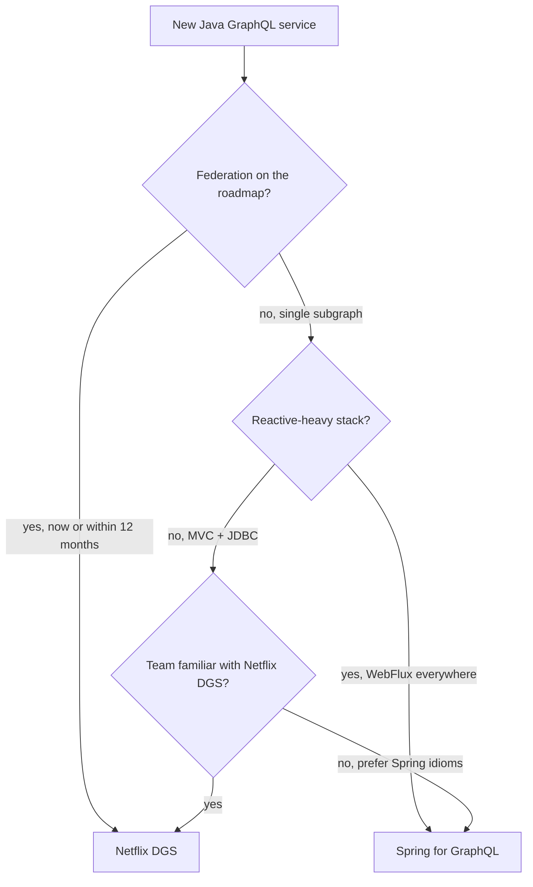

# Netflix DGS vs Spring for GraphQL — Building Java Subgraphs

**Date:** 2026-04-18 | **Updated:** 2026-04-18
**Tags:** `graphql` `federation` `dgs` `spring-graphql` `spring-boot` `java`

## Table of Contents

- [Summary](#summary)
- [Library Comparison at a Glance](#library-comparison-at-a-glance)
- [Netflix DGS — Dependencies and Setup](#netflix-dgs--dependencies-and-setup)
- [DGS — Writing a Subgraph](#dgs--writing-a-subgraph)
  - [Schema and Code Generation](#schema-and-code-generation)
  - [Query and Mutation Resolvers](#query-and-mutation-resolvers)
  - [Entity Fetchers for Federation](#entity-fetchers-for-federation)
  - [DataLoader Integration](#dataloader-integration)
  - [Testing with DgsQueryExecutor](#testing-with-dgsqueryexecutor)
- [Spring for GraphQL — Dependencies and Setup](#spring-for-graphql--dependencies-and-setup)
- [Spring for GraphQL — Writing a Subgraph](#spring-for-graphql--writing-a-subgraph)
  - [Controller Annotations](#controller-annotations)
  - [Batch Loading with @BatchMapping](#batch-loading-with-batchmapping)
  - [Federation Support](#federation-support)
  - [Testing with GraphQlTester](#testing-with-graphqltester)
- [Choosing Between Them](#choosing-between-them)
- [Observability](#observability)
- [Security](#security)
- [Worked Example — Two-Subgraph Federation with DGS](#worked-example--two-subgraph-federation-with-dgs)
- [Common Spring Pitfalls](#common-spring-pitfalls)
- [Related](#related)
- [References](#references)

---

## Summary

Two Spring-Boot-native frameworks dominate Java GraphQL today: [Netflix DGS](https://netflix.github.io/dgs/) (open-sourced from the framework that powers Netflix's federated graph) and [Spring for GraphQL](https://spring.io/projects/spring-graphql) (the official Spring project, backed by VMware and co-led by the `graphql-java` team). DGS wins when you want production-grade federation out of the box, rich code generation, and Netflix-battle-tested patterns; Spring for GraphQL wins when you want tighter Spring idioms, first-class WebFlux/virtual-thread support, and you're building a single subgraph without federation. Both sit on top of [`graphql-java`](https://www.graphql-java.com/) and are interoperable at the resolver level. This doc shows how to build a subgraph in each, compares them honestly, and ends with a worked two-subgraph federation using DGS and the [Apollo Router](https://www.apollographql.com/docs/router/).

---

## Library Comparison at a Glance

| Dimension | Netflix DGS | Spring for GraphQL |
|-----------|-------------|---------------------|
| First release | 2021 (open-sourced; internal since ~2019) | 2022 (1.0 GA) |
| Federation support | First-class (`@DgsEntityFetcher`, generated SDL) | Via third-party add-on or manual wiring |
| Schema style | Schema-first only | Schema-first (code-first possible but unusual) |
| Code generation | [`dgs-codegen`](https://github.com/Netflix/dgs-codegen) Gradle plugin | Schema-to-DTO via community plugins only |
| Resolver style | `@DgsComponent` + `@DgsQuery`/`@DgsMutation`/`@DgsData` | `@Controller` + `@QueryMapping`/`@MutationMapping`/`@SchemaMapping` |
| DataLoader integration | `@DgsDataLoader` with mapped/batched variants | `@BatchMapping` (per-parent batching) |
| Reactive support | Supports `Mono`/`Flux` return types; imperative-first | Imperative **and** reactive on equal footing |
| Virtual threads | Works with `spring.threads.virtual.enabled=true` | Same |
| Testing | `DgsQueryExecutor` | `GraphQlTester`, `WebGraphQlTester`, `HttpGraphQlTester` |
| Subscriptions | SSE and WebSocket | SSE, WebSocket, RSocket |
| Error handling | `DataFetcherExceptionHandler` | `DataFetcherExceptionResolver` |
| Docs and community | Smaller but focused; Netflix examples | Broader Spring ecosystem integration |
| Federation v2 directives | Generated from subgraph schema automatically | Manual SDL + composition plumbing |

Neither is "wrong". If federation is on your roadmap, DGS is the shorter path. If you're writing a single GraphQL service inside a Spring-heavy stack, Spring for GraphQL is more idiomatic.

---

## Netflix DGS — Dependencies and Setup

For Spring Boot 3.x + Java 21:

```gradle
plugins {
    id 'org.springframework.boot' version '3.2.0'
    id 'io.spring.dependency-management' version '1.1.4'
    id 'com.netflix.dgs.codegen' version '6.0.3'
}

dependencies {
    implementation platform('com.netflix.graphql.dgs:graphql-dgs-platform-dependencies:9.0.4')
    implementation 'com.netflix.graphql.dgs:graphql-dgs-spring-boot-starter'
    implementation 'com.netflix.graphql.dgs:graphql-dgs-extended-scalars'
    implementation 'com.netflix.graphql.dgs:graphql-dgs-spring-webmvc-autoconfigure'
    testImplementation 'com.netflix.graphql.dgs:graphql-dgs-spring-boot-starter-test'
}

generateJava {
    schemaPaths = ['src/main/resources/schema']
    packageName = 'com.example.users.graphql'
    generateClient = false
    typeMapping = ['DateTime': 'java.time.Instant']
}
```

The `dgs-codegen` plugin reads `.graphqls` files, generates Java types and `DataFetchingEnvironment` helpers, and integrates with `build` so every compile re-syncs types with schema.

---

## DGS — Writing a Subgraph

### Schema and Code Generation

```graphql
# src/main/resources/schema/users.graphqls
extend schema
  @link(url: "https://specs.apollo.dev/federation/v2.7",
        import: ["@key"])

type User @key(fields: "id") {
  id: ID!
  email: String!
  displayName: String!
}

extend type Query {
  user(id: ID!): User
  users(ids: [ID!]!): [User!]!
}
```

`./gradlew generateJava` produces:

- `com.example.users.graphql.types.User` — DTO record.
- `com.example.users.graphql.DgsConstants` — string constants for field names.

### Query and Mutation Resolvers

```java
@DgsComponent
@RequiredArgsConstructor
public class UserDataFetcher {

    private final UserService userService;

    @DgsQuery
    public User user(@InputArgument String id) {
        return userService.findById(id);
    }

    @DgsQuery
    public List<User> users(@InputArgument List<String> ids) {
        return userService.findAllById(ids);
    }

    @DgsMutation
    public User updateEmail(@InputArgument String id, @InputArgument String email) {
        return userService.updateEmail(id, email);
    }
}
```

`@InputArgument` binds GraphQL arguments to method parameters by name. Types auto-convert via Jackson plus DGS's extended-scalars registry.

For a field that's expensive to compute only when requested:

```java
@DgsData(parentType = "User", field = "displayName")
public String displayName(DgsDataFetchingEnvironment env) {
    User parent = env.getSource();
    return formatDisplayName(parent);
}
```

### Entity Fetchers for Federation

This is the DGS-specific piece that makes federation click:

```java
@DgsComponent
@RequiredArgsConstructor
public class UserEntityFetcher {

    private final UserService userService;

    @DgsEntityFetcher(name = "User")
    public User resolveUser(Map<String, Object> values) {
        String id = (String) values.get("id");
        return userService.findById(id);
    }
}
```

DGS automatically:

1. Generates the `_entities` resolver and registers your fetcher against the `User` `__typename`.
2. Emits the right federation SDL (`_service { sdl }`) so the router can fetch it.
3. Wires up the `@link` and `@key` directives declared in your schema.

No gateway-side config is needed per subgraph — the router discovers everything from the supergraph schema.

### DataLoader Integration

Calling `resolveUser` once per ID is an N+1 against your database. DGS's DataLoader:

```java
@DgsDataLoader(name = "userById", caching = true)
public class UserBatchLoader implements MappedBatchLoader<String, User> {

    private final UserService userService;

    public UserBatchLoader(UserService userService) {
        this.userService = userService;
    }

    @Override
    public CompletionStage<Map<String, User>> load(Set<String> ids) {
        return CompletableFuture.supplyAsync(() ->
            userService.findAllById(ids).stream()
                .collect(Collectors.toMap(User::getId, u -> u)));
    }
}
```

Use it from a resolver:

```java
@DgsData(parentType = "Order", field = "customer")
public CompletableFuture<User> customer(DgsDataFetchingEnvironment env) {
    DataLoader<String, User> loader = env.getDataLoader("userById");
    Order order = env.getSource();
    return loader.load(order.getCustomerId());
}
```

All `.load()` calls within a single request are batched into one `MappedBatchLoader.load()` invocation. This is how federation's entity fetchers scale.

### Testing with DgsQueryExecutor

```java
@SpringBootTest(classes = {DgsAutoConfiguration.class, UserDataFetcher.class, UserServiceTestConfig.class})
class UserDataFetcherTest {

    @Autowired
    DgsQueryExecutor queryExecutor;

    @Test
    void returnsUserById() {
        String email = queryExecutor.executeAndExtractJsonPath(
            "{ user(id: \"u1\") { email } }",
            "data.user.email");

        assertThat(email).isEqualTo("alice@example.com");
    }
}
```

No HTTP required — `DgsQueryExecutor` runs the resolver graph in-process.

---

## Spring for GraphQL — Dependencies and Setup

```gradle
dependencies {
    implementation 'org.springframework.boot:spring-boot-starter-graphql'
    implementation 'org.springframework.boot:spring-boot-starter-web'   // or -webflux
    testImplementation 'org.springframework.boot:spring-boot-starter-test'
    testImplementation 'org.springframework:spring-webflux'
    testImplementation 'org.springframework.graphql:spring-graphql-test'
}
```

Schema lives at `src/main/resources/graphql/*.graphqls`. Auto-discovery picks it up.

---

## Spring for GraphQL — Writing a Subgraph

### Controller Annotations

```java
@Controller
@RequiredArgsConstructor
public class UserController {

    private final UserService userService;

    @QueryMapping
    public User user(@Argument String id) {
        return userService.findById(id);
    }

    @QueryMapping
    public List<User> users(@Argument List<String> ids) {
        return userService.findAllById(ids);
    }

    @MutationMapping
    public User updateEmail(@Argument String id, @Argument String email) {
        return userService.updateEmail(id, email);
    }

    @SchemaMapping(typeName = "User", field = "displayName")
    public String displayName(User user) {
        return formatDisplayName(user);
    }
}
```

Maps directly onto Spring MVC / WebFlux controllers — same annotation-driven model, different target protocol.

### Batch Loading with @BatchMapping

```java
@BatchMapping
public Map<Order, User> customer(List<Order> orders) {
    Set<String> userIds = orders.stream().map(Order::customerId).collect(toSet());
    Map<String, User> byId = userService.findAllById(userIds).stream()
        .collect(toMap(User::id, u -> u));
    return orders.stream()
        .collect(toMap(o -> o, o -> byId.get(o.customerId())));
}
```

`@BatchMapping` runs once per parent field, taking the full list of parents. Easier than hand-wiring a DataLoader but only handles parent→child cases. For arbitrary cross-field batching, use `graphql-java`'s DataLoader directly.

### Federation Support

Spring for GraphQL ships **without** first-class federation. Options:

1. **[`federation-graphql-java-support`](https://github.com/apollographql/federation-jvm)** — Apollo's low-level federation hooks. You wire them into a `GraphQlSource` customizer:

    ```java
    @Bean
    public GraphQlSourceBuilderCustomizer federationCustomizer() {
        return builder -> builder.schemaFactory((registry, wiring) ->
            Federation.transform(registry, wiring)
                .fetchEntities(env -> resolveEntity(env))
                .resolveEntityType(env -> resolveTypeName(env))
                .build());
    }
    ```

2. **Drop down to graphql-java directly** — use `graphql-java`'s federation module and give up Spring's annotation model for that subgraph.
3. **Switch to DGS** — often simpler.

If federation is core to your design and you're picking a framework today, DGS is materially less plumbing.

### Testing with GraphQlTester

```java
@GraphQlTest(UserController.class)
class UserControllerTest {

    @Autowired
    GraphQlTester graphQlTester;

    @MockBean
    UserService userService;

    @Test
    void returnsUserById() {
        when(userService.findById("u1")).thenReturn(new User("u1", "alice@example.com"));

        graphQlTester.document("{ user(id: \"u1\") { email } }")
            .execute()
            .path("user.email").entity(String.class).isEqualTo("alice@example.com");
    }
}
```

Slice tests (`@GraphQlTest`) avoid spinning the whole context. Full-stack tests use `HttpGraphQlTester` against a running server.

---

## Choosing Between Them

Decision tree:



In practice, pick DGS when federation is the point. Pick Spring for GraphQL when it isn't.

---

## Observability

Both frameworks integrate with [Micrometer](https://micrometer.io/) for metrics and [OpenTelemetry](https://opentelemetry.io/docs/instrumentation/java/) for tracing.

- DGS — enable `dgs.graphql.introspection.enabled=true` in dev; metrics via `DgsGraphQLMetricsAutoConfiguration`.
- Spring for GraphQL — metrics via `GraphQlMetricsAutoConfiguration` (enabled by default when Micrometer is on the classpath).

Federation tracing: install the [Apollo OTel federation tracing plugin](https://www.apollographql.com/docs/router/configuration/telemetry/) on the router, and it propagates a shared trace across subgraph calls. Each subgraph's resolver spans show up under the router's gateway span. This is invaluable when a p99 spike could be in any of six subgraphs — see [multi-database-patterns.md § Observability](multi-database-patterns.md#observability-across-subgraphs).

---

## Security

Resolver-level authorization with Spring Security works in both:

```java
@DgsQuery
@PreAuthorize("hasRole('ADMIN')")
public AuditLog auditLog(@InputArgument String id) {
    return auditService.fetch(id);
}
```

Field-level (visible only to certain roles) requires either manual checks inside the resolver or a directive-based approach like [`graphql-authorization`](https://github.com/apollographql/graphql-authorization).

Gateway-level auth is typical: the Apollo Router validates a JWT, forwards claims to subgraphs as headers, subgraphs trust the header. Mutual TLS between router and subgraphs keeps the network boundary honest. See [OAuth2 and JWT in Spring Security](../security/oauth2-jwt.md) for token validation.

**Never expose subgraph endpoints publicly.** The router is the only public entry. Subgraphs should be private-network only — or at minimum, behind mTLS.

---

## Worked Example — Two-Subgraph Federation with DGS

Two subgraphs — `users` and `orders` — composed into a supergraph by the [Apollo Router](https://www.apollographql.com/docs/router/).

**`users-subgraph/src/main/resources/schema/users.graphqls`:**

```graphql
extend schema
  @link(url: "https://specs.apollo.dev/federation/v2.7", import: ["@key"])

type User @key(fields: "id") {
  id: ID!
  email: String!
}

extend type Query { user(id: ID!): User }
```

**`orders-subgraph/src/main/resources/schema/orders.graphqls`:**

```graphql
extend schema
  @link(url: "https://specs.apollo.dev/federation/v2.7", import: ["@key", "@external"])

type Order @key(fields: "id") {
  id: ID!
  total: Float!
  customer: User!
}

extend type User @key(fields: "id") {
  id: ID! @external
  orders: [Order!]!
}

extend type Query { order(id: ID!): Order }
```

**Compose the supergraph** locally:

```yaml
# supergraph.yaml
federation_version: =2.7.0
subgraphs:
  users:
    routing_url: http://localhost:8081/graphql
    schema: { subgraph_url: http://localhost:8081/graphql }
  orders:
    routing_url: http://localhost:8082/graphql
    schema: { subgraph_url: http://localhost:8082/graphql }
```

```bash
rover supergraph compose --config supergraph.yaml > supergraph.graphql
```

**Run the router:**

```bash
./router --supergraph supergraph.graphql --listen 127.0.0.1:4000
```

Now querying `http://localhost:4000/`:

```graphql
query {
  user(id: "u1") {
    email
    orders { id total }
  }
}
```

…runs `user(id)` against the users subgraph, then `_entities` on the orders subgraph with `{ __typename: "User", id: "u1" }` to load the orders list. Client never sees the hop.

---

## Common Spring Pitfalls

- **Eager `@Transactional` across resolver tree.** GraphQL resolvers are called lazily per field; wrapping the root in `@Transactional` keeps the JDBC connection open for the whole request. Use `@Transactional(propagation = REQUIRES_NEW)` per resolver, or do the DB work in a service layer. See [JPA transactions](../jpa-transactions.md).
- **Virtual threads + DataLoader.** DataLoader batches within one request tick. With virtual threads + `@Async`, tasks can resolve on different carriers — the batch window closes before other loads arrive. Stick with `CompletableFuture` for loader plumbing, reserve VTs for request-scoped imperative code.
- **Reactive vs imperative mix.** Spring for GraphQL supports both, but mixing `Mono` resolvers with blocking service calls reintroduces every reactive pitfall. See [reactive-blocking-jpa-pattern.md](../reactive-blocking-jpa-pattern.md).
- **Forgetting to expose `_service` and `_entities`.** DGS handles it; with Spring for GraphQL + federation you must wire it up explicitly.
- **N+1 through entity fetchers.** Always have a DataLoader for anything the entity fetcher touches in a database. See [multi-database-patterns.md § N+1](multi-database-patterns.md#query-planning-and-n1).

---

## Related

- [GraphQL Federation Concepts](federation-concepts.md) — the spec side; directives, composition, routers.
- [Federated GraphQL with Polyglot Persistence](multi-database-patterns.md) — DB-per-subgraph, saga/outbox, query planning.
- [Spring Fundamentals](../spring-fundamentals.md) — the DI and annotation model both frameworks rely on.
- [Virtual Threads and Spring Boot](../spring-virtual-threads.md) — enabling VTs under a GraphQL resolver layer.
- [Reactive Programming in Java](../reactive-programming-java.md) — for `Mono`/`Flux` resolvers in Spring for GraphQL.
- [JPA Transactions](../jpa-transactions.md) — scoping transactions inside GraphQL resolvers.
- [OAuth2 and JWT in Spring Security](../security/oauth2-jwt.md) — router → subgraph auth propagation.
- [Reactive Observability](../reactive-observability.md) — tracing and metrics.
- [Spring Boot Testing Fundamentals](../testing/spring-boot-test-basics.md) — context for `@GraphQlTest` and `@DgsComponent` tests.

---

## References

- [Netflix DGS documentation](https://netflix.github.io/dgs/) — official DGS docs.
- [Netflix DGS GitHub](https://github.com/Netflix/dgs-framework) — source, issues, releases.
- [`dgs-codegen` Gradle plugin](https://github.com/Netflix/dgs-codegen) — schema-to-Java type generation.
- [Spring for GraphQL documentation](https://docs.spring.io/spring-graphql/reference/) — official reference.
- [Spring for GraphQL GitHub](https://github.com/spring-projects/spring-graphql)
- [`federation-jvm` — Apollo Federation support for graphql-java](https://github.com/apollographql/federation-jvm)
- [`graphql-java` documentation](https://www.graphql-java.com/documentation/getting-started)
- [Apollo Router documentation](https://www.apollographql.com/docs/router/)
- [Rover CLI — supergraph compose](https://www.apollographql.com/docs/rover/commands/supergraphs)
- [Apollo Federation subgraph spec](https://www.apollographql.com/docs/federation/subgraph-spec/)
- [Netflix Tech Blog — How Netflix Scales its API with GraphQL Federation](https://netflixtechblog.com/how-netflix-scales-its-api-with-graphql-federation-part-1-ae3557c187e2)
