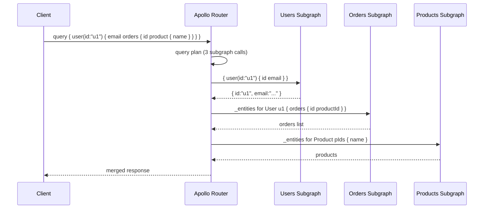
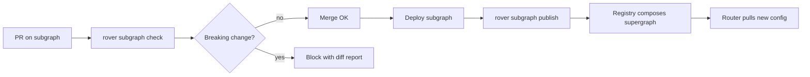

# GraphQL Federation Concepts — Subgraphs, Gateway, and the Apollo Spec

**Date:** 2026-04-18 | **Updated:** 2026-04-18
**Tags:** `graphql` `federation` `apollo` `architecture` `api-design`

## Table of Contents

- [Summary](#summary)
- [Why Federation Exists](#why-federation-exists)
- [Monolithic GraphQL vs Stitching vs Federation](#monolithic-graphql-vs-stitching-vs-federation)
- [Subgraph, Supergraph, Gateway](#subgraph-supergraph-gateway)
- [Apollo Federation v1 vs v2](#apollo-federation-v1-vs-v2)
- [Core Directives](#core-directives)
  - [@key — Entity Definition](#key--entity-definition)
  - [@external — Borrowing a Field](#external--borrowing-a-field)
  - [@requires — Needing Another Subgraph's Data](#requires--needing-another-subgraphs-data)
  - [@provides — Skipping a Round-Trip](#provides--skipping-a-round-trip)
  - [@shareable, @override, @inaccessible, @tag (v2)](#shareable-override-inaccessible-tag-v2)
- [Entity Resolution Under the Hood](#entity-resolution-under-the-hood)
- [Request Flow End to End](#request-flow-end-to-end)
- [Composition — Static vs Managed vs Self-Hosted](#composition--static-vs-managed-vs-self-hosted)
- [Schema Registry and CI](#schema-registry-and-ci)
- [Common Composition Errors](#common-composition-errors)
- [When NOT to Federate](#when-not-to-federate)
- [Related](#related)
- [References](#references)

---

## Summary

[GraphQL Federation](https://www.apollographql.com/docs/federation/) is an architecture for composing many independently-deployed GraphQL services into a single graph that clients see as one API. Each service — a **subgraph** — owns a slice of the schema and a slice of the data, and a **gateway** (or modern **router**) plans each incoming query, fans out to the right subgraphs, and stitches the response. The key primitive is the **entity**: a type any subgraph can extend by declaring `@key(fields: "id")`, so that User can be "owned" by the identity service while orders live in the orders service and preferences live in the preferences service. Federation is what lets Netflix, GitHub, Expedia, and similar large engineering orgs run hundreds of teams behind one API surface without coordinating a giant monolithic schema. This doc covers the spec and the mental model; the Java implementation with Netflix DGS and Spring for GraphQL lives in [dgs-and-spring-graphql.md](dgs-and-spring-graphql.md), and the distributed-data patterns live in [multi-database-patterns.md](multi-database-patterns.md).

---

## Why Federation Exists

A monolithic GraphQL schema hits the same coordination wall every shared database hits: one repository, many teams, constant merge conflicts. At Netflix scale, "add a field to User" means a PR reviewed by 10 teams and a shared deploy window. Federation decouples that.

The three forces that drive adoption:

1. **Team autonomy** — each team owns a subgraph, deploys it independently, and changes its schema without coordinating with other teams.
2. **Data ownership boundaries** — the orders team owns the orders DB; they don't want other teams reading their tables. Federation makes "query orders from the users subgraph" a GraphQL concern, not a database concern.
3. **One client-facing surface** — mobile apps, web clients, and partner integrations still see one endpoint and one schema. They don't know or care that `user.orders` crosses a service boundary.

Netflix described this journey in the ["How Netflix Scales its API with GraphQL Federation"](https://netflixtechblog.com/how-netflix-scales-its-api-with-graphql-federation-part-1-ae3557c187e2) series. Their **Studio Edge** architecture has >100 subgraphs behind one federated graph.

---

## Monolithic GraphQL vs Stitching vs Federation

Three historical approaches to "one graph, many services":

| Approach | How it works | Status |
|----------|--------------|--------|
| **Monolithic GraphQL** | One server, one schema, one deploy. | Fine ≤ 2 teams; breaks down at scale. |
| **Schema stitching** | Gateway fetches subschemas from each service, merges them, routes fields. | **Deprecated** by the Apollo ecosystem. Some teams still run it via [graphql-tools stitching](https://the-guild.dev/graphql/stitching) — use for migration, not greenfield. |
| **Apollo Federation** | Subgraphs declare entities via directives; gateway composes a supergraph schema ahead of time and plans queries at runtime. | Current best practice. Spec open; many implementations. |

Federation won because:

- Composition happens at build time, not per request — lower gateway overhead.
- Entities cross service boundaries without the gateway needing special-case merge logic.
- A spec means Apollo Router, self-hosted routers (Cosmo, Hive Router), and client libraries all interoperate.

---

## Subgraph, Supergraph, Gateway

The three nouns every federation conversation uses:

- **Subgraph** — one GraphQL service. Owns a schema slice and a data slice. Built with [Netflix DGS](https://netflix.github.io/dgs/), [Spring for GraphQL](https://spring.io/projects/spring-graphql), [Apollo Server](https://www.apollographql.com/docs/apollo-server/), [graphql-java](https://www.graphql-java.com/), [gqlgen](https://gqlgen.com/), etc.
- **Supergraph** — a composed schema file (SDL) that merges every subgraph's schema into one, resolving entity references and directives. Produced by a composition tool.
- **Gateway / Router** — the runtime that accepts client queries, plans execution across subgraphs, makes the subgraph calls, and merges results. Options: [Apollo Router](https://www.apollographql.com/docs/router/) (Rust, fast), [Apollo Gateway](https://www.apollographql.com/docs/federation/api/apollo-gateway/) (Node, legacy), [Cosmo Router](https://cosmo-docs.wundergraph.com/router), [Hive Gateway](https://the-guild.dev/graphql/hive/docs/gateway).

Terminology tip: "gateway" and "router" are used interchangeably, but **router** is the current Apollo term and the one you'll see in new docs.

---

## Apollo Federation v1 vs v2

Federation v1 shipped in 2019. [Federation v2](https://www.apollographql.com/docs/federation/federation-2/new-in-federation-2/) shipped in 2022 and is the current target for any new work.

| Aspect | v1 | v2 |
|--------|----|----|
| Multiple subgraphs owning the same field | Use `extend type` hacks | `@shareable` directive |
| Schema link | Implicit | Explicit `@link` to the federation spec version |
| Namespace collisions | Fail composition | Resolvable via `@override` and `@inaccessible` |
| Progressive migration | — | `@tag` for contracts |
| Value type merging | Limited | First-class via `@shareable` |
| Interface entities | No | Yes (`@interfaceObject`) |

**Always target v2** for new projects. A v2 subgraph SDL starts with:

```graphql
extend schema
  @link(url: "https://specs.apollo.dev/federation/v2.7",
        import: ["@key", "@external", "@requires", "@provides", "@shareable"])
```

---

## Core Directives

Federation's power comes from five directives. Everything else is built on these.

### @key — Entity Definition

An **entity** is a type that can be referenced across subgraphs. `@key` declares which fields uniquely identify it:

```graphql
type User @key(fields: "id") {
  id: ID!
  email: String!
}
```

Any subgraph that includes `User` must implement a **reference resolver** — given `{ "__typename": "User", "id": "u1" }`, return the User data this subgraph owns.

Multiple keys are allowed:

```graphql
type Product @key(fields: "upc") @key(fields: "sku region") {
  upc: ID!
  sku: String!
  region: String!
}
```

Composite keys use space-separated field lists.

### @external — Borrowing a Field

When a subgraph references a field it doesn't own, mark it `@external`:

```graphql
# orders subgraph — doesn't own User.email, just needs id
extend type User @key(fields: "id") {
  id: ID! @external
  orders: [Order!]!
}
```

The orders subgraph contributes `orders` to the User type. `id` is `@external` because the users subgraph owns it.

### @requires — Needing Another Subgraph's Data

A resolver sometimes needs a field it doesn't own to compute a field it does own:

```graphql
# shipping subgraph needs User.address to compute shipping cost
extend type User @key(fields: "id") {
  id: ID! @external
  address: Address! @external
  shippingQuote(items: [ID!]!): Money! @requires(fields: "address")
}
```

The gateway fetches `address` from the users subgraph before calling the shipping subgraph's resolver.

### @provides — Skipping a Round-Trip

Sometimes a subgraph already has a field in memory and wants the gateway to know it can skip the owning subgraph:

```graphql
# reviews subgraph caches author names
type Review {
  id: ID!
  author: User! @provides(fields: "name")
  rating: Int!
}

extend type User @key(fields: "id") {
  id: ID! @external
  name: String! @external
}
```

If the client queries `review.author.name`, the gateway serves it directly from reviews without calling users. `@provides` is an optimization — correctness still requires the providing subgraph to return the same value the owner would.

### @shareable, @override, @inaccessible, @tag (v2)

- `@shareable` — multiple subgraphs can all return this field. Used for value types (e.g., `Money`, `Address`) owned by no one in particular.
- `@override(from: "old-subgraph")` — mark a field as migrated from one subgraph to another. Enables atomic ownership transfer without coordinated deploys.
- `@inaccessible` — field exists in some subgraph's schema but is hidden from the public supergraph. Useful for internal-only fields.
- `@tag(name: "...")` — attach tags used by [contracts](https://www.apollographql.com/docs/graphos/platform/schema-management/delivery/contracts) to produce filtered subgraphs (public vs partner vs internal APIs from one source of truth).

---

## Entity Resolution Under the Hood

Every federated subgraph exposes two special root fields the gateway uses:

```graphql
type Query {
  _service: _Service!                                      # returns this subgraph's SDL
  _entities(representations: [_Any!]!): [_Entity]!         # resolve a batch of entity refs
}
```

When the gateway needs entity data, it calls `_entities` with a batch of representations:

```graphql
query ($reps: [_Any!]!) {
  _entities(representations: $reps) {
    ... on User { email }
    ... on User { orders { id total } }
  }
}
```

Variables:

```json
{ "reps": [
  { "__typename": "User", "id": "u1" },
  { "__typename": "User", "id": "u2" }
]}
```

The subgraph's **reference resolver** for `User` is called once per entry. Batch the inner data-fetches with a [DataLoader](https://github.com/graphql/dataloader) or you'll cause an N+1 — see [multi-database-patterns.md § N+1](multi-database-patterns.md#query-planning-and-n1).

Library-specific reference resolver examples:

- **DGS**: `@DgsEntityFetcher(name = "User") User resolveUser(Map<String, Object> values)`.
- **Spring for GraphQL** + `graphql-java-federation`: return a `SchemaTransformer` that maps `__typename` to a resolver.
- **Apollo Server**: a `__resolveReference` function on the type.

---

## Request Flow End to End



The router is doing three things in sequence:

1. **Parse** the client query against the composed supergraph schema.
2. **Plan** the fetches — figure out which subgraphs can answer which fields.
3. **Execute** the plan in parallel where possible, serially where entity data feeds the next call.

The plan is cached per query shape, so repeat queries skip step 2.

---

## Composition — Static vs Managed vs Self-Hosted

To run a supergraph you need a **composed supergraph SDL** — the merged schema plus a routing table for which subgraph owns which field. Three ways to produce it:

1. **Static composition with [`rover`](https://www.apollographql.com/docs/rover/commands/supergraphs) CLI** — run `rover supergraph compose --config supergraph.yaml` in CI, commit the result. Good for small teams, no external dependency.
2. **Managed federation with Apollo GraphOS** — subgraphs `rover subgraph publish` their schema; GraphOS composes and ships the supergraph to routers. Paid service. Best observability.
3. **Self-hosted registry** — [WunderGraph Cosmo](https://cosmo-docs.wundergraph.com/), [Hive](https://the-guild.dev/graphql/hive), or a homegrown Git-based registry. Gives managed-federation ergonomics without the SaaS bill.

Netflix originally built their own registry; Apollo's GraphOS is now the turnkey default for most teams.

---

## Schema Registry and CI

Every serious federation setup has a **schema registry** gate in CI:



The check in `rover subgraph check` runs three validations:

1. **Composition check** — does the new subgraph SDL still compose with the others?
2. **Client operation check** — does any recorded client query break under the new schema?
3. **Lint / style check** — naming, directive usage, description quality.

Without registry gating, a subgraph change can take the entire supergraph down at the router level. With it, broken PRs can't merge.

---

## Common Composition Errors

Mistakes that break `rover supergraph compose`:

- **`EXTENSION_WITH_NO_BASE`** — a subgraph `extend`s a type no other subgraph defines. Fix: add the base type somewhere (usually mark it `@key`).
- **`KEY_FIELDS_HAS_ARGS`** — `@key(fields: "foo(arg: 1)")`. Keys must be field paths, not parameterized.
- **`FIELD_TYPE_MISMATCH`** — same field name, different types across subgraphs. Fix: rename or mark `@shareable` with matching types.
- **`REQUIRES_INVALID_FIELDS`** — the field path in `@requires` doesn't exist on the entity.
- **`OVERRIDE_SOURCE_HAS_OVERRIDE`** — circular `@override` between subgraphs.
- **`NO_QUERIES`** — a subgraph has no root Query fields. Add at least one — even `_service` and `_entities` satisfy the check.

The full list is in the [Apollo federation error reference](https://www.apollographql.com/docs/federation/errors).

---

## When NOT to Federate

Federation has real operational cost. Skip it unless you have the scale to justify it:

- **< 3 teams** — federation is a coordination tool; one team doesn't need it.
- **Single database** — if everything is one Postgres, direct joins win. Federation's sweet spot is polyglot persistence.
- **Low query complexity** — a handful of endpoints that don't cross-reference are fine as REST or plain GraphQL.
- **Strict latency SLOs** — each subgraph hop adds 1–5 ms minimum. For p99 < 10 ms APIs, co-locate instead.
- **Small dev team without platform engineering** — someone has to run the router, registry, and composition CI. If you can't staff it, don't adopt it.

For small apps, a monolithic [graphql-java](https://www.graphql-java.com/) or [Spring for GraphQL](https://spring.io/projects/spring-graphql) server is the right answer. Revisit federation when you hit the schema-coordination wall.

---

## Related

- [Netflix DGS vs Spring for GraphQL — Building Java Subgraphs](dgs-and-spring-graphql.md) — the Java implementation side.
- [Federated GraphQL with Polyglot Persistence](multi-database-patterns.md) — saga, outbox, query planning, N+1.
- [Project Structure and Architecture](../architecture/project-structure.md) — service boundary decisions that federation enforces.
- [Event-Driven Patterns](../messaging/event-driven-patterns.md) — saga and outbox for cross-subgraph writes.
- [REST Controller Patterns in Spring Boot — MVC and WebFlux](../web-layer/rest-controller-patterns.md) — the REST counterpart.
- [Actuator Deep Dive](../actuator-deep-dive.md) — subgraph health and metrics.

---

## References

- [Apollo Federation documentation](https://www.apollographql.com/docs/federation/) — canonical spec and tutorials.
- [Apollo Federation subgraph spec](https://www.apollographql.com/docs/federation/subgraph-spec/) — the formal contract every subgraph implements.
- [Apollo Federation v2 changes](https://www.apollographql.com/docs/federation/federation-2/new-in-federation-2/)
- [GraphQL Federation Specification (open spec)](https://github.com/apollographql/federation/tree/main/docs/source) — vendor-neutral spec.
- [Apollo Router documentation](https://www.apollographql.com/docs/router/) — the Rust-based production router.
- [Rover CLI reference](https://www.apollographql.com/docs/rover/) — subgraph publishing, checks, supergraph composition.
- [Netflix Tech Blog — How Netflix Scales its API with GraphQL Federation](https://netflixtechblog.com/how-netflix-scales-its-api-with-graphql-federation-part-1-ae3557c187e2)
- [Netflix Tech Blog — Migrating Netflix to GraphQL Safely](https://netflixtechblog.com/migrating-netflix-to-graphql-safely-8e1e4d4f1e72)
- [WunderGraph Cosmo](https://cosmo-docs.wundergraph.com/) — open-source federation stack.
- [The Guild's Hive](https://the-guild.dev/graphql/hive) — open-source schema registry and gateway.
- [GraphQL Specification (October 2021)](https://spec.graphql.org/October2021/) — the underlying language spec.
