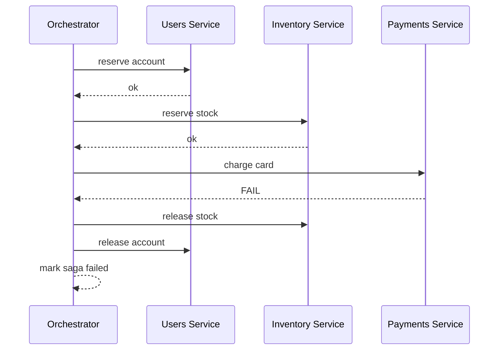
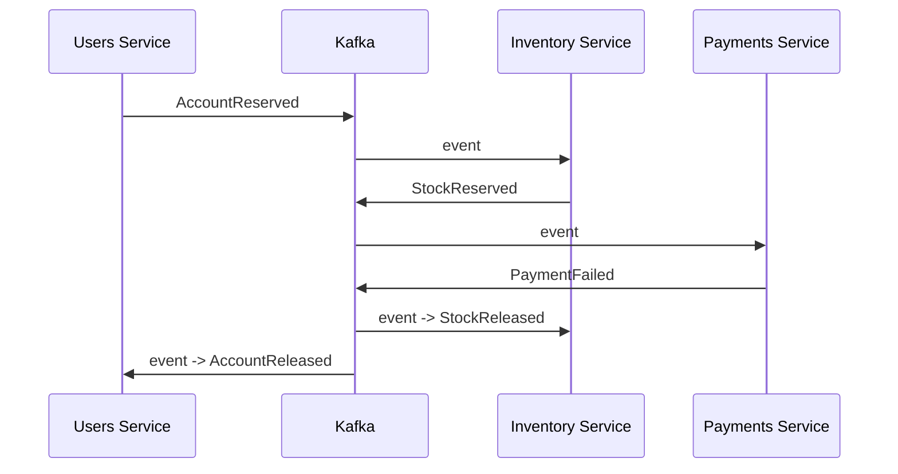
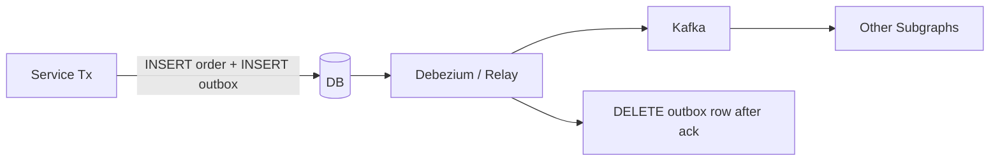
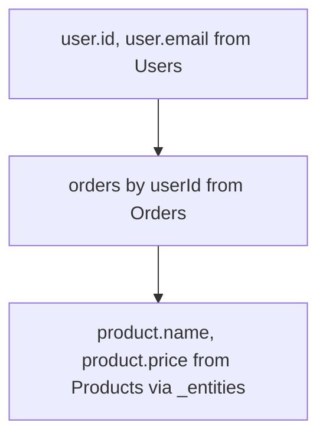
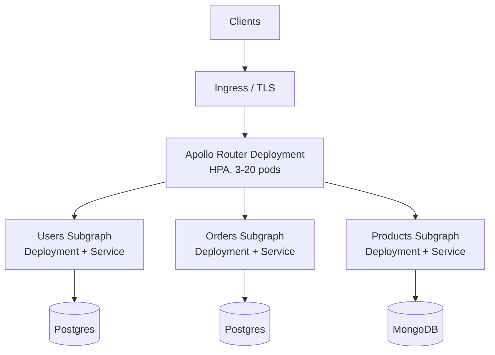

# Federated GraphQL with Polyglot Persistence — DB-per-Subgraph, Saga, Outbox, Query Planning

**Date:** 2026-04-18 | **Updated:** 2026-04-18
**Tags:** `graphql` `federation` `microservices` `saga` `outbox` `dataloader` `architecture`

## Table of Contents

- [Summary](#summary)
- [Database-per-Subgraph Is Not Optional](#database-per-subgraph-is-not-optional)
- [A Polyglot-Persistence Worked Example](#a-polyglot-persistence-worked-example)
- [Entity References Across Stores](#entity-references-across-stores)
- [Cross-Subgraph Writes — The Hard Part](#cross-subgraph-writes--the-hard-part)
  - [Why 2PC Is Off the Table](#why-2pc-is-off-the-table)
  - [Saga — Orchestrated vs Choreographed](#saga--orchestrated-vs-choreographed)
  - [Outbox Pattern](#outbox-pattern)
  - [Idempotency Keys](#idempotency-keys)
- [Query Planning and N+1](#query-planning-and-n1)
  - [How the Router Plans a Query](#how-the-router-plans-a-query)
  - [The Subgraph N+1 and DataLoader](#the-subgraph-n1-and-dataloader)
  - [Representations Batching](#representations-batching)
- [Caching Strategies](#caching-strategies)
- [Observability Across Subgraphs](#observability-across-subgraphs)
- [Deployment Patterns](#deployment-patterns)
  - [Kubernetes Topology](#kubernetes-topology)
  - [Version Skew and Rollouts](#version-skew-and-rollouts)
  - [Contract Testing](#contract-testing)
- [When to Merge or Split Subgraphs](#when-to-merge-or-split-subgraphs)
- [Related](#related)
- [References](#references)

---

## Summary

Federation only earns its complexity budget when subgraphs own different data. "Three services all reading the same Postgres" is not federation — it's three services of technical debt. Real federation means **database-per-subgraph** and usually **polyglot persistence**: users in Postgres, products in MongoDB, sessions in Redis, analytics in ClickHouse. That enforces real service boundaries, but it shifts the hard problems to cross-service coordination — you lose 2PC and gain saga, outbox, and idempotency. It also concentrates performance failure modes around **query planning** and **N+1 across subgraphs**, where one innocent client query can fan out to thousands of DB round-trips unless `DataLoader` and representations-batching are set up correctly. This doc covers the distributed-data patterns every federated system eventually needs.

---

## Database-per-Subgraph Is Not Optional

The core discipline of federation: **each subgraph owns its database; no other service reads or writes it directly**. Cross-service data access always goes through GraphQL. Three reasons:

1. **Schema evolution** — the orders team can add a column, split a table, switch from Postgres to MongoDB, without coordinating with anyone. "The database is internal" is the promise.
2. **Independent scaling** — the products subgraph needs a read replica; the orders subgraph needs Postgres logical replication to a warehouse. Each team makes the call.
3. **Failure isolation** — when the products DB is slow, only the products subgraph degrades. The router can return partial data for the rest of the query (with `@inaccessible` fallbacks or null'd fields).

If two "subgraphs" share a database, they're one subgraph with a split schema. Merge them or move to a real boundary. See [project-structure.md](../architecture/project-structure.md) for the broader service-boundary guidance.

---

## A Polyglot-Persistence Worked Example

Take an e-commerce graph with three subgraphs:

| Subgraph | Store | Driver |
|----------|-------|--------|
| users | PostgreSQL | Spring Data JPA (imperative) |
| products | MongoDB | Spring Data Reactive Mongo |
| sessions | Redis | Spring Data Redis |

Each is a separate Spring Boot service, separate deploy, separate CI pipeline, separate DB credential. The router composes all three into one supergraph.

**Users subgraph (Postgres + JPA):**

```java
@Entity
@Table(name = "users")
public class UserEntity {
    @Id private String id;
    private String email;
}

public interface UserRepository extends JpaRepository<UserEntity, String> {
    List<UserEntity> findAllByIdIn(Collection<String> ids);
}
```

**Products subgraph (MongoDB + reactive):**

```java
@Document("products")
public record Product(@Id String id, String name, BigDecimal price) {}

public interface ProductRepository extends ReactiveMongoRepository<Product, String> {
    Flux<Product> findAllByIdIn(Collection<String> ids);
}
```

**Sessions subgraph (Redis):**

```java
@RedisHash("session")
public record Session(@Id String id, String userId, Instant expiresAt) {}

public interface SessionRepository extends CrudRepository<Session, String> {}
```

Three independent services, three different data models, three different query languages. The router welds them into one graph at the GraphQL layer.

Cross-store referential integrity is the application's job — there's no foreign key from Mongo's `products` to Postgres's `users`. If a user is deleted, the orders subgraph's order rows with `userId` still exist; federation makes the missing reference look like `null` at query time. Soft-delete and tombstone-event patterns usually carry more weight here than hard deletes.

See [Database Configuration](../configurations/database-config.md) for multi-datasource Spring Boot wiring, and [R2DBC Deep Dive](../data-repositories/r2dbc-deep-dive.md) for the reactive Postgres alternative.

---

## Entity References Across Stores

The federation trick: Order in the orders subgraph references User, which lives in a different DB:

```graphql
# orders subgraph
type Order @key(fields: "id") {
  id: ID!
  total: Float!
  customer: User!   # cross-store reference
}

extend type User @key(fields: "id") {
  id: ID! @external
}
```

When a client asks for `order.customer.email`, the router:

1. Calls the orders subgraph to get `{ id, customerId }` (orders doesn't store email).
2. Calls the users subgraph's `_entities` with `{ __typename: "User", id: customerId }`.
3. Users subgraph's entity fetcher does `userRepository.findById(id)`.
4. Router merges responses.

No SQL join, no shared DB. The GraphQL layer is the integration surface.

Key implication: **every entity type needs a cheap lookup-by-key path in its owning subgraph**. If your User is only addressable by `(region, shard, id)` in MongoDB, that's the `@key` — and the entity fetcher must batch-query by that composite key efficiently.

---

## Cross-Subgraph Writes — The Hard Part

Reads across subgraphs are easy — federation is designed for them. Writes aren't.

### Why 2PC Is Off the Table

[Two-phase commit](https://en.wikipedia.org/wiki/Two-phase_commit_protocol) requires all participants to honor a coordinator's decision and a blocking protocol with timeouts. It's brittle across services you don't control, doesn't work well across polyglot stores (Postgres + Mongo + Kafka? pick any two with 2PC support), and introduces a hard dependency on the coordinator. Nobody runs 2PC across microservices in 2026. Not the pattern.

### Saga — Orchestrated vs Choreographed

A [saga](https://microservices.io/patterns/data/saga.html) breaks a distributed transaction into a sequence of local transactions, each with a compensating action if a later step fails.

**Orchestrated saga** — a central orchestrator drives the flow:



**Choreographed saga** — services listen to each other's events via a broker (Kafka, RabbitMQ):



Orchestrated sagas are easier to reason about and observe — one state machine, one place to look when things fail. Choreographed sagas avoid a central point of failure but make "where are we in the flow" hard to answer without tracing.

Rule of thumb: start orchestrated. Move to choreographed only when a subsystem's event fan-out justifies the observability cost. See [event-driven-patterns.md](../messaging/event-driven-patterns.md) for the full pattern library.

### Outbox Pattern

A subgraph that emits an event after a successful local write has a hidden race: "write to DB, then publish to Kafka" can crash between the two, losing the event. The [Outbox pattern](https://microservices.io/patterns/data/transactional-outbox.html) fixes it.

Write the event and the business row in the same DB transaction:

```sql
BEGIN;
  INSERT INTO orders (id, user_id, total, status) VALUES (...);
  INSERT INTO outbox (id, aggregate_type, event_type, payload, created_at)
    VALUES (gen_random_uuid(), 'Order', 'OrderCreated',
            '{"id":"...","userId":"...","total":99.00}'::jsonb, now());
COMMIT;
```

A separate relay (a daemon, a [Debezium](https://debezium.io/) CDC connector, or a [Spring @Scheduled](../events-async/scheduling.md) poller) reads from the outbox table and publishes to Kafka, then marks or deletes the row:



Guarantees: at-least-once delivery, no lost events, no 2PC. Consumers must be idempotent — see below.

See [reactive-kafka.md](../messaging/reactive-kafka.md) and [spring-kafka.md](../messaging/spring-kafka.md) for the consumer side.

### Idempotency Keys

Every saga step and every outbox consumer must be idempotent because retries will happen:

```java
@Transactional
public void handleOrderCreated(OrderCreatedEvent event) {
    if (processedEventRepo.existsById(event.getId())) {
        return;   // already processed
    }
    inventoryService.reserve(event.getProductId(), event.getQty());
    processedEventRepo.save(new ProcessedEvent(event.getId(), Instant.now()));
}
```

Store "processed event IDs" in the same DB as the business data, so idempotency and business writes commit together. Don't skip this — a broker redelivery without idempotency keys is how you end up double-charging customers.

---

## Query Planning and N+1

### How the Router Plans a Query

Given a query like:

```graphql
{
  user(id: "u1") {
    email
    orders {
      id
      product { name price }
    }
  }
}
```

The [Apollo Router](https://www.apollographql.com/docs/router/) builds a **query plan**: a tree of parallel and sequential subgraph calls. For the query above:



Each arrow is a subgraph round-trip. Plans cache by query shape, so a hot endpoint pays the planning cost once. View plans with the router's [`sandbox` UI](https://www.apollographql.com/docs/router/configuration/overview/#sandbox-introspection) or `APOLLO_ROUTER_QUERY_PLANNER_DEBUG=1` logging.

### The Subgraph N+1 and DataLoader

The query plan's last node — "product.name for each order" — is a representations batch. The router sends one call:

```graphql
query ($reps: [_Any!]!) {
  _entities(representations: $reps) {
    ... on Product { name price }
  }
}
```

with `$reps = [{ __typename: "Product", id: "p1" }, { __typename: "Product", id: "p2" }, ...]`. The subgraph's entity fetcher is called **once per ID**:

```java
@DgsEntityFetcher(name = "Product")
public Product resolveProduct(Map<String, Object> values) {
    return productRepo.findById((String) values.get("id")).orElse(null);
}
```

If that fetcher does one DB query per call, you have N+1: 10 orders = 10 `findById` calls. Fix it with a DataLoader:

```java
@DgsDataLoader(name = "productById")
public class ProductBatchLoader implements MappedBatchLoader<String, Product> {

    private final ProductRepository repo;

    public CompletionStage<Map<String, Product>> load(Set<String> ids) {
        return CompletableFuture.supplyAsync(() ->
            repo.findAllByIdIn(ids).stream()
                .collect(Collectors.toMap(Product::id, p -> p)));
    }
}

@DgsEntityFetcher(name = "Product")
public CompletableFuture<Product> resolveProduct(Map<String, Object> values,
                                                 DgsDataFetchingEnvironment env) {
    DataLoader<String, Product> loader = env.getDataLoader("productById");
    return loader.load((String) values.get("id"));
}
```

All `load(...)` calls within one request tick batch into one `findAllByIdIn(Set)`. N+1 → N+2.

### Representations Batching

A second dimension: the router can batch representations across the same subgraph if the query requests multiple root entity types. Configuring the router's `max_representations_per_subgraph_call` lets you tune memory pressure vs round-trip count.

For latency-sensitive paths, measure both:

- **Fan-out** — how many subgraphs does this query hit?
- **Depth** — how many sequential hops does the plan have?

Add response-cache hints (`@cacheControl(maxAge: 60)`) on entity fields that don't change often to let the router short-circuit subgraph calls entirely.

---

## Caching Strategies

Three caching layers in a federated graph:

1. **Gateway response cache** — Apollo Router supports Redis-backed response cache keyed on query + variables + auth claims. Hits never touch subgraphs.
2. **Persisted queries** — clients send a query hash, the server looks up the canonical query; mature clients push persisted queries to CDN cache. See [Apollo persisted queries docs](https://www.apollographql.com/docs/router/configuration/persisted-queries/).
3. **Subgraph entity cache** — each subgraph caches entity lookups (Redis via `@Cacheable`, Caffeine for in-process). Cache keys match `@key` fields exactly so entity fetches are cheap.

For the subgraph layer, Spring's [`@Cacheable`](../configurations/cache-config.md) with a Caffeine cache is the 80/20:

```java
@Cacheable(cacheNames = "product", key = "#id")
public Product findById(String id) {
    return repo.findById(id).orElseThrow();
}
```

Invalidation is the hard part — publish an event on the outbox, consumers evict. Don't reach for distributed cache without considering "what happens when a cache gets stale for 60 seconds".

---

## Observability Across Subgraphs

A single client query can fan out to 5+ subgraph calls, each hitting a different DB. Without distributed tracing, you can't tell which hop is slow.

**OpenTelemetry + federation tracing** is the standard setup:

1. Enable OTel in the [Apollo Router config](https://www.apollographql.com/docs/router/configuration/telemetry/).
2. Each Java subgraph uses [OpenTelemetry Java Agent](https://opentelemetry.io/docs/instrumentation/java/automatic/) or manual Micrometer-OTel bridge.
3. Trace headers propagate via `traceparent` (W3C) — DGS and Spring for GraphQL forward them automatically.
4. Visualize in [Jaeger](https://www.jaegertracing.io/), [Tempo](https://grafana.com/oss/tempo/), or Honeycomb.

A trace of one query shows:

```text
Router
├── plan (1 ms)
├── users._entities (15 ms)
│   └── JDBC findAllByIdIn (12 ms)
├── orders.rootQuery (25 ms)
│   └── JDBC findByUserId (22 ms)
└── products._entities (8 ms)
    └── Mongo find (5 ms)
```

Now "the graph is slow" becomes "orders' `findByUserId` is slow, missing an index on `user_id`".

Metrics to graph:

- Router: query plan cache hit rate, request count, p50/p95/p99 latency per operation name.
- Per subgraph: requests/s, p99 latency, DB pool utilization.
- Entity fetch: calls/s, batch size, cache hit rate.

See [reactive-observability.md](../reactive-observability.md) for the Micrometer wiring, and [actuator-deep-dive.md](../actuator-deep-dive.md) for health and metrics exposure.

---

## Deployment Patterns

### Kubernetes Topology

Typical shape:



- Router is stateless; scale horizontally on CPU.
- Each subgraph is its own Deployment, Service, HPA, PDB, and ServiceMonitor.
- Subgraphs have ClusterIP services — never exposed via Ingress. Only the router is public.
- NetworkPolicies restrict subgraph-to-subgraph traffic; in strict federation, subgraphs only accept traffic from the router namespace.

### Version Skew and Rollouts

Federation tolerates additive schema changes: adding a field, adding a type, adding an `@key`. Rolling out is just a normal deploy; the router re-fetches the supergraph schema (managed federation) or CI re-composes and rolls the router (static composition).

Breaking changes — removing a field, changing a type — require coordination:

1. Mark the field `@deprecated(reason: "use newField")`.
2. Monitor usage (router's ["operation check"](https://www.apollographql.com/docs/graphos/platform/schema-management/checks) tracks it).
3. When usage is 0, remove it, re-compose, deploy.

`@override` helps too: to move `User.email` ownership from users → identity, the identity subgraph declares `email: String! @override(from: "users")`. Clients keep working during the transition.

### Contract Testing

Catch breaking changes before they deploy:

1. `rover subgraph check` in CI — verifies schema composition and client-operation compatibility.
2. Record recent client operations (1–2 weeks) in the schema registry; the check runs new subgraph SDL against them.
3. Pact-style consumer-driven contracts between subgraphs if they call each other via event schemas (Avro/Protobuf).

A subgraph that passes composition check + operation check + local tests is safe to deploy to the supergraph.

---

## When to Merge or Split Subgraphs

Two failure modes:

- **Too few subgraphs** — one mega-subgraph ends up a mini-monolith. Schema reviews stall. Split when domain teams are stepping on each other.
- **Too many subgraphs** — every tiny type gets its own service. Deploy and operations overhead swamps the gain. Merge when two subgraphs share the same DB, team, and deploy cadence.

[Conway's Law](https://en.wikipedia.org/wiki/Conway%27s_law) applies: your subgraph topology will mirror your team topology. Design for the org chart you actually have.

Heuristics:

- One subgraph per team, most of the time.
- Merge subgraphs that share a database.
- Split when a subgraph has > 50 types or > 3 engineers can't keep the schema coherent.
- At Netflix scale, Studio Edge runs >100 subgraphs — but that's a very large org. Most companies top out at 10–30.

---

## Related

- [GraphQL Federation Concepts](federation-concepts.md) — the spec and mental model.
- [Netflix DGS vs Spring for GraphQL](dgs-and-spring-graphql.md) — the Java implementation side.
- [Event-Driven Patterns](../messaging/event-driven-patterns.md) — saga, outbox, CQRS, idempotency.
- [Reactive Kafka](../messaging/reactive-kafka.md) — backpressure-aware Kafka consumers.
- [Spring for Apache Kafka](../messaging/spring-kafka.md) — imperative Kafka.
- [Project Structure and Architecture](../architecture/project-structure.md) — service boundaries.
- [Database Configuration](../configurations/database-config.md) — multi-datasource Spring Boot.
- [R2DBC Deep Dive](../data-repositories/r2dbc-deep-dive.md) — reactive Postgres subgraph.
- [Building a Reactive Data Layer](../data-repositories/reactive-data-layer.md) — Mongo + R2DBC + Redis mix.
- [Cache Configuration](../configurations/cache-config.md) — Caffeine and Redis for subgraph entity caching.
- [Reactive Observability](../reactive-observability.md) — OTel tracing and Micrometer metrics.
- [Actuator Deep Dive](../actuator-deep-dive.md) — subgraph health and readiness probes.
- [JPA Transactions](../jpa-transactions.md) — transactional boundaries inside an entity fetcher.
- [Multithreading Deep Dive](../java-fundamentals/concurrency/multithreading-deep-dive.md) — DataLoader runs on thread pools.

---

## References

- [Apollo Federation documentation](https://www.apollographql.com/docs/federation/) — spec, directives, composition.
- [Apollo Router documentation](https://www.apollographql.com/docs/router/) — query planning, caching, telemetry.
- [Chris Richardson — Saga pattern](https://microservices.io/patterns/data/saga.html)
- [Chris Richardson — Transactional Outbox pattern](https://microservices.io/patterns/data/transactional-outbox.html)
- [Debezium](https://debezium.io/) — CDC-based outbox relay.
- [GraphQL DataLoader specification](https://github.com/graphql/dataloader) — the batching primitive.
- [Netflix DGS documentation](https://netflix.github.io/dgs/)
- [Netflix Tech Blog — How Netflix Scales its API with GraphQL Federation (Part 1)](https://netflixtechblog.com/how-netflix-scales-its-api-with-graphql-federation-part-1-ae3557c187e2)
- [Netflix Tech Blog — Beyond REST (Part 2)](https://netflixtechblog.com/beyond-rest-1b76f7c20ef6)
- [Spring for GraphQL reference](https://docs.spring.io/spring-graphql/reference/)
- [OpenTelemetry Java Agent](https://opentelemetry.io/docs/instrumentation/java/automatic/)
- [W3C Trace Context specification](https://www.w3.org/TR/trace-context/)
- [Conway's Law — Wikipedia](https://en.wikipedia.org/wiki/Conway%27s_law)
