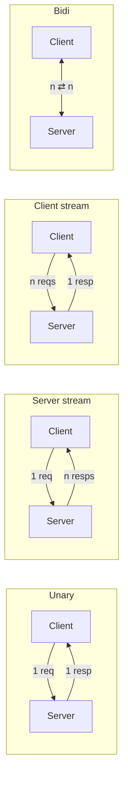

# gRPC in Java — Protobuf, Streaming, Interceptors, Spring Boot

**Date:** 2026-04-19 | **Updated:** 2026-04-19
**Tags:** `grpc` `protobuf` `rpc` `java` `spring-boot` `reactive`

## Table of Contents

- [Summary](#summary)
- [When gRPC Beats REST and GraphQL](#when-grpc-beats-rest-and-graphql)
- [Protobuf Schema](#protobuf-schema)
- [Four RPC Modes](#four-rpc-modes)
- [Server Setup with Spring Boot](#server-setup-with-spring-boot)
- [Client Setup](#client-setup)
- [Interceptors — Auth, Tracing, Metrics](#interceptors--auth-tracing-metrics)
- [Reactor-gRPC Bridge](#reactor-grpc-bridge)
- [Schema Evolution](#schema-evolution)
- [Related](#related)
- [References](#references)

---

## Summary

[gRPC](https://grpc.io/) is a contract-first, HTTP/2-based RPC framework that Google open-sourced in 2015. Services are defined in [Protocol Buffers](https://protobuf.dev/), which generates strongly-typed client and server stubs for Java, Go, Python, C++, and 10+ other languages. Compared to REST + JSON, gRPC gives you ~10x smaller wire payloads, built-in streaming (unary, server-stream, client-stream, bidi), and a cross-language contract that rules out "the JSON field was misspelled" bugs. Compared to GraphQL, gRPC wins on internal service-to-service traffic where you control both ends and care about latency; GraphQL wins for client-facing graphs where flexible queries matter. This doc covers the Java tooling ([grpc-java](https://github.com/grpc/grpc-java)), the Spring Boot starter, four RPC modes, interceptors for auth/tracing/metrics, and the [Reactor-gRPC](https://github.com/salesforce/reactive-grpc) bridge for WebFlux services.

---

## When gRPC Beats REST and GraphQL

| Use case | REST | GraphQL | gRPC |
|----------|------|---------|------|
| Public API | ✅ | ✅ | ❌ (bad browser support) |
| Internal service-to-service | 🟡 | 🟡 | ✅ |
| Mobile ↔ backend | ✅ | ✅ | 🟡 (via gRPC-Web) |
| Streaming (SSE-like) | 🟡 | 🟡 | ✅ |
| Polyglot teams | ✅ | ✅ | ✅ |
| Strong schema at compile time | ❌ | 🟡 | ✅ |
| Human-readable on the wire | ✅ | ✅ | ❌ |

gRPC shines when you control both ends and care about performance, schema discipline, or streaming semantics. It's a poor fit for public APIs (browsers need gRPC-Web proxy; debugging is harder without curl).

---

## Protobuf Schema

`src/main/proto/orders.proto`:

```proto
syntax = "proto3";

package com.example.orders;
option java_multiple_files = true;
option java_package = "com.example.orders.grpc";

service OrderService {
  rpc GetOrder(GetOrderRequest) returns (Order);
  rpc ListOrders(ListOrdersRequest) returns (stream Order);
  rpc UploadOrders(stream UploadOrderRequest) returns (UploadResult);
  rpc Chat(stream ChatMsg) returns (stream ChatMsg);
}

message Order {
  string id = 1;
  string user_id = 2;
  repeated OrderItem items = 3;
  double total = 4;
  int64 created_at_epoch_ms = 5;
}

message OrderItem {
  string product_id = 1;
  int32 qty = 2;
  double unit_price = 3;
}

message GetOrderRequest { string id = 1; }
message ListOrdersRequest { string user_id = 1; int32 page_size = 2; }
message UploadOrderRequest { Order order = 1; }
message UploadResult { int32 created = 1; int32 failed = 2; }
message ChatMsg { string text = 1; int64 ts = 2; }
```

Gradle setup:

```gradle
plugins {
    id 'com.google.protobuf' version '0.9.4'
}

dependencies {
    implementation 'io.grpc:grpc-netty-shaded:1.63.0'
    implementation 'io.grpc:grpc-protobuf:1.63.0'
    implementation 'io.grpc:grpc-stub:1.63.0'
    implementation 'javax.annotation:javax.annotation-api:1.3.2'
    compileOnly 'org.apache.tomcat:annotations-api:6.0.53'
}

protobuf {
    protoc { artifact = 'com.google.protobuf:protoc:3.25.3' }
    plugins { grpc { artifact = 'io.grpc:protoc-gen-grpc-java:1.63.0' } }
    generateProtoTasks { all()*.plugins { grpc {} } }
}
```

Compile generates `OrderServiceGrpc` with server base class, blocking stub, and async stub.

---

## Four RPC Modes



- **Unary** — classic request/response. 95% of RPCs.
- **Server stream** — one request, many responses. Good for feeds, search results.
- **Client stream** — many requests, one response. Upload batches.
- **Bidirectional** — full-duplex. Chat, real-time collab.

---

## Server Setup with Spring Boot

Use the community [grpc-spring-boot-starter](https://github.com/grpc-ecosystem/grpc-spring-boot-starter):

```gradle
implementation 'net.devh:grpc-server-spring-boot-starter:3.1.0.RELEASE'
```

```java
@GrpcService
@RequiredArgsConstructor
public class OrderServiceImpl extends OrderServiceGrpc.OrderServiceImplBase {

    private final OrderRepository repo;

    @Override
    public void getOrder(GetOrderRequest req, StreamObserver<Order> resp) {
        Order order = repo.findById(req.getId())
            .orElseThrow(() -> Status.NOT_FOUND
                .withDescription("order " + req.getId())
                .asRuntimeException());
        resp.onNext(order);
        resp.onCompleted();
    }

    @Override
    public void listOrders(ListOrdersRequest req, StreamObserver<Order> resp) {
        repo.findByUserId(req.getUserId()).forEach(resp::onNext);
        resp.onCompleted();
    }
}
```

`application.yaml`:

```yaml
grpc:
  server:
    port: 9090
    reflection-service-enabled: true      # for grpcurl in dev
```

Status codes: use `Status.NOT_FOUND`, `Status.INVALID_ARGUMENT`, `Status.PERMISSION_DENIED`. Never throw raw exceptions across a gRPC boundary.

---

## Client Setup

```gradle
implementation 'net.devh:grpc-client-spring-boot-starter:3.1.0.RELEASE'
```

```java
@Service
public class OrdersClient {

    @GrpcClient("orders")
    private OrderServiceGrpc.OrderServiceBlockingStub stub;

    public Order get(String id) {
        return stub.getOrder(GetOrderRequest.newBuilder().setId(id).build());
    }
}
```

```yaml
grpc:
  client:
    orders:
      address: static://orders-service:9090
      negotiation-type: plaintext   # use tls in prod
```

For production, use DNS or service-discovery addresses (`dns:///orders-service:9090`) and always `negotiation-type: tls`.

---

## Interceptors — Auth, Tracing, Metrics

Server interceptor for auth:

```java
@GrpcGlobalServerInterceptor
public class AuthInterceptor implements ServerInterceptor {
    @Override
    public <Req, Resp> ServerCall.Listener<Req> interceptCall(
        ServerCall<Req, Resp> call, Metadata headers, ServerCallHandler<Req, Resp> next) {

        String token = headers.get(Metadata.Key.of("authorization", Metadata.ASCII_STRING_MARSHALLER));
        if (!jwtVerifier.isValid(token)) {
            call.close(Status.UNAUTHENTICATED.withDescription("invalid token"), new Metadata());
            return new ServerCall.Listener<>() {};
        }
        return next.startCall(call, headers);
    }
}
```

Tracing: OpenTelemetry's [gRPC instrumentation](https://github.com/open-telemetry/opentelemetry-java-instrumentation) works out of the box — propagates trace headers automatically. See [distributed-tracing.md](../observability/distributed-tracing.md).

Metrics: `grpc-spring-boot-starter` exposes Micrometer metrics under `grpc.server.calls` and `grpc.client.calls`. Standard RED: rate / errors / duration.

---

## Reactor-gRPC Bridge

For WebFlux services, [Reactor-gRPC](https://github.com/salesforce/reactive-grpc) returns `Mono<T>` and `Flux<T>`:

```gradle
implementation 'com.salesforce.servicelibs:reactor-grpc-stub:1.2.4'
```

Generates a second stub that uses reactive types:

```java
@GrpcService
public class OrderReactiveService extends ReactorOrderServiceGrpc.OrderServiceImplBase {

    @Override
    public Mono<Order> getOrder(Mono<GetOrderRequest> reqMono) {
        return reqMono.flatMap(req -> orderRepo.findByIdReactive(req.getId()));
    }

    @Override
    public Flux<Order> listOrders(Mono<ListOrdersRequest> reqMono) {
        return reqMono.flatMapMany(req -> orderRepo.findByUserIdFlux(req.getUserId()));
    }
}
```

Backpressure flows end-to-end through gRPC's HTTP/2 flow control and Reactor's subscription model — critical for streaming endpoints.

---

## Schema Evolution

Protobuf has well-defined evolution rules:

- **Safe (forward + backward compatible):**
  - Add a new field (use a new tag number, make it optional or with default).
  - Remove a field (leave the tag number reserved: `reserved 5;`).
  - Change a field's default value — but be aware old code sees the old default.
  - Add a new enum value at the end.

- **Breaking:**
  - Change a field's type (except compatible ints).
  - Change a field's tag number.
  - Rename a message or field (wire uses numbers, but source compatibility breaks).
  - Change required/optional (in proto3, everything is optional).

Use `reserved` to prevent reuse:

```proto
message Order {
  reserved 7, 8;
  reserved "old_field";
}
```

Schema registry ([Buf Schema Registry](https://buf.build/), Confluent Schema Registry) gates PRs that break compatibility — like GraphQL federation's composition check. Wire into CI.

---

## Related

- [GraphQL Federation Concepts](../graphql/federation-concepts.md) — the other schema-first RPC.
- [Reactive Programming in Java](../reactive-programming-java.md) — Reactor types the reactive bridge uses.
- [Distributed Tracing](../observability/distributed-tracing.md) — OTel's gRPC instrumentation.
- [API Gateway Patterns](../web-layer/api-gateway-patterns.md) — fronting gRPC with HTTP via grpc-gateway or gRPC-Web.
- [Messaging — Event-Driven Patterns](../messaging/event-driven-patterns.md) — gRPC vs messaging for async comms.
- [Distributed Systems Primer](../architecture/distributed-systems-primer.md) — idempotency and retries at the RPC boundary.

---

## References

- [gRPC documentation](https://grpc.io/docs/)
- [gRPC-Java GitHub](https://github.com/grpc/grpc-java)
- [Protocol Buffers documentation](https://protobuf.dev/)
- [grpc-spring-boot-starter](https://github.com/grpc-ecosystem/grpc-spring-boot-starter)
- [Reactor-gRPC](https://github.com/salesforce/reactive-grpc)
- [gRPC HTTP/2 specification](https://github.com/grpc/grpc/blob/master/doc/PROTOCOL-HTTP2.md)
- [Buf Schema Registry](https://buf.build/docs/bsr/overview)
- [gRPC Best Practices](https://grpc.io/docs/guides/performance/)
