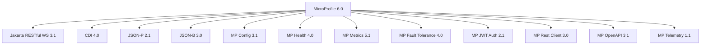

# Helidon MP — MicroProfile and Jakarta EE on a Lightweight Runtime

**Date:** 2026-04-19 | **Updated:** 2026-04-19
**Tags:** `helidon` `microprofile` `jakarta-ee` `cdi` `jax-rs`

## Table of Contents

- [Summary](#summary)
- [What Is MicroProfile](#what-is-microprofile)
- [MicroProfile Specs in Helidon 4](#microprofile-specs-in-helidon-4)
- [JAX-RS — REST Endpoints](#jax-rs--rest-endpoints)
- [CDI — Dependency Injection](#cdi--dependency-injection)
- [MicroProfile Config](#microprofile-config)
- [MicroProfile Health](#microprofile-health)
- [MicroProfile Metrics](#microprofile-metrics)
- [MicroProfile Fault Tolerance](#microprofile-fault-tolerance)
- [MicroProfile Rest Client](#microprofile-rest-client)
- [MicroProfile JWT Auth](#microprofile-jwt-auth)
- [MicroProfile OpenAPI](#microprofile-openapi)
- [Spring Equivalence Table](#spring-equivalence-table)
- [Portability Across Runtimes](#portability-across-runtimes)
- [Related](#related)
- [References](#references)

---

## Summary

Helidon MP is an [Eclipse MicroProfile](https://microprofile.io/) implementation that runs on the same virtual-thread-native [Nima](nima-virtual-threads-architecture.md) web server as [Helidon SE](helidon-se.md). It provides annotation-driven development with [CDI](https://jakarta.ee/specifications/cdi/) for dependency injection and [JAX-RS](https://jakarta.ee/specifications/restful-ws/) (via Jersey) for REST endpoints. If you know Spring Boot, MP feels familiar — decorators, injection, config binding — but the APIs come from Jakarta EE and MicroProfile standards rather than Spring-proprietary annotations. Helidon 4.0 is certified for [MicroProfile 6.0](https://microprofile.io/2023/01/10/microprofile-6-0-release/) and [Jakarta EE 10 Core Profile](https://jakarta.ee/specifications/coreprofile/10/).

---

## What Is MicroProfile

[Eclipse MicroProfile](https://microprofile.io/) is a set of specifications for building microservices on Jakarta EE. It was created in 2016 by IBM, Red Hat, Payara, Tomitribe, and others as a response to Java EE's slow evolution. MicroProfile takes core Jakarta EE specs (JAX-RS, CDI, JSON-P/B) and adds microservice-specific APIs:



MicroProfile is **not** full Jakarta EE — it targets microservices, not monolithic application servers. There is no Servlet API, no JPA, no JMS in the MP spec itself. Helidon MP adds its own extensions for database access, scheduling, and other needs.

---

## MicroProfile Specs in Helidon 4

| Spec | Version | What It Does |
|------|---------|-------------|
| **Jakarta RESTful WS** | 3.1 | `@Path`, `@GET`, `@POST` — REST endpoint definitions |
| **CDI** | 4.0 | `@Inject`, `@ApplicationScoped` — dependency injection |
| **JSON-P / JSON-B** | 2.1 / 3.0 | JSON parsing and object binding |
| **MP Config** | 3.1 | `@ConfigProperty` — externalized configuration |
| **MP Health** | 4.0 | `@Liveness`, `@Readiness` — health check endpoints |
| **MP Metrics** | 5.1 | `@Counted`, `@Timed` — application metrics |
| **MP Fault Tolerance** | 4.0 | `@Retry`, `@CircuitBreaker`, `@Timeout`, `@Fallback`, `@Bulkhead` |
| **MP Rest Client** | 3.0 | Type-safe HTTP client via interface + annotations |
| **MP JWT Auth** | 2.1 | JWT token validation and RBAC |
| **MP OpenAPI** | 3.1 | OpenAPI spec generation from annotations |
| **MP Telemetry** | 1.1 | OpenTelemetry integration |

---

## JAX-RS — REST Endpoints

### Basic Resource

```java
import jakarta.ws.rs.GET;
import jakarta.ws.rs.Path;
import jakarta.ws.rs.PathParam;
import jakarta.ws.rs.Produces;
import jakarta.ws.rs.core.MediaType;

@Path("/greet")
public class GreetResource {

    @GET
    @Produces(MediaType.APPLICATION_JSON)
    public GreetResponse defaultGreeting() {
        return new GreetResponse("Hello, World!");
    }

    @GET
    @Path("/{name}")
    @Produces(MediaType.APPLICATION_JSON)
    public GreetResponse namedGreeting(@PathParam("name") String name) {
        return new GreetResponse("Hello, " + name + "!");
    }
}
```

### Spring Comparison

| JAX-RS | Spring MVC |
|--------|-----------|
| `@Path("/greet")` | `@RequestMapping("/greet")` |
| `@GET` | `@GetMapping` |
| `@POST` | `@PostMapping` |
| `@PathParam("id")` | `@PathVariable("id")` |
| `@QueryParam("q")` | `@RequestParam("q")` |
| `@Produces(APPLICATION_JSON)` | `produces = "application/json"` (or auto) |
| `@Consumes(APPLICATION_JSON)` | `consumes = "application/json"` (or auto) |
| `Response.ok(entity).build()` | `ResponseEntity.ok(entity)` |

The APIs are nearly 1:1. The main difference: JAX-RS uses `@Path` + HTTP method annotations as separate annotations, while Spring combines them into `@GetMapping("/path")`.

### Exception Mapping

```java
import jakarta.ws.rs.core.Response;
import jakarta.ws.rs.ext.ExceptionMapper;
import jakarta.ws.rs.ext.Provider;

@Provider
public class NotFoundMapper implements ExceptionMapper<NotFoundException> {

    @Override
    public Response toResponse(NotFoundException ex) {
        return Response.status(404)
                .entity(new ErrorResponse("NOT_FOUND", ex.getMessage()))
                .build();
    }
}
```

Equivalent to Spring's `@ExceptionHandler` in a `@ControllerAdvice`, but registered via `@Provider` and the `ExceptionMapper` interface.

---

## CDI — Dependency Injection

[CDI](https://jakarta.ee/specifications/cdi/4.0/) is the Jakarta EE standard for dependency injection and contextual lifecycle management.

### Basic Injection

```java
import jakarta.enterprise.context.ApplicationScoped;
import jakarta.inject.Inject;

@ApplicationScoped
public class GreetService {

    private final GreetingConfig config;

    @Inject
    public GreetService(GreetingConfig config) {
        this.config = config;
    }

    public String greet(String name) {
        return config.greeting() + ", " + name + "!";
    }
}
```

### CDI vs Spring DI

| CDI | Spring | Purpose |
|-----|--------|---------|
| `@Inject` | `@Autowired` | Inject a dependency |
| `@ApplicationScoped` | `@Component` / `@Service` (singleton) | Bean with application lifecycle |
| `@RequestScoped` | `@RequestScope` | Bean per HTTP request |
| `@Dependent` | `@Scope("prototype")` | New instance per injection point |
| `@Produces` method | `@Bean` method | Factory method for complex beans |
| `@Qualifier` | `@Qualifier` | Disambiguate multiple implementations |
| `@Named("foo")` | `@Qualifier("foo")` | Named qualifier |
| `@Priority` | `@Order` | Ordering when multiple candidates exist |
| `@Observes` | `@EventListener` | Observe events |

Key differences:

- CDI beans are **discovered** via `beans.xml` or annotated classes. Spring uses component scanning (similar outcome, different mechanism).
- CDI's `@Produces` is equivalent to Spring's `@Bean` — a factory method that creates a bean the container manages.
- CDI has no equivalent of Spring's `@Conditional` annotations. Helidon extends CDI with its own conditional support.

### Producers (Equivalent to @Bean)

```java
import jakarta.enterprise.context.ApplicationScoped;
import jakarta.enterprise.inject.Produces;

@ApplicationScoped
public class DatabaseProducer {

    @Produces
    @ApplicationScoped
    public DataSource dataSource(Config config) {
        HikariConfig hc = new HikariConfig();
        hc.setJdbcUrl(config.get("db.url").asString().get());
        return new HikariDataSource(hc);
    }
}
```

---

## MicroProfile Config

[MP Config](https://download.eclipse.org/microprofile/microprofile-config-3.1/microprofile-config-spec-3.1.html) provides a standard way to read configuration from multiple sources.

### Injection

```java
import org.eclipse.microprofile.config.inject.ConfigProperty;
import jakarta.inject.Inject;

@ApplicationScoped
public class GreetingConfig {

    @Inject
    @ConfigProperty(name = "app.greeting", defaultValue = "Hello")
    private String greeting;

    @Inject
    @ConfigProperty(name = "app.max-retries", defaultValue = "3")
    private int maxRetries;
}
```

### Spring Comparison

| MP Config | Spring | Notes |
|-----------|--------|-------|
| `@ConfigProperty(name = "app.greeting")` | `@Value("${app.greeting}")` | Single property injection |
| `@ConfigProperty(defaultValue = "X")` | `@Value("${app.greeting:X}")` | Default value |
| No direct equivalent | `@ConfigurationProperties(prefix = "app")` | Spring binds entire prefix to a POJO |
| `ConfigProvider.getConfig()` | `Environment.getProperty()` | Programmatic access |

MP Config supports the same source hierarchy as SE Config (system props > env vars > `application.yaml`), plus custom `ConfigSource` implementations.

---

## MicroProfile Health

[MP Health](https://download.eclipse.org/microprofile/microprofile-health-4.0/microprofile-health-spec-4.0.html) exposes health check endpoints for Kubernetes probes.

```java
import org.eclipse.microprofile.health.HealthCheck;
import org.eclipse.microprofile.health.HealthCheckResponse;
import org.eclipse.microprofile.health.Liveness;
import org.eclipse.microprofile.health.Readiness;
import jakarta.enterprise.context.ApplicationScoped;

@Liveness
@ApplicationScoped
public class LivenessCheck implements HealthCheck {

    @Override
    public HealthCheckResponse call() {
        return HealthCheckResponse.up("server");
    }
}

@Readiness
@ApplicationScoped
public class ReadinessCheck implements HealthCheck {

    @Override
    public HealthCheckResponse call() {
        boolean dbOk = checkDatabaseConnection();
        return HealthCheckResponse.named("database")
                .status(dbOk)
                .withData("type", "postgresql")
                .build();
    }
}
```

Exposes at:

- `GET /health/live` — liveness probes (Kubernetes `livenessProbe`)
- `GET /health/ready` — readiness probes (Kubernetes `readinessProbe`)
- `GET /health/started` — startup probes
- `GET /health` — all checks combined

Spring Actuator equivalent: `@Component` implementing `HealthIndicator` + `/actuator/health`.

---

## MicroProfile Metrics

[MP Metrics](https://download.eclipse.org/microprofile/microprofile-metrics-5.1/microprofile-metrics-spec-5.1.html) provides annotation-driven application metrics.

```java
import org.eclipse.microprofile.metrics.annotation.Counted;
import org.eclipse.microprofile.metrics.annotation.Timed;

@Path("/orders")
@ApplicationScoped
public class OrderResource {

    @GET
    @Counted(name = "orders.list.count", description = "Number of order list requests")
    @Timed(name = "orders.list.timer", description = "Time to list orders")
    public List<Order> listOrders() {
        return orderService.findAll();
    }
}
```

Metrics are exposed in Prometheus format at `/metrics`. Spring equivalent: Micrometer `@Counted`, `@Timed` + `/actuator/prometheus`.

---

## MicroProfile Fault Tolerance

[MP Fault Tolerance](https://download.eclipse.org/microprofile/microprofile-fault-tolerance-4.0/microprofile-fault-tolerance-spec-4.0.html) provides declarative resilience annotations — the MicroProfile counterpart to [Resilience4j](https://resilience4j.readme.io/).

```java
import org.eclipse.microprofile.faulttolerance.CircuitBreaker;
import org.eclipse.microprofile.faulttolerance.Fallback;
import org.eclipse.microprofile.faulttolerance.Retry;
import org.eclipse.microprofile.faulttolerance.Timeout;

@ApplicationScoped
public class ExternalApiClient {

    @Retry(maxRetries = 3, delay = 200)
    @Timeout(value = 2, unit = ChronoUnit.SECONDS)
    @CircuitBreaker(requestVolumeThreshold = 10, failureRatio = 0.5,
                    delay = 5, delayUnit = ChronoUnit.SECONDS)
    @Fallback(fallbackMethod = "fallbackData")
    public DataResponse fetchData(String id) {
        return httpClient.get("/data/" + id);
    }

    public DataResponse fallbackData(String id) {
        return DataResponse.cached(id);
    }
}
```

### MP Fault Tolerance vs Resilience4j

| MP Fault Tolerance | Resilience4j | Notes |
|-------------------|-------------|-------|
| `@Retry` | `@Retry` | Nearly identical |
| `@CircuitBreaker` | `@CircuitBreaker` | MP uses annotation params; R4j uses config |
| `@Timeout` | `@TimeLimiter` | Different annotation name |
| `@Fallback` | `fallbackMethod` in `@CircuitBreaker` | MP separates fallback as its own concern |
| `@Bulkhead` | `@Bulkhead` | MP supports semaphore and thread pool |
| Standard spec | Library-specific | MP is portable; R4j is Spring-ecosystem |

---

## MicroProfile Rest Client

[MP Rest Client](https://download.eclipse.org/microprofile/microprofile-rest-client-3.0/microprofile-rest-client-spec-3.0.html) generates type-safe HTTP clients from annotated interfaces — similar to Spring Cloud OpenFeign.

### Interface Definition

```java
import org.eclipse.microprofile.rest.client.inject.RegisterRestClient;
import jakarta.ws.rs.GET;
import jakarta.ws.rs.Path;
import jakarta.ws.rs.PathParam;

@RegisterRestClient(configKey = "user-api")
@Path("/users")
public interface UserApiClient {

    @GET
    @Path("/{id}")
    UserDto getUser(@PathParam("id") long id);

    @GET
    List<UserDto> listUsers();
}
```

### Configuration

```yaml
# application.yaml
user-api:
  url: http://user-service:8080
  connect-timeout: 2000
  read-timeout: 5000
```

### Usage

```java
@Inject
@RestClient
private UserApiClient userApi;

public UserDto findUser(long id) {
    return userApi.getUser(id);
}
```

Spring equivalent: `@FeignClient` (Spring Cloud OpenFeign) or Spring 6's `@HttpExchange` with `HttpServiceProxyFactory`.

---

## MicroProfile JWT Auth

[MP JWT Auth](https://download.eclipse.org/microprofile/microprofile-jwt-auth-2.1/microprofile-jwt-auth-spec-2.1.html) handles JWT validation and role-based access control.

```java
import org.eclipse.microprofile.jwt.JsonWebToken;
import jakarta.annotation.security.RolesAllowed;
import jakarta.inject.Inject;

@Path("/admin")
@ApplicationScoped
public class AdminResource {

    @Inject
    private JsonWebToken jwt;

    @GET
    @RolesAllowed("admin")
    public String adminPanel() {
        return "Hello, " + jwt.getName() + " (groups: " + jwt.getGroups() + ")";
    }
}
```

Configuration:

```yaml
mp:
  jwt:
    verify:
      publickey:
        location: /publicKey.pem
      issuer: https://auth.example.com
```

Spring equivalent: `spring-boot-starter-oauth2-resource-server` with `@PreAuthorize("hasRole('admin')")`.

---

## MicroProfile OpenAPI

[MP OpenAPI](https://download.eclipse.org/microprofile/microprofile-open-api-3.1/microprofile-openapi-spec-3.1.html) generates OpenAPI specs from JAX-RS annotations plus optional `@Operation` / `@Schema` annotations.

```java
import org.eclipse.microprofile.openapi.annotations.Operation;
import org.eclipse.microprofile.openapi.annotations.responses.APIResponse;

@GET
@Path("/{id}")
@Operation(summary = "Get user by ID")
@APIResponse(responseCode = "200", description = "User found")
@APIResponse(responseCode = "404", description = "User not found")
public UserDto getUser(@PathParam("id") long id) {
    return userService.findById(id);
}
```

Spec served at `GET /openapi`. Spring equivalent: `springdoc-openapi` (which also uses annotations to generate OpenAPI specs).

---

## Spring Equivalence Table

| Concern | Spring Boot | Helidon MP |
|---------|------------|-----------|
| DI | `@Autowired`, `@Component`, `@Bean` | `@Inject`, `@ApplicationScoped`, `@Produces` |
| REST | `@RestController`, `@GetMapping` | `@Path`, `@GET`, `@Produces` |
| Config | `@Value`, `@ConfigurationProperties` | `@ConfigProperty` |
| Health | `HealthIndicator`, `/actuator/health` | `@Liveness`/`@Readiness`, `/health` |
| Metrics | Micrometer `@Timed`, `/actuator/prometheus` | MP Metrics `@Timed`, `/metrics` |
| Fault tolerance | Resilience4j | MP Fault Tolerance |
| HTTP client | `RestClient`, WebClient, OpenFeign | MP Rest Client |
| JWT auth | `spring-security-oauth2-resource-server` | MP JWT Auth |
| OpenAPI | springdoc-openapi | MP OpenAPI |
| Exception handling | `@ControllerAdvice` + `@ExceptionHandler` | `@Provider` + `ExceptionMapper` |
| Interceptors | `HandlerInterceptor` | JAX-RS `@Provider` filters/interceptors |

---

## Portability Across Runtimes

Code written against MicroProfile APIs is portable across certified runtimes, but the exact MicroProfile version supported by each runtime changes over time:

| Runtime | Vendor | Notes |
|---------|--------|-------|
| **Helidon MP** | Oracle | Helidon 4.1 is listed by MicroProfile as a compatible implementation for MicroProfile 6.1. |
| **Open Liberty** | IBM | A long-running MicroProfile-compatible runtime; check the MicroProfile compatibility matrix for the currently certified release. |
| **Payara / Payara Micro** | Payara | Commonly used for MicroProfile portability; version support varies by release line. |
| **Quarkus** | Red Hat | Supports many MicroProfile APIs, but check current compatibility and certification details per release. |
| **WildFly** | Red Hat | Historically participates in the ecosystem; verify the current compatible version before relying on exact portability claims. |

If you write a JAX-RS resource with `@Inject` and `@ConfigProperty`, that same class compiles and runs on any of these runtimes. The portability is real for standard MP APIs — but each runtime adds proprietary extensions (Helidon's security providers, Quarkus's Panache, etc.) that are not portable.

---

## Related

- [Helidon Overview](helidon-overview.md) — framework comparison and when to choose Helidon
- [Helidon SE](helidon-se.md) — the functional model with no CDI or annotations
- [Helidon Nima Architecture](nima-virtual-threads-architecture.md) — virtual-thread web server underneath MP
- [Spring Fundamentals](../spring-fundamentals.md) — Spring's IoC, DI, AOP for comparison
- [REST Controller Patterns](../web-layer/rest-controller-patterns.md) — Spring's `@RestController` vs JAX-RS
- [Externalized Configuration](../configurations/externalized-config.md) — Spring's config model vs MP Config
- [Actuator Deep Dive](../actuator-deep-dive.md) — Spring's health/metrics vs MP Health/Metrics
- [OAuth2 and JWT](../security/oauth2-jwt.md) — Spring Security's JWT handling vs MP JWT Auth

## References

- [Eclipse MicroProfile](https://microprofile.io/) — spec home, releases, compatible implementations
- [MicroProfile 6.0 Release](https://microprofile.io/2023/01/10/microprofile-6-0-release/) — spec aligned with Jakarta EE 10
- [Helidon MP Documentation](https://helidon.io/docs/v4/mp/introduction) — official guides
- [Helidon MP Certification — MicroProfile 6.0](https://github.com/helidon-io/helidon/wiki/MicroProfile-6-and-Jakarta-EE-10-Core-Profile-Certification,-Helidon-4) — TCK results
- [Jakarta RESTful Web Services 3.1](https://jakarta.ee/specifications/restful-ws/3.1/) — JAX-RS spec
- [Jakarta CDI 4.0](https://jakarta.ee/specifications/cdi/4.0/) — CDI spec
- [MP Fault Tolerance 4.0 Spec](https://download.eclipse.org/microprofile/microprofile-fault-tolerance-4.0/microprofile-fault-tolerance-spec-4.0.html) — retry, circuit breaker, timeout
- [MP Rest Client 3.0 Spec](https://download.eclipse.org/microprofile/microprofile-rest-client-3.0/microprofile-rest-client-spec-3.0.html) — type-safe HTTP client
- [Helidon MP vs SE — Medium](https://medium.com/oracledevs/helidon-4-3-1-mp-vs-se-spring-boot-ease-virtual-thread-speed-no-bloat-no-compromise-b8841f542541) — Oracle DevRel comparison
