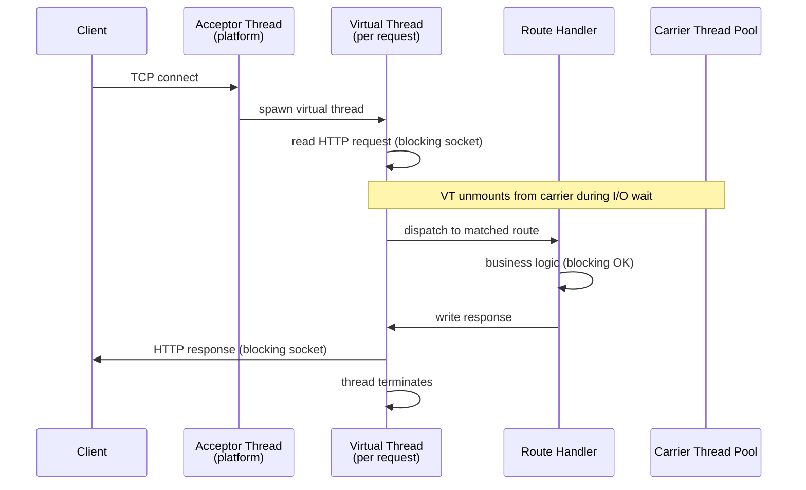
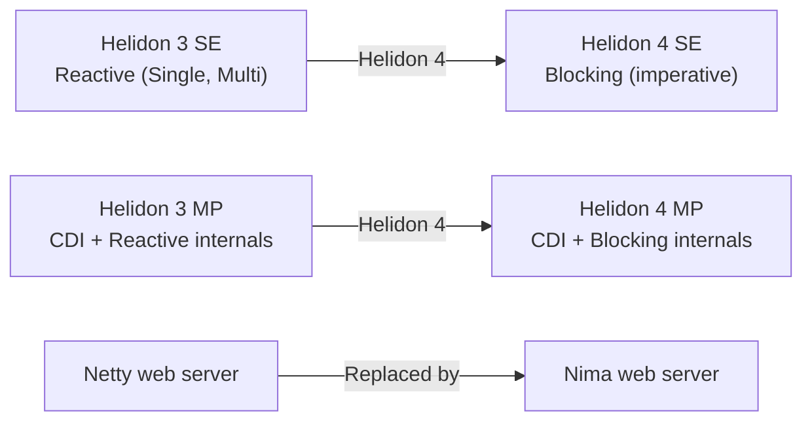

# Helidon Nima — Virtual-Thread-Native Web Server Architecture

**Date:** 2026-04-19 | **Updated:** 2026-04-19
**Tags:** `helidon` `nima` `virtual-threads` `java` `web-server`

## Table of Contents

- [Summary](#summary)
- [What Is Nima](#what-is-nima)
- [Architecture — From Request to Response](#architecture--from-request-to-response)
- [Why Blocking Sockets Beat NIO](#why-blocking-sockets-beat-nio)
- [Nima vs Tomcat on Virtual Threads vs Netty](#nima-vs-tomcat-on-virtual-threads-vs-netty)
- [The Death of Reactive in Helidon](#the-death-of-reactive-in-helidon)
- [Thread Pinning and Carrier Pool](#thread-pinning-and-carrier-pool)
- [Protocol Support](#protocol-support)
- [Performance Characteristics](#performance-characteristics)
- [GraalVM Native Image Advantages](#graalvm-native-image-advantages)
- [Implications for the Reactive vs Virtual Threads Debate](#implications-for-the-reactive-vs-virtual-threads-debate)
- [Related](#related)
- [References](#references)

---

## Summary

Nima (Greek for "thread") is Helidon 4's web server, written from scratch to run on Java 21 [virtual threads](../java-fundamentals/concurrency/virtual-threads.md). Unlike Spring Boot (which retrofits Tomcat/Jetty to use virtual threads) or WebFlux (which uses Netty's event-loop model), Nima was designed with virtual threads as the only execution model — there is no fallback to platform threads or reactive types. The result: the simplicity of thread-per-request programming with throughput comparable to reactive servers, and a codebase free of Netty, Reactive Streams, and non-blocking I/O complexity.

---

## What Is Nima

Nima started as an experimental project inside Oracle's Helidon team to answer one question: **can virtual threads make a blocking web server as fast as a reactive one?** The answer was yes — and the experiment became the foundation of Helidon 4.

Key facts:

- **No Netty** — Nima replaces Netty entirely. The Helidon 4 dependency tree has zero Netty artifacts.
- **Java 21+ required** — Nima uses `Thread.ofVirtual()` from [JEP 444](https://openjdk.org/jeps/444); there is no Java 17 compatibility mode.
- **Blocking I/O by design** — socket reads and writes use `java.net.Socket` (blocking), not `java.nio.channels` (non-blocking).
- **Name merged into Helidon** — Nima was a standalone project through Helidon 4.0.0-M1. From 4.0.0-M2 onward, it is simply "the Helidon web server" — the `nima` package name was absorbed into `io.helidon.webserver`.

---

## Architecture — From Request to Response



### Step by Step

1. **Acceptor thread** (a platform thread) listens on the server socket and accepts incoming TCP connections.
2. For each accepted connection, a **new virtual thread** is spawned via `Thread.ofVirtual().start(...)`.
3. The virtual thread reads the HTTP request from a **blocking `InputStream`**. While waiting for network data, the JVM **unmounts** the virtual thread from its carrier thread, freeing the carrier for other work.
4. The request is routed to the matching handler (via `HttpRouting`).
5. The handler runs on the same virtual thread — it can call databases, HTTP clients, file I/O, all with blocking calls. Each blocking point unmounts the virtual thread.
6. The handler writes the response via a **blocking `OutputStream`**.
7. The virtual thread terminates. There is no thread pooling for virtual threads — each request gets a new one, and the JVM reclaims it after completion.

For HTTP/2, two virtual threads are created per request: one for the connection-level frame reader, one for the request handler.

---

## Why Blocking Sockets Beat NIO

The Helidon team's key finding during Nima development:

> "Best performance is achieved with blocking sockets."

This was counterintuitive. For 15+ years, high-performance Java servers used `java.nio` (non-blocking I/O) with selector-based event loops (the Netty model). With virtual threads, the calculus changes:

| Aspect | NIO + Event Loop (Netty) | Blocking Sockets + Virtual Threads (Nima) |
|--------|--------------------------|------------------------------------------|
| **Thread model** | Fixed thread pool (event-loop group) | Unbounded virtual threads (JVM-managed) |
| **I/O mechanism** | `Selector` + `SocketChannel` | `Socket.getInputStream()` / `getOutputStream()` |
| **Context switching** | User-space (event loop dispatch) | JVM-managed (virtual thread mount/unmount) |
| **Buffer strategy** | Pooled `ByteBuf` (Netty) | Discarded per-request (GC-friendly) |
| **Code complexity** | Callback chains, state machines | Linear, sequential code |
| **Debugging** | Stack traces show event-loop frames | Stack traces show the actual call chain |

Additional findings from the Nima team:

- **Buffer reuse is a net negative** — with virtual threads generating high request volume, the overhead of managing a buffer pool exceeded the cost of allocating and discarding buffers. The JVM's generational GC handles short-lived allocations efficiently.
- **Direct ByteBuffers hurt more than help** — the overhead of managing native memory outweighed the copy-avoidance benefit in this workload pattern.
- **Simpler code is faster code** — eliminating the NIO selector machinery, callback dispatching, and buffer pooling removed thousands of lines of framework code, reducing the instruction path per request.

---

## Nima vs Tomcat on Virtual Threads vs Netty

Three approaches to high-concurrency Java web serving in 2024+:

### 1. Nima (Helidon 4) — Built for Virtual Threads

- Server written from scratch with `Thread.ofVirtual()` and blocking sockets
- No legacy abstraction layers
- Optimal virtual thread integration — every design decision assumes VT

### 2. Tomcat/Jetty on Virtual Threads (Spring Boot 3.2+)

- Existing servlet containers with `spring.threads.virtual.enabled=true`
- Virtual threads replace the platform thread pool in the executor
- The container's internal I/O still uses NIO in many paths
- `synchronized` blocks in legacy code can cause [virtual thread pinning](../java-fundamentals/concurrency/virtual-threads.md)

### 3. Netty Event Loop (Spring WebFlux, Vert.x)

- Non-blocking I/O with a fixed number of event-loop threads
- Reactive types (`Mono`, `Flux`, `Future`) for async composition
- High throughput but complex programming model

### Comparison

| Aspect | Nima | Tomcat + VT | Netty (WebFlux) |
|--------|------|------------|-----------------|
| **Programming model** | Blocking (sequential) | Blocking (sequential) | Non-blocking (reactive) |
| **Thread per request** | Virtual thread | Virtual thread | No (event loop) |
| **I/O layer** | Blocking sockets | NIO (container internals) | NIO (Netty) |
| **Pinning risk** | Low (no `synchronized` in server) | Moderate (legacy `synchronized` in container/libs) | N/A (no virtual threads) |
| **Framework overhead** | Minimal (no Servlet API) | Servlet API + filter chain | Netty pipeline + reactive operators |
| **Debugging** | Clean stack traces | Clean stack traces | Reactive stack traces (hard to read) |
| **Startup** | ~0.6s (SE) | ~1.5–3s (Spring Boot) | ~1.5–3s (Spring Boot) |
| **Ecosystem** | Helidon only | Spring ecosystem | Spring/Vert.x ecosystem |

Nima's advantage is purity — the entire stack, from socket accept to response write, was designed for virtual threads with no legacy NIO code paths. Tomcat + VT is pragmatic — you get most of the benefit while keeping the Spring ecosystem. Netty remains relevant for use cases where reactive backpressure semantics are genuinely needed.

---

## The Death of Reactive in Helidon

Helidon 3 had two models:

- **SE**: reactive (`Single<T>`, `Multi<T>` — Helidon's own reactive types, interoperable with Reactive Streams)
- **MP**: CDI + reactive under the hood

Helidon 4 removed all reactive types from the API:



Why the Helidon team made this choice:

1. **Virtual threads make reactive unnecessary for concurrency** — the only reason to use reactive types was to avoid blocking threads. Virtual threads solve that problem at the JVM level.
2. **Reactive code is harder to write, read, and debug** — operator chains, subscription semantics, and error propagation are complex. Blocking code with try/catch is simpler.
3. **Performance parity** — Nima benchmarks showed blocking-on-virtual-threads matching or exceeding reactive Netty throughput.
4. **Maintainability** — removing reactive types simplified the Helidon codebase dramatically.

This is the most aggressive stance any major Java framework has taken on the "reactive vs virtual threads" question. Spring Boot and Quarkus continue to support both models; Helidon burned the reactive boats.

---

## Thread Pinning and Carrier Pool

Virtual threads can be **pinned** to their carrier thread in two scenarios:

1. **`synchronized` blocks** — the carrier cannot be released while a virtual thread holds a monitor lock
2. **Native method frames** — JNI calls pin the carrier

The Helidon team specifically avoided `synchronized` in the Nima codebase, using `java.util.concurrent.locks.ReentrantLock` instead. This means the server itself does not cause pinning.

However, pinning can still occur in:

- **Application code** using `synchronized` (refactor to `ReentrantLock`)
- **Third-party libraries** with `synchronized` internals (e.g., some JDBC drivers, logging frameworks)
- **JDK internals** — though this is being systematically fixed (e.g., [JEP 491](https://openjdk.org/jeps/491) in JDK 24 removes pinning for synchronized monitors entirely)

The **carrier thread pool** size defaults to the number of available processors. Since virtual threads unmount from carriers during I/O waits, a small carrier pool can service millions of concurrent virtual threads.

---

## Protocol Support

Nima handles multiple protocols on the same server port:

| Protocol | Implementation | Notes |
|----------|---------------|-------|
| **HTTP/1.1** | 1 virtual thread per connection | Keep-alive supported |
| **HTTP/2** | 2 virtual threads per stream | Frame reader + request handler |
| **gRPC** | Over HTTP/2 | Unary, server-stream, client-stream, bidi |
| **WebSocket** | Upgrade from HTTP/1.1 or HTTP/2 | 1 virtual thread per connection |
| **TLS/mTLS** | JSSE with ALPN | TLS 1.3, certificate rotation |

All protocols share the same acceptor thread and virtual thread spawning model.

---

## Performance Characteristics

### Official Numbers (helidon.io)

| Deployment | Startup | Memory (RSS) | Disk |
|-----------|---------|-------------|------|
| **GraalVM Native** | 0.06s | 34 MB | 38 MB |
| **JLink JVM** | 0.39s | 72 MB | 85 MB |
| **Standard JVM** | 0.61s | 70 MB | 333 MB |

### Throughput

The Helidon team reported that Nima achieves throughput **comparable to Netty** on standard benchmarks, while using a blocking programming model. In TechEmpower benchmarks, Helidon 4 consistently ranked in the top tier for JSON serialization and plaintext workloads.

### Why the Numbers Are Good

1. **Minimal framework overhead** — no Servlet API, no filter chain abstraction, no reactive operator pipeline
2. **JVM-optimized scheduling** — virtual thread scheduling is done by the JVM's `ForkJoinPool`, which is highly optimized for work-stealing
3. **GC-friendly allocation** — short-lived request buffers are allocated and discarded (no pooling overhead), fitting perfectly into generational GC's young-gen collection
4. **Small code path** — fewer abstraction layers between socket read and handler invocation

---

## GraalVM Native Image Advantages

Helidon SE is particularly well-suited for [GraalVM native images](../configurations/graalvm-native-image.md):

1. **No runtime reflection for DI** — SE has no CDI container, so there is no reflection-heavy bean discovery to configure for native image
2. **Minimal dynamic proxies** — no AOP proxies, no JDK proxy generation
3. **Small classpath** — fewer libraries means fewer reachability hints needed
4. **Build-time configuration** — Helidon's config API is designed to work with native image constraints

Helidon MP can also be compiled to native image, but CDI's runtime reflection makes it more complex — similar to compiling Spring Boot with GraalVM.

Build a native image:

```bash
mvn package -Pnative-image
./target/helidon-se-demo
# Started in 0.06s
```

---

## Implications for the Reactive vs Virtual Threads Debate

Helidon's experience provides data points for the broader Java ecosystem debate:

### Where Helidon's Approach Wins

- **Simple services** — CRUD microservices, API gateways, lightweight proxies where the programming model complexity of reactive types is not justified
- **Teams without reactive experience** — virtual threads let you write concurrent code that looks like sequential code
- **Debugging and profiling** — stack traces in virtual thread code show the actual call chain, not reactive operator internals
- **GC pressure** — blocking code on virtual threads can generate less GC pressure than reactive code, which creates many short-lived `Mono`/`Flux` operator objects per request (see [GC Impact on Reactive](../jvm-gc/reactive-impact.md))

### Where Reactive Still Has a Role

- **Backpressure** — if a fast producer overwhelms a slow consumer, reactive backpressure propagation is still the cleanest solution. Virtual threads don't solve backpressure.
- **Complex async composition** — `zip`, `merge`, `switchIfEmpty`, `retryWhen` — reactive operators express complex async workflows concisely. Virtual threads require manual `StructuredTaskScope` or `CompletableFuture` for the same patterns.
- **Streaming** — for long-lived streams (SSE, WebSocket message processing), reactive types naturally model ongoing data flow. Virtual threads model request-response better than streams.
- **Existing investment** — teams with deep reactive codebases and expertise may not benefit from migrating

### The Pragmatic View

Virtual threads eliminate the primary motivation for reactive programming (efficient thread utilization) but not all of its benefits (backpressure, declarative async composition). For most microservices, blocking on virtual threads is simpler and fast enough. For streaming-heavy or backpressure-critical workloads, reactive types still have a place.

---

## Related

- [Helidon Overview](helidon-overview.md) — framework positioning and comparison
- [Helidon SE](helidon-se.md) — the functional model running on Nima
- [Helidon MP](helidon-mp.md) — the MicroProfile model running on Nima
- [Virtual Threads in Java](../java-fundamentals/concurrency/virtual-threads.md) — Project Loom, JEP 444, the JVM feature Nima is built on
- [Virtual Threads and Spring Boot](../spring-virtual-threads.md) — Spring's approach: retrofitting Tomcat
- [Reactive Programming in Java](../reactive-programming-java.md) — the model Helidon 4 deliberately replaced
- [Reactor Schedulers and Threading](../reactive/schedulers-and-threading.md) — Netty event-loop model that Nima replaces
- [GC Impact on Reactive, Virtual Threads, and Streaming](../jvm-gc/reactive-impact.md) — allocation patterns differ between models

## References

- [Introducing Helidon Nima — InfoQ](https://www.infoq.com/news/2022/09/introducing-helidon-nima/) — original announcement
- [Helidon 4 Adopts Virtual Threads — InfoQ](https://www.infoq.com/articles/helidon-4-adopts-virtual-threads/) — deep dive on architecture, performance, design decisions
- [Helidon Nima — Helidon on Virtual Threads — Medium](https://medium.com/helidon/helidon-n%C3%ADma-helidon-on-virtual-threads-130bb2ea2088) — Tomas Langer's (lead developer) article
- [Inside Java Podcast #29 — Helidon Nima & Virtual Threads](https://inside.java/2023/01/12/podcast-029/) — interview with the Helidon team
- [Oracle Helidon Taps Virtual Threads — InfoWorld](https://www.infoworld.com/article/2338219/oracle-helidon-taps-virtual-threads-for-pure-performance.html) — performance analysis
- [JEP 444: Virtual Threads](https://openjdk.org/jeps/444) — the JVM feature Nima depends on
- [JEP 491: Synchronize Virtual Threads without Pinning](https://openjdk.org/jeps/491) — JDK 24 fix for the pinning problem
- [Helidon GitHub Repository](https://github.com/helidon-io/helidon) — source code
