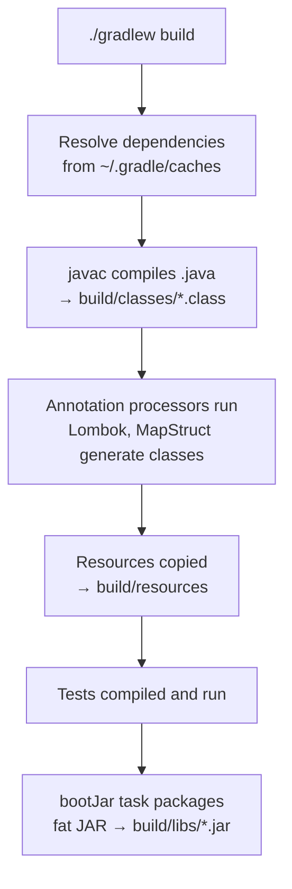
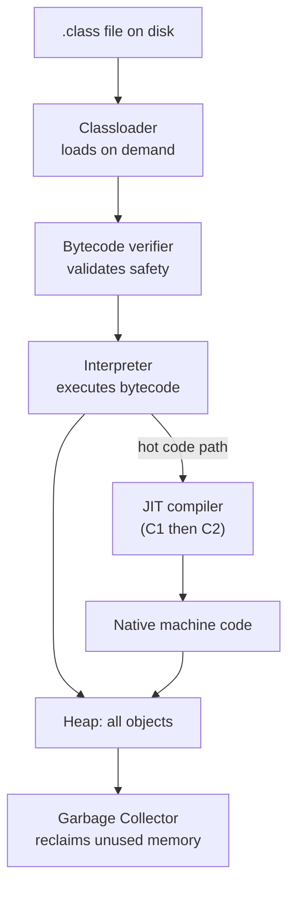

# Build Tools and JVM Basics for TypeScript Developers

_Date: 2026-04-17_
_Updated: 2026-04-24_
_Tags: java, jvm, gradle, maven, build-tools, classpath, jar, fundamentals_

## Table of Contents

- [Summary](#summary)
- [Source to Running App — The Pipeline](#source-to-running-app--the-pipeline)
- [Maven vs Gradle — The Two Build Tools](#maven-vs-gradle--the-two-build-tools)
- [Key Maven Concepts](#key-maven-concepts)
- [Gradle Configuration Walkthrough](#gradle-configuration-walkthrough)
- [Dependency Configurations (Gradle)](#dependency-configurations-gradle)
- [What Actually Happens at Build Time](#what-actually-happens-at-build-time)
- [JAR Files — What's Inside](#jar-files--whats-inside)
- [Classpath — Java's Module Resolution](#classpath--javas-module-resolution)
- [The JVM — What It Actually Does](#the-jvm--what-it-actually-does)
- [Memory Model — Heap and Stack](#memory-model--heap-and-stack)
- [Garbage Collectors](#garbage-collectors)
- [Packaging for Production](#packaging-for-production)
- [Docker for Java Apps](#docker-for-java-apps)
- [Common Gradle Commands](#common-gradle-commands)
- [npm/yarn → Gradle Cheat Sheet](#npmyarn--gradle-cheat-sheet)
- [Related](#related)
- [References](#references)

---

## Summary

Unlike Node.js where `node app.js` just runs your source, Java has a multi-stage
build pipeline: source → bytecode → classpath assembly → JVM execution. Maven
and Gradle manage dependencies (like npm), compilation, packaging (JARs), and
testing. Understanding the JVM basics — classpath, classloaders, JIT, garbage
collection — separates "I wrote some Java" from "I can debug production Java."
This doc walks you from `.java` source all the way to a running JAR in Docker,
with TypeScript/Node analogies along the way. If you want the Node side of the runtime and packaging story in parallel, see [Module Resolution Deep Dive](../../typescript/tooling/module-resolution.md), [V8 Engine Pipeline](../../typescript/runtime/v8-engine-pipeline.md), and [V8 Memory & Garbage Collection](../../typescript/runtime/v8-memory-and-gc.md).

---

## Source to Running App — The Pipeline


### TypeScript / Node vs Java

| Step | TypeScript / Node | Java |
|------|-------------------|------|
| Source | `app.ts` | `App.java` |
| Compile | `tsc` → `app.js` | `javac` → `App.class` (bytecode) |
| Package | `node_modules/` tree | single `.jar` (zip) |
| Runtime | Node runs JS directly (V8 parses + JITs) | JVM loads bytecode, interprets, then JITs hot methods |
| Run command | `node app.js` | `java -jar app.jar` |

Key difference: Java's compile output is not another language's source — it is
**bytecode**, a platform-neutral instruction set. The JVM is the runtime that
loads bytecode and eventually compiles hot paths to native CPU instructions.

---

## Maven vs Gradle — The Two Build Tools

Java has two dominant build tools. Both solve the same problems: dependency
management, compilation, testing, packaging.

| Aspect | Maven | Gradle |
|--------|-------|--------|
| Config file | `pom.xml` (XML) | `build.gradle` (Groovy) or `build.gradle.kts` (Kotlin DSL) |
| Syntax | Declarative, verbose | Scripted, concise |
| Dependencies | `<dependency>` blocks | `implementation 'group:name:version'` |
| Build phases | `clean`, `compile`, `test`, `package`, `install` | Task-based, configurable |
| Speed | Slower (no daemon by default) | Faster (daemon, incremental) |
| Learning curve | Easier to start | More flexible, steeper |
| Wrapper script | `mvnw` / `mvnw.cmd` | `gradlew` / `gradlew.bat` |

This project uses Gradle (see the `build.gradle` at the repo root). Spring Boot
projects typically pick one at project creation via [Spring Initializr](https://start.spring.io)
and stick with it.

---

## Key Maven Concepts

Short primer, since this project uses Gradle — but you will encounter Maven in
the wild constantly.

### Coordinates

Every dependency has three parts: `groupId:artifactId:version`.

```
org.springframework.boot:spring-boot-starter-webflux:3.2.0
└─────────┬───────────┘ └──────────┬─────────────┘ └─┬──┘
     groupId               artifactId             version
```

Loosely like npm's `@scope/name@version`.

### Dependency Scopes

| Scope | When used |
|-------|-----------|
| `compile` | Default — needed to compile and at runtime |
| `provided` | Needed to compile, expected at runtime (e.g., servlet API) |
| `runtime` | Only at runtime (e.g., JDBC driver) |
| `test` | Only for tests |

### Lifecycle

`mvn clean install` is the most common command. It:

1. `clean` — delete `target/`
2. `compile` — run `javac`
3. `test` — run unit tests
4. `package` — build the JAR/WAR
5. `install` — copy the artifact into the local repo `~/.m2/repository`

### Central Repo

Maven Central ([repo.maven.apache.org](https://repo.maven.apache.org/maven2/))
is the equivalent of npmjs.org. Both Maven and Gradle pull from it by default.

---

## Gradle Configuration Walkthrough

A typical Spring Boot `build.gradle` in Groovy DSL:

```groovy
plugins {
    id 'java'
    id 'org.springframework.boot' version '3.2.0'
    id 'io.spring.dependency-management' version '1.1.4'
}

group = 'com.example'
version = '0.0.1-SNAPSHOT'
java {
    toolchain {
        languageVersion = JavaLanguageVersion.of(21)
    }
}

repositories {
    mavenCentral()
}

dependencies {
    implementation 'org.springframework.boot:spring-boot-starter-webflux'
    compileOnly 'org.projectlombok:lombok'
    annotationProcessor 'org.projectlombok:lombok'
    testImplementation 'org.springframework.boot:spring-boot-starter-test'
    testImplementation 'io.projectreactor:reactor-test'
}

tasks.named('test') {
    useJUnitPlatform()
}
```

### Section by section

- **`plugins`** — each plugin adds tasks and configuration. `java` is the base
  plugin for compilation. `org.springframework.boot` adds `bootJar` and
  `bootRun`. `dependency-management` handles BOM-style version alignment so you
  can omit versions on Spring dependencies.
- **`group` and `version`** — project coordinates (like `name` and `version` in
  `package.json`).
- **`java { toolchain }`** — declares which JDK version to compile and run
  with. Gradle can auto-download it.
- **`repositories`** — where to fetch dependencies. `mavenCentral()` is
  default. You can add private repos (e.g., GitHub Packages, JFrog Artifactory).
- **`dependencies`** — declared with a _configuration_ (see the next section)
  and coordinates.
- **`tasks.named('test')`** — tells Gradle to use the JUnit 5 platform runner.

---

## Dependency Configurations (Gradle)

| Config | Meaning | npm equivalent |
|--------|---------|----------------|
| `implementation` | Compile + runtime, not exposed to consumers | `dependencies` |
| `api` | Like `implementation` but exposed to consumers (libraries) | `peerDependencies`-ish |
| `compileOnly` | Needed to compile, not at runtime (e.g., Lombok) | `devDependencies` (partially) |
| `runtimeOnly` | Only at runtime (e.g., JDBC drivers, log bindings) | — |
| `testImplementation` | Test code only | `devDependencies` |
| `testRuntimeOnly` | Test runtime only | — |
| `annotationProcessor` | Annotation processors (Lombok, MapStruct, etc.) | — (Java-specific) |

The `api` vs `implementation` split is Gradle's killer feature for libraries:
if you use `implementation`, consumers of your library do _not_ see your
transitive dependencies on their compile classpath. This is a big win for
encapsulation and incremental compile speed.

---

## What Actually Happens at Build Time



Step by step:

1. Gradle resolves every declared dependency, walking the transitive graph.
   Cached in `~/.gradle/caches/modules-2/`.
2. `javac` compiles your sources. Bytecode lands in `build/classes/java/main`.
3. Annotation processors run _during_ compilation. Lombok, for example, writes
   getters/setters directly into the bytecode.
4. `src/main/resources/**` (YAML, properties, templates) copy verbatim into
   `build/resources/main`.
5. Test compile + run — same pipeline but for `src/test/java`.
6. `bootJar` zips everything — your classes, resources, and every dependency
   JAR — into a single executable "fat JAR".

---

## JAR Files — What's Inside

A JAR is literally a ZIP file with a specific layout. You can `unzip myapp.jar`
and poke at it.

### Plain JAR

```
myapp.jar
├── META-INF/
│   └── MANIFEST.MF          # Main-Class, Class-Path
├── com/example/
│   ├── Application.class
│   └── service/OrderService.class
└── application.yml
```

The `MANIFEST.MF` tells `java -jar` which class has `public static void main`.

### Spring Boot Fat JAR (Uber JAR)

Spring Boot's `bootJar` task nests dependency JARs _inside_ the app JAR and
ships a custom classloader that can load classes from nested JARs:

```
myapp.jar
├── BOOT-INF/
│   ├── classes/   # your compiled code + resources
│   └── lib/       # every dependency JAR, nested
├── META-INF/
│   └── MANIFEST.MF
└── org/springframework/boot/loader/launch/  # loader that can read nested JARs
```

Run it like any JAR:

```bash
java -jar myapp.jar
```

This is the simplest possible deploy artifact: one self-contained file.

---

## Classpath — Java's Module Resolution

The **classpath** tells the JVM where to find `.class` files. It can be:

- a directory containing `.class` files
- a JAR file
- any combination, separated by `:` on Unix or `;` on Windows

```bash
java -cp myapp.jar:lib/*:resources com.example.Main
```

When your code does `import com.example.Foo`, the JVM searches the classpath
in order for `com/example/Foo.class`. **First match wins.**

### Classpath vs node_modules

| Node | Java |
|------|------|
| Each package can have its own copy of a dependency | Only ONE version of a class loads, classpath-wide |
| Conflicts resolved via nested `node_modules/` | Conflicts resolved by classpath order — often silently wrong |
| Isolation is the default | Flatness is the default (hence "JAR hell") |

This is why Java build tools invest so heavily in _version resolution_: a
single process cannot hold two versions of `com.google.guava.Strings` at once.
Gradle and Maven force a single version and warn on conflicts.

The JPMS (Java Platform Module System, Java 9+) partially addresses this, but
most Spring Boot apps still run on the classpath rather than the module path.

---

## The JVM — What It Actually Does



### Key behaviors

- **Classloaders** load classes lazily — `.class` files load when a class is
  first referenced, not at startup.
- **Bytecode verifier** refuses malformed or unsafe bytecode (stack
  underflows, invalid type transitions).
- **Interpreter** executes bytecode directly, one instruction at a time.
- **JIT (Just-In-Time) compiler** — HotSpot has two tiers: C1 (fast compile,
  decent code) and C2 (slower compile, aggressively optimized code). Hot
  methods get compiled to native machine instructions and cached.
- **Garbage Collector** runs concurrently, freeing heap memory that is no
  longer reachable from any live reference.

**Key point:** Java is not interpreted all the way. Steady-state, the
hot 5% of your code runs as native code and is often competitive with C++.
This is why Java microbenchmarks improve dramatically after a warmup phase —
the JIT needs profiling data before it compiles.

---

## Memory Model — Heap and Stack

Java splits runtime memory into two broad regions:

- **Heap** — shared across all threads. Every `new` allocation lives here.
  GC reclaims unreachable objects.
- **Stack** — one per thread. Holds method call frames with primitives
  (`int`, `boolean`, `long`) and _references_ to heap objects.

Example:

```java
String s = "hello";
```

- `s` — a local variable on the stack, holding a reference
- `"hello"` — a `String` object living on the heap (actually in the string
  intern pool, a detail for later)

### Node.js comparison

Node has a GC too (V8's generational collector), but you rarely configure it.
Java lets — and often forces — you to size the heap explicitly in production.

### Key JVM flags

```bash
java -Xms512m -Xmx2g -jar myapp.jar
#    └─ initial heap   └─ max heap
```

- `-Xms` — initial heap size
- `-Xmx` — maximum heap size
- `-XX:+UseG1GC` — pick a GC algorithm
- `-XX:MaxMetaspaceSize=256m` — cap class metadata memory

In Kubernetes, set these based on the pod's memory limit, not the node's.
Recent JDKs (11+) are container-aware and auto-size to cgroup limits, but
explicit flags are still common in production.

---

## Garbage Collectors

You rarely pick the GC yourself; the default is usually correct. Know the
names for ops conversations.

| GC | Typical use | Pause behavior |
|----|-------------|----------------|
| **G1 GC** | Default since Java 9; balanced | Low pauses, tens of ms |
| **ZGC** | Latency-sensitive, large heaps | Sub-millisecond pauses |
| **Shenandoah** | Latency-sensitive (Red Hat) | Sub-10ms pauses |
| **Parallel GC** | Batch jobs, throughput-first | Longer stop-the-world pauses |
| **Serial GC** | Tiny heaps, single-core | Stop-the-world, single thread |

Turn on with `-XX:+UseG1GC`, `-XX:+UseZGC`, etc.

---

## Packaging for Production

Three common shapes:

### 1. Fat JAR

```bash
./gradlew bootJar
java -jar build/libs/myapp.jar
```

Simplest possible artifact. Spring Boot default. Good for most services.

### 2. Thin JAR + separate lib directory

Your code in one JAR, dependencies in `lib/`. Better for Docker layer caching
because dependency layers change rarely. See the layered Dockerfile example
below — it is essentially an automated thin-JAR.

### 3. GraalVM Native Image

Ahead-of-time (AOT) compile the entire app to a single native executable.

```bash
./gradlew nativeCompile
./build/native/nativeCompile/myapp
```

Trade-offs:

- **Pros**: startup in tens of milliseconds, tiny memory footprint (good for
  serverless and CLI tools), no JVM warmup
- **Cons**: longer build times, some dynamic features (reflection, runtime
  bytecode generation) need explicit configuration
- Spring Boot 3 + Java 21 has first-class native image support

---

## Docker for Java Apps

### Simple Dockerfile

```dockerfile
FROM eclipse-temurin:21-jre-alpine
COPY build/libs/myapp.jar app.jar
ENTRYPOINT ["java", "-jar", "/app.jar"]
```

Works, but inefficient — every code change invalidates the single layer and
reships ~200 MB of dependencies.

### Layered JAR for better caching

Spring Boot ships a `layertools` mode that splits a fat JAR into stable
layers (dependencies change rarely, application code changes often):

```dockerfile
FROM eclipse-temurin:21-jre AS builder
WORKDIR /build
COPY myapp.jar .
RUN java -Djarmode=layertools -jar myapp.jar extract

FROM eclipse-temurin:21-jre
COPY --from=builder /build/dependencies/ ./
COPY --from=builder /build/spring-boot-loader/ ./
COPY --from=builder /build/snapshot-dependencies/ ./
COPY --from=builder /build/application/ ./
ENTRYPOINT ["java", "org.springframework.boot.loader.launch.JarLauncher"]
```

Each `COPY` becomes a cached Docker layer. Changing only application code
only busts the last layer — much faster rebuilds and pushes.

### Container-aware JVM flags

```bash
java -XX:MaxRAMPercentage=75 -jar myapp.jar
```

Modern JDKs read cgroup memory limits, so you can size heap relative to the
container's limit rather than a hardcoded `-Xmx`.

---

## Common Gradle Commands

Run these with `./gradlew` (the wrapper) rather than a system-installed
`gradle` — the wrapper pins the version per project.

| Command | What it does |
|---------|--------------|
| `./gradlew build` | Compile + test + package |
| `./gradlew test` | Run tests only |
| `./gradlew bootRun` | Run the Spring Boot app |
| `./gradlew bootJar` | Build the fat JAR |
| `./gradlew clean` | Delete `build/` |
| `./gradlew dependencies` | Show the full dependency tree |
| `./gradlew dependencyInsight --dependency foo` | Why is this version here? |
| `./gradlew --refresh-dependencies` | Force re-download |
| `./gradlew tasks` | List every available task |
| `./gradlew build -x test` | Build but skip tests |
| `./gradlew test --tests "com.example.FooTest"` | Run a specific test |

---

## npm/yarn → Gradle Cheat Sheet

| npm / yarn | Gradle |
|------------|--------|
| `package.json` | `build.gradle` / `build.gradle.kts` |
| `package-lock.json` | `gradle.lockfile` (opt-in) |
| `node_modules/` | `~/.gradle/caches/modules-2/` (shared) |
| `npm install` | `./gradlew build` (downloads on demand) |
| `npm run test` | `./gradlew test` |
| `npm start` | `./gradlew bootRun` |
| `npm run build` | `./gradlew build` |
| `dependencies` in package.json | `implementation` |
| `devDependencies` | `testImplementation` + `compileOnly` |
| `peerDependencies` | `api` (closest analogue) |
| `npx <tool>` | Gradle plugins, configured in `plugins { }` |
| `npm ls` | `./gradlew dependencies` |
| `npm outdated` | `./gradlew dependencyUpdates` (via plugin) |

Two big philosophical differences to remember:

1. **Node installs per-project; Gradle caches globally** in `~/.gradle`. Your
   project dir stays small. Offline builds work once deps are cached.
2. **Node resolves per-package; Java needs a single version.** Gradle will
   pick one version per module in the graph and warn on conflicts.

---

## Related

- [Type System for TS Devs](type-system-for-ts-devs.md) — generics, erasure, primitives vs wrappers.
- [Modern Java Features](modern-java-features.md) — records, sealed types, Java 25 features.
- [JVM Garbage Collection — Concepts](../jvm-gc/concepts.md) — heap layout, generational hypothesis, safepoints.
- [JVM Collectors](../jvm-gc/collectors.md) — Serial, Parallel, G1, ZGC, Shenandoah — decision tree.
- [GraalVM Native Image](../configurations/graalvm-native-image.md) — AOT compilation, native executables.
- [Docker and Deployment](../configurations/docker-and-deployment.md) — containerizing JVM apps, layered JARs.
- [Spring Fundamentals](../spring-fundamentals.md) — the framework that sits on top of all this.
- [javac -parameters flag](../javac-parameters-flag.md) — a subtle compiler flag that affects Spring.
- [Module Resolution Deep Dive](../../typescript/tooling/module-resolution.md) — the Node/TS equivalent of "how code gets found at runtime."
- [V8 Engine Pipeline](../../typescript/runtime/v8-engine-pipeline.md) — the Node runtime/JIT counterpart to JVM execution.
- [V8 Memory & Garbage Collection](../../typescript/runtime/v8-memory-and-gc.md) — the V8 side of heap layout and GC behavior.

## References

- [Gradle User Manual](https://docs.gradle.org/current/userguide/userguide.html)
- [Gradle Java Plugin](https://docs.gradle.org/current/userguide/java_plugin.html)
- [Maven Getting Started](https://maven.apache.org/guides/getting-started/)
- [Spring Boot Reference — Build Tools](https://docs.spring.io/spring-boot/docs/current/reference/html/build-tool-plugins.html)
- [Spring Boot Layered JARs](https://docs.spring.io/spring-boot/docs/current/reference/html/container-images.html#container-images.efficient-images.layering)
- [OpenJDK HotSpot JIT Overview](https://openjdk.org/groups/hotspot/)
- [Eclipse Temurin (OpenJDK builds)](https://adoptium.net/temurin/)
- [GraalVM Native Image](https://www.graalvm.org/latest/reference-manual/native-image/)
