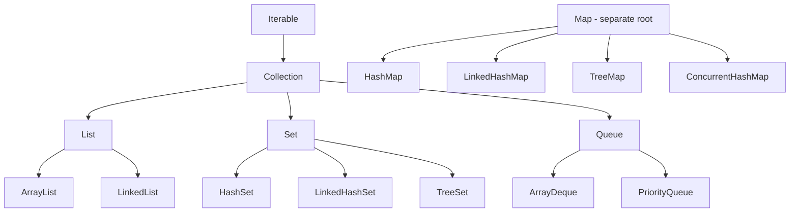
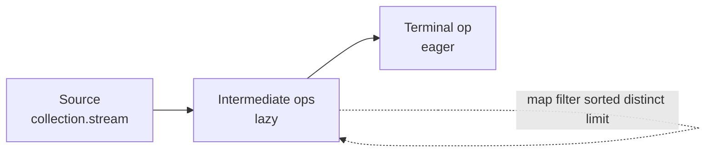

# Collections and Streams for TypeScript Developers

**Date:** 2026-04-17 | **Updated:** 2026-04-17
**Tags:** `java` `collections` `streams` `functional` `fundamentals`

## Table of Contents

- [Summary](#summary)
- [Core Interfaces](#core-interfaces)
- [Creating Collections](#creating-collections)
- [Iteration](#iteration)
- [The Stream API: Javas Array Methods](#the-stream-api-javas-array-methods)
- [Stream Pipeline Structure](#stream-pipeline-structure)
- [Collectors: How to Terminate a Stream](#collectors-how-to-terminate-a-stream)
- [Method References](#method-references)
- [Primitive Streams](#primitive-streams)
- [Parallel Streams](#parallel-streams)
- [Map Operations](#map-operations)
- [Immutable vs Mutable Collections](#immutable-vs-mutable-collections)
- [Common Gotchas for TS Devs](#common-gotchas-for-ts-devs)
- [Related](#related)
- [References](#references)

---

## Summary

Java's Collections Framework is huge, but almost everything day-to-day reduces to three core interfaces: `List`, `Set`, and `Map`. The `Stream` API (Java 8+) is Java's equivalent of the TypeScript/JavaScript array methods you already use every day (`.map()`, `.filter()`, `.reduce()`), but with two superpowers: *lazy evaluation* and optional *parallelism*. Once the translation from TS array methods to Java stream ops clicks, the rest of Java code stops feeling verbose. Learning these idioms is the single biggest productivity unlock for Java code.

---

## Core Interfaces

Java's collection types form a hierarchy rooted at two separate interfaces: `Collection` (for things you iterate) and `Map` (which is not a `Collection` — a frequent source of surprise).



### Implementation Choices

| Interface | Common Impls | When to Use |
|-----------|--------------|-------------|
| `List` | `ArrayList`, `LinkedList` | Ordered, duplicates allowed (default: `ArrayList`) |
| `Set` | `HashSet`, `LinkedHashSet`, `TreeSet` | Unique elements, unordered by default (`LinkedHashSet` preserves insertion order, `TreeSet` sorted) |
| `Map` | `HashMap`, `LinkedHashMap`, `TreeMap`, `ConcurrentHashMap` | Key-value lookup |
| `Queue` / `Deque` | `ArrayDeque`, `PriorityQueue` | FIFO / priority / stack use |

**TS comparison:** TypeScript has `Array`, `Set`, `Map`, and that is it. Java gives you explicit control over the underlying data structure — which matters for performance and for concurrency. Pick `ArrayList` unless you have a reason not to; pick `HashMap` unless you need ordering or thread-safety.

---

## Creating Collections

The humble TS literal `[1, 2, 3]` has many Java equivalents, and the choice matters because some are mutable, some are not, and some have surprising semantics.

```java
// Java 9+ — IMMUTABLE, preferred for literals
List<Integer> nums = List.of(1, 2, 3);

// Mutable copy — when you need to add/remove later
List<Integer> mutableNums = new ArrayList<>(List.of(1, 2, 3));

// Old: Arrays.asList — fixed-size, backed by the array. Avoid in new code.
List<Integer> fixed = Arrays.asList(1, 2, 3);  // .add() throws, .set() mutates the array

// Older idioms
List<Integer> empty = Collections.emptyList();
List<Integer> one   = Collections.singletonList(42);
```

**Maps:**

```java
Map<String, Integer> small = Map.of("a", 1, "b", 2);           // up to 10 pairs
Map<String, Integer> bigger = Map.ofEntries(
    Map.entry("a", 1),
    Map.entry("b", 2),
    Map.entry("c", 3)
);
Map<String, Integer> mutable = new HashMap<>(Map.of("a", 1));
```

**Sets:**

```java
Set<String> tags = Set.of("red", "green", "blue");
```

### Immutability Warning

```java
List<Integer> xs = List.of(1, 2, 3);
xs.add(4);  // UnsupportedOperationException at runtime!
```

**TS analogy:** `List.of(...)` behaves like `Object.freeze([1, 2, 3])` — except Java throws on mutation rather than silently ignoring in non-strict mode. If you need to mutate, wrap it: `new ArrayList<>(List.of(...))`.

---

## Iteration

Java has three common iteration idioms. Pick based on what you need.

### 1. Enhanced for-loop (the TS `for...of` equivalent)

```java
for (String name : names) {
    System.out.println(name);
}
```

This is the default. Use it unless you have a specific reason not to.

### 2. Index-based for-loop (rare — only when you need the index)

```java
for (int i = 0; i < list.size(); i++) {
    System.out.println(i + ": " + list.get(i));
}
```

Avoid on `LinkedList` — `.get(i)` is O(n) there.

### 3. `forEach` with a lambda

```java
names.forEach(name -> System.out.println(name));
names.forEach(System.out::println);  // method reference, same thing
```

**TS comparison:** Java added lambdas in Java 8 to get closer to the functional style TS devs take for granted. The `forEach` form is equivalent to `arr.forEach(fn)`.

---

## The Stream API: Javas Array Methods

This is the key translation table. Memorize it and most Java data-processing code becomes readable.

| TypeScript | Java Stream |
|-----------|-------------|
| `arr.map(fn)` | `stream.map(fn)` |
| `arr.filter(fn)` | `stream.filter(fn)` |
| `arr.reduce(fn, init)` | `stream.reduce(init, fn)` |
| `arr.flatMap(fn)` | `stream.flatMap(fn)` |
| `arr.forEach(fn)` | `stream.forEach(fn)` |
| `arr.find(fn)` | `stream.filter(fn).findFirst()` |
| `arr.some(fn)` | `stream.anyMatch(fn)` |
| `arr.every(fn)` | `stream.allMatch(fn)` |
| `arr.length` | `stream.count()` |
| `[...new Set(arr)]` | `stream.distinct()` |
| `arr.sort()` | `stream.sorted()` |
| `arr.slice(0, 10)` | `stream.limit(10)` |
| `arr.slice(5)` | `stream.skip(5)` |
| `arr.concat(b)` | `Stream.concat(a, b)` |

### A Small Example

```java
// TS:  names.filter(n => n.startsWith("A")).map(n => n.toUpperCase())
List<String> result = names.stream()
    .filter(n -> n.startsWith("A"))
    .map(String::toUpperCase)
    .toList();  // Java 16+
```

**Important:** you must call `.stream()` on a collection first. Unlike TS where array methods live on the array, Java separates the *data structure* (`List`) from the *pipeline* (`Stream`).

---

## Stream Pipeline Structure

Every stream pipeline has exactly three parts:



```java
List<String> upperNames = names.stream()         // source
    .filter(n -> n.startsWith("A"))              // intermediate (lazy)
    .map(String::toUpperCase)                    // intermediate (lazy)
    .sorted()                                    // intermediate (lazy)
    .collect(Collectors.toList());               // terminal (eager)
```

### Lazy Evaluation

Intermediate operations *do not run* until a terminal op is invoked. This is different from TS, where `arr.map(...)` immediately allocates a new array.

```java
Stream<String> pipeline = names.stream()
    .filter(n -> { System.out.println("checking " + n); return n.length() > 3; });
// Nothing prints yet!
pipeline.toList();  // NOW the filter runs
```

### Single-Use

A stream can be traversed *once*. After a terminal op, it is dead.

```java
Stream<String> s = names.stream();
s.count();
s.count();  // IllegalStateException: stream has already been operated upon or closed
```

TS arrays can be iterated infinitely; Java streams cannot. If you need to re-run, call `.stream()` again on the underlying collection.

---

## Collectors: How to Terminate a Stream

`Collectors` is the workhorse of terminal operations. The most-used ones:

```java
// Into collections
List<String> list = stream.collect(Collectors.toList());
List<String> immutable = stream.toList();                  // Java 16+, immutable
Set<String>  set  = stream.collect(Collectors.toSet());

// Into a map (watch for duplicate keys — throws IllegalStateException)
Map<Long, Employee> byId = employees.stream()
    .collect(Collectors.toMap(Employee::getId, Function.identity()));

// With a merge function for duplicates
Map<String, Integer> wordCount = words.stream()
    .collect(Collectors.toMap(w -> w, w -> 1, Integer::sum));
```

### `groupingBy` — SQL GROUP BY for Java

```java
// Group employees by department
Map<String, List<Employee>> byDept = employees.stream()
    .collect(Collectors.groupingBy(Employee::getDepartment));

// Group + aggregate (count per department)
Map<String, Long> countByDept = employees.stream()
    .collect(Collectors.groupingBy(Employee::getDepartment, Collectors.counting()));

// Group + sum
Map<String, Integer> payrollByDept = employees.stream()
    .collect(Collectors.groupingBy(
        Employee::getDepartment,
        Collectors.summingInt(Employee::getSalary)));
```

In TS this requires manual `reduce` gymnastics. Java wins here.

### `partitioningBy` — Boolean Split

```java
Map<Boolean, List<Employee>> split = employees.stream()
    .collect(Collectors.partitioningBy(e -> e.getSalary() > 100_000));
// split.get(true)  -> high earners
// split.get(false) -> others
```

### `joining` — TS `.join()`

```java
String csv = names.stream().collect(Collectors.joining(", "));
String row = names.stream().collect(Collectors.joining(", ", "[", "]"));
```

### One-Shot Stats

```java
IntSummaryStatistics stats = employees.stream()
    .collect(Collectors.summarizingInt(Employee::getSalary));
// stats.getAverage(), getMax(), getMin(), getSum(), getCount()
```

---

## Method References

Method references are shorthand for trivial lambdas. Four flavors:

| Shorthand | Expands to |
|-----------|-----------|
| `String::toUpperCase` | `s -> s.toUpperCase()` (instance method on parameter) |
| `System.out::println` | `x -> System.out.println(x)` (bound instance method) |
| `Integer::parseInt` | `s -> Integer.parseInt(s)` (static method) |
| `Person::new` | `() -> new Person()` (constructor reference) |

```java
names.stream().map(String::toUpperCase).forEach(System.out::println);
```

**TS analogy:** it is like writing `arr.map(String.prototype.toUpperCase.call)` except it actually works and is idiomatic. Reach for method references whenever the lambda is "just call this method".

---

## Primitive Streams

Generic `Stream<T>` works only with reference types, so `Stream<Integer>` pays for autoboxing on every element. For hot paths over numbers, Java has specialized primitive streams:

```java
// Sum 1..99 without autoboxing
int sum = IntStream.range(1, 100).sum();

// Convert a boxed stream to a primitive stream
OptionalInt max = list.stream().mapToInt(Integer::intValue).max();

// Other conveniences
double avg = IntStream.rangeClosed(1, 10).average().orElse(0);
int[] arr  = IntStream.of(1, 2, 3).toArray();
```

Three flavors exist: `IntStream`, `LongStream`, `DoubleStream`. Use `mapToInt` / `mapToLong` / `mapToDouble` to drop from a boxed stream into a primitive one, and `boxed()` to go back.

**TS comparison:** TypeScript has no primitive/boxed split — numbers are numbers. In Java this matters for performance in tight loops.

---

## Parallel Streams

Flip a stream to parallel with `.parallel()` (or `.parallelStream()` on the collection):

```java
long count = hugeList.parallelStream()
    .filter(this::isExpensive)
    .count();
```

### When parallel helps

- CPU-bound work (heavy computation per element)
- Large datasets (thousands to millions)
- Work that is truly independent (no shared state)

### When parallel hurts (or is outright wrong)

- Small data — the fork/join overhead dominates
- Order-sensitive operations (`findFirst` vs `findAny`)
- Shared mutable state (a `HashMap` being written from multiple threads = corrupted)
- I/O-bound work (use reactive or async, not parallel streams)

### Caveat: the common ForkJoinPool

All parallel streams share the JVM-wide `ForkJoinPool.commonPool()` by default. That means a slow stream in one part of your app can starve parallel streams elsewhere. In Spring WebFlux code this is rarely what you want — prefer Reactor's schedulers for concurrency in reactive pipelines.

---

## Map Operations

These are the daily-use map patterns that separate beginner Java from idiomatic Java.

### Build a multimap with `computeIfAbsent`

```java
// Group strings by length. No null checks, no extra lookups.
Map<Integer, List<String>> byLen = new HashMap<>();
for (String s : words) {
    byLen.computeIfAbsent(s.length(), k -> new ArrayList<>()).add(s);
}
```

### Accumulator pattern with `merge`

```java
// Count occurrences
Map<String, Integer> counts = new HashMap<>();
for (String w : words) {
    counts.merge(w, 1, Integer::sum);
}
```

### Default values without null checks

```java
String name = map.getOrDefault(key, "anonymous");
```

### Iterate keys and values together

```java
map.forEach((k, v) -> System.out.println(k + " -> " + v));

// Or stream entries
map.entrySet().stream()
    .filter(e -> e.getValue() > 10)
    .map(Map.Entry::getKey)
    .forEach(System.out::println);
```

### Literal entries

```java
Map.entry("a", 1)   // a Map.Entry<String, Integer>, useful in Map.ofEntries and streams
```

**TS comparison:** `Map` in TS has `.get()`, `.set()`, `.has()`, `.entries()` — simple but lacks Java's `computeIfAbsent` / `merge`. Those two methods eliminate most of the boilerplate TS devs write by hand.

---

## Immutable vs Mutable Collections

Understanding the layers is critical — mixing them up causes real bugs.

| Creation | Behavior |
|----------|----------|
| `List.of(...)` (Java 9+) | Deeply immutable. Mutation throws. No nulls allowed. |
| `Collections.unmodifiableList(list)` | **View** that throws on mutation. But the *underlying* list can still change behind your back. |
| `Collections.emptyList()`, `singletonList(x)` | Immutable singletons. |
| `new ArrayList<>()` | Fully mutable. |
| Guava `ImmutableList.of(...)` | Deeply immutable, predates `List.of`, richer API. |
| Eclipse Collections `Lists.immutable.of(...)` | Separate type hierarchy, strongest guarantees. |

### The `unmodifiableList` gotcha

```java
List<Integer> inner = new ArrayList<>(List.of(1, 2, 3));
List<Integer> view  = Collections.unmodifiableList(inner);
view.add(4);   // UnsupportedOperationException
inner.add(4);  // OK — and `view` now contains 4. Surprise!
```

### Best practice

Prefer immutable. Only reach for `ArrayList` when you *know* you need to mutate. At API boundaries, return `List.of(...)` or `toList()` rather than handing out a mutable reference a caller might keep modifying.

**TS comparison:** TypeScript has `readonly T[]` at the type level but no runtime enforcement. Java `List.of` gives you both a compile-time type (`List<T>` — not distinguishable, sadly) and a runtime guarantee via throwing.

---

## Common Gotchas for TS Devs

### 1. Streams are single-use

```java
Stream<String> s = names.stream();
s.count();
s.count();  // IllegalStateException
```

TS arrays are data. Java streams are pipelines. Re-create the stream for each pipeline.

### 2. `List.of(null)` throws

```java
List.of("a", null, "b");  // NullPointerException
```

Immutable collections reject nulls outright. If you need nulls, use a mutable `ArrayList` — but better, don't use nulls. Reach for `Optional`.

### 3. Sorting nullables requires an explicit comparator

```java
list.stream().sorted(Comparator.nullsFirst(Comparator.naturalOrder())).toList();
```

The natural order comparator throws on null. TS's `.sort()` is permissive; Java is not.

### 4. `toList()` vs `collect(toList())`

- `stream.toList()` (Java 16+) returns an **immutable** list.
- `stream.collect(Collectors.toList())` returns an implementation-defined list — historically mutable `ArrayList`, but don't rely on that.

If you need to mutate the result: `new ArrayList<>(stream.toList())`.

### 5. `HashMap` is not thread-safe

Using a plain `HashMap` from multiple threads can silently corrupt it or cause infinite loops (historically in Java 7). For concurrent access, use `ConcurrentHashMap`. For read-mostly workloads, an immutable `Map.of(...)` is safe by construction.

### 6. `ConcurrentModificationException`

Iterating a collection while mutating it through the collection itself throws:

```java
for (String s : list) {
    if (s.isEmpty()) list.remove(s);  // ConcurrentModificationException
}
```

Correct approaches:

```java
// Option A: removeIf (cleanest)
list.removeIf(String::isEmpty);

// Option B: explicit iterator
Iterator<String> it = list.iterator();
while (it.hasNext()) {
    if (it.next().isEmpty()) it.remove();
}

// Option C: stream to a new list
List<String> cleaned = list.stream().filter(s -> !s.isEmpty()).toList();
```

### 7. Equality in collections

`HashSet` and `HashMap` use `.equals()` + `.hashCode()`. If you put custom objects in without overriding both, lookups behave by reference identity — like using TS `Map` with object keys. Use records (Java 16+) for painless value semantics.

### 8. Generics are erased

`List<String>` and `List<Integer>` are the same type at runtime. You can't overload on them, and you can't create a `new T[]`. This surprises TS devs less than Java devs, because TS types are also erased at compile time.

---

## Related

- [Type System for TS Devs](type-system-for-ts-devs.md) — generics, erasure, primitives vs wrappers.
- [Modern Java Features](modern-java-features.md) — `Stream.toList()`, `mapMulti()`, `teeing()` (Java 16+).
- [Functional Interfaces and Lambdas](functional-interfaces-and-lambdas.md) — `Function`, `Predicate`, `Consumer`, `Supplier` — used everywhere in streams.
- [Optional Deep Dive](optional-deep-dive.md) — `Optional.stream()` for flatMapping optionals in pipelines.
- [Equality and Identity](equality-and-identity.md) — `equals`/`hashCode` contract for `HashSet`/`HashMap` keys.
- [Reactive Programming](../reactive-programming-java.md) — `Flux` is the reactive analogue of `Stream`.
- [Multithreading Deep Dive](multithreading-deep-dive.md) — `ForkJoinPool` powers parallel streams.

---

## References

- [Java Collections Framework Overview](https://docs.oracle.com/en/java/javase/21/core/java-collections-framework.html)
- [`java.util.stream.Stream` Javadoc](https://docs.oracle.com/en/java/javase/21/docs/api/java.base/java/util/stream/Stream.html)
- [`java.util.stream.Collectors` Javadoc](https://docs.oracle.com/en/java/javase/21/docs/api/java.base/java/util/stream/Collectors.html)
- [`java.util.Map` Javadoc](https://docs.oracle.com/en/java/javase/21/docs/api/java.base/java/util/Map.html)
- [JEP 269: Convenience Factory Methods for Collections](https://openjdk.org/jeps/269)
